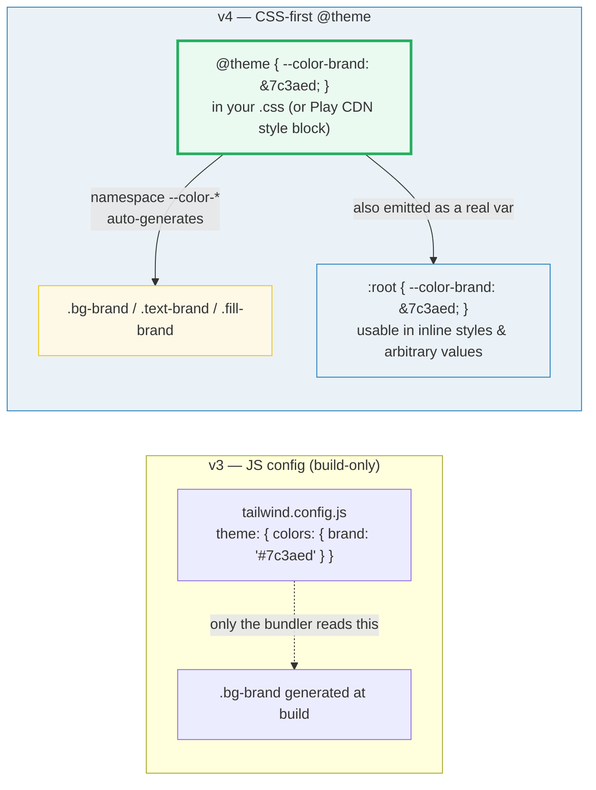
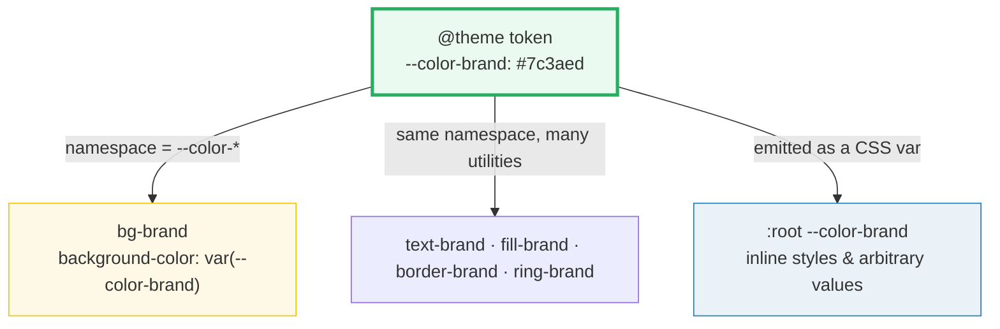

# Tailwind v4 `@theme` Design Tokens

> **Companion demo:** [`tailwind_design_tokens.html`](./tailwind_design_tokens.html) — open in a browser.
> Every resolved value below is read live from that page's DOM (`getComputedStyle`).
> Nothing is hand-waved.

---

## 0. TL;DR — the one idea

> **The analogy:** v4 moved the design system's *control panel* **off the
> dashboard and into the wiring**. In v3 you described your tokens in a separate
> JavaScript file (`tailwind.config.js`) that only a build step could read. In v4
> you declare them as **CSS variables inside an `@theme` block**, and each
> variable's *namespace* (`--color-*`, `--font-*`, `--radius-*` …) tells Tailwind
> **which utility classes to auto-generate**. The same variable is also emitted
> as a real `:root` CSS custom property, so the token is usable *both* as a
> utility (`bg-brand`) *and* as a raw value (`var(--color-brand)`).



---

## 1. How it works

### 1a. The `@theme` directive

`@theme { … }` is a special at-rule. Variables declared inside it are **theme
variables** — they do two things at once:

1. **Generate utilities.** The variable's name **namespace** decides which
   utility-family it feeds. `--color-brand` (namespace `--color-*`) generates
   `bg-brand`, `text-brand`, `fill-brand`, `border-brand`, … `--font-display`
   (namespace `--font-*`) generates `font-display`.
2. **Become a CSS variable.** Tailwind emits `--color-brand` onto `:root`, so it
   is available in inline styles, custom CSS, and arbitrary values.

```css
@import "tailwindcss";
@theme {
  --color-brand: #7c3aed;                    /* -> bg-brand, text-brand ... */
  --font-display: Georgia, "Times New Roman", serif;  /* -> font-display     */
  --radius-card: 1rem;                       /* -> rounded-card            */
}
```

```html
<div class="bg-brand text-white font-display rounded-card">Brand by token</div>
<!-- or use the raw CSS variable anywhere -->
<span style="color: var(--color-brand)">same violet</span>
```

### 1b. The namespace is the contract



A token named with the **wrong prefix does nothing**. `--brand: #7c3aed` (no
namespace) is just a plain CSS variable — it generates **no** utility. The
namespace is what turns a value into a utility-class API.

### 1c. With the Play CDN, `@theme` lives in a `text/tailwindcss` block

The `@tailwindcss/browser` Play CDN processes a `<style type="text/tailwindcss">`
block through Tailwind's compiler. Put `@theme` **there**, not in a normal
`<style>`:

```html
<script src="https://cdn.jsdelivr.net/npm/@tailwindcss/browser@4"></script>
<style type="text/tailwindcss">
  @theme { --color-brand: #7c3aed; }
</style>
```

---

## 2. The default token namespaces

v4's default theme is itself one big `@theme` (in `theme.css`). You extend or
override it by re-declaring variables in the same namespaces:

| Namespace | Example token | Generates |
|---|---|---|
| `--color-*` | `--color-brand: #7c3aed` | color utilities: `bg-brand`, `text-brand`, `fill-brand`, `border-brand` … |
| `--font-*` | `--font-display: Georgia, serif` | font-family: `font-display` |
| `--text-*` | `--text-hero: 3rem` | font-size (+ its line-height): `text-hero` |
| `--font-weight-*` | `--font-weight-bold: 700` | `font-bold` |
| `--tracking-*` | `--tracking-wide: 0.025em` | letter-spacing: `tracking-wide` |
| `--leading-*` | `--leading-tight: 1.25` | line-height: `leading-tight` |
| `--spacing` *(singular)* | `--spacing: 0.25rem` | the **entire** spacing scale (`p-4` = `4 × --spacing`) |
| `--radius-*` | `--radius-card: 1rem` | border-radius: `rounded-card` |
| `--shadow-*` | `--shadow-lg: …` | box-shadow: `shadow-lg` |
| `--blur-*` | `--blur-md: 12px` | filter blur: `blur-md` |
| `--breakpoint-*` | `--breakpoint-3xl: 120rem` | responsive **variants**: `3xl:*` |
| `--container-*` | `--container-md: 28rem` | size: `max-w-md` + container **variants** `@md:*` |
| `--animate-*` | `--animate-spin: spin 1s …` | animation: `animate-spin` |

> **Override vs wipe.** Re-declaring `--breakpoint-sm: 30rem;` overrides one
> value. Setting the whole namespace to `initial` wipes it: `--color-*: initial;`
> removes **every** default color utility. `--*: initial;` disables the default
> theme entirely (a fully custom palette).

---

## 3. Measured: the custom-token utilities actually resolved

The companion `.html` defines `--color-brand: #7c3aed` and `--font-display:
Georgia, serif` in `@theme`, then styles an element with `bg-brand …
font-display`. The gold-check polls `getComputedStyle` (the Play CDN compiles
async) and asserts the resolved values:

> From `tailwind_design_tokens.html` gold-check:
> ```
> .bg-brand      -> background-color channels = 124,58,237   (token #7c3aed)
> .font-display  -> fontFamily has Georgia = true
> :root          -> --color-brand = #7c3aed   (emitted as a real CSS variable)
> [check] bg-brand=rgb(124,58,237), font-display=Georgia: OK
> ```

So one `@theme` declaration produced **both** a generated utility class
(`.bg-brand { background-color: var(--color-brand) }`) **and** a real `:root`
CSS variable — that is the whole v4 token model, proven live.

---

## Killer Gotchas

| Trap | Symptom | Fix |
|---|---|---|
| **No `tailwind.config.js` in v4 by default** | copying a v3 config file does nothing; `bg-brand` from it never exists | define tokens in `@theme` inside your CSS; `tailwind.config.js` is optional/legacy |
| Wrong namespace = no utility | `--brand: #7c3aed` compiles but generates **no** `bg-brand` | use the namespace prefix: `--color-brand` (→ `--color-*`), `--font-display` (→ `--font-*`) |
| `@theme` in a normal `<style>` with the Play CDN | tokens silently ignored; utilities never appear | put `@theme` in `<style type="text/tailwindcss">` (processed by `@tailwindcss/browser`) |
| Asserting immediately after load | `getComputedStyle` reports the UA default — false FAIL | the CDN compiles **async**; poll with `requestAnimationFrame` (~2s) before failing |
| **Play CDN is for prototyping, not prod** | huge CSS, no purging/tree-shaking, runtime compile cost | ship via the build (`@tailwindcss/vite`, PostCSS, or CLI) for production |
| `--color-*: initial;` is nuclear | all default color utilities vanish (no more `bg-red-500`) | only wipe a namespace if you mean to replace it wholesale |
| Referencing another var inside `@theme` | utility resolves to an unexpected value (vars resolve where *defined*, not where *used*) | use `@theme inline { --font-sans: var(--font-inter); }` to inline the value |

### Cheat sheet

```css
/* v4: config lives in CSS, not JS. No tailwind.config.js needed.      */
@import "tailwindcss";

@theme {
  --color-brand: #7c3aed;            /* namespace --color-*  -> bg-brand ...   */
  --font-display: Georgia, serif;    /* namespace --font-*   -> font-display   */
  --radius-card: 1rem;               /* namespace --radius-* -> rounded-card   */
  --breakpoint-3xl: 120rem;          /* namespace --breakpoint-* -> 3xl: variant*/

  --color-*: initial;                /* WIPE the whole color namespace          */
  --*: initial;                      /* disable the ENTIRE default theme        */
}

/* every token is also emitted as a real :root CSS variable:            */
/*   var(--color-brand)  in inline styles, custom CSS, arbitrary values  */
```

```html
<!-- Play CDN: @theme goes in a text/tailwindcss block -->
<script src="https://cdn.jsdelivr.net/npm/@tailwindcss/browser@4"></script>
<style type="text/tailwindcss">
  @theme { --color-brand: #7c3aed; }
</style>
<div class="bg-brand">uses the token</div>
<div style="color: var(--color-brand)">uses the raw var</div>
```

---

## Cross-references

- 🔗 [`selectors_specificity`](../foundations/selectors_specificity.html) — token
  utilities are plain single-class rules (`.bg-brand { … }`), so their
  specificity is low (0,1,0) and predictable — that is *why* they compose.
- 🔗 [`tailwind_cdn_playground`](./tailwind_cdn_playground.html) — the sibling
  bundle: the Play CDN + utility-first basics. This bundle adds the *config*
  layer on top.

---

## Sources

- **Tailwind CSS — *Theme variables* (v4.3 docs):** the `@theme` directive,
  namespaces, and the default-theme reference —
  https://tailwindcss.com/docs/theme
- **Tailwind CSS — *Play CDN* (v4.3 docs):** confirms the CDN URL and that
  `@theme` goes in `<style type="text/tailwindcss">` —
  https://tailwindcss.com/docs/installation/play-cdn
- **Tailwind CSS — *Tailwind CSS v4.0* (blog):** "v4 takes all of your design
  tokens and makes them available as CSS variables by default" — the
  JS-config → CSS-`@theme` move —
  https://tailwindcss.com/blog/tailwindcss-v4
- **Tailwind CSS — *Upgrade guide* (v4):** `tailwind.config.js` is no longer
  created by default; CSS-first configuration —
  https://tailwindcss.com/docs/upgrade-guide
- **Bryan Antonnio — *A First Look at Setting Up Tailwind CSS v4.0* (secondary,
  2025):** independent walkthrough of the `@theme` directive and token
  management —
  https://bryananthonio.com/blog/configuring-tailwind-css-v4/

> **Exact v4 Play CDN URL (pinned):**
> `https://cdn.jsdelivr.net/npm/@tailwindcss/browser@4`
> — `@4` resolves to the latest v4.x (currently **4.3.x**); verified on
> tailwindcss.com/docs/installation/play-cdn and jsDelivr's
> `@tailwindcss/browser` package page.
