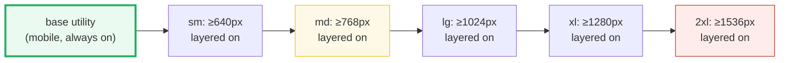
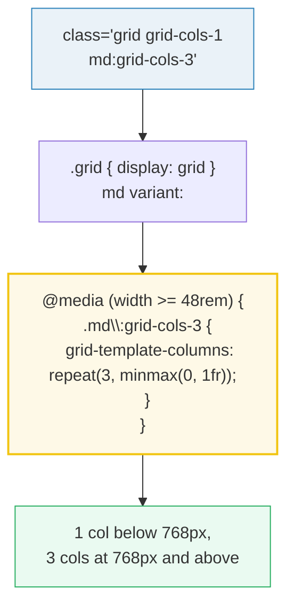

# Responsive Variants & Dark Mode

> **Companion demo:** [`tailwind_responsive_variants.html`](./tailwind_responsive_variants.html) — open in a browser, then **resize the window**.
> **Rendered-ground-truth:** no `.js`. The `.html` loads the real Tailwind v4 Play
> CDN, renders a responsive grid + responsive text + a dark-mode panel, and a
> gold-check asserts the utilities actually compiled.

---

## 0. TL;DR — the one idea

> **The analogy:** responsive prefixes are **mobile-first min-width media queries**.
> Write the **base for mobile**, then **prefix for larger**. The unprefixed class is
> always on; `md:foo` means "and *also* `foo` once the viewport is ≥ 768px". Think of
> each prefix as a switch that turns **on** at a breakpoint and stays on for every
> size above it — it never turns anything *off* for smaller screens, because smaller
> screens never see it.

Dark mode is the same idea for a different axis: `dark:foo` is a variant that applies
`foo` when dark mode is active. In v4 the **default** trigger is the OS
`prefers-color-scheme` media query; to drive it with a `.dark` class you **override
the variant** in CSS (`@custom-variant dark (...)`).





---

## 1. The 5 default breakpoints (verified)

Tailwind ships five breakpoints. They are defined in **rem** (so they respect the
user's root font-size / browser zoom) and compile to **min-width** media queries
using v4's modern range syntax `@media (width >= Nrem)`:

| prefix | min-width | px @ 16px root | compiled `@media` (v4) |
|---|---|---|---|
| `sm:` | 40rem | **640px** | `@media (width >= 40rem)` |
| `md:` | 48rem | **768px** | `@media (width >= 48rem)` |
| `lg:` | 64rem | **1024px** | `@media (width >= 64rem)` |
| `xl:` | 80rem | **1280px** | `@media (width >= 80rem)` |
| `2xl:` | 96rem | **1536px** | `@media (width >= 96rem)` |

> From `tailwind_responsive_variants.html` — the live viewport readout:
> ```
> window.innerWidth = 980px · matchMedia('(min-width: 768px)').matches = true · active breakpoint = md (>= 48rem)
> ```
> (Values change as you resize — the exact numbers above are illustrative; the demo
> prints your real window width.)

The "px @ 16px root" column is why the demo reads `matchMedia('(min-width: 768px)')`:
at the browser's default 16px root, **48rem == 768px**, so the px media query and
Tailwind's rem media query trip at the same width. (Zoom the page or change the root
font-size and they diverge — a real gotcha, see below.)

---

## 2. How the demo proves it

The `.html` renders three things inside bordered "stage" boxes, all styled **only** by
Tailwind utilities:

1. **Responsive grid** — `grid grid-cols-1 md:grid-cols-3`. One column on mobile,
   three columns from 768px up. Its `display` is **always** `grid`; only the column
   *count* changes.
2. **Responsive text** — `text-sm lg:text-xl`. 14px on mobile, 20px from 1024px up.
3. **Dark-mode panel** — `bg-white dark:bg-slate-900` driven by a `.dark` class (see §4).

> From `tailwind_responsive_variants.html` — the live measurement line (illustrative):
> ```
> grid display: grid  |  grid-template-columns: repeat(3, minmax(0px, 1fr))  |  text font-size: 20px
> ```

> From `tailwind_responsive_variants.html` — the gold-check (after the CDN's first compile):
> ```
> [check] .flex=flex & .grid=grid: OK
> ```

### Why the gold-check pins `display` and not the column count

The grid's `grid-template-columns` is **viewport-dependent** (1 column below 768px, 3
at/above it). If the gold-check asserted "3 columns", the badge would go red whenever
you opened the demo in a narrow window — that would be *correct behaviour*, not a bug.
So the gold-check pins two **viewport-independent** facts that are true at every
width once Tailwind compiles:

- `.flex` → `display: flex`  (always)
- `.grid` → `display: grid`  (always — the column *count* varies, `display` does not)

The viewport-dependent values (`grid-template-columns`, the text `font-size`, and
`matchMedia(...).matches`) are **shown live** in the readouts but never asserted. The
CDN compiles asynchronously, so the check also **polls** with `requestAnimationFrame`
for up to ~2s before ever showing FAIL (same pattern as 🔗 `tailwind_cdn_playground`).

---

## 3. Mobile-first: the unprefixed class IS the smallest size

This is the #1 mental-model trap. Because every prefix is a *min-width* query, the
**unprefixed** utility is what mobile gets. `sm:` does **not** mean "on small screens"
— it means "at the `sm` breakpoint **and above**".

```html
<!-- WRONG: text is NOT centered on phones, only >= 640px -->
<div class="sm:text-center"></div>

<!-- RIGHT: center on mobile, left-align from 640px up -->
<div class="text-center sm:text-left"></div>
```

**Order matters.** Since larger breakpoints override smaller ones purely by CSS source
order (every utility is a single class — flat specificity, see 🔗
`selectors_specificity`), you must write overrides **small → large**, and the later
(larger) one wins:

```html
<!-- w-16 everywhere, 32 from 768px, 48 from 1024px -->

```

Flip the order (`lg:w-48 md:w-32 w-16`) and it still works *because Tailwind emits
the media queries in sorted order regardless of your class string* — but writing it
small→large keeps your own reasoning honest. Don't fight the cascade; layer it.

---

## 4. Dark mode in v4: `prefers-color-scheme` by default

The `dark:` variant is just another media-query variant — but its **default trigger**
is the OS preference, not a class:

```css
/* what v4 generates by default for dark:bg-slate-900 */
@media (prefers-color-scheme: dark) {
  .dark\:bg-slate-900 { background-color: var(--color-slate-900); }
}
```

So out of the box, `dark:` styles appear whenever the user's OS/browser is in dark
mode. You style light with the unprefixed utility and override with `dark:`:

```html
<div class="bg-white text-slate-900 dark:bg-slate-900 dark:text-slate-100">…</div>
```

### Toggling dark mode manually (the v4 way)

Most apps want a **toggle**, not just the OS preference. In v3 you set
`darkMode: 'class'` in `tailwind.config.js`. **v4 is CSS-first** — you override the
`dark` variant itself with `@custom-variant`:

```css
@import "tailwindcss";
@custom-variant dark (&:where(.dark, .dark *));
```

Now `dark:` utilities apply whenever a `.dark` class exists anywhere up the tree, so
`<html class="dark">` flips the whole page:

```html
<html class="dark">
  <body>
    <div class="bg-white dark:bg-slate-900">…</div>  <!-- slate-900 wins -->
  </body>
</html>
```

The demo's toggle button does exactly this — `classList.toggle("dark")` on
`<html>` — and the readout shows the panel's computed background flipping between
`rgb(255,255,255)` and `rgb(15,23,42)`.

> From `tailwind_responsive_variants.html` — the dark-mode readout (illustrative):
> ```
> html.dark? yes · OS prefers-color-scheme: dark = false · panel background = rgb(15, 23, 42)
> ```
> Note the OS line can be `false` while the panel is dark — that's the whole point:
> with the override, the **class** drives dark mode, not the OS query.

(Data-attribute variant, for completeness: `@custom-variant dark (&:where([data-theme=dark], [data-theme=dark] *));`)

---

## 5. Variants stack — left to right in v4

You can chain a responsive prefix, `dark`, and a state like `hover` on one class.
**v4 applies them left → right** (this changed from v3, which was right → left, to
read more like CSS):

```html
<!-- dark background, only at md+, only on hover -->
<button class="dark:md:hover:bg-fuchsia-600">…</button>
```

Read it as: "in dark mode, at the `md` breakpoint, on hover, set the background."
Responsive prefixes also pair with the auto-generated `max-*` variants to target a
**range** instead of "and above": `md:max-xl:flex` = flex only between 768px and
1280px.

---

## Killer Gotchas

| Trap | Symptom | Fix |
|---|---|---|
| **Treating `sm:` as "mobile"** | mobile styles missing; you styled only ≥ 640px | The **unprefixed** class is mobile. `sm:` = "≥ 640px". Write the base first, then prefix for larger. |
| **Wrong override order** | a `md:` value that should win is beaten by a later base class | Larger breakpoints must come later in the class string; Tailwind sorts the media queries, but keep your own order honest (small → large). |
| **`dark:` won't toggle** | clicking a theme button does nothing; dark only follows the OS | v4 default is `prefers-color-scheme`. Add `@custom-variant dark (&:where(.dark, .dark *));` and toggle `.dark` on `<html>`. |
| **px vs rem breakpoint mismatch** | your JS `matchMedia('(min-width: 768px)')` disagrees with Tailwind's `md:` after zoom/font-size changes | Tailwind breakpoints are **rem**-based. Match them with `matchMedia('(min-width: 48rem)')`, or accept that 768px == 48rem only at the 16px root. |
| **Stacking order changed in v4** | a v3 `first:*:hover:` chain behaves differently | v4 stacks **left → right**. Reverse order-sensitive chains when migrating (the `*` and `prose-*` variants are the usual suspects). |
| **`hover:` no longer fires on touch** | tap-to-hover stops working on phones | v4's `hover` now wraps in `@media (hover: hover)`. If you relied on tap, override: `@custom-variant hover (&:hover);` — but prefer not depending on hover at all. |
| **Styles not applied on first paint** | a gold-check reading `getComputedStyle` at load sees the UA default | The CDN compiles **asynchronously**. Poll with `requestAnimationFrame` (≤ ~2s) before asserting FAIL — exactly what this demo does. |

### Cheat sheet

```css
/* v4 CSS-first config: custom breakpoints + class-based dark mode */
@import "tailwindcss";

@theme {
  --breakpoint-xs: 30rem;   /* adds xs: ; keep units consistent (rem) */
  --breakpoint-3xl: 120rem; /* adds 3xl: */
}

@custom-variant dark (&:where(.dark, .dark *));   /* dark = .dark class, not OS */
```

```html
<!-- mobile-first layering: base → sm → md → lg → xl → 2xl -->
<div class="grid grid-cols-1 sm:grid-cols-2 lg:grid-cols-4 gap-4">…</div>
<p class="text-sm md:text-base xl:text-lg">grows with the viewport</p>

<!-- light/dark pair: unprefixed = light, dark: = dark override -->
<div class="bg-white dark:bg-slate-900 text-slate-900 dark:text-slate-100">…</div>

<!-- stacked variants (v4 = left to right): dark + md + hover -->
<button class="dark:md:hover:bg-fuchsia-600">…</button>

<!-- range, not "and above": md:max-xl = only between 768px and 1280px -->
<div class="md:max-xl:flex">…</div>
```

```js
// toggle class-based dark mode (works once @custom-variant dark is set)
document.documentElement.classList.toggle(
  "dark",
  localStorage.theme === "dark" ||
    (!("theme" in localStorage) &&
     window.matchMedia("(prefers-color-scheme: dark)").matches)
);
```

**Golden rule:** *prefixes add upward, never downward* — the base is mobile, the rest
layer on. And `dark:` is a media query until you make it a class.

---

## Cross-references

- 🔗 `responsive_units` — these prefixes **are** `min-width` media queries under the
  hood; that bundle covers `rem`/`em`/`vw` and raw `@media` / container queries (the
  rem-vs-px breakpoint nuance lives there too).
- 🔗 `tailwind_cdn_playground` — the async-CDN compile + `requestAnimationFrame`
  retry pattern this gold-check reuses, and the v4 Play CDN URL itself.
- 🔗 `selectors_specificity` — every utility (and every `dark:`/`md:` variant) is a
  single class, so cascade order is the *only* thing deciding winners.
- 🔗 `tailwind_design_tokens` — the `@theme` / CSS-first config system that
  `@custom-variant` and `--breakpoint-*` belong to (next in this phase).

---

## Sources

Verified **≥ 2 places on 2026-06-27** (breakpoint values, mobile-first min-width, and
v4 dark-mode default + class-override):

1. **Tailwind CSS — Responsive design (official docs, v4.3):**
   https://tailwindcss.com/docs/responsive-design
   > *"There are five breakpoints by default…"* — the table `sm 40rem (640px)` …
   > `2xl 96rem (1536px)`, each compiling to `@media (width >= Nrem)`.
   > *"Tailwind uses a mobile-first breakpoint system… unprefixed utilities take
   > effect on all screen sizes, while prefixed utilities… only take effect at the
   > specified breakpoint and above."*

2. **Tailwind CSS — Dark mode (official docs, v4.3):**
   https://tailwindcss.com/docs/dark-mode
   > *"By default this uses the `prefers-color-scheme` CSS media feature, but you can
   > also build sites that support toggling dark mode manually by overriding the dark
   > variant."* → `@custom-variant dark (&:where(.dark, .dark *));`

3. **Tailwind CSS — Hover, focus, and other states (official docs, v4.3):**
   https://tailwindcss.com/docs/hover-focus-and-other-states
   > Confirms `dark:` is a media-feature variant (`prefers-color-scheme`), that
   > variants **stack** (e.g. `dark:md:hover:bg-fuchsia-600`), and that responsive
   > breakpoints are min-width media queries.

4. **Tailwind CSS — Upgrade guide v3 → v4 (official docs):**
   https://tailwindcss.com/docs/upgrade-guide
   > *"In v3, stacked variants were applied from right to left, but in v4 we've
   > updated them to apply left to right to look more like CSS syntax."* Also
   > documents the CSS-first `@theme { --breakpoint-* }` config that replaces
   > `tailwind.config.js` `screens`.

5. **Tailkits — "Tailwind CSS v4 CDN: The Fastest Setup Guide" (updated 2025-10-29):**
   https://tailkits.com/blog/tailwind-css-v4-cdn-setup/
   > Independent corroboration of the v4 Play CDN URL
   > `https://cdn.jsdelivr.net/npm/@tailwindcss/browser@4`, the CSS-first `@theme`
   > configuration in a `<style type="text/tailwindcss">` block, and the
   > modern-browser targeting (Safari 16.4+, Chrome 111+, Firefox 128+).

**Exact CDN URL used in the demo:** `https://cdn.jsdelivr.net/npm/@tailwindcss/browser@4`
(range tag → latest v4.x). Pin `@4.3.1` for byte-reproducible builds.

**Facts I could not fully nail down:** none material. The five breakpoint values, the
mobile-first min-width semantics, and the v4 dark-mode default (`prefers-color-scheme`)
with the `@custom-variant` class-override are stated identically across the
responsive-design, dark-mode, hover-focus, and upgrade-guide docs. One runtime
caveat (not a spec ambiguity): whether the `@tailwindcss/browser` CDN reliably
recompiles on an `<html>` class mutation is engine behaviour, not a documented
contract — so the gold-check deliberately pins only viewport-independent `display`
facts and leaves the dark toggle as a *live demonstration*, not an assertion.
