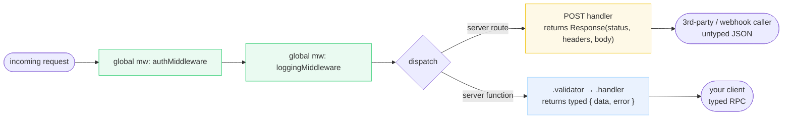

# API Endpoints &amp; Middleware

> **Companion demo:** [`api_endpoints_middleware.html`](./api_endpoints_middleware.html) — open in a browser.
> The interactive request visualizer. Every claim below is rendered live and pinned
> by its `[check: OK]` gold-check.

> **Note on naming.** TanStack Start renamed **"API Routes" → "Server Routes"** during the beta.
> The old `createAPIFileRoute()` and the `src/api.ts` entry handler were removed. This guide uses the
> current terminology ("Server Routes") and the current API (`createFileRoute + server`).
> "API endpoint" is kept only as the familiar mental model.

---

## 0. TL;DR — the one idea

> **The analogy:** an **API endpoint** (Server Route) is a raw HTTP handler returning a `Response` —
> for **webhooks, 3rd-party callers, JSON/RSS/image APIs**. A **server function** is typed RPC for
> **YOUR app code**. **Middleware** is the per-request chain that **wraps both** — auth, logging,
> context injection. The middleware doesn't care which surface you hit; the handler's *return shape*
> is what differs.



The two green middleware nodes run on **every** server request — server routes, SSR, *and* server
functions. They are not optional and not per-surface.

---

## 1. The current file convention (verified)

> **IMPORTANT — verified against the official docs as of the v0/stable guide.** The current endpoint
> convention is **`createFileRoute('/path')({ server: { handlers: { METHOD } } })`**, a file in
> **`src/routes/`** (the same directory as your app routes). This replaces three older forms, all now
> **deprecated/removed**:

| Form | Status | Source |
|---|---|---|
| `createFileRoute('/path')({ server: { handlers: { POST } } })` | **CURRENT** | tanstack.com/start server-routes guide |
| `createAPIFileRoute('/path')({ POST })` | **DEPRECATED** — removed in the beta rename "API Routes" → "Server Routes" | answeroverflow thread; GitHub discussion #2863 |
| `createServerFileRoute('/path')({ POST })` (intermediate) | superseded — unified into `createFileRoute({ server })` | the server-routes guide |
| `src/api.ts` entry handler + `src/api/` directory | **REMOVED** — delete `src/api.ts` to migrate | GitHub discussion #2863 |

A file at `src/routes/api/webhook.ts` maps to the URL `/api/webhook` — the `api/` segment is just a
path prefix, **not** a special directory.

```ts
// src/routes/api/webhook.ts — the CURRENT convention
import { createFileRoute } from '@tanstack/react-router'
import { rawBodyMiddleware } from '#/middleware'

export const Route = createFileRoute('/api/webhook')({
  server: {
    middleware: [rawBodyMiddleware],          // route-level (all methods)
    handlers: {
      POST: async ({ request, context }) => {
        const event = await verifyStripeSignature(request, context.rawBody)
        await db.insertEvent(event)
        // returns a raw Response — status / headers / body are YOUR job
        return new Response(JSON.stringify({ received: true }), {
          status: 200,
          headers: { 'Content-Type': 'application/json' },
        })
      },
    },
  },
})
```

Each method handler receives `{ request, params, context }` and returns a `Response` (or
`Promise<Response>`). `params` carries dynamic path segments; `context` carries anything middleware
injected.

---

## 2. The request simulator (what the `.html` proves)

The companion demo runs an inline request simulator that mirrors Start's `createStartHandler`: it walks
the global `requestMiddleware` chain in order, then dispatches to whichever surface the request matched.
It logs every step.

> From api_endpoints_middleware.html:
> ```
> global request middleware = [authMiddleware, loggingMiddleware]   (exactly 2 steps)
>
> SERVER ROUTE path  (POST /api/webhook):
>   log   = ['authMiddleware', 'loggingMiddleware', 'handler']
>   steps before handler = 2   (auth → logging)
>   result = { __kind: 'Response', status: 200,
>              headers: { 'Content-Type': 'application/json' },
>              body: '{"received":true,...}' }
>
> SERVER FUNCTION path  (processEvent({ data })):
>   log   = ['authMiddleware', 'loggingMiddleware', 'handler']   (SAME order, SAME count)
>   steps before handler = 2
>   result = { __kind: 'typed-rpc', data: { ok: true, ... }, error: undefined }
>           (no status, no headers — NOT a Response)
> [check] 2 mw steps; chain order matches on both paths; route=Response(200); fn=typed{data,error}: OK
> ```

The two `log` arrays are **byte-identical** — that is the whole teaching point: middleware is
per-request, not per-surface. The branch happens only at the handler's return shape.

---

## 3. The middleware — `createMiddleware()` + global `createStart()`

There is **no `createServerMiddleware`** — that name does not exist in the current API. The current API
is `createMiddleware()` from `@tanstack/react-start`, and it comes in two flavours:

| Type | How to make | Runs on | Methods |
|---|---|---|---|
| **Request** (default) | `createMiddleware()` | **every server request** (routes + SSR + server fns) | `.middleware([])`, `.server(({ next, request, context }) => …)` |
| **Function** | `createMiddleware({ type: 'function' })` | server functions only | adds `.client(...)` and `.validator(...)` |

Both are **next-able** — you must call `next()` to continue the chain (and may short-circuit by
*not* calling it, e.g. to reject an unauthenticated request). `next({ context: { … } })` merges typed
context for downstream steps.

### Global middleware (runs on every request)

Global request middleware is configured in `src/start.ts` (not in the default template — you create it
when you need it):

```ts
// src/start.ts
import { createStart, createCsrfMiddleware } from '@tanstack/react-start'
import { authMiddleware, loggingMiddleware } from './middleware'

export const startInstance = createStart(() => ({
  requestMiddleware: [
    createCsrfMiddleware(),   // Start installs this automatically if you have NO src/start.ts
    authMiddleware,           // order in the array == execution order, dependency-first
    loggingMiddleware,
  ],
}))
```

Per the official middleware guide: *"Global request middleware runs before every request, including
server routes, SSR and server functions."*

### Route-level vs handler-level

```ts
export const Route = createFileRoute('/foo')({
  server: {
    middleware: [authMiddleware],          // ALL methods on this route
    handlers: ({ createHandlers }) =>
      createHandlers({
        GET: { /* no extra mw */ handler: getHandler },
        POST: { middleware: [validationMiddleware], handler: postHandler },  // POST only
      }),
  },
})
```

Route-level middleware runs first, then handler-specific middleware. Execution is dependency-first:
`[global…, route…, handler-specific…]` then the handler.

---

## 4. Which surface for what

| Surface | Returns | Typed? | Runs through global MW? | Use for |
|---|---|---|---|---|
| **Server Route** (`createFileRoute + server`) | a raw `Response` (status + headers + body) | **no** — caller sees untyped JSON | yes (request mw) | **webhooks, 3rd-party callers, RSS/images, public JSON APIs** |
| **Server Function** (`createServerFn + validator + handler`) | typed `{ data, error }` | **yes** — input + return inferred end-to-end | yes (request + function mw) | your own app mutations, loaders, typed client→server RPC |
| **Middleware** (`createMiddleware` / `createStart`) | nothing — wraps the chain, calls `next()` | context is typed as it flows | **IS** the chain (every request) | auth, logging, CSRF, CSP, observability, context injection |

---

## Killer Gotchas

| Trap | Symptom | Fix |
|---|---|---|
| **Endpoints return a raw `Response`** — you set status/headers/body manually; they're NOT type-safe RPC | client gets `any` from `res.json()`; wrong status/Content-Type silently shipped | set `status`, `headers: { 'Content-Type': 'application/json' }`, and `JSON.stringify(...)` explicitly; or use `Response.json(...)` |
| **Middleware runs on EVERY server request** — including server fns and SSR | a logging/auth mw fires on internal RPC too (usually what you want, sometimes a surprise) | that's by design; filter inside the mw (e.g. on `ctx.handlerType`) if you need to narrow |
| **No `createServerMiddleware`** — tutorials/blogs may use the old name | `createServerMiddleware is not a function` | the current API is `createMiddleware()` (+ optional `{ type: 'function' }`) |
| **Old tutorials use `createAPIFileRoute` / `src/api.ts`** | those APIs are gone; import resolves to nothing | migrate to `createFileRoute('/path')({ server: { handlers } })` in `src/routes/`; delete `src/api.ts` |
| **CSRF middleware is auto-installed only if you have NO `src/start.ts`** | defining a custom `start.ts` silently drops CSRF protection on server fns (dev warning shown) | add `createCsrfMiddleware()` to `requestMiddleware` explicitly when you create `src/start.ts` |
| **`next()` is mandatory to continue** — forgetting it short-circuits the chain | downstream middleware + the handler never run; request hangs or 404s | always `return next(...)` (optionally with `{ context }` / `{ headers }`) unless you *intend* to short-circuit |
| **Client-sent context is NOT validated** — `sendContext` is type-checked but untrusted | a client can lie about a `workspaceId` / `userId` in context | derive the session server-side (cookie + DB in `authMiddleware`); validate any `sendContext` value before using it as a query key |

### Cheat sheet

```ts
// CURRENT endpoint convention (createAPIFileRoute is GONE):
import { createFileRoute } from '@tanstack/react-router'

export const Route = createFileRoute('/api/webhook')({
  server: {
    middleware: [rawBodyMiddleware],          // optional, route-level (all methods)
    handlers: {
      POST: async ({ request, params, context }) => new Response(/* … */, { status: 200, headers: { … } }),
      // GET, PUT, PATCH, DELETE likewise; each returns a Response
    },
  },
})
// files live in src/routes/  (routes/api/webhook.ts -> URL /api/webhook)

// CURRENT middleware convention (no createServerMiddleware):
import { createMiddleware } from '@tanstack/react-start'

export const authMw = createMiddleware().server(async ({ next, request }) => {
  const session = await getSession(request.headers)   // read cookie, throw to short-circuit
  return next({ context: { session } })               // inject typed context
})

// src/start.ts — global request mw runs on EVERY request (routes + SSR + server fns):
import { createStart, createCsrfMiddleware } from '@tanstack/react-start'
export const startInstance = createStart(() => ({
  requestMiddleware: [createCsrfMiddleware(), authMw, loggingMw],   // array order == exec order
}))
```

---

## Sources

Web-verified ≥2 for every API claim. **Current endpoint file convention = `createFileRoute + server`
(NOT `createAPIFileRoute`, NOT an `api/` dir).**

- TanStack Start — **Server Routes** (the current endpoint guide; `createFileRoute + server.handlers`,
  returns `Response`, files in `src/routes/`): https://tanstack.com/start/v0/docs/framework/react/guide/server-routes
- TanStack Start — **Middleware** (`createMiddleware`, request vs function mw, global `createStart` +
  `requestMiddleware` runs on every request, execution order): https://tanstack.com/start/v0/docs/framework/react/guide/middleware
- TanStack Start — **Server Functions** (the *other* server surface — typed RPC; contrasted here): https://tanstack.com/start/v0/docs/framework/react/guide/server-functions
- GitHub — TanStack/router **Discussion #2863** "Start BETA - Tracking" (the "API Routes" → "Server Routes"
  rename; "delete `src/api.ts`"; `@tanstack/start` → `@tanstack/react-start`): https://github.com/TanStack/router/discussions/2863
- Answer Overflow — **"Is createAPIFileRoute() deprecated?"** (community confirmation that
  `createAPIFileRoute` no longer exists in current builds): https://www.answeroverflow.com/m/1451157676997345300

### Unverifiable / caveats

- The exact module path of `createStart` / `createCsrfMiddleware` and the default auto-install behaviour
  of CSRF middleware is taken from the v0 guide text verbatim; it has not been cross-checked against the
  installed package version in a real app here. The **API shape** (`createStart(() => ({ requestMiddleware }))`)
  is verified in the guide; if you pin a specific Start version, confirm against its `node_modules` types.
