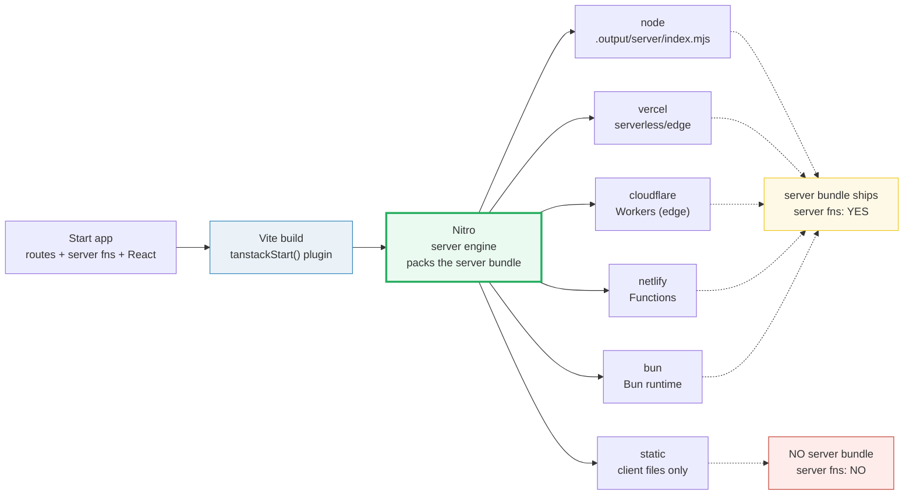
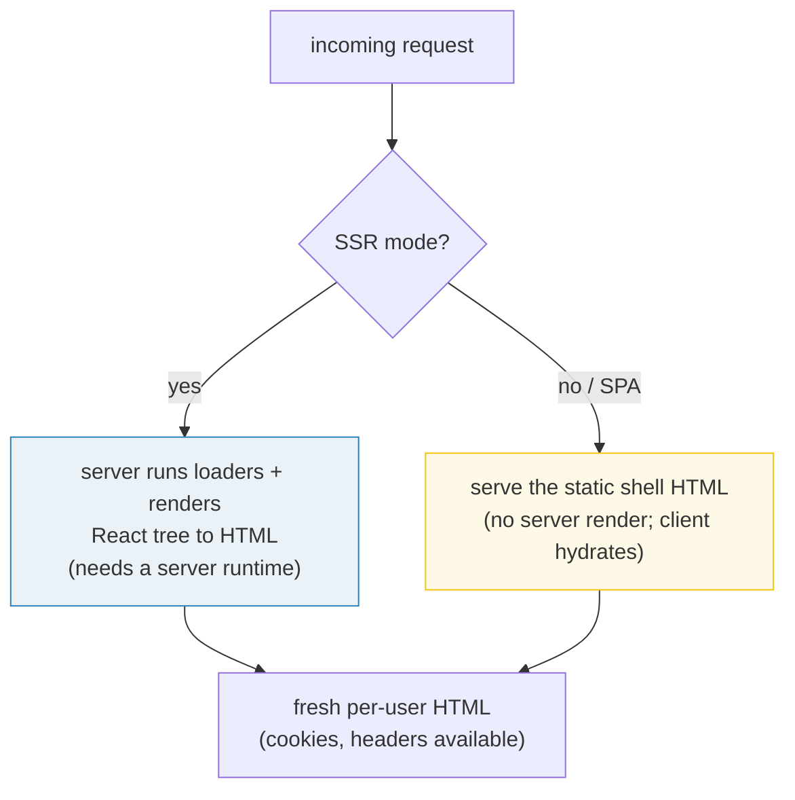

# Deployment & Nitro

> **Companion demo:** [`deployment_nitro.html`](./deployment_nitro.html) — open in a browser.
> Pick a build mode (SSR vs SPA) and a deploy preset, hit *run build*, and watch the
> pipeline light up to show what ships: server bundle + static client files (server preset)
> or static files only (static target).
> Phase 6b · bundle #35 · **the FINAL bundle of the frontend curriculum.** Every fact below
> is web-verified (Jun 2026) — see [## Sources](#sources). Nothing is hand-waved.

---

## 0. TL;DR — the one idea

> **The analogy:** Start builds via **Vite** onto **Nitro** — the server engine from the
> Nuxt ecosystem — which emits a deploy **preset** per target: Node, Vercel, Cloudflare,
> Netlify, Bun, or static (SPA/CDN). **SSR presets ship a server bundle (server functions
> work); the static target ships client files only (no server → no server fns).**

Think of Nitro as a **universal shipping container**. You don't write a different adapter
per host (the old Next/Nuxt model). You write one server, and Nitro packs that *same* server
into the shape your target expects — a long-running Node process, a Vercel serverless
function, a Cloudflare Worker, or just a folder of static files. The preset only decides
the **packaging**, not your code.

> ⚠ **Build tooling is mid-transition (verified).** Start *originally* built via **Vinxi**
> (a metaframework build tool that itself sat on Vite). It has since **migrated to a
> Vite-native setup**: the `tanstackStart()` plugin + the `nitro/vite` plugin, configured
> directly in `vite.config.ts`. As of late 2025, **Rsbuild 2** is also a first-class
> alternative build tool alongside Vite. So the current build tool is **Vite (default) or
> Rsbuild** — *not* Vinxi. Old tutorials still say "Vinxi"; they're describing the legacy stack.



---

## 1. How it works — the pipeline

A Start build is five beats, all visible in the companion demo:

1. **Source.** Your app: file-based routes, `createServerFn` server functions, React
   components.
2. **Build tool (Vite).** The `tanstackStart()` Vite plugin orchestrates the build — it
   produces a **client bundle** (the React app + router that ships to the browser) and a
   **server entry** (the React-to-HTML renderer + the server-function runtime). Rsbuild 2
   does the same job via the same plugin interface.
3. **Nitro (server engine).** Nitro takes the server entry and packs it into a deployable
   server, using **H3** (an HTTP framework) under the hood. This is the "adapter-less" trick:
   H3 maintains the low-level per-host glue, so Start ships one server output, not N adapters.
4. **Preset.** The preset you pick only reshapes that server bundle for a target runtime.
   Pick it via the `nitro()` plugin options or a host-specific Vite plugin.
5. **Artifacts.** What lands on disk: the static client files (always) **plus** the server
   bundle (for any server preset) or nothing extra (for the static target).

### The config (Vite-native, current)

```ts
// vite.config.ts — the canonical Start + Nitro config (Jun 2026)
import { tanstackStart } from '@tanstack/react-start/plugin/vite'
import { defineConfig } from 'vite'
import { nitro } from 'nitro/vite'
import viteReact from '@vitejs/plugin-react'

export default defineConfig({
  plugins: [tanstackStart(), nitro(), viteReact()],
  // pin a preset explicitly, e.g. for Bun:
  // plugins: [tanstackStart(), nitro({ preset: 'bun' }), viteReact()],
})
```

```json
{
  "scripts": {
    "dev":   "vite dev",
    "build": "vite build",
    "start": "node .output/server/index.mjs"
  }
}
```

The base app directory changed from `./app` (the Vinxi-era default) to `./src` as part of the
Vite-native migration — a tell that an old tutorial is describing the legacy stack.

---

## 2. Two build MODES × six deploy PRESETS

The companion demo lets you cross two independent decisions:

- **Build MODE** — what HTML is produced.
  - **SSR (full):** the server renders the page to HTML on every request. **Requires a
    server runtime** — you cannot deploy SSR to a static-only target.
  - **SPA (client-only):** no server-side HTML. The server ships a static shell; the client
    renders everything. (Under SPA mode, `beforeLoad`/`loader` don't run server-side and
    route components aren't server-rendered.)
- **Deploy PRESET** — whether a server bundle ships.

The `buildArtifacts(mode, preset)` function in the demo is the deterministic core:

```js
function buildArtifacts(modeKey, presetKey) {
  var staticTarget = presetKey === "static";
  return {
    staticClient:      true,                              // client files always ship
    serverBundle:      !staticTarget,                     // any server preset ships the bundle
    serverRendersHTML: mode.serverRendersHTML && !staticTarget,
    serverFns:         !staticTarget,                     // need a runtime; static has none
    valid:             !(mode.needsServer && staticTarget)// SSR can't go static-only
  };
}
```

> From deployment_nitro.html (the preset → artifact mapping, curated data):
> ```
>   preset        server bundle?   server fns?   runtime
>   ----------    --------------   -----------   ---------------------------
>   node          YES              YES           Node.js process
>   vercel        YES              YES           Vercel (serverless/edge)
>   cloudflare    YES              YES           Cloudflare Workers (edge) ★
>   netlify       YES              YES           Netlify Functions         ★
>   bun           YES              YES           Bun (React 19+)
>   static        NO               NO            none — static CDN
>   -> exactly 6 presets; the 5 server presets ship a server bundle (server fns work);
>      the static target ships client files only (no server → no server fns).
> ```

> From deployment_nitro.html (build mode facts):
> ```
>   SSR mode: server renders HTML per request; needs a server runtime (node/vercel/cf/...).
>   SPA mode: no server-side HTML; the shell is static.
>   SSR + static = INVALID (no server to render the HTML).
>   SPA  + static = VALID  (static client files; no server fns).
> ```

The ★ marks Start's **Official Hosting Partners**: Cloudflare, Netlify, and Railway (Railway
deploys via the Node/Nitro preset). These have dedicated Vite plugins and first-class docs.

---

## 3. What each preset actually produces

| deploy preset | Nitro target / plugin | server runtime | server fns? | example target |
|---|---|---|---|---|
| **node** | `node-server` (Nitro) | Node.js process (`node .output/server/index.mjs`) | **yes** | self-hosted / Docker / Railway |
| **vercel** | Nitro `vercel` preset | Vercel serverless / edge | **yes** | `vercel deploy` (one-click) |
| **cloudflare** ★ | `@cloudflare/vite-plugin` | Cloudflare Workers (edge) | **yes** | `wrangler deploy` |
| **netlify** ★ | `@netlify/vite-plugin-tanstack-start` | Netlify Functions | **yes** | `netlify deploy` |
| **bun** | Nitro `bun` preset | Bun runtime (React 19+) | **yes** | `bun run server.ts` |
| **static** | *(none — client files only)* | none (static CDN) | **no** | SPA on a CDN / GitHub Pages |

Railway and Appwrite Sites are also documented targets; Railway uses the Nitro node preset,
and Appwrite Sites reads the build output directory (`./.output` for Nitro v2/v3, `./dist`
otherwise). The demo curates the six above because they cover every distinct *artifact shape*.

---

## 4. SSR-build vs SPA-build outputs

The two build modes produce different server-side work, even on the same preset:



- **SSR mode** always needs a server preset (node / vercel / cloudflare / netlify / bun).
  The server renders HTML per request, so it can read cookies/headers and stream the response.
  See 🔗 [`ssr_streaming`](./ssr_streaming.html) for the render → flush → hydrate round trip.
- **SPA mode** skips server rendering. Deployed to a **server preset**, it still benefits from
  server functions (`createServerFn`) — they run on the server on demand; the page just isn't
  server-rendered. Deployed to the **static target**, there's no server at all, so neither SSR
  nor server functions are available — it's a pure client-side app on a CDN. See 🔗
  [`spa_vs_mpa`](./spa_vs_mpa.html) for the full SPA-vs-SSR build-output contrast.

---

## Killer Gotchas

| Trap | Symptom | Fix |
|---|---|---|
| **Following a Vinxi-era tutorial** | `vinxi dev` / `./app` dir / `@tanstack/start` imports fail; the build is Vite-native now | Use `vite` scripts, `./src`, `@tanstack/react-start/plugin/vite`. Remove all Vinxi deps (the migration is the fix for many build errors) |
| **"SPA mode disables server functions"** *(common misconception)* | You expect server fns to break in SPA mode; they don't — they work if a server preset is deployed | SPA mode stops *server rendering*, not server functions. Only the pure-static target has no server (and thus no server fns) |
| **SSR mode deployed to a static host** | Blank pages / "no server to render HTML" errors | SSR **requires** a server runtime (node/vercel/cf/netlify/bun). For a static CDN, switch to SPA mode and drop server-dependent code |
| **Edge runtime API limits** | server fns fail on Cloudflare/Vercel edge (no Node APIs: `fs`, some `Buffer` uses, native modules) | Keep server-fn code to Web-standard APIs, or pick the Node preset. Add `nodejs_compat` / the host's Node compat flag where supported |
| **Wrong preset name for your host** | Deploy succeeds but serves the wrong shape, or server fns 404 | Verify the exact preset/plugin for your host (e.g. Cloudflare uses `@cloudflare/vite-plugin`, not a Nitro `cloudflare` string). Check the official hosting guide |
| **Nitro plugin under active development** | the `nitro/vite` plugin "receives regular updates"; occasional build rough edges | Pin your Nitro + Start versions; report issues with a reproduction. Start is still RC (not 1.0 GA) |
| **Rsbuild vs Vite output paths differ** | Rsbuild emits `dist/client` + `dist/server/index.js`; Vite/Nitro emits `.output/server/index.mjs` | Match your `start` script to the build tool. Rsbuild's server entry is a `fetch` handler — serve it with `srvx` or a custom server |

### Cheat sheet

```ts
// vite.config.ts — Start + Nitro (Vite-native, current)
import { tanstackStart } from '@tanstack/react-start/plugin/vite'
import { nitro } from 'nitro/vite'
import viteReact from '@vitejs/plugin-react'
export default defineConfig({
  plugins: [tanstackStart(), nitro(), viteReact()],
  // explicit preset: nitro({ preset: 'bun' })   // or 'node-server', etc.
})
```

```jsonc
// package.json scripts
"dev":   "vite dev",
"build": "vite build",
"start": "node .output/server/index.mjs"   // Nitro node preset output
```

```
build tool   = Vite (default) or Rsbuild 2          (Vinxi = legacy, migrated)
server eng.  = Nitro (uses H3 underneath)           — one server output, many presets
server fns   = work on ANY server preset            (node/vercel/cf/netlify/bun)
static target= client files ONLY, NO server         -> server fns do NOT work
SSR mode     = needs a server runtime (can't go static)
SPA mode     = no server-side HTML                  (server fns still work if a server ships)
partners     = Cloudflare, Netlify, Railway         (★ official hosting partners)
status       = v1 Release Candidate (since Sep 23 2025) — NOT yet 1.0 GA
```

---

## Sources

- TanStack Start — *Hosting guide* (the authoritative deploy-target list: cloudflare-workers, netlify, railway, nitro, vercel, node-server, bun, appwrite-sites; the `nitro/vite` plugin config; Vite **and** Rsbuild supported; preset selection; output paths): https://tanstack.com/start/v0/docs/framework/react/guide/hosting
- TanStack Blog — *Why TanStack Start is Ditching Adapters* (Start is "adapter-less"; Nitro uses H3, which maintains the per-host glue; one server output deploys to many targets): https://tanstack.com/blog/why-tanstack-start-is-ditching-adapters
- TanStack Start — *SPA mode* (SPA mode does NOT disable server functions; it stops server-side rendering + server-side loaders, but server fns still pair with SPA mode; needs a server for server fns): https://tanstack.com/start/v0/docs/framework/react/guide/spa-mode
- TanStack Start — *Selective SSR* ("SPA mode completely disables server-side execution of beforeLoad and loader, as well as server-side rendering of route components"): https://tanstack.com/start/v0/docs/framework/react/guide/selective-ssr
- Nitro — *Deploy* (the default production output preset is the Node.js server; Nitro provides presets for a wide range of hostings; `nitro/vite` integrates with the Vite Environments API): https://nitro.build/deploy
- LogRocket — *Migrating TanStack Start from Vinxi to Vite* (the Vinxi → Vite-native migration; remove Vinxi deps, install Vite, switch to `@tanstack/react-start`, `./app` → `./src`): https://blog.logrocket.com/migrating-tanstack-start-vinxi-vite/
- TanStack Blog — *TanStack Start Adds First-Class Rsbuild Support* (Rsbuild 2 alongside Vite as a supported build-tool path for Start): https://tanstack.com/blog/start-adds-rsbuild-support
- Vercel KB — *Nitro* (the Nitro Vite plugin adds SSR, API routes, and deploy-anywhere server builds to any Vite app; how it runs on Vercel): https://vercel.com/kb/nitro
