# File-Based Routing &amp; routeTree.gen.ts

> **Companion demo:** [`file_based_routing.html`](./file_based_routing.html) — open in a browser.
> Every resolved route below is produced by the resolver embedded in that file.
> Nothing is hand-computed.
> Cross-refs: 🔗 [`router_type_safety`](./router_type_safety.html) (the codegen powers the types) · 🔗 [`astro_routing_layouts`](../astro/astro_routing_layouts.html) (the same file-based idea, different framework) · 🔗 [`tanstack_start_overview`](./tanstack_start_overview.html).

---

## 0. TL;DR — the one idea

> **The analogy:** the filesystem **IS** the route tree — files under `src/routes/` ARE
> routes, and a plugin compiles them into `routeTree.gen.ts`, the generated file that powers
> the type-safety. If a typed ORM is "the schema is the source of truth and your queries are
> checked against it," TanStack Router is the same idea for URLs: the route *files* are the
> schema, and `routeTree.gen.ts` is the generated artefact that `<Link>` / `navigate` /
> `useParams` / `loader` are all checked against. There is no hand-written route config to
> keep in sync — you author files, the plugin regenerates the tree on save.

```mermaid
graph LR
    subgraph FS["src/routes/  (you author these)"]
        R0["__root.tsx"]:::root
        I["index.tsx"]:::static
        P["posts.tsx"]:::layout
        PP["posts/$postId.tsx"]:::param
        L["_layout.tsx"]:::pathless
        LA["_layout/route-a.tsx"]:::static
    end
    PL["@tanstack/router-plugin/vite<br/>(tanstackRouter — codegen)"]:::gen
    GEN["src/routeTree.gen.ts<br/>GENERATED — do not hand-edit"]:::gen
    RT["createRouter(&#123; routeTree &#125;)<br/>types flow OUT"]:::out
    U1["/"]:::url
    U2["/posts/$postId<br/>params.postId"]:::url
    U3["/route-a<br/>(no /_layout in URL)"]:::url
    R0 --> PL
    I --> PL
    P --> PL
    PP --> PL
    L --> PL
    LA --> PL
    PL --> GEN
    GEN --> RT
    RT --> U1
    RT --> U2
    RT --> U3
    classDef root fill:#fef9e7,stroke:#f1c40f,stroke-width:2px
    classDef layout fill:#eef2ff,stroke:#6366f1,stroke-width:2px
    classDef param fill:#eef2ff,stroke:#6366f1,stroke-width:3px
    classDef pathless fill:#f3e8ff,stroke:#c084fc,stroke-width:2px
    classDef static fill:#eafaf1,stroke:#2ecc71,stroke-width:2px
    classDef gen fill:#fef9e7,stroke:#f1c40f,stroke-width:2px
    classDef out fill:#eaf2f8,stroke:#2980b9
    classDef url fill:#eafaf1,stroke:#2ecc71
```



The naming is **strict and meaningful** — the prefix/suffix of a filename *is* routing
instructions:

- `__root.tsx` — the root route; wraps every page; has no URL.
- `index.tsx` — the `/` of its directory (exact match).
- `about.tsx` — a static segment → `/about`.
- `$param.tsx` — a `$` segment is a **dynamic param** (`$postId` → `params.postId`).
- `$.tsx` — a bare `$` is a **splat / catch-all** (any depth → `params._splat`).
- `posts.tsx` (next to a `posts/` dir) OR `settings/route.tsx` — a **layout route**: it has
  its own URL AND wraps its children through an `<Outlet/>`.
- `_layout.tsx` — the `_` prefix is a **pathless layout**: it wraps children but contributes
  **nothing** to the URL.

---

## 1. How it works — the file convention

File-based routing configures routes using the filesystem (TanStack Router docs,
*File-Based Routing*). Every route file under the configured directory (default
`./src/routes`) becomes a route node; its URL is derived from its path. The same tree can be
written two ways — **directory** routes (`posts/$postId.tsx`) or **flat** routes
(`posts.$postId.tsx`, where `.` denotes nesting) — and they can be mixed.

> From file_based_routing.html (static + index routes):
> ```
>   /            -> src/routes/index.tsx           (the root index)
>   /about       -> src/routes/about.tsx
>   /posts       -> src/routes/posts/index.tsx     (index of the posts dir)
> ```
> `index.tsx` is special: it maps to the **directory root**. So `src/routes/index.tsx` → `/`
> and `src/routes/posts/index.tsx` → `/posts`.

### Dynamic params — `$param`

A `$`-prefixed filename segment captures one URL segment into `params`:

> From file_based_routing.html (gold-check, verbatim):
> ```
> [check] 13 routes; /posts/42->$postId='42' nested=Y; /route-a->_layout(no-url=Y): OK
> ```
> The bundle pins: exactly **13** route files are authored, `/posts/42` resolves to
> `src/routes/posts/$postId.tsx` with `postId="42"` **nested under the Posts layout route**
> (chain `<Root><Posts><Post>`), and `/route-a` resolves to `_layout/route-a.tsx` wrapped by
> the pathless `_layout` route which has **no URL segment**.

```tsx
// src/routes/posts/$postId.tsx
import { createFileRoute } from '@tanstack/react-router'

export const Route = createFileRoute('/posts/$postId')({
  // params are typed: postId is a string
  loader: ({ params }) => fetchPost(params.postId),
  component: PostComponent,
})

function PostComponent() {
  const { postId } = Route.useParams()   // postId: string
  return <div>Post {postId}</div>
}
```

A bare `$` (e.g. `files/$.tsx`) is a **splat / catch-all** — it matches any depth and stores
the remainder under the `_splat` key:

> From file_based_routing.html:
> ```
>   /files/a/b/c  -> src/routes/files/$.tsx   {"_splat":"a/b/c"}
> ```

### Layout routes — two ways to wrap children

A layout route renders shared UI plus an `<Outlet/>` where the matched child goes. There are
**two** ways to author one:

1. **A co-located file** — `posts.tsx` placed next to a `posts/` directory. It owns the
   `/posts` URL and wraps everything inside `posts/`.
2. **A directory's `route.tsx`** — `settings/route.tsx` owns the `/settings` URL and wraps
   everything else inside `settings/`.

Both render their children inside an `<Outlet/>`:

```tsx
// src/routes/posts.tsx  (layout route — co-located file)
import { createFileRoute, Outlet } from '@tanstack/react-router'

export const Route = createFileRoute('/posts')({
  component: PostsLayout,
})

function PostsLayout() {
  return (
    <div>
      <h1>Posts</h1>
      <Outlet />          {/* posts/index.tsx OR posts/$postId.tsx renders here */}
    </div>
  )
}
```

### Pathless layouts — the `_` prefix

A route/dir prefixed with `_` is **pathless**: it wraps its children (so it can render shared
UI, run `beforeLoad` guards, etc.) but adds **no segment** to the URL. So `_layout.tsx` +
`_layout/route-a.tsx` produces URL `/route-a` — there is no `/_layout` in the address bar.
This is the standard pattern for auth-gated layout groups (TanStack Router docs, *Routing
Concepts — Pathless Layout Routes*).

> From file_based_routing.html:
> ```
>   /route-a  -> src/routes/_layout/route-a.tsx    chain: <Root><PathlessLayout><RouteA>
>   /route-b  -> src/routes/_layout/route-b.tsx    chain: <Root><PathlessLayout><RouteB>
> ```
> The `_layout` route sits in the chain but owns **zero** URL segments — that is the entire
> point of the `_` prefix.

### Non-nested routes — the trailing `_`

A trailing `_` detaches a route from the parent's layout component while keeping the URL
nested. `posts_.$postId.edit.tsx` (flat) or `posts_/$postId/edit.tsx` (directory) → URL
`/posts/$postId/edit` but rendered as `<Root><EditPost>` — **not** wrapped by the `Posts`
layout. Use it when a sub-path should share the URL prefix but not the parent shell.

### File pattern → meaning → example URL

| File | Kind | Route path / URL | Read as |
|---|---|---|---|
| `__root.tsx` | root route | — (no URL; wraps everything) | `createRootRoute()` |
| `index.tsx` | index | `/` (root index) | path `'/'` |
| `about.tsx` | static | `/about` | path `'about'` |
| `posts.tsx` | layout (co-located file) | `/posts` + wraps `posts/*` | path `'posts'` + `<Outlet/>` |
| `posts/index.tsx` | index (of dir) | `/posts` (exact) | path `'/'` under posts |
| `posts/$postId.tsx` | dynamic segment | `/posts/$postId` | `params.postId` (string) |
| `settings/route.tsx` | layout (dir's `route.tsx`) | `/settings` + wraps `settings/*` | path `'settings'` + `<Outlet/>` |
| `settings/profile.tsx` | static nested | `/settings/profile` | path `'profile'` under settings |
| `_layout.tsx` | pathless layout (`_` prefix) | — (no URL segment) | `id: '_layout'`, no path |
| `_layout/route-a.tsx` | static, wrapped by pathless | `/route-a` (no `/_layout` in URL) | path `'route-a'` |
| `files/$.tsx` | splat / catch-all | `/files/$` (any depth) | `params._splat` (string) |
| `posts_/$postId/edit.tsx` | non-nested (trailing `_`) | `/posts/$postId/edit` — NOT wrapped by Posts | detached from parent layout |
| `-draft.tsx` | *(excluded — `routeFileIgnorePrefix`)* | not a route | ignored by codegen |

> **Flat vs directory:** `.` in a filename denotes nesting, equivalent to `/`.
> `posts.$postId.tsx` ≡ `posts/$postId.tsx`. Mix freely. The default ignore prefix is `-`
> (a file starting with `-` is skipped by codegen) — different from Astro's `_`.

---

## 2. The codegen step — `routeTree.gen.ts` is GENERATED

This is the half that makes TanStack Router more than a file-mapper: the files are
**compiled** into a single generated module. You add the Vite plugin
(`@tanstack/router-plugin`), and it watches `src/routes/`, regenerating
`src/routeTree.gen.ts` on every save during dev and as part of the build (TanStack Router
docs, *Installation with Vite*):

```ts
// vite.config.ts
import { defineConfig } from 'vite'
import react from '@vitejs/plugin-react'
import { tanstackRouter } from '@tanstack/router-plugin/vite'

export default defineConfig({
  plugins: [
    // MUST come before @vitejs/plugin-react
    tanstackRouter({ target: 'react', autoCodeSplitting: true }),
    react(),
  ],
})
```

The generated file imports each route file's `Route` export and assembles the tree with
`addChildren([...])` — plus a `FileRoutesByPath` type map that is where the type-safety is
born:

```ts
// src/routeTree.gen.ts  — GENERATED by @tanstack/router-plugin/vite. Do NOT hand-edit.
import { Route as rootRoute } from './routes/__root'
import { Route as PostsRoute } from './routes/posts'
import { Route as PostsIndexRoute } from './routes/posts/index'
import { Route as PostRoute } from './routes/posts/$postId'
// ... one import per route file ...

declare module '@tanstack/react-router' {
  interface FileRoutesByPath {
    '/posts/$postId': { id: '/posts/$postId'; fullPath: '/posts/$postId'; /* ... */ }
    // ... one entry per route — this type map powers every typed navigation ...
  }
}

export const routeTree = rootRoute.addChildren([
  PostsRoute.addChildren([PostsIndexRoute, PostRoute]),
  // ... the full nesting, mirroring the filesystem ...
])
```

That `routeTree` is then handed to the router:

```ts
const router = createRouter({ routeTree, defaultPreload: 'intent' })
```

The plugin's defaults are sane and need no config for most projects (TanStack Router docs,
*Installation with Vite*):

```json
{
  "routesDirectory": "./src/routes",
  "generatedRouteTree": "./src/routeTree.gen.ts",
  "routeFileIgnorePrefix": "-",
  "quoteStyle": "single"
}
```

> **Commit it, don't gitignore it.** The FAQ is explicit: although `routeTree.gen.ts` is
> generated, it "is essentially part of your application's runtime, not a build artifact … a
> critical part of your application's source code." Commit it so the types are available
> without running the generator — but mark it readonly / exclude it from your formatter and
> linter (TanStack Router FAQ; GitHub discussion #1218).

---

## Killer Gotchas

| Trap | Symptom | Fix |
|---|---|---|
| Hand-editing `routeTree.gen.ts` | your edits vanish on the next save/build | it is **GENERATED** — never edit it by hand. Edit the route *file* under `src/routes/`; the plugin regenerates the tree |
| Forgetting the plugin in the build | `routeTree.gen.ts` goes stale; new routes aren't known; `<Link to>` to a new route is a type error | ensure `tanstackRouter(...)` runs in **both** dev and the production build (it must be in `vite.config.ts` plugins, before `@vitejs/plugin-react`) |
| `_` vs `$` confusion | `_layout` doesn't show in the URL; `$postId` does | `_` prefix = **pathless** (wraps children, no URL segment); `$` prefix = **param** (captures a URL segment). They look alike but do opposite things |
| `posts.tsx` vs `posts/route.tsx` vs `_layout.tsx` | three different "layout" flavours, easy to mix up | `posts.tsx` (co-located) and `posts/route.tsx` are **path layouts** (own the `/posts` URL); `_layout.tsx` is **pathless** (no URL, just wraps). Pick by whether you want a URL segment |
| New route file → type error on `<Link to>` | the generated tree hasn't regenerated yet | save any file (or restart dev) so the plugin re-runs; the type error clears once `routeTree.gen.ts` knows the new route |
| `routeTree.gen.ts` gitignored | CI / fresh-clone typechecks fail; co-workers see phantom errors | **commit it** (FAQ) — it is app source, not a throwaway artifact. Just keep your formatter/linter off it |
| Expecting `params` from a splat under the param name | `params.path` is `undefined` for `files/$.tsx` | a bare `$` stores the remainder under **`_splat`**, not the filename — read `params._splat` |
| `index.tsx` collides with the layout route at the same URL | unsure which renders at `/posts` | the **index** is the leaf that renders; the **layout** wraps it. `/posts` → `<Root><Posts><PostsIndex>` |
| VSCode opens `routeTree.gen.ts` with errors after a rename | stale editor view of a just-regenerated file | mark it readonly + exclude from watcher/search in `.vscode/settings.json` (docs' recommendation) |

### Cheat sheet

```bash
# the contract: files under src/routes/ ARE routes; the plugin compiles them.
#   routesDirectory     = ./src/routes            (default)
#   generatedRouteTree  = ./src/routeTree.gen.ts  (default, GENERATED)
#   routeFileIgnorePrefix = '-'                   (a '-' file is skipped)
```

```
src/routes/
  __root.tsx              # root route, wraps all, NO url          createRootRoute()
  index.tsx               # /                                       path '/'
  about.tsx               # /about                                  path 'about'
  posts.tsx               # /posts  (layout) + wraps posts/*        path 'posts' + <Outlet/>
  posts/index.tsx         # /posts  (index, the leaf)               path '/' under posts
  posts/$postId.tsx       # /posts/$postId   param: postId(string)  params.postId
  settings/route.tsx      # /settings (layout via route.tsx)        path 'settings' + <Outlet/>
  settings/profile.tsx    # /settings/profile                       path 'profile'
  _layout.tsx             # pathless layout (_ prefix) NO url       id '_layout', no path
  _layout/route-a.tsx     # /route-a  (no /_layout in URL)          path 'route-a'
  files/$.tsx             # /files/*  splat                         params._splat
  posts_/$postId/edit.tsx # /posts/$postId/edit  NOT wrapped by Posts (trailing '_')

# flat == directory:  posts.$postId.tsx  ==  posts/$postId.tsx   (. = nesting)
# codegen:  src/routes/**  --@tanstack/router-plugin/vite-->  src/routeTree.gen.ts
#           GENERATED (never hand-edit) but COMMITTED (it's app source). Exclude from lint/format.
```

---

## Sources

- TanStack Router Docs — *File-Based Routing* (directory/flat/mixed routes, `__root`, `index`, layout routes, pathless layouts, splat, non-nested, file-convention tables): https://tanstack.com/router/v1/docs/routing/file-based-routing
- TanStack Router Docs — *Installation with Vite* (`@tanstack/router-plugin/vite`, `tanstackRouter({ target, autoCodeSplitting })`, plugin before `@vitejs/plugin-react`, default config `routesDirectory`/`generatedRouteTree`/`routeFileIgnorePrefix`, ignoring the generated file in lint/format): https://tanstack.com/router/v1/docs/installation/with-vite
- TanStack Router Docs — *Code-Based Routing* (the equivalent code: `createRoute({ getParentRoute, path })`, `id` for pathless, `_splat` key, the file-tree example mirrored verbatim): https://tanstack.com/router/latest/docs/routing/code-based-routing
- TanStack Router Docs — *FAQ* — "Should I commit my `routeTree.gen.ts` file into git?" (generated, but part of runtime source — commit it): https://tanstack.com/router/v1/docs/faq
- TkDodo — *The Beauty of TanStack Router* (May 25 2025; secondary source: file-based routing "just takes the route config … and moves them into a file system tree", best path to automatic code splitting, types "just work", flat + virtual file routes): https://tkdodo.eu/blog/the-beauty-of-tan-stack-router
- TanStack Router GitHub Discussion #1218 — *Should routeTree.gen.ts be gitignored?* ("Don't gitignore your routeTree.gen.ts file. This file is part of your application. It's simply managed by TanStack Router."): https://github.com/TanStack/router/discussions/1218
