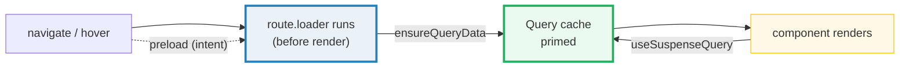
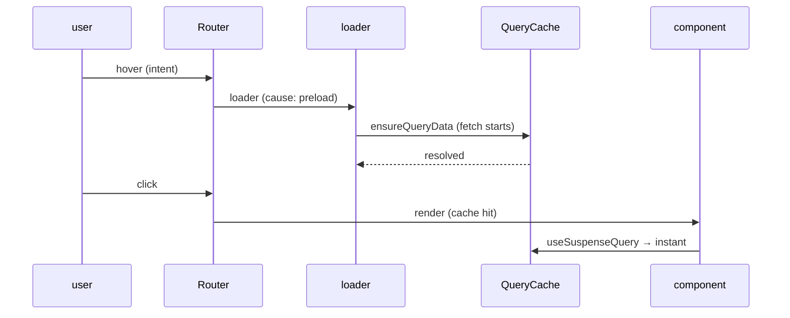

# Loaders & Data Loading

> **Companion demo:** [`loaders_data.html`](./loaders_data.html) — open in a browser.
> A deterministic simulation of the route loading lifecycle, the `loaderDeps` re-run
> gate, and the cold-vs-preloaded latency race. Every number below comes from that
> file's pure state machine. Nothing is hand-waved.

---

## 0. TL;DR — the one idea

> **The analogy:** a route loader prefetches the data the route needs **BEFORE** it
> renders — and you point it at TanStack Query so the data is **cached** and the next
> visit is **instant**. Think of the loader as an *event handler* that fires on
> navigation (or on hover, via `preload`): its job is to *start the fetch as early as
> possible* and prime a cache, not to hand data to the component.



The router is the only thing that knows where the user is headed before content
renders, so it is the right place to kick off fetches. The `loader` runs on match
(cause `enter` / `preload` / `stay`), returns data readable via
`Route.useLoaderData()`, and is gated for re-runs by `loaderDeps`. The **recommended
pattern with TanStack Query**: the loader merely *primes* the Query cache
(`queryClient.ensureQueryData`) and the component reads via `useSuspenseQuery` — so a
preloaded navigation lands at ~0ms.

---

## 1. The load lifecycle (how it works)

Every URL/history update runs a fixed sequence (top-down match → serial preload →
parallel load). The `loader` sits in the parallel-load phase, right before the
component:

```
URL change
  → route matching (params.parse, validateSearch)      [top-down]
  → beforeLoad                                          [serial]
  → loader   ← runs HERE, before the component renders  [parallel]
  → pendingComponent (after pendingMs, default 1000ms)
  → component
```

Two supported forms — a plain function, or an object form when you need
`staleReloadMode`:

```tsx
export const Route = createFileRoute('/posts')({
  loader: () => fetchPosts(),
})

// object form — opt into blocking stale reloads:
loader: { handler: () => fetchPosts(), staleReloadMode: 'blocking' }
```

The loader receives `{ abortController, cause, context, deps, params, preload, ... }`.
`cause` tells you *why* it ran:

| `cause` | when |
|---|---|
| `enter` | route matched after NOT being matched previously (cold load) |
| `preload` | the route is being preloaded (hover / in-view / on-render) |
| `stay` | route matched again (revalidate — e.g. a `loaderDeps` change) |

The data is then read with `Route.useLoaderData()` (or `getRouteApi(id).useLoaderData()`
deeper in the tree to avoid circular imports).

### Cold load vs preloaded — the latency race

> From loaders_data.html (panel 2 — `LATENCY = 280ms`):
> ```
>   cold navigate     → loader runs (cause: enter) DURING navigation → render
>                       user-perceived total: 280ms
>
>   preloaded navigate → hover runs loader in background (cause: preload) →
>                        click → cache hit → render
>                       user-perceived total: ~0ms   (latency banked: 280ms)
> ```

The preload (`defaultPreload: 'intent'`) fires the loader on hover/touch after
`preloadDelay` (default `50ms`). The banked data stays fresh for `preloadStaleTime`
(default `30s`) and is GC'd after `preloadGcTime` (default `30min`) if never used.
**This is the same mechanism `navigation_links` calls "preload"** — it *is* this
loader running ahead of time.

---

## 2. `loaderDeps` — the re-run key

Search params are **not** handed directly to the loader — you must funnel them through
`loaderDeps`. The returned object is deep-equality compared across navigations; **when
it changes, the loader re-runs regardless of `staleTime`**. It also keys the router
cache (pathname + deps), so `/posts?page=1` and `/posts?page=2` don't get mixed up.

```tsx
export const Route = createFileRoute('/posts')({
  loaderDeps: ({ search: { offset, limit } }) => ({ offset, limit }),
  loader: ({ deps: { offset, limit } }) => fetchPosts({ offset, limit }),
})
```

> From loaders_data.html (panel 1 — pure state machine):
> ```
>   navigate (cold)            → loadCount = 1   (cause: enter,  280ms)
>   change deps · page 1 → 2   → loadCount = 2   (cause: stay,   280ms)   ← re-run!
>   navigate again, same deps  → cache hit, 0ms, loader SKIPPED
> ```

---

## 3. TanStack Query integration — the recommended pattern

The router has its own per-route SWR cache, which is fine for route-specific data. But
once data is needed across routes, reach for **TanStack Query** (global cache, shared
by `queryKey`, with mutations + refetch-on-focus). The integration is three lines:

```tsx
const router = createRouter({
  routeTree,
  context: { queryClient },          // createRootRouteWithContext<{ queryClient }>()
  defaultPreloadStaleTime: 0,        // ← every preload primes the Query cache
})

// loader primes; component reads — treat the loader as an event handler
export const Route = createFileRoute('/posts/$postId')({
  loader: async ({ context, params }) => {
    await context.queryClient.ensureQueryData(postOptions(params.postId))
  },
  component: Post,
})
function Post() {
  const { postId } = Route.useParams()
  const { data } = useSuspenseQuery(postOptions(postId))  // data: Post, never undefined
  return <article>{data.title}</article>
}
```

Why not `useLoaderData` when using Query? Query needs **Observers** (created by
`useQuery` / `useSuspenseQuery`) for refetch-on-focus, invalidation, and to keep the
query out of the GC. A loader-only read looks "inactive" to Query. So: the loader
*primes*, the hook *reads*. One request, started as early as possible — whether you
`await` in the loader or not, the component either finds data in the cache or picks up
the in-flight promise.



---

## 4. Approaches — when each runs, and where the cache lives

| approach | when it runs | cache? | read via |
|---|---|---|---|
| **route `loader`** | before render, on match (cause: `enter` / `preload` / `stay`) | router cache — per-route SWR | `Route.useLoaderData()` |
| **`loaderDeps`** | gates the loader — re-runs when deps change (deep equal) | keys the router cache (pathname + deps) | `Route.useLoaderDeps()` |
| **`useQuery()`** | inside the component, after render | Query cache — global, shared across routes | the hook itself |
| **`loader` + Query ★** | loader primes cache (`ensureQueryData`); component reads | Query cache — global *(recommended)* | `useSuspenseQuery()` |

> `★` — set `defaultPreloadStaleTime: 0`; treat the loader as an event handler.
> Don't return the whole `search` from `loaderDeps` — only what the loader uses.

---

## Killer Gotchas

| Trap | Symptom | Fix |
|---|---|---|
| **Loaders run server-side under SSR** (TanStack Start loaders are isomorphic) | `window` / `document` / `localStorage` is `undefined` → crash on first render | guard with `typeof window !== 'undefined'`, or move browser-only logic into `beforeLoad`/component; let Query's `setupRouterSsrQueryIntegration` dehydrate/hydrate for you |
| **Returning the whole `search` from `loaderDeps`** | loader re-runs on ANY search-param change (e.g. `viewMode`, `sortDirection`), not just the ones it uses | extract only what the loader consumes: `({ search }) => ({ page: search.page })` |
| **Over-fetching in the loader** | slow TTI; the loader blocks render (or shows `pendingComponent`) | split fast/slow data via `defer` (deferred loading); push non-critical reads to `useQuery` in the component |
| **Reading via `useLoaderData` with Query** | no refetch-on-focus, no invalidation re-fetch, query gets GC'd | always pair the loader with `use(Suspense)Query` in the component — the loader only primes |
| **Forgetting `defaultPreloadStaleTime: 0`** | preloaded data is served from the router cache (30s) instead of re-priming Query → stale/desynced caches | set it to `0` so every preload/load/reload flows through the Query cache (one player controls caching) |
| **`staleTime: 0` default surprises you** | every revisit background-revalidates (extra requests) | raise `staleTime` (route or `defaultStaleTime`) for static/expensive data; `Infinity` turns it off |
| **`pendingComponent` flash** | spinner flickers for 1 frame then data arrives | `pendingMs` (default 1000ms) gates when it shows; `pendingMinMs` (default 500ms) keeps it on screen long enough to register |

### Cheat sheet

```tsx
// the loader: runs before render, returns data read via Route.useLoaderData()
createFileRoute('/posts/$postId')({
  loaderDeps: ({ search: { page } }) => ({ page }),   // ← re-run key (deep equal)
  loader: ({ params, deps, context, cause, preload, abortController }) =>
    fetchPost(params.postId, deps.page),
  staleTime: 10_000,        // fresh for 10s (default 0)
  pendingMs: 1000,          // pendingComponent after 1s (default 1000)
  pendingMinMs: 500,        // show it ≥500ms to avoid flash (default 500)
  pendingComponent: Spinner,
  errorComponent: Err,
})

// the Query combo (recommended):
//   router: context:{queryClient}, defaultPreloadStaleTime:0
//   loader: await context.queryClient.ensureQueryData(opts)   // prime
//   component: useSuspenseQuery(opts)                          // read

// cause ∈ { 'enter' (cold), 'preload' (hover/in-view/render), 'stay' (revalidate) }
// cache keys: pathname + loaderDeps   ·   gcTime 30min · preloadStaleTime 30s
```

---

## Sources

- TanStack Router — *Data Loading* (the `loader` API, `loaderDeps`, `staleTime`, `pendingComponent`, defaults, the Query hand-off via `defaultPreloadStaleTime: 0`): https://tanstack.com/router/latest/docs/guide/data-loading
- TanStack Router — *useLoaderDeps hook* (the deps-returning hook that gates re-runs): https://tanstack.com/router/v1/docs/api/router/useLoaderDepsHook
- TkDodo — *TanStack Router and Query* (Dominik TkDodo = Query author + Router contributor; the "treat the loader as an event handler" / `ensureQueryData` priming / `defaultPreloadStaleTime: 0` pattern, SSR isomorphic loaders): https://tkdodo.eu/blog/tan-stack-router-and-query
- TanStack Router — *External Data Loading* (passing all loader events to an external cache): https://tanstack.com/router/latest/docs/guide/external-data-loading
- TanStack Router — *Deferred Data Loading* (splitting fast/slow loader data): https://tanstack.com/router/latest/docs/guide/deferred-data-loading
