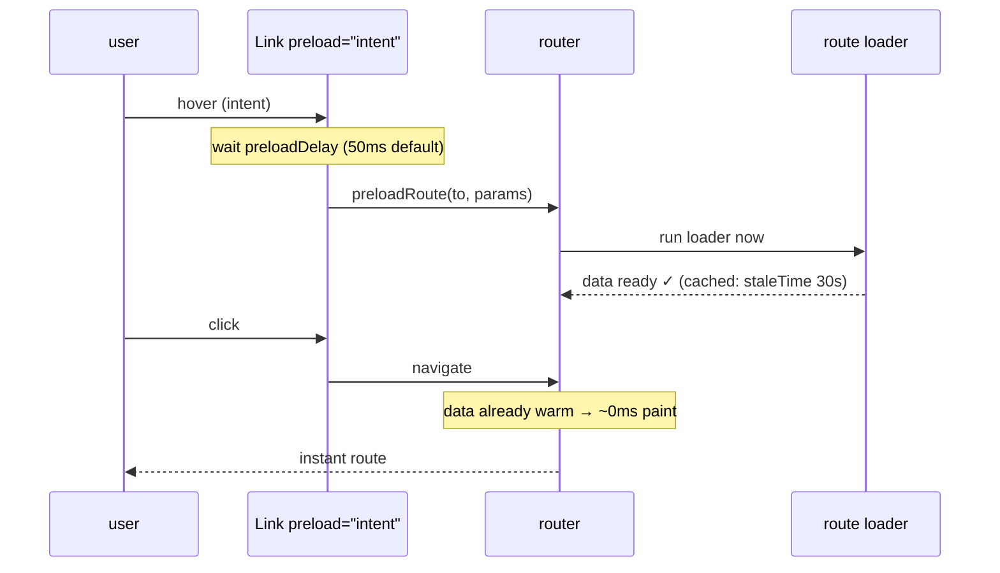
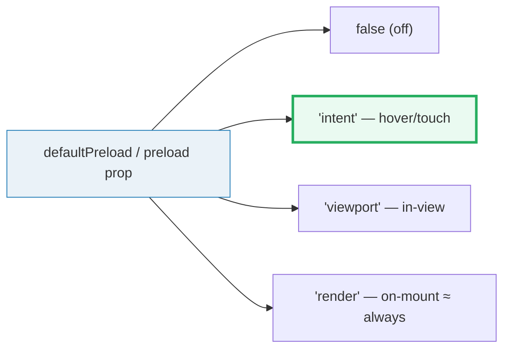

# Navigation & Links

> **Companion demo:** [`navigation_links.html`](./navigation_links.html) — open in a browser.
> Every behavior below is simulated live by that file's pure functions; nothing is hand-waved.

---

## 0. TL;DR — the one idea

> **The analogy:** a TanStack `<Link>` is typed: its `to` / `params` / `search` are checked against the
> generated route tree at compile time, and it can **PRELOAD** its route's data on hover / in-view /
> on-render so the navigation that follows feels instant. It also knows whether it is the **active**
> route. `navigate()` is the imperative twin for side-effect navigations.





---

## 1. How it works — four jobs one `<a>` cannot do

A raw `<a href="/posts/42">` is just a string. TanStack's `<Link>` is **generated from the route tree**,
so the compiler knows the shape of every route and checks your call site:

```tsx
import { Link, useNavigate } from '@tanstack/react-router'

// ✅ required param supplied — compiles
<Link to="/posts/$postId" params={{ postId: 42 }}>Post #42</Link>

// ❌ missing the required postId — TS compile error, never ships
<Link to="/posts/$postId">Broken post</Link>

// active styling via activeProps (merged) OR the data-status="active" attribute
<Link to="/posts" activeProps={{ style: { fontWeight: 'bold' } }}>Posts</Link>

// imperative twin — for navigations from a side effect (e.g. after a mutation)
const navigate = useNavigate()
navigate({ to: '/posts/$postId', params: { postId } })
```

`<Link>` renders a **real `<a>` with a valid `href`** (so cmd/ctrl-click, open-in-new-tab, and
accessibility all work). `navigate()` is for when navigation is a *reaction* to something (a successful
form submit) rather than a user click.

> **Shared `ToOptions` interface.** `<Link>`, `navigate()`, `<Navigate>`, `redirect()` and
> `router.navigate()` all take the same `{ from?, to, params?, search?, hash? }` core — learn it once.

---

## 2. The typed `to` — a wrong param is a compile error (live)

The companion playground type-checks 5 demo links with the identical pure function the gold-check runs.
The route `/posts/$postId` requires `postId`; link **L4** omits it.

> From navigation_links.html (panel 1 · `checkTypes()`):
> ```
> 5 typed demo links rendered.
> checkTypes() flagged: L4
>   Error: missing required param 'postId' for to='/posts/$postId'
> // the 4 ok links build to: / , /posts , /posts/42 , /settings
> // a real TS compile would refuse to emit until L4 supplies postId.
> [check] 5 typed links & checkTypes()==[L4] & intent fires on hover: OK
> ```

This is the whole point of type-safe routing: the **404 moves left**, from runtime to compile time. You
can't ship a link to a route whose required path param you forgot.

---

## 3. Preloading — warm the loader ahead of the click

Set the default on the router, override per link:

```tsx
// router-wide default
const router = createRouter({
  routeTree,
  defaultPreload: 'intent',          // 'intent' | 'viewport' | 'render' | false
  defaultPreloadDelay: 50,           // ms — intent must be sustained this long
})

// per-link override
<Link to="/posts/$postId" params={{ postId: 7 }} preload="intent" preloadDelay={100}>
  Post #7
</Link>
```

Four modes (the **`render`** value ≈ "always" — it fires the moment the `<Link>` mounts):

| mode (`preload` / `defaultPreload`) | fires when | reach for it when… |
|---|---|---|
| `false` (off, the default) | never | expensive loaders; metered bandwidth; can't spare the bytes |
| `'intent'` | hover / touchstart (after `preloadDelay`, default **50ms**) | **the sweet spot — recommended default for most apps** |
| `'viewport'` | the link scrolls into view (IntersectionObserver) | below-the-fold links likely clicked next (long lists) |
| `'render'` | as soon as the `<Link>` renders (≈ always) | routes certain to be needed; cheap loaders |

Two timers govern the cache:

- **`preloadStaleTime`** (default **30 000 ms**): how long preloaded data stays *fresh* — re-preloads if older.
- **`preloadGcTime`** (default **30 min**, inherits `defaultGcTime`): how long an *unused* preload lingers in memory before eviction.

> From navigation_links.html (panel 2 · set `defaultPreload = 'intent'`, hover **Post #7**):
> ```
> fires: hover / touch
> intent: fires on hover/touch after 50ms. The recommended default.
> warmed links: 1/3 · latency banked: 240ms
>   Post #7 → /posts/7   loader ~240ms   [preloaded ✓] [saved 240ms]
> // click → navigate: instant (0ms) for 1 warmed link, blocked ~270ms on 2 cold links.
> ```
> Set `defaultPreload = 'render'` instead and all 3 warm immediately (banking 510ms) — instant, but it
> pays the bytes/CPU whether or not you ever click.

> **Tip (verified in the Preloading guide):** pair `defaultPreload: 'intent'` with TanStack Query by
> setting `defaultPreloadStaleTime: 0` — that hands freshness control entirely to Query's `staleTime`,
> so the router preloads and Query owns the cache.

---

## 4. Active-state detection — inclusive vs exact

A link is **active** when its built path relates to the current route. The default
`activeOptions: { exact: false }` is **inclusive** — a link is active if its path is a *prefix* of the
current pathname:

```tsx
// on /posts/42, under inclusive matching (default):
<Link to="/" />              // active  ← "/" is a prefix of everything (the gotcha!)
<Link to="/posts" />         // active  ← "/posts" is a prefix of "/posts/42"
<Link to="/posts/$postId" params={{ postId: 42 }} /> // active (exact build === current)
<Link to="/settings" />      // inactive

// the classic fix for the home link:
<Link to="/" activeOptions={{ exact: true }}>Home</Link>   // now inactive on child routes
```

Style the active state two ways: `activeProps` (merged onto the `<a>` when active; styles merge,
`className` concatenates) or the **`data-status="active"`** attribute the router sets on the element.

> From navigation_links.html (panel 3 · current route `/posts/42`):
> ```
> inclusive (exact:false) → active: [Home, Posts, Post #42]
>   // Home & Posts light up too — that's why Home usually wants exact:true
> exact (exact:true)      → active: [Post #42]
>   // only a precise pathname match counts; Home is now safe on child routes
> ```

The full `activeOptions` (verified in the Navigation guide + `ActiveLinkOptions`):
`{ exact?: boolean (false), includeHash?: boolean (false), includeSearch?: boolean (true), explicitUndefined?: boolean (false) }`.

---

## Killer Gotchas

| Trap | Symptom | Fix |
|---|---|---|
| **`to` is typed — a wrong/missing param is a *compile* error** | build fails with "missing required param `postId`" | that's the feature — supply the param; never string-interpolate into `to` (use `params`/`search`) |
| **`to` as a plain widened `string` loses type-safety** | a `linkOptions` object literal's `to` inferred as `string` matches *every* route | wrap with `linkOptions({...})` or add `as const` so the literal is checked early |
| **Preload runs the loader — it costs bandwidth/CPU** | `render`/`viewport` warms everything, firing expensive queries you may never need | gate heavy loaders: keep them `false` or `intent`; offload freshness to Query (`defaultPreloadStaleTime: 0`) |
| **Home link active on every child route** | `/` link stays highlighted on `/posts/42` under inclusive matching | `activeOptions={{ exact: true }}` on the home link |
| **Inclusive matching surprises** | a parent-route link is active on all descendants | expected prefix behavior; use `exact` per-link where you want precision |
| **`includeSearch` defaults to `true`** | link not "active" because its `search` differs from current | pass `includeSearch: false` if search shouldn't affect active state |
| **`navigate()` ≠ server redirect** | client nav flashes the old route before jumping | do real redirects on the server for pre-mount redirects; `navigate`/`<Navigate>` are client-only |
| **Don't build hrefs by hand** | `to={'/posts/' + id}` bypasses type-safety | always `to="/posts/$postId" params={{ postId: id }}` |

### Cheat sheet

```tsx
import { Link, useNavigate } from '@tanstack/react-router'

// typed link — required param checked at compile time
<Link to="/posts/$postId" params={{ postId: 42 }}>Post #42</Link>

// preload (default on router: defaultPreload:'intent'; override per link)
<Link to="/posts/$postId" params={{ postId: 7 }} preload="intent" preloadDelay={100} />

// active styling
<Link to="/" activeOptions={{ exact: true }} activeProps={{ className: 'font-bold' }} />
//   …or read the data-status="active" attribute the router sets on the <a>

// imperative navigation (side effects only — prefer <Link> for clicks)
const navigate = useNavigate()
navigate({ to: '/posts/$postId', params: { postId }, replace: true })

// timers: preloadStaleTime 30s (freshness) · preloadGcTime 30min (eviction)
```

**When to use what:** `<Link>` for anything the user clicks (real `<a>`, cmd-clickable, active-aware) ·
`navigate()` / `<Navigate>` for navigations triggered by a side effect · `router.navigate()` for
navigating from outside React · `redirect()` inside loaders/beforeLoad for route guards.

---

## Sources

- TanStack Router — *Navigation* (the `<Link>`, `navigate`, `activeOptions`, `activeProps`,
  `data-status`, preload overview): https://tanstack.com/router/v1/docs/guide/navigation
- TanStack Router — *Preloading* (intent/viewport/render, `preloadDelay`, `preloadStaleTime`,
  `preloadGcTime`, manual `preloadRoute`): https://tanstack.com/router/v1/docs/guide/preloading
- TanStack Router — *RouterOptions* (`defaultPreload: false|'intent'|'viewport'|'render'`,
  `defaultPreloadDelay`, `defaultPreloadStaleTime`, `defaultPreloadGcTime` — exact type signatures &
  defaults): https://tanstack.com/router/v1/docs/api/router/RouterOptionsType
- TanStack Router — *Link component* / *LinkProps* / *ActiveLinkOptions* (typed `to`/params,
  `activeProps`/`inactiveProps`): https://tanstack.com/router/v1/docs/api/router/linkComponent
- TanStack Router — *Link Options* (`linkOptions` eager type-check; `activeOptions: { exact: true }`
  example): https://tanstack.com/router/latest/docs/guide/link-options
- Andreas Bergström (DEV.to) — *Easily style active links in TanStack Router* (secondary confirmation:
  `activeProps` prop-merging + `data-status` attribute): https://dev.to/andreasbergstrom/easily-style-active-links-in-tanstack-router-7n
