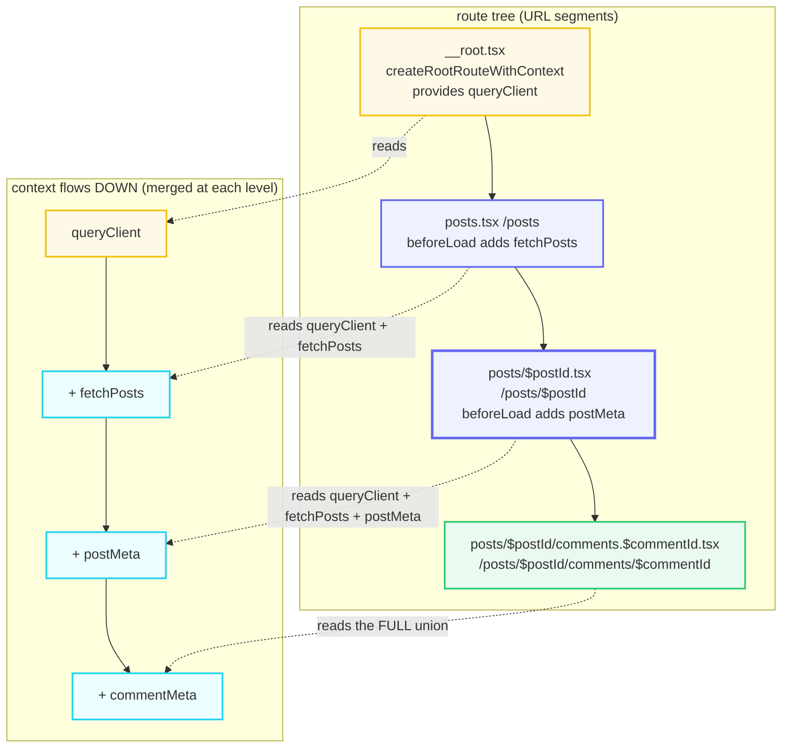

# Nested Routes, &lt;Outlet&gt; &amp; Route Context

> **Companion demo:** [`nested_outlet_context.html`](./nested_outlet_context.html) — open in a browser.
> Every render chain and context set below is produced by the resolver embedded in that file.
> Nothing is hand-computed.
> Cross-refs: 🔗 [`file_based_routing`](./file_based_routing.html) (this bundle extends its nesting
> chain with context flow) · 🔗 [`router_type_safety`](./router_type_safety.html) · 🔗 [`path_search_params`](./path_search_params.html).

---

## 0. TL;DR — the one idea

> **The analogy:** routes nest like **Russian dolls** — a parent renders `<Outlet/>`, the matched
> child fills it; and **context set at the root flows DOWN to every descendant** — no
> prop-drilling across the tree. Two independent mechanisms share one route tree: nesting is about
> *rendering* (`<Outlet/>`), context is about *data* (`createRootRouteWithContext` +
> `beforeLoad`). A deeply nested leaf renders inside every ancestor's `<Outlet/>` **and** reads
> every ancestor's context.



The render tree and the context chain are the **same** parent→child walk of the route tree. The
only difference is what each node *emits*: a parent component emits `<Outlet/>` (the slot its
child fills), and a route's `beforeLoad` emits context keys its children inherit.

---

## 1. How it works

### 1a. `<Outlet/>` — nesting is about rendering

A route with a `component` that renders `<Outlet/>` is a **layout route**: the matched child
route renders *inside* that outlet. `<Outlet/>` takes no props and renders **exactly one** matched
child — or `null` if there is none.

```tsx
// src/routes/__root.tsx
import { createRootRouteWithContext, Outlet } from '@tanstack/react-router'

export const Route = createRootRouteWithContext<{ queryClient: QueryClient }>()({
  component: RootComponent,
})

function RootComponent() {
  return (
    <div>
      <h1>My App</h1>
      <Outlet /> {/* the matched child route renders here — exactly one */}
    </div>
  )
}
```

> A route that omits `component` renders an `<Outlet/>` **automatically** — handy for a layout
> route whose only job is to wrap its children (and provide context).

So for the URL `/posts/42`, the component tree is a **nested chain**:

```
<RootLayout>          ← __root.tsx, renders <Outlet/>
  <PostsLayout>       ← posts.tsx, renders <Outlet/>
    <PostDetail/>     ← posts/$postId.tsx, the leaf (no Outlet)
  </PostsLayout>
</RootLayout>
```

A chain of `N` matched routes has `N−1` outlets — each non-leaf renders exactly one, the next
child fills it.

### 1b. `createRootRouteWithContext` — context is about data

`createRootRouteWithContext<T>()()` (a **double-called** factory) creates the root route **and**
constrains the typed root context `T`. The *values* for `T` are supplied at
`createRouter({ context })`:

```tsx
// src/routes/__root.tsx
interface RouterContext {
  queryClient: QueryClient
}
export const Route = createRootRouteWithContext<RouterContext>()()  // double call!

// src/router.tsx
const router = createRouter({
  routeTree,
  context: { queryClient },  // must satisfy RouterContext
})
```

That `queryClient` is now available to **every** route's `loader` and component — no import, no
prop-drilling, no React Context provider.

### 1c. `beforeLoad` augments context, children inherit

Any route may return an object from `beforeLoad`; it is **merged** into that route's context and
inherited by **all** of its descendants:

```tsx
// src/routes/posts.tsx
export const Route = createFileRoute('/posts')({
  beforeLoad: () => ({ fetchPosts }),        // added here, inherited below
  loader: ({ context }) => context.fetchPosts(),
})

// src/routes/posts/$postId.tsx
export const Route = createFileRoute('/posts/$postId')({
  beforeLoad: () => ({ postMeta: {...} }),   // added here too
  loader: ({ context }) => {
    context.queryClient   // ✓ from root, 2 levels up
    context.fetchPosts    // ✓ from the /posts parent
    context.postMeta      // ✓ from this route
  },
})

// inside any component, read the merged union:
const { queryClient } = Route.useRouteContext()
```

---

## 2. The mechanism — what the visualizer pins

The companion `.html` resolves URLs against a curated 6-route tree and renders the chain + the
context each level reads. These are the deterministic facts its gold-check asserts:

> From nested_outlet_context.html (resolve `/posts/42/comments/7`):
> ```
> resolves to: src/routes/posts/$postId/comments.$commentId.tsx
> params: postId="42", commentId="7"
> render chain: 4 levels — <RootLayout/> → <PostsLayout/> → <PostDetail/> → <CommentView/>
> <Outlet/> count: 3 (each non-leaf renders exactly one)
> reads context (via Route.useRouteContext()): [queryClient, fetchPosts, postMeta, commentMeta]
> ```

The four context keys appear in **inheritance order** — `queryClient` from the root, then each
ancestor's `beforeLoad` contribution as you descend. The deepest route reads the **full union** of
every ancestor, including a key set four levels above it.

> From nested_outlet_context.html (the sibling branch `/`):
> ```
> resolves to: src/routes/index.tsx
> render chain: 2 levels — <RootLayout/> → <Home/>
> reads context: [queryClient]   ← fetchPosts is NOT here
> ```

This is the crux: `fetchPosts` was added in `/posts`'s `beforeLoad`, but `/` is a **sibling**
branch, not a descendant. Context only flows **DOWN** — it never leaks sideways or upward. The
`/` route gets the root context and nothing more.

> From nested_outlet_context.html (all URL-owning routes):
> ```
> queryClient (root context) is present in EVERY matched route's resolved context.
> ```

Set it once at the root; every leaf reads it. That is the whole pitch for dependency injection
through the router (a `QueryClient`, an auth `user`, a fetch helper) without a React Context
provider.

---

## 3. Concept → does → example

| Concept | Does | Example |
|---|---|---|
| `<Outlet/>` | Renders the **one** next matched child route (or `null`). Takes no props. | `<div><h1/><Outlet/></div>` |
| nested route | A child whose URL extends the parent's; the parent wraps it via `<Outlet/>`. | `posts/$postId.tsx` renders inside `posts.tsx` |
| `createRootRouteWithContext<T>()()` | Creates the root route AND constrains the typed root context `T`. Double-called factory. | `createRootRouteWithContext<{queryClient}>()()` |
| `createRouter({ context })` | Provides the **initial** root context values (must satisfy `T`). | `createRouter({ routeTree, context:{ queryClient } })` |
| `beforeLoad` | Runs serially, **per-navigation**, before the loader. May return an object merged into this route's context (inherited by children). | `beforeLoad: () => ({ fetchPosts })` |
| `Route.useRouteContext()` | Reads the merged context (root + every ancestor's `beforeLoad`) inside a route component. | `const { queryClient } = Route.useRouteContext()` |
| context inheritance | Context merges DOWN the match chain: each child sees the union of all ancestors' context. | leaf sees `queryClient + fetchPosts + postMeta` |
| no `component` | If a route omits `component`, the router renders an `<Outlet/>` for it automatically. | a layout route that only wraps + provides context |

---

## Killer Gotchas

| Trap | Symptom | Fix |
|---|---|---|
| **Router context ≠ React context** | Trying to call `useContext(SomeReactContext)` inside `beforeLoad`/`loader` and hitting the Rules of Hooks | Router context is part of the *route*, not React. Pass the *value* (e.g. a hook's return) through `createRouter({ context })`, then read it via `Route.useRouteContext()`. You cannot use hooks inside `beforeLoad`/`loader`. |
| **`createRootRouteWithContext` is the root, not `createRootRoute`** | A context type you add later can't be retro-typed onto the root | Use `createRootRouteWithContext<T>()()` from the start — it's the only place to constrain the root context type. `beforeLoad`-added context is *inferred*, not declared here. |
| **`beforeLoad` runs per-navigation** | Heavy work in `beforeLoad` re-runs on every match; stale values surprise you | `beforeLoad` executes serially on each navigation before the parallel `loader`s. Cache expensive results (e.g. via the router cache or a Query) rather than recomputing in `beforeLoad`. |
| **Context only flows DOWN** | A sibling route can't read another branch's `beforeLoad` output | `posts`'s `beforeLoad` adds `fetchPosts` only for `/posts/*` descendants. The `/` sibling never sees it. There is no sideways/upward inheritance. |
| **`<Outlet/>` renders exactly one child** | Expecting multiple children or conditionally many | `<Outlet/>` renders the single next matched route in the chain (or `null`). A chain of `N` routes = `N−1` outlets. |
| **Double-call the factory** | `createRootRouteWithContext<T>()({...})` — type error / missing options | It's `createRootRouteWithContext<T>()` (factory) **then** `(routeOptions)` — `createRootRouteWithContext<T>()({ component })`. The outer call builds the creator, the inner call builds the route. |
| **No context = `{}`** | `context` is optional and defaults to `{}` if your type is all-optional | If `T` has required properties, `createRouter` errors until you pass `context`. Optional-only types silently default to `{}`. |
| **`router.invalidate()` recomputes context** | Auth state changed but routes still see the old `user` | Call `router.invalidate()` to tell the router to recompute context for all routes (e.g. after `onAuthStateChanged`). |

### Cheat sheet

```tsx
// 1. type + create the root (double call!)
const Route = createRootRouteWithContext<{ queryClient: QueryClient }>()({
  component: () => <div><Outlet/></div>,   // parent renders <Outlet/>
})

// 2. supply values at the router
const router = createRouter({ routeTree, context: { queryClient } })

// 3. augment context per-route (inherited by children, runs per-navigation)
createFileRoute('/posts')({
  beforeLoad: () => ({ fetchPosts }),       // merged DOWN to all /posts/*
})

// 4. read the union anywhere in a matched route
const { queryClient, fetchPosts } = Route.useRouteContext()

// <Outlet/> == exactly ONE matched child (or null); N routes => N-1 outlets
// context flows DOWN only; siblings never share a branch's beforeLoad output
// router context is router-scoped (not React context) — no hooks in beforeLoad/loader
```

---

## Sources

- TanStack Router — *Outlets* (`<Outlet/>` renders the next potentially matching child route, or `null`; omitting `component` auto-renders an Outlet): https://tanstack.com/router/v1/docs/guide/outlets
- TanStack Router — *Router Context* (`createRootRouteWithContext<T>()()`, `createRouter({ context })`, context merged at each route via `beforeLoad`, inherited by children): https://tanstack.com/router/v1/docs/guide/router-context
- TanStack Router — *Data Loading* (`beforeLoad` runs serially per-navigation before parallel `loader`s; loader `context` = parent context ∪ this route's `beforeLoad`): https://tanstack.com/router/latest/docs/guide/data-loading
- TkDodo — *Context Inheritance in TanStack Router* (secondary: path-params / search-params / router-context all inherit down the route tree; `beforeLoad` is the only place to augment Route Context; `useRouteContext()` reads the merged set): https://tkdodo.eu/blog/context-inheritance-in-tan-stack-router
