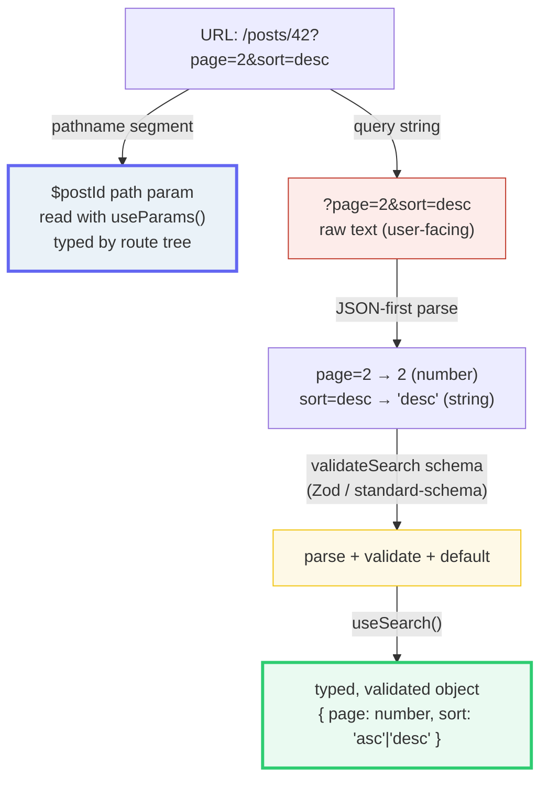

# Path & Search Params

> **Companion demo:** [`path_search_params.html`](./path_search_params.html) — open in a browser.
> Phase 6a. Typed **path params** + the killer feature: **validated (Zod) URL search params**
> via `validateSearch` / `useSearch()`.
> Cross-refs (🔗): [`tanstack_start_overview`](./tanstack_start_overview.html) · router_type_safety · file_based_routing · navigation/links.

---

## 0. TL;DR — the one idea

> **The analogy:** path params identify **WHICH** thing; search params are its **typed, validated
> state**. TanStack makes the URL a fully-typed, validated store — `?page=2` arrives as
> `{page: 2}` (a **number**) not `'2'` (a string), because the default parser is **JSON-first**.
> In react-router the same value is a raw `URLSearchParams` string you hand-coerce.



---

## 1. The two param types — two roles, two readers

| param type | where in the URL | declared via | read with | typed? |
|---|---|---|---|---|
| **path param** | `/posts/`**`42`** — a pathname segment | `$param` in the file path (`posts.$postId.tsx`) | `Route.useParams()` / `useParams()` | **yes** — by the generated route tree |
| **search param** | `?`**`page=2`**`&sort=desc` — the query string | a `validateSearch` schema (Zod / standard-schema) | `Route.useSearch()` / `useSearch()` | **yes** — validated *and* typed |

In **react-router**, search params are raw `URLSearchParams` **strings** you hand-parse and
hand-coerce (`Number(searchParams.get('page'))`). TanStack turns them into a **typed, validated
store**: you attach a schema once, and every read is correct by construction.

---

## 2. Path params — `$param`, typed by the route tree

A file named `posts.$postId.tsx` declares a path param `$postId`. Matching `/posts/42` yields
`{ postId: '42' }` at `Route.useParams()` — a **string** by default, but typed (the compiler knows
`postId: string` exists). Add `params.parse` to parse a numeric segment:

```ts
// src/routes/posts.$postId.tsx
export const Route = createFileRoute('/posts/$postId')({
  params: {
    parse: ({ postId }) => {
      if (!/^\d+$/.test(postId)) return false   // fall through to e.g. a /posts/$slug route
      return { postId: Number(postId) }         // { postId: number }
    },
    stringify: ({ postId }) => ({ postId: String(postId) }),
  },
  component: PostComponent,
})

function PostComponent() {
  const { postId } = Route.useParams()          // postId: number (with parse above)
  return <div>Post {postId}</div>
}
```

> `useParams({ strict: false })` reads path params from **any** component; the strict form reads
> only the closest match. Optional (`{-$param}`), prefix/suffix (`{$param}`), and wildcard (`$`)
> variants exist too. Navigating is type-checked:
> `<Link to="/posts/$postId" params={{ postId: '123' }} />`.

> From path_search_params.html (the path-param panel, `/posts/42/edit`):
> ```
> matched route            useParams() (default)      with params.parse
> /posts/$postId/edit  →   { postId: '42' }       →   { postId: 42 }   // number
> ```

---

## 3. Search params — the killer feature: validated + typed

### 3a. The route schema (the source of truth)

Attach a Zod object to `validateSearch`; read the typed result at `useSearch()`. The whole
parse→validate→default→type pipeline is one line:

```ts
// src/routes/products.tsx
import { createFileRoute } from '@tanstack/react-router'
import { z } from 'zod'

const productSearchSchema = z.object({
  q:    z.string().default(''),
  page: z.number().int().positive().default(1),     // missing -> 1 ; 'abc' -> error
  sort: z.enum(['asc', 'desc']).default('asc'),
  tags: z.array(z.string()).optional(),
})

export const Route = createFileRoute('/products')({
  validateSearch: productSearchSchema,              // Zod v4: schema directly
  component: ProductsPage,
})

function ProductsPage() {
  const { q, page, sort, tags } = Route.useSearch() // page: number, sort: 'asc'|'desc'
  return <ProductList page={page} sort={sort} />
}
```

> **Zod v3** needs the adapter: `validateSearch: zodValidator(schema)` with `fallback()` to keep
> types under `.catch()`. **valibot / ArkType / Effect-Schema** need **no adapter** — they implement
> [Standard Schema](https://github.com/standard-schema/standard-schema), so you pass the schema
> directly. You can also pass a plain function `(search) => typed`.

### 3b. Why `?page=2` becomes the *number* `2`

TanStack's **default search parser is JSON-first**: each value is run through `JSON.parse`.
So `page=2` → `2` (number), `tags=["a","b"]` → `["a","b"]` (array), while `sort=desc` stays a
string (`desc` isn't valid JSON). `URLSearchParams` returns **only strings**, losing all type
information at the URL boundary. The schema then re-asserts the type and fills defaults.

> From path_search_params.html (the live validator, `?q=foo&page=2&sort=desc&tags=["a","b"]`):
> ```
> useSearch() — parsed + typed (safeParse success):
> {
>   q:    "foo"     // string
>   page: 2        // number        ← a NUMBER, not '2'
>   sort: "desc"    // string
>   tags: ["a","b"] // string[]
> }
> defaults applied: (none — every field present)
> ```

### 3c. The contrast — same URL, two worlds

> From path_search_params.html (the contrast panel):
> ```
> TanStack useSearch() (typed + validated)         raw URLSearchParams (stringly-typed)
> {                                                {
>   q:    "foo"   string                             q:    "foo"   string
>   page: 2       number  ← typed                    page: "2"    string  ← lost
>   sort: "desc"  string                             sort: "desc" string
>   tags: ["a","b"] string[]                         tags: "[\"a\",\"b\"]" string  ← unparsed!
> }                                                }
> ```

---

## 4. The gold cases (pinned by the demo's gold-check)

The demo asserts three deterministic facts about its own inline validator (a faithful zero-dep
mirror of the Zod schema above):

> From path_search_params.html (gold-check badge):
> ```
> [check] ?page=3->{page:3}# & ?page=abc->fail & empty->{page:1}default: OK
> ```
> - `?page=3` → JSON-first parse → `3` (number) → passes `z.number()` → `{ page: 3 }`.
> - `?page=abc` → `JSON.parse` fails → `"abc"` (string) → **fails** `z.number()` → `errorComponent`.
> - empty query → `.default()` fills `page: 1` (and `q: ''`, `sort: 'asc'`).

Try the other chips: `?sort=banana` (enum fail), `?page=2.5` (int fail), `?tags=["x",5]` (array
element fail). Each shows which field broke, and why.

---

## Killer Gotchas

| Trap | Symptom | Fix |
|---|---|---|
| **Expecting search params as strings** | You write `Number(search.page)` like react-router; types look wrong | TanStack is **JSON-first**: `page=2` already arrives as the number `2`. Validate the *type* in the schema; don't re-coerce. |
| **Search params are part of ROUTE IDENTITY** | `<Link to="/products" />` type-errors: `search` is required | A schema with `.default()` on every field makes `search` **optional** for navigation. Without defaults, the compiler *requires* the `search` prop — search shape is part of the route's contract. |
| **An invalid `?page=abc` throws** | The route "crashes" on a bad URL | **By design.** `validateSearch` throwing fires the route's `errorComponent` (`error.routerCode === 'VALIDATE_SEARCH'`). Use `.catch()` (recover silently) or `.default()` (only for *missing*) instead of a bare `z.number()` if you want resilience. |
| **`.default()` vs `.catch()` confusion** | `.default(1)` still throws on `?page=abc` | `.default()` fires only when the field is **absent**; it does *not* rescue an invalid present value. For "invalid → fallback, no error" use `.catch(1)` (or the adapter's `fallback(z.number(), 1)`). |
| **raw `URLSearchParams` is stringly-typed** | `tags` arrives as the literal string `'["a","b"]'`, not an array | Don't hand-parse. Put it in the schema (`z.array(z.string())`) and let TanStack's JSON-first parser + validator do it. |
| **Forgetting validation throws a real error** | Users hit a broken page from a mistyped/bookmarked URL | Always provide an `errorComponent` on routes with `validateSearch`, and prefer `.catch()`/`fallback()` for fields that should self-heal. |
| **`useParams`/`useSearch` scope** | You get `undefined` or the wrong shape | `Route.useParams()` / `Route.useSearch()` are scoped to *that* route. The global `useParams({ strict: false })` / `useSearch({ strict: false })` loosens typing (values become `T | undefined`). |

### Cheat sheet

```ts
// PATH params — declared by $param in the filename; typed by the route tree
//   src/routes/posts.$postId.tsx  →  /posts/$postId
const { postId } = Route.useParams()              // postId: string (number with params.parse)

// SEARCH params — attach a schema; read typed+validated values
const schema = z.object({
  page: z.number().int().positive().default(1),   // absent -> 1 ; invalid -> .catch(1) to recover
  sort: z.enum(['asc','desc']).default('asc'),
})
export const Route = createFileRoute('/products')({ validateSearch: schema })
const { page, sort } = Route.useSearch()          // page: number, sort: 'asc'|'desc'

// the reframe:
//   path params  = WHICH thing   (pathname segment, $param,  useParams)
//   search params = typed state  (query string,  schema,   useSearch)
// parser:      JSON-first by default -> page=2 is the NUMBER 2, not '2'
// validation:  validateSearch throws on bad input -> errorComponent (VALIDATE_SEARCH)
// defaults:    .default() = missing-only ;  .catch()/fallback() = missing-OR-invalid
// identity:    search shape IS route identity — with defaults, <Link> search is optional
// libraries:   Zod v4 (direct) / Zod v3 (zodValidator+fallback) / valibot+ArkType+Effect (no adapter — Standard Schema)
```

---

## Sources

API, parser behavior, and route-identity semantics verified in ≥2 places each, Jun 2026:

- **TanStack Router Docs — *Search Params*** (the JSON-first parser, `validateSearch`, `useSearch`,
  `.default()` vs `.catch()`, `errorComponent` / `VALIDATE_SEARCH`, search as route identity):
  https://tanstack.com/router/latest/docs/guide/search-params
- **TanStack Router Docs — *Validate Search Parameters with Schemas*** (Zod v4 direct / Zod v3
  `zodValidator`+`fallback`, valibot/ArkType via Standard Schema, error handling):
  https://tanstack.com/router/latest/docs/how-to/validate-search-params
- **TanStack Router Docs — *Path Params*** (`$param` in the file path, `Route.useParams()`,
  global `useParams({ strict: false })`, `params.parse` for numeric segments):
  https://tanstack.com/router/latest/docs/guide/path-params
- **TanStack Router Docs — *useParams hook*** (typed params from closest match + parents):
  https://tanstack.com/router/latest/docs/api/router/useParamsHook
- **TanStack Router Docs — *Type Safety*** (the generated route tree types params/search end-to-end):
  https://tanstack.com/router/latest/docs/guide/type-safety
- **GitHub — TanStack/router discussions #923** (optional search params + `SearchSchemaInput` input
  typing) & **#1965** (purpose of `validateSearch`): secondary corroboration of the API.
  https://github.com/TanStack/router/discussions/923 · https://github.com/TanStack/router/issues/1965

> **Unverifiable / intentionally not claimed:** exact minor-version pin numbers are not asserted —
> pin your own in `package.json`. The demo uses a **self-authored** zero-dep validator (no Zod
> imported) to mirror the documented parse/validate/default semantics; it is faithful to the
> behaviour, not a re-export of the real library.
