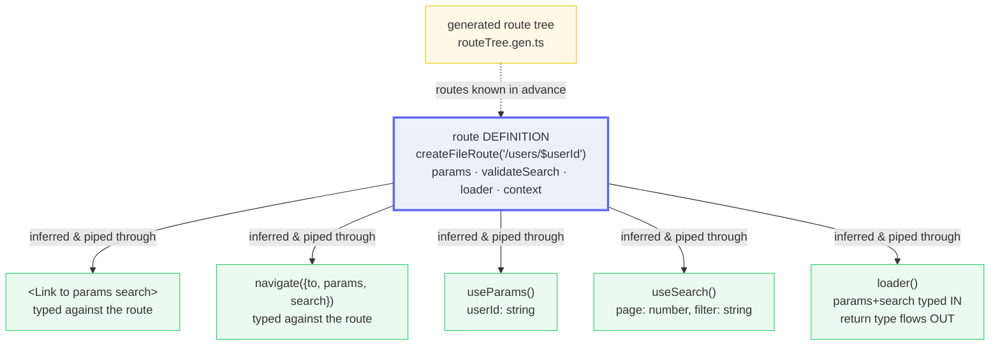

# Router Type Safety

> **Companion demo:** [`router_type_safety.html`](./router_type_safety.html) — open in a browser.
> Run the type-check simulation: correct params → PASS; flip a param to the wrong type → simulated TS error + FAIL.
> Cross-refs: 🔗 [`tanstack_start_overview`](./tanstack_start_overview.html) (Start inherits all of this) · 🔗 [`metaframework_landscape`](../metaframeworks/metaframework_landscape.html).

---

## 0. TL;DR — the one idea

> **The analogy:** TanStack Router's whole point — the route **DEFINITION** is the single
> source of truth, and types flow **OUT** of it to every navigation, param read, and loader.
> No stringly-typed paths. If a typed ORM is "the database schema is the source of truth and
> your queries are checked against it," TanStack Router is the same idea for URLs: the route
> *is* the schema, and `<Link>`/`navigate`/`useParams`/`useSearch`/`loader` are the queries.
> react-router, by contrast, hands you `Record<string, string | undefined>` and lets
> `<Link to>` be *any* string — valid route or not.



The official guide says it outright: TanStack Router "fully infers the types it's provided
and **tenaciously pipes them through the entire routing experience**." You write *fewer* types
and get *more* confidence.

---

## 1. How it works — the definition is the source of truth

You define a route once. Everything else is inference.

```ts
// routes/users.$userId.tsx — file-based routing generates the route tree
export const Route = createFileRoute('/users/$userId')({
  // search params: validated → typed (standard schema)
  validateSearch: (search) => ({
    page: Number(search.page ?? 1),       // page: number
    filter: String(search.filter ?? ''),  // filter: string
  }),
  // loader: params + search are typed IN; the return type flows OUT
  loader: ({ params, search }) => fetchUser(params.userId, search.page),
  component: UserComponent,
})

function UserComponent() {
  const { userId } = Route.useParams()    // string  — not string | undefined
  const { page, filter } = Route.useSearch()  // number, string
  // ... navigate({ to: '/users/$userId', params, search }) is checked too
}
```

Five touchpoints then read from that definition — and each is **typed by inference**:

> From router_type_safety.html (the type-flow panel, 5 touchpoints):
> ```
> 1. <Link>           reads: to + params
> 2. navigate()       reads: to + params + search
> 3. useParams()      reads: params                → userId: string
> 4. useSearch()      reads: search                → page: number, filter: string
> 5. loader()         reads: params + search → return
> ```
> `[check] 5 touchpoints (5) & correct->pass (true) & wrong->fail (true): OK`

For the top-level exports (`Link`, `useNavigate`, `useParams`, …) to carry your router's exact
types across the module boundary, you register the router once via declaration merging:

```ts
const router = createRouter({ routeTree, /* context */ })
declare module '@tanstack/react-router' {
  interface Register { router: typeof router }
}
```

---

## 2. The type-check simulation — pass / fail

The `.html` is a deterministic mock of what `tsc` does. One route declares
`params: { userId: string }` and `search: { page: number, filter: string }`. Pick what the
developer writes into `<Link>` / `navigate()`, then run the type-check:

> From router_type_safety.html (the type-check simulation, 5 scenarios):
> ```
> [PASS] everything correct            → type-check: PASS
> [FAIL] userId: string -> number      → TS2322: Type 'number' is not assignable to type 'string' for params.userId
> [FAIL] page: number -> "1"           → TS2322: Type 'string' is not assignable to type 'number' for search.page
> [FAIL] missing filter                → Property 'filter' is missing ... but required in search
> [FAIL] to="/unknown"                 → TS2322: 'string' is not assignable to the route union (unknown route)
> ```

The gold-check pins the self-consistent core: **correct input → pass, a flipped param type →
fail, and exactly 5 touchpoints.** Flip a param in the dropdown and the badge goes red —
that's the feature.

---

## 3. Typed touchpoints — TanStack vs react-router

| Touchpoint | Typed in TanStack Router? | Typed in react-router? |
|---|---|---|
| `<Link to=...>` | **YES** — `to` must resolve to a known route; `params` typed per route. | **NO** — `to` is any `string`; `params` unchecked. |
| `navigate({ to, params, search })` | **YES** — `to`, `params` AND `search` all validated against the route. | **NO** — `to: string`; `params`/`search` untyped. |
| `useParams()` | **YES** — returns the exact param type for the route (with `from`). | **NO** — `Record<string, string \| undefined>`. Every value `string|undefined`. |
| `useSearch()` | **YES** — validated + typed via `validateSearch` (standard schema). | **NO** — `URLSearchParams`: every value a string; nothing validated. |
| `loader()` return | **YES** — return type flows to `useLoaderData` / `Route.useLoaderData()`. | **PARTIAL** — `useLoaderData` typed per route, but the `params` passed in are `string`. |
| route context | **YES** — `createRootRouteWithContext<T>`; merges down the hierarchy. | **PARTIAL** — router context exists; types are manual to wire. |

The react-router column is the status quo TkDodo describes: a `useParams` that returns
`Record<string, string | undefined>` and a `<Link to>` that accepts *any* string — leftovers
from the pre-TypeScript era, with types "plucked on top that are only slightly better than
`any`."

---

## Killer Gotchas

| Trap | Symptom | Fix |
|---|---|---|
| **Forgetting the `Register` declaration** | Top-level `Link` / `useNavigate` / `useParams` lose your router's types (fall back to the loose union) | Add the `declare module '@tanstack/react-router' { interface Register { router: typeof router } }` block once, next to `createRouter`. |
| **Renaming a path param** (`$userId` → `$uid`) | Every `<Link params>`, `navigate`, `useParams`, and loader breaks **at compile time** | That's the *feature*, not a bug. The codegen + inference surface the blast radius everywhere at once — fix the errors and you're done. No silent runtime misses. |
| **Skipping the codegen** | No route tree → no `to` union → `<Link to>` can't be checked | The route-tree codegen (`routeTree.gen.ts`) is **what powers it**. Run it (file-based routing does this for you). Code-based routing works too, but you must wire `getParentRoute` so parent types propagate. |
| **Calling `useParams()` / `useSearch()` with no `from`** | TS slows to a crawl on large trees (it checks a union of *all* routes) and types are looser | Pass `from: Route.fullPath` (or use `Route.useParams()` / `getRouteApi`). For shared components, pass `strict: false` for a safe union. |
| **Treating search params as trusted** | You parse `?page=abc` as a number and get `NaN` / wrong data | `validateSearch` is mandatory in spirit: URL input can't be trusted. Validate with a standard schema; the parsed + typed result flows out. |
| **Expecting react-router params to be typed** | You migrate and assume `useParams()['id']` is a `number` | react-router params are `string | undefined` — *always*. Parse/coerce explicitly. TanStack infers; react-router doesn't. |

### Cheat sheet

```ts
// the route DEFINITION is the single source of truth — define once, infer everywhere
export const Route = createFileRoute('/users/$userId')({
  validateSearch: (s) => ({ page: Number(s.page ?? 1), filter: String(s.filter ?? '') }),
  loader: ({ params, search }) => fetchUser(params.userId, search.page),  // typed IN + OUT
  component: UserComponent,
})

// types flow OUT to every touchpoint — no hand-written types, no `as any`
<Link to="/users/$userId" params={{ userId }} search={{ page, filter }} />   // checked
navigate({ to: '/users/$userId', params: { userId }, search: { page, filter } })
const { userId } = Route.useParams()        // string
const { page } = Route.useSearch()          // number
```

```
// the thesis:  route DEFINITION = source of truth; types flow OUT to Link/navigate/useParams/useSearch/loader
// the engine:   the generated route tree (routeTree.gen.ts) is what lets the router know all routes in advance
// the contract: Register the router once so top-level hooks/components carry its exact types
// the contrast: react-router params are string|undefined; <Link to> is any string — no route tree to check against
// the gotcha:   renaming a param breaks everywhere AT COMPILE TIME — that's the feature
```

---

## Sources

Type-flow claims verified in ≥2 places each, Jun 2026:

- **TanStack Router Docs — *Type Safety*** (the canonical source): *"fully infers the types
  it's provided and tenaciously pipes them through the entire routing experience"*; documents
  `Route.useParams()`/`Route.useSearch()`, `useNavigate({ from })`, `createRootRouteWithContext`,
  the `Register` declaration-merge for top-level exports, and loader return-type inference.
  https://tanstack.com/router/latest/docs/guide/type-safety
- **TkDodo — *The Beauty of TanStack Router*** (May 25 2025; reputable secondary source, TkDodo
  is a TanStack Router contributor): the explicit react-router contrast — `useParams` returns
  `Record<string, string | undefined>`; `<Link to>` accepts "any `string`"; TanStack `<Link
  to="/issues/$issueId" params={{ issueId }}>` errors on a missing/wrong-type/unknown-route;
  `validateSearch` → `useSearch` typed → nav `search` typed; *"routes must be known in advance,
  which is fundamentally incompatible with declarative routing"* (why codegen/file-based
  routing is the engine).
  https://tkdodo.eu/blog/the-beauty-of-tan-stack-router
- **TanStack Router Docs — *Navigation***: confirms every navigation/matching API shares the
  same core interface with typed `to`/`params`/`search`.
  https://tanstack.com/router/latest/docs/guide/navigation

> **Unverifiable / intentionally softened:** the react-router `loader()` row is marked
> **PARTIAL** rather than NO — react-router's `useLoaderData` *does* carry a return type in the
> Data Router, but the `params` argument handed to the loader is still `string`. We claim the
> precise, defensible thing (params untyped) and do not overclaim that react-router has *zero*
> loader typing.
