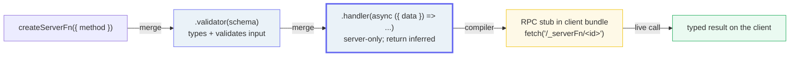
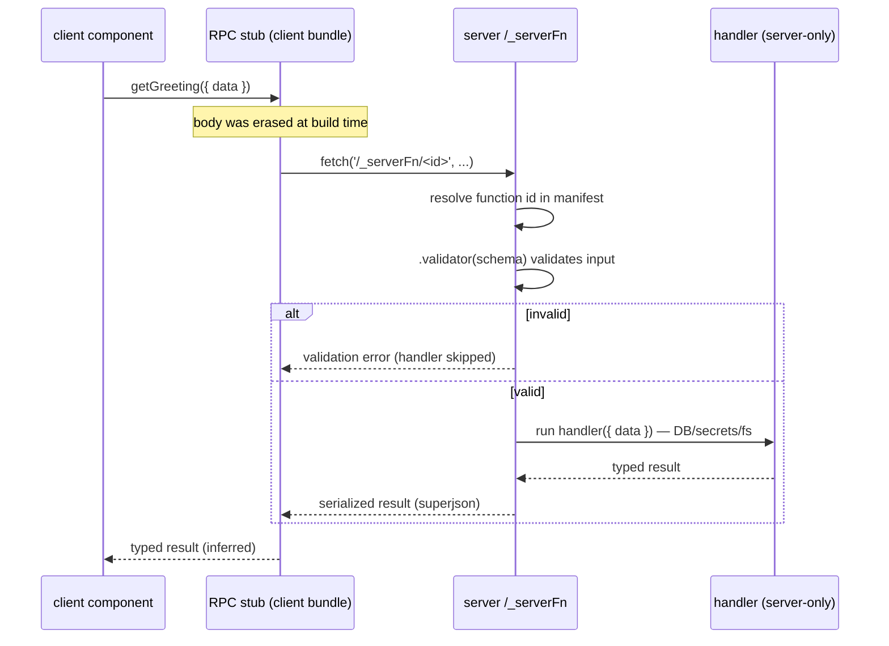

# Server Functions

> **Companion demo:** [`server_functions.html`](./server_functions.html) — open in a browser.
> Every result below is rendered live by a tiny inline validator in that explainer, simulating the
> `createServerFn().validator().handler()` round trip and verified against the official TanStack Start
> docs + the TanStack/router source. Nothing is hand-waved.

---

## 0. TL;DR — the one idea

> **The analogy:** a server function is code you **WRITE** on the server and **CALL** from the client
> like a local `async` fn — the compiler wires the RPC; the input is **validated + typed**, the return
> is **typed** — no `fetch`, no `JSON`, no `any`. You import it in a client component and call it; at
> build time the Start compiler swaps the server impl for an RPC stub (a `fetch` to a generated
> function ID), so the real body — with its DB/secrets/fs access — never reaches the browser.

```mermaid
graph LR
    subgraph SFN["Server Function (createServerFn)"]
        C1["client<br/>getGreeting({ data })"] -->|compiler stubs to fetch(/_serverFn/id)| C2["server: .validator(schema)<br/>validates + types input"]
        C2 -->|if valid| C3["server: .handler({ data })<br/>runs ONLY here (DB/secrets/fs)"]
        C3 -->|typed return inferred| C4["client: typed result<br/>(message:string, chars:number)"]
    end
    subgraph EP["hand-rolled endpoint (fetch)"]
        E1["client<br/>fetch('/api/echo', ...)"] -->|manual| E2["server: handler<br/>returns new Response(JSON...)"]
        E2 -->|raw| E3["client: await res.json()<br/>untyped any"]
    end
    style C4 fill:#eafaf1,stroke:#27ae60,stroke-width:3px
    style C2 fill:#eaf2f8,stroke:#6366f1
    style C3 fill:#eaf2f8,stroke:#6366f1
    style E3 fill:#fef9e7,stroke:#f1c40f
    style E2 fill:#fdecea,stroke:#c0392b
```

---

## 1. How it works — a chained builder

`createServerFn()` (from `@tanstack/react-start`) returns a **chained builder**. Each method call returns a
new builder with merged options. The order is: declare the method → (optional middleware) → validate the
input → define the handler.

```ts
import { createServerFn } from '@tanstack/react-start';
import { z } from 'zod';

export const getGreeting = createServerFn({ method: 'POST' })
  .validator(z.object({ name: z.string().min(1) }))   // validate + type the input
  .handler(async ({ data }) => {                       // server-only body
    // runs ONLY on the server: DB, secrets, file system
    return { message: `Hello, ${data.name}!`, chars: data.name.length };
  });
```

```ts
// client — import it anywhere (loaders, components, hooks, other server fns) and call it like a local fn:
import { getGreeting } from '#/server/greeting.functions';
const result = await getGreeting({ data: { name: 'Houston' } });
// result.message  <-- typed: string
// result.chars    <-- typed: number
```

The key mechanics (verified in the TanStack Start guide + the TanStack/router source):

- **The handler always receives `{ data }`** — the *already-validated* input. The validator's schema
  types `data`; the handler's return type is inferred back to the caller.
- **`{ method }`** is `'GET'` (the default) or `'POST'`. Use `POST` for mutations and `FormData`.
  (Forgetting it and sending `FormData` is a type error.)
- **`.validator(schema)`** is the **current** name. `inputValidator` is the **deprecated** old name
  (renamed during beta, then back). It accepts any **standard-schema** adapter — Zod, Valibot, ArkType.
- **`strict: true`** (the default) makes TypeScript check that both input *and* output are serializable
  across the network boundary. Set `strict: false` (or `{ input: false, output: false }`) only when you
  know why — it relaxes the type-level checks, not the runtime serialization.
- **The validator runs on the server.** On failure, the handler never runs and a validation error comes
  back; the bad input never touches your DB.



---

## 2. The contrast in practice — same input, two paths

The live explainer calls a curated `getGreeting` server function and a raw `echo` endpoint with the same
input. The server function validates with a Zod-like schema and returns a typed result; the endpoint
returns a raw `Response` and echoes whatever it gets.

> From `server_functions.html` — **Server Function: valid call** (`{ data: { name: "Houston" } }`):
> ```json
> {
>   "data": {
>     "message": "Hello, Houston!",
>     "chars": 7
>   }
> }
> ```
> `error === undefined`. `data` is typed end-to-end — the handler's return shape is inferred.

> From `server_functions.html` — **Server Function: invalid input** (`{ data: { name: "" } }`, fails the validator):
> ```json
> {
>   "data": null,
>   "error": {
>     "type": "validation",
>     "fields": {
>       "name": ["String must contain at least 1 character(s)"]
>     }
>   }
> }
> ```
> The handler **never ran**. `error.type === "validation"` and `error.fields.name` carries the schema
> messages. A wrong *type* (`{ name: 123 }`) is rejected too: `"Expected string, received number"`.

> From `server_functions.html` — **Endpoint: valid call** (`{ data: { name: "Houston" } }`),
> after the client does `await res.json()`:
> ```json
> {
>   "response": { "status": 200, "statusText": "OK" },
>   "parsed": { "message": "Hello, Houston!", "chars": 7 }
> }
> ```
> `parsed` is `any` — no compile-time guarantee of its shape.

> From `server_functions.html` — **Endpoint: invalid input** (`{ data: { name: "" } }`):
> ```json
> {
>   "status": 200,
>   "statusText": "OK",
>   "headers": { "Content-Type": "application/json" },
>   "body": "{\"message\":\"Hello, !\",\"chars\":0}"
> }
> ```
> **No validation** — the empty name is silently echoed as a `200`. Validation, status, and headers
> are all on you.

The gold-check in the live demo pins three deterministic facts about this very logic: a valid call
returns a typed success (`error === undefined`), an empty input fails the validator
(`error.type === "validation"`, handler skipped), and the **server fn rejects a number** while the
**hand-rolled endpoint returns `200`** for the same invalid input.

---

## 3. The round trip — client call → compiler RPC → server → typed return

This is the part you never write. The Start compiler (a Vite plugin) splits each server function into
**three** environment-specific implementations:

1. **A server RPC handler** — the file that actually contains your `.handler()` body (DB, secrets, fs).
2. **A client stub** — your server function **stripped** of its body and replaced with a `fetch` to
   `/_serverFn/<functionId>` (a stable SHA-256-based ID).
3. **An SSR wrapper** — a dynamic `import()` of the real handler, so during server rendering the call
   **skips HTTP entirely** (in-process lookup, no network round trip).



> **During SSR** the same `getGreeting()` call is dispatched through the SSR wrapper: it dynamically
> imports the handler and runs it **in-process, with no HTTP** — faster than a `fetch` to your own
> server, which a REST endpoint would still force.

---

## 4. Server function vs hand-rolled fetch — step by step

| Step / aspect | Server Function (`createServerFn`) | Hand-rolled endpoint (`fetch`) |
|---|---|---|
| **Type-safe input** | yes — `.validator(schema)` (Zod / Valibot / ArkType) | no — you parse/validate `request.json()` yourself |
| **Type-safe return** | yes — return type inferred end-to-end | no — `res.json()` is `any` |
| **Calling style** | `getGreeting({ data })` — like a local async fn | `fetch(url, opts)` + `res.json()` |
| **RPC mechanism** | compiler stubs it to `fetch('/_serverFn/<id>')` — you never write it | you write the URL, method, headers, body |
| **Validation errors** | `error.fields` keyed by field; handler skipped on failure | hand-rolled status / body checks |
| **Serialization** | automatic (superjson: `Date`/`Map`/`Set`/`URL` survive) | manual `JSON.stringify` |
| **Server code in client bundle** | never — stubbed out at build time | only what you import (watch your imports) |
| **Reachable from outside the app** | no — same-origin RPC (CSRF middleware by default) | yes — a real URL for webhooks / 3rd-party clients |
| **Best for** | typed client→server RPC, mutations, loaders | webhooks, RSS, images, non-Start clients |

**Rule of thumb:** reach for a **server function** whenever the caller is your own client code and you
want end-to-end types + free validation. Reach for a **server route / endpoint** when the caller is the
web itself (a webhook, an OAuth callback, a `fetch` from a non-Start app, or a binary/image `Response`).

---

## Killer Gotchas

| Trap | Symptom | Fix |
|---|---|---|
| **Server fns run ONLY on the server — never put `window`/`document`/client-only code in them** | build error, or "window is not defined" at runtime | keep browser-only code out of `.handler()`; if you need a different impl per environment use `createIsomorphicFn().server(...).client(...)` |
| **The validator runs server-side, not in the client bundle** | you expect client-side validation but it round-trips | it enforces the network boundary; add client UX validation separately if you want instant feedback |
| **Server fns are NOT API routes** | you try to `fetch` them from a 3rd party and it breaks / you expect a raw `Response` | they are same-origin RPC, not public endpoints. For webhooks / non-Start callers use `createServerFileRoute` (server routes), which return a raw `Response` |
| **The RPC transform needs the compiler (Vite plugin)** | `createServerFn` "doesn't do anything" / body ships to the client | the AST transform runs at build time via `@tanstack/start-plugin-core`; don't bypass the build. Avoid dynamic `import()` of server fns — use static imports so the transform can see them |
| **CSRF / same-origin is enforced by default** | cross-origin calls to a server fn are rejected | server fns check `Sec-Fetch-Site` / `Origin` / `Referer`; `createCsrfMiddleware()` is auto-installed unless you define `src/start.ts` (then add it explicitly) |
| **`GET` + `FormData` is a type error** | you can't send a form with a `GET` server fn | use `method: 'POST'` for `FormData` payloads; `GET` is for JSON-serializable query inputs |
| **Returning non-serializable data** | a class instance / function comes back as `{}` | server fns serialize with superjson (Date/Map/Set/URL/BigInt survive), but not arbitrary classes. Return plain data, or a raw `Response` |
| **`outputValidator` is not part of the current builder** | you look for `.outputValidator()` and it's gone | output type-safety today comes from the inferred return type + the `strict` serialization check (default `true`), not a separate method. Don't trust old blog snippets that show `.outputValidator()` |
| **`inputValidator` is the deprecated name** | copy-pasted code from a 2024 blog fails to type-check | use `.validator(schema)` — the current API. (`inputValidator` was renamed during beta, then back.) |

### Cheat sheet

```ts
// --- define (server/greeting.functions.ts) ---
import { createServerFn } from '@tanstack/react-start';
import { z } from 'zod';

export const getGreeting = createServerFn({ method: 'POST' })
  .validator(z.object({ name: z.string().min(1) }))
  .handler(async ({ data }) => {
    // data is validated + typed (z.infer). Runs ONLY on the server.
    return { message: `Hello, ${data.name}!`, chars: data.name.length }; // typed return (inferred)
  });
```

```ts
// --- call from the client (typed RPC, no fetch) ---
import { getGreeting } from '#/server/greeting.functions';

const result = await getGreeting({ data: { name: 'Houston' } });
// result.message  <-- string      result.chars  <-- number
// a wrong type ({ data: { name: 123 } }) is a TS error on the client AND fails the server validator.
```

```ts
// --- the raw-endpoint alternative (routes/api/echo.ts) ---
import { createServerFileRoute } from '@tanstack/react-start/server';
export const ServerRoute = createServerFileRoute('/api/echo')({
  POST: async ({ request }) => {
    const body = await request.json();          // YOU parse
    return new Response(JSON.stringify(body), { // YOU serialize + set status/headers
      status: 200,
      headers: { 'Content-Type': 'application/json' },
    });
  },
});
```

```
# the rule:
#   Server Fn = createServerFn({ method }).validator(schema).handler(({ data }) => ...)
#               -> getGreeting({ data }) from the client; compiler stubs it to fetch(/_serverFn/<id>);
#                  input validated + typed; return inferred; server code never reaches the browser.
#   Endpoint  = createServerFileRoute('/api/...')({ GET/POST }) in routes/api/*.ts
#               -> returns a raw Response; you fetch + parse + type it.
# use server fns for typed client->server RPC; use endpoints for webhooks / non-Start callers / raw JSON.
```

---

## Sources

- TanStack Start Docs — *Server Functions* (`createServerFn`, single `data` param, validation with Zod, serialization type-checking, `strict` mode, "Server functions use a compilation process… On the client, calls become fetch requests to the server", "use server routes instead" for outside callers, CSRF/same-origin RPC, generated stable function ID): https://tanstack.com/start/v0/docs/framework/react/guide/server-functions
- TanStack Router repo (zread) — *Server Functions & RPC* + *Start framework overview*: the chained builder (`createServerFn({ method, strict })` → `.middleware([...])` → `.validator(schema)` → `.handler(extractedFn, serverFn)`), the `handleCreateServerFn` AST transform producing a server provider + client caller (fetch) + SSR wrapper, schema adapters (Zod/Valibot/ArkType), `strict: { input, output }`: https://zread.ai/TanStack/router/30-server-functions-and-rpc · https://zread.ai/TanStack/router/29-start-framework-overview
- jilles.me — *TanStack Start Server Functions: How They Work and When You…* (2025 secondary blog; cross-checks the three compiled implementations — server RPC handler / client stub (fetch) / SSR wrapper (dynamic import, skips HTTP), `import { createServerFn } from '@tanstack/react-start'`, `.inputValidator(schema).handler(async ({ data }) => ...)` [the deprecated name], type-safety without tRPC/OpenAPI, when to reach for a server route instead): https://jilles.me/tanstack-start-server-functions-how-they-work/
- WorkOS Docs — *AuthKit TanStack Start SDK* changelog (secondary: confirms `validator` is the current API and `inputValidator` is deprecated: "use createServerFn().validator() instead of deprecated inputValidator"): https://workos.com/docs/sdks/authkit-tanstack-start
- GitHub — TanStack/router Discussion #2863 *Start BETA Tracking* (the `validator` → `inputValidator` → back-to-`validator` rename history): https://github.com/TanStack/router/discussions/2863

---

> **One unverifiable claim from the bundle brief, flagged honestly:** the brief mentioned an `.outputValidator()`
> method. It is **not** part of the current `createServerFn` builder API — only `.validator()` (input) plus
> the `strict` serialization type-check (default `true`) governs the output side, and the return type is
> inferred. Older `outputValidator`/`inputValidator` references in 2024 blogs are stale. This guide features
> the verified current API and does not present `outputValidator` as real.
