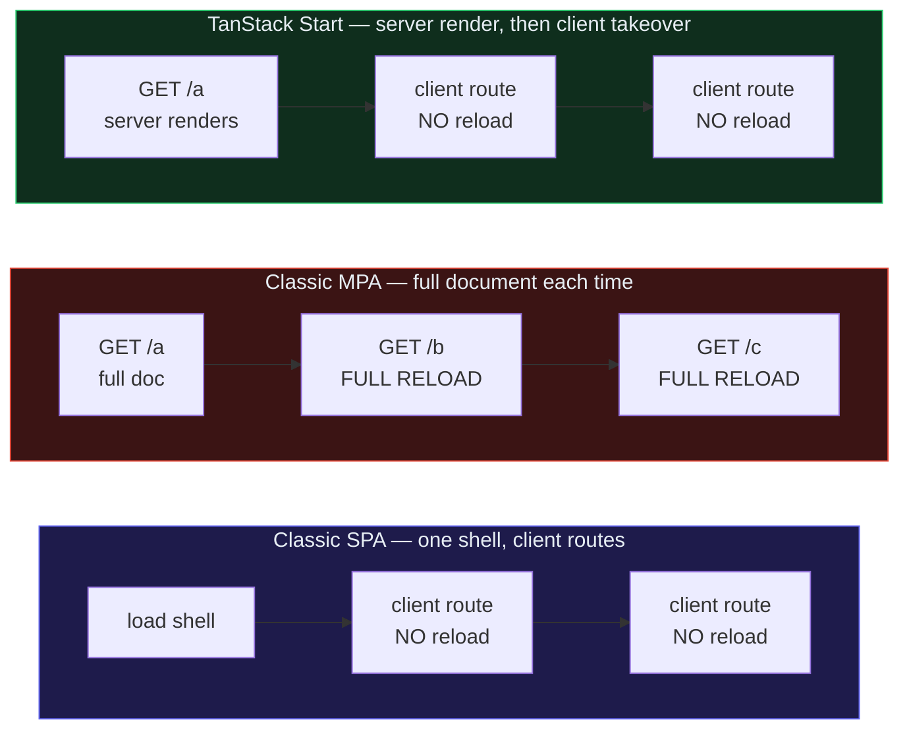
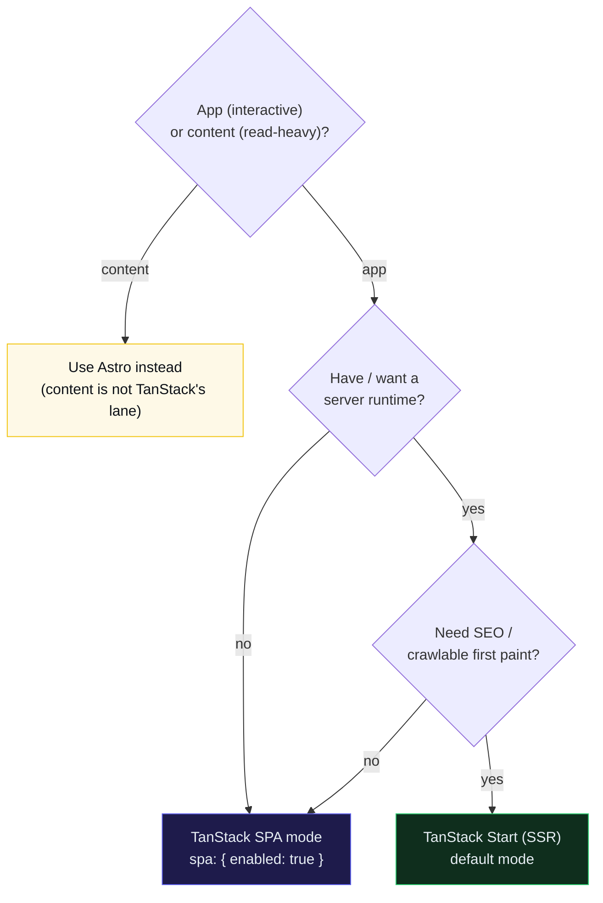

# SPA vs MPA (and how TanStack spans both)

> **Companion demo:** [`spa_vs_mpa.html`](./spa_vs_mpa.html) — open in a browser.
> Toggle the three navigation models, click *navigate*, and use the decision
> helper to pick SPA mode vs Start SSR vs Astro.
> Phase 6b · bundle #36. Every quoted value below is rendered by that file.

---

## 0. TL;DR — the one idea

> **The analogy:** a **Classic MPA** is a flipbook — turn the page and you get a
> brand-new sheet every time (full reload, crisp & SEO-friendly). A **Classic SPA**
> is a whiteboard — you draw the first board once, then keep *erasing and
> redrawing in place* (no reload, app-smooth, but a visitor who can't run your
> marker — a crawler — sees a blank board). **TanStack Start** is a *printed*
> whiteboard: the server hands you a fully-drawn page **once** (so the flipbook
> reader is happy), then the marker takes over and every change after that is an
> in-place redraw (so the app fan is happy). You get both.

> **The thesis:** TanStack Router is **SPA-only by itself**; with Start it
> **server-renders each route** for MPA-grade SEO & first paint **BUT** keeps
> SPA-grade transitions — you get both. **Pure SPA when you have no server; Start
> when you want the server-render benefits.**



---

## 1. The three navigation models

A "navigation model" is what physically happens to the HTML document when the
user moves between routes. There are exactly three:

| Model | First paint | Reloads on navigation? |
|---|---|---|
| **Classic SPA** | client-rendered (app JS must run first) | **No** — client routing swaps the view |
| **Classic MPA** | server-rendered HTML | **Yes** — a fresh document per navigation |
| **TanStack Start (SSR)** | server-rendered HTML | **No** — server renders the *first* doc, then the client takes over |

The crucial insight: Start SSR is **not** a fourth model — it is **MPA's first
paint + SPA's transitions**. The server does the heavy lifting *once* (the
initial document), then hands the wheel to the client router. Subsequent
navigation is pure client routing — instant, reload-free, app-like.

> From spa_vs_mpa.html (curated `NAV` data):
> ```
>   spa    firstPaint=client-rendered   fullReloadPerNav=0   transition=instant client routing
>   mpa    firstPaint=server-rendered   fullReloadPerNav=1   transition=full document reload
>   start  firstPaint=server-rendered   fullReloadPerNav=0   transition=instant (client takeover)
> ```
> The MPA reloads the whole document on every navigation (`fullReloadPerNav=1`,
> asserted by the gold-check). SPA and Start both do **zero** full reloads per
> nav — but Start's first paint is server-rendered (like the MPA), where the
> SPA's is client-rendered.

Open the demo and click *navigate* in each browser: the **MPA** panel flashes
white (the reload) on every click and its reload counter climbs; the **SPA** and
**Start** panels swap routes instantly with the counter pinned at zero. The only
difference is what the *first* paint looked like — and that's the SEO-defining
one.

---

## 2. The TanStack two modes — `spa` vs the default

TanStack doesn't force you onto the SSR side. The **`tanstackStart` Vite plugin**
has an `spa` option that flips the whole app to a pure SPA — no server at all:

```ts
// vite.config.ts — SPA MODE (no SSR, static shell, CDN-deployable)
import { tanstackStart } from '@tanstack/start-plugin-vite'
import { defineConfig } from 'vite'

export default defineConfig({
  plugins: [
    tanstackStart({
      spa: {
        enabled: true,   // <-- the one switch. default is false (SSR mode)
      },
    }),
  ],
})
```

With `spa.enabled: true`:
1. A normal Start build runs, then an **extra prerender step** generates a static
   **`/_shell.html`** — the root route only, with the router's pending fallback
   where matched routes would go.
2. Default rewrites send all 404s to `/_shell.html`, so any deep link lands on the
   shell and the client router takes over.
3. You deploy the HTML + client assets to **any static host / CDN** — no Node
   runtime, no server process.

With `spa` **unset** (the default), Start runs as an **SSR app**: each request is
server-rendered to full HTML (MPA-grade first paint & SEO), hydrates, and the
client router handles everything after (SPA-grade transitions). The deployable
output is a **Nitro server** (Node / Cloudflare Workers / Netlify / Vercel /
Railway).

> From spa_vs_mpa.html (decision-helper result for `app + needs SEO + has a server`):
> ```
>   TanStack Start (SSR)
>   App + a server + SEO matters. Start server-renders each route for MPA-grade
>   first paint & SEO, then the client takes over for SPA-grade, reload-free
>   transitions. You get BOTH.
>   cfg: Default mode (no spa config). Deploy the Nitro server output to
>        Node / Cloudflare Workers / Netlify / Vercel / Railway.
>   ⚠ Needs a running runtime. Pin the version — Start is still RC (Jun 2026).
> ```

> From spa_vs_mpa.html (decision-helper result for `app + no server`):
> ```
>   TanStack SPA mode (Router)
>   App-like product, but no server to SSR with. Enable SPA mode and Start
>   prerenders a static /_shell.html — client routing stays instant, deploy to
>   any CDN. SEO suffers vs SSR.
>   cfg: vite.config.ts:  tanstackStart({ spa: { enabled: true } })
>   ⚠ No SSR = no server-rendered HTML. For a public app that must rank, flip
>     SEO to Yes (with a server) → Start SSR.
> ```

---

## 3. The three-way comparison

> From spa_vs_mpa.html (the `CMP` table, TanStack column is dual by design):

| Dimension | Classic SPA | Classic MPA | TanStack — SSR | TanStack — SPA-mode |
|---|---|---|---|---|
| **First paint** | client-rendered (slow) | server-rendered (fast) | server-rendered HTML, instant | client-rendered shell (slow) |
| **SEO** | poor by default | great (full HTML) | great (full HTML per route) | poor (shell until JS runs) |
| **Transitions / reloads** | no reloads, instant | **full reload every nav** | server-render first, then client routing (no reloads) | no reloads from the shell |
| **JS shipped** | whole app shell up front | minimal per page (often zero) | full React (interactivity is the point) | full React |
| **Complexity** | simple client app | simple, but every click is a round trip | needs runtime + hydration discipline | simpler (static shell, CDN) |
| **Needs a server?** | No — CDN | Yes — renders every document | Yes — Node/serverless (Nitro) | No — static shell on a CDN |

The TanStack column *is the axis*: SSR is the server-rendered side (MPA-grade
paint/SEO), SPA-mode is the client-rendered side (classic SPA). One framework,
both ends of the spectrum, flipped by a single config boolean.

---

## 4. The decision rule

Three yes/no questions resolve almost every real choice:



The rule is deterministic (the `decide()` function in the demo):

```
content                  -> Astro
app + no server          -> SPA mode          (no SSR is possible)
app + server + SEO       -> Start SSR         (the "both worlds" pick)
app + server + no SEO    -> SPA mode          (simpler/cheaper; server fns on a separate host)
```

The two asserted gold-picks: **app + SEO + server → Start SSR**, and **app +
no-server → SPA mode** (both are exercised by the demo's gold-check).

---

## Killer Gotchas

| Trap | Symptom | Fix |
|---|---|---|
| **SPA mode ≠ "no server features at all"** | assuming `spa.enabled` disables server functions | It only disables **SSR of the document**. Server functions / server routes still work — but they need their own runtime host, separate from the static CDN. Allow-list `/_serverFn/*` and `/api/*` in your redirects. |
| **SPA mode tanks SEO** | public marketing site built in SPA mode ranks poorly | Crawlers see the `/_shell.html` shell until JS runs. For anything public that must rank/unfurl, use **Start SSR** (or Astro). |
| **Start SSR needs a runtime** | deployed the SSR build to a static host; got 404s / blank pages | The default build is a **Nitro server**, not static files. Either deploy to a Node/serverless target, or switch to `spa.enabled` for a CDN-only deploy. |
| **"SPA with no SSR" still ships the whole shell** | large JS bundle, slow TTI even though it "feels lightweight" | A classic SPA / SPA-mode app sends the **entire app shell + framework JS** up front before content paints. Code-split per route, prefetch on intent — or reach for SSR if first paint matters. |
| **Classic MPA full-reloads kill the app-feel** | every interaction flashes white, loses in-memory state | That's the defining MPA tradeoff. If the app-feel matters, you want client routing — which is exactly what Start SSR gives you *after* the first paint. |
| **Confusing "server-rendered" with "MPA"** | calling Start "an MPA" | It's not. Start server-renders the **first document** (MPA-grade) but **navigates on the client** after hydration (SPA-grade). It is neither a classic MPA nor a classic SPA — it spans both. |

### Cheat sheet

```
# the ONE switch — vite.config.ts
tanstackStart({ spa: { enabled: true } })   # SPA mode: static /_shell.html, CDN, no SSR
tanstackStart({ /* default */ })            # SSR mode: Nitro server, server-rendered per route

# the decision rule
content                  -> use Astro
app + no server          -> SPA mode        (spa.enabled)
app + server + SEO       -> Start SSR       (default)        ← "both worlds"
app + server + no SEO    -> SPA mode        (simpler; server fns on a separate host)

# the navigation model (first paint / reloads-per-nav)
classic SPA   : client-rendered  / 0       (no reloads, poor SEO by default)
classic MPA   : server-rendered  / 1       (full reload every nav, great SEO)
Start SSR     : server-rendered  / 0       (server render first, client takeover)
```

---

## Sources

- TanStack Start — *SPA mode* (the verified `tanstackStart({ spa: { enabled: true } })` config, the `/_shell.html` prerender step, CDN deploy, "No SSR doesn't mean giving up server-side features", SEO caveat): https://tanstack.com/start/v0/docs/framework/react/guide/spa-mode
- TanStack Start — *landing* ("Start can render the full document, stream useful UI, or opt routes into SPA/selective SSR modes while preserving the interactive client-side Router experience"): https://tanstack.com/start/latest
- TanStack Start — *Hosting / deployment* (the Nitro server output targets: Node / Workers / Netlify / Vercel / Railway): https://tanstack.com/start/v0/docs/framework/react/guide/hosting
- Astro — *View Transitions* (the MPA "fully reload pages during navigation" vs SPA "simulate navigation using client-side JavaScript" framing — the same axis): https://docs.astro.build/en/guides/view-transitions/
- Claranet — *Frontend Rendering: how to not mess with SPAs, SSR & friends* (the canonical MPA-vs-SPA navigation framing: "the biggest strength of SPAs is that navigation is basically a lie… not really navigating to another page as MPAs were doing since day 1"): https://www.claranet.com/it/news/frontend-rendering-how-to-not-mess-spas-ssr-friends/
- Midrocket — *SPA vs MPA vs SSG: which architecture to pick* (the comparison across performance / SEO / UX; MPAs more advantageous for SEO, SPAs better for highly interactive apps): https://midrocket.com/en/guides/spa-vs-mpa-vs-ssg/

---

### Cross-refs (🔗)

- [`ssr_streaming`](./ssr_streaming.html) — the render → flush → hydrate round trip that makes Start SSR's first paint work (and stream).
- [`tanstack_start_overview`](./tanstack_start_overview.html) — the three-layer stack (Router + Server Functions + Nitro) this bundle sits on top of.
- [`metaframework_landscape`](../metaframeworks/metaframework_landscape.html) — the broader framework-choice map; the SPA-vs-MPA axis is one slice of it.
- Astro's static-vs-server rendering modes (the astro/ phase) are the **same** axis drawn for a content-first framework.
