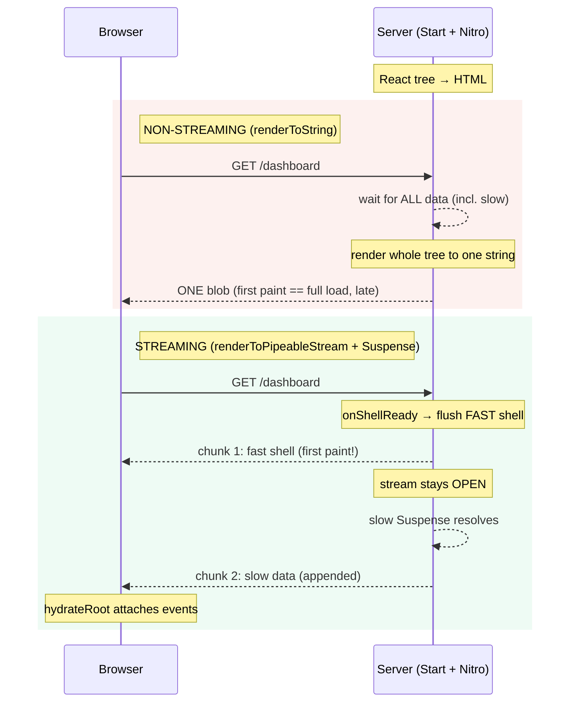
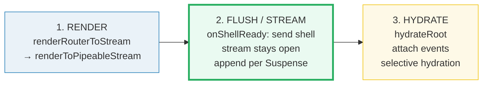

# SSR & Streaming

> **Companion demo:** [`ssr_streaming.html`](./ssr_streaming.html) — open in a browser.
> Toggle streaming, drag the slow-data delay, hit replay, and watch first paint
> vs full load diverge (streaming) or merge (non-streaming).
> Phase 6b · bundle #34. Every number below comes from the deterministic
> `simulate()` in that file. Nothing is hand-waved.

---

## 0. TL;DR — the one idea

> **The analogy:** **SSR** renders React to HTML on the server for instant first
> paint + SEO; **STREAMING** flushes that HTML as it's ready — so a slow
> `<Suspense>` boundary doesn't block the rest of the page. The user sees the fast
> shell now; the slow chunk streams in later **in the same response**.

Think of a restaurant ticket. **Non-streaming** is "we'll print your whole ticket
only once the entire order — including the slow-cooked short rib — is ready" →
you stare at an empty counter for 20 minutes. **Streaming** is "we print the
drinks + apps now and **append** the short rib to the same ticket the moment it's
done" → you start eating at minute 1. Same ticket (one HTTP response), revealed
progressively.



---

## 1. How it works

A TanStack Start page is a React tree. Under SSR the server renders that tree to
HTML **before** any client JS runs. There are two flavors (TanStack docs):

- **Non-streaming** (`renderToString`): the server waits for **all** data, renders
  the entire tree to one HTML string, and sends it as a single response. First
  paint == full load. Simple, but a single slow loader blocks everything.
- **Streaming** (`renderToPipeableStream` + `<Suspense>`): the server flushes the
  parts that are ready **now** (the "shell"), then keeps the response open and
  appends each remaining chunk as its `<Suspense>` boundary resolves.

Start picks the flavor via the **server entry handler** you export:

```tsx
// src/entry-server.tsx — STREAMING (the modern default)
import { createRequestHandler, defaultStreamHandler } from '@tanstack/react-router/ssr/server'
import { createRouter } from './router'

export async function render({ request }: { request: Request }) {
  const handler = createRequestHandler({ request, createRouter })
  return await handler(defaultStreamHandler)        // <-- streaming
}

// Non-streaming instead? swap to: handler(defaultRenderHandler)
//   (or renderRouterToString / renderRouterToStream for manual control)
```

```tsx
// src/entry-client.tsx — hydration (same for BOTH flavors)
import { hydrateRoot } from 'react-dom/client'
import { RouterClient } from '@tanstack/react-router/ssr/client'
import { createRouter } from './router'

hydrateRoot(document, <RouterClient router={createRouter()} />)
```

Three things to notice:

1. **Streaming is "all automatic"** as long as you use `defaultStreamHandler` or
   `renderRouterToStream` — Start wires React's `renderToPipeableStream` for you.
2. **Loader / server-function data is auto-dehydrated** into the HTML and
   rehydrated on the client, so you don't hand-serialize state. That's where server
   data comes from under SSR (see 🔗 [`server_functions`](./server_functions.html)).
3. **`<Suspense>` is the chunk boundary.** Each Suspense boundary whose data isn't
   ready when the shell flushes becomes one later-streamed chunk. No Suspense → no
   streaming benefit (the whole tree is one chunk).

---

## 2. The simulation — fast shell + slow Suspense chunk

The companion demo models a page with a **fast part** (header + nav, ready at
`FAST_READY = 100 ms`) and a **slow part** (a Suspense boundary whose data resolves
`delay` ms later). The `simulate()` function is pure and deterministic:

```js
function simulate(streaming, delay) {
  var slowReady = FAST_READY + delay;          // 100 + delay
  if (streaming) {
    return { firstPaint: FAST_READY,           // shell flushes (onShellReady)
             fullLoad:   slowReady,            // slow chunk lands later
             chunks: 2 };                      // shell + 1 streamed
  }
  return { firstPaint: slowReady,              // whole page blocked
           fullLoad:   slowReady,
           chunks: 1 };                        // single blob
}
```

With the default **slow-data delay = 2000 ms**:

> From ssr_streaming.html (current mode metrics, delay = 2000 ms):
> ```
>   STREAMING      first paint = 100 ms   full load = 2100 ms   chunks = 2   gap = 2000 ms
>   NON-STREAMING  first paint = 2100 ms  full load = 2100 ms   chunks = 1   gap =    0 ms
> ```
> The streaming page paints at 100 ms — **21× sooner** than non-streaming's 2100 ms,
> even though both finish at the same absolute time. The user sees content almost
> instantly; the slow block fills in 2 s later.

Drag the delay slider in the demo and the **gap (full − first)** bar for streaming
tracks it exactly, while non-streaming's first-paint == full-load line just slides
right. Push delay to 4000 ms and the contrast widens further.

---

## 3. Render → flush → hydrate (how Start orchestrates it)

Start sits on **Nitro + Vite** (the deployable server + the bundler). The round
trip is three beats:



1. **RENDER (server).** Start calls React's `renderToPipeableStream(<App/>)`
   (streaming) or `renderToString(<App/>)` (non-streaming), wrapped by its own
   handler so router/loader dehydration is automatic.
2. **FLUSH / STREAM (server → wire).** In streaming mode React fires
   `onShellReady` as soon as everything **above** the Suspense boundaries is ready
   → that HTML is flushed and becomes first paint. The stream then **stays open**;
   each resolved Suspense boundary appends a chunk (with a tiny inline script that
   swaps the fallback for the real markup).
3. **HYDRATE (client).** `hydrateRoot(document, <RouterClient/>)` walks the server
   HTML, attaches event handlers, and — thanks to React 18's **selective
   hydration** — can hydrate chunks independently and even prioritize a chunk the
   user clicked on.

---

## 4. Mode × behavior

| behavior | non-streaming (`renderToString`) | streaming (`renderToPipeableStream` + Suspense) |
|---|---|---|
| first paint (with slow data) | waits for ALL data — **late** | shell flushes at ~100 ms — **early** |
| first paint == full load? | **YES** (one blob, one timestamp) | **NO** (shell first, slow chunk later) |
| render chunks | 1 (entire page) | 2+ (shell + 1 per Suspense) |
| HTTP connection | send once, close | send shell, **keep open**, append |
| needs `<Suspense>`? | no (ignored server-side) | **YES** — boundaries mark the chunks |
| SEO | full HTML in response — great | full HTML in response — great |
| TanStack Start handler | `defaultRenderHandler` / `renderRouterToString` | `defaultStreamHandler` / `renderRouterToStream` |
| underlying React API | `renderToString` | `renderToPipeableStream` (`onShellReady`) |

SEO is identical for both: by the time the response closes, crawlers see the full
HTML. The difference is purely **when the human sees it**.

---

## Killer Gotchas

| Trap | Symptom | Fix |
|---|---|---|
| **No `<Suspense>` boundaries around slow data** | "I turned on streaming but first paint is still late" — the whole tree is one chunk | Wrap slow loaders/server-fn calls in `<Suspense fallback={…}>`; each boundary is a streaming seam |
| **Hydration mismatch** (server/client diverge) | React throws `Hydration failed` / `did not match` warnings; the server HTML is discarded and re-rendered client-side (defeats SSR) | Anything that differs run-to-run (timestamps, random IDs, `typeof window` checks, dates) must be stable server-side or guarded until after mount |
| **Expecting server data without a server boundary** | `undefined` in the rendered HTML; the loader never ran on the server | SSR data comes from **loaders** + **server functions** (`createServerFn`) — those run server-side and are auto-dehydrated. Plain `fetch` in a component runs only on the client. See 🔗 [`server_functions`](./server_functions.html) |
| **Mixing up the handler** | Streaming "doesn't work" but everything else is fine | You exported `defaultRenderHandler` (non-streaming) instead of `defaultStreamHandler`. The handler in `entry-server.tsx` decides the flavor |
| **Status code on errors** | Errors thrown during streaming can't change the HTTP status (headers already sent) | React's `onShellReady` sets status before flush; for errors after the shell, handle in an error boundary + the stream's `onError` |
| **Treating Start like Next.js** | `getServerSideProps`, `app/`, `react-router-dom` imports — nothing works | Start uses `src/routes/` + `createFileRoute` + `@tanstack/react-router` (and `@tanstack/react-start` for server fns). Wrong-framework code fails to build |

### Cheat sheet

```tsx
// STREAMING (modern default) — src/entry-server.tsx
import { createRequestHandler, defaultStreamHandler } from '@tanstack/react-router/ssr/server'
export const render = ({ request }) =>
  createRequestHandler({ request, createRouter })(defaultStreamHandler)
// non-streaming: swap defaultStreamHandler -> defaultRenderHandler

// HYDRATION — src/entry-client.tsx (same for BOTH)
import { hydrateRoot } from 'react-dom/client'
import { RouterClient } from '@tanstack/react-router/ssr/client'
hydrateRoot(document, <RouterClient router={createRouter()} />)

// THE CHUNK BOUNDARY — wrap slow data in <Suspense>
<Suspense fallback={<Spinner />}>
  <SlowPanel />          {/* its loader/server-fn resolves late -> streams in */}
</Suspense>
```

```
first paint  = when the shell flushes   (streaming: ~FAST_READY; non-streaming: slowReady)
full load    = when the last chunk lands (streaming: slowReady; non-streaming: slowReady)
streaming    -> first paint < full load   (shell now, slow chunk later)
non-streaming-> first paint == full load  (one blob)
hydration    = hydrateRoot takes over server HTML in BOTH modes
```

---

## Sources

- TanStack Router — *SSR guide* (non-streaming vs streaming, `defaultStreamHandler` / `renderRouterToStream`, `RouterServer`, loader dehydration, `hydrateRoot`): https://tanstack.com/router/v1/docs/guide/ssr
- TanStack Start — *landing* ("Full-document SSR, Streaming, Server Functions… powered by TanStack Router and Vite"): https://tanstack.com/start/latest
- LogRocket — *A guide to streaming SSR with React 18* (Suspense as the chunk boundary, `renderToPipeableStream` + `onShellReady`, `hydrateRoot` + selective hydration, the pre-React-18 waterfall problem): https://blog.logrocket.com/streaming-ssr-with-react-18/
- React — *`renderToPipeableStream`* (the streaming server API; `onShellReady`, `bootstrapScripts`): https://react.dev/reference/react-dom/server/renderToPipeableStream
- React Working Group — *New Suspense SSR Architecture in React 18* (#37) (the canonical rationale for streaming + selective hydration): https://github.com/reactwg/react-18/discussions/37
