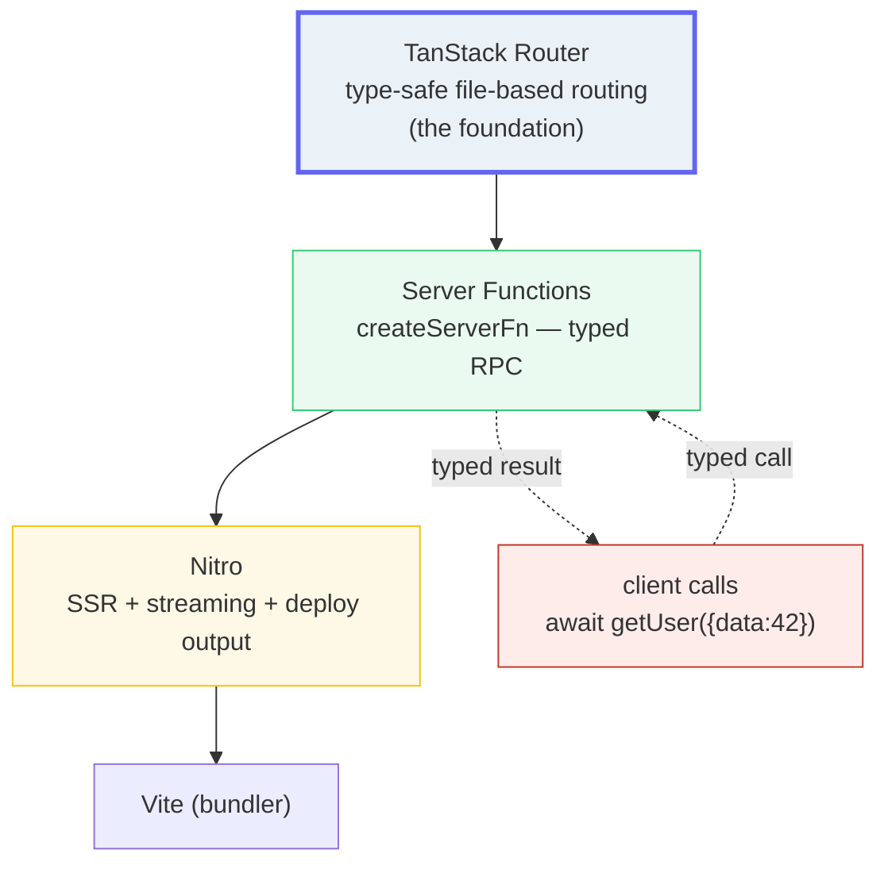

# TanStack Start Overview

> **Companion demo:** [`tanstack_start_overview.html`](./tanstack_start_overview.html) — open in a browser.
> This is the **final bundle** of the frontend curriculum (Phase 6).
> Cross-refs: 🔗 [`metaframework_landscape`](../metaframeworks/metaframework_landscape.html) (the comparison map) · 🔗 the entire [`astro/`](../astro/astro_islands.html) phase (the content-first contrast).

---

## 0. TL;DR — the one idea

> **The analogy:** TanStack Start is full-stack React on the type-safe TanStack Router:
> file-based routes + server functions (typed RPC) + SSR — the pick when your site is
> an **APP, not content**. If Astro is a printing press (ship static HTML, hydrate a few
> islands), TanStack Start is a workshop (the whole page is an interactive product, and
> your type-safety reaches all the way into the server).



**Honest status (verified Jun 2026):** v1 **Release Candidate** since Tanner Linsley's
Sep 23 2025 announcement. The official site's nav literally reads "Start**RC**" and the
blog says it's *"the build we expect to ship as 1.0, pending your final feedback, docs
polish, and a few last-mile fixes."* It is **NOT yet 1.0 GA**. See [Killer Gotchas](#killer-gotchas).

---

## 1. The stack — three layers

TanStack Start is **built ON TanStack Router**. The routing layer is the foundation;
everything else stacks on top of it.

> From tanstack_start_overview.html (the stack panel, 3 layers):
> ```
> 1. TanStack Router    [routing]   — type-safe, file-based, generated route tree
> 2. Server Functions   [typed RPC] — createServerFn, server-only code callable from client
> 3. Nitro + Vite       [SSR/deploy]— full-document SSR, streaming, deployable server output
> ```
> `[check] 3 stack layers & decide(app,full,obsessed)='start' (start): OK`

- **TanStack Router (the foundation).** Type-safe, file-based routing with a
  *generated* route tree. Params, search params, loaders, prefetch — all typed end to
  end. Stable on its own (you can use it for a pure client SPA). **Start inherits ALL of
  this.** Learning Router is non-optional: it *is* Start's routing.
- **Server Functions (`createServerFn`).** Write server-only code (DB, secrets, file
  system) that's callable from the client as a normal async function. Imported from
  `@tanstack/react-start`. The `.validator()` types the input; the `.handler()`'s return
  type flows back to the caller. This is **typed RPC, not REST** — there's no
  hand-curled URL; the framework compiles the network boundary away.
- **Nitro + Vite.** Start *ditched per-host adapters*: one Nitro server output deploys
  to Node, Cloudflare Workers, Netlify, Vercel, Railway, etc. Vite is the bundler under
  the whole stack. Full-document SSR and streaming ship built-in.

> React Server Components support is **on the way** as a non-breaking v1.x addition —
> *not* assumed today. Do not pick Start *because of* RSC yet.

---

## 2. Server-function flow — type-safety flows end to end

The headline mechanic: a function you call on the client runs on the server, and the
**return type travels back** with no manual typing or fetch boilerplate.

```ts
// server — runs ONLY here (DB, secrets, fs). imported from @tanstack/react-start
import { createServerFn } from '@tanstack/react-start';

export const getUser = createServerFn({ method: 'GET' })
  .validator((id: number) => id)          // input validated AND typed
  .handler(async ({ data }) => {
    return await db.user.findUnique({ where: { id: data } });  // return type flows back
  });

// client — call it like a normal async fn; the result is typed end-to-end
const user = await getUser({ data: 42 });   // user: { id:number, name:string } | null
user.name;                                   // string — the compiler knows
```

> From tanstack_start_overview.html (the server-function flow, 4 nodes):
> ```
> 1/4 client   — getUser({ data: 42 }) called like a normal async function
> 2/4 boundary — createServerFn's validator types the input (id: number)
> 3/4 server   — the handler runs ONLY here: DB, secrets, file system. Returns the row.
> 4/4 client   — the typed result lands: user.id:number, user.name:string. End-to-end typed.
> ```
> The gold-check asserts this panel renders and the decision helper returns `start`.

The key reframe: **server functions are NOT API routes.** You don't define HTTP endpoints
or hand-build a `fetch`. You author a function with a validated input and a typed return;
the compiler wires the call across the network boundary. The URL is an implementation
detail, not your API surface.

---

## 3. Astro vs TanStack Start — the spectrum

One question decides almost everything: **is the page mostly read, or mostly interacted
with?**

| Dimension | TanStack Start | Astro |
|---|---|---|
| **Primary use** | App-like SaaS, logged-in products. The page IS the product. | Content-first: blogs, docs, marketing, catalogs. Read-heavy. |
| **JS shipped** | Full React — rich client interactivity is the point. | Zero JS by default; only the islands you mark with `client:*` hydrate. |
| **Routing** | TanStack Router — type-safe, file-based, code-generated route tree. | File-based, page-oriented. Not a SPA router; client routing is bolted on. |
| **Server story** | Server Functions (`createServerFn`) — typed RPC. Nitro SSR + streaming. | SSG default; Server Islands + SSR on demand; Actions/API endpoints. |
| **Status (Jun 2026)** | **v1 Release Candidate** since Sep 23 2025 — **NOT yet GA**. | Stable / GA (current line v5+). |

> From tanstack_start_overview.html (the decision helper):
> ```
> profile:  site=app, server=full, typesafety=obsessed  →  TanStack Start
> profile:  site=content, *, *                          →  Astro
> profile:  site=app, server=none, *                    →  TanStack Router (SPA, no server)
> profile:  site=app, server=full, typesafety=default   →  Next.js (the industry default)
> ```

The 80/20: Astro for ~80% of the web where content is king; TanStack Start for the
app-like SaaS lane where the whole page is an interactive, typed, server-backed product.

---

## Killer Gotchas

| Trap | Symptom | Fix |
|---|---|---|
| **Assuming it's GA / production-ready** | You ship to prod on an RC, then a small RC iteration ships a documented breaking change | It's **RC since Sep 23 2025, NOT yet 1.0 GA**. Pin the version; treat each bump as planned work. The blog promises only "small RC iterations" before 1.0. |
| **Thinking Start ≈ Router** | You compare it head-to-head with full frameworks, or don't realize you must learn Router | Start is **built ON TanStack Router**. The route tree, loaders, search-param validation — that's all Router, inherited. Learn Router first (or alongside). |
| **Treating server functions as REST API routes** | You expect a curl-able URL, try to `fetch()` it by hand, or assume it's an endpoint | They're **typed RPC, not endpoints**. The compiler wires the network boundary; there's no hand-curled URL. Call them like normal async functions. |
| **Picking Start for a content site** | Full React ships to a blog/docs site — overkill, slower than Astro's zero-JS default | Content is king → **Astro**. Start is for app-like SaaS. Don't ship a full app where HTML wins. |
| **Assuming React Server Components** | You architect around RSC, then find it's not in v1 | RSC support is **"on the way" as a non-breaking v1.x addition** — not here today. Build on server functions + SSR for now. |
| **Expecting a Next.js-scale ecosystem** | Fewer tutorials, fewer battle-tested deployments, smaller hiring pool than Next.js | Honest tradeoff: newest DX + type-safety vs largest support surface. If scale/hiring wins, pick **Next.js**. |

### Cheat sheet

```ts
// server function — typed RPC. imported from @tanstack/react-start
import { createServerFn } from '@tanstack/react-start';

export const getUser = createServerFn({ method: 'GET' })
  .validator((id: number) => id)          // input validated + typed
  .handler(async ({ data }) => {          // runs ONLY on the server
    return await db.user.findUnique({ where: { id: data } });  // return type flows back
  });

// client — call it like a normal async fn; result is typed end-to-end
const user = await getUser({ data: 42 });  // user: { id:number, name:string } | null
```

```
// the stack:  Router (routing) > Server Functions (typed RPC) > Nitro (SSR/deploy), on Vite
// status:     v1 RC since Sep 23 2025 — NOT yet 1.0 GA. Pin the version.
// pick when:  app-like SaaS + you want type-safety to flow into the server boundary.
// NOT when:   content site (→ Astro) / industry-default scale (→ Next.js) / SPA no server (→ Router).
// reframe:    server functions are TYPED RPC, not REST endpoints — no hand-curled URL.
```

---

## Sources

Status, API, and architecture verified in ≥2 places each, Jun 2026:

- **TanStack Blog — *TanStack Start v1 Release Candidate*** (Tanner Linsley, Sep 23 2025):
  *"the build we expect to ship as 1.0, pending your final feedback…"* — the canonical
  status source. https://tanstack.com/blog/announcing-tanstack-start-v1
- **TanStack Start — official site** (nav shows "Start**RC**"; tagline *"Full-document
  SSR, Streaming, Server Functions, bundling and more, powered by TanStack Router and
  Vite"*) — confirms the stack layers and the RC status.
  https://tanstack.com/start
- **TanStack Start Docs — Server Functions** (`createServerFn`, validator/handler,
  type-safe across the network boundary) — confirms the API.
  https://tanstack.com/start/latest/docs/framework/react/guide/server-functions
- **React Status #445 — *TanStack Start v1 Release Candidate*** (secondary
  corroboration of the RC status and timing).
  https://react.statuscode.com/issues/445
- **Jilles Me — *TanStack Start Server Functions: How They Work and When You…***
  (secondary, `import { createServerFn } from '@tanstack/react-start'` usage).
  https://jilles.me/tanstack-start-server-functions-how-they-work/

> **Unverifiable / intentionally not claimed:** the exact 1.0 GA date is unknown — the
> blog says 1.0 will ship "shortly after collecting RC feedback" with "a few small RC
> iterations." We state plainly: **RC, not yet GA.** No GA date is asserted.
