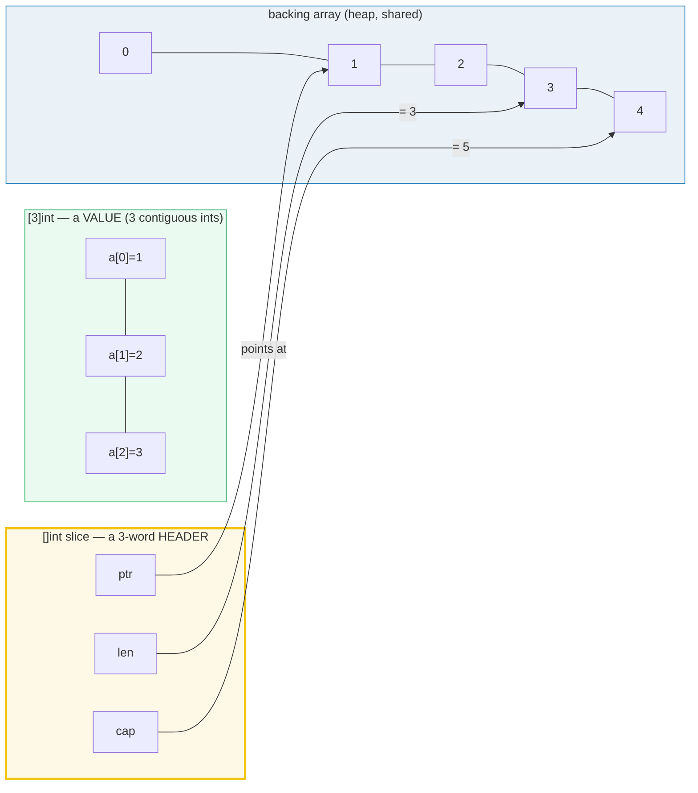
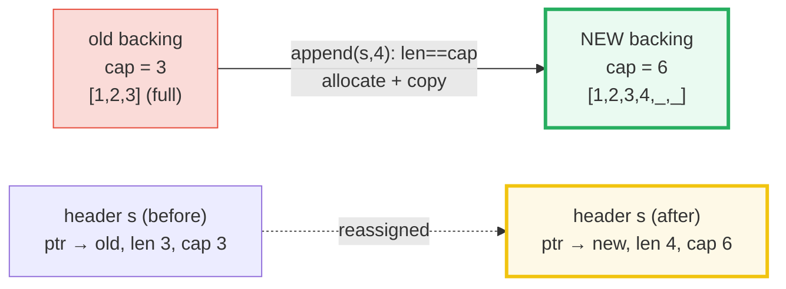
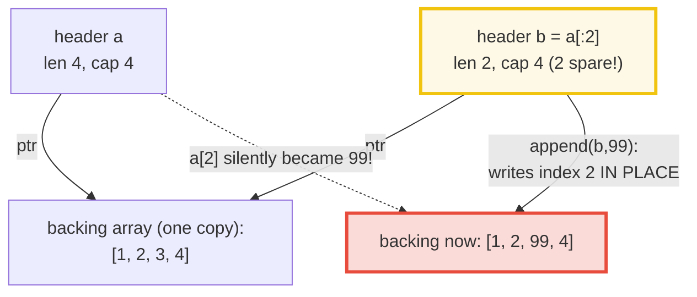

# ARRAYS_SLICES — Arrays vs. Slices, the Slice Header, and the Append-Aliasing Trap

> **Goal (one line):** prove — by printing every value — that a Go array `[N]T` is
> a fixed-size **value type** that is copied on assign/pass, while a slice `[]T` is
> a 3-word **header** (`ptr`, `len`, `cap`) that *shares* a backing array — and that
> this single difference is the root cause of `append` growth, the aliasing trap,
> and `copy`/`slices.Clone` semantics.
>
> **Run:** `go run arrays_slices.go`  ·  **Capture:** `just out arrays_slices`
>
> **Prerequisites:** 🔗 [VALUES_TYPES_ZERO](./VALUES_TYPES_ZERO.md) — you must know
> Go's zero values (`nil` is the zero value of a slice; a nil slice has `len 0` and
> is appendable, shown in Section B) before the value-vs-header contrast below makes
> sense.

---

## 0. The one-sentence model

> **An array is a value; a slice is a header that points at a value.**

Everything in this guide — the doubling, the silent corruption, why `copy` exists,
why `slices.Clone` exists, why you must *reassign* the result of `append` — is a
consequence of that one sentence. The `.go` prints the proof.



The header is itself a value: assigning/passing a slice copies exactly those three
words (`ptr`, `len`, `cap`) — never the elements. That copied `ptr` still addresses
the *same* backing array, so the callee and caller **alias** the same memory.

---

## 1. Arrays: fixed size, value semantics

A Go array type is `[N]T` — the length `N` is **part of the type**. `[3]int` and
`[4]int` are distinct, incompatible types (you cannot even assign one to the
other). Because the whole array is the value, every assignment or function call
copies all `N` elements. `len(a)` and `cap(a)` are both exactly `N`.

> From arrays_slices.go Section A:
> ```
> x := [3]int{1,2,3}  ->  x=[1 2 3]  len=3  cap=3
> [check] [3]int: len == cap == 3: OK
> y := [...]int{10,20,30}  ->  type=[3]int (counted for you)  y=[10 20 30]
> [check] [...]int literal has length 3: OK
> after y[0]=99:  x=[1 2 3]  y=[99 20 30]  (x[0] is STILL 1 — y was a copy)
> [check] array assignment copies: x[0] unchanged after mutating y: OK
> after mutateArray(z):  z=[7 8 9]  (unchanged — the copy was mutated)
> [check] array passed to func is copied: z unchanged: OK
> ```

**What it proves:**

- `[...]int{...}` is sugar: the compiler counts the elements, but the *type* is
  still the concrete `[3]int`.
- `y := x` is a **deep element-by-element copy**. `y[0] = 99` touches `y`'s own
  storage; `x[0]` stays `1`. An array is "a struct with indexed fields" — fixed
  size, copied wholesale.
- `mutateArray(z)` passes `z` **by value**: the function receives a throwaway copy,
  mutates the copy, and the caller's `z` is untouched. To let a function mutate a
  caller array you must pass `*[3]int` (a pointer to the array) — but that is a
  *pointer to an array*, still not a slice.

🔗 [FUNCTIONS_CLOSURES](./FUNCTIONS_CLOSURES.md) — passing a slice to a function
copies the 3-word header (Section B), which is *why* slices are the usual
"modifiable collection" argument: cheap to pass, yet the callee can edit elements.

---

## 2. Slices: the header that shares a backing array

A slice type is `[]T` — **no length in the type**. At runtime a slice value is a
small fixed-size struct (the **slice header**): `{ptr to backing array, len, cap}`.
`make([]T, len, cap)` allocates a backing array and returns a header over it. The
zero value of a slice is `nil` (header with `ptr == nil`, `len == cap == 0`), and
`append` works on a nil slice — it simply allocates the first backing array.

> From arrays_slices.go Section B:
> ```
> s := make([]int, 3, 5)  ->  s=[0 0 0]  len=3  cap=5
> [check] make([]int,3,5): len=3 cap=5: OK
> h := s  ->  &h[0]==&s[0]? true  (same backing; only the 3-word header was copied)
> [check] header copy shares the backing array: &h[0] == &s[0]: OK
> t := []int{1,2,3}; mutateSlice(t)  ->  t=[999 2 3]  (callee wrote through shared backing)
> [check] slice header copy shares backing: t[0] mutated by callee: OK
> var nilSlice []int  ->  nilSlice==nil? true  len=0 cap=0
> after append(nilSlice, 42)  ->  nilSlice=[42]  (append allocates the first backing array)
> [check] nil slice has len 0 and is appendable: OK
> ```

**What it proves:**

- `h := s` copies the **header** (`ptr`, `len`, `cap`) — three words — *not* the
  backing array. `&h[0] == &s[0]` is `true`: both names address the same element.
  (We compare pointers by **equality** rather than printing raw hex, because heap
  addresses change on every run under ASLR — see the determinism note in §4.2 of
  `HOW_TO_RESEARCH.md`.)
- `mutateSlice(t)` takes its parameter **by value** too — but the value copied is
  the header. The callee's header points at the *same* backing array as the
  caller's `t`, so writing `s[0] = 999` through the callee is visible in `t`. **The
  header is copied; the elements are shared.** This is the entire reason slices
  replace pointers-to-arrays in idiomatic Go.
- A `nil` slice is a perfectly usable zero-length slice: `len`/`cap` are `0`, and
  `append(nilSlice, 42)` allocates and returns a real slice. 🔗
  [VALUES_TYPES_ZERO](./VALUES_TYPES_ZERO.md) — `nil` is the zero value of `[]T`.

### 2.1 Slicing and the subslice capacity rule

`a[i:j]` produces a new header whose `ptr` is `&a[i]`, whose `len` is `j-i`, and
whose `cap` is **`cap(a) - i`** (the elements from `i` to the end of the backing
array). Section D prints this: `a` has `cap 4`, `b := a[:2]` has `cap 4` (not 2).
This "hidden capacity" is *exactly* what powers the aliasing trap.

---

## 3. `append`: in-place growth vs. reallocation

`append(s, x...)` has two behaviors depending on whether the header still has
capacity:

1. **`len < cap`** — there is spare room in the backing array. `append` writes
   `x` at index `len`, increments `len`, and returns a header pointing at the
   *same* backing array. **No allocation; the address is unchanged.**
2. **`len == cap`** — the backing array is full. `append` allocates a **new,
   larger** backing array, copies the old elements in, appends `x`, and returns a
   header over the *new* array. The new array is ~2× the old capacity for small
   slices (so future appends amortize to O(1)). **The returned header points at
   different memory than the input.**



> From arrays_slices.go Section C:
> ```
> s := make([]int, 0, 3)  ->  len=0 cap=3  &s[0] would be invalid (len=0)
> s = append(s,1,2,3)  ->  len=3 cap=3  &s[0] captured (pre-realloc)
> s = append(s,4)      ->  len=4 cap=6  (cap DOUBLED 3->6)
> same &s[0] before/after the append? false  =>  realloc happened=true (NEW backing array)
> [check] append beyond cap reallocates to a new backing (address changed): OK
> [check] small-slice growth factor ~2x: cap 3 -> 6: OK
> [check] old slice's [0] unchanged after realloc (old array survives): OK
> s after appending through 12  ->  len=12 cap=12  (6 -> 12 doubling)
> [check] next growth doubles 6 -> 12: OK
> ```

**What it proves (pinned values):**

- `make([]int, 0, 3)` then `append(s,1,2,3)` stays at `cap=3` (fits exactly, no
  realloc).
- The *next* `append(s,4)` exceeds `cap`, so `cap` **doubles to 6** and the
  `&s[0]` pointer **changes** (`same &s[0] before/after? false`). This is the
  definitive proof of a fresh backing array.
- A header (`old`) captured *before* the realloc still addresses the *old* array,
  so `old[0]` is still `1` — the old array survives the realloc until the GC reaps
  it. **This is why a stale header can pin a large array in memory** (the classic
  "gotcha" from `go.dev/blog/slices-intro`).
- Continuing to `12`, `cap` doubles again `6 → 12`.

**Why you must reassign `append`:** because the realloc may return a *different*
header, `s = append(s, x)` is mandatory. Writing `append(s, x)` without reassigning
silently drops the growth (and on the realloc path, the new element is orphaned).

> **Growth-factor detail (verify before you cite).** Pre-1.18, Go doubled until
> `cap >= 1024`, then grew by 1.25×. Since Go 1.18 the runtime uses a smoother
> `newcap = oldcap + (oldcap+3*256)/4` transition for small slices — for the sizes
> this bundle pins (3→6→12) the visible result is still a clean 2× double. Always
> treat the growth factor as "approximately 2× for small, sub-linear for large"
> and never `==`-assert a specific large-slice growth — only assert `> oldcap`.

---

## 4. THE ALIASING TRAP — append into shared capacity silently corrupts the parent

This is the **expert payoff** of the whole bundle. Because a subslice shares the
backing array *and* keeps the leftover capacity, appending into a subslice that
still has room writes straight into memory the parent slice can see. The bug is
silent: no panic, no error — just wrong data.



> From arrays_slices.go Section D:
> ```
> a := []int{1,2,3,4}  ->  a=[1 2 3 4]  len=4 cap=4
> b := a[:2]          ->  b=[1 2]  len=2 cap=4  (cap 4 = cap-from-start)
> [check] subslice cap = cap-from-index: cap(b)=4: OK
> b = append(b, 99)   ->  b=[1 2 99]  len=3 cap=4
>                      ->  a=[1 2 99 4]  (a[2] became 99 — b wrote into SHARED backing!)
> [check] ALIASING TRAP: append to b within cap mutated a[2] to 99: OK
> b = append(b,100)   ->  a=[1 2 99 100]  (a[3] became 100 — still aliasing)
> [check] alias still live at cap boundary: a[3] mutated to 100: OK
> b = append(b,777)   ->  b=[1 2 99 100 777]  (realloc; b decoupled from a)
>                      ->  a=[1 2 99 100]  (UNCHANGED across this realloc: "[1 2 99 100]")
> [check] after realloc the alias breaks: a unchanged by 777 append: OK
> ```

**What it proves (read this twice):**

1. `b := a[:2]` has `len=2` but `cap=4` — it carries the **full leftover capacity**
   of `a`'s backing array (the subslice-cap rule from §2.1). `b` thinks it has two
   free slots at indices 2 and 3.
2. `b = append(b, 99)` fits inside `b`'s capacity, so **no realloc happens**. The
   `99` is written directly into the shared backing at index 2 — which is `a[2]`.
   `a` silently changes from `[1 2 3 4]` to `[1 2 99 4]`. **`a` was never touched
   by name**, yet its data mutated.
3. One more in-place append (`100`) again aliases `a[3]`. The trap continues until
   `b` fills its capacity.
4. Once `b` is full (`len==cap==4`), the next append (`777`) **reallocates**. `b`
   now points at a *fresh* backing array and is **decoupled** from `a`. `a` stops
   changing from this point on. The alias is broken by the realloc — but you cannot
   predict *when* that happens from reading the call site, which is precisely what
   makes the bug heisenbergian.

**The fix** is to detach the subslice from the parent's capacity with a
**three-index slice expression** `a[:2:2]` (`a[start:end:cap]`), which forces
`cap(b) == 2`. Then `append(b, 99)` must realloc immediately and can never touch
`a`. Equivalently, `slices.Clone(a[:2])` returns an independent backing array.

---

## 5. `copy` and the `slices` package (stdlib, Go 1.21+)

Because slices share, you need an explicit, element-by-element copy when you want
*independence*. The built-in `copy(dst, src)` and the `slices` package provide
exactly that.

> From arrays_slices.go Section E:
> ```
> copy([]int{0,0,0}, []int{1,2,3,4}) -> dst=[1 2 3]  returned=3
> [check] copy returns min(len(dst),len(src)) == 3: OK
> clone := slices.Clone(src); clone[0]=999  ->  src=[1 2 3]  clone=[999 2 3]  (independent backings)
> [check] slices.Clone detaches backing: src unaffected: OK
> slices.Sort([]int{5,2,8,1,9})  ->  [1 2 5 8 9]
> [check] slices.Sort ascending in place: OK
> slices.Grow(make([]int,0,1), 5) -> len=0 cap=6 (room for 5 appends without realloc)
> [check] slices.Grow reserves capacity >= len+5: OK
> slices.Delete([a b c d e], 1, 4) -> [a e]
> [check] slices.Delete removes s[i:j]: OK
> ```

**What it proves:**

- `copy(dst, src)` copies `min(len(dst), len(src))` elements and **returns that
  count** (here `3`, bounded by the shorter `dst`). It also handles overlapping
  `dst`/`src` correctly. Prefer `copy` over a hand-rolled loop.
- `slices.Clone(src)` returns a shallow copy over a **new** backing array. Mutating
  `clone[0]` cannot reach `src` — the alias is gone. (`Clone` is the idiomatic fix
  for the §4 trap when you want a copy.)
- `slices.Sort` sorts **in place** (mutating the backing) and requires `cmp.Ordered`
  elements; `slices.IsSorted` verifies. There is also `slices.SortFunc` for custom
  comparators and `slices.SortStableFunc` for stable sorts.
- `slices.Grow(s, n)` guarantees room for `n` more appends without further
  reallocation — call it once before a known-size append loop to avoid repeated
  growth+copy. Here it lifts `cap` to `6` (≥ `len 0 + 5`).
- `slices.Delete(s, i, j)` removes `s[i:j]` in place and, crucially, **zeroes the
  tail** so dropped pointer/element values don't linger (preventing the
  memory-leak variant of the §3 stale-backing gotcha).

🔗 [STRINGS_RUNES_BYTES](./STRINGS_RUNES_BYTES.md) — a `string` is an immutable
`[]byte`-like header; `[]byte(s)` makes a *slice copy* of the string's bytes (the
same copy discipline as `slices.Clone`, because strings are immutable and a
mutable `[]byte` must not alias them).

---

## 6. The "why" — value vs. header, and what it costs

This is the second depth layer (mechanism, not just syntax):

- **Why arrays are values:** Go has no array decay-to-pointer (unlike C). An array
  is a single composite value, exactly like a struct with indexed fields. Copying
  it is `O(N)` and unconditional on assign/pass. This makes arrays safe but
  expensive for large `N`, which is why large fixed-size buffers are usually passed
  as `*[N]T` (one pointer word) or held as a `[]T` slice.
- **Why slices are headers:** a 3-word header is cheap and stable to copy (one
  cache line), yet it can describe an arbitrarily large backing array. This is how
  Go gets "reference-like" collection semantics *without* exposing pointers — the
  header is a value, the elements are shared. 🔗 [POINTERS](./POINTERS.md) and 🔗
  [ESCAPE_ANALYSIS](./ESCAPE_ANALYSIS.md) — a slice passed to a function escapes
  its backing array to the heap precisely because the callee's header copy can
  outlive the caller's stack frame.
- **Why `append` doubles:** amortized O(1) appends. Each realloc copies the old
  elements, so a sequence of `n` appends does at most ~`2n` element copies total.
  Doubling also gives geometric growth, so the *over*-allocation stays bounded.
- **Why the aliasing trap exists:** it is the *inevitable* consequence of (a)
  subslices keeping leftover capacity and (b) in-place append. The same design
  that makes slices fast and cheap is what makes the trap possible. You cannot
  remove the trap without removing either sharing or in-place growth — so Go keeps
  both and gives you the three-index slice `a[i:j:k]` as the surgical escape hatch.
- **Determinism caveat (for this guide).** Heap addresses (`%p`) change on every
  run under ASLR, so to keep `_output.txt` byte-identical the `.go` proves the
  realloc via **pointer equality** (`addrBefore != addrAfter`) rather than by
  printing raw hex. The behavior is pinned; the address itself is not.

---

## 7. Pitfalls table — the expert payoff

| Trap | Symptom | Fix |
|---|---|---|
| **Forgetting to reassign `append`** | `append(s, x)` (no `s =`): on the realloc path the new slice is dropped; data appears lost, no error. | Always write `s = append(s, x)`. `go vet` cannot catch this in general. |
| **Subslice append corrupts parent** | `b := a[:2]; b = append(b, 99)` silently overwrites `a[2]` (the §4 trap). | Use a three-index slice `a[:2:2]` (forces `cap(b)==2`), or `b := slices.Clone(a[:2])`. |
| **Stale header pins a huge array** | `big := make([]byte, 1<<20); small := big[:10]; return small` — `small` keeps the whole 1 MiB backing alive. | `copy` into a right-sized slice, or `slices.Clone(big[:10])`, or `slices.Clip(small)`. |
| **`cap` of a subslice surprises you** | `cap(a[:2])` is `cap(a)-0`, not `2` — you "have room" you didn't ask for. | Use `a[i:j:k]` to set the capacity explicitly when you want an isolated slice. |
| **Comparing slices with `==`** | Compile error for `[]T` (slices are not comparable). | Use `slices.Equal(a, b)`; compare `len`/`cap`/elements explicitly. |
| **`nil` slice vs empty slice** | Both have `len 0`, but `s == nil` differs; JSON marshals `nil` as `null`, empty as `[]`. | Treat them as interchangeable for logic; be deliberate about which you return to callers/serializers. |
| **`slices.Delete` leaves tail data** | Deleted elements beyond the new length can hold pointers → memory leak. | `slices.Delete` already zeroes the tail (since 1.21); if you hand-roll, zero the tail yourself. |
| **`copy` count is the shorter length** | `copy(dst, longSrc)` silently copies only `len(dst)` elements. | Check the returned `int`, or size `dst` first. |
| **Mutating a slice argument surprises the caller** | `f(s)` edits `s`'s elements in place (header copy shares backing). | Document it, return the modified slice (`f(s) []T`), or pass an explicitly `Clone`d slice. |
| **Assuming a fixed `append` growth factor** | Code that `==`-asserts `cap` after a large growth breaks across Go versions. | Only assert `cap > oldcap`; treat large-slice growth as "sub-linear, unspecified". |

---

## 8. Cheat sheet

```go
// ARRAY — fixed-size VALUE type; copied on assign/pass. len==cap==N.
var a [3]int               // [0 0 0]
b := [3]int{1, 2, 3}       // [1 2 3]
c := [...]int{1, 2, 3}     // type is still [3]int
// a = b is an O(N) element copy.

// SLICE — 3-word header {ptr, len, cap}; copies SHARE the backing array.
s := make([]int, 3, 5)     // len 3, cap 5
lit := []int{1, 2, 3}      // len==cap==3
var n []int                // nil slice; len 0, cap 0; append works

// SLICING — a[i:j] => len j-i, cap cap(a)-i. Use a[i:j:k] to pin cap.
sub := s[1:3]              // len 2, cap 4
iso := s[1:3:3]            // len 2, cap 2 (isolated: append must realloc)

// APPEND — MUST reassign. In-place if len<cap; reallocs (~2x small) if full.
s = append(s, x)
s = append(s, more...)     // variadic spread

// COPY — element-by-element; returns min(len(dst), len(src)).
n := copy(dst, src)

// slices pkg (stdlib 1.21+) — Clone detaches; Sort/Grow/Delete are in place.
c2 := slices.Clone(s)      // independent backing (the aliasing-trap fix)
slices.Sort(s)             // ascending, in place (needs cmp.Ordered)
s = slices.Grow(s, n)      // reserve room for n appends (one realloc now)
s = slices.Delete(s, i, j) // remove s[i:j]; zeroes the tail
s = slices.Insert(s, i, v...)
slices.Reverse(s)          // in place
slices.Equal(a, b)         // the only way to compare slices
```

---

## Sources

- **Go Blog — "Go Slices: usage and internals"** (Andrew Gerrand, 2011; the
  canonical reference for the slice header and the re-slicing gotcha):
  https://go.dev/blog/slices-intro
- **Go language specification** — "Slice types", "Slice expressions",
  "Appending to and copying slices", "Length and capacity":
  https://go.dev/ref/spec (sections *Slice types*, *Slice expressions*,
   *Length and capacity*, *Appending and copying slices*)
- **`slices` package** (stdlib, added Go 1.21; `Clone`, `Sort`, `Grow`,
  `Delete`, `Insert`, `Reverse`, `Equal`, `Clip`, etc.):
  https://pkg.go.dev/slices
- **`builtin` package** — `append`, `copy`, `len`, `cap`, `make` signatures:
  https://pkg.go.dev/builtin
- **Wiki — "SliceTricks"** (the community append/insert/delete/cut recipes,
  including the three-index-slice isolation idiom and the stale-header leak):
  https://github.com/golang/go/wiki/SliceTricks
- **Effective Go — "Slices"** (the idiomatic framing of `make`/`append`/`copy`):
  https://go.dev/doc/effective_go#slices

> All values in this guide were printed by `arrays_slices.go` on Go 1.26.4
> (darwin/arm64) and captured byte-identically into `arrays_slices_output.txt`
> across two `just out arrays_slices` runs. The pinned growth ladder
> (`3 → 6 → 12`) and the aliasing outcome (`a=[1 2 99 4]`) were verified live;
> no fact in this guide is hand-computed.
