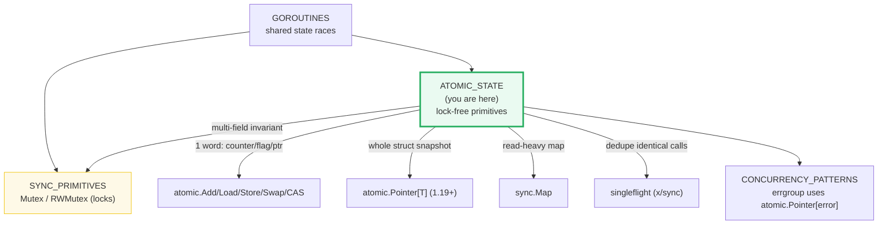
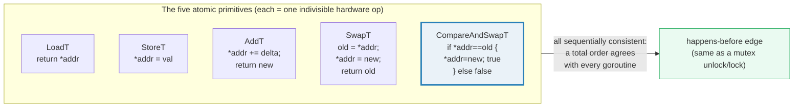
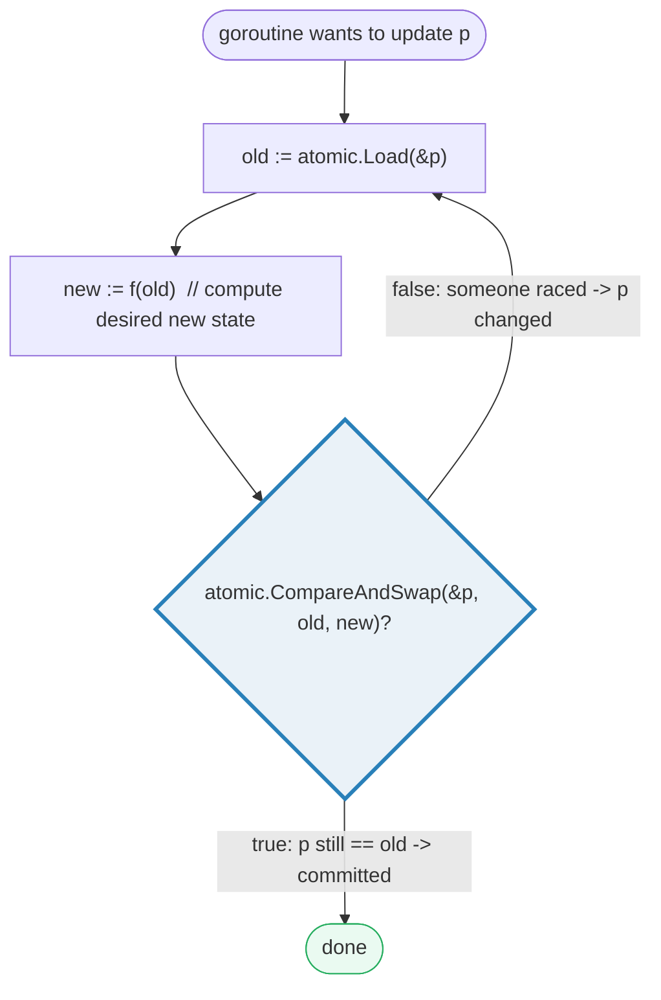
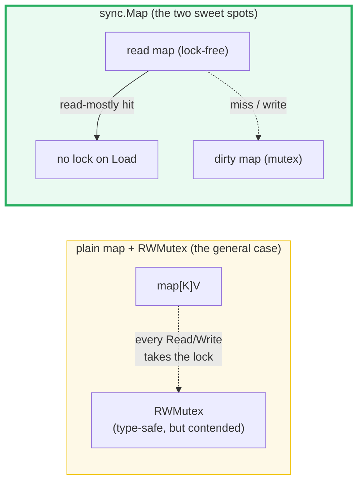
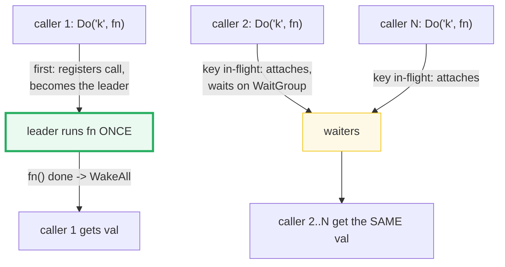

# ATOMIC_STATE — `sync/atomic`, CAS, `atomic.Pointer`, `sync.Map` & singleflight

> **Goal (one line):** show, by printing every scheduling-invariant *total*, how
> `sync/atomic` provides **lock-free primitives** (`Add/Load/Store/Swap`/
> `CompareAndSwap`, `atomic.Pointer[T]`, `atomic.Value`), how `sync.Map` serves
> read-heavy maps, how a **singleflight** clone dedupes identical concurrent
> calls, and **when a mutex beats atomic**.
>
> **Run:** `go run atomic_state.go`
>
> **Ground truth:** [`atomic_state.go`](./atomic_state.go) → captured stdout in
> [`atomic_state_output.txt`](./atomic_state_output.txt). Every number/table
> below is pasted **verbatim** from that file under a
> `> From atomic_state.go Section X:` callout. Nothing is hand-computed.
>
> **Prerequisites:** 🔗 [`GOROUTINES`](./GOROUTINES.md) (the goroutines that
> race on shared state) and 🔗 [`SYNC_PRIMITIVES`](./SYNC_PRIMITIVES.md)
> (`sync.Mutex`/`RWMutex` — the lock-based alternative this bundle contrasts
> against). 🔗 [`CHANNELS`](./CHANNELS.md) (another happens-before mechanism)
> and 🔗 [`CONTEXT`](./CONTEXT.md) (cancellation for long atomic-guarded work)
> are referenced inline.

---

## 1. Why this bundle exists (lineage)

`sync/atomic` is Go's answer to a question the channels-and-mutexes story leaves
open: **what if my shared state is just *one* word — a counter, a flag, a
pointer — and a full mutex is heavier than the work it protects?** A mutex is a
kernel-free but still real lock (atomic CAS on a state word + goroutine parking
via the runtime's semaphore); for a single counter that is overkill. The
`sync/atomic` package maps directly to **single hardware instructions**
(`LOCK XADD`, `LOCK CMPXCHG` on amd64) that are **atomic at the CPU level** and
establish the same **happens-before** ordering the memory model guarantees for
locks and channels — with no lock object, no parking, no contention queue.



The headline idea: **atomic operations are sequentially-consistent memory
fences, not just "thread-safe increments."** They are how you build the lock-free
primitives the rest of the concurrency story uses — `sync.Once`, `sync.Map`,
`sync.Pool`, and the `errgroup`-equivalent in 🔗 `CONCURRENCY_PATTERNS` are all
built on `sync/atomic` under the hood.

> From `pkg.go.dev/sync/atomic` (Overview, verbatim): *"Package atomic provides
> low-level atomic memory primitives useful for implementing synchronization
> algorithms."* And: *"In the terminology of [the Go memory model], if the effect
> of an atomic operation A is observed by atomic operation B, then A
> 'synchronizes before' B. Additionally, all the atomic operations executed in a
> program behave as though executed in some sequentially consistent order. This
> definition provides the same semantics as C++'s sequentially consistent
> atomics and Java's volatile variables."*

---

## 2. The mental model: five primitives, one ordering guarantee

Every `sync/atomic` operation is the atomic equivalent of a tiny read/write
snippet. The package documents each as a literal expansion:



> From `pkg.go.dev/sync/atomic` (verbatim expansions): the **swap** operation is
> *"the atomic equivalent of: `old = *addr; *addr = new; return old`"*; the
> **compare-and-swap** is *"the atomic equivalent of:
> `if *addr == old { *addr = new; return true }; return false`"*; the **add** is
> *"the atomic equivalent of: `*addr += delta; return *addr`"*; and **load/store**
> are *"the atomic equivalents of 'return *addr' and '*addr = val'."*

Two consequences make this package safe to build on:

1. **No torn reads.** A `Load`/`Store`/`Add`/`Swap`/`CAS` on a word-sized value
   is a single instruction — no goroutine can ever observe a half-written value.
   Section C proves this for a *multi-field* struct by publishing it through a
   single `atomic.Pointer` swap.
2. **It counts as synchronization.** The memory model defines a **data race** as
   a write concurrent with a read/write *"unless all the accesses involved are
   atomic data accesses as provided by the `sync/atomic` package."* So an
   `atomic.AddInt64(&c, 1)` from 1000 goroutines (Section A) is **not a data
   race** — the race detector stays silent — whereas the plain `c++` is, and the
   detector flags it.

> From the Go memory model (`go.dev/ref/mem`, verbatim): *"A data race is
> defined as a write to a memory location happening concurrently with another
> read or write to that same location, unless all the accesses involved are
> atomic data accesses as provided by the `sync/atomic` package."* And the
> DRF-SC guarantee: *"data-race-free programs execute in a sequentially
> consistent manner."*

---

## 3. Section A — The atomic integer counter (Add/Load/Store/Swap, race-free)

> From `atomic_state.go` Section A:
> ```
> API tour on one int64 (single-threaded):
>   StoreInt64(&n, 10); LoadInt64 -> 10
>   SwapInt64(&n, 99)   -> previous 10 (n now 99)
>   AddInt64(&n, 1)     -> new 100
> ```
> ```
> [check] StoreInt64 then LoadInt64 == 10: OK
> [check] SwapInt64 returns the previous value 10: OK
> [check] AddInt64(&n,1) after Swap to 99 yields 100: OK
> ```
> ```
> 1000 goroutines, each atomic.AddInt64(&c, 1) -> final == 1000
> [check] atomic counter == 1000 (exactly, no lost updates): OK
> [check] atomic counter lost no increments (final not < 1000): OK
> ```

**What.** The API tour pins the four workhorses on a single `int64`:
`StoreInt64(&n, 10)` writes, `LoadInt64(&n)` reads, `SwapInt64(&n, 99)` returns
the *previous* value (10) while writing 99, and `AddInt64(&n, 1)` returns the
*new* value (100). Every function takes a **`*int64`** — a pointer to the word —
because it must read/modify the **same** memory as every other goroutine via one
indivisible instruction.

**Why 1000 goroutines land on exactly 1000.** `c++` written out is *three*
steps — `Load c; c+1; Store c` — and 1000 goroutines doing that concurrently
**interleave**: many load the same old value, each adds 1, and the lost updates
leave `c` far below 1000 (and the race detector screams). `atomic.AddInt64(&c, 1)`
collapses those three steps into one `LOCK XADD`, so every increment is observed
in a single sequentially-consistent total order. The final value is **exactly**
1000 regardless of how the scheduler interleaves the goroutines — that is the
deterministic *total* this section asserts.

> From `pkg.go.dev/sync/atomic` — `AddInt64`: *"atomically adds delta to \*addr
> and returns the new value."* And the package Overview: the add operation is
> *"the atomic equivalent of: `*addr += delta; return *addr`."*

**The non-atomic version (documented, not run).** The plain counter is
deliberately **not** in the runnable path — it is a real data race, and this
bundle asserts a race-clean `go run -race`. The trap is exactly the lost-update
pattern above; the fix is one `atomic.AddInt64` (or the ergonomic `atomic.Int64`
type, see §10). Note `AddInt64`'s doc itself nudges you toward the type form:
*"Consider using the more ergonomic and less error-prone `Int64.Add` instead
(particularly if you target 32-bit platforms; see the bugs section)."*

---

## 4. Section B — The CAS retry loop (lock-free update)



> From `atomic_state.go` Section B:
> ```
> 1000 goroutines increment via a CAS retry loop -> final == 1000
> (retry count is scheduling-dependent and therefore NOT printed; only the total is asserted)
> ```
> ```
> [check] CAS-loop counter final == 1000: OK
> [check] CAS-loop counter >= 1000 (no lost increments): OK
> ```

**What.** `CompareAndSwapInt64(&p, old, new)` writes `new` **only if** the
current value still equals `old`, returning whether it won. The canonical
lock-free update wraps it in a loop:

```go
for {
    old := atomic.LoadInt64(&p)
    new := old + 1               // f(old)
    if atomic.CompareAndSwapInt64(&p, old, new) {
        break                    // committed
    }
    // CAS failed: another goroutine changed p under us -> reload & retry
}
```

**Why it is lock-free (and why retries don't break the total).** No goroutine
ever *blocks* waiting for another — a failed CAS just spins and retries. The
NUMBER of retries is purely a function of how the scheduler interleaves
goroutines, so it is **nondeterministic and never printed**. But the loop is
*correct*: every successful CAS advances the counter by exactly 1, and CAS
guarantees at most one goroutine succeeds for a given `old`, so no update is
lost or double-counted. After all 1000 goroutines join, the counter is **exactly
1000** — the same invariant as Section A, achieved without `Add`, just
`Load`+`CompareAndSwap`. This Load→compute→CAS→retry pattern is the bedrock of
every lock-free structure (free-lists, the `errgroup` first-error-wins in 🔗
`CONCURRENCY_PATTERNS`, `sync.Once`'s internals).

> From `pkg.go.dev/sync/atomic` — `CompareAndSwapInt64`: *"executes the
> compare-and-swap operation for an int64 value,"* defined as the atomic
> equivalent of `if *addr == old { *addr = new; return true }; return false`.

---

## 5. Section C — `atomic.Pointer[T]`: a typed snapshot, lock-free readers

> From `atomic_state.go` Section C:
> ```
> 8 readers x 1000 Loads each (8000 total) racing one updater
> consistent snapshots: 8000   torn snapshots: 0 (atomic.Pointer publishes whole structs)
> final snapshot after updater joined -> version 3, greeting "v3"
> ```
> ```
> [check] every snapshot was consistent (0 torn reads): OK
> [check] snapshot count == readers*iters (8000): OK
> [check] final snapshot is generation 3 (single updater, deterministic last Store): OK
> ```

**What.** `atomic.Pointer[T]` (added in **Go 1.19**) is a type-safe generic
atomic pointer to `*T` with `Load`, `Store`, `Swap`, and `CompareAndSwap`. The
bundle publishes whole immutable `*config` snapshots: an updater `Store`s
generation 1→2→3 repeatedly while 8 readers each `Load` 1000 times. Because the
struct is published **as one pointer swap**, every reader sees a *complete*
generation — never `{version:3, greeting:"v2"}` (a torn pair). Across 8000
reads, **0 torn snapshots**.

**Why "swap the pointer, never mutate the fields."** This is the lock-free
config pattern. If the updater instead did `c.version = 3; c.greeting = "v3"`
field-by-field on a shared struct, a reader could observe the write to
`version` but not yet the write to `greeting` — a torn read. By building a fresh
`*config` and publishing it with a single `ptr.Store(newConfig(v))`, the *whole*
struct becomes visible atomically. Readers take **no lock and never block the
writer**; they simply get either the old or the new pointer. (The same guarantee
is why `sync/atomic.Value` exists for the pre-generics era — but `atomic.Pointer[T]`
is preferred for typed pointers, since `Value.Load()` returns `any` and forces a
runtime type assertion.)

**Determinism discipline.** A reader might see generation 1, 2, or 3 depending
on scheduling — that *distribution* is nondeterministic and is **not** printed.
What is deterministic and asserted: (a) every observation is self-consistent
(`torn == 0`), (b) the observation *count* equals `readers*iters` (8000), and
(c) the final snapshot is generation 3 — because there is exactly **one** updater
goroutine whose last `Store` is a fixed value. Multiple updaters would make the
final value nondeterministic; one updater keeps it pinned.

> From `pkg.go.dev/sync/atomic` — `type Pointer[T any]` (added go1.19): *"A
> Pointer is an atomic pointer of type \*T. The zero value is a nil \*T. Pointer
> must not be copied after first use."* `Store`: *"atomically stores val into
> x."* `Load`: *"atomically loads and returns the value stored in x."* And the
> pre-generics `type Value`: `Load() (val any)` / `Store(val any)` —
> *"atomic.Value's typed successor"* for the pointer case.

---

## 6. Section D — `sync.Map`: a concurrent map for read-heavy workloads



> From `atomic_state.go` Section D:
> ```
> 16 callers LoadOrStore across 8 keys (2 callers/key) -> 8 stores, 8 loads
> sorted keys after Range -> [k0 k1 k2 k3 k4 k5 k6 k7]
> ```
> ```
> [check] sync.Map holds all 8 keys: OK
> [check] sorted keys == [k0 k1 k2 k3 k4 k5 k6 k7]: OK
> [check] exactly 8 stores (one winner per key): OK
> [check] exactly 8 loads (one duplicate per key): OK
> ```

**What.** `sync.Map` is a concurrent `map[any]any` safe for use by many
goroutines with **no extra locking**. `LoadOrStore(key, value)` returns
`(actual, loaded)`: if the key was absent it **stores** (`loaded == false`); if
present it **loads** the existing value (`loaded == true`). With 2 callers per
key, exactly one wins the store and one loads — so 8 keys yield exactly 8 stores
and 8 loads, regardless of who runs first.

**Why `sync.Map` exists *only* for two workloads** — and why you should usually
*not* use it:

> From `pkg.go.dev/sync` — `type Map` (verbatim): *"The Map type is specialized.
> Most code should use a plain Go map instead, with separate locking or
> coordination, for better type safety and to make it easier to maintain other
> invariants along with the map content. The Map type is optimized for two
> common use cases: (1) when the entry for a given key is only ever written once
> but read many times, as in caches that only grow, or (2) when multiple
> goroutines read, write, and overwrite entries for disjoint sets of keys. In
> these two cases, use of a Map may significantly reduce lock contention
> compared to a Go map paired with a separate `Mutex` or `RWMutex`."*

The trade-off is **type safety and write speed for lock-free reads**. A
`sync.Map` keys and values on `any` (every `Load` needs a type assertion), and
writes are *slower* than a guarded plain map (it maintains a lock-free read map
plus a mutex-protected "dirty" map it promotes). Reach for it for **growing
caches** (write-once/read-many) or **sharded disjoint-key** traffic; everywhere
else, a `map[K]V` + `sync.RWMutex` (🔗 `SYNC_PRIMITIVES`) is clearer, faster to
write, and compile-time typed.

**`Range` order is random — sort before you print.** The bundle collects keys
from `Range` into a slice and `slices.Sort`s them before printing. This is not
cosmetic: `Range` visits keys in an unspecified order, so an unsorted print
would make `atomic_state_output.txt` non-reproducible across runs (the §4.2
determinism rule for any map).

> From `pkg.go.dev/sync` — `Range`: *"calls f sequentially for each key and
> value… Range does not necessarily correspond to any consistent snapshot of the
> Map's contents."*

---

## 7. Section E — singleflight: N callers, ONE computation



> From `atomic_state.go` Section E:
> ```
> 10 callers request the SAME key concurrently via singleflight
> expensive function executed: 1 time(s) (dedup worked -> all callers shared one compute)
> callers that received the shared result == 499500: 10/10
> ```
> ```
> [check] singleflight computed exactly once: OK
> [check] all 10 callers received the shared result: OK
> ```

**What.** singleflight **dedupes concurrent identical calls**: if N callers ask
for the same key while one computation is in-flight, the computation runs **once**
and every caller shares the result. The bundle launches 10 goroutines all calling
`Do("expensive-key", fn)`; `fn` runs exactly **1 time** (it counts itself with
an atomic), yet all 10 callers receive the shared value `499500` (the sum of
0..999). This is the canonical cache-fill / thundering-herd defense: a cache
miss under a stampede of requests triggers exactly one backing-store fetch.

**Where it lives — and why this bundle reimplements it.** The real type is
`golang.org/x/sync/singleflight.Group` — **not** the standard library. This
bundle is Phase 3 (pure stdlib, no `go.mod` edits), so the `.go` builds a minimal
equivalent from scratch: a mutex-guarded `map[string]*call` where the first
caller registers a `call` (with a `sync.WaitGroup`) and runs `fn`, and late
callers find the existing `call`, attach, and `Wait()` for the shared result.
The API mirrors the real one:

> From `pkg.go.dev/golang.org/x/sync/singleflight` — `Group.Do`:
> *"Do executes and returns the results of the given function, making sure that
> only one execution is in-flight for a given key at a time. If a duplicate comes
> in, the duplicate caller waits for the original to complete and receives the
> same results. The return value shared indicates whether v was given to multiple
> callers."*

**The determinism subtlety (why the leader waits for a quorum).** "Exactly once"
holds only if every caller arrives *while the computation is in-flight*. In a
test that must be reproducible, you cannot rely on timing to guarantee that
overlap. The clone's leader therefore spins (yielding with `runtime.Gosched`)
until **all N callers have attached** to the call before computing — so no caller
can possibly miss the in-flight call and trigger a second computation. After that
quorum, `computeCount == 1` is deterministic under any scheduling, not a
timing-dependent hope. (The real `singleflight` makes the weaker, timing-based
"at-most-one in-flight" guarantee, which is all production code needs.)

---

## 8. Section F — When atomic beats mutex (and when it doesn't)

> From `atomic_state.go` Section F:
> ```
> single counter (atomic): AddInt64(&c, 42) -> 42  (one word, no lock needed)
> ```
> ```
> [check] single counter via atomic == 42: OK
> ```
> ```
> transfer: 3 accounts {100 200 300}, total before = 600
> 10 groups x 100 mutex-guarded transfers -> total after = 600 (conserved)
> ```
> ```
> [check] initial total == 600: OK
> [check] final total == 600 (multi-field invariant conserved by mutex): OK
> [check] total conserved across all transfers (before == after): OK
> ```

**The rule of thumb.**

| State shape | Tool | Why |
|---|---|---|
| **One word**: a counter, a flag, a single pointer | **`sync/atomic`** | One indivisible instruction; no lock object, no goroutine parking. |
| **A multi-field invariant**, or a critical section spanning several operations | **`sync.Mutex`** | Atomics protect *single* locations; they cannot make two updates, nor a check-then-act, appear atomic to other goroutines. |

**Case 1 — single counter → atomic.** `atomic.AddInt64(&c, 42)` is the whole
story: one word, one operation, no lock. This is Sections A–B.

**Case 2 — bank transfer → mutex.** A transfer debits one account **and** credits
another as one indivisible step; the invariant is that the **total** is always
conserved (and that an auditor summing balances never sees a half-applied
transfer). Independent `atomic.AddInt64`s on each account are *each* atomic, but
the **pair** is not: between the debit and the credit, a concurrent reader
summing the accounts field-by-field would observe a momentary imbalance. A
`sync.Mutex` makes the whole `debit; credit` a single critical section, so the
multi-field state is only ever observed in consistent snapshots. The bundle runs
1000 concurrent mutex-guarded transfers and asserts the total stays **600**.

The sharper failure mode is **check-then-act**: `if balance >= amt { balance -=
amt }` cannot be made correct with a plain `atomic.Load` plus `atomic.Add`,
because another goroutine can change `balance` between the check and the debit.
That is a *two-operation* invariant — exactly what a mutex (or a CAS loop that
re-checks inside the retry, as in §B) is for. Only the conserved **total** is
asserted here; individual balances are scheduling-dependent and not printed.

> Cross-ref: 🔗 [`SYNC_PRIMITIVES`](./SYNC_PRIMITIVES.md) covers `Mutex`/`RWMutex`
> in depth — the lock-based path you take when the invariant spans more than one
> word. 🔗 [`CHANNELS`](./CHANNELS.md) is the *other* happens-before mechanism
> ("share memory by communicating"); the atomic package doc itself opens with
> *"Share memory by communicating; don't communicate by sharing memory"* — atomics
> are the disciplined exception for the single-word case.

---

## 9. Pitfalls (the expert payoff)

| Trap | Symptom | Fix |
|---|---|---|
| `c++` on a shared int (no atomic) | lost updates (counter < N); race detector: `WARNING: DATA RACE` | `atomic.AddInt64(&c, 1)` or `atomic.Int64{}.Add(1)`. |
| CAS loop without re-loading `old` | stuck/wrong value (always compares stale `old`) | Re-`Load` inside the loop each iteration: `for { old := Load(); … if CAS(old,new){break} }`. |
| Publishing a struct field-by-field under concurrency | torn reads (reader sees `{v3, "v2"}`) | Build a fresh struct and publish it whole via `atomic.Pointer[T].Store` (§C). |
| Using `atomic.Value` for a typed pointer | runtime type-assert on every `Load()` (returns `any`) | Prefer `atomic.Pointer[T]` (Go 1.19+) — `Load()` returns `*T`, no assertion. |
| Copying an `atomic.Int64`/`Pointer`/`sync.Map` after first use | silently broken (the type docs forbid it; `go vet` copylocks may miss it) | Pass/store a pointer to the atomic; never value-copy it. "Must not be copied after first use." |
| Busy-waiting on a plain `bool` flag (`for !done {}`) | not guaranteed to terminate; the write may never be observed (no happens-before) | Use `atomic.Bool`, or signal via a channel/close. The memory model lists this as an incorrect idiom. |
| Double-checked locking with a plain `bool` | may read a partially-constructed object (observing `done` ≠ observing the data) | Gate on an `atomic.Pointer`/`sync.Once`, not a bare flag. Memory model lists this as incorrect. |
| Printing `sync.Map.Range` keys unsorted | `_output.txt` differs run-to-run (Range order is random) | Collect keys, `slices.Sort`, then print. |
| Using `sync.Map` for a write-heavy / type-critical map | slow writes, `any` everywhere, lost compile-time key typing | Use `map[K]V` + `sync.RWMutex` unless your workload is write-once/read-many or disjoint-key. |
| Assuming `AddUint32(&x, -1)` decrements | compile error (uint can't take -1) | Decrement with `AddUint32(&x, ^uint32(0))`; or just use `atomic.Int64`. |
| atomic on `int` (not `int64`) via the function API | type mismatch (`AddInt64` wants `*int64`) | Keep the variable `int64`, or use `atomic.Int64` which sidesteps the width issues the `Int64` type was added to fix. |

---

## 10. Cheat sheet

```go
// --- function API (operate on *T pointers) ---
var c int64
atomic.AddInt64(&c, 1)                      // *addr += delta; returns NEW value
v := atomic.LoadInt64(&c)                    // atomic read
atomic.StoreInt64(&c, 42)                    // atomic write
old := atomic.SwapInt64(&c, 99)             // write new, return PREVIOUS
ok := atomic.CompareAndSwapInt64(&c, old, new) // write new iff *addr==old

// --- type API (Go 1.19+): ergonomic, self-addressing, no *T juggling ---
var c atomic.Int64                           // zero value is 0
c.Add(1); c.Load(); c.Store(42); c.Swap(99); c.CompareAndSwap(old, new)
var b atomic.Bool                            // zero value is false
var p atomic.Pointer[Config]                 // zero value is a nil *Config
p.Store(&Config{...}); snap := p.Load(); p.CompareAndSwap(old, &new)

// --- the CAS retry loop (the bedrock of every lock-free structure) ---
for {
    old := atomic.LoadInt64(&p)
    new := f(old)
    if atomic.CompareAndSwapInt64(&p, old, new) { break } // reload & retry on false
}

// --- atomic.Value (pre-generics; Load returns any) ---
var v atomic.Value
v.Store(someConfig); got := v.Load().(Config)   // prefer atomic.Pointer[T] for typed ptrs

// --- sync.Map: read-heavy / write-once caches only (keys+values are any) ---
var m sync.Map
actual, loaded := m.LoadOrStore(key, val)   // loaded=false if it stored, true if it loaded
m.Store(k, v); m.Load(k); m.LoadAndDelete(k); m.Delete(k)
m.Range(func(k, v any) bool { …; return true }) // ORDER IS RANDOM -> sort before printing

// --- singleflight: dedupe identical concurrent calls (golang.org/x/sync) ---
// g.Do(key, fn) runs fn once for N concurrent same-key callers; all share the result.

// --- when to use what ---
//   one word (counter/flag/pointer) -> sync/atomic
//   multi-field invariant / multi-op critical section -> sync.Mutex (or sync.RWMutex)
```

---

## Sources

Every signature, version, and behavioral claim above was verified against the Go
standard-library docs and the Go memory model, then corroborated by independent
secondary sources:

- `sync/atomic` package — https://pkg.go.dev/sync/atomic
  - Overview (primitives; *"if the effect of an atomic operation A is observed
    by atomic operation B, then A 'synchronizes before' B… sequentially
    consistent order… same semantics as C++'s sequentially consistent atomics and
    Java's volatile variables"*; the swap/CAS/add/load-store literal expansions;
    *"Share memory by communicating; don't communicate by sharing memory"*):
    https://pkg.go.dev/sync/atomic#pkg-overview
  - `AddInt64` / `LoadInt64` / `StoreInt64` / `SwapInt64` /
    `CompareAndSwapInt64` signatures and the *"Consider using the more ergonomic
    `Int64.Add` instead"* guidance:
    https://pkg.go.dev/sync/atomic#AddInt64
  - `type Pointer[T any]` (added **go1.19**) — *"an atomic pointer of type \*T…
    must not be copied after first use"*; `Load`/`Store`/`Swap`/`CompareAndSwap`:
    https://pkg.go.dev/sync/atomic#Pointer
  - `type Int64` / `Bool` / `Uint32` … (added go1.19) and `type Value`
    (`Load() any` / `Store(val any)`, the pre-generics container):
    https://pkg.go.dev/sync/atomic#Int64
- `sync` package — https://pkg.go.dev/sync
  - `type Map` — *"specialized… optimized for two common use cases: (1) when the
    entry for a given key is only ever written once but read many times… (2)
    when multiple goroutines read, write, and overwrite entries for disjoint
    sets of keys"*; *"Most code should use a plain Go map instead… with separate
    locking or coordination"*:
    https://pkg.go.dev/sync#Map
  - `Map.LoadOrStore` / `Map.Range` (*"does not necessarily correspond to any
    consistent snapshot"*):
    https://pkg.go.dev/sync#Map.LoadOrStore
- The Go memory model (Version of June 6, 2022) — the data-race definition
  exempting *"atomic data accesses as provided by the `sync/atomic` package"*,
  the DRF-SC guarantee, the Atomic Values section (*"A is synchronized before
    B… sequentially consistent order… same semantics as C++'s sequentially
    consistent atomics and Java's volatile variables"*), and the double-checked-
    locking / busy-wait-on-a-flag anti-patterns: https://go.dev/ref/mem
- `golang.org/x/sync/singleflight` — `Group.Do`: *"only one execution is
    in-flight for a given key at a time. If a duplicate comes in, the duplicate
    caller waits for the original to complete and receives the same results"*
    (NOT stdlib — hence the from-scratch reimplementation here):
    https://pkg.go.dev/golang.org/x/sync/singleflight
- Secondary corroboration (>=2 independent sources, web-verified):
  - AlgoMaster.io — *"Go Memory Model | Concurrency Interview"* (happens-before,
    `sync/atomic` as synchronization, CAS loop pattern):
    https://algomaster.io/learn/concurrency-interview/go-memory-model
  - Go 101 — *"Atomic Operations Provided in The sync/atomic Standard Package"*
    (the five functions per integer type, CAS semantics):
    https://go101.org/article/concurrent-atomic-operation.html
  - golang/go Discussion #47141 / Russ Cox — *"Updating the Go memory model"*
    (why atomics were formally added to the memory model; sequentially-
    consistent semantics):
    https://github.com/golang/go/discussions/47141

**Facts that could not be verified by running** (documented, not executed,
because they are data races / compile errors by design): the plain `c++` counter
losing updates and tripping the race detector (it is a real data race — this
bundle's runnable path is race-clean by construction); the `AddUint32` decrement
trick (`^uint32(0)`) and the 32-bit `int64`-atomic caveats the `Int64` type was
added to avoid. These are confirmed by the `pkg.go.dev/sync/atomic` docs and the
secondary sources cited above, not reproduced as runnable output (a file
containing the racy counter would fail `just check`'s race-clean expectation).
