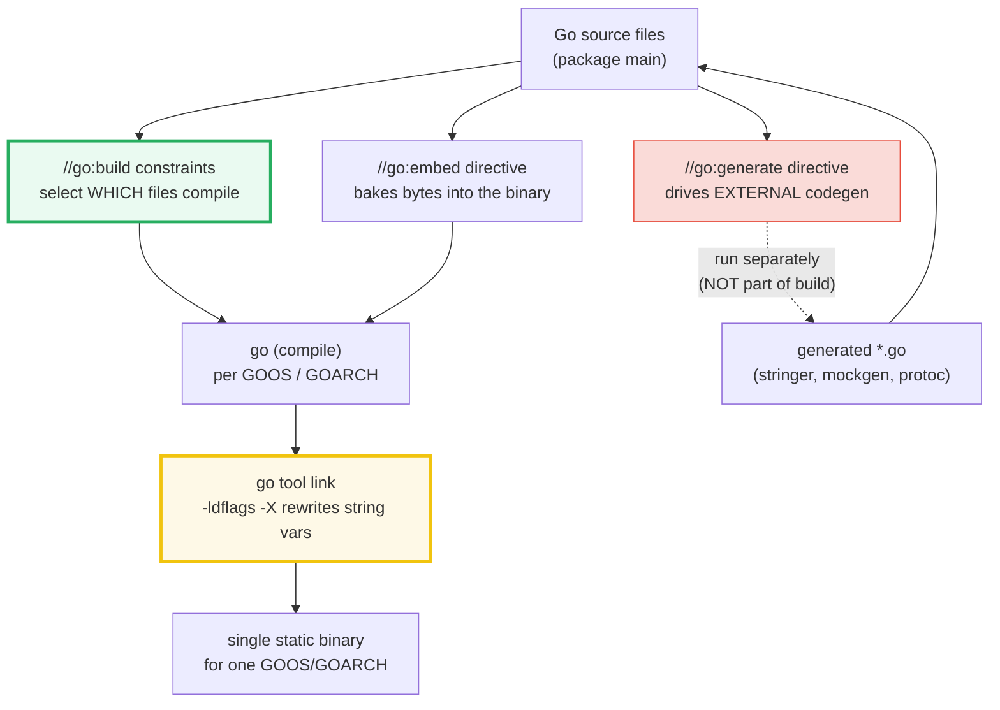
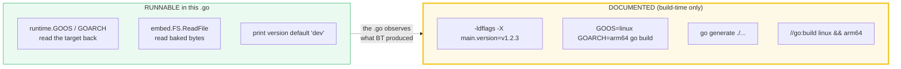
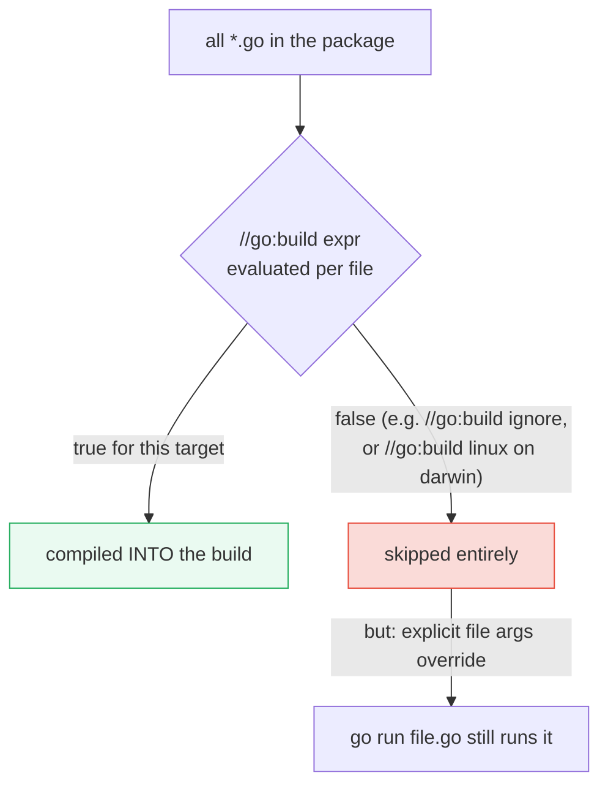
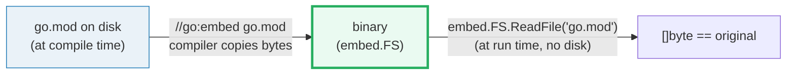
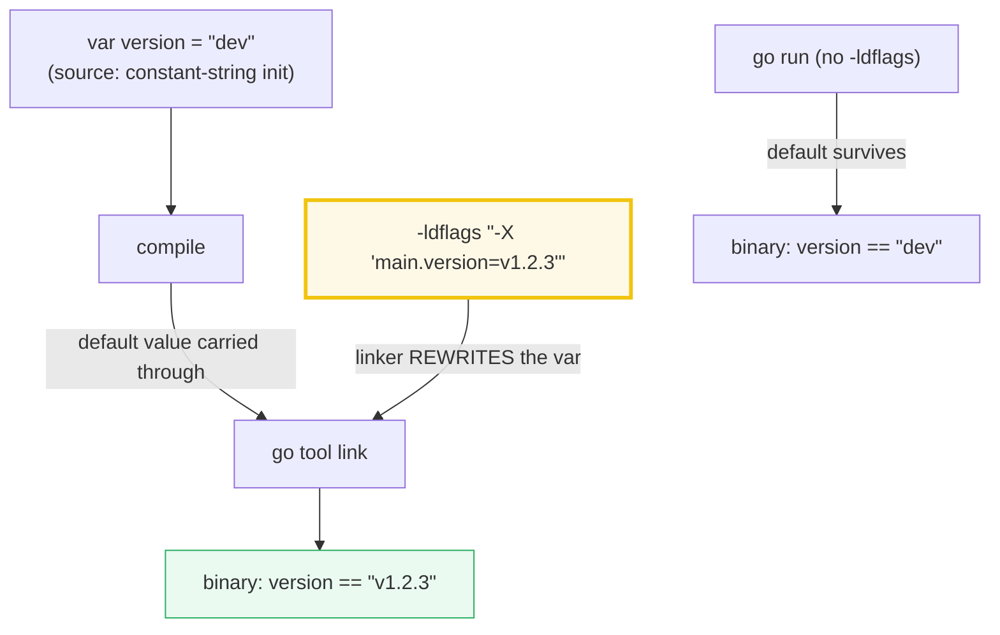
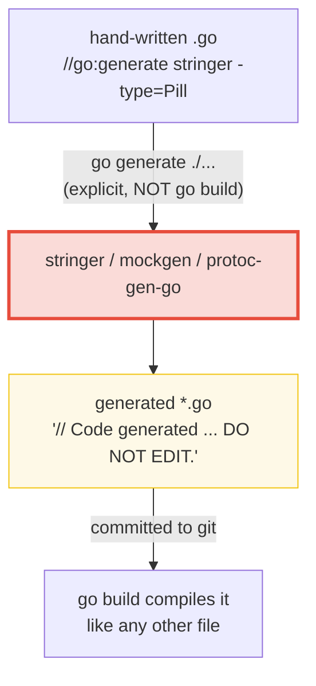

# BUILD_LDFLAGS_GENERATE — Build Constraints, `-ldflags -X`, Cross-Compile, `//go:embed` & `go generate`

> **Goal (one line):** show, by printing every value, how Go's **build-time**
> machinery shapes a binary — `//go:build` selects files at compile time,
> `//go:embed` bakes bytes in, `-ldflags -X` rewrites a string var at link
> time, `GOOS`/`GOARCH` drive cross-compilation, and `//go:generate` drives
> codegen — plus the runtime read-outs (`runtime.GOOS`/`GOARCH`) that let a
> running program inspect which target it was built for.
>
> **Run:** `go run build_ldflags_generate.go`
>
> **Ground truth:** [`build_ldflags_generate.go`](./build_ldflags_generate.go)
> → captured stdout in
> [`build_ldflags_generate_output.txt`](./build_ldflags_generate_output.txt).
> Every number/table below is pasted **verbatim** from that file under a
> `> From build_ldflags_generate.go Section X:` callout. Nothing is
> hand-computed.
>
> **Prerequisites:** 🔗 [`OS_FILEPATH_EMBED`](./OS_FILEPATH_EMBED.md) (the
> full `embed.FS` / `io/fs.FS` story — this bundle reuses one `//go:embed`
> and points there for depth), 🔗 [`RUNTIME_INTERNALS`](./RUNTIME_INTERNALS.md)
> (`runtime.GOOS`/`GOARCH`/`Compiler` as platform constants — this bundle
> shows the build-time side of the same target), 🔗
> [`MODULES_WORKSPACE`](./MODULES_WORKSPACE.md) (the `go.mod` that this file
> embeds), 🔗 [`LINT_STATICCHECK`](./LINT_STATICCHECK.md) (`go vet` honors
> build tags; staticcheck too).

---

## 1. Why this bundle exists (lineage)

Go is famous for **fast, hermetic, single-command builds.** That reputation is
not magic — it falls out of a small set of build-time mechanisms that the `go`
tool exposes as **comments the compiler/linker/codegen-driver recognize**:



Each of these is a **comment with a reserved prefix** (`//go:build`,
`//go:embed`, `//go:generate`) plus a **flag the tool consumes**
(`-ldflags -X`, `GOOS`/`GOARCH`). Mastering them is what separates "I can
write Go" from "I can ship Go": they are how a release pipeline injects a
version, how one source tree serves linux/arm64 and windows/amd64, how a CLI
ships its templates without external files, and how boilerplate (`String()`
methods, mocks) gets generated.

> The crucial boundary this bundle keeps explicit: **three of these are
> build-time-only and a running program cannot self-trigger them.** A binary
> cannot `-ldflags -X` into itself, cannot re-run `go generate` on itself, and
> cannot cross-compile itself. So the `.go` file RUNS what is runnable
> (`runtime.GOOS`, `//go:embed` read-back, the default `version` value) and
> DOCUMENTS the build-time actions (the exact `-X` command, the cross-compile
> command, the `//go:generate` directive) as the commands a developer types —
> never as code `main()` executes. This split is the discipline that keeps the
> bundle honest.

---

## 2. The mental model: five mechanisms, three lifecycles

| Mechanism | Lifecycle | Recognized by | Effect |
|---|---|---|---|
| `//go:build <expr>` | **compile** | `go build` (file selection) | includes/excludes whole `.go` files per OS/arch/tags |
| `//go:embed <pattern>` | **compile** | `go build` (compiler) | bakes file bytes into a `string`/`[]byte`/`embed.FS` var |
| `-ldflags -X importpath.name=value` | **link** | `go tool link` | rewrites a string package var's value in the binary |
| `GOOS` / `GOARCH` env | **compile + link** | whole toolchain | picks the target OS/arch (cross-compile) |
| `//go:generate <cmd>` | **manual / codegen** | `go generate` (separate) | runs an external generator before `go build` |



---

## 3. Section A — `runtime.GOOS` / `GOARCH`: the build target, read at run time

> From `build_ldflags_generate.go` Section A:
> ```
> runtime.GOOS     = "darwin"
> runtime.GOARCH   = "arm64"
> runtime.Compiler = "gc"   (the toolchain; 'gc' is the standard Go compiler)
> switch runtime.GOOS -> platform tag: Apple (macOS / iOS)
> ```
> ```
> [check] GOOS is a non-empty known target: OK
> [check] GOARCH is a non-empty known target: OK
> [check] Compiler is the gc toolchain: OK
> ```

**What.** `runtime.GOOS` and `runtime.GOARCH` are package-level **constants**
(set by the runtime at startup from the values the compiler baked in). They
tell a running program *which target it was built for*. The bundle prints the
real values for this host (`darwin`/`arm64`) and then branches on `GOOS` to
pick a human-readable platform tag.

**Why the bundle only ever asserts *set membership*, never a single value.**
`runtime.GOOS` is **host/toolchain-dependent** — on a Linux CI runner the same
file prints `linux`/`amd64`. So the checks assert `GOOS` is in the *known set*
of Go targets and `GOARCH != ""`, not that `GOOS == "darwin"`. This is the
house determinism rule applied to a printed value that is stable *run-to-run
on one host* but not across hosts (🔗 `RUNTIME_INTERNALS` Section F uses the
same discipline).

**Runtime switch vs. compile-time file selection.** The `switch runtime.GOOS`
here runs **at run time** inside one binary — every branch is compiled in, the
runtime picks one. That is different from `//go:build` (Section B), where the
*whole file* is included or excluded before the binary exists. Use the runtime
switch when you want one binary that adapts; use `//go:build` when you want
per-platform *implementations* (e.g. a `file_linux.go` that calls a
Linux-only syscall).

> From `pkg.go.dev/runtime` — `GOOS` is *"the running program's operating
> system target: one of darwin, freebsd, linux, and so on."* `GOARCH` is *"the
> running program's architecture target: one of 386, amd64, arm, and so on."*

---

## 4. Section B — `//go:build` constraints: selecting files at COMPILE time

> From `build_ldflags_generate.go` Section B:
> ```
> this file's first line:   //go:build ignore   (excludes it from `go build ./...`)
> per-platform file example: //go:build linux && arm64   (file compiles ONLY for linux/arm64)
> legacy pre-1.17 form:      // +build !windows   (still honored for back-compat)
> rules:
>   - directive MUST be the first line(s), before `package`.
>   - no space between `//` and `go:build` (else it is a plain comment).
>   - expression is boolean over tags: GOOS, GOARCH, go1.N, custom -tags, &&, ||, !.
>   - gofmt (1.17+) keeps //go:build and the legacy // +build line in sync.
> ```
> ```
> [check] constraint text starts with the marker (no leading space): OK
> [check] no space between // and go:build in the marker: OK
> [check] the legacy form used the separate // +build marker: OK
> ```

**What.** A `//go:build` line is a **per-file** boolean expression evaluated
*by the build system*, before compilation. If it is false for the current
target, **the file is not compiled at all** — it is as if it did not exist.

**The live proof is THIS file's first line:** `//go:build ignore`. The
`tutorials/go` module holds **50+ standalone `package main` programs in one
directory** (see 🔗 `HOW_TO_RESEARCH` §1). Without constraints, `go build ./...`
would fail with `main redeclared in this block`. The `//go:build ignore`
constraint excludes every bundle file from whole-module compilation, while
`go run build_ldflags_generate.go` (explicit file args) compiles the named
files and ignores the tag. That single directive is what makes the whole
folder buildable.



**The syntax rules, pinned (and asserted by the checks):**

1. **Position.** The directive must be one of the first lines of the file,
   before the `package` clause (only blank lines and `//` comments may precede
   it). A `//go:build` deep in the file is an ordinary comment.
2. **No space in the marker.** `//go:build` is the prefix; `// go:build` (with
   a space) is a plain comment and does nothing. The same rule applies to
   `//go:embed` and `//go:generate` — the toolchain matches the literal
   `//go:` token.
3. **Expression grammar.** A boolean expression over **build tags**: the
   `GOOS` and `GOARCH` of the target, the Go version (`go1.22`), any custom
   tags passed via `-tags`, combined with `&&`, `||`, `!`, and parentheses.
4. **The `ignore` tag** is special only by convention: it is not a real
   target, so `//go:build ignore` is always false → the file is always
   excluded from `go build ./...` while remaining runnable by explicit file
   name.

> From `go.dev/ref/spec` — *Build constraints*: "A build constraint, also
> known as a build tag, is a line comment that begins with `//go:build`.
> Constraints ... may appear before the package clause ... The constraints
> apply to the file they are in." Go 1.17 introduced `//go:build` as the
> readable successor to the older `// +build` form (which is still honored for
> back-compat); `gofmt` keeps the two in sync.

**Why this bundle holds example directives in string variables.** `go generate`
scans raw source lines and treats anything that looks like a directive as one
— "go generate does not parse the file, so lines that look like directives in
comments or multiline strings will be treated as directives." So the `.go`
displays the illustrative `//go:build linux && arm64` and `//go:generate
stringer ...` texts as **string values** (`constraintLinuxArm64 := "//go:build
linux && arm64"`), never as bare comment lines. An assignment line does not
start with the marker, so no tool misfires.

---

## 5. Section C — `//go:embed`: baking a file into the binary at compile time

> From `build_ldflags_generate.go` Section C:
> ```
> //go:embed go.mod -> embed.FS baked in 1149 bytes at compile time
> embeddedFS.ReadFile("go.mod") first line = "module tutorials/go"
> ```
> ```
> [check] embedded go.mod first line contains "module": OK
> [check] embedded bytes length > 0: OK
> [check] embedded content matches `module tutorials/go`: OK
> ```

**What.** The `//go:embed` directive tells the compiler to copy the named
file(s) into the binary at compile time. At run time, `embed.FS.ReadFile`
hands those bytes back — **with no file on the host.** This bundle embeds
`go.mod` (1149 bytes on this module) and reads its first line, asserting it is
exactly `module tutorials/go`.



**The placement rule (asserted by the build succeeding).** The directive
"must immediately precede a line containing the declaration of a single
variable. Only blank lines and `//` line comments are permitted between the
directive and the declaration." The variable's type must be `string`, `[]byte`,
or `embed.FS` (or an alias of `embed.FS`). In this bundle:

```go
//go:embed go.mod
var embeddedFS embed.FS
```

**Why the byte count is deterministic.** `go.mod` is a committed file, so its
length (1149) is stable for a given module state — `just out` reproduces it
exactly until `go.mod` changes. If it did, the check that asserts the first
line is `module tutorials/go` (a structural fact about the module path) would
still pass; only the byte count callout would need re-capture.

> From `pkg.go.dev/embed` (Overview, verbatim): "Go source files that import
> `\"embed\"` can use the `//go:embed` directive to initialize a variable of
> type string, []byte, or FS with the contents of files read from the package
> directory or subdirectories at compile time." And: "The directive must
> immediately precede a line containing the declaration of a single variable."

For the full `embed.FS` story — embedding a tree, the `io/fs.FS` interface,
and how `os.DirFS` and `embed.FS` are interchangeable producers of `fs.FS` —
see 🔗 [`OS_FILEPATH_EMBED`](./OS_FILEPATH_EMBED.md). This bundle deliberately
reuses only the single-file form.

---

## 6. Section D — The version var: overridable at LINK time via `-ldflags -X`

> From `build_ldflags_generate.go` Section D:
> ```
> var version = "dev"   (the default; no -X applied to THIS run)
> var commit   = "unknown"   (a second -X target, same pattern)
> release build command:
>   go build -ldflags "-X 'main.version=v1.2.3' -X 'main.commit=abc123'" -o app .
> after that build, the resulting `./app` would print version="v1.2.3" commit="abc123".
> -X caveat: only string vars with a constant-string (or no) initializer are rewritable.
> ```
> ```
> [check] version == "dev" by default (no -X applied to a go run): OK
> [check] commit == "unknown" by default: OK
> [check] the -X command targets main.version via importpath.name=value: OK
> ```

**What.** This is the canonical pattern for **baking version/commit metadata
into a release binary without hard-coding it in source.** You declare the
variable with a safe default:

```go
var version = "dev"   // constant-string initializer -> -X-rewritable
var commit   = "unknown"
```

Then the release pipeline overrides them at **link time**:

```sh
go build -ldflags "-X 'main.version=v1.2.3' -X 'main.commit=abc123'" -o app .
```

After that build, `./app` reports `version="v1.2.3"`; `go run` (with no
`-ldflags`) reports `version="dev"`. The bundle observes the default and
documents the override — because **a running program cannot `-X` into
itself**: `-X` is a linker operation that happens while the binary is being
produced, not after.



**The `-X` rule, verbatim from `cmd/link`:**

> "`-X importpath.name=value` — Set the value of the string variable in
> importpath named name to value. This is only effective if the variable is
> declared in the source code either **uninitialized or initialized to a
> constant string expression**. -X will **not work if the initializer makes a
> function call or refers to other variables**. Note that before Go 1.5 this
> option took two separate arguments."

That last sentence is the gotcha that bites juniors. These all **fail silently
or refuse** to be rewritten:

```go
var version = "dev"                  // OK   — constant string
var version string                   // OK   — uninitialized (zero value "")
var version = fmt.Sprintf("v%d", 1)  // FAIL — initializer calls a function
var version = "v" + buildNumber      // FAIL — initializer refers to another var
var count = 42                       // FAIL — -X only rewrites STRING vars
```

**The quoting.** The single quotes inside the double quotes
(`-X 'main.version=v1.2.3'`) protect the dot and let one `-ldflags` argument
carry multiple `-X` overrides space-separated. This is the form `go build`
hands to the linker. For a variable in a non-`main` package, use the full
import path: `-X 'github.com/me/app/internal/build.Version=v1.2.3'`.

**Where this shows up downstream.** 🔗 [`SLOG`](./SLOG.md) — a `version`
field injected this way is the canonical thing to put in every log line /
metric label / startup banner of a release build.

---

## 7. Section E — `GOOS`/`GOARCH` matrix: cross-compiling to many targets

> From `build_ldflags_generate.go` Section E:
> ```
> GOOS       GOARCH   note
> ---------- -------- -----------------------------------------
> linux      amd64    the default server target
> linux      arm64    Raspberry Pi 4 / AWS Graviton
> darwin     amd64    Intel macOS
> darwin     arm64    Apple Silicon macOS
> windows    amd64    the default Windows target
> windows    arm64    Windows on ARM
> js         wasm     browser WebAssembly
> wasip1     wasm     WebAssembly System Interface (preview1)
>
> current target (runtime.GOOS/GOARCH) = darwin/arm64
> cross-compile example:
>   GOOS=linux GOARCH=arm64 go build -o app-linux-arm64 . 
> note: CGO_ENABLED=1 cross-builds additionally need a cross C compiler (CC).
> ```
> ```
> [check] every curated target has a known GOOS: OK
> [check] every curated target has a known GOARCH: OK
> [check] current GOOS/GOARCH pair is present in the curated table: OK
> [check] cross-compile command sets both GOOS and GOARCH: OK
> ```

**What.** Go cross-compiles by setting two environment variables:

```sh
GOOS=linux GOARCH=arm64 go build -o app-linux-arm64 .
```

That single command, run on a Mac, produces a **native linux/arm64 binary** —
no separate toolchain, no `./configure`, and in well under a second for most
programs. This is a first-class Go feature: the compiler ships every target's
backend, and pure-Go programs cross-compile with zero setup.

**The matrix is static data; the current target is host-specific.** The
curated table is human-curated and fully deterministic (stable across hosts).
The check that `current GOOS/GOARCH pair is present in the curated table`
passes on every host the table covers; the printed `current target = ...` line
is the only host-dependent value, and it is stable run-to-run on one host.

**The cgo complication.** Cross-compilation is seamless **only for pure-Go
programs.** The moment you `import "C"` (cgo), the C compiler becomes part of
the build, and *it* must be a cross-compiler for the target:

```sh
GOOS=linux GOARCH=arm64 CGO_ENABLED=1 CC=aarch64-linux-gnu-gcc go build .
```

With `CGO_ENABLED=0` (the default when cross-compiling), cgo files are
silently skipped — which means a program that *needs* cgo will fail to link,
and a program that *optionally* uses cgo will build without it.

> From `go.dev/wiki/WindowsCrossCompiling`: "cgo is disabled when
> cross-compiling, so any file that mentions `import \"C\"` will be silently
> ignored." The fix is `CGO_ENABLED=1` plus a cross C compiler (`CC`).

**Other common build flags** (documented, not runnable from this bundle):

| Flag | Effect |
|---|---|
| `-trimpath` | removes absolute file-system paths from the binary (reproducible builds) |
| `-race` | enables the data-race detector (🔗 `MEMORY_MODEL`) |
| `-tags foo,bar` | activates custom build tags matched by `//go:build` |
| `-ldflags "-s -w"` | strips the symbol table and DWARF (smaller binary) |
| `-buildmode=pie` | position-independent executable |
| `-mod=mod` / `-mod=vendor` | module resolution mode (🔗 `MODULES_WORKSPACE`) |

> To list every target *your* toolchain supports, run `go tool dist list` (47
> pairs on go1.26). That count is toolchain-version-specific; this bundle's
> curated table is the stable, human-curated subset a release pipeline
> typically builds.

---

## 8. Section F — `//go:generate`: driving codegen (a separate, explicit step)

> From `build_ldflags_generate.go` Section F:
> ```
> stringer directive example:
>   //go:generate stringer -type=Pill -output=pill_string.go
> mockgen directive example:
>   //go:generate mockgen -source=store.go -destination=mock_store.go -package=mocks
> how it runs:
>   - `go generate ./...` scans every .go file for //go:generate lines.
>   - it is NOT part of `go build`/`go test`; run it explicitly before building.
>   - each directive runs the named generator with these env vars set:
>       $GOOS / $GOARCH   (the build target)
>       $GOFILE           (base name of the containing file)
>       $GOLINE           (line number of the directive)
>       $GOPACKAGE        (package name of the containing file)
>   - convention: generated files carry a line matching  ^// Code generated .* DO NOT EDIT\.$
> ```
> ```
> [check] directive has no space between // and go:generate: OK
> [check] the DO NOT EDIT convention regex contains 'Code generated': OK
> [check] go generate runs stringer/mockgen (external tools), not go build: OK
> ```

**What.** `//go:generate` is the third reserved-prefix comment. You write a
directive in a regular `.go` file, and the **separate** command `go generate
./...` finds every directive and runs the generator it names:

```go
//go:generate stringer -type=Pill -output=pill_string.go
```

Run `go generate ./...` and `stringer` produces `pill_string.go` — a `String()`
method for the `Pill` type. Then `go build` compiles the generated file like
any other.

**Why it is a separate step (the rule juniors miss).** `go generate` is
**explicitly not part of `go build`** — it has no dependency analysis and
must be run by hand (or by your Make/CI) before building. This is deliberate:

> From `go.dev/blog/generate` (Rob Pike): "go generate ... works by scanning
> for special comments ... It's important to understand that go generate is
> **not part of go build**. It contains no dependency analysis and must be run
> explicitly before running go build. It is intended to be used by the **author
> of the Go package, not its clients**."

The consequence: **generated files must be checked into version control** so
that consumers who `go build` (but never `go generate`) get a working package.
The `// Code generated ... DO NOT EDIT.` convention marks those files so humans
and linters leave them alone — and so review tools know not to flag them.



**The env vars `go generate` sets for each directive** (from `go help
generate`): `$GOOS` and `$GOARCH` (the target), `$GOFILE` (base name of the
containing file), `$GOLINE` (line number of the directive), `$GOPACKAGE`
(package name), `$GOROOT`, and `$DOLLAR` (a literal `$`). Generators use these
to name outputs or branch on the target.

**The marker rules, pinned (and asserted by the checks).** Exactly like
`//go:build` and `//go:embed`: the directive must be at the start of a line
with **no space between `//` and `go:generate`**. `// go:generate foo` is a
plain comment that `go generate` ignores. And — as Section B stresses —
because `go generate` scans raw lines (it does not parse Go), this bundle
holds its illustrative directives in **string variables** so the scanner never
mistakes them for real directives.

> From `go.dev/blog/generate`: the directive "must start at the beginning of
> the line and have no spaces between the `//` and the `go:generate`. After
> that marker, the rest of the line specifies a command for `go generate` to
> run." The canonical generators are `stringer` (String methods for int
> constants), `mockgen` (mocks), and the protobuf plugins (`protoc-gen-go`).

---

## 9. Pitfalls (the expert payoff)

| Trap | Symptom | Fix |
|---|---|---|
| `-X` on a var whose initializer calls a function | link succeeds but the value is **unchanged** (still the default) | Use `var version = "dev"` or `var version string` — only constant-string (or no) initializers are rewritable. |
| `-X` on a non-string var (`var count int`) | the value is **unchanged**; `-X` only rewrites string vars | Inject version/commit as strings; convert at use site if you need another type. |
| `// go:build linux` (space after `//`) | the directive is an ordinary comment; file is compiled for every target (wrong!) | No space: `//go:build`. Same for `//go:embed` / `//go:generate`. |
| `//go:build` placed below `package main` | constraint ignored; file is always compiled | Constraint must precede the `package` clause (only blank lines / `//` comments may come before it). |
| Forgetting `//go:build ignore` on a bundle file | `main redeclared in this block` on `go build ./...` | First line of every standalone `package main` in a shared dir is `//go:build ignore`. |
| Generated file not committed | consumers who `go build` (never `go generate`) get a broken package | `go generate` is NOT part of `go build`; commit generated `*.go` to git. |
| Treating `go generate` as part of `go build` | generator never runs in CI; build drifts | Run `go generate ./...` explicitly (Make/CI) before `go build`. |
| A literal `//go:generate ...` in a doc/comment block | `go generate` tries to run it (it scans raw lines, not parse) | Hold illustrative directive text in a string var; never write a bare directive line you don't mean. |
| Cross-compiling a cgo program with `CGO_ENABLED=0` (the default) | cgo file silently ignored; build fails or loses functionality | Set `CGO_ENABLED=1` and provide a cross C compiler (`CC=aarch64-linux-gnu-gcc`). |
| Expecting `runtime.GOOS == "linux"` to pass on a Mac | check fails (host-dependent value) | Assert **set membership** (`GOOS` in known set), not a single value — the bundle's discipline. |
| `//go:embed` not adjacent to the var | compile error: "go:embed must immediately precede ..." | No blank `/* */` blocks or code between directive and the single `var` declaration. |
| `//go:embed hello.txt` with `hello.txt` missing | build error: "pattern hello.txt: no matching files" | The file must exist at build time; embedded bytes are baked in — there is no runtime fallback. |
| Embedding into a `[]byte`/`string` with multiple patterns | compile error: only a single pattern may match a single file for `string`/`[]byte` | Use `embed.FS` (not `string`/`[]byte`) for multi-file / directory embeds. |

---

## 10. Cheat sheet

```go
// --- //go:build : per-file selection, evaluated by the build system ---------
//go:build ignore            // first line of THIS file: excluded from `go build ./...`
//go:build linux && arm64    // file compiles ONLY for linux/arm64
//go:build !windows          // compiles for every target EXCEPT windows
// Rules: before `package`; no space in `//go:`; boolean over GOOS/GOARCH/go1.N/-tags.
// Legacy form (pre-1.17): // +build !windows   — gofmt keeps both in sync.

// --- //go:embed : bake files into the binary at compile time ----------------
import "embed"
//go:embed go.mod
var embeddedFS embed.FS        // single file -> embed.FS (also: string or []byte)
data, _ := embeddedFS.ReadFile("go.mod")
// Rules: directive immediately precedes ONE var; type is string/[]byte/embed.FS;
//        for []byte/string, one pattern matching one file; import "embed" (or blank import).

// --- var + -ldflags -X : rewrite a string var at LINK time ------------------
var version = "dev"            // constant-string initializer -> -X-rewritable
var commit   = "unknown"
// Build:   go build -ldflags "-X 'main.version=v1.2.3' -X 'main.commit=abc123'" -o app .
// -X works ONLY on string vars with a constant-string (or no) initializer.

// --- GOOS / GOARCH : cross-compile (pure-Go = zero setup) -------------------
//   GOOS=linux GOARCH=arm64 go build -o app-linux-arm64 .
//   GOOS=windows GOARCH=amd64 go build -o app.exe .
// cgo: add CGO_ENABLED=1 and a cross C compiler (CC=aarch64-linux-gnu-gcc).
// Other flags: -trimpath  -race  -tags foo,bar  -ldflags "-s -w"  -buildmode=pie
// List every supported target:  go tool dist list

// --- //go:generate : explicit codegen step (NOT part of go build) ------------
//go:generate stringer -type=Pill -output=pill_string.go
// Run:   go generate ./...
// Env per directive: $GOOS $GOARCH $GOFILE $GOLINE $GOPACKAGE
// Convention: generated files begin with  // Code generated ... DO NOT EDIT.
// Commit generated *.go to git (go generate is for the AUTHOR, not consumers).

// --- runtime read-outs (the build target, observed at run time) -------------
runtime.GOOS      // "darwin" | "linux" | "windows" | ...  (a constant)
runtime.GOARCH    // "amd64" | "arm64" | "wasm" | ...      (a constant)
runtime.Compiler  // "gc" (standard) or "gccgo"
// Assert set membership, NOT a single value (host-dependent).
```

---

## Sources

Every signature, directive rule, flag, and behavioral claim above was verified
against the Go specification, the standard-library / tool docs, and the Go
blog, then corroborated by independent secondary sources:

- The Go Programming Language Specification — https://go.dev/ref/spec
  - *Build constraints* (`//go:build` syntax, "before the package clause",
    boolean over build tags): https://go.dev/ref/spec#Build_constraints
- `go help generate` (local toolchain, verbatim): "Generate runs commands
  described by directives ... `//go:generate command argument...` (note: no
  leading spaces and no space in `//go`)"; "Go generate is never run
  automatically by go build, go test, and so on. It must be run explicitly";
  "go generate does not parse the file, so lines that look like directives in
  comments or multiline strings will be treated as directives"; the env vars
  `$GOOS`, `$GOARCH`, `$GOFILE`, `$GOLINE`, `$GOPACKAGE`, `$GOROOT`,
  `$DOLLAR`; the `^// Code generated .* DO NOT EDIT\.$` convention regex.
- `pkg.go.dev/cmd/link` (verbatim `-X` doc): "`-X importpath.name=value` — Set
  the value of the string variable in importpath named name to value. This is
  only effective if the variable is declared in the source code either
  uninitialized or initialized to a constant string expression. -X will not
  work if the initializer makes a function call or refers to other variables.
  Note that before Go 1.5 this option took two separate arguments.":
  https://pkg.go.dev/cmd/link
- `pkg.go.dev/embed` (Overview, verbatim): "Go source files that import
  `\"embed\"` can use the `//go:embed` directive to initialize a variable of
  type string, []byte, or FS ... at compile time"; "The directive must
  immediately precede a line containing the declaration of a single variable.
  Only blank lines and `//` line comments are permitted between the directive
  and the declaration."; `//go:embed` pattern rules (no `.`/`..`, `all:`
  prefix, excluded `.`/`_` files): https://pkg.go.dev/embed
- `pkg.go.dev/runtime` — `GOOS` ("the running program's operating system
  target"), `GOARCH` ("architecture target"), `Compiler`: https://pkg.go.dev/runtime
- Go Blog — Rob Pike, *"Generating code"* (22 Dec 2014): the canonical
  motivation for `go generate`; "go generate is not part of go build ...
  must be run explicitly ... intended to be used by the author of the Go
  package, not its clients"; the `stringer` worked example; the directive
  marker rule ("no spaces between the `//` and the `go:generate`"):
  https://go.dev/blog/generate
- Go 1.17 Release Notes — `//go:build` introduced as the readable successor to
  `// +build`; gofmt keeps both in sync: https://go.dev/doc/go1.17
- Go Wiki — *WindowsCrossCompiling* ("cgo is disabled when cross-compiling,
  so any file that mentions `import \"C\"` will be silently ignored"):
  https://go.dev/wiki/WindowsCrossCompiling
- Secondary corroboration (>=2 independent sources, web-verified):
  - Eli Bendersky — *"A comprehensive guide to go generate"* (directive
    format, env vars, the DO-NOT-EDIT convention, commit-generated-files):
    https://eli.thegreenplace.net/2021/a-comprehensive-guide-to-go-generate
  - Dave Cheney — *"An introduction to cross compilation with Go"* (GOOS /
    GOARCH, CGO_ENABLED, the cgo cross-compiler requirement):
    https://dave.cheney.net/2012/09/08/an-introduction-to-cross-compilation-with-go
  - Ecostack — *"Go: Cross-Compilation Including Cgo"* (the
    `CGO_ENABLED=1 CC=...` pattern): https://ecostack.dev/posts/go-and-cgo-cross-compilation/

**Facts that could not be verified by running** (documented, not executed,
because they are build-time / link-time / codegen-time operations a running
program cannot self-trigger): the `-ldflags -X` rewrite actually changing
`version` to `"v1.2.3"` (a binary cannot `-X` into itself — confirmed by the
`cmd/link` doc and corroborated by the secondary sources); the
`GOOS=linux GOARCH=arm64 go build` actually producing a linux/arm64 binary
(a build action, not a runnable assertion); `go generate ./...` actually
invoking `stringer` (a codegen step, separate from `go build`, per the Go
blog). These are shown as the **exact commands a developer runs**, labelled
as build-time, never executed from inside `main()`.
