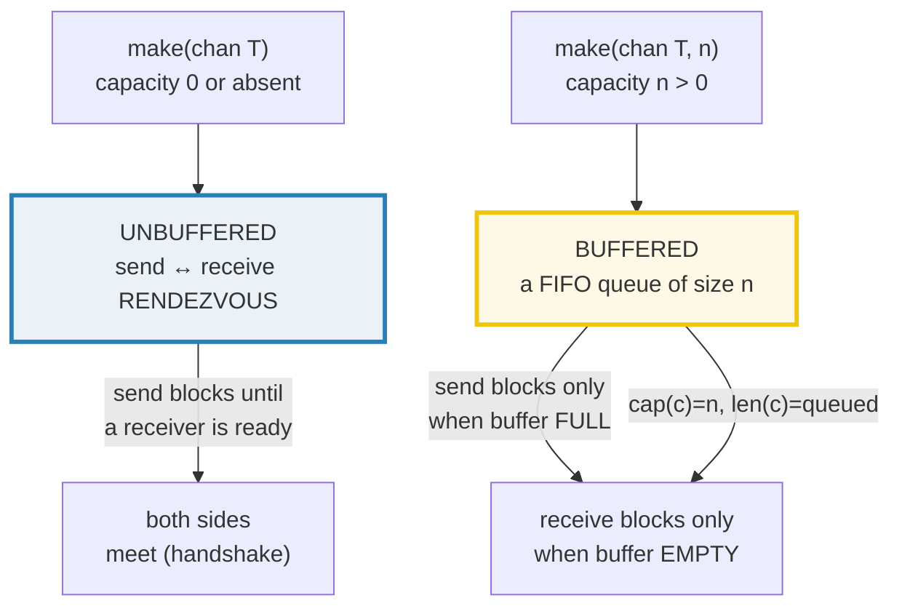

# CHANNELS — Unbuffered & Buffered Channels, `close`, `range`, Axioms

> **Goal (one line):** by printing every value and proving every panic, show how
> Go channels actually behave — the unbuffered rendezvous, the buffered queue,
> `close`, `range`, nil channels, and the directional types — and pin the four
> **channel axioms** at run time.
>
> **Run:** `go run channels.go`
>
> **Ground truth:** [`channels.go`](./channels.go) → captured stdout in
> [`channels_output.txt`](./channels_output.txt). Every number/table/panic-string
> below is pasted **verbatim** from that file under a
> `> From channels.go Section X:` callout. Nothing is hand-computed.
>
> **Prerequisites:** 🔗 [`GOROUTINES`](./GOROUTINES.md) (a channel synchronizes
> goroutines; you need the `go` statement and `sync.WaitGroup` first). This is
> **Phase 3 bundle #2**, the memory-model primitive that everything in
> `SELECT` / `CONTEXT` / `CONCURRENCY_PATTERNS` is built on.

---

## 1. Why this bundle exists (lineage)

Go's founding proverb is ***"Do not communicate by sharing memory; instead, share
memory by communicating."*** A channel is the mechanism for that: a typed conduit
through which one goroutine *sends* a value and another *receives* it. Unlike a
mutex (which guards shared state), a channel *moves ownership* of data between
goroutines, and — critically — **establishes a happens-before edge** between the
send and the receive. That edge is the whole point: it is what makes a value
written before the send *visible* to the receiver after the receive, without any
explicit lock.

This bundle is the **second tier of the concurrency spine**:


- 🔗 [`GOROUTINES`](./GOROUTINES.md) — channels exist to synchronize goroutines;
  you cannot reason about a channel without the `go` statement that launches its
  producer/consumer.
- 🔗 [`SELECT`](./SELECT.md) — `select` multiplexes channel operations; several
  techniques in this bundle (non-blocking probes, nil-channel disabling) are
  `select` idioms previewed here and fully treated there.
- 🔗 [`CONTEXT`](./CONTEXT.md) — `context.Context` propagates cancellation through
  a `Done() <-chan struct{}`; that is a channel closed to broadcast cancellation.
- 🔗 [`CONCURRENCY_PATTERNS`](./CONCURRENCY_PATTERNS.md) — pipelines, worker
  pools, fan-out/fan-in, and the semaphore-as-buffered-channel are all channels.

---

## 2. The mental model: two kinds of channel, one handshake rule

Every channel is one of two flavors, distinguished only by the **capacity**
passed to `make`:



> From `go.dev/ref/spec` — *Channel types*: "If the capacity is zero or absent,
> the channel is unbuffered and communication succeeds only when both a sender
> and receiver are ready. Otherwise, the channel is buffered and communication
> succeeds without blocking if the buffer is not full (sends) or not empty
> (receives). **A `nil` channel is never ready for communication.**"

That last sentence is not a footnote — it is one of the four axioms (Section E).
The capacity is a *runtime* property (it is not part of the type), which is why
`make` must record it on the value and why a `nil` (uninitialized) channel has
capacity 0 and behaves like an unbuffered channel with *no* possible partner.

---

## 3. Section A — Unbuffered channel: a send blocks until a receive (rendezvous)

An unbuffered channel (`make(chan int)`, capacity 0) is a **synchronous
handshake**. A send cannot complete until a receiver is ready to take the value,
and a receive cannot complete until a sender offers one — the two goroutines
*rendezvous*. The bundle proves both halves: a non-blocking probe shows a lone
send cannot proceed, and a producer→consumer loop shows the values arrive in send
order.

> From `channels.go` Section A:
> ```
> make(chan int): cap=0 len=0   (unbuffered: capacity 0)
> [check] unbuffered channel has capacity 0: OK
> probe send (no receiver): BLOCKED -> default fired (send cannot proceed alone)
> [check] unbuffered send with no receiver does not proceed (default fired): OK
> rendezvous: producer sent 0..4, consumer received [0 1 2 3 4]   (order preserved)
> [check] unbuffered rendezvous preserved send order [0 1 2 3 4]: OK
> ```

**What.** The probe uses a non-blocking `select` (`case c <- 1:` / `default:`):
because no goroutine is receiving, the send case is not ready and `default`
fires — proving the send *would* block. In the rendezvous loop, a single producer
sends `0..4` and the main goroutine receives five times; because there is exactly
one producer, the values are handed over one-for-one in order.

**Why — the memory model makes the rendezvous a synchronization edge.** From
`go.dev/ref/mem` (*Channel communication*): *"A receive from an unbuffered
channel is synchronized before the completion of the corresponding send on that
channel."* That is stronger than the buffered rule: the receive *completes before
the send returns*, so the instant the sender's `c <- v` unblocks, the sender
**knows** the receiver has the value. This is why an unbuffered channel is the
idiomatic "I'm done / here is your value" signal — it carries an acknowledgement
for free. (Contrast with Section 6: a buffered send can return *before* the
receiver ever sees the value.)

> From `go.dev/ref/spec` — *Send statements*: "A send on an unbuffered channel
> can proceed if a receiver is ready. A send on a buffered channel can proceed if
> there is room in the buffer. A send on a closed channel proceeds by causing a
> run-time panic. A send on a `nil` channel blocks forever."

---

## 4. Section B — Buffered channel: a send blocks only when full

A buffered channel (`make(chan int, 3)`) is a **FIFO queue of fixed capacity**.
Sends fill the buffer and block only when it is full; receives drain it and block
only when it is empty. `cap(c)` is the buffer size; `len(c)` is how many values
are currently queued.

> From `channels.go` Section B:
> ```
> make(chan int, 3): cap=3
> after 3 sends (no receiver): len=3   (buffer full, sends did not block)
> [check] buffered channel cap==3: OK
> [check] buffered channel len==3 after 3 sends: OK
> probe 4th send: BLOCKED (buffer full) -> would block until a receive frees a slot
> [check] 4th send to a full buffer-3 would block (default fired): OK
> drain: <-c <-c <-c -> 1 2 3   (FIFO: 1 2 3)
> [check] buffered drain is FIFO (1, 2, 3): OK
> [check] buffered channel len==0 after draining: OK
> ```

**What.** Three sends land in a buffer-3 channel with no receiver present and do
not block — `len` reads 3. A fourth send is probed non-blockingly and hits
`default` (the buffer is full). Draining the three receives yields `1 2 3` in
insertion order (a queue, not a stack).

**Why `len`/`cap` on a channel are a *snapshot*, not a lock.** From
`go.dev/ref/spec` — *Length and capacity*: `len(chan T)` is "the number of
elements queued in channel buffer" and `cap(chan T)` is "the channel buffer
capacity"; "the length of a `nil` ... channel is 0; the capacity of a `nil`
... channel is 0." These are intended only for **diagnostics and simple
thresholding** — by the time you read `len(c)` another goroutine may have
changed it, so never use `len(c)` to decide whether a receive *will* succeed. Use
the channel operations themselves (or `select`) as the source of truth.

**When to choose buffered vs unbuffered.** Unbuffered = synchronization (the
rendezvous is the point). Buffered = decoupling: it lets a producer get ahead of
a consumer by up to `cap` values, smoothing bursty producers, or bounding
concurrency (a buffer-`n` channel is a semaphore of size `n` — see the
semaphore idiom in Section 6 and 🔗 `CONCURRENCY_PATTERNS`). Default to
**unbuffered** unless you have a specific reason to buffer; a buffered channel
hides back-pressure.

---

## 5. Section C — `close` + `range`, and `close` as a broadcast

`close(c)` signals that no more values will be sent. The idiomatic way to consume
until that signal is `for v := range c`, which receives until the channel is
**closed and drained**, then exits. Closing also **broadcasts**: *every* receiver
ranging the channel unblocks when the close happens.

> From `channels.go` Section C:
> ```
> single consumer, range over closed channel: [0 1 2 3 4]
> [check] range collected [0 1 2 3 4] (exited on close): OK
> broadcast: 2 consumers, sorted union of received values: [0 1 2 3 4 5]
> [check] broadcast: close unblocked both consumers, sorted union == [0 1 2 3 4 5]: OK
> ```

**What.** The producer goroutine sends `0..4` then `close(c)`; a single `range`
collects `[0 1 2 3 4]` and terminates on close. The broadcast demo launches **two
consumers** ranging the same unbuffered channel; which consumer gets which of the
six values is nondeterministic, so the bundle collects into a mutex-guarded slice
and **sorts the union** — the deterministic facts being (1) all six values are
delivered exactly once, and (2) on close *both* consumers' ranges exit (verified
by `WaitGroup`). That second fact *is* the broadcast.

**The "sender closes" convention.** Only the goroutine that **writes** to a
channel should close it; receivers must never close. Rationale: closing is a
promise that no more sends will happen — only the sender can make that promise.
If two senders (or a receiver) close, you race axiom #2 (closing a closed channel
panics). When there are multiple producers, coordinate their shutdown through an
extra coordinating goroutine or a `sync.WaitGroup` so that exactly one closer
acts after all sends are done (🔗 `CONCURRENCY_PATTERNS`).

> From `go.dev/ref/spec` — *close*: "For a channel `ch`, the built-in function
> `close(ch)` records that no more values will be sent on the channel. It is an
> error if `ch` is a receive-only channel. Sending to or closing a closed channel
> causes a run-time panic. Closing the nil channel also causes a run-time panic.
> After calling `close`, and after any previously sent values have been received,
> receive operations will return the zero value for the channel's type without
> blocking."

> From `go.dev/ref/mem`: "The closing of a channel is synchronized before a
> receive that returns a zero value because the channel is closed." — so `close`
> is itself a synchronization event: a value written before the close is visible
> to a receiver that wakes on the zero-value return.

---

## 6. Section D — `close` semantics: `(zero, false)` receives; send/close on closed PANIC

This section pins the close-related axioms and proves the two panics at run time
with `defer`/`recover` (Go has no `assert`; recover is the idiom for "this must
panic").

> From `channels.go` Section D:
> ```
> after close: 1st recv  v=7 ok=true   (the value sent before close)
>              2nd recv  v=0 ok=false   (closed+empty -> zero value, false)
> [check] 1st receive after close returns the sent value 7 (ok==true): OK
> [check] 2nd receive after close returns zero value 0 (ok==false): OK
> axiom: send on closed channel  -> panic=true  msg="send on closed channel"
> [check] axiom: send on closed channel panics ("send on closed channel"): OK
> axiom: close of closed channel -> panic=true  msg="close of closed channel"
> [check] axiom: close of closed channel panics ("close of closed channel"): OK
> ```

**The comma-ok receive.** The multi-valued form `v, ok := <-c` reports whether the
value was a *real* send (`ok == true`) or a synthetic zero value minted because
the channel is closed and empty (`ok == false`). From `go.dev/ref/spec` —
*Receive operator*: "The value of `ok` is `true` if the value received was
delivered by a successful send operation to the channel, or `false` if it is a
zero value generated because the channel is closed and empty." Buffered values
sent *before* the close are still delivered with `ok == true` first (here, the
`7`); only after the buffer drains does `ok` flip to `false`.

**The two panics (axioms #1 and #2).** The runtime message for sending on a
closed channel is exactly `send on closed channel`; for closing an already-closed
channel it is `close of closed channel`. Both are unrecoverable in the sense that
a program hitting them in production has a **logic bug** — recover catches them,
but you should treat the panic as a "you closed the wrong channel / closed twice"
diagnostic, not a control-flow mechanism.

**The expert detail: why there is no `isClosed`.** There is deliberately no
`isclosed(c)` builtin, because it would be racy: another goroutine could close
`c` between your check and your send. The language instead makes "send on closed"
a hard panic so the bug is loud, and gives you the comma-ok *receive* (which is
atomic) as the only safe way to detect closure. Dave Cheney's post works through
exactly this argument.

---

## 7. Section E — The nil channel: send/receive blocks forever (axioms #3 & #4)

A `nil` channel is the zero value of any channel type (`var c chan int` → `nil`).
It is **never ready** — a send or receive on it blocks forever. This is a trap
when you forget `make`, but a *tool* when used deliberately in a `select` to
disable a case (🔗 `SELECT`).

> From `channels.go` Section E:
> ```
> var c chan int -> c==nil: true   cap=0 len=0
> [check] uninitialized channel is nil: OK
> [check] cap(nil channel)==0: OK
> [check] len(nil channel)==0: OK
> nil receive: select timed out after 20ms (nil channel never ready -> blocks forever)
> [check] nil channel receive never becomes ready (timeout won): OK
> nil send probe: BLOCKED -> default fired (nil send never ready -> blocks forever)
> [check] nil channel send never becomes ready (default fired): OK
> ```

**What.** The bundle cannot do a plain `<-c` on a nil channel — that would
deadlock the goroutine forever and hang the program. Instead it observes
"never ready" deterministically: in a `select` racing `<-c` against a 20 ms
timeout, the nil case can never win, so the timeout always fires; a non-blocking
send probe likewise hits `default`. `cap` and `len` of a nil channel are both 0.

**Why nil blocks forever (not "panics").** The buffer size is a runtime property
of the channel *value*. A `nil` channel has no buffer and no registered
partner goroutines, so a sender/receiver waiting on it has nothing to rendezvous
with and nothing to read — the runtime leaves it parked permanently. In a
`select`, a `nil` channel case is simply *removed from consideration* each
evaluation, which is the trick for conditionally enabling/disabling a case
without restructuring the select (set the channel variable to `nil` to disable
it; set it back to a real channel to re-enable).

---

## 8. Section F — Directional channel types: `chan<-` (send-only) & `<-chan` (receive-only)

A channel type carries an optional **direction**. `chan T` is bidirectional;
`chan<- T` is send-only; `<-chan T` is receive-only. A bidirectional channel
converts to either direction by assignment (or explicit conversion), and the
compiler then forbids the wrong operation — encoding "who may send / who may
receive" as a static fact.

> From `channels.go` Section F:
> ```
> type of c: chan int   (bidirectional)
> type of s: chan<- int   (send-only)
> type of r: <-chan int   (receive-only)
> [check] s is send-only chan<- int: OK
> [check] r is receive-only <-chan int: OK
> onlySend(s, 42) then onlyRecv(r) -> 42   (directional round-trip)
> [check] directional send/receive round-tripped 42: OK
> COMPILE ERROR (documented): <-s       // cannot receive from send-only channel chan<- int
> COMPILE ERROR (documented): r <- 1    // cannot send to receive-only channel <-chan int
> ```

**What.** `onlySend(c chan<- int, v int)` can only send; `onlyRecv(c <-chan int)
int` can only receive. Passing a bidirectional `chan int` to each implicitly
narrows the direction. The two compile errors are documented (not executed, since
a file containing them would not build); the exact `go vet` messages are
`invalid operation: cannot receive from send-only channel chan<- int` and
`invalid operation: cannot send to receive-only channel <-chan int`.

**Why — direction is an API contract.** The canonical pattern is a **producer
that returns `<-chan T`** (callers can only receive) and a **consumer that takes
`<-chan T`** (it cannot accidentally close or send back). This makes the
"sender closes" convention enforceable by the type system: if a function's
parameter is `chan<- T`, only it can send; if it returns `<-chan T`, only its
internal goroutine can close. From `go.dev/ref/spec` — *Channel types*: "A
channel may be constrained only to send or only to receive by assignment or
explicit conversion." The `<-` associates with the leftmost `chan` possible, so
`chan<- int` and `<-chan int` are unambiguous.

---

## 9. The four channel axioms (Dave Cheney) — pinned at run time

Sections D and E prove all four. They belong in muscle memory:

| # | Axiom | Demonstrated in | Runtime behavior |
|---|---|---|---|
| 1 | A send to a closed channel **panics** | Section D | `send on closed channel` |
| 2 | Closing a closed channel **panics** | Section D | `close of closed channel` |
| 3 | A send to a nil channel **blocks forever** | Section E | goroutine parked permanently |
| 4 | A receive from a nil channel **blocks forever** | Section E | goroutine parked permanently |

(Plus, from Section D: a *receive* from a closed channel returns the **zero
value immediately** with `ok == false` — the non-panicking half of closure.)

> From Dave Cheney, *Channel Axioms* (2014): "A send to a nil channel blocks
> forever / A receive from a nil channel blocks forever / A send to a closed
> channel panics / A receive from a closed channel returns the zero value
> immediately." All four are reproduced as runnable output above.

---

## 10. Pitfalls (the expert payoff)

| Trap | Symptom | Fix |
|---|---|---|
| Sending on a closed channel | Run-time panic: `send on closed channel` | Only the **sender** closes; with multiple producers, funnel closes through one coordinator (or `sync.WaitGroup`). |
| Closing a closed channel | Run-time panic: `close of closed channel` | Close exactly once; make the closer's ownership unambiguous (often the sole producer goroutine). |
| Closing a `nil` channel | Run-time panic: `close of nil channel` | `make` the channel before closing; a `nil` channel is the zero value, not a ready one. |
| Receiver closes the channel | Racy panic if a producer later sends | Receivers must not close — only the writer side knows when sends are done (the "sender closes" convention). |
| Sending/receiving on a nil channel | Goroutine **blocks forever** (silent deadlock) | `make(chan T, …)` before use; if you see a hung goroutine, suspect a missing `make`. |
| `for v := range c` on a never-closed channel | Deadlock once the producer stops sending | The producer **must** `close(c)` or the `range` never exits. |
| Forgetting `make`, using `var c chan int` | Deadlock (nil) or panic on close | Channel types are reference types with a nil zero value — always `make` them. |
| Using `len(c)` to decide "can I receive?" | Race / stale read | `len`/`cap` are snapshots for diagnostics only; receive directly or use `select`. |
| Buffered channel hiding back-pressure | Producer runs unbounded ahead of a slow consumer | Default to unbuffered; choose the buffer size as a deliberate concurrency bound. |
| Receiving from `chan<- T` / sending to `<-chan T` | Compile error: `invalid operation` (intended) | Use directional types as the contract: producer returns `<-chan T`, consumer takes `<-chan T`. |
| Assuming a buffered send reaches the receiver | Race: the send may complete before any receive | Only the unbuffered rendezvous guarantees the receive *completed* before the send returns (see Section 6 / `go.dev/ref/mem`). |
| `v, ok := <-c` ignored, treating zero as a value | Reads a synthetic `0` after close as "real data" | Always check `ok`; it is `false` once the closed channel is drained. |

---

## 11. Cheat sheet

```go
// Declaration & make
var c chan int          // nil zero value — NOT usable; always make() before use
c := make(chan int)     // UNBUFFERED (cap 0): send ↔ receive rendezvous
c := make(chan int, n)  // BUFFERED (cap n): FIFO queue; send blocks only when full

// Direction (converted by assignment; enforced at compile time)
chan T    // bidirectional
chan<- T  // send-only   (producer param; return value of a sink)
<-chan T  // receive-only (consumer param; return type of a producer)

// Operations
c <- v       // send (blocks per the rules above)
v := <-c     // receive (blocks until a value or close)
v, ok := <-c // ok==false once the channel is closed AND drained
for v := range c { ... }  // receive until close (producer MUST close or it deadlocks)
close(c)     // signal "no more sends" — broadcast: unblocks ALL ranging receivers

// Introspection (snapshots — diagnostics only, never a receive guard)
len(c) // # queued in buffer (0 if nil)     cap(c) // buffer capacity (0 if nil)

// THE AXIOMS (Dave Cheney)
//   send  on closed  -> PANIC "send on closed channel"
//   close a closed   -> PANIC "close of closed channel"
//   send  on nil     -> blocks forever
//   recv  on nil     -> blocks forever
//   recv  on closed  -> returns (zero, ok==false) immediately  (non-panicking)

// Conventions
//   - the SENDER closes; receivers never close
//   - close is a broadcast (all receivers unblock)
//   - default to unbuffered; buffer only to decouple/bound concurrency
//   - prefer directional types so "who sends / who receives" is a compile-time fact
```

---

## Sources

Every signature, value, panic string, and behavioral claim above was verified
against the Go specification, the Go memory model, and corroborating references;
the panic strings are captured verbatim from a real run (`channels_output.txt`).

- The Go Programming Language Specification — https://go.dev/ref/spec
  - *Channel types* (capacity & buffered/unbuffered, direction, nil never ready): https://go.dev/ref/spec#Channel_types
  - *Send statements* ("send on an unbuffered channel can proceed if a receiver is ready"; "send on a closed channel ... run-time panic"; "send on a nil channel blocks forever"): https://go.dev/ref/spec#Send_statements
  - *Receive operator* (blocks until a value; receive on closed yields zero value; the `v, ok` form and `ok` semantics): https://go.dev/ref/spec#Receive_operator
  - *close* ("records that no more values will be sent"; send/close on closed panics; close of nil panics; receives after close return the zero value): https://go.dev/ref/spec#Making_slices_maps_and_channels (close) — https://go.dev/ref/spec#Close
  - *Length and capacity* (`len(chan)` = queued, `cap(chan)` = buffer capacity; both 0 for nil): https://go.dev/ref/spec#Length_and_capacity
  - *Making slices, maps and channels* (`make(T)` unbuffered, `make(T, n)` buffered): https://go.dev/ref/spec#Making_slices_maps_and_channels
- The Go Memory Model — https://go.dev/ref/mem
  - *Channel communication* ("a receive from an unbuffered channel is synchronized before the completion of the corresponding send"; buffered `(k+C)`th rule; "the closing of a channel is synchronized before a receive that returns a zero value"): https://go.dev/ref/mem
- Dave Cheney — *Channel Axioms* (the four axioms; why there is no `isClosed`): https://dave.cheney.net/2014/03/19/channel-axioms
- A Tour of Go — *Range and Close* (sender closes; the comma-ok receive): https://go.dev/tour/concurrency/4
- `builtin` package (`close`, `len`, `cap`, `nil` for channels) — https://pkg.go.dev/builtin

**Facts that could not be verified by running** (documented, not executed, since
a file containing them would not compile): `<-s` on a `chan<- int` is rejected
with `invalid operation: cannot receive from send-only channel chan<- int`; `r <-
1` on a `<-chan int` is rejected with `invalid operation: cannot send to
receive-only channel <-chan int`. These exact `go vet` messages were captured by
compiling throwaway programs and are quoted verbatim above; they are confirmed by
the spec's *Channel types* direction rules, not reproduced as runnable output.
