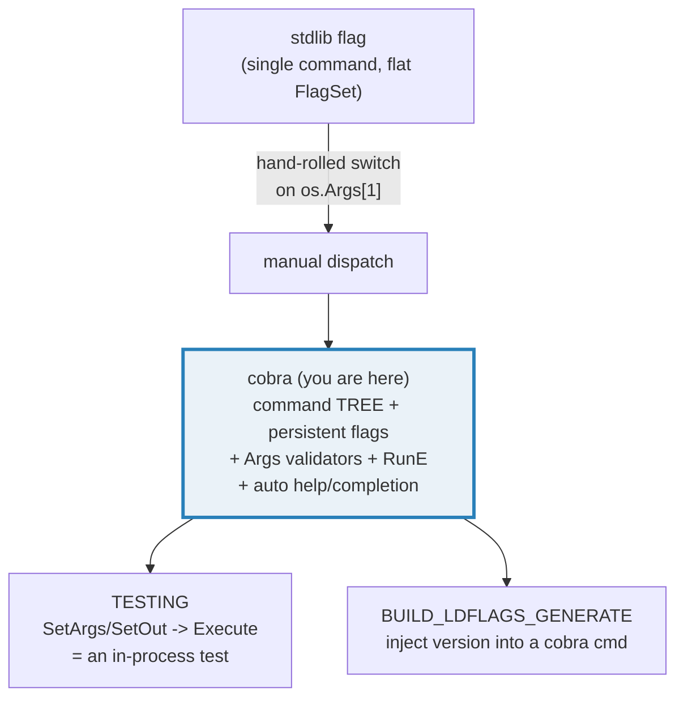
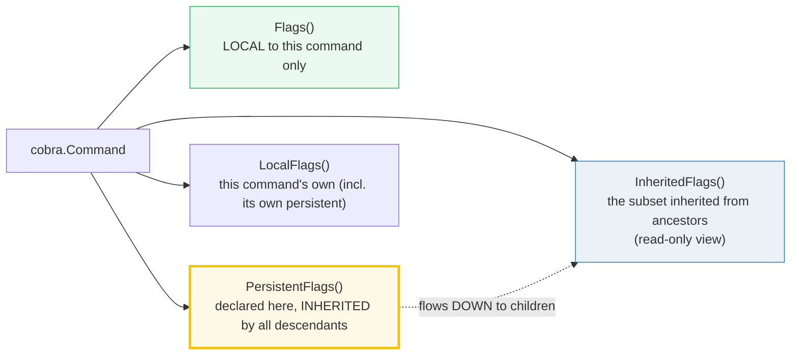
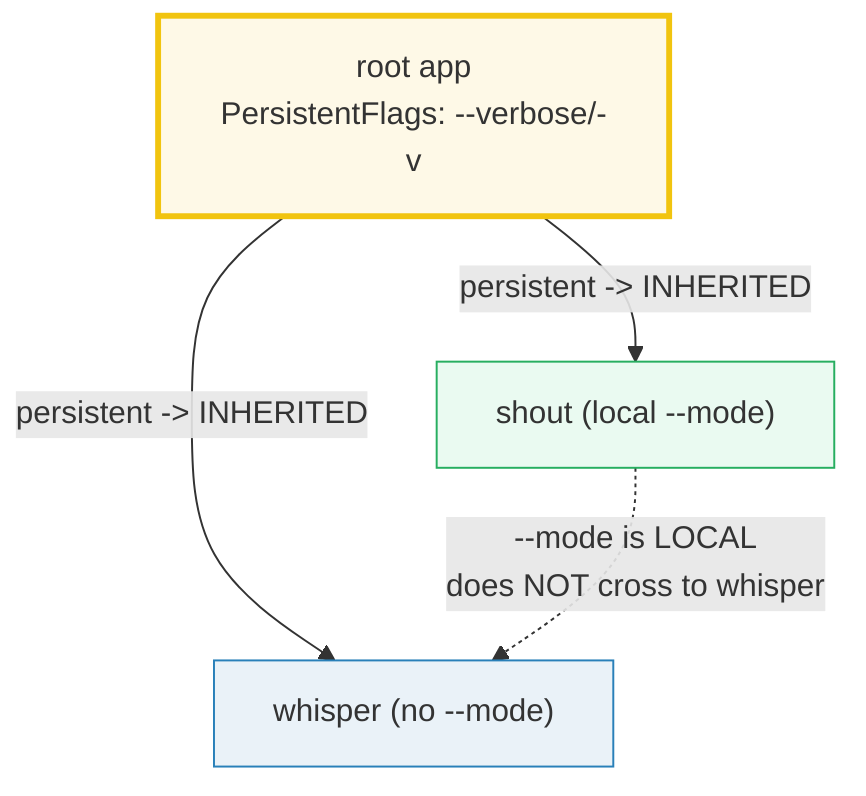

# CLI_COBRA — Command Trees, Flags, Args Validators & Testable CLIs (cobra)

> **Goal (one line):** show, by driving `github.com/spf13/cobra` programmatically
> with `root.SetArgs` + `root.SetOut` + `root.Execute` (no `os.Args`, no terminal),
> how a cobra **command tree** dispatches, how **local vs persistent flags** parse,
> how **`Args` validators** and **`RunE`** propagate errors, and how all of it
> contrasts with the single-command stdlib `flag` package.
>
> **Run:** `go run cli_cobra.go`
>
> **Ground truth:** [`cli_cobra.go`](./cli_cobra.go) → captured stdout in
> [`cli_cobra_output.txt`](./cli_cobra_output.txt). Every captured line and error
> message below is pasted **verbatim** from that file under a
> `> From cli_cobra.go Section X:` callout. Nothing is hand-computed.
>
> **Prerequisites:** 🔗 [`TESTING`](./TESTING.md) (this bundle *is* a testable CLI
> — the whole demo drives cobra the way a `_test.go` would) and 🔗 [`ERRORS`](./ERRORS.md)
> (`RunE` returns an `error`; `Execute` propagates it; `errors.Is` asserts on the
> sentinel). A passing familiarity with the stdlib `flag` package helps for
> Section F's contrast.

---

## 1. Why this bundle exists (lineage)

The stdlib `flag` package does **one** thing well: parse flags for **one**
command. It has no notion of subcommands (`git remote add …`), no inherited
flags, no auto-generated help/completion/version, and no error-propagating
handler. The moment a CLI grows past one verb, you hand-roll a `switch` on
`os.Args[1]` — which is exactly what Section F reproduces to make the contrast
concrete.

`cobra` (built on `spf13/pflag`) was created to fill that gap. It gives you a
**tree of commands**, automatic dispatch by the first argument, **persistent**
flags that flow down to children, **local** flags scoped to one command,
**positional-arg validators**, a `RunE`/`Run` split for error handling,
auto-generated `help`/`completion`/`--version`, and — crucially for this bundle
— a **fully programmatic execution path** (`SetArgs`/`SetOut`/`SetErr`/`Execute`)
that makes a CLI a first-class, in-process testable unit.



> From `pkg.go.dev/github.com/spf13/cobra` (package overview, verbatim): *"Package
> cobra is a commander providing a simple interface to create powerful modern CLI
> interfaces. In addition to providing an interface, Cobra simultaneously
> provides a controller to organize your application code."*

---

## 2. The mental model: a `Command` tree + four flag surfaces

A `cobra.Command` is a node in a tree. Each node carries a `Use` line, a `Short`
description, a lifecycle (`Run`/`RunE` plus optional `Pre*`/`Post*` hooks), an
`Args` validator, and up to **four** flag surfaces:



The tree is built with `AddCommand`, and **executed** with `Execute`, which walks
the tree using the args (overridable via `SetArgs`), finds the target command,
merges its inherited persistent flags, parses, validates positional args, then
runs the lifecycle. `Flags()` returns the **merged** set — but note the lazy-merge
subtlety called out in Section C / pitfalls: `Flags()` alone does **not** trigger
the merge before `Execute`; `InheritedFlags()`/`LocalFlags()`/`ParseFlags()` do.

> From `pkg.go.dev/github.com/spf13/cobra`:
> - `Flags()`: *"returns the complete FlagSet that applies to this command (local
>   and persistent declared here and by all parents)."*
> - `PersistentFlags()`: *"returns the persistent FlagSet specifically set in the
>   current command."*
> - `InheritedFlags()`: *"returns all flags which were inherited from parent
>   commands."*
> - `SetArgs(a []string)`: *"sets arguments for the command. It is set to
>   `os.Args[1:]` by default … can be overridden **particularly useful when
>   testing**."*
> - `Execute()`: *"uses the args (`os.Args[1:]` by default) and run through the
>   command tree finding appropriate matches for commands and then corresponding
>   flags."*

> **Type detail worth pinning.** cobra's own source imports
> `flag "github.com/spf13/pflag"`. So `Flags()` and `PersistentFlags()` return a
> **`*pflag.FlagSet`** (aliased to `flag` *inside* the cobra package) — **not**
> the stdlib `flag.FlagSet`. pflag adds POSIX/GNU-style long flags (`--name`,
> `-n`), slice/array/count types, and `Lookup`. The stdlib `flag` used in
> Section F is a different, simpler package.

---

## 3. Section A — Root + subcommands: dispatch by the first arg

> From `cli_cobra.go` Section A:
> ```
> SetArgs(["hello"])   -> Execute error: <nil>
> captured:
> hello, world
> SetArgs(["version"]) -> Execute error: <nil>
> captured:
> app version v0.1.0
> ```
> ```
> [check] SetArgs(["hello"]) captured "hello, world": OK
> [check] SetArgs(["version"]) captured "app version v0.1.0": OK
> [check] both dispatches returned nil error: OK
> ```

**What.** `root.AddCommand(hello, version, …)` builds the tree. `Execute` reads
the args (here forced via `SetArgs`), takes the **first** token as the
subcommand name, walks to that child, and runs its `Run`. `hello` and `version`
are leaf commands with a `Run`; `app` (the root) has **no** `Run`, so it
*requires* a subcommand.

**The determinism discipline (why this bundle is special).** Every section in
this file routes through one helper:

```go
func execute(build func() *cobra.Command, args []string) (string, error) {
    root := build()          // a FRESH tree per call -> no flag state leaks
    var buf bytes.Buffer
    root.SetOut(&buf)        // outWriter; OutOrStdout()/Println walk UP to it
    root.SetErr(&buf)        // errWriter too, so usage never hits real stderr
    root.SetArgs(args)       // override os.Args[1:]
    root.SilenceUsage = true // don't dump usage on error (assert on the error)
    root.SilenceErrors = true
    err := root.Execute()
    return buf.String(), err
}
```

This is **exactly** the pattern a `_test.go` uses (🔗 `TESTING`): no `os.Args`, no
forked process, no real terminal — `SetArgs` + `SetOut` + `Execute` turn a CLI
into an ordinary function you assert on. The two `just out` runs of this bundle
are byte-identical precisely because nothing depends on the process environment.

**Why `SetOut` on the root captures a child's output.** A handler writes through
`cmd.OutOrStdout()`, whose implementation is `getOut(os.Stdout)`:

> From cobra source (`command.go`): `getOut` returns `c.outWriter` if set, else
> **walks to the parent** (`c.parent.getOut(def)`), else the real stream. So
> `root.SetOut(&buf)` is enough — every descendant's `Println`/`OutOrStdout()`
> resolves up the tree to `&buf`. This parent-walk is also why **persistent**
> flag definitions on the root are visible to children (Section C).

---

## 4. Section B — Local flags: `--name` (string) and `--count` (int) with defaults

> From `cli_cobra.go` Section B:
> ```
> SetArgs(["greet"]) (defaults) -> captured:
> hello, world
> SetArgs(["greet","--name","Al","--count","3"]) -> Execute error: <nil>
> captured:
> hello, Al
> hello, Al
> hello, Al
> ```
> ```
> [check] greet output contains "Al": OK
> [check] greet printed exactly count=3 lines: OK
> [check] default name is "world" (1 line): OK
> [check] Execute returned nil: OK
> ```

**What.** `greet.Flags().StringVar(&gName, "name", "world", …)` and
`.IntVar(&gCount, "count", 1, …)` register **local** flags on `greet`. cobra
parses them **automatically** before `Run` runs, writing into the bound
variables (`gName`, `gCount`). With no flags, the defaults (`"world"`, `1`)
apply and the greeting prints once. With `--name Al --count 3`, the bound vars
hold `Al`/`3` and the loop prints three lines.

**Why the bound-variable pattern matters.** pflag (unlike stdlib `flag`) stores
the parsed value in the `*T` you hand to `StringVar`/`IntVar`/`BoolVarP`. The
handler then reads the plain variable — no `flag.Lookup("name").Value.String()`
dance. (Section F shows the stdlib equivalent: `*name` after `fs.Parse`.)

**`--flag value` vs `--flag=value` vs `-n`.** pflag accepts all three
(`--name Al`, `--name=Al`, and a shorthand if you registered one via `StringP`).
The bundle's `--verbose`/`-v` in Section C is registered with `BoolP`, so both
forms work. This is a pflag capability the stdlib `flag` package does **not**
offer uniformly (stdlib treats `-name` and `--name` alike and has no shorthand
pairing).

---

## 5. Section C — Persistent flags inherit to children; local flags do not leak



> From `cli_cobra.go` Section C:
> ```
> shout   InheritedFlags().Lookup("verbose") != nil? true   (inherited persistent)
> shout   LocalFlags().Lookup("verbose")    != nil? false   (NOT local to shout)
> whisper InheritedFlags().Lookup("verbose") != nil? true   (inherited persistent)
> whisper LocalFlags().Lookup("mode")       != nil? false   (local to shout; no leak)
> SetArgs(["shout","--verbose","--mode","upper","hi there"]) -> Execute error: <nil>
> captured:
> [verbose] HI THERE
> ```
> ```
> [check] child (shout) inherits --verbose (InheritedFlags non-nil): OK
> [check] --verbose is NOT a local flag of shout (LocalFlags nil): OK
> [check] sibling (whisper) also inherits --verbose: OK
> [check] local --mode does NOT leak to sibling (whisper LocalFlags nil): OK
> [check] shout output reflects --verbose + --mode=upper ("[verbose] HI THERE"): OK
> [check] shout Execute returned nil: OK
> ```

**What.** `root.PersistentFlags().BoolP("verbose", "v", false, …)` declares a
**persistent** flag. It is parsed by **every** descendant. `shout.LocalFlags()`
sees only `--mode` (its own); `shout.InheritedFlags()` sees only `--verbose`
(inherited). The sibling `whisper` likewise inherits `--verbose` but does **not**
see `shout`'s local `--mode`. At runtime, `shout`'s `Run` reads the inherited
flag with `cmd.Flags().GetBool("verbose")` and the local one through its bound
`mode` variable — both resolve because `Execute` has already merged the inherited
set into the child before parsing.

**The lazy-merge gotcha (why Section C uses `InheritedFlags()`/`LocalFlags()`
and not `Flags().Lookup`).** Inspecting a freshly built, **never-executed** tree
with `child.Flags().Lookup("verbose")` returns **`nil`**. That is not a bug:
`Flags()` returns the local FlagSet and does **not** call `mergePersistentFlags()`
itself. Only `InheritedFlags()`, `LocalFlags()`, `LocalNonPersistentFlags()`, and
`ParseFlags()`/`Execute` trigger the merge. So to *statically* inspect inherited
flags you must use a method that merges — `InheritedFlags()`/`LocalFlags()` do.
At **runtime** this never bites, because `Execute` always merges before parsing.
(Pitfall table rows 1–2 capture this.)

> From cobra source (`command.go`): `Flags()` returns `c.flags` after lazily
> creating it — with **no** call to `mergePersistentFlags()`. `InheritedFlags()`
> and `LocalFlags()` both begin with `c.mergePersistentFlags()`, which walks the
> parent chain and adds each ancestor's `pflags` into `c.flags`. `mergePersistentFlags`
> is unexported, so `InheritedFlags()`/`LocalFlags()` (or a real `Execute`) are the
> sanctioned ways to observe the merged state.

---

## 6. Section D — `Args` validators: `ExactArgs`, `NoArgs`, `MinimumNArgs`

> From `cli_cobra.go` Section D:
> ```
> echo (ExactArgs(1)) with ["a","b"] -> Execute error:
>   accepts 1 arg(s), received 2
> echo (ExactArgs(1)) with ["only"]   -> Execute error: <nil>
> captured:
> you said: only
> quiet (NoArgs) with ["extra"]       -> Execute error:
>   unknown command "extra" for "app quiet"
> multi (MinimumNArgs(2)) with ["only-one"] -> Execute error:
>   requires at least 2 arg(s), only received 1
> ```
> ```
> [check] ExactArgs(1) with 2 args -> Execute returns non-nil error: OK
> [check] error message == "accepts 1 arg(s), received 2": OK
> [check] ExactArgs(1) with 1 arg -> Execute returns nil: OK
> [check] NoArgs with 1 arg -> Execute returns non-nil error: OK
> [check] NoArgs error contains "unknown command": OK
> [check] MinimumNArgs(2) with 1 arg -> Execute returns non-nil error: OK
> [check] MinimumNArgs(2) error == "requires at least 2 arg(s), only received 1": OK
> ```

**What.** The `Args` field is a `PositionalArgs` — a
`func(cmd *Command, args []string) error`. cobra calls it **after** flag parsing
and **before** `Run`/`RunE`. A non-nil return aborts the command: `Run` never
runs, and `Execute` returns that error. The built-in validators:

| Validator | Errors when … | Error string (verified) |
|---|---|---|
| `NoArgs` | any positional arg present | `unknown command %q for %q` |
| `ArbitraryArgs` | never (the default when `Args` is nil) | — |
| `MinimumNArgs(n)` | fewer than `n` args | `requires at least N arg(s), only received M` |
| `MaximumNArgs(n)` | more than `n` args | `accepts at most N arg(s), received M` |
| `ExactArgs(n)` | not exactly `n` args | `accepts N arg(s), received M` |
| `RangeArgs(min, max)` | outside `[min, max]` | `accepts between MIN and MAX arg(s), received M` |

> From the cobra user guide (verbatim): *"If `Args` is undefined or nil, it
> defaults to `ArbitraryArgs`."* And: *"`MatchAll(pargs ...PositionalArgs)`
> enables combining existing checks with arbitrary other checks."*

**Why these error strings are safe to assert on.** They are produced by
`fmt.Errorf` with fixed format strings in `cobra/args.go`, so they are stable
across runs (and within a minor version). The bundle asserts the **exact** string
for `ExactArgs` and `MinimumNArgs`, and a substring (`"unknown command"`) for
`NoArgs` (whose message embeds `cmd.CommandPath()`, e.g. `"app quiet"`). Asserting
on the returned `error` — never on a printed usage block — is what keeps this
deterministic.

---

## 7. Section E — `RunE` (returns error) vs `Run`: `Execute` propagates

> From `cli_cobra.go` Section E:
> ```
> SetArgs(["boom"]) -> Execute error: risky operation failed
> handler captured before returning:
> starting risky op
> ```
> ```
> [check] RunE error propagates out of Execute (non-nil): OK
> [check] Execute returned the exact sentinel (errors.Is): OK
> [check] handler ran before failing (captured "starting risky op"): OK
> ```

**What.** `boom`'s `RunE` prints a line, then `return errRiskyFailed`. `Execute`
returns that **exact** error — verifiable with `errors.Is(err, errRiskyFailed)`,
because the sentinel is unwrapped-comparable. The handler's partial output
(`"starting risky op"`) is already in the captured buffer, proving the lifecycle
ran up to the `return`.

> From the cobra user guide (verbatim): *"If you wish to return an error to the
> caller of a command, `RunE` can be used… The error can then be caught at the
> execute function call."*

**Why prefer `RunE` over `Run`.** `Run` has signature `func(cmd, args)` — it
**cannot** signal failure except by calling `os.Exit` or `panic`, both of which
destroy testability (🔗 `TESTING`). `RunE` returns an `error` that `Execute`
hands back, so your `_test.go` can assert on it and `main()` can map it to an
exit code in exactly one place. The only reason to use `Run` is a command that
genuinely cannot fail (e.g. `version`) — and even then, `RunE` returning `nil`
costs nothing.

**The lifecycle order (for completeness).** When a command runs, cobra invokes
hooks in this fixed order: `PersistentPreRun` → `PreRun` → `Run`/`RunE` →
`PostRun` → `PersistentPostRun`. The `Persistent*` hooks are inherited by
children that don't declare their own. By default only the **first**
`PersistentPreRun` found up the chain runs; set `cobra.EnableTraverseRunHooks =
true` to run every ancestor's persistent hooks.

---

## 8. Section F — Contrast: stdlib `flag` has no command tree (you write dispatch)

> From `cli_cobra.go` Section F:
> ```
> cobra  greet -> 3 lines:
> hello, Al
> hello, Al
> hello, Al
> stdlib greet -> 3 lines:
> hello, Al
> hello, Al
> hello, Al
> byte-identical? true
> cobra  unknown "bogus" -> error: unknown command "bogus" for "app"   (free)
> stdlib unknown "bogus" -> error: unknown command: "bogus"   (you wrote the switch default)
> ```
> ```
> [check] cobra greet == stdlib greet (byte-identical output): OK
> [check] cobra greet produced exactly 3 lines: OK
> [check] cobra unknown subcommand -> Execute error (free): OK
> [check] stdlib manual dispatch also errors on unknown: OK
> ```

**What.** The bundle rebuilds the **same** `greet` with the stdlib `flag`
package, behind a hand-written `switch sub { case "greet": …; case "version": …;
default: return unknown }`. The greeting output is **byte-identical** to cobra's
(`3 × "hello, Al"`), proving cobra is not magic — it is a structured wrapper over
the same parsing primitive. The unknown-command case is the punchline: cobra
returns `unknown command "bogus" for "app"` **for free**; with stdlib `flag` you
write the `default` arm yourself.

**The stdlib pattern, pinned.** Use a **named** `FlagSet` (not `flag.CommandLine`)
with `ContinueOnError` so a parse failure returns an error instead of calling
`os.Exit(2)`:

```go
fs := flag.NewFlagSet("greet", flag.ContinueOnError)
fs.SetOutput(&buf)                      // analog of cobra SetOut
name  := fs.String("name", "world", "")
count := fs.Int("count", 1, "")
if err := fs.Parse(rest); err != nil { return err }
```

**cobra vs stdlib `flag`, side by side:**

| Concern | stdlib `flag` | cobra |
|---|---|---|
| Subcommands | **none** — you hand-roll a `switch` | `AddCommand` builds a tree; `Execute` dispatches |
| Flag surfaces | one flat `FlagSet` | local `Flags()` + inherited `PersistentFlags()` |
| Inherited flags | **impossible** (no parent/child) | persistent flags flow down to children |
| Long/short pairs | `-name`/`--name` only, no shorthand binding | `StringP("name","n",…)` binds both |
| Arg validation | none | `ExactArgs`/`NoArgs`/`MinimumNArgs`/`RangeArgs`/`MatchAll` |
| Error from handler | parse via `FlagSet`; logic via your own returns | `RunE` → `Execute` returns it |
| Help / completion | you write it | auto-generated `help`, `completion`, `--version` |
| Testability | `fs.SetOutput` + `fs.Parse([]string)` | `SetArgs` + `SetOut` + `Execute` |

> From the Go standard-library docs (`pkg.go.dev/flag`): *"Package flag implements
> command-line flag parsing… It is a simple package… Flag sets can be created with
> `NewFlagSet`."* Notably, the stdlib package has no concept of a command tree,
> persistent flags, or positional-arg validators — it parses one flat set of
> flags. cobra layers all of the above on top of its own pflag-based parser.

---

## 9. Pitfalls (the expert payoff)

| Trap | Symptom | Fix |
|---|---|---|
| Inspecting inherited flags with `Flags().Lookup` before `Execute` | returns `nil` even though the flag exists | Use `InheritedFlags()`/`LocalFlags()` (they call `mergePersistentFlags`), or just run `Execute` first. `Flags()` does not merge by itself. |
| Reading a persistent flag in `Run` and getting the **default** | the flag was parsed on a *parent* but you read it before parse, or used the wrong accessor | Read in `Run` (after `Execute` merged+parsed) via `cmd.Flags().GetBool("x")`, not a stale local copy. |
| `Run` cannot signal failure | tests can't assert on the error; you reach for `os.Exit`/`panic` | Use `RunE` and return the error; `Execute` propagates it. Reserve `Run` for cannot-fail commands. |
| Forgetting `SilenceUsage`/`SilenceErrors` in tests | cobra prints usage + `Error: …` to the (uncaptured) stderr, polluting test output / failing determinism | Set both on the root in tests, or `SetErr(&buf)`; assert on the returned `error` from `Execute`. |
| Asserting on cobra's printed usage/help text | brittle — help templates change across versions, and "Did you mean" suggestions vary | Assert on the returned `error` and your handler's captured `SetOut` buffer; never on auto-generated help. |
| Two `Execute` calls on the **same** root carry flag state | the second run sees the first run's parsed flag values | Build a **fresh** root per execute (this bundle's `execute(build, …)`), or call `ResetFlags`/`cmd.Flags().Set(…, default)`. |
| Auto-added `help`/`completion` commands appear after first `Execute` | a second `Execute` sees extra children; `Commands()` length changes | Build fresh roots per test, or accept the auto-commands (they don't run unless invoked). |
| `flag.CommandLine` calls `os.Exit(2)` on parse error | your in-process test dies | Use `flag.NewFlagSet(name, flag.ContinueOnError)` + `fs.SetOutput(&buf)` (Section F). |
| pflag value not visible because you read the wrong variable | shadowed/bound var captured by value | Bind with `*T` (`StringVar(&v, …)`) and read `v` in the same closure/scope; don't copy before parse. |
| `NoArgs` error reads like an unknown *command* | `unknown command "extra" for "app quiet"` surprises readers | That's `NoArgs`'s contract — any positional arg is treated as an unknown subcommand. Use `MaximumNArgs(0)` if you want a count-style message instead. |
| Persistent flag defined on a **leaf** then expected on siblings | siblings don't see it | Persistent flags inherit **down** only. Define shared flags on the root (or a subtree root), not on a leaf. |
| `--version` flag not appearing | `Version` field on root was empty | Set `root.Version = "1.2.3"` (and optionally `SetVersionTemplate`). The auto `--version` flag exists only when `Version != ""`. |

---

## 10. Cheat sheet

```go
// --- Build a tree ----------------------------------------------------------
root := &cobra.Command{Use: "app", Short: "demo"}
root.PersistentFlags().BoolP("verbose", "v", false, "verbose output") // -> all children

hello := &cobra.Command{
    Use:   "hello",
    Short: "say hello",
    Run:   func(cmd *cobra.Command, args []string) { fmt.Fprintln(cmd.OutOrStdout(), "hi") },
}
greet := &cobra.Command{
    Use:   "greet",
    Args:  cobra.ExactArgs(0),                 // positional-arg validation
    RunE: func(cmd *cobra.Command, args []string) error { // RunE -> error propagates
        name, _ := cmd.Flags().GetString("name")
        fmt.Fprintln(cmd.OutOrStdout(), "hello,", name)
        return nil
    },
}
greet.Flags().String("name", "world", "name")        // LOCAL to greet only
root.AddCommand(hello, greet)                        // tree

// --- Test it in-process (no os.Args, no terminal) --------------------------
root.SetArgs([]string{"greet", "--name", "Al"})      // override os.Args[1:]
var buf bytes.Buffer
root.SetOut(&buf)                                    // OutOrStdout()/Println walk up to this
root.SilenceUsage = true; root.SilenceErrors = true  // assert on the error, not the printout
err := root.Execute()                                // dispatches + parses + validates + runs
// buf.String() is the captured stdout; err is RunE/validator/parse error (or nil)

// --- Flag surfaces (remember the lazy merge!) ------------------------------
cmd.Flags()           // merged local+inherited; does NOT merge before Execute
cmd.LocalFlags()      // this command's own            (calls mergePersistentFlags)
cmd.InheritedFlags()  // inherited from ancestors      (calls mergePersistentFlags)
cmd.PersistentFlags() // declared here, inherited DOWN

// --- Args validators -------------------------------------------------------
//   cobra.NoArgs | ArbitraryArgs | MinimumNArgs(n) | MaximumNArgs(n)
//   cobra.ExactArgs(n) | RangeArgs(min, max) | MatchAll(...)   (nil -> ArbitraryArgs)

// --- stdlib flag (single command, flat; NO tree) ---------------------------
fs := flag.NewFlagSet("greet", flag.ContinueOnError) // ContinueOnError, NOT flag.ExitOnError
fs.SetOutput(&buf)
name := fs.String("name", "world", "")
if err := fs.Parse([]string{"--name", "Al"}); err != nil { return err }
// you hand-write the subcommand switch yourself; cobra gives you that for free
```

---

## Sources

Every signature, error string, and behavioral claim above was verified against
the cobra source/docs, the cobra user guide, the stdlib `flag` docs, and
independent secondary sources (≥2 sources per the workflow's fact-check rule):

- `github.com/spf13/cobra` package — https://pkg.go.dev/github.com/spf13/cobra
  - Overview (*"commander providing a simple interface to create powerful modern
    CLI interfaces"*): https://pkg.go.dev/github.com/spf13/cobra#pkg-overview
  - `Command` type (fields: `Use`, `Short`, `Run`/`RunE`, `PreRun`/`PostRun`,
    `PersistentPreRun`/`PersistentPostRun`, `Args`, `SilenceUsage`,
    `SilenceErrors`, `Version`, …): https://pkg.go.dev/github.com/spf13/cobra#Command
  - `AddCommand(cmds ...*Command)`; `Execute()` (*"uses the args (os.Args[1:] by
    default) and run through the command tree"*): https://pkg.go.dev/github.com/spf13/cobra#Command.Execute
  - `Flags()` (*"complete FlagSet that applies to this command (local and
    persistent declared here and by all parents)"*),
    `PersistentFlags()`, `InheritedFlags()`, `LocalFlags()`:
    https://pkg.go.dev/github.com/spf13/cobra#Command.Flags
  - `SetArgs` (*"particularly useful when testing"*), `SetOut`, `SetErr`,
    `OutOrStdout`/`OutOrStderr`: https://pkg.go.dev/github.com/spf13/cobra#Command.SetArgs
  - `PositionalArgs` + `ExactArgs`/`MinimumNArgs`/`MaximumNArgs`/`RangeArgs`/
    `NoArgs`/`ArbitraryArgs`/`MatchAll`: https://pkg.go.dev/github.com/spf13/cobra#PositionalArgs
- cobra source (`command.go`, `args.go` in `cobra@v1.10.2`, read locally from the
  module cache — these pin the *exact* runtime behavior this bundle asserts):
  - `flag "github.com/spf13/pflag"` import → `Flags()`/`PersistentFlags()` return
    a **pflag** `*FlagSet` (aliased to `flag` inside the package), not stdlib.
  - `Flags()` returns `c.flags` **without** calling `mergePersistentFlags()`;
    `InheritedFlags()`/`LocalFlags()` begin with `c.mergePersistentFlags()`
    (the lazy-merge subtlety in Section C / pitfalls row 1).
  - `getOut`/`getErr` **walk to the parent** when `outWriter`/`errWriter` is nil
    (why `SetOut` on the root captures a child's output — Section A).
  - `ExecuteC` prints error/usage only when `!SilenceErrors && !SilenceUsage`
    (evaluated on both the target `cmd` and the root `c`); the error is still
    returned (Sections D/E).
  - Validator error strings (`args.go`): `ExactArgs`→`"accepts %d arg(s),
    received %d"`; `MinimumNArgs`→`"requires at least %d arg(s), only received %d"`;
    `MaximumNArgs`→`"accepts at most %d arg(s), received %d"`; `RangeArgs`→
    `"accepts between %d and %d arg(s), received %d"`; `NoArgs`→
    `"unknown command %q for %q"`.
- cobra User Guide (verbatim quotes on persistent vs local flags, `RunE`,
  lifecycle order, "If `Args` is undefined or nil, it defaults to
  `ArbitraryArgs`", `MatchAll`, `--version`): https://cobra.dev/docs/user_guide/
  (mirror: https://github.com/spf13/cobra/blob/main/site/content/user_guide.md)
- `github.com/spf13/pflag` (the parser cobra is built on; POSIX/GNU long flags,
  `Lookup`, slice/count types): https://pkg.go.dev/github.com/spf13/pflag
- Go stdlib `flag` package (Section F contrast — single-command, flat `FlagSet`,
  `NewFlagSet`, `ContinueOnError`, `SetOutput`, no subcommand tree):
  https://pkg.go.dev/flag
- Secondary corroboration (≥2 independent sources, web-verified):
  - Gianarb — *"How to test CLI commands made with Go and Cobra"* (the canonical
    `cmd.SetOut(&buf)` + `cmd.SetArgs(...)` + `cmd.Execute()` testing recipe this
    bundle formalizes): https://gianarb.it/blog/golang-mockmania-cli-command-with-cobra
  - Gist (jxsl13) — *"Golang cobra testing"* (same `bytes.Buffer` + `SetOut` +
    `Execute` recipe): https://gist.github.com/jxsl13/01324a294793fb22931548b30dec8d54
  - Suraj Deshmukh — *"Cobra and PersistentFlags gotchas"* (register persistent
    flags once on the root of the subtree that needs them; the inheritance model):
    https://suraj.io/post/cobra-persistent-flag/
  - spf13/cobra Issue #1790 — *"How to test a cobra CLI application?"* (community
    confirmation that `SetArgs`/`SetOut`/`Execute` is the supported testing path):
    https://github.com/spf13/cobra/issues/1790

**Facts that could not be verified by running** (documented, not executed, because
they concern cobra's auto-generated help/completion templates or version-flag
behavior this bundle deliberately silences to stay deterministic): the exact
layout of the auto-generated `help`/`usage` text; the "Did you mean this?"
suggestion wording; and the `--version` flag appearing only when `root.Version !=
""`. These are confirmed by the cobra user guide and source cited above — not
reproduced as runnable output, since asserting on auto-generated templates would
make the bundle fragile across cobra versions (see pitfalls row 6).
