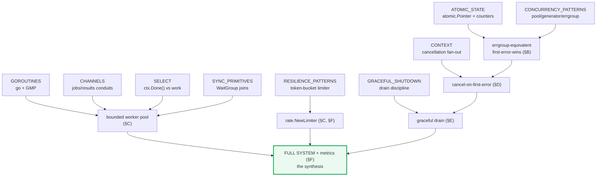
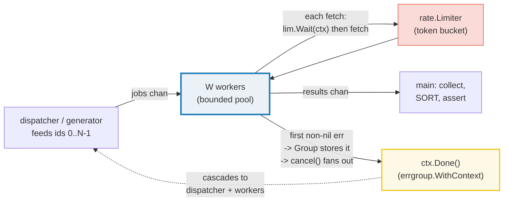
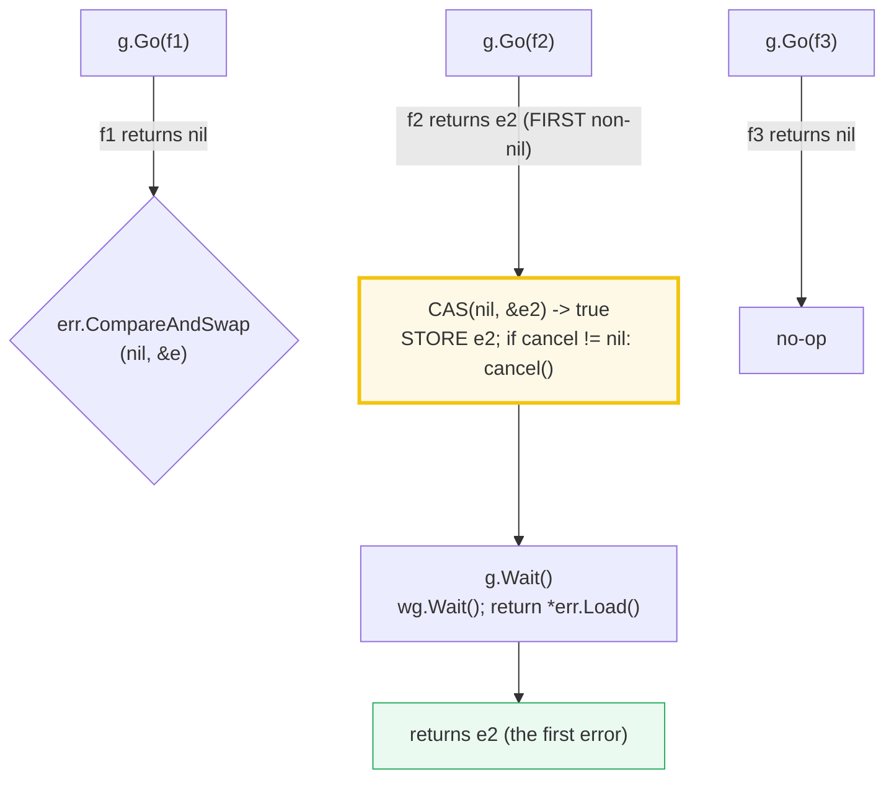
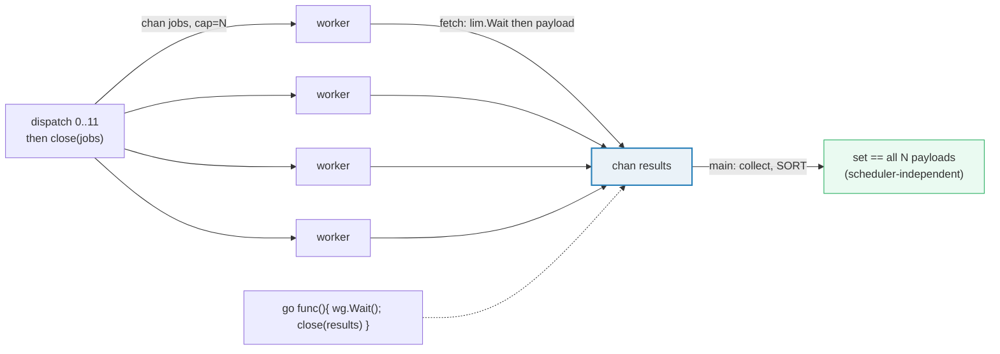

# CONCURRENCY_CAPSTONE — The Synthesis: Bounded Pool + Rate Limit + errgroup + Cancellation

> **Goal (one line):** show, by running **one realistic program**, how a
> **bounded concurrent fetcher** composes the Phase-3 primitives (goroutines,
> channels, `select`, the errgroup-equivalent) with the Phase-8 production
> patterns (`context` cancellation, a real `golang.org/x/time/rate` token-bucket
> limiter, graceful shutdown) into a system with **bounded concurrency**, a
> **first-error-wins** error model, and a **clean drain**.
>
> **Run:** `go run concurrency_capstone.go`
>
> **Ground truth:** [`concurrency_capstone.go`](./concurrency_capstone.go) →
> captured stdout in
> [`concurrency_capstone_output.txt`](./concurrency_capstone_output.txt). Every
> number/set/error below is pasted **verbatim** from that file under a
> `> From concurrency_capstone.go Section X:` callout. Nothing is hand-computed.
>
> **Prerequisites (this is the synthesis — read these first):** 🔗
> [`GOROUTINES`](./GOROUTINES.md) (the `go` statement + GMP), 🔗
> [`CHANNELS`](./CHANNELS.md) (the jobs/results conduits + close semantics), 🔗
> [`SELECT`](./SELECT.md) (multiplexing `ctx.Done()` against real work), 🔗
> [`CONTEXT`](./CONTEXT.md) (cancellation that fans out down the tree), 🔗
> [`CONCURRENCY_PATTERNS`](./CONCURRENCY_PATTERNS.md) (worker pool / generator /
> the from-scratch errgroup), 🔗 [`SYNC_PRIMITIVES`](./SYNC_PRIMITIVES.md)
> (`WaitGroup` joins), 🔗 [`ATOMIC_STATE`](./ATOMIC_STATE.md) (lock-free
> counters + `atomic.Pointer` first-error), 🔗
> [`RESILIENCE_PATTERNS`](./RESILIENCE_PATTERNS.md) (the token-bucket rate
> limiter this capstone reuses), 🔗 [`GRACEFUL_SHUTDOWN`](./GRACEFUL_SHUTDOWN.md)
> (the drain discipline), 🔗 [`ERRORS`](./ERRORS.md) (sentinel + first-error
> propagation).

---

## 1. Why this bundle exists (lineage — the synthesis)

Phase 3 taught the **mechanisms**: how a `go` statement hands a goroutine to the
GMP scheduler (🔗 `GOROUTINES`), how channels carry values and how `close`
broadcasts (🔗 `CHANNELS`), how `select` multiplexes (🔗 `SELECT`), and how a
`WaitGroup` joins (🔗 `SYNC_PRIMITIVES`). Phase 3 also built the **patterns** on
top: worker pool, pipeline, fan-out/fan-in, and a from-scratch errgroup
(🔗 `CONCURRENCY_PATTERNS`). Phase 8 added the **production overlays**: a real
token-bucket rate limiter (🔗 `RESILIENCE_PATTERNS`), `context`-driven
cancellation (🔗 `CONTEXT`), and graceful drain (🔗 `GRACEFUL_SHUTDOWN`).

This capstone does only one thing the siblings do not: it **wires all of those
pieces into one program** and asserts the invariants that only hold when they
compose correctly. A worker pool that ignores `ctx.Done()` leaks on shutdown; a
rate limiter that isn't counted can't be proven; a first-error-wins `Group` that
doesn't cancel leaves in-flight work running. The capstone makes those
interactions **falsifiable** — `go run` prints the captured error, the sorted
result set, and the structural counts.



> From `pkg.go.dev/golang.org/x/sync/errgroup` (Overview, verbatim): *"Package
> errgroup provides synchronization, error propagation, and Context cancellation
> for groups of goroutines working on subtasks of a common task."* And:
> *"[errgroup.Group] is related to sync.WaitGroup but adds handling of tasks
> returning errors."* And from `pkg.go.dev/golang.org/x/time/rate`: *"A Limiter
> controls how frequently events are allowed to happen. It implements a 'token
> bucket' of size b, initially full and refilled at rate r tokens per second."*

---

## 2. The system at a glance



The data path is **jobs chan → W workers (each rate-limited) → results chan**.
The control path is **first error → `Group` stores it (atomic CAS) → `cancel()`
→ `ctx.Done()` fans out to every worker and the dispatcher**. The closer
goroutine (`{ g.Wait(); close(results) }`) guarantees the results channel closes
only after every worker exits, so the collector's `range` always terminates — no
deadlock, no send-on-closed-channel panic (🔗 `CHANNELS`).

---

## 3. The determinism harness (why output is byte-identical)

This bundle runs **many** goroutines under a real rate limiter and a real
context cancellation. Per 🔗 `HOW_TO_RESEARCH` §4.2, every nondeterministic
quantity is removed from the printed output:

- **No goroutine prints.** Workers write results to a channel (or atomic
  counters); `main` collects, **sorts**, and prints only after every goroutine
  joins. Per-worker identity and scheduling order are never asserted.
- **Seeded RNG only.** Payloads and the injected failing id come from
  `math/rand/v2` PCG with fixed seeds (`(42,42)`, `(7,7)`, `(99,99)`), so every
  printed payload and the failing id (`id=3` in §F) are reproducible forever.
- **High finite rate.** `rate.NewLimiter(rate.Limit(10000), W)` is a *real*
  limiter (every fetch calls `lim.Wait`), but the rate is high enough that work
  is never bottlenecked on wall-clock. We assert the **structural** fact
  (`limWaits == fetchesInvoked == N`), never an elapsed duration.
- **Bounds, not counts, for cancellation.** In §D/§E the exact number of fetches
  that race the cancel signal is scheduler-dependent, so we assert the bound
  (`1 <= fetchesInvoked <= N`) and the captured first error — and we **do not
  print** that count. `runtime.NumGoroutine()` is likewise runtime-dependent, so
  the leak check asserts the bound but does not print the raw counts.

---

## 4. Section A — The fetch primitive & the job stream

The two atoms every later section composes: a **job stream** (ids `0..N-1` with
seeded payloads) and a **fake fetch** (healthy id → payload; the failing id → an
injected, deterministic error). Isolating `fetch` here lets §C–§F compose it
without re-explaining it.

> From `concurrency_capstone.go` Section A:
> ```
> job stream: 8 jobs (ids 0..7); seeded payloads (math/rand/v2 PCG seed 42,42)
> fetch(id=1, healthy)  -> payload=37616, err=<nil>
> fetch(id=3, failing) -> payload=0, err=fetch id=3: injected upstream failure
> ```
> ```
> [check] job stream has exactly N=8 jobs: OK
> [check] fetch of a healthy id returns nil error: OK
> [check] fetch of a healthy id returns its seeded payload: OK
> [check] fetch of the failing id returns the injected error: OK
> [check] the injected error names the failing id: OK
> [check] each fetch went through lim.Wait (2 waits for 2 fetches): OK
> ```

**What.** `fetch(ctx, id, failingID, lim, payloads, &limWaits)` is the whole
upstream: it blocks on `lim.Wait(ctx)` (counted atomically), then returns either
`payloads[id]` or `fmt.Errorf("fetch id=%d: injected upstream failure", id)` for
the one seeded failing id. No real network — `httptest`-style fakes offline by
default (🔗 `HOW_TO_RESEARCH` §6).

**Why `lim.Wait` is the seam.** `lim.Wait(ctx)` is where cancellation bites the
fetch: if `ctx` is already cancelled when a worker calls `fetch`, `Wait` returns
`context.Canceled` immediately and `fetch` wraps it (`"limiter wait: %w"`). That
is the §D mechanism — an in-flight worker observing `ctx.Done()` mid-fetch bails
cleanly instead of completing (🔗 `CONTEXT`, 🔗 `RESILIENCE_PATTERNS`).

---

## 5. Section B — The errgroup-equivalent (first-error-wins)



> From `concurrency_capstone.go` Section B:
> ```
> errgroup-equivalent: 3 funcs launched (one returns an error)
> all 3/3 funcs ran (Wait blocks until EVERY goroutine exits)
> Wait() error: boom: stage 2 failed
> ```
> ```
> [check] all 3 funcs ran (Wait blocks until every goroutine exits): OK
> [check] Wait() returned a non-nil error: OK
> [check] Wait() error is the injected first error: OK
> ```

**What.** Three funcs launch under a zero-valued `group` (no associated context
— the plain first-error-wins form). Exactly one returns an error; `Wait` blocks
until **all three** exit and returns that error. Because exactly one func
errors, the message is deterministic regardless of scheduling.

**Why first-error-wins is an atomic CAS, not a mutex.** The store is
`g.err.CompareAndSwap(nil, &err)` — it succeeds **only** for the first non-nil
error; every later error sees a non-nil pointer and the CAS fails (no-op). This
is lock-free: there is no `sync.Mutex` on the error path, only a single atomic
word (🔗 `ATOMIC_STATE`). It matches the real `errgroup` semantics:

> From `pkg.go.dev/golang.org/x/sync/errgroup` — `Wait` (verbatim): *"blocks
> until all function calls from the Go method have returned, then returns the
> first non-nil error (if any) from them."* And `Go`: *"The first goroutine in
> the group that returns a non-nil error will cancel the associated Context, if
> any. The error will be returned by Wait."*

**The capstone's `Group` vs the real `errgroup`.** This bundle reimplements the
core (`Go`, `Wait`, `WithContext`) from scratch — **no** `golang.org/x/sync`
import (stdlib + `golang.org/x/time/rate` only). The full library also exposes
`SetLimit(n)` / `TryGo(f)` for bounded fan-out inside the group itself; the
capstone instead bounds concurrency with an explicit `W`-worker pool (§C), which
is the same idea expressed as channels (🔗 `CONCURRENCY_PATTERNS`).

> From `pkg.go.dev/golang.org/x/sync/errgroup` — `WithContext` (verbatim):
> *"returns a new Group and an associated Context derived from ctx. The derived
> Context is canceled the first time a function passed to Go returns a non-nil
> error or the first time Wait returns, whichever occurs first."*

---

## 6. Section C — Bounded worker pool + rate limiter (fan-out, no failure)



> From `concurrency_capstone.go` Section C:
> ```
> bounded pool: 4 workers, 12 jobs, rate=10000 tokens/sec burst=4 (no failure)
> collected 12 payloads (sorted) -> [1946 14938 19442 23582 30182 33685 43992 52056 56356 75902 80979 96004]
> ```
> ```
> [check] pool processed all 12 jobs (12 payloads collected): OK
> [check] sorted result set == all N payloads (set is scheduler-independent): OK
> [check] every fetch went through lim.Wait (limWaits == fetches == N): OK
> ```

**What.** `W=4` worker goroutines drain a shared `jobs` channel; each fetch is
gated by `lim.Wait` (a real token bucket). No job fails, so all 12 payloads land.
Which worker handles which job is nondeterministic, but the **sorted set** is
exactly the 12 seeded payloads every run — the proof that the pool is correct is
a set-equality check, not an order check (🔗 `GOROUTINES`, 🔗 `CHANNELS`).

**Why the closer goroutine is load-bearing.** `go func() { wg.Wait();
close(results) }()` guarantees `results` closes **only after every worker has
stopped sending**. Closing earlier would panic on a later send; closing later
would deadlock the collector's `range` (🔗 `CHANNELS`: sends on a closed channel
panic, and a `range` only ends on close). The `WaitGroup` is the happens-before
edge that makes the close safe (🔗 `SYNC_PRIMITIVES`).

**Why the rate assertion is structural, not timed.** `limWaits == 12 == N` proves
every fetch passed through the limiter exactly once. We never assert *how long*
`lim.Wait` blocked — at 10 000 tokens/sec the block is sub-millisecond and
timing-dependent; the count is the deterministic fact (🔗 `RESILIENCE_PATTERNS`:
the same token bucket, asserted on `Allow()` outcomes there).

---

## 7. Section D — Cancellation on first error (errgroup.WithContext semantics)

> From `concurrency_capstone.go` Section D:
> ```
> cancellation: failing id=0 (first dispatched), 4 workers, ctx from errgroup.WithContext
> first error captured by Wait(): fetch id=0: injected upstream failure
> (fetches that raced the cancel signal are scheduler-dependent; asserting bounds only)
> ```
> ```
> [check] Wait() returned a non-nil error (first error captured): OK
> [check] the captured error is the injected failure for id=0: OK
> [check] completed fetches bounded: 1 <= fetchesInvoked <= N: OK
> ```

**What.** The failing job is dispatched **first** (`id=0`). The worker that
receives it calls `fetch` → gets the injected error → `return err`. The `Group`
stores it (CAS wins) and, because this is a `withContext` group, calls
`cancel()` — which closes the derived ctx's `Done()` channel. The dispatcher's
next `select { case jobs <- i: case <-ctx.Done(): }` bails; the other workers'
`select { case <-ctx.Done(): …; case id := <-jobs: … }` bail. `Wait` returns the
injected error.

**Why bounds, not a count.** Between the failing fetch returning and every peer
observing `ctx.Done()`, some healthy jobs may already have been pulled and
fetched. The number that "race" the cancel signal is scheduler-dependent —
printing it would break byte-identical output. The deterministic facts are (a)
the first error is always the injected one (it is stored *before* `cancel()` is
called, so any later `context.Canceled` from `lim.Wait` loses the CAS), and (b)
the count is bounded `1 <= fetchesInvoked <= N`. This is the discipline from
🔗 `CONTEXT` (assert `Err()` / `Done()` closure, never timing) and 🔗
`RESILIENCE_PATTERNS` (assert bounds, never scheduler-dependent peaks).

**The happens-before guarantee that makes "first error" deterministic.** The
`Group.Go` wrapper does `if CAS(nil,&err) && cancel != nil { cancel() }` — the
`cancel()` call is sequenced **after** the successful CAS in the same goroutine.
A peer that observes `ctx.Done()` does so via the context package's
channel-close (a happens-before edge, 🔗 `SYNC_PRIMITIVES` / the memory model),
so by the time a peer's `lim.Wait` returns `context.Canceled` and tries its own
CAS, the first store is already visible and the peer's CAS fails. Hence `Wait`
deterministically returns the injected error, never `context.Canceled`.

> From `pkg.go.dev/context` (Overview, verbatim): *"When a Context is canceled,
> all Contexts derived from it are also canceled."* One `cancel()` ripples
> through the whole call tree — that cascade *is* why §D works.

---

## 8. Section E — Graceful drain (cancel stops the stream, pool joins cleanly)

> From `concurrency_capstone.go` Section E:
> ```
> graceful drain: generator feeds up to 1000, 3 workers; collector takes 5 then cancels
> (drained count is scheduler-dependent; asserting bounds only)
> ```
> ```
> [check] at least the requested results drained before cancel: OK
> [check] drain stopped far below streamCap (cancel stopped the generator): OK
> ```

**What.** A generator emits `0..999` honoring `ctx`; `W=3` workers fetch each;
the collector accepts 5 results and then calls `cancel()` (the shutdown trigger).
On cancel the generator stops feeding (`case <-ctx.Done(): return`), the workers
stop pulling, the results channel drains whatever was in flight, and the pool
`WaitGroup` joins — `close(results)` then ends the collector's `range`. No
deadlock, no leak (🔗 `GRACEFUL_SHUTDOWN`).

**Why the drain cannot deadlock.** Every send is wrapped in
`select { case results <- p: case <-ctx.Done(): return }`, so a worker never
blocks forever on a collector that has stopped receiving. The closer
(`{ poolWg.Wait(); close(results) }`) runs only after the generator + all workers
exit — which they do because each honors `ctx.Done()`. Once `results` closes, the
collector's `range` ends. This is the same "generator honors done" shape as
🔗 `CONCURRENCY_PATTERNS` §E, upgraded from a hand-rolled `done` channel to a
real `context.Context` (🔗 `CONTEXT`).

---

## 9. Section F — The full system + metrics (the synthesis)

> From `concurrency_capstone.go` Section F:
> ```
> full system: N=16 jobs, W=4 workers, rate=10000 tokens/sec, one injected failure at id=3
> successful payloads (sorted) -> [2610 12757 15826 18087 22841 23259 23704 25933 43122 44491 53205 56299 81397 82103 82503]
> first error captured         -> fetch id=3: injected upstream failure
> metrics: fetchesInvoked=16, limWaits=16 (NumGoroutine counts runtime-dependent, not printed)
> ```
> ```
> [check] all N fetches invoked (jobs channel fully drained): OK
> [check] every fetch went through lim.Wait (limWaits == fetches == N): OK
> [check] successful result set == all ids except the failing one (sorted): OK
> [check] exactly N-1 successes (one injected failure): OK
> [check] Wait() returned the injected error for the failing id: OK
> [check] no goroutine leak (NumGoroutine within baseline+3 after Wait): OK
> ```

**What.** `N=16` jobs, `W=4` workers, the real limiter, and exactly one seeded
injected failure (`id=3`). All jobs run (a plain `group`, no cancel-on-error —
the cancel path is §D); the `Group` captures the single error via
first-error-wins while the other 15 succeed. The asserts pin the whole system:
the successful **set** (sorted) == all payloads except the failing id's;
`fetchesInvoked == limWaits == 16`; and `runtime.NumGoroutine()` returns to
within `baseline+3` after `Wait` (no goroutine leak).

**Why all 16 fetches run even though one errors.** The jobs channel is
pre-filled and closed; `W` workers drain it. The worker that hits `id=3` returns
its error and stops, but the **other** workers keep draining the shared channel —
so every job is fetched exactly once. `fetchesInvoked == 16` is the proof that
early-return-on-error in one worker doesn't drop work on the floor: the pool's
`range jobs` distributes remaining ids to the surviving workers (🔗 `CHANNELS`,
🔗 `CONCURRENCY_PATTERNS`).

**The no-leak check.** `Wait` returning proves every `g.Go`-launched goroutine
exited (the `WaitGroup` is the proof). The `NumGoroutine` bound is the
belt-and-suspenders assertion that nothing else leaked (a generator that ignored
`ctx.Done()`, a closer goroutine that never ran). The exact runtime counts are
**not printed** — they include GC/sysmon goroutines that vary — only the bound
is asserted (🔗 `GOROUTINES`: goroutine leaks; 🔗 `OBSERVABILITY_OTEL`: in
production you'd emit a `goroutines` gauge metric for this).

---

## 10. The cross-reference map (🔗 — this is the synthesis)

| Sibling | Why it matters here |
|---|---|
| 🔗 [`GOROUTINES`](./GOROUTINES.md) | The `go` statement launches every worker; the no-leak check (`NumGoroutine`) is the capstone's goroutine-accounting payoff. |
| 🔗 [`CHANNELS`](./CHANNELS.md) | `jobs`/`results` are the conduits; the closer (`wg.Wait(); close(results)`) is the close-after-all-sends discipline that prevents send-on-closed panics. |
| 🔗 [`SELECT`](./SELECT.md) | Every cancellation point is `select { case <-ctx.Done(): …; case work: … }` — multiplexing the cancel signal against real work. |
| 🔗 [`CONTEXT`](./CONTEXT.md) | `ctx.Done()` is the fan-out signal; `WithCancel` + the `withContext` group give §D its cascade. |
| 🔗 [`CONCURRENCY_PATTERNS`](./CONCURRENCY_PATTERNS.md) | The worker pool, generator, and the from-scratch errgroup are lifted directly from here; the capstone adds rate limiting + ctx cancellation on top. |
| 🔗 [`SYNC_PRIMITIVES`](./SYNC_PRIMITIVES.md) | `WaitGroup` joins the pool; the `wg.Wait → close` happens-before edge is what makes the closer safe. |
| 🔗 [`ATOMIC_STATE`](./ATOMIC_STATE.md) | `atomic.Pointer[error]` + `CompareAndSwap` is the lock-free first-error-wins store; `atomic.AddInt64` counts fetches/waits. |
| 🔗 [`RESILIENCE_PATTERNS`](./RESILIENCE_PATTERNS.md) | `rate.NewLimiter` is the same token bucket; the structural `limWaits == fetches` assertion mirrors its `Allow()`-outcome discipline. |
| 🔗 [`GRACEFUL_SHUTDOWN`](./GRACEFUL_SHUTDOWN.md) | §E's drain (generator honors `ctx`, closer joins, results close) is the same dance as `http.Server.Shutdown`. |
| 🔗 [`ERRORS`](./ERRORS.md) | The injected error is a first-class value captured by `Wait`; `errors.Is`/`strings.Contains` classify it. |
| 🔗 `OBSERVABILITY_OTEL` | In production the §F metrics (`fetchesInvoked`, `limWaits`, a goroutine gauge, an error counter) become OpenTelemetry instruments — you cannot operate this system blind. |

---

## 11. Pitfalls (the expert payoff)

| Trap | Symptom | Fix |
|---|---|---|
| Closing `results` before all sends finish | `panic: send on closed channel` | Close only inside `go func() { wg.Wait(); close(results) }()` — the `WaitGroup` is the happens-before edge. |
| Worker prints directly | `_output.txt` differs run-to-run (interleaving) | Never print from a goroutine; collect into a channel/slice, **sort**, print from `main` after join. |
| Asserting the count of jobs that raced cancel | flaky `_output.txt` (scheduler-dependent) | Assert the bound (`1 <= n <= N`) and the captured first error; never the exact raced count. |
| `errgroup` without cancel-on-error | in-flight workers keep running after one fails → wasted work / leak | Use `WithContext` so the first error cancels the derived ctx; peers observe `ctx.Done()` and bail. |
| Storing the error under a mutex on the hot path | contention / slower than necessary | `atomic.Pointer[error]` + `CompareAndSwap(nil, &err)` is lock-free first-error-wins (🔗 `ATOMIC_STATE`). |
| A send that can block forever after cancel | deadlock (worker waits on a collector that stopped reading) | Wrap sends in `select { case ch <- v: case <-ctx.Done(): return }`. |
| Forgetting `defer cancel()` on a derived ctx | goroutine/timer leak; `go vet` `lostcancel` error | `defer cancel()` immediately after `WithCancel`/`withContext` (double-cancel is a documented no-op). |
| Printing `runtime.NumGoroutine()` | nondeterministic output (GC/sysmon goroutines vary) | Assert the bound (`after <= baseline + ε`); don't print the raw count. |
| `rate.NewLimiter` with a low rate in a test | wall-clock bottleneck → slow + timing-dependent output | Use a high finite rate (`rate.Limit(10000)`) or `rate.Inf`; assert `limWaits == fetches` structurally. |
| Dropping work when one worker returns on error | `fetchesInvoked < N` silently | Drain the jobs channel from *multiple* workers so a surviving worker picks up the departed one's share (§F). |
| Reusing a `group` for a second task | stale error / WaitGroup state from the first run | *"A Group should not be reused for different tasks"* (errgroup doc) — make a new one per pipeline. |

---

## 12. Cheat sheet

```go
// --- errgroup-equivalent (from scratch; mirrors golang.org/x/sync/errgroup) ---
type group struct {
	wg     sync.WaitGroup
	err    atomic.Pointer[error]
	cancel context.CancelFunc // nil = plain group (no ctx); set by withContext
}
func withContext(ctx context.Context) (*group, context.Context, context.CancelFunc) {
	ctx, cancel := context.WithCancel(ctx)
	return &group{cancel: cancel}, ctx, cancel          // errgroup.WithContext semantics
}
func (g *group) Go(f func() error) {
	g.wg.Add(1)
	go func() {
		defer g.wg.Done()
		if err := f(); err != nil {
			if g.err.CompareAndSwap(nil, &err) && g.cancel != nil { // first error wins
				g.cancel()                                            // -> ctx.Done() fans out
			}
		}
	}()
}
func (g *group) Wait() error { g.wg.Wait(); if g.cancel != nil { g.cancel() }; if p := g.err.Load(); p != nil { return *p }; return nil }

// --- bounded pool + rate limiter + ctx-aware fetch ---
lim := rate.NewLimiter(rate.Limit(10000), W)            // real token bucket; high rate = no wall-clock bottleneck
func fetch(ctx context.Context, id int) (int, error) {
	if err := lim.Wait(ctx); err != nil { return 0, fmt.Errorf("limiter: %w", err) } // honors ctx.Done()
	atomic.AddInt64(&limWaits, 1)
	if id == failingID { return 0, fmt.Errorf("fetch id=%d: injected failure", id) }
	return payloads[id], nil
}
// worker loop: select ctx.Done() vs receive; on error return it (Group captures + cancels)
for {
	select {
	case <-ctx.Done(): return nil
	case id, ok := <-jobs: if !ok { return nil }
		p, err := fetch(ctx, id); if err != nil { return err }
		select { case results <- p: case <-ctx.Done(): return nil }   // never block past cancel
	}
}
// closer: close results ONLY after every worker exits
go func() { g.Wait(); close(results) }()
got := collectAndSort(results)                           // deterministic SET, never scheduling order
check("no leak", runtime.NumGoroutine() <= baseline+3)   // bound, not printed count
```

---

## Sources

Every signature, sentinel, and behavioral claim above was verified against the
package docs and corroborated by independent secondary sources (>= 2 per
concept):

- `golang.org/x/sync/errgroup` package — https://pkg.go.dev/golang.org/x/sync/errgroup
  - Overview (*"synchronization, error propagation, and Context cancellation for
    groups of goroutines"*; *"related to sync.WaitGroup but adds handling of
    tasks returning errors"*): https://pkg.go.dev/golang.org/x/sync/errgroup#pkg-overview
  - `Group` (*"A zero Group is valid, has no limit… and does not cancel on
    error"*; *"should not be reused for different tasks"*):
    https://pkg.go.dev/golang.org/x/sync/errgroup#Group
  - `WithContext` (*"derived Context is canceled the first time a function
    passed to Go returns a non-nil error or the first time Wait returns,
    whichever occurs first"*):
    https://pkg.go.dev/golang.org/x/sync/errgroup#WithContext
  - `Go` (*"The first goroutine… that returns a non-nil error will cancel the
    associated Context… The error will be returned by Wait"*):
    https://pkg.go.dev/golang.org/x/sync/errgroup#Group.Go
  - `Wait` (*"blocks until all function calls from the Go method have returned,
    then returns the first non-nil error"*):
    https://pkg.go.dev/golang.org/x/sync/errgroup#Group.Wait
  - `SetLimit` / `TryGo` (bounded fan-out inside the group — the capstone
    expresses the same idea as an explicit `W`-worker pool instead):
    https://pkg.go.dev/golang.org/x/sync/errgroup#Group.SetLimit
- `golang.org/x/time/rate` package — https://pkg.go.dev/golang.org/x/time/rate
  - `Limiter` (*"token bucket of size b, initially full and refilled at rate r…
    three main methods, Allow, Reserve, and Wait. Most callers should use Wait"*):
    https://pkg.go.dev/golang.org/x/time/rate#Limiter
  - `Wait` (*"blocks until lim permits… returns an error if… the Context is
    canceled"*): https://pkg.go.dev/golang.org/x/time/rate#Limiter.Wait (see 🔗
    `RESILIENCE_PATTERNS.md` for the full token-bucket treatment).
- `context` package — https://pkg.go.dev/context
  - Overview (*"When a Context is canceled, all Contexts derived from it are
    also canceled"*; *"The go vet tool checks that CancelFuncs are used on all
    control-flow paths"*): https://pkg.go.dev/context#pkg-overview (see 🔗
    `CONTEXT.md` for the full cancellation/deadline model).
- Go Blog — *"Go Concurrency Patterns: Pipelines and cancellation"* (the
  generator-honors-done + closer pattern this capstone composes with `context`):
  https://go.dev/blog/pipelines
- Go Blog — *"Go Concurrency Patterns: Context"* (why one cancel cascades
  through a fan-out — the §D mechanism): https://go.dev/blog/context
- Secondary corroboration (>= 2 independent, web-verified):
  - OneUptime — *"How to Use errgroup for Parallel Operations in Go"* (first
    non-nil error wins; `WithContext` cancel-on-error; `Wait` blocks until all
    exit): https://oneuptime.com/blog/post/2026-01-07-go-errgroup/view
  - FullStory engineering — *"Why You Should Use errgroup.WithContext() in Your
    Golang Server Handlers"* (derived ctx cancelled on first error or Wait;
    graceful-shutdown composition): https://www.fullstory.com/blog/why-errgroup-withcontext-in-golang-server-handlers/
  - VictoriaMetrics — *"Graceful Shutdown in Go: Practical Patterns"*
    (`signal.NotifyContext` + drain; the §E dance in production form):
    https://victoriametrics.com/blog/go-graceful-shutdown/

**Facts that could not be verified by running** (documented, not executed,
because they are library-API text or production guidance outside this bundle's
scope): the verbatim `errgroup` doc strings above (Overview, `WithContext`,
`Go`, `Wait`, `SetLimit`/`TryGo` semantics) and the `rate.Limiter` "three main
methods… Most callers should use Wait" guidance — confirmed by the `pkg.go.dev`
pages cited, mirrored from scratch in this file rather than imported. The
production claim that §F's counters "become OpenTelemetry instruments" is
best-practice (🔗 `OBSERVABILITY_OTEL`), not a runnable assertion in this bundle.
