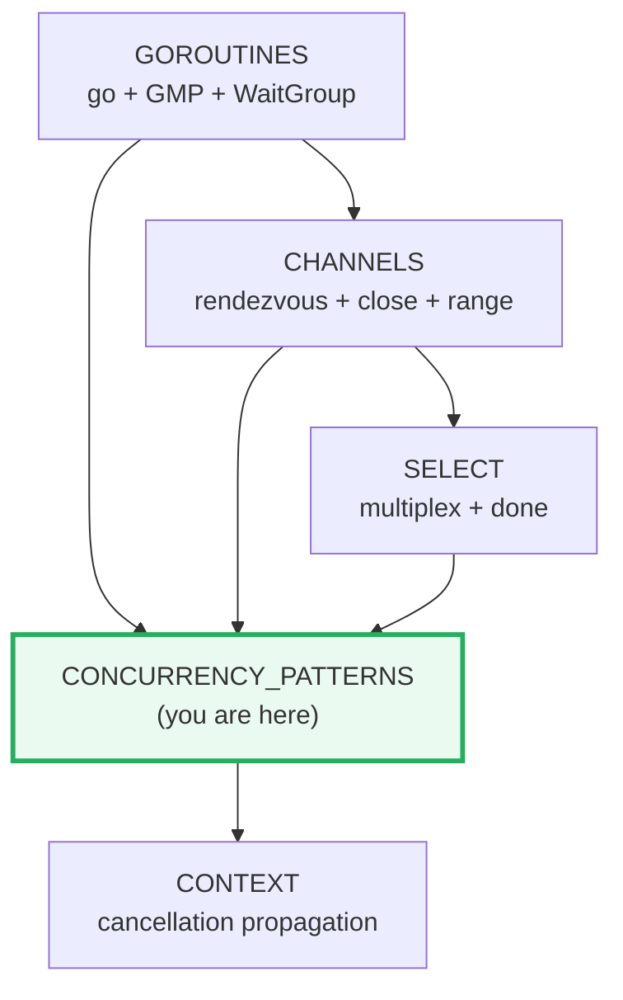
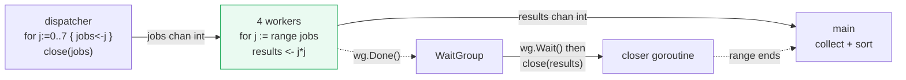
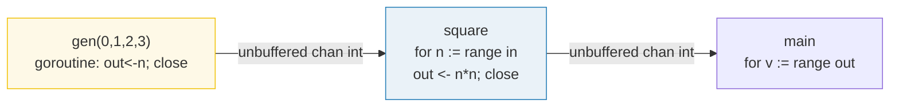
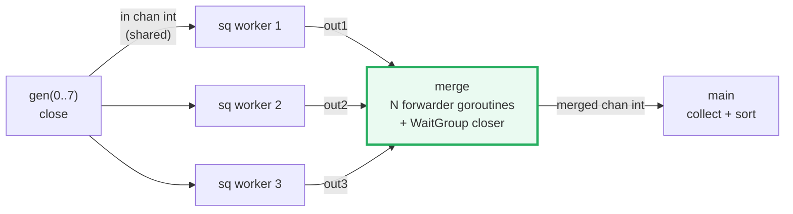
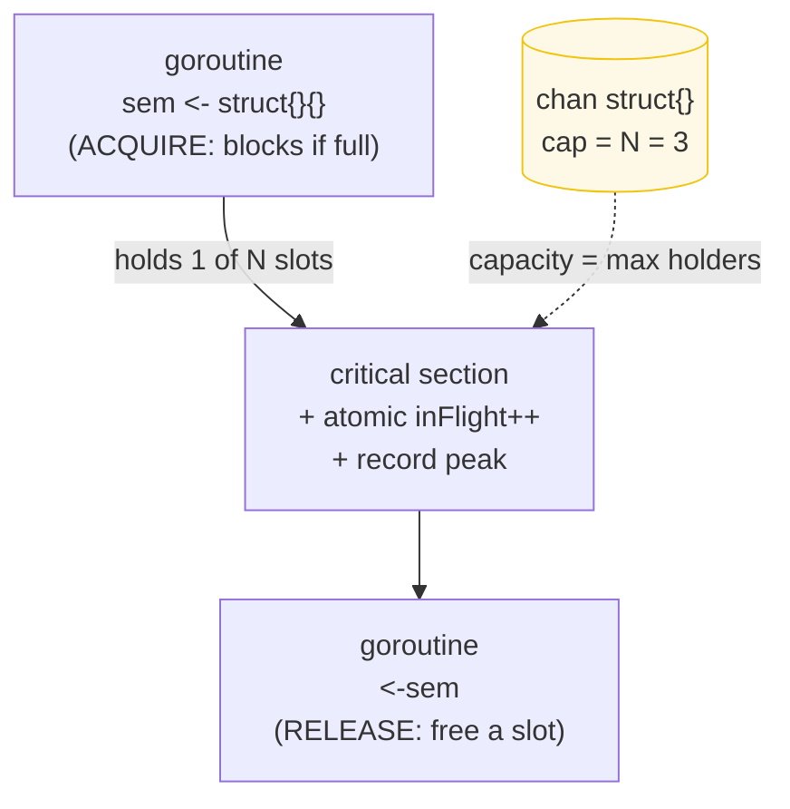
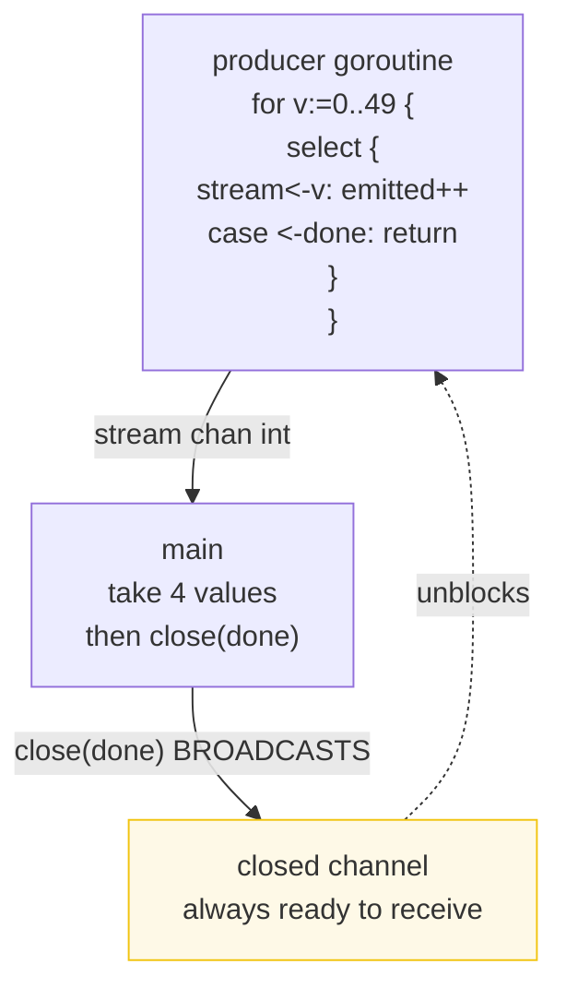

# CONCURRENCY_PATTERNS — Worker Pools, Pipelines, Fan-Out/Fan-In, Semaphores, Cancellation & errgroup

> **Goal (one line):** by printing every value, show how the production
> concurrency patterns — worker pool, pipeline, generator, fan-out/fan-in,
> semaphore (buffered channel), done-channel cancellation, and an
> errgroup-equivalent — are assembled from goroutines, channels, `sync`, and
> `sync/atomic`.
>
> **Run:** `go run concurrency_patterns.go`
>
> **Ground truth:** [`concurrency_patterns.go`](./concurrency_patterns.go) →
> captured stdout in
> [`concurrency_patterns_output.txt`](./concurrency_patterns_output.txt). Every
> number/table below is pasted **verbatim** from that file under a
> `> From concurrency_patterns.go Section X:` callout. Nothing is hand-computed.
>
> **Prerequisites:** 🔗 [`GOROUTINES`](./GOROUTINES.md) (the `go` statement, the
> GMP scheduler, `WaitGroup`), 🔗 [`CHANNELS`](./CHANNELS.md) (unbuffered
> rendezvous, `close`, `range`), 🔗 [`SELECT`](./SELECT.md) (multiplexing channel
> operations). This bundle is the *composition* layer built on those primitives.

---

## 1. Why this bundle exists (lineage)

Goroutines and channels are *primitive* operations. Real programs compose them
into recurring *shapes* — the **concurrency patterns**. The Go team codified
these in two canonical documents:

- **"Go Concurrency Patterns: Pipelines and cancellation"**
  (go.dev/blog/pipelines, 2014) — defines *pipeline*, *fan-out*, *fan-in*, and
  the *done-channel* cancellation idiom, built entirely from `chan` + `select` +
  `sync.WaitGroup`.
- **`golang.org/x/sync/errgroup`** — the small library that adds *error
  propagation* to a group of goroutines: run N of them, surface the **first**
  non-nil error, and (optionally) cancel the rest.

This bundle implements **all of them from the standard library alone** (the
north-star "stdlib-first" rule of this folder). It does **not** import
`golang.org/x/sync/errgroup` — the `group` type in Section F is a from-scratch
re-implementation using `sync.WaitGroup` + `sync/atomic.Pointer[error]`, so you
can see exactly how first-error-wins works.

> From `go.dev/blog/pipelines` — *What is a pipeline?*: "a pipeline is a series
> of *stages* connected by channels, where each stage is a group of goroutines
> running the same function... receive values from *upstream* via *inbound*
> channels, perform some function on that data... send values *downstream* via
> *outbound* channels."

> From `go.dev/blog/pipelines` — *Fan-out, fan-in*: "Multiple functions can read
> from the same channel until that channel is closed; this is called *fan-out*."
> and "A function can read from multiple inputs and proceed until all are closed
> by multiplexing the input channels onto a single channel... This is called
> *fan-in*."



---

## 2. The shapes at a glance

| Pattern | What it solves | The moving parts |
|---|---|---|
| **Worker pool** | Bound work to N workers; consume a job stream | `chan Job` → N goroutines → `chan Result`; `WaitGroup` + a closer goroutine |
| **Pipeline** | Compose stages with no shared state | `gen → stage → stage → …`; each stage is one goroutine; channels carry values |
| **Generator** | Turn a list/stream into a channel | a function that returns `<-chan T` and starts a goroutine to fill+close it |
| **Fan-out / Fan-in** | Parallelize one stage; then re-merge | N workers read the *same* input (fan-out); `merge` multiplexes outputs (fan-in) |
| **Semaphore** | Limit concurrency to N without a mutex | `chan struct{}` of capacity N; acquire = send, release = receive |
| **Done-channel** | Cancel a whole graph of goroutines | `done <-chan struct{}`; `close(done)` broadcasts; stages `select` on it |
| **errgroup-equivalent** | Run goroutines, keep the first error | `Go(func() error)` + `Wait() error`; `WaitGroup` + `atomic.Pointer[error]` |

---

## 3. Section A — Worker pool

N=4 worker goroutines drain a shared `chan int` of jobs; each writes `j*j` to a
shared `chan int` of results. The dispatcher enqueues 8 jobs (0..7) then closes
`jobs`; a **closer goroutine** closes `results` *only after* a `WaitGroup` says
every worker has exited. Which worker ran which job is nondeterministic, so main
collects **all** results, **sorts**, and asserts the set.



> From `concurrency_patterns.go` Section A:
> ```
> worker pool: 4 workers drain 8 jobs (j*j): chan jobs -> chan results
> collected 8 results, sorted -> [0 1 4 9 16 25 36 49]
> ```
> ```
> [check] worker pool produced exactly 8 results: OK
> [check] sorted worker-pool results == [0 1 4 9 16 25 36 49]: OK
> ```

**Why the closer goroutine exists.** Sends on a closed channel **panic**, so
`results` may be closed *only* once you are certain no worker will ever send
again. The `WaitGroup` is that certainty: `Done()` "synchronizes before" the
`Wait()` that it unblocks (🔗 Go memory model), so the goroutine that runs
`wg.Wait(); close(results)` closes the channel strictly *after* the last send.
Closing from main directly would race the workers and panic.

**Why the set, not the order.** The four workers compete for jobs from the same
channel; the runtime decides which worker receives which job. Two runs of the
same program can hand job 5 to worker 0 or worker 3. The output is therefore
**collected then sorted** before printing — the only way to get byte-identical
output across runs (🔗 `GOROUTINES` determinism rule).

---

## 4. Section B — Pipeline (gen → square → collect)

A 3-stage pipeline. `gen` is a **generator**: it returns a channel and starts a
goroutine that emits the given values then closes it. `square` is a **stage**: it
ranges its input, transforms, and sends downstream, closing its output when its
input closes. Stages compose because they share the channel type
(`<-chan int → <-chan int`).



> From `concurrency_patterns.go` Section B:
> ```
> pipeline: gen(0,1,2,3) emits a stream -> square(n*n) -> main ranges the output
> collected stream (in order, single stage) -> [0 1 4 9]
> ```
> ```
> [check] pipeline gen->square produced [0 1 4 9]: OK
> ```

**Why order is preserved here but not in the worker pool.** Each stage is a
**single** goroutine, and the channels are unbuffered (a rendezvous). The
n-th value cannot leave `gen` until `square` takes the (n−1)th, so the stream is
strictly sequential: `[0 1 4 9]` every run. The worker pool, by contrast, has
**many** goroutines competing for the same channel, which is why it must sort.

**The pipeline convention (from the blog).** Two rules make a pipeline safe:
(1) a stage closes its outbound channel when all its sends are done; (2) a stage
keeps receiving from its inbound channel until that channel is closed. Together
they let every stage be written as a plain `for ... range`, and let `close`
cascade naturally downstream.

---

## 5. Section C — Fan-out / Fan-in

A single source (`gen` of 0..7) is read by **three** `square` workers that all
range the **same** `in` channel — that is *fan-out* (work distribution). Each
worker writes to its **own** output channel; `merge` fans them back into one
channel — that is *fan-in*. The per-value → worker assignment is nondeterministic,
so (again) main collects, sorts, and asserts the set.



> From `concurrency_patterns.go` Section C:
> ```
> fan-out: 3 sq workers read the same `in`; fan-in: merge -> one channel
> collected 8 results, sorted -> [0 1 4 9 16 25 36 49]
> ```
> ```
> [check] fan-out/fan-in produced exactly 8 results: OK
> [check] sorted fan-out/fan-in results == [0 1 4 9 16 25 36 49]: OK
> ```

**How `merge` works (the key idiom).** For each input channel it starts a
**forwarder** goroutine that copies values onto a single output; a `WaitGroup`
tracks all forwarders; one extra goroutine does `wg.Wait()` **then** `close(out)`.
That final goroutine is essential: it is the **only** thing that closes `out`, and
it does so only after every forwarder has stopped sending — the same "close after
Wait" discipline as the worker pool, just fan-in shaped.

```go
func merge(done <-chan struct{}, cs ...<-chan int) <-chan int {
    var wg sync.WaitGroup
    out := make(chan int)
    forward := func(c <-chan int) {
        defer wg.Done()
        for n := range c {
            select {
            case out <- n:
            case <-done:
                return
            }
        }
    }
    wg.Add(len(cs))
    for _, c := range cs {
        go forward(c)
    }
    go func() { wg.Wait(); close(out) }() // single closer, after all forwarders
    return out
}
```

---

## 6. Section D — Semaphore via a buffered channel

A `chan struct{}` of capacity N is a **counting semaphore**. Acquire = send
(blocks while N goroutines hold a slot); release = receive (frees a slot). This
bounds concurrency to N **without** a `sync.Mutex`. The bundle proves the bound
deterministically by counting in-flight goroutines with atomics; the raw peak is
**not** printed (it depends on scheduling), only the invariant `peak ≤ N` is.



> From `concurrency_patterns.go` Section D:
> ```
> semaphore: chan struct{} cap=3 gates 10 goroutines (acquire=send, release=<-sem)
> invariant: at most `semCap` goroutines hold a slot at once (peak counted via atomics, not printed)
> token work: 10 goroutines * sum(0..999) = 4995000
> ```
> ```
> [check] peak in-flight <= semaphore cap (3): OK
> [check] peak in-flight >= 1 (the semaphore was exercised): OK
> [check] token work total == 10 * sum(0..999) = 4995000 (all goroutines ran): OK
> ```

**Why `struct{}`.** The values carry no information — only the *occupancy of a
slot* matters. `struct{}` is zero-sized, so the channel stores only the slot
counters, not data. Acquire/release is symmetric and blocking; pairing them with
`defer` (acquire, then `defer release`) makes leaks impossible.

**The bound is the capacity.** `cap(sem)` is exactly the maximum number of
goroutines that can be between acquire and release at once: the (N+1)th send
cannot complete until a receive frees a slot. The atomic `peak` therefore can
never exceed `semCap` — a guarantee that holds regardless of the scheduler, which
is why the `check` is deterministic. (The companion `total == 4 995 000` proves
all 10 goroutines actually ran their `sum(0..999)` token work.)

---

## 7. Section E — Done-channel cancellation (the `context` preview)

A `done <-chan struct{}` is threaded into the producer. The consumer takes only
K=4 values from a stream that would otherwise reach 50, then **closes `done`**.
Closing is a **broadcast**: a closed channel is *always* ready to receive, so
every goroutine doing `select { case ...: case <-done: return }` unblocks at
once — no matter how many there are.



> From `concurrency_patterns.go` Section E:
> ```
> producer emits 0..49 until cancelled; main takes only 4 then closes done
> received (in order) -> [0 1 2 3]
> producer emitted exactly 4 value(s) then stopped (cancellation worked)
> ```
> ```
> [check] main received exactly take=4 values: OK
> [check] received stream == [0 1 2 3] (order preserved): OK
> [check] producer emitted exactly 4 (== taken), not more: OK
> [check] producer stopped early (4 < natural cap 50) => cancellation fired: OK
> ```

**Why `close(done)` instead of *sending* on `done`.** The blog's first cut sent a
value on `done` once per blocked sender — but that forces you to **know how many
senders there are**, which is fragile (add one stage and you under-count). Closing
sidesteps the count entirely: *one close unblocks any number of receivers*. That
broadcast property is the whole reason the pattern scales.

**Why the producer emits exactly 4 (deterministic).** The channel is unbuffered,
so every successful `stream <- v` needs a paired receive. Main performs exactly
`take` receives via a **counted loop** (no `select` in the loop — so there is no
race between receiving a 5th value and observing `done`). After the K-th receive
main closes `done`; the producer's next `select` sees `<-done` ready and returns.
Emitted == taken == 4, every run. (The `wg.Wait()` afterwards also gives main a
happens-before edge to read `emitted` — no data race.)

**The goroutine-leak problem this solves.** From the blog: *"Goroutines are not
garbage collected; they must exit on their own."* If a downstream stage stops
reading mid-stream, an upstream goroutine blocked on `out <- v` **leaks** forever
(holding memory and stack references). The `done` channel — and in production,
🔗 [`CONTEXT`](./CONTEXT.md)'s `context.Context` — is the structured fix: it lets
the consumer tell *every* upstream stage to abandon pending sends and exit.

---

## 8. Section F — errgroup-equivalent (built from scratch)

A `group` type mirrors `golang.org/x/sync/errgroup.Group`: `Go(f)` launches a
tracked goroutine; `Wait()` blocks until all of them exit and returns the
**first** non-nil error. "First" is implemented with `atomic.Pointer[error]` and
`CompareAndSwap(nil, &err)` — only the goroutine that swaps the very first error
in wins; later errors are silently dropped. No `golang.org/x` import is needed.

```mermaid
graph TD
    G0["Go(func() error)<br/>returns nil"] --> WG["WaitGroup<br/>Add(1) per Go"]
    G1["Go(func() error)<br/>returns nil"] --> WG
    G2["Go(func() error)<br/>returns err"] --> WG
    G2 -->|"CompareAndSwap(nil, &err)<br/>first-error-wins"| AP["atomic.Pointer&#91;error&#93;"]
    WG -->|"wg.Wait()"| W["Wait() error"]
    AP -->|"Load() -> first err"| W
    style AP fill:#fef9e7,stroke:#f1c40f
    style W fill:#eafaf1,stroke:#27ae60
```



> From `concurrency_patterns.go` Section F:
> ```
> errgroup-equivalent: 3 funcs launched (one returns an error)
> all 3/3 funcs ran to completion (Wait blocks until EVERY goroutine exits)
> Wait() error: boom: stage 2 failed
> ```
> ```
> [check] all 3 funcs ran (Wait blocks until every goroutine exits): OK
> [check] Wait() returned a non-nil error: OK
> [check] Wait() error matches the injected message: OK
> ```

**Why `Wait()` waits for *all* goroutines, even after an error.** Abandoning a
goroutine on first error would leak it (same hazard as Section E). The real
`errgroup` pairs `Wait` with an optional `context` that signals the *other*
goroutines to give up early, but `Wait` itself still joins every one of them. The
bundle's `Wait` is the join-only core.

**First-error-wins vs all-errors.** `CompareAndSwap(nil, &err)` keeps exactly one
error (the first to land). If you need *every* error, swap the atomic for a
mutex-guarded `[]error`. The single-error design matches `errgroup.Group`, whose
doc says `Wait` returns "the first non-nil error returned by any of the calls."

**The from-scratch implementation:**

```go
type group struct {
    wg  sync.WaitGroup
    err atomic.Pointer[error]
}

func (g *group) Go(f func() error) {
    g.wg.Add(1)
    go func() {
        defer g.wg.Done()
        if err := f(); err != nil {
            g.err.CompareAndSwap(nil, &err) // first non-nil error wins
        }
    }()
}

func (g *group) Wait() error {
    g.wg.Wait()
    if p := g.err.Load(); p != nil {
        return *p
    }
    return nil
}
```

---

## 9. Determinism — how this bundle stays byte-identical

This is a concurrency bundle, and the GMP scheduler is intentionally
nondeterministic. The output is reproducible only because of five discipline
rules (🔗 `HOW_TO_RESEARCH.md` §4.2):

1. **No goroutine prints.** Every worker writes into a channel or shared slice;
   `main` is the only printer, and only after a join (`WaitGroup.Wait()` or a
   closed-results `range`).
2. **Sort before printing sets.** Sections A, C collect results whose arrival
   order depends on the scheduler, then `slices.Sort` — the *set* is what is
   asserted, never the order.
3. **Never assert which worker ran which job, or which `select` case won.** Only
   membership / counts / bounds are checked.
4. **No timing value is printed.** Section D's `peak` is measured (to prove the
   semaphore bound) but **not** printed — it varies with scheduling; only the
   invariant `peak ≤ N` is, and that always holds.
5. **Counted receives, not `select`, when the count itself is the invariant.**
   Section E takes exactly K via a counted loop, avoiding the race in which a
   `select` receives a (K+1)th value instead of noticing `done`.

Verified: `go run -race` is clean, and 20 consecutive `go run`s diff to zero.

---

## 10. Pitfalls (the expert payoff)

| Trap | Symptom | Fix |
|---|---|---|
| Closing `results` from main while workers still send | Panic: `send on closed channel` | Close in a goroutine that runs **after** `wg.Wait()` (the "closer goroutine" idiom). |
| Forgetting to close `jobs` | Workers' `for range jobs` never exits → the closer's `wg.Wait()` blocks → **deadlock** | The producer must close `jobs` once it has enqueued everything. |
| Closing `out` in `merge` from multiple forwarders, or before they finish | Panic: `close of closed channel` / `send on closed channel` | Exactly one closer goroutine, after `wg.Wait()`. |
| Acquiring the semaphore without a `defer`red release | Deadlock (a slot is never freed) | `sem <- struct{}{}; defer func(){ <-sem }()`. |
| *Sending* on `done` instead of *closing* it | Must match the exact number of blocked senders; off-by-one → leak/hang | `close(done)` — a broadcast that needs no sender count. |
| Downstream abandons a pipeline mid-stream | Upstream goroutine blocks on `out <- v` **forever** → memory + stack leak | Thread `done` (or `context.Context`) and `select` on it in every stage. |
| Capturing the loop variable in a goroutine-launching loop (pre-1.22) | All goroutines see the last value of the variable | Go 1.22+ fixed per-iteration semantics; pass the value as a parameter for clarity. |
| Reading a shared variable a goroutine wrote, with no synchronization | Data race (the race detector flags it) | Join first (`wg.Wait()` gives happens-before), or use `atomic`/a channel. |
| `errgroup` assuming `Wait` returns *all* errors | You silently lose all but the first | First-error-wins is by design; collect a `[]error` under a mutex if you need them all. |
| `atomic.Pointer[error]` storing the address of a loop/scoped var | Looks scary but is safe | Go's escape analysis heap-allocates it; the pointer stays valid — but always `Load` only after the join. |

---

## 11. Cheat sheet

```go
// WORKER POOL — N workers drain jobs, write results; closer waits then closes.
jobs := make(chan Job, n); results := make(chan Result)
var wg sync.WaitGroup
wg.Add(n)
for range n {
    go func() { defer wg.Done()
        for j := range jobs { results <- work(j) }
    }()
}
go func() { wg.Wait(); close(results) }()   // close ONLY after all senders done
// ... enqueue + close(jobs); for r := range results { ... }

// PIPELINE — compose stages by channel type; each stage closes its output.
gen := func(done <-chan struct{}, nums ...int) <-chan int { ... }   // source
sq  := func(done <-chan struct{}, in <-chan int) <-chan int { ... } // stage

// FAN-OUT / FAN-IN — N workers read ONE input; merge fans outputs back in.
for w := range workers { outs[w] = sq(done, in) }                   // fan-out
merged := merge(done, outs...)                                      // fan-in

// SEMAPHORE — chan struct{} of cap N; acquire=send, release=recv.
sem := make(chan struct{}, n)
sem <- struct{}{}; defer func() { <-sem }()                         // acquire/release

// DONE-CHANNEL — close(done) broadcasts to unbounded receivers.
done := make(chan struct{}); defer close(done)
select { case out <- v: case <-done: return }                       // bail on cancel

// ERRGROUP (from scratch) — WaitGroup + atomic.Pointer[error], first error wins.
type group struct { wg sync.WaitGroup; err atomic.Pointer[error] }
func (g *group) Go(f func() error) { g.wg.Add(1); go func() { defer g.wg.Done()
    if err := f(); err != nil { g.err.CompareAndSwap(nil, &err) } }() }
func (g *group) Wait() error { g.wg.Wait(); if p := g.err.Load(); p != nil { return *p }; return nil }

// (Go 1.25+ shorthand) sync.WaitGroup now has Go(f) directly:
//   var wg sync.WaitGroup; wg.Go(func(){ ... }); wg.Wait()   // no manual Add/Done
```

---

## Sources

Every pattern, signature, and behavioral claim above was verified against the Go
blog, the standard-library docs, and the Go memory model:

- **The Go Blog — "Go Concurrency Patterns: Pipelines and cancellation"** (Sameer Ajmani, 2014) — https://go.dev/blog/pipelines
  - Pipeline definition (stages connected by channels); `gen`/`sq`/`merge`; fan-out ("multiple functions can read from the same channel until that channel is closed"); fan-in ("multiplexing the input channels onto a single channel"); the `sync.WaitGroup` merge closer; explicit cancellation via `close(done)` ("a receive operation on a closed channel can always proceed immediately"); the goroutine-leak hazard ("Goroutines are not garbage collected; they must exit on their own").
- **The Go Blog — "Advanced Go Concurrency Patterns"** — https://go.dev/blog/advanced-go-concurrency-patterns (background on `select`-based patterns).
- **`sync` package — https://pkg.go.dev/sync**
  - `WaitGroup`: "a counting semaphore typically used to wait for a group of goroutines or tasks to finish"; `Add`/`Done`/`Wait`; **`Go(f func())` added in go1.25.0** (the Add/Done shorthand used in the cheat sheet); `Done()` "synchronizes before" the `Wait()` it unblocks (Go memory model).
- **`sync/atomic` package — https://pkg.go.dev/sync/atomic** — `Pointer[T]` with `CompareAndSwap(old, new *T)` and `Load() *T` (used for first-error-wins).
- **The Go memory model — https://go.dev/ref/mem** — channel send/receive and `sync` establish "synchronizes before" edges (why reading a goroutine-written value after `Wait()` is race-free).
- **`golang.org/x/sync/errgroup`** — https://pkg.go.dev/golang.org/x/sync/errgroup (design reference only; **not imported** — reimplemented from scratch per the stdlib-first rule). `Group.Go`/`Group.Wait`; "the first non-nil error returned by any of the calls."
- Community corroboration of the pattern taxonomy (worker pool / pipeline / fan-out / fan-in / semaphore / cancellation):
  - https://medium.com/@serifcolakel/go-concurrency-patterns-worker-pool-fan-in-fan-out-pipeline-e8ebfeb1373b
  - https://karanpratapsingh.com/courses/go/advanced-concurrency-patterns

**Facts that could not be verified by running** (documented, not executed, since
they are panics/deadlocks by design): *closing `results` while a worker still
sends* panics `send on closed channel`; *closing `out` twice in `merge`* panics
`close of closed channel`; *a downstream stage that stops reading with no `done`*
deadlocks/leaks the upstream sender. These are confirmed by the 🔗 [`CHANNELS`](./CHANNELS.md)
axioms and the Go blog sections cited above, not reproduced as failing output (a
file containing them would crash).
