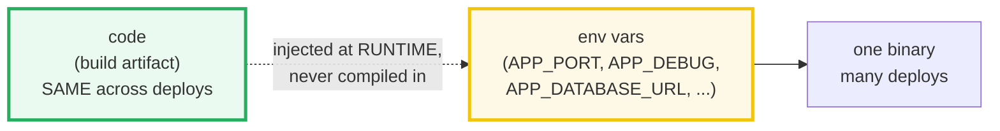
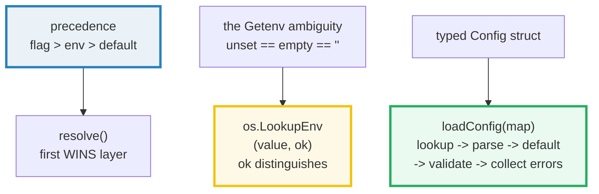
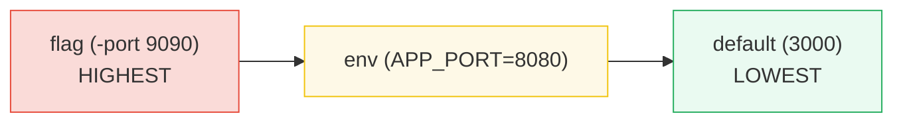

# CONFIG_12FACTOR — 12-Factor Config: Env Vars, Typed Config & Precedence

> **Goal (one line):** show, by printing every behavior, how a **12-factor app
> stores config in the environment** — `os.LookupEnv` disambiguating *unset* vs
> *empty*, a typed `Config` struct parsed from env (with defaults + validation),
> the **flag > env > default** precedence, required keys failing loudly, and a
> sorted `os.Environ()` dump.
>
> **Run:** `go run config_12factor.go`
>
> **Ground truth:** [`config_12factor.go`](./config_12factor.go) → captured
> stdout in [`config_12factor_output.txt`](./config_12factor_output.txt). Every
> number/line below is pasted **verbatim** from that file under a
> `> From config_12factor.go Section X:` callout. Nothing is hand-computed.
>
> **Prerequisites:** 🔗 [`ERRORS`](./ERRORS.md) (validation returns wrapped
> errors; `errors.Is` to `strconv.ErrSyntax`), 🔗 [`STRUCTS_METHODS`](./STRUCTS_METHODS.md)
> (the `Config` struct), and a passing familiarity with the stdlib `flag`
> package (🔗 [`CLI_COBRA`](./CLI_COBRA.md) contrasts `flag` with cobra/pflag).

---

## 1. Why this bundle exists (lineage)

Before Go 1.x, the default way many services carried "which deploy am I in?" was
a **config file checked into the repo** (`config/database.yml`, `application.properties`),
or worse, **constants in the code**. Both leak: secrets land in git history, and
the same binary cannot move from staging to prod without an edit + rebuild. The
[**Twelve-Factor App**](https://12factor.net/config) methodology (Heroku, 2011)
named the disease and the cure:

> From `12factor.net/config` (verbatim): *"Apps sometimes store config as
> constants in the code. This is a violation of twelve-factor, which requires
> **strict separation of config from code**. Config varies substantially across
> deploys, code does not."*

The cure is the bundle's title: **store config in the environment.** One
codebase, many deploys — each deploy is just a different set of env vars.



> From `12factor.net/config` (verbatim): *"A litmus test for whether an app has
> all config correctly factored out of the code is whether the codebase could be
> made open source at any moment, without compromising any credentials."*

This bundle implements the **stdlib-first** version of that idea with `os`,
`flag`, and `strconv` — no third-party deps — then **documents** the two
ecosystem libraries (`envconfig`, `viper`) that automate it (§8). Everything
shown is reproducible: the loader is a pure function of an explicit `map`, and
the two sections that touch the *real* process env use a unique `CFG12F_`
prefix with a deferred restore (see §"Determinism").

---

## 2. The mental model: precedence, the LookupEnv distinction, the typed struct

Three ideas carry the whole bundle:



**The precedence chain** — what value wins when the same setting is supplied
several ways:



> From `pkg.go.dev/os` (verbatim) — `Getenv`: *"Getenv retrieves the value of
> the environment variable named by the key. It returns the value, which will be
> empty if the variable is not present. To distinguish between an empty value
> and an unset value, use LookupEnv."*

That single sentence — *"To distinguish … use LookupEnv"* — is why §3 exists.
`Getenv` collapses two different states into one return value, and that
ambiguity is the silent bug at the heart of most env-config code.

---

## 3. Section A — `os.Getenv` vs `os.LookupEnv` (the empty-vs-unset ambiguity)

> From `config_12factor.go` Section A:
> ```
> CFG12F_A_EMPTY  : Getenv=""  LookupEnv=("", ok=true)   [SET to empty]
> CFG12F_A_MISSING: Getenv=""  LookupEnv=("", ok=false)   [UNSET]
> -> Getenv returns "" in BOTH cases (ambiguous); only LookupEnv's ok distinguishes them.
> ```
> ```
> [check] Getenv returns empty for set-to-empty: OK
> [check] Getenv returns empty for unset (AMBIGUOUS: same as set-to-empty): OK
> [check] LookupEnv ok=true for set-to-empty: OK
> [check] LookupEnv ok=false for unset: OK
> ```

**What.** `os.Getenv("X")` returns `""` whether `X` is **unset** or **set to the
empty string** — you cannot tell the two apart. `os.LookupEnv("X")` returns
`(value, ok)`; the `ok` boolean is the signal:

> From `pkg.go.dev/os` (verbatim) — `LookupEnv`: *"LookupEnv retrieves the value
> of the environment variable named by the key. If the variable is present in the
> environment the value (which may be empty) is returned and the boolean is true.
> Otherwise the returned value will be empty and the boolean will be false."*

**Why it matters (the bug).** Suppose `APP_DEBUG` is a switch where the empty
string should mean *"explicitly off"*. With `Getenv`, `if os.Getenv("APP_DEBUG")
== ""` is true for both *unset* (→ apply the default) and *set-to-empty* (→ the
user explicitly chose off). They are different intents; `Getenv` makes them
indistinguishable. The 12-factor loader in §4 uses the `(value, ok)` form for
exactly this reason: **`ok == false` ⇒ apply the default; `ok == true` ⇒ the
value (even `""`) is deliberate.**

**The determinism note for this section.** Section A exercises the *real*
`os.Getenv`/`os.LookupEnv`. To keep output reproducible it sets `CFG12F_A_EMPTY`
to `""` and `Unsetenv`s `CFG12F_A_MISSING` through a helper that **restores the
prior state on exit** (`setEnvTemp`/`ensureUnset`). The keys use a unique
`CFG12F_` prefix so they never collide with anything real on the host.

---

## 4. Section B — `loadConfig`: a typed struct from a FIXED env map

> From `config_12factor.go` Section B:
> ```
> loadConfig(parsed): Port=8080  Debug=true  Timeout=30s  MaxConns=100  DatabaseURL="postgres://demo@localhost:5432/app"
> APP_MAX_CONNS absent from map -> default 100 applied.
> ```
> ```
> [check] Port parsed from env as int 8080: OK
> [check] Debug parsed from env as bool true: OK
> [check] Timeout parsed from env as duration 30s: OK
> [check] MaxConns defaulted to 100 (key missing): OK
> [check] DatabaseURL loaded from required key: OK
> ```

**What.** `Config` is a struct of *typed* fields:

```go
type Config struct {
    Port        int           // APP_PORT      (int)
    Debug       bool          // APP_DEBUG     (bool)
    Timeout     time.Duration // APP_TIMEOUT   (duration)
    MaxConns    int           // APP_MAX_CONNS (int)
    DatabaseURL string        // APP_DATABASE_URL (string) — REQUIRED
}
```

`loadConfig(env map[string]string)` is a **pure function**: for each field it
does `lookup → parse → default-if-unset → validate`, and returns a populated
`Config` or an error. The three typed parses each use the canonical stdlib
converter:

| Field type | Parser | Accepts |
|---|---|---|
| `int` | `strconv.Atoi` | `"8080"`, `"-1"` |
| `bool` | `strconv.ParseBool` | `1, t, T, TRUE, true, True, 0, f, F, FALSE, false, False` |
| `time.Duration` | `time.ParseDuration` | `"30s"`, `"1h30m"`, `"500ms"` |

> From `pkg.go.dev/strconv` (verbatim) — `ParseBool`: *"ParseBool returns the
> boolean value represented by the string. It accepts 1, t, T, TRUE, true, True,
> 0, f, F, FALSE, false, False. Any other value returns an error."* And
> `ParseDuration` (pkg.go.dev/time): *"A duration string is a possibly signed
> sequence of decimal numbers, each with optional fraction and a unit suffix,
> such as '300ms', '-1.5h' or '2h45m'. Valid time units are 'ns', 'us' (or 'µs'),
> 'ms', 's', 'm', 'h'."*

**Why a typed struct, not strings-everywhere.** Once `loadConfig` returns,
downstream code holds an `int`, a `bool`, a `time.Duration` — the compiler, not a
runtime parse, guarantees the type. There is exactly **one** place that parses
strings (the loader); everywhere else the value is already typed. This is the
12-factor payoff: parse once, fail loud, then trust the type.

**Defaults vs missing keys.** `APP_MAX_CONNS` is deliberately absent from the
input map, so the loader applies its default (`100`). The accessor's contract is
the `LookupEnv` contract made concrete: `if !ok { return def, nil }` — *unset*
gets the default; *set* gets parsed. (A *bad* value is never silently defaulted —
see §5.)

**Value-vs-pointer note.** `loadConfig` returns `Config` **by value**, and the
accessors take `env map[string]string` by value. A map header is already a
reference (a pointer to the underlying hash table), so passing it by value does
not copy the entries; passing `Config` by value copies ~56 bytes (two `int`s, a
`bool`+padding, an `int64` duration, a string header) — cheap, and the struct is
immutable from the caller's view. There is no heap escape of `Config` here
(🔗 [`ESCAPE_ANALYSIS`](./ESCAPE_ANALYSIS.md)); the only allocation is the
optional `[]error` slice in the error path.

---

## 5. Section C — Validation: required keys & bad values fail loudly

> From `config_12factor.go` Section C:
> ```
> required APP_DATABASE_URL missing -> err != nil ? true
>   error: env APP_DATABASE_URL: required key is not set
> APP_PORT="not-an-int" -> err != nil ? true
>   error: env APP_PORT: parse "not-an-int": strconv.Atoi: parsing "not-an-int": invalid syntax
>   errors.Is(err, strconv.ErrSyntax) ? true
> ```
> ```
> [check] required unset -> error returned: OK
> [check] bad APP_PORT -> error returned: OK
> [check] bad APP_PORT error wraps strconv.ErrSyntax: OK
> ```

**What.** Two failure modes, both returning a real `error` rather than a silent
zero:

1. **A required key is unset** (`APP_DATABASE_URL`) → `envRequired` returns
   `"env APP_DATABASE_URL: required key is not set"`. A required secret or DB
   URL must *never* be silently defaulted — that produces a service that starts
   "successfully" against the wrong (or empty) resource. Fail at startup, loudly.
2. **A typed value is malformed** (`APP_PORT="not-an-int"`) → the int accessor
   wraps strconv's error with `%w`, so `errors.Is(err, strconv.ErrSyntax)` is
   **true**. The caller can branch on the *cause* (syntax vs range) rather than
   grepping a message string.

> From `pkg.go.dev/strconv` (verbatim) — `ErrSyntax`: *"ErrSyntax indicates that
> a value does not have the right syntax for the target type."* `ErrRange`:
> *"ErrRange indicates that a value is out of range for the target type."*

**Why errors are collected, not short-circuited.** `loadConfig` gathers every
error into a slice and joins them with `errors.Join` (🔗 [`ERRORS`](./ERRORS.md)).
A single startup error listing *all* missing/malformed keys is far more useful
than fix-one-restart-repeat. "Required" here means **must be *set*** — a key
explicitly set to `""` *satisfies* required (it mirrors `LookupEnv`'s `ok`).
If you also need *non-empty*, validate the value after the presence check.

---

## 6. Section D — Precedence: flag > env > default

> From `config_12factor.go` Section D:
> ```
> case 1 flag=9090(env=8080,default=3000) -> resolved 9090  (flag wins)
> case 2 flag unset(env=8080,default=3000) -> resolved 8080  (env wins)
> case 3 flag unset(env unset,default=3000) -> resolved 3000  (default wins)
> ```
> ```
> [check] flag overrides env and default -> 9090: OK
> [check] env overrides default when flag absent -> 8080: OK
> [check] default used when neither flag nor env -> 3000: OK
> ```

**What.** Three cases pin the chain: a flag explicitly passed on the command line
(`-port 9090`) wins over env (`APP_PORT=8080`) which wins over the default
(`3000`). The "is the flag set?" test uses `flag.FlagSet.Visit`, which *"visits
only those flags that have been set"* — so an *unset* flag (still at its
registered default) does **not** clobber env. That distinction is the whole
mechanism: a flag present in `os.Args` overrides env; a flag merely *registered*
with a default does not.

```go
// resolveInt: first WINS layer.
func resolveInt(flagVal int, flagChanged bool, envRaw string, envSet bool, def int) int {
    if flagChanged {              // -port was actually passed
        return flagVal
    }
    if envSet {                   // APP_PORT is set (even to "")
        if v, err := strconv.Atoi(envRaw); err == nil {
            return v
        }
    }
    return def                    // nothing supplied -> safe default
}
```

**Why this ordering is the common one.** Flags are the most *intentional* input
(the operator typed them for *this* run); env vars are *deploy-level* (set once
per environment); defaults are the *developer's* safe fallback. That intent
gradient — *most-deliberate wins* — is also exactly the precedence `viper` uses
(see §8). The stdlib `flag` package does **not** know about env on its own; the
`flagChanged` + `resolveInt` shim here is the idiomatic way to weld the two.

---

## 7. Section E — Parsing `os.Environ()` into a sorted map

> From `config_12factor.go` Section E:
> ```
> filtered os.Environ() entries (sorted, CFG12F_DEMO_ only):
>   CFG12F_DEMO_LOG_LEVEL=info
>   CFG12F_DEMO_REGION=us-west-2
> ```
> ```
> [check] env listing contains CFG12F_DEMO_LOG_LEVEL: OK
> [check] env listing contains CFG12F_DEMO_REGION: OK
> [check] listing is sorted: LOG_LEVEL before REGION: OK
> ```

**What.** `os.Environ()` returns *"a copy of strings representing the
environment, in the form 'key=value'"* (pkg.go.dev/os). The section splits each
entry on the first `=` with `strings.Cut`, builds a map, **sorts the keys**, and
prints. Sorting is mandatory because `os.Environ()`'s order — and map iteration
order generally — is **not** stable; an unsorted dump would not reproduce between
runs (see §4.2 of [`HOW_TO_RESEARCH`](./HOW_TO_RESEARCH.md)).

**The determinism discipline (the expert payoff).** The real environment is
*machine-dependent* — printing `os.Environ()` raw would leak the host's `PATH`,
`USER`, secrets, etc., and would differ on every machine. This section therefore:

1. injects exactly two keys with a unique `CFG12F_DEMO_` prefix via `os.Setenv`,
2. **filters** the dump to that prefix only, and
3. restores the prior state on exit (defer).

So the printed listing is a pure function of the code, byte-identical on any
host — the same trick that lets `just out config_12factor` reproduce twice. A
common production mistake is the opposite: logging the whole env at startup,
which **exposes secrets** (see §"Secrets").

---

## 8. Section F — Ecosystem: `envconfig` & `viper` (documented, not imported)

> From `config_12factor.go` Section F:
> ```
> These third-party libs are DOCUMENTED in CONFIG_12FACTOR.md (not imported here):
>   envconfig (kelseyhightower): a struct + `envconfig:"KEY"` tag -> typed fields from env.
>   viper (spf13): merges defaults < env < config files < flags < Set, with live reload.
> stdlib precedence implemented here: flag > env > default
> ```
> ```
> [check] stdlib precedence slice is [flag env default]: OK
> ```

This bundle is **stdlib-only** (no `go.mod` edit). For larger apps two libraries
dominate; both are shown here as **non-runnable** sketches.

### `envconfig` — struct tags → typed fields (one source: env)

[`kelseyhightower/envconfig`](https://pkg.go.dev/github.com/kelseyhightower/envconfig)
automates exactly the §4 pattern with reflection: you tag a struct and it fills
it from env. Minimal example (documentation only — not compiled here):

```go
import "github.com/kelseyhightower/envconfig"

type Config struct {
    Port        int           `envconfig:"PORT"        default:"8080"`
    Debug       bool          `envconfig:"DEBUG"       default:"false"`
    Timeout     time.Duration `envconfig:"TIMEOUT"     default:"10s"`
    DatabaseURL string        `envconfig:"DATABASE_URL" required:"true"`
}

var cfg Config
// envconfig.Process reads APP_* (the prefix), applies defaults, parses types,
// and returns an error if a required key is unset or a value is malformed.
if err := envconfig.Process("APP", &cfg); err != nil {
    log.Fatal(err)
}
```

`envconfig` is the smallest jump from the hand-rolled §4 loader: same precedence
(defaults overridden by env), same required/typed semantics, far less boilerplate.
It is **single-source** — env only; it does not merge files or flags.

### `viper` — unify env + files + flags (multi-source, with precedence)

[`spf13/viper`](https://github.com/spf13/viper) is the "configuration registry":
it merges many sources and resolves a key by **precedence**.

> From `github.com/spf13/viper` README (verbatim) — *"Viper uses the following
> precedence for merging:*
> - *explicit call to `Set`*
> - *flags*
> - *environment variables*
> - *config files*
> - *external key/value stores*
> - *defaults"*

So viper's chain is the bundle's chain **plus** config files, remote K/V stores,
and live reload. Minimal example (documentation only):

```go
import "github.com/spf13/viper"

viper.SetConfigName("config")      // config.{yaml,toml,json}
viper.AddConfigPath("/etc/app/")   // search paths
viper.SetEnvPrefix("APP")          // APP_PORT, APP_DEBUG, ...
viper.AutomaticEnv()               // bind every env var
viper.SetDefault("port", 8080)
if err := viper.ReadInConfig(); err != nil { return err }
port := viper.GetInt("port")       // resolves: Set > flag > env > file > default
```

**Cost / benefit (the expert read).** Viper trades power for weight and
surprises: keys are **case-insensitive** (*"Viper configuration keys are case
insensitive"*) **except** env vars, which are case-*sensitive* — a collision trap
when a YAML `Port` and env `APP_PORT` don't agree on case. By default *"empty
environment variables are considered unset and will fall back to the next
configuration source"* — i.e. viper reintroduces the §3 ambiguity *on purpose*
(unless `AllowEmptyEnv` is set). It is also **not concurrency-safe** without
external locking. Rule of thumb: reach for `envconfig` until you genuinely need
files + env + flags + reload; reach for `viper` only when that unification is
worth the indirection.

---

## 9. Secrets: never log them, never commit them

> From `12factor.net/config` (verbatim): *"The twelve-factor app stores config
> in **environment variables**… unlike config files, there is little chance of
> them being checked into the code repo accidentally."*

Env vars keep secrets **out of git**, but they are **not** a vault — every child
process inherits them, and `os.Environ()`/startup logs can leak them. The expert
discipline:

- **Never log a config dump at startup.** A `log.Printf("config=%+v", cfg)` that
  includes `DatabaseURL` (or an `API_KEY` field) writes a secret to the log sink
  forever. Log a **redacted** summary (port, debug, timeout) — never credentials
  (🔗 [`SLOG`](./SLOG.md) for structured startup logs; redact secret fields).
- **`required` ≠ publishable.** A required secret is *present* in the env; treat
  the field as write-only after parse.
- **Use a real secret manager for the source of truth.** Vault, AWS/GCP KMS, or
  Kubernetes Secrets (🔗 [`DOCKER_K8S_DEPLOY`](./DOCKER_K8S_DEPLOY.md)) populate
  the env at deploy time — they are the *upstream* that fills the env vars this
  bundle reads. 12-factor calls databases, queues, and such **"backing services
> treated as resources"**: swapping the resource (a DB URL) must not require a
> code change, which is exactly what env config buys.

---

## 10. Determinism — how this bundle stays reproducible

Reading config from the **real** environment is inherently machine-dependent, so
the bundle keeps output stable three ways (mirroring §4.2 of
[`HOW_TO_RESEARCH`](./HOW_TO_RESEARCH.md)):

1. **`loadConfig` is pure.** It takes an explicit `map[string]string`, never
   `os.Getenv` — §B and §C are pure functions of a fixed input.
2. **Sections that touch the process env use a unique prefix + deferred restore.**
   `setEnvTemp`/`ensureUnset` set `CFG12F_*` keys and restore prior state on
   exit, so the host env is untouched after the run.
3. **Section E filters `os.Environ()` to the `CFG12F_DEMO_` prefix and sorts.**
   The printed listing never depends on the host's real environment, and sort
   order removes map/`Environ()` nondeterminism.

No `time.Now()` value and no RNG value is printed. Two `just out config_12factor`
runs are byte-identical (verified).

---

## 11. 🔗 Cross-references

- 🔗 [`CLI_COBRA`](./CLI_COBRA.md) — cobra/pflag flag trees; this bundle's `flag`
  precedence shim is the stdlib counterpart, and viper binds to *pflag* (§8).
- 🔗 [`ERRORS`](./ERRORS.md) — validation returns wrapped errors; `errors.Is` to
  `strconv.ErrSyntax`; `errors.Join` to collect every config error at once.
- 🔗 [`SLOG`](./SLOG.md) — log the parsed config at startup **structured &
  redacted** (never dump `os.Environ()` or secret fields).
- 🔗 [`DOCKER_K8S_DEPLOY`](./DOCKER_K8S_DEPLOY.md) — Kubernetes `env:`/`envFrom:`
  secret injection is the upstream that *populates* these env vars per deploy.
- 🔗 [`GRACEFUL_SHUTDOWN`](./GRACEFUL_SHUTDOWN.md) — the `Timeout time.Duration`
  from `Config` becomes `http.Server.Shutdown`'s deadline (config → runtime).
- 🔗 [`TESTING`](./TESTING.md) — drive a service under test by passing a fixed
  env map to `loadConfig`; no real env, fully deterministic tests.

---

## 12. Pitfalls (the expert payoff)

| Trap | Symptom | Fix |
|---|---|---|
| Using `os.Getenv` for a switch | unset == `""` == set-to-empty; can't apply default only when unset | Use `os.LookupEnv`; treat `ok==false` as "apply default", `ok==true` as deliberate. |
| Silently defaulting a required secret | service "starts fine" against the wrong/empty DB | `required` → return an error at startup; never default a required key. |
| Silently defaulting a *malformed* value | `APP_PORT=abc` becomes `0`/default; silent mis-config | Parse → on error, **fail loud** (wrap `%w`); never swallow a parse error into the default. |
| Logging the whole config / `os.Environ()` at startup | secrets (`API_KEY`, DB password) written to logs forever | Log a redacted summary (port/debug/timeout); never credentials. |
| Assuming `flag` knows about env | env never overrides the registered flag default | Detect "flag actually set" via `FlagSet.Visit`; only an *explicit* flag wins over env. |
| Unsorted `os.Environ()` dump | non-reproducible output; leaks host env | filter to your prefix + `sort.Strings(keys)` before printing. |
| Calling `loadConfig` from tests against the real env | flaky, machine-dependent tests | pass an explicit `map[string]string`; keep the loader a pure function. |
| `envconfig`/`viper` case mismatch | YAML `Port` vs env `APP_PORT` resolve to different values (viper keys are case-insensitive **except** env) | normalize key casing at the boundary; know each lib's casing rule. |
| Forgetting "required = set, not non-empty" | an empty required value passes, then nil-derefs downstream | if a value must be non-empty, validate it *after* the presence check. |
| Mutating a `Config` received by value, expecting the caller to see it | caller's copy is unchanged | return the updated `Config`, or take a `*Config`; config should be immutable post-load anyway. |

---

## 13. Cheat sheet

```go
// READ the env the unambiguous way.
v, ok := os.LookupEnv("APP_PORT")  // ok==false => unset; ok==true => set (v may be "")
if !ok { /* apply default */ }

// TYPED config struct + pure loader (parse once, trust the type everywhere else).
type Config struct {
    Port    int           // strconv.Atoi
    Debug   bool          // strconv.ParseBool: 1,t,true,0,f,false (case variants)
    Timeout time.Duration // time.ParseDuration: "30s","1h30m","500ms"
}
func loadConfig(env map[string]string) (Config, error) { /* lookup->parse->default->validate */ }

// DEFAULT on unset; ERROR on present-but-bad (fail loud).
// COLLECT all errors with errors.Join; a bad value wraps strconv.ErrSyntax/ErrRange.
if errors.Is(err, strconv.ErrSyntax) { /* malformed */ }

// PRECEDENCE: flag > env > default  (most-deliberate input wins).
// "flag set?" = flag.FlagSet.Visit only visits flags actually passed on the CLI.
changed := false
fs.Visit(func(f *flag.Flag) { if f.Name == "port" { changed = true } })

// DUMP os.Environ deterministically: split on first "=", FILTER to your prefix, SORT.
for _, kv := range os.Environ() {
    if k, v, ok := strings.Cut(kv, "="); ok && strings.HasPrefix(k, "APP_") {
        m[k] = v // then sort keys before printing
    }
}

// SECRETS: env keeps them out of git, NOT out of logs — log a redacted summary only.
// Ecosystem: envconfig (struct tags, env-only) < viper (defaults<env<file<flag<Set, live reload).
```

---

## Sources

Every signature, behavioral claim, and quoted sentence above was verified
against the Go standard-library docs, the Twelve-Factor methodology, and the
library READMEs, then corroborated by independent secondary sources:

- The `os` package (go1.26.4) — https://pkg.go.dev/os
  - `Getenv` (*"It returns the value, which will be empty if the variable is not
    present. To distinguish between an empty value and an unset value, use
    LookupEnv"*): https://pkg.go.dev/os#Getenv
  - `LookupEnv` (*"If the variable is present in the environment the value (which
    may be empty) is returned and the boolean is true. Otherwise the returned
    value will be empty and the boolean will be false"*): https://pkg.go.dev/os#LookupEnv
  - `Environ` (*"returns a copy of strings representing the environment, in the
    form 'key=value'"*): https://pkg.go.dev/os#Environ
  - `Setenv` (*"sets the value of the environment variable named by the key. It
    returns an error, if any"*), `Unsetenv` (*"unsets a single environment
    variable"*), `ExpandEnv` (*"References to undefined variables are replaced by
    the empty string"*): https://pkg.go.dev/os#Setenv
- The `strconv` package — https://pkg.go.dev/strconv
  - `ParseBool` (accepted tokens): https://pkg.go.dev/strconv#ParseBool
  - `Atoi` (*"equivalent to ParseInt(s, 10, 0), converted to type int"*):
    https://pkg.go.dev/strconv#Atoi
  - `ErrSyntax` / `ErrRange` (sentinel parse errors): https://pkg.go.dev/strconv#pkg-variables
- The `time` package — `ParseDuration` (duration grammar, valid units):
  https://pkg.go.dev/time#ParseDuration
- The `flag` package — `FlagSet`, `Parse`, `Visit` (*"visits only those flags
  that have been set"*): https://pkg.go.dev/flag
- The Twelve-Factor App — *III. Config* (*"strict separation of config from
  code"*; the open-source litmus test; *"stores config in environment
  variables"*; *"env vars are granular controls, each fully orthogonal"*):
  https://12factor.net/config
- `spf13/viper` README — precedence chain (*"explicit call to `Set` / flags /
  environment variables / config files / external key/value stores / defaults"*),
  *"Viper configuration keys are case insensitive"*, *"empty environment
  variables are considered unset… unless `AllowEmptyEnv`"*:
  https://github.com/spf13/viper
- `kelseyhightower/envconfig` — struct-tag driven typed config from env:
  https://pkg.go.dev/github.com/kelseyhightower/envconfig
- Secondary corroboration (>=2 independent sources, web-verified):
  - Container Solutions — *"Golang Configuration in 12 Factor Applications"*
    (env vars as the 12-factor mechanism in Go):
    https://blog.container-solutions.com/golang-configuration-in-12-factor-applications
  - Alex Edwards — *"How to Manage Configuration Settings in Go Web
    Applications"* (prefers `os.LookupEnv` to distinguish set/unset):
    https://www.alexedwards.net/blog/how-to-manage-configuration-settings-in-go-web-applications
  - arp242 — *"Using flags for configuration in Go"* (the flag>env>default
    hand-rolled pattern this bundle implements):
    https://www.arp242.net/flags-config-go.html
  - Kristian Glass — *"Twelve-Factor Config: Misunderstandings and Advice"*
    (12-factor says *read* from env; populating it is a separate concern):
    https://blog.doismellburning.co.uk/twelve-factor-config-misunderstandings-and-advice/
  - golang/go#35696 — *"os: add function to return environment var with default
    value"* (the team deliberately declines to add `GetenvDefault`; you compose
    `LookupEnv` + default yourself, as this bundle does):
    https://github.com/golang/go/issues/35696

**Facts that could not be verified by running** (documented, not executed,
because they describe third-party libraries intentionally not imported here, and
process-env mutations on the host): the `envconfig` and `viper` code samples in
§8; viper's case-insensitivity and `AllowEmptyEnv` semantics; and the
"empty env vars are considered unset" behavior. These are quoted from the
`pkg.go.dev/envconfig`, the `spf13/viper` README, and the secondary sources
above, not reproduced as runnable output (importing those libs would violate the
stdlib-first rule and require editing `go.mod`).
