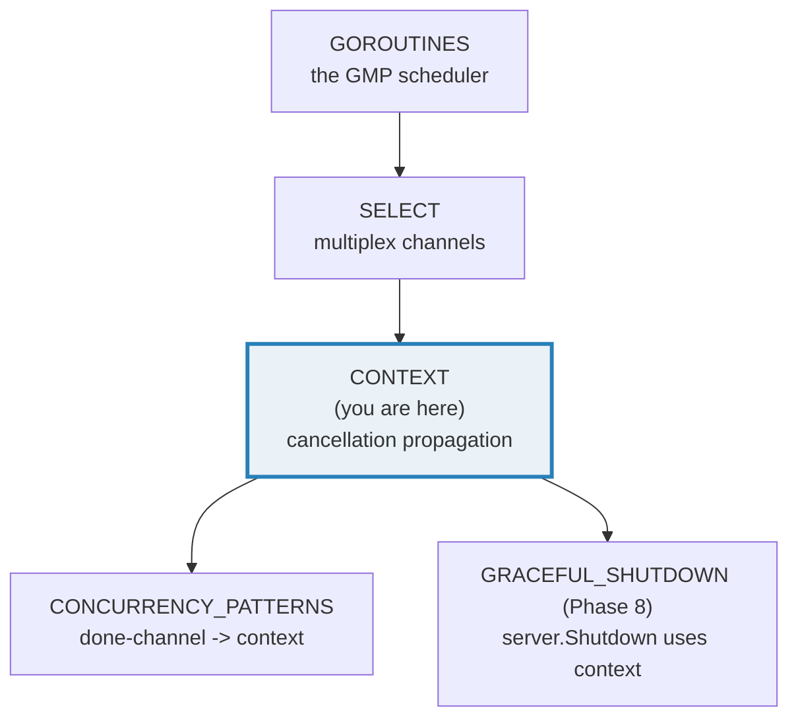
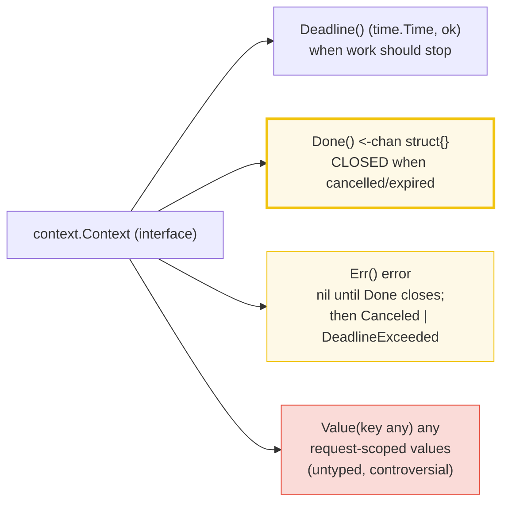
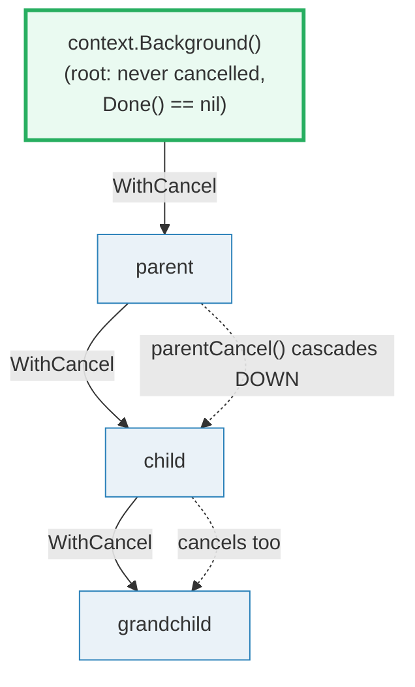
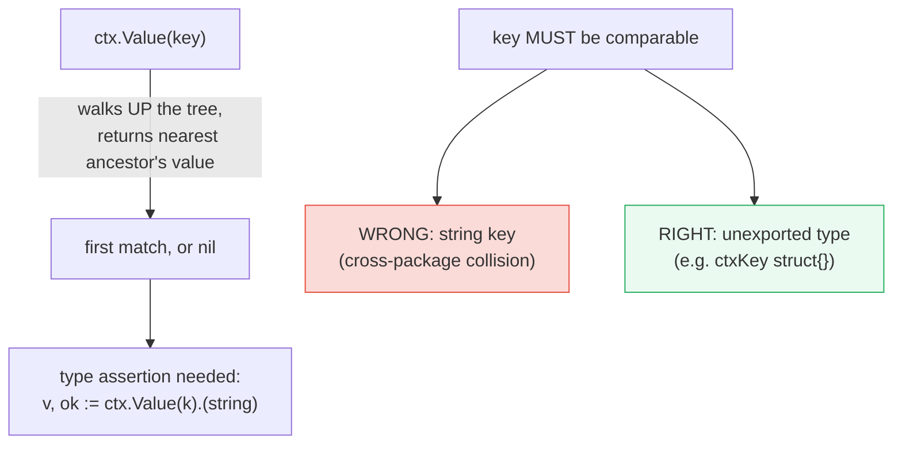

# CONTEXT — `context.Context`: Deadlines, Cancellation & Request-Scoped Values

> **Goal (one line):** show, by printing every behavior, how `context.Context`
> carries **deadlines**, **cancellation signals**, and **request-scoped values**
> across API/process boundaries, and how **cancellation propagates down the
> context tree**.
>
> **Run:** `go run context.go`
>
> **Ground truth:** [`context.go`](./context.go) → captured stdout in
> [`context_output.txt`](./context_output.txt). Every number/`Err()` code below
> is pasted **verbatim** from that file under a
> `> From context.go Section X:` callout. Nothing is hand-computed.
>
> **Prerequisites:** 🔗 [`GOROUTINES`](./GOROUTINES.md) (you must already
> understand `go` + `sync.WaitGroup`) and 🔗 [`SELECT`](./SELECT.md)
> (`ctx.Done()` is a channel you `select` on). 🔗 [`CHANNELS`](./CHANNELS.md)
> (closed channels are how "cancelled" is signalled) and 🔗 [`ERRORS`](./ERRORS.md)
> (`context.Canceled` / `context.DeadlineExceeded` *are* errors) are assumed.

---

## 1. Why this bundle exists (lineage)

`context.Context` exists to solve one problem that raw goroutines and channels
do not: **how do you tell a whole tree of work — fanning out across goroutines,
HTTP clients, DB queries — to *stop*?** Pre-`context` Go code passed a
hand-rolled `done <-chan struct{}` down every function. That worked, but it was
untyped, ad-hoc, and every library invented its own. The `context` package
(added in Go 1.7, distilled from `golang.org/x/net/context`) standardized that
pattern into a single interface that the **entire standard library** honors
(`net/http`, `database/sql`, `grpc`, …).



The headline idea: a `Context` is the **single cancellation/deadline/value
conduit that flows along the call chain.** You derive children from a parent;
cancelling the parent cancels *all* children. One `cancel()` call ripples through
a whole call tree — that cascade *is* the point of the package.

> From `pkg.go.dev/context` (Overview, verbatim): *"Package context defines the
> Context type, which carries deadlines, cancellation signals, and other
> request-scoped values across API boundaries and between processes."* And:
> *"When a Context is canceled, all Contexts derived from it are also
> canceled."*

---

## 2. The mental model: the `Context` interface and the tree

A `Context` is an interface with **four** methods. Two carry the cancellation
machinery (`Deadline`, `Done`, `Err` are really one feature in three parts), one
carries values (`Value`):



Contexts form a **tree** rooted at `context.Background()` (or the placeholder
`context.TODO()`). Every `WithCancel` / `WithDeadline` / `WithTimeout` /
`WithValue` call **derives a child** from a parent. Cancellation flows **down**
the tree; values are looked up by walking **up** the tree.



> From `pkg.go.dev/context` — `Background()`: *"returns a non-nil, empty Context.
> It is never canceled, has no values, and has no deadline. It is typically used
> by the main function, initialization, and tests, and as the top-level Context
> for incoming requests."* `TODO()`: *"returns a non-nil, empty Context. Code
> should use context.TODO when it's unclear which Context to use or it is not yet
> available."*

---

## 3. Section A — `Background`, `TODO` & the context tree (the roots)

> From `context.go` Section A:
> ```
> Background() == Background()? true   (same singleton, never cancelled)
> TODO()       == TODO()?       true   (same singleton, placeholder)
> Background().Done() == nil?  true   (Background can never be cancelled)
> TODO().Done()       == nil?  true   (TODO can never be cancelled either)
> child      Done() closed? false   Err() = <nil>   (live child)
> grandchild Done() closed? false   Err() = <nil>   (live grandchild)
> ```
> ```
> [check] Background() is the same singleton each call: OK
> [check] Background().Done() is nil (never cancellable): OK
> [check] TODO().Done() is nil (never cancellable): OK
> [check] live child: Done() not yet closed: OK
> [check] live child: Err() == nil: OK
> [check] live grandchild: Done() not yet closed: OK
> [check] live grandchild: Err() == nil: OK
> ```

**What to notice.** `Background()` returns the **same singleton** every call —
it is `==` to itself. More importantly, its `Done()` channel is **`nil`** (not
an open channel, not a closed one — `nil`). That is the documented contract:
*"Done may return nil if this context can never be canceled."* `Background` and
`TODO` can never be cancelled, so their `Done()` is `nil`. The practical
consequence (🔗 `SELECT`): **receiving from a `nil` channel blocks forever**, so
`select { case <-ctx.Done(): …; default: … }` on a `Background` context always
takes the `default` branch — exactly what you want for "this never fires."

**The live-context invariants** (asserted by every `check` above) are the ones
you must internalize: a fresh, not-yet-cancelled context has **`Done()` open**
(`doneClosed` returns `false`) and **`Err() == nil`**. Section B/D will flip
both.

---

## 4. Section B — `WithCancel`: `cancel()` closes `Done()`; `Err()` == `context.Canceled`

> From `context.go` Section B:
> ```
> before cancel: Done() closed? false   Err() = <nil>
> after  cancel: Done() closed? true   Err() = context canceled
> ```
> ```
> [check] before cancel: Done() not closed: OK
> [check] before cancel: Err() == nil: OK
> [check] after cancel: Done() closed: OK
> [check] after cancel: Err() == context.Canceled: OK
> [check] after cancel: ctx.Err() is exactly the context.Canceled sentinel: OK
> ```

**What.** `WithCancel(parent)` returns a derived context and a `CancelFunc`.
Calling `cancel()` does two things: it **closes** the `Done()` channel, and it
sets `Err()` to the sentinel `context.Canceled`.

> From `pkg.go.dev/context` — `WithCancel`: *"returns a derived context that
> points to the parent context but has a new Done channel. The returned
> context's Done channel is closed when the returned cancel function is called
> or when the parent context's Done channel is closed, whichever happens first.
> Canceling this context releases resources associated with it, so code should
> call cancel as soon as the operations running in this Context complete."*

**Why `defer cancel()` is mandatory.** This is the rule that `go vet`
enforces (the `lostcancel` analyzer). Every `WithCancel`/`WithDeadline`/
`WithTimeout` allocates a timer/goroutine bookkeeping entry and **registers the
child with its parent**. Calling `cancel()`:

1. closes `Done()` (so any `select` waiting on it unblocks),
2. removes the child from the parent's children list (stopping propagation
   bookkeeping), and
3. stops any associated deadline timer.

> From `pkg.go.dev/context` (Overview, verbatim): *"Calling the CancelFunc
> directly cancels the child and its children, removes the parent's reference to
> the child, and stops any associated timers. Failing to call the CancelFunc
> leaks the child and its children until the parent is canceled. The go vet tool
> checks that CancelFuncs are used on all control-flow paths."*

Forget the `defer cancel()` and you **leak goroutines/timers** until the parent
is cancelled — which, for a `Background`-rooted tree, is *never*. The bundle's
`.go` defers `cancel()` on **every** derived context, including the ones it then
cancels explicitly (calling `cancel` twice is a documented no-op: *"After the
first call, subsequent calls to a CancelFunc do nothing."*).

**The determinism discipline.** The `after cancel` line asserts the **error
code** (`context.Canceled`) and the **boolean** "is `Done()` closed." It never
asserts *how long* anything took. Timings are non-reproducible; `Err()` codes
are sentinels and are stable forever.

---

## 5. Section C — `WithTimeout` / `WithDeadline`: `Err()` == `context.DeadlineExceeded`

> From `context.go` Section C:
> ```
> WithTimeout(bg, short-fixed): Done() closed? true   Err() = context deadline exceeded
> WithDeadline(bg, now+short) : Done() closed? true   Err() = context deadline exceeded
> ```
> ```
> [check] WithTimeout: Done() closed after it fires: OK
> [check] WithTimeout: Err() == context.DeadlineExceeded: OK
> [check] WithDeadline: Done() closed after it fires: OK
> [check] WithDeadline: Err() == context.DeadlineExceeded: OK
> ```

**What.** `WithDeadline(parent, t)` takes an **absolute** `time.Time`; the
context auto-cancels when the wall clock reaches `t`. `WithTimeout(parent, d)`
takes a **relative** `time.Duration` and is literally defined as sugar:

> From `pkg.go.dev/context` — `WithTimeout`: *"WithTimeout returns
> `WithDeadline(parent, time.Now().Add(timeout))`."*

After the moment passes, `Done()` closes and `Err()` becomes the sentinel
`context.DeadlineExceeded` — *not* `context.Canceled`. That distinction matters:
it tells you *why* the work was abandoned (a deadline fired vs. an explicit
cancel), which is how you decide whether to retry.

**Why this bundle never prints a duration.** Section C uses a fixed short
timeout and then asserts `Err() == context.DeadlineExceeded` — the code, never
the elapsed milliseconds. The `WithTimeout(bg, short-fixed)` label is a literal
string, not a formatted `time.Duration`. This is what makes two `just out
context` runs byte-identical even though timeout firing is timing-dependent.
A common mistake in tests/tutorials is `if elapsed > 20*time.Millisecond`;
that flakes. Assert the `Err()` code and the `Done()` closure instead.

**The two sentinels, pinned:**

| State | `Done()` | `Err()` |
|---|---|---|
| live | open (or `nil` for Background/TODO) | `nil` |
| cancelled via `cancel()` | closed | `context.Canceled` |
| cancelled via deadline/timeout | closed | `context.DeadlineExceeded` |

> From `pkg.go.dev/context` — `var Canceled = errors.New("context canceled")` is
> *"the error returned by `Context.Err` when the context is canceled for some
> reason other than its deadline passing"*; `var DeadlineExceeded error = …` is
> *"the error returned by `Context.Err` when the context is canceled due to its
> deadline passing."*

---

## 6. Section D — Cancellation propagates down the tree (the core power)

> From `context.go` Section D:
> ```
> before: parent closed? false  child closed? false  grandchild closed? false
> after parentCancel: parent.Err()=context canceled  child.Err()=context canceled  grandchild.Err()=context canceled
> ```
> ```
> [check] before: parent not closed: OK
> [check] before: child not closed: OK
> [check] before: grandchild not closed: OK
> [check] parentCancel -> child Done() closed: OK
> [check] parentCancel -> grandchild Done() closed: OK
> [check] parentCancel -> child.Err() == context.Canceled: OK
> [check] parentCancel -> grandchild.Err() == context.Canceled: OK
> ```

**What.** The bundle builds a three-layer tree — `parent → child → grandchild`
— and cancels **only the parent**. The child and grandchild are cancelled as a
side effect, with no extra `cancel()` calls. This is the whole reason
`context.Context` exists: **one cancel cascades through the entire call tree.**

> From `pkg.go.dev/context` (Overview, verbatim): *"A Context is canceled to
> indicate that work done on its behalf should stop… When a Context is canceled,
> all Contexts derived from it are also canceled."*

**Why it's a tree, not a list.** Internally, each cancellable context holds a
reference to its parent and a list of its own children. When you call
`cancel()` on a node, the runtime closes *that* node's `Done()` channel and
recursively cancels every child in its children list. So a fan-out
(`Background → request → {DB query, HTTP call, log writer}`) can be torn down
with a single cancel at the request level — every leaf observes the cascade.

**The propagation guarantee is also a deadline guarantee.** If a parent has a
shorter deadline than a child, the **earlier** deadline wins. The bundle's
Section D only exercises explicit cancel; the same cascade fires when a
*parent's* deadline elapses (every child's `Err()` becomes
`DeadlineExceeded`, because that's the parent's reason).

---

## 7. Section E — Values: right (unexported key) vs wrong (string key)



> From `context.go` Section E:
> ```
> right: WithValue(bg, ctxKey{}, "req-123"); Value(ctxKey{}).(string) = "req-123", ok=true
> typed keys: Value(keyA(1))="a-val" ok=true   Value(keyB(1))="b-val" ok=true   (no collision)
> string key: outer role=admin, inner role=guest -> Value("role")="guest"   (nearest ancestor wins)
> note: go vet is silent here, but staticcheck/golint warn —
>       "should not use basic type string as key in context.WithValue".
> ```
> ```
> [check] right key: retrieved trace ID == "req-123": OK
> [check] right key: type assertion succeeded (ok==true): OK
> [check] typed keyA(1) retrieves a-val: OK
> [check] typed keyB(1) retrieves b-val: OK
> [check] string key shadowed: inner Value("role") == guest: OK
> [check] missing typed key returns nil (zero value): OK
> ```

**What.** `WithValue(parent, key, val)` returns a child carrying `val` under
`key`; `ctx.Value(key)` walks **up** the tree and returns the **nearest**
ancestor's value, or `nil`. Values are **not copied** — the same `val` (often a
pointer) is handed back, so mutation is visible everywhere (treat context
values as immutable).

**The right way — an unexported key type.** Define the key as a type nothing
outside your package can name:

```go
type ctxKey struct{}                           // unexported: unforgeable
ctx := context.WithValue(bg, ctxKey{}, "req-123")
v, ok := ctx.Value(ctxKey{}).(string)          // "req-123", true
```

The bundle then proves two **distinct** unexported types (`keyA` and `keyB`,
both `int`-based) never collide even when both hold the same integer `1`: the
type, not the value, is the key's identity.

**The wrong way — a plain string key.** It "works" (the run shows
`Value("role")` returning `"guest"`), but it has two failures:

1. **Cross-package collision.** If package A and package B both use the string
   `"role"`, they silently read/clobber each other's value — there is no
   namespace. With unexported types this is impossible (B cannot name A's
   `ctxKey`).
2. **Shadowing.** `Value` returns the *nearest* ancestor, so an inner
   `WithValue(ctx, "role", "guest")` shadows an outer `"role" = "admin"` — the
   bundle observes exactly this.

> From `pkg.go.dev/context` — `WithValue`: *"The provided key must be
> comparable and should not be of type string or any other built-in type to
> avoid collisions between packages using context. Users of WithValue should
> define their own types for keys."* And the `Context` interface doc: *"A key
> can be any type that supports equality; packages should define keys as an
> unexported type to avoid collisions."*

**The controversy (the expert payoff).** `Value` is the most criticized part of
the package, and for good reason:

- **It is untyped (`any`).** Every retrieval needs a type assertion
  (`v, ok := ctx.Value(k).(string)`); a wrong guess is a runtime `ok==false`,
  not a compile error. Hidden dependencies, no schema.
- **It hides parameters.** A function that secretly reads three values out of
  `ctx` has an invisible signature; readers and refactorers can't see the
  coupling.
- **`Value` walks the whole chain** on every lookup — `O(depth)`, with no
  indexing.

> From `pkg.go.dev/context` (Overview, verbatim): *"Use context Values only for
> request-scoped data that transits processes and APIs, not for passing optional
> parameters to functions."*

**The rule of thumb:** context values are for **cross-cutting, request-scoped
baggage** — a request/trace ID, a correlation ID, an authenticated principal
that must cross API boundaries. They are **never** a substitute for an explicit
function parameter. If a function *requires* a value to do its job, that value
belongs in the parameter list, not in `ctx`.

---

## 8. Section F — The `ctx`-first convention: `worker(ctx)` selects on `Done()`

> From `context.go` Section F:
> ```
> run 1 (cancelled before release):
>   worker-1 stopped: context canceled
>   worker-2 stopped: context canceled
>   worker-3 stopped: context canceled
> run 2 (never cancelled):
>   worker-1 ran to completion
>   worker-2 ran to completion
>   worker-3 ran to completion
> ```
> ```
> [check] run 1: all 3 workers stopped on cancel: OK
> [check] run 2: all 3 workers ran to completion: OK
> [check] run 1: ctx1.Err() == context.Canceled (we cancelled): OK
> [check] run 2: ctx2.Err() == nil (never cancelled): OK
> ```

**What.** The bundle's `worker` takes `ctx` as its **first parameter** (the
convention) and uses the canonical cancellation pattern — a `select` between
`ctx.Done()` and real work:

```go
func worker(ctx context.Context, id int, …) {
    …
    select {
    case <-ctx.Done():            // cancelled -> bail out
        out <- fmt.Sprintf("worker-%d stopped: %v", id, ctx.Err())
    default:                      // not cancelled -> do the work
        out <- fmt.Sprintf("worker-%d ran to completion", id)
    }
}
```

Run 1 cancels **before** releasing a start gate, so every worker observes a
closed `Done()` and stops with `ctx.Err() == context.Canceled`. Run 2 never
cancels, so every worker takes the `default` branch and completes. Both runs
collect results into a buffered channel and **sort** before printing, so the
output is byte-identical regardless of goroutine scheduling (🔗 `GOROUTINES`:
the same deterministic-collection discipline, applied here).

> From `pkg.go.dev/context` (Overview, verbatim): *"Do not store Contexts inside
> a struct type; instead, pass a Context explicitly to each function that needs
> it… The Context should be the first parameter, typically named ctx."*

**The convention, pinned.** `ctx context.Context` is the **first** parameter,
named `ctx`. It is **passed explicitly** down the call chain, never stored in a
struct (the narrow exception is a request-scoped request object). Never pass a
`nil` context — pass `context.TODO()` if you genuinely don't have one yet. And:
*"The same Context may be passed to functions running in different goroutines;
Contexts are safe for simultaneous use by multiple goroutines."* — Section F
passes one `ctx1` to three concurrent workers to prove it.

**This replaces the hand-rolled done-channel.** Before `context`, the pattern
was `func worker(done <-chan struct{}, …)` with a `select { case <-done: … }`.
That is *exactly* `ctx.Done()` — except `context` also gives you deadlines,
propagation, and values for free. See 🔗 `CONCURRENCY_PATTERNS` for the
done-channel version that `context` supersedes.

---

## 9. Pitfalls (the expert payoff)

| Trap | Symptom | Fix |
|---|---|---|
| Forgetting `defer cancel()` | goroutine/timer leak until parent cancels (forever for `Background`); `go vet` `lostcancel` error | Always `defer cancel()` immediately after `WithCancel`/`WithTimeout`/`WithDeadline`. Double-calling is a no-op. |
| Passing a `nil` context | runtime panic: `invalid memory address or nil pointer dereference` (most stdlib funcs panic on nil ctx) | Pass `context.TODO()` when you have no real context; never `nil`. |
| Storing a `Context` in a struct | hidden lifecycle, untestable, cancellation silently ignored | Pass `ctx` as the first parameter of the function that needs it; don't embed it. |
| Asserting elapsed time in tests | flaky tests (`if elapsed > 20ms` races the scheduler) | Assert `Err()` (`Canceled`/`DeadlineExceeded`) and `Done()` closure — never durations. |
| `ctx.Done()` is `nil` for `Background`/`TODO` | `select { case <-bg.Done(): }` blocks **forever** | Only select on `Done()` of a context derived via `WithCancel`/`WithTimeout`/`WithDeadline`; treat `nil` `Done()` as "never fires." |
| String (or built-in-type) context key | silent cross-package value collision / clobbering | Use an **unexported** key type (`type ctxKey struct{}`); provide type-safe `NewContext`/`FromContext` accessors. |
| Using `ctx.Value` for required params | invisible dependencies, untestable, runtime type-assert failures | `Value` is for request-scoped cross-cutting data (trace ID) only; required inputs are explicit parameters. |
| Ignoring the type assertion's `ok` | nil-deref / wrong-type panic when the key is absent | Always `v, ok := ctx.Value(k).(T)`; handle `ok == false`. |
| Parent deadline longer than child's | child's earlier deadline wins — easy to misread as "cancel didn't propagate" | The **earliest** deadline in the chain fires first; that's the contract, not a bug. |
| `cancel()` then immediately reading `Err()` without observing `Done()` | rare: the close of `Done()` "may happen asynchronously after the cancel function returns" | `<-ctx.Done()` (or select) to *observe* the close before relying on `Err()` in hot paths. |
| Assuming `WithCancel` returns a fresh independent timer to stop | resource still tied to parent | `cancel()` stops the *child's* timer and detaches from parent; the parent keeps its own. |

---

## 10. Cheat sheet

```go
// Roots
ctx := context.Background()   // never cancelled, no deadline, no values; top of a real tree
ctx := context.TODO()         // placeholder when you don't have a real ctx yet

// Derive a cancellable child — ALWAYS defer cancel()
ctx, cancel := context.WithCancel(parent)
defer cancel()                // releases resources + detaches from parent; double-call is a no-op

// Derive a deadline child — relative (WithTimeout) or absolute (WithDeadline)
ctx, cancel := context.WithTimeout(parent, 100*time.Millisecond); defer cancel()
ctx, cancel := context.WithDeadline(parent, time.Now().Add(d));  defer cancel()

// Observe cancellation — ctx.Done() is a <-chan struct{}; it is CLOSED on cancel/expire
select {
case <-ctx.Done():
    return ctx.Err()          // context.Canceled | context.DeadlineExceeded
case out <- work:
}

// Err(): nil while live; non-nil after Done() closes
//   context.Canceled           -> cancelled by cancel(), not a deadline
//   context.DeadlineExceeded   -> a deadline/timeout fired

// Propagation: cancelling a parent cancels ALL children (the tree). One cancel, whole call tree.

// Request-scoped values — unexported key type ONLY; never for required params
type ctxKey struct{}                                       // unforgeable from outside the package
ctx = context.WithValue(parent, ctxKey{}, "req-123")       // store
v, ok := ctx.Value(ctxKey{}).(string)                      // retrieve (typed, check ok)

// Convention: ctx is the FIRST parameter, named ctx; never store in a struct;
// never pass nil (use context.TODO()); safe for concurrent goroutines.
func DoSomething(ctx context.Context, arg Arg) error { … }
```

---

## Sources

Every signature, sentinel name, and behavioral claim above was verified against
the Go standard-library docs, the Go blog, and the memory model, then
corroborated by independent secondary sources:

- `context` package — https://pkg.go.dev/context
  - Overview (Context carries deadlines/cancellation/values; "When a Context is
    canceled, all Contexts derived from it are also canceled"; `CancelFunc`
    "cancels the child and its children, removes the parent's reference… stops
    any associated timers"; "Failing to call the CancelFunc leaks… The go vet
    tool checks that CancelFuncs are used on all control-flow paths"; rules:
    "Do not store Contexts inside a struct type… The Context should be the first
    parameter, typically named ctx"; "Do not pass a nil Context… Pass
    context.TODO"; "Use context Values only for request-scoped data…"; "Contexts
    are safe for simultaneous use by multiple goroutines"):
    https://pkg.go.dev/context#pkg-overview
  - `Background()` / `TODO()` ("never canceled… top-level Context" / "unclear
    which Context to use"): https://pkg.go.dev/context#Background
  - `WithCancel` ("has a new Done channel… closed when the returned cancel
    function is called or when the parent… whichever happens first"; "call cancel
    as soon as the operations… complete"):
    https://pkg.go.dev/context#WithCancel
  - `WithDeadline` ("deadline adjusted to be no later than d"):
    https://pkg.go.dev/context#WithDeadline
  - `WithTimeout` ("returns `WithDeadline(parent, time.Now().Add(timeout))`"):
    https://pkg.go.dev/context#WithTimeout
  - `CancelFunc` ("does not wait for the work to stop… may be called by multiple
    goroutines… After the first call, subsequent calls do nothing"):
    https://pkg.go.dev/context#CancelFunc
  - `Context` interface — `Done()` ("may return nil if this context can never be
    canceled"; "The close of the Done channel may happen asynchronously, after
    the cancel function returns"; select example), `Err()` ("If Done is not yet
    closed, Err returns nil… DeadlineExceeded if the context's deadline passed,
    or Canceled if… canceled for some other reason"), `Value()` ("A key can be
    any type that supports equality; packages should define keys as an
    unexported type to avoid collisions"):
    https://pkg.go.dev/context#Context
  - `WithValue` ("key must be comparable and should not be of type string or any
    other built-in type to avoid collisions… Users of WithValue should define
    their own types for keys"):
    https://pkg.go.dev/context#WithValue
  - `var Canceled` / `var DeadlineExceeded` (sentinel error docs):
    https://pkg.go.dev/context#pkg-variables
- Go Blog — *"Go Concurrency Patterns: Context"* (Sameer Ajmani): the canonical
  motivation for the package (server request cancellation, propagation, the
  done-channel it replaced):
  https://go.dev/blog/context
- Go Blog — *"Context and structs"* (Jonathan Amsterdam) — the rationale for the
  "do not store Contexts in a struct" rule: https://go.dev/blog/context-and-structs
- The Go memory model (happens-before via the close of a channel — why closing
  `Done()` is a visible cancellation signal across goroutines):
  https://go.dev/ref/mem
- Secondary corroboration (>=2 independent sources, web-verified):
  - Calhoun — *"Pitfalls of context values and how to avoid or mitigate them in
    Go"* (the untyped-value / hidden-dependency critique):
    https://www.calhoun.io/pitfalls-of-context-values-and-how-to-avoid-or-mitigate-them/
  - Boldly Go — *"Context value key collisions"* (string-key collision
    mechanism): https://boldlygo.tech/archive/2025-05-23-context-value-key-collisions/
  - Stack Overflow — *"Fix 'should not use basic type string as key in
    context.WithValue'"* (the staticcheck/golint `SA1029`-style warning this
    bundle reproduces): https://stackoverflow.com/questions/40891345

**Facts that could not be verified by running** (documented, not executed,
because they are static-analysis warnings or compile/runtime panics by design):
the `go vet` `lostcancel` analyzer rejecting a discarded `CancelFunc`; the
staticcheck/golint "should not use basic type string as key" warning; and the
nil-context panic. These are confirmed by the `pkg.go.dev/context` Overview and
the secondary sources cited above, not reproduced as runnable output (a file
triggering them would not pass `just check`).
