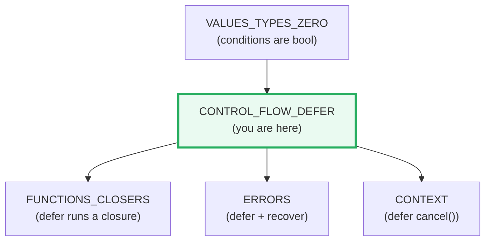
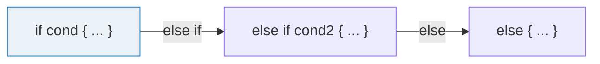
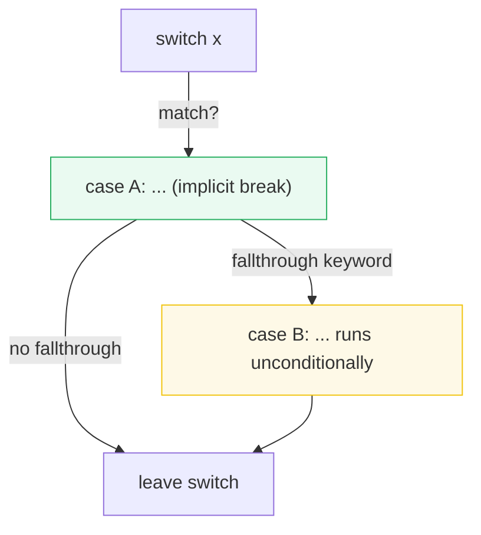
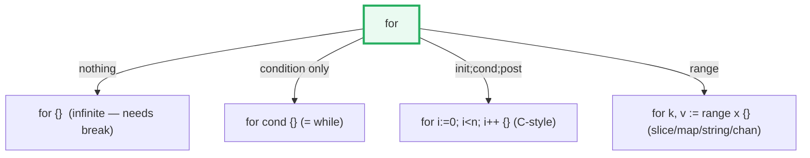
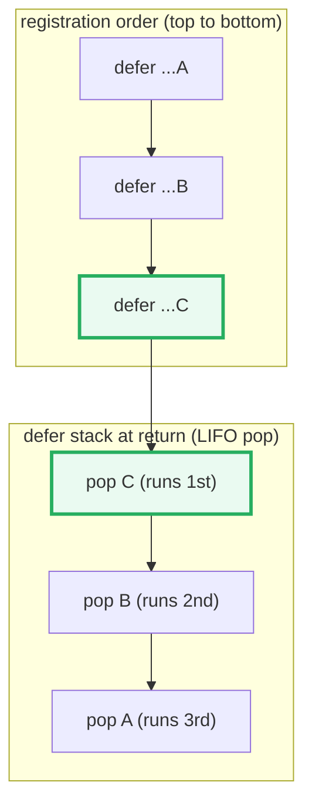
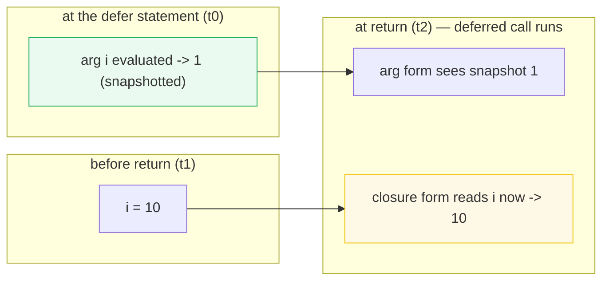
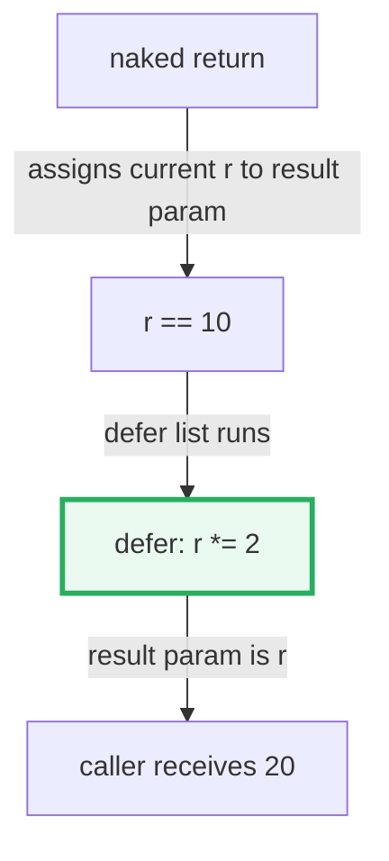

# CONTROL_FLOW_DEFER — Control Flow (`if`/`switch`/`for`) & the `defer` Mechanism

> **Goal (one line):** by printing every value, show how Go's control-flow
> statements and the `defer` mechanism actually behave — including the three
> defer rules that trip every Go newcomer.
>
> **Run:** `go run control_flow_defer.go`
>
> **Ground truth:** [`control_flow_defer.go`](./control_flow_defer.go) → captured
> stdout in [`control_flow_defer_output.txt`](./control_flow_defer_output.txt).
> Every number/table below is pasted **verbatim** from that file under a
> `> From control_flow_defer.go Section X:` callout. Nothing is hand-computed.
>
> **Prerequisites:** 🔗 [`VALUES_TYPES_ZERO`](./VALUES_TYPES_ZERO.md) — you must
> already know that conditions are strictly `bool` (no truthiness) before
> reading what an `if`/`switch`/`for` condition may be.

---

## 1. Why this bundle exists (lineage)

Go deliberately ships a **tiny** control-flow surface: `if`, `for`, `switch`,
`goto`, `goto`'s friends `break`/`continue` (optionally labeled), and `defer`.
There is **no `while`, no `do/while`, no `try/finally`**. Two choices do an
unusual amount of work:

1. **`for` is the only loop.** Go folded C's three loop spellings (`for`,
   `while`, `do/while`) into one keyword whose clause is optional in pieces.
   Fewer keywords, one mental model.
2. **`switch` does not fall through by default**, and **`defer`** replaces
   `try/finally` for cleanup. Together they remove the two most common sources
   of C/Java control-flow bugs (forgotten `break`, forgotten cleanup on an
   early `return`).

This bundle is the **control-flow foundation** that everything later builds on:

- 🔗 [`FUNCTIONS_CLOSURES`](./FUNCTIONS_CLOSURES.md) — `defer` runs a *closure*;
  the argument-vs-closure capture distinction (Section D) is a closure question.
- 🔗 [`ERRORS`](./ERRORS.md) — `defer` + `recover` is how Go turns a `panic`
  back into an `error`; and named-return + `defer` is the idiomatic place to
  wrap/annotate a returned `err`.
- 🔗 [`CONTEXT`](./CONTEXT.md) — `defer cancel()` is how you release a context's
  resources; the defer-in-loop trap (Section F) is exactly why you must not
  defer that inside a per-iteration loop.
- 🔗 [`TYPE_ASSERTIONS`](./TYPE_ASSERTIONS.md) — the type switch previewed in
  Section A is fully specified there.



---

## 2. `if` — no parentheses, braces mandatory



> From `go.dev/ref/spec` — *If statements*: "The expression x ... must be of
> boolean type." Unlike C/Java, the condition is **not** wrapped in `()`, and
> the braces `{ }` are **mandatory even for a single statement** — a braceless
> `if x { f(); g() }` reading only `f()` (the classic C/Java dangling-else /
> missing-brace bug) cannot be written in Go at all.

> From `control_flow_defer.go` Section A:
> ```
> if x > 5  -> taken  (no parens; braces required even for one stmt)
> sign: positive (n=15)
> ```

**The compile errors you cannot put in a runnable file** (documented, not run):

```go
if (x > 5) { }   // legal but unidiomatic: the parens are pointless, gofmt users drop them
if x > 5 f()     // COMPILE ERROR: expected {, found f (braces are mandatory)
if 1 { }         // COMPILE ERROR: non-bool used as if condition (no truthiness)
```

`else if` is just `else { if ... }` collapsed onto one line; the first `true`
branch wins and the rest are skipped.

---

## 3. `switch` — no automatic fallthrough, cases need not be constants

Go's `switch` is **inverted** relative to C/Java: **the default is to stop after
the matching case** (an implicit `break`), and you must write the `fallthrough`
keyword *explicitly* to continue. This kills the entire "forgotten `break`"
class of bugs.



> From `go.dev/wiki/Switch`: "Unlike C, ... execution does not fall into the
> next case. ... to fall through to a subsequent case, use the `fallthrough`
> keyword ... If you want to use multiple values in the same case, use a
> comma-separated list."

> From `control_flow_defer.go` Section A:
> ```
> switch (multi-value case): day=Wed -> midweek
> [check] Wed matched the Tue,Wed,Thu multi-value case: OK
> switch (no fallthrough): v=1 -> ran [one]  (case 2 did NOT run)
> [check] switch stopped after case 1 (no automatic fallthrough): OK
> switch (fallthrough): w=1 -> ran [one two]  (case 2 ran; case 3 did NOT)
> [check] fallthrough entered case 2 but not case 3: OK
> switch with no expr (true-switch): num=42 -> medium
> [check] true-switch picked medium: OK
> type switch: anyV="hello" -> kind=string  (see TYPE_ASSERTIONS)
> [check] type switch detected string: OK
> ```

**What to notice**

- **Cases are not constants.** `case num < 10:` is legal because case
  expressions are just expressions. A condition-less `switch { ... }` switches on
  `true` and is the idiomatic replacement for a long `if/else-if` chain (the
  `num=42 -> medium` line).
- **`fallthrough` does NOT re-test the next case.** It transfers control to the
  *next* clause unconditionally and must be the **last** statement of its clause.
  That is why `w=1` with `fallthrough` ran case 2 (`[one two]`) but not case 3 —
  `fallthrough` only steps forward *one* clause, it does not cascade.
- **Multi-value case** is `case "Tue", "Wed", "Thu":` — a comma-separated list.
  No `break` needed anywhere.
- **Type switch** `switch v := x.(type)` binds `v` to the concrete type inside
  each clause — the full `(type, value)` mechanism is in
  🔗 [`TYPE_ASSERTIONS`](./TYPE_ASSERTIONS.md).

---

## 4. `for` — the only loop, four forms

Go has **one** loop keyword. Four forms, all spelled `for`:



> From `go.dev/ref/spec` — *For statements*: "The `for` statement specifies
> repeated execution of a block. ... There are three forms: ... the condition
> may be omitted ... [yielding an infinite loop]; ... a single [condition] ...
> [and] a ... controlled loop ... with init, condition, and post statements."
> `for ... range x` is the fourth form (it iterates an array/slice/string/map/
> channel).

> From `control_flow_defer.go` Section B:
> ```
> (1) for {}            infinite loop: broke out at count=3
> [check] infinite loop ran until break: OK
> (2) for cond {}       while-style:   i=3
> [check] while-style loop reached 3: OK
> (3) for i;c;p {}      C-style:       4! = 24
> [check] C-style for computed 4! == 24: OK
> (4) for k,v := range  slice [10 20 30]: sum=60, index-sum=3
> [check] range slice summed values to 60: OK
> [check] range slice summed indices to 3 (0+1+2): OK
>     range string "Go": byte-offset=0 rune='G' (U+0047)
>     range string "Go": byte-offset=1 rune='o' (U+006F)
> ```
>
> *(1) `for {}` runs forever until a `break`. (2) `for cond {}` is Go's
> `while`. (3) `for init; cond; post {}` is the C-style loop, here computing
> 4! = 24. (4) `for k, v := range slice` yields `(index, value)` pairs; the
> value-sum is 60 (10+20+30) and the index-sum is 3 (0+1+2).*

**Expert detail — `range` over a string yields runes, not bytes.** Notice the
`range string "Go"` lines: the index is the **byte offset** of each *rune*
(0 and 1 here, but for multi-byte runes like `'世'` the index would jump by the
rune's UTF-8 width), and the second value is the **rune** itself
(`'G'` = U+0047, `'o'` = U+006F), not a `byte`. See
🔗 [`STRINGS_RUNES_BYTES`](./STRINGS_RUNES_BYTES.md). Dropping either the index
(`for _, v := range`) or the value (`for i := range`) is idiomatic and avoids
the "declared and not used" error.

---

## 5. Labeled `break`/`continue` — escaping a nested loop

A bare `break`/`continue` only affects the **innermost** loop. To control an
*outer* loop from inside a nested one, **label** it (an identifier followed by
`:`) and name the label on the `break`/`continue`.

> From `go.dev/ref/spec` — *Break statements* / *Continue statements*: "If
> there is a label, it must be that of an enclosing `for`, `switch`, or
> `select` statement, and that is the one whose execution is terminated"
> (`break`) or "advanced to the end of" (`continue`).

> From `control_flow_defer.go` Section C:
> ```
> labeled break: first even at grid[0][1] = 2
> [check] labeled break found grid[0][1] == 2: OK
> labeled continue: rows with even element-sum = [0 2]
> [check] labeled continue kept rows 0 and 2: OK
> ```

In the `break outer` demo, the first even number is `2` at `grid[0][1]`; a bare
`break` would have only exited the inner `c` loop and continued scanning rows.
For `continue rowLoop`, the row element-sums are 6 (even), 15 (odd), 24 (even),
so rows 0 and 2 are kept — `continue rowLoop` skips the `append` and restarts
the outer loop.

**Labels are rare in idiomatic Go.** Most nested-loop logic is clearer when you
extract the inner loop into its own function and `return` from it (the same fix
used for the defer-in-loop trap in Section F). Reach for a label only when a
helper function would be artificial.

---

## 6. `defer` — the three rules

`defer` schedules a function call to run when the **surrounding function
returns** (not at the end of the current block). It is Go's replacement for
`try/finally`: put `defer file.Close()` right next to `file.Open()` and the
close is guaranteed no matter which `return` you take. The Go blog states the
mechanism as **three rules**; this bundle pins each one.

> From the Go blog — *Defer, Panic, and Recover*:
> "A defer statement pushes a function call onto a list. The list of saved
> calls is executed after the surrounding function returns." The three rules:
> **(1)** "A deferred function's arguments are evaluated when the defer
> statement is evaluated." **(2)** "Deferred function calls are executed in
> Last In First Out order." **(3)** "Deferred functions may read and assign to
> the returning function's named return values."

### 6.1 Rule 2 — LIFO execution (the defer stack)



> From `control_flow_defer.go` Section D:
> ```
> defer LIFO: registered A,B,C -> ran as "CBA"  (last registered runs first)
> [check] defer LIFO order is CBA: OK
> ```

`lifoDemo` registers three closures that each append a letter at *run* time
(`A`, then `B`, then `C`). Because the defer stack is last-in-first-out, `C`
runs first and `A` runs last, so the built string is `"CBA"`. The Go blog's
canonical example `for i := 0; i < 4; i++ { defer fmt.Print(i) }` prints `3210`
by the same mechanism.

### 6.2 Rule 1 — arguments are evaluated at *defer* time (the snapshot)

This is the single most-misunderstood `defer` rule. The **arguments** to a
deferred call are computed **now**, when the `defer` statement executes; only
the **call body** runs later. Reassigning a variable *after* the `defer` has no
effect on what an **argument** sees — but it **does** affect what a **closure**
free variable sees.



> From `control_flow_defer.go` Section D:
> ```
> defer arg vs closure: i starts 1, then set to 10 before return
>     defer f(v int){v}    ARGUMENT  -> saw 1  (evaluated at defer time)
>     defer func(){ i }    CLOSURE   -> saw 10  (i read at run time)
> [check] defer arg snapshot captured 1 (not the later 10): OK
> [check] defer closure read i at run time (10): OK
> ```

The two forms look almost identical but behave oppositely:

```go
defer func(v int) { ... }(i)   // i is an ARGUMENT -> snapshot (sees 1)
defer func()    { ... i ... }()  // i is a free var -> read at run time (sees 10)
```

This is exactly why the loop-variable capture trap and the defer argument trap
get conflated. **Pre-Go-1.22**, a closure form `defer func(){ fmt.Println(i) }()`
inside a loop would capture the *shared* loop variable and print the final
value for every iteration. **Go 1.22+** made `for` loop variables per-iteration
(so each closure now captures its own `i`), but the **argument-vs-closure**
distinction itself is unchanged and eternal — see
🔗 [`FUNCTIONS_CLOSURES`](./FUNCTIONS_CLOSURES.md).

### 6.3 Rule 3 — deferred functions may mutate **named** return values



> From `control_flow_defer.go` Section E:
> ```
> double(): r=10; defer r*=2; return -> 20  (defer ran after return value was set)
> [check] named return mutated by defer: 10*2 == 20: OK
> ```

A **named** result (`func double() (r int)`) is a real variable the deferred
function can both read and write. The execution order is: (1) the `return`
statement assigns its operands to the result parameters (a naked `return` leaves
`r` at its current value, 10); (2) the deferred functions run and may **mutate**
`r` (here doubling it to 20); (3) the final value of `r` is what the caller
receives.

**This only works for named returns.** With `func double() int`, the deferred
function has no name to bind to — the return value is anonymous storage the
defer cannot reach. The real-world payoff is **error patching**: declare
`(err error)`, `defer func() { if err != nil { err = wrap(err) } }()`, and every
return path gets the same wrapping for free. (See 🔗 [`ERRORS`](./ERRORS.md).)

---

## 7. THE trap: `defer` in a loop accumulates

Because a deferred call does not run until the **enclosing function** returns,
deferring inside a loop pushes **N** calls onto the stack that **none** of which
fires until the loop's *function* returns. For a resource (`file.Close`,
`mu.Unlock`, a context `cancel`), that means **nothing is released mid-loop** —
a leak that scales with iteration count.

> From the Stack Overflow / Go community consensus on *defer in a loop*:
> "Use an anonymous or named function inside the loop body, and inside that,
> use defer. It will be executed before the next iteration." (JetBrains
> `GoDeferInLoop` inspection: "Using defer in loops can lead to resource leaks
> or unpredictable execution.")

> From `control_flow_defer.go` Section F:
> ```
> Deferring inside a loop pushes N calls onto the defer stack; NONE of them
> runs until the ENCLOSING function returns. For resources (files, locks,
> connections) that is a leak — nothing is released mid-loop.
>   [trap] defers fired DURING loop = 0, at return = 4  (pile-up: all held to the end)
>   [safe] defers fired DURING loop = 4, at return = 4  (per-iteration: nothing pending)
> [check] trap: 0 defers fired during the loop (the pile-up): OK
> [check] safe: all 4 defers fired during the loop (per-iteration): OK
> ```

The two functions both eventually fire 4 defers — but **when** is the whole
point. `processAllBad` snapshots `0` defers-fired *during* the loop (all 4 pile
up and fire only at the single `return`); `processAllGood` wraps the body in
`handleItem`, so each `defer` is scoped to one iteration and `4` have already
fired by the time the loop ends. The fix is always one of:

1. **Wrap the loop body in its own function** and `defer` inside it (the pattern
   shown here) — the defer runs at the end of *each iteration*.
2. **Close immediately, without `defer`**, when the resource's lifetime is the
   iteration, not the function.

---

## 8. Pitfalls (the expert payoff)

| Trap | Symptom | Fix |
|---|---|---|
| `if x` where `x` is `int`/`error` | Compile error: non-bool condition | Write the explicit test: `if x != 0`, `if err != nil`. |
| Braceless `if`/`for` (`if x f()`) | Compile error: expected `{` | Braces are mandatory even for one statement. |
| Expecting `switch` to fall through | Next case silently does NOT run | That is by design; add an explicit `fallthrough` (last stmt of clause). |
| `fallthrough` expecting a re-test | It runs the next clause **unconditionally** | `fallthrough` does not check the next case's value; it transfers blindly. |
| `defer f(i)` vs `defer func(){ f(i) }()` confusion | Different values printed | Argument = snapshot at defer time; closure free var = read at run time. |
| Capturing loop var in a `defer` closure (pre-1.22) | Every defer prints the final value | Go 1.22+ per-iteration vars fix this; pass the value as an argument to be explicit. |
| Mutating an **unnamed** return via `defer` | The deferred func can't see the return | Name the return: `func f() (r int)`; only named returns are reachable. |
| `defer` inside a loop | Resource leak: nothing released mid-loop | Wrap the body in a function (defer scoped per iteration) or close without defer. |
| `defer` in the hot path of a tight loop | Allocation overhead (pre-1.14 deferred funcs escaped) | Go 1.14+ open-coded defers removed most cost; still avoid defer-in-loop for resources. |
| Bare `break`/`continue` in a nested loop | Only the innermost loop is affected | Label the outer loop and `break outer`/`continue outer`. |
| `range` over a string expecting bytes | You get `rune` + byte-offset | `range` decodes UTF-8; index jumps by rune width. See STRINGS_RUNES_BYTES. |

---

## 9. Cheat sheet

```go
// if — no parens, braces mandatory, condition must be bool
if x > 0 { ... } else if x == 0 { ... } else { ... }

// switch — NO automatic fallthrough; cases need not be constants
switch v {
case 1, 2, 3:  // multi-value (comma list); implicit break after
	fallthrough   // forces the NEXT clause unconditionally (last stmt only)
case 4:
default:
}
switch {        // no expr -> switches on true (clean if/else-if)
case x < 10: ...
}
switch t := v.(type) {   // type switch (see TYPE_ASSERTIONS)
case int: ...
}

// for — the ONLY loop; four forms
for { ... }                  // infinite (needs break)
for cond { ... }             // = while
for i := 0; i < n; i++ {}    // C-style
for k, v := range x { ... }  // slice/map/string/chan (index/rune optional)

// labeled break/continue (escape an outer loop)
outer:
	for { for { break outer } }   // label must enclose the for/switch/select

// defer — three rules
defer f(arg)        // (1) arg evaluated NOW (snapshot), call runs LATER
defer g(); defer h()// (2) run LIFO: h runs before g at return
func f() (r int) {  // (3) a deferred func may mutate NAMED returns
	r = 10; defer func() { r *= 2 }(); return  // returns 20
}
// NEVER defer in a loop unless wrapped in a per-iteration function (leak).
```

---

## Sources

Every signature, rule, and behavioral claim above was verified against the Go
specification, the Go blog, and corroborating references:

- The Go Programming Language Specification — https://go.dev/ref/spec
  (language version go1.26)
  - *If statements* (condition "must be of boolean type", braces mandatory): https://go.dev/ref/spec#If_statements
  - *Switch statements* (no automatic fallthrough; expression & type switches): https://go.dev/ref/spec#Switch_statements
  - *Fallthrough statements*: https://go.dev/ref/spec#Fallthrough_statements
  - *For statements* (the only loop; three forms + range): https://go.dev/ref/spec#For_statements
  - *For statements / Range clause* (rune + byte-offset over strings): https://go.dev/ref/spec#For_statements
  - *Break statements* / *Continue statements* (labels enclose for/switch/select): https://go.dev/ref/spec#Break_statements
  - *Defer statements* (arguments evaluated at defer; LIFO; named-return access): https://go.dev/ref/spec#Defer_statements
  - *Return statements* / *Terminating statements* (result parameters and defer ordering): https://go.dev/ref/spec#Return_statements
- Go Blog — *Defer, Panic, and Recover* (Andrew Gerrand, 2010), the canonical
  statement of the **three defer rules** (arg-eval-at-defer, LIFO,
  named-return mutation): https://go.dev/blog/defer-panic-and-recover
- Go Wiki — *Switch* (no fallthrough by default; multi-value `case a, b, c:`;
  `fallthrough` keyword): https://go.dev/wiki/Switch
- A Tour of Go — *Defer* ("The deferred call's arguments are evaluated
  immediately"): https://go.dev/tour/flowcontrol/12
- Effective Go — *Control structures* / *Defer*: https://go.dev/doc/effective_go
- Community corroboration of the defer-in-loop resource leak and the
  "wrap the body in a function" fix: https://stackoverflow.com/questions/45617758
  and the JetBrains `GoDeferInLoop` inspection
  (https://www.jetbrains.com/help/inspectopedia/GoDeferInLoop.html).

**Facts that could not be verified by running** (documented, not executed,
because they are compile errors by design): braceless `if`/`for`, and a non-bool
`if` condition are all rejected by the compiler. These are confirmed by the spec
sections cited above, not reproduced as runnable output (a file containing them
would not build).
