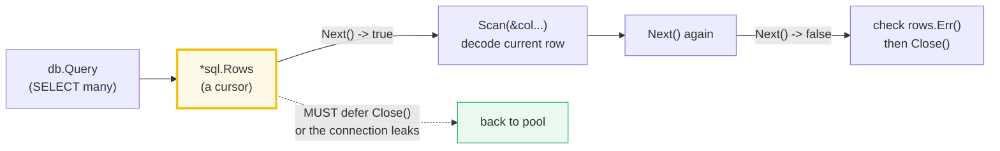
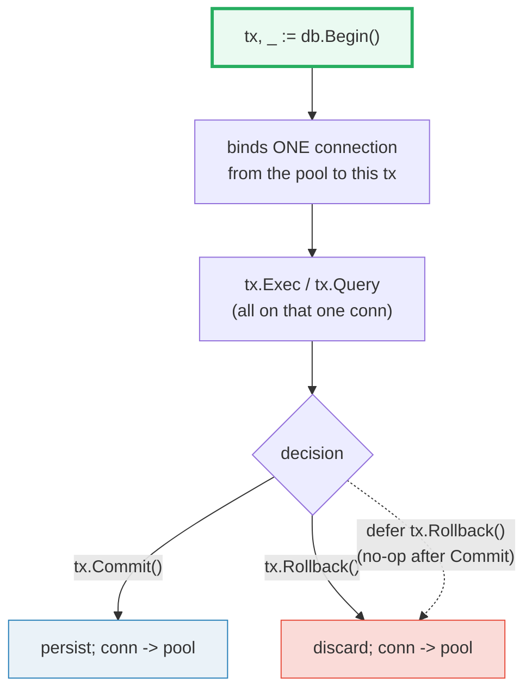
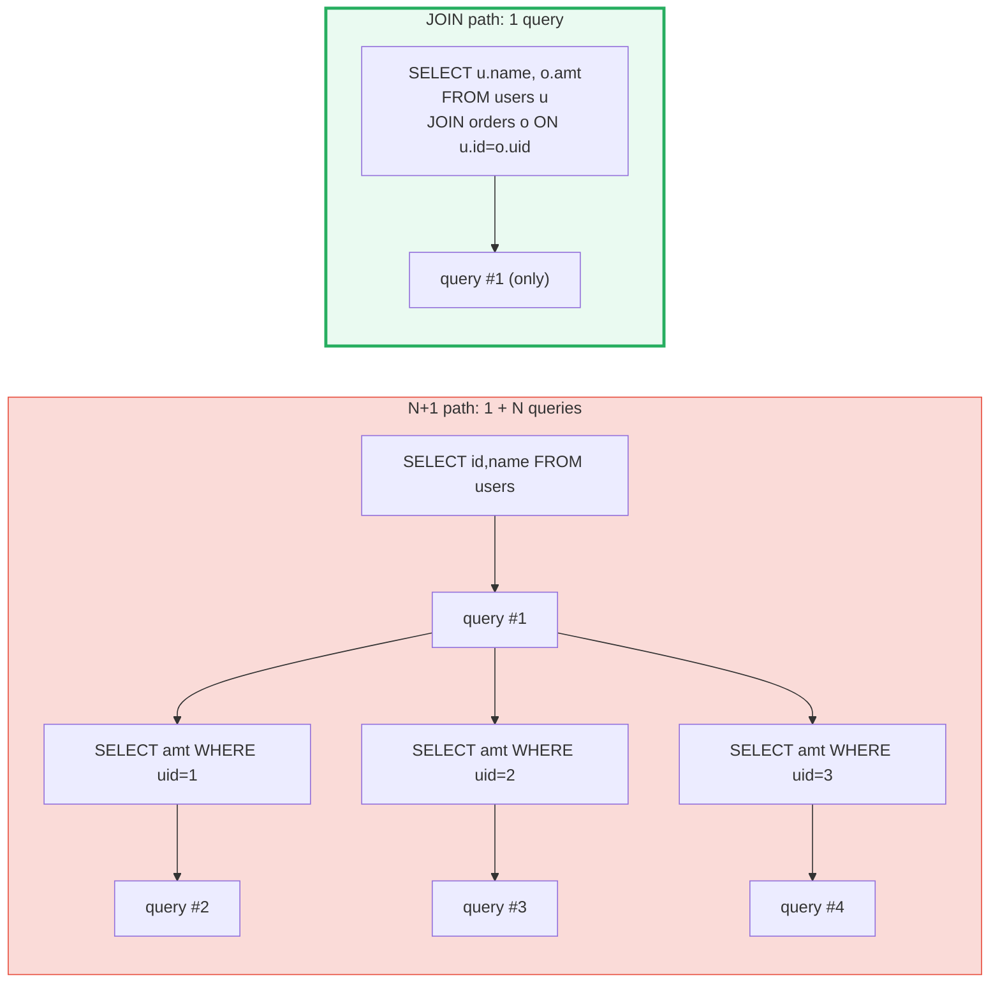

# DATABASE_SQL — The Driver-Agnostic SQL Interface, Pool & Transactions

> **Goal (one line):** show, by printing every behavior, how Go's `database/sql`
> package exposes a **driver-agnostic connection pool**, runs queries/prepared
> statements, handles **NULL**, manages **transactions**, and how the **N+1
> problem** is killed by a JOIN — all against an in-memory SQLite database,
> fully offline and deterministic.
>
> **Run:** `go run database_sql.go`
>
> **Ground truth:** [`database_sql.go`](./database_sql.go) → captured stdout in
> [`database_sql_output.txt`](./database_sql_output.txt). Every row count, error
> code, and scanned value below is pasted **verbatim** from that file under a
> `> From database_sql.go Section X:` callout. Nothing is hand-computed.
>
> **Prerequisites:** 🔗 [`ERRORS`](./ERRORS.md) (`sql.ErrNoRows` is a sentinel
> error you test with `errors.Is`) and 🔗 [`INTERFACES_BASICS`](./INTERFACES_BASICS.md)
> (the driver plugs in *through* an interface — `database/sql/driver.Driver`).
> 🔗 [`CONTEXT`](./CONTEXT.md) is assumed for the `…Context` variants.

---

## 1. Why this bundle exists (lineage)

`database/sql` was designed around one principle: **your application code should
never import a database vendor's package.** The standard library ships with
**zero** database drivers — on purpose. Instead it defines a *generic* interface
(`*sql.DB`, `Query`, `Exec`, …) and a *separate* `database/sql/driver` package
that driver authors implement. A driver registers itself by name; your code
calls `sql.Open("<driverName>", "<dsn>")` and from then on talks **only** to
`database/sql`. Swap Postgres for MySQL for SQLite and **not one line of your
query code changes** — only the driver name and the connection string.

```mermaid
graph TD
    APP["your code<br/>import \"database/sql\""] -->|"sql.Open(\"sqlite\", \":memory:\")<br/>sql.Query / Exec / Prepare"| DB["*sql.DB<br/>the CONNECTION POOL"]
    DB -->|"hands work to a<br/>registered driver"| REG["sql.Drivers()<br/>name -> driver.Driver"]
    REG --> DRV["glebarez/go-sqlite<br/>pure-Go SQLite<br/>sql.Register(\"sqlite\", ...)"]
    style DB fill:#eafaf1,stroke:#27ae60,stroke-width:3px
    style REG fill:#fef9e7,stroke:#f1c40f
    style DRV fill:#eaf2f8,stroke:#2980b9
    style APP fill:#eaf2f8,stroke:#2980b9
```

This is the 🔗 [`EMBEDDING_COMPOSITION`](./EMBEDDING_COMPOSITION.md) idea at the
package boundary: the *abstraction* (`database/sql`) and the *implementation*
(the driver) are decoupled by an interface (`driver.Driver`). The bundle imports
the pure-Go driver **only for its `init()` side effect** (`sql.Register`); every
call below is standard-library `database/sql`. Higher-level wrappers build on
exactly this layer — see 🔗 [`SQLX_GORM`](./SQLX_GORM.md).

> From `pkg.go.dev/database/sql` (Overview, verbatim): *"Package sql provides a
> generic interface around SQL (or SQL-like) databases. The sql package must be
> used in conjunction with a database driver."* And from `database/sql/driver`:
> *"Package driver defines interfaces to be implemented by database drivers as
> used by package sql. Most code should use the database/sql package."*

> From `pkg.go.dev/database/sql` — `Register`: *"Register makes a database
> driver available by the provided name. If Register is called twice with the
> same name or if driver is nil, it panics."* And `Drivers`: *"Drivers returns a
> sorted list of the names of the registered drivers."*

---

## 2. The mental model: `*sql.DB` is a pool, not a connection

The single most misunderstood thing about `database/sql` is that **`sql.Open`
returns a `*sql.DB`, and a `*sql.DB` is a connection POOL, not one connection.**
The pool lazily opens connections on demand, hands them out per query, and
returns them to an idle list when you `Close()` the rows. You tune the pool with
three knobs.

```mermaid
graph TD
    OPEN["sql.Open(\"sqlite\", \":memory:\")<br/>does NOT connect yet"] --> DB["*sql.DB<br/>(the POOL)"]
    DB -->|"SetMaxOpenConns(n)<br/>cap concurrent connections"| MX["max open"]
    DB -->|"SetMaxIdleConns(n)<br/>cap idle keep-alive"| ID["idle list"]
    DB -->|"SetConnMaxLifetime(d)<br/>recycle stale conns"| LT["max age"]
    DB -->|"first query / Ping"| C1["conn #1"]
    DB -->|"concurrent query"| C2["conn #2"]
    DB -->|"concurrent query"| CN["conn #N"]
    C1 -.->|"Close() rows -><br/>back to idle list"| DB
    style DB fill:#eafaf1,stroke:#27ae60,stroke-width:3px
    style OPEN fill:#fef9e7,stroke:#f1c40f
```

> From `pkg.go.dev/database/sql` — `DB`: *"DB is a database handle representing
> a pool of zero or more underlying connections. It's safe for concurrent use by
> multiple goroutines. The sql package creates and frees connections
> automatically; it also maintains a free pool of idle connections."* And
> `Open`: *"Open may just validate its arguments without creating a connection
> to the database. To verify that the data source name is valid, call
> DB.Ping."*

**The value-vs-pointer axis (🔗 `POINTERS`).** Every handle the package hands
you — `*sql.DB`, `*sql.Tx`, `*sql.Stmt`, `*sql.Rows`, `*sql.Row`, `*sql.Conn` —
is a **pointer**. You never copy a `DB`; you share one long-lived `*sql.DB`
across goroutines (the pool is concurrency-safe by contract). Conversely,
`Scan` takes **pointers to YOUR variables** (`&name`) because it *writes
through* them — the driver decodes the column into the address you give it.
`sql.NullString` is a **value type** (`String string; Valid bool`); you pass
`&ns` so Scan can set both fields.

---

## 3. Section A — Open, driver, pool, Ping, CREATE TABLE, INSERT

> From `database_sql.go` Section A:
> ```
> sql.Drivers() = [sqlite]   (the "sqlite" driver is registered)
> db.Driver() type = *sqlite.Driver   (non-nil? true)
> db.Stats().MaxOpenConnections = 5   (reflects SetMaxOpenConns(5))
> db.Ping() err = <nil>   (nil == connection established on demand)
> CREATE TABLE -> err = <nil>   (schema OK)
> INSERT Alice -> LastInsertId = 1, RowsAffected = 1
> ```
> ```
> [check] sql.Drivers() contains "sqlite": OK
> [check] db.Driver() is non-nil: OK
> [check] SetMaxOpenConns(5) reflected in Stats: OK
> [check] db.Ping() returned no error: OK
> [check] INSERT Alice RowsAffected == 1: OK
> [check] INSERT Alice LastInsertId == 1: OK
> ```

**What.** The blank import `_ "github.com/glebarez/sqlite"` runs the driver's
`init()`, which calls `sql.Register("sqlite", …)`. After that `sql.Drivers()`
returns `["sqlite"]` (sorted), and `sql.Open("sqlite", ":memory:")` succeeds.
`db.Driver()` returns the concrete `driver.Driver` behind the handle
(`*sqlite.Driver`) — proving the pool is bound to a real implementation.

**Why Open does not connect.** `Open` "may just validate its arguments without
creating a connection." The first real connection is opened lazily — on the
first query, or eagerly by `Ping`. The bundle calls `Ping` explicitly (the
idiomatic startup check) and asserts `err == <nil>`. **`db.Stats()`** exposes a
`DBStats` snapshot; only `MaxOpenConnections` is a deterministic reflection of
your `SetMaxOpenConns` setting — the live counters (`OpenConnections`, `InUse`,
`Idle`, wait counts) vary with timing, so the bundle prints only
`MaxOpenConnections`.

> From `pkg.go.dev/database/sql` — `SetMaxOpenConns`: *"SetMaxOpenConns sets the
> maximum number of open connections to the database."* `SetMaxIdleConns`: *"sets
> the maximum number of connections in the idle connection pool."* `Ping`:
> *"Ping verifies a connection to the database is still alive, establishing a
> connection if necessary."*

**Exec returns a `Result`** with two methods: `LastInsertId()` and
`RowsAffected()`. The bundle's `INSERT Alice` yields `LastInsertId=1,
RowsAffected=1`. Note `CREATE TABLE` reports no error and (for SQLite) a
`RowsAffected` of 0 — schema statements don't carry row counts.

---

## 4. Section B — Query / Next / Scan loop (sorted, defer Close)



> From `database_sql.go` Section B:
> ```
> SELECT name FROM users ORDER BY name -> [Alice Bob Carol]
> ```
> ```
> [check] sorted names == [Alice Bob Carol]: OK
> [check] exactly 3 rows scanned: OK
> ```

**What.** `db.Query` returns `(*sql.Rows, error)`. `Rows` is a **cursor**: you
advance it with `Next()` (returns `false` at EOF), decode each row with
`Scan(&dest...)`, and **must `Close()` it** when done — closing the rows is what
returns the connection to the pool.

**Why `ORDER BY` is mandatory for stable output.** SQL makes **no guarantee**
about row order without an `ORDER BY` clause. A query that *happens* to come
back in insertion order today may not tomorrow (different plans, concurrent
writes, vacuum). This is the SQL analogue of the 🔗 `MAPS` "iteration is
randomized" rule: **never print unsorted query results.** The bundle uses
`ORDER BY name ASC` in SQL (the cleanest fix); the alternative is to collect
into a slice and `slices.Sort` in Go.

**The two-loop-end trap.** `Next()` returning `false` means *either* "no more
rows" *or* "an error occurred mid-iteration." You distinguish them by checking
`rows.Err()` **after** the loop — a non-nil `Err()` means the iteration aborted.
The bundle asserts `rows.Err()` is nil. Forgetting `defer rows.Close()` leaks
the connection (the pool can't reclaim it); forgetting `rows.Err()` silently
swallows a query that died halfway.

---

## 5. Section C — QueryRow + `sql.ErrNoRows` (`errors.Is`)

> From `database_sql.go` Section C:
> ```
> QueryRow(id=1) -> name="Alice", err=<nil>
> QueryRow(id=999) -> err="sql: no rows in result set", errors.Is(err, sql.ErrNoRows)=true
> ```
> ```
> [check] existing id scanned name == Alice: OK
> [check] missing id -> errors.Is(err, sql.ErrNoRows): OK
> [check] missing id err text == "sql: no rows in result set": OK
> [check] sql.ErrNoRows is the exact sentinel: OK
> ```

**What.** `db.QueryRow` is the single-row shortcut: it returns a `*sql.Row`
(not `(row, err)`) and **defers any error until `Scan`**. When the query matches
a row, `Scan` decodes it; when it matches **zero** rows, `Scan` returns the
sentinel `sql.ErrNoRows`.

> From `pkg.go.dev/database/sql` — `ErrNoRows`: *"ErrNoRows is returned by
> Row.Scan when DB.QueryRow doesn't return a row. In such a case, QueryRow
> returns a placeholder *Row value that defers this error until a Scan."*

**Why `errors.Is` and not `==`.** `sql.ErrNoRows` is defined as
`var ErrNoRows = errors.New("sql: no rows in result set")` — a sentinel value.
Today `err == sql.ErrNoRows` works, but the 🔗 `ERRORS` discipline is to test
sentinels with `errors.Is(err, sql.ErrNoRows)` so the check still holds if a
wrapper (`fmt.Errorf("…: %w", err)`) ever wraps it. The bundle asserts both the
identity (`errors.Is` == true) and the literal text, pinning the exact string
`"sql: no rows in result set"`.

**The deferred-error subtlety.** Because `QueryRow` never returns an error
itself, the trap is writing `row := db.QueryRow(…)` and **never calling
`Scan`** — the error (including a real query error) is then silently dropped.
Always `Scan`.

---

## 6. Section D — Prepared statements (parameterize, reuse)

```mermaid
graph TD
    P["db.Prepare(\"INSERT ... VALUES (?, ?)\")"] --> ST["*sql.Stmt<br/>(parsed once, reusable)"]
    ST -->|"stmt.Exec(\"Dave\", \"d@x\")"| E1["bind params -> exec"]
    ST -->|"stmt.Exec(\"Eve\", \"e@x\")"| E2["bind params -> exec"]
    ST -->|"stmt.Exec(\"Frank\", \"f@x\")"| E3["bind params -> exec"]
    ST -.->|"defer stmt.Close()"| DONE["release"]
    style ST fill:#fef9e7,stroke:#f1c40f,stroke-width:3px
```

> From `database_sql.go` Section D:
> ```
> prepared INSERT x3 -> COUNT(*) = 3
> parameterized WHERE name=? with hostile input -> errors.Is(ErrNoRows)=true (treated as literal, no injection)
> parameterized WHERE name=? 'Eve' -> "Eve"
> ```
> ```
> [check] 3 prepared inserts -> COUNT(*) == 3: OK
> [check] hostile input matched no row (no injection): OK
> [check] parameterized lookup of 'Eve' works: OK
> ```

**What.** `db.Prepare(query)` parses the SQL once and returns a `*sql.Stmt` you
`Exec`/`Query` repeatedly with different `?`-placeholder args. `stmt.Close()`
releases it. The bundle prepares one `INSERT … VALUES (?, ?)` and runs it three
times.

**Why parameterization is non-negotiable (SQL injection).** Placeholders make
values **data, never SQL**. The bundle proves it: the hostile string
`Eve' OR '1'='1` is matched **as a literal name** — it finds no row
(`errors.Is(ErrNoRows)==true`), it does **not** break out and return every user.
Had the query been built by string concatenation
(`"WHERE name = '" + input + "'"`), that same input would have appended
`OR '1'='1` and leaked the whole table. **Always parameterize; never
`fmt.Sprintf` user values into SQL.**

---

## 7. Section E — NULL columns → `sql.NullString`

> From `database_sql.go` Section E:
> ```
> Alice email -> NullString{String:"alice@x.com", Valid:true}
> Bob   email -> NullString{String:"", Valid:false}   (NULL)
> ```
> ```
> [check] Alice email Valid == true: OK
> [check] Alice email String == alice@x.com: OK
> [check] Bob email Valid == false (NULL): OK
> [check] Bob email String == "" when NULL: OK
> ```

**What.** A nullable column **cannot** scan into a plain `string`/`int` — a NULL
yields a scan error. The package provides `sql.NullString`, `sql.NullInt64`,
`sql.NullBool`, `sql.NullTime`, … (and a generic `sql.Null[T]` since Go 1.22).
Each is a `{Value, Valid}` pair: `Valid` is `false` exactly when the column was
NULL.

> From `pkg.go.dev/database/sql` — `NullString`: *"NullString represents a
> string that may be null… if s.Valid { // use s.String } else { // NULL
> value }."* The struct: `Valid bool // Valid is true if String is not NULL`.

**The classic bug the bundle pins.** Alice's email scans to
`{String:"alice@x.com", Valid:true}`; Bob's NULL email scans to
`{String:"", Valid:false}`. Notice the **`String` field is `""` when NULL** —
it is the zero value of `string`, **not** a sentinel you can distinguish from a
real empty string. **That is why `Valid` exists.** Checking only `ns.String ==
""` would conflate a genuine empty value with NULL. The alternative to
`NullString` is a pointer destination (`*string`), which scans `nil` for NULL.

---

## 8. Section F — Transactions: Begin / Commit / Rollback



> From `database_sql.go` Section F:
> ```
> rollback path: before=3, during-tx=4, after-Rollback=3
> commit path:   before=3, after-Commit=5
> ```
> ```
> [check] before transaction COUNT(*) == 3: OK
> [check] during tx COUNT(*) == 4 (sees uncommitted row): OK
> [check] after Rollback COUNT(*) == 3 (insert discarded): OK
> [check] after Commit COUNT(*) == 5 (two inserts persisted): OK
> ```

**What.** `db.Begin()` starts a transaction and returns a `*sql.Tx`. **A
transaction is bound to a single connection** for its lifetime — that is the
only way the package guarantees per-connection state (like transaction scope) is
visible. All `tx.Exec`/`tx.Query` calls run on that one connection. `tx.Commit()`
persists and returns the connection to the pool; `tx.Rollback()` discards.

**Why defer a Rollback.** The idiomatic pattern is:

```go
tx, _ := db.Begin()
defer func() { _ = tx.Rollback() }()   // safety net
// ... tx.Exec ... possibly panics ...
must(tx.Commit())                      // on success: persist
// the deferred Rollback now runs but is a documented NO-OP after Commit
```

If anything between `Begin` and `Commit` fails or panics, the deferred
`Rollback` aborts the transaction cleanly. If you reach `Commit`, the deferred
`Rollback` is harmless — `database/sql` documents that calling `Rollback` after
`Commit` (or `Rollback`) returns `sql.ErrTxDone` and does nothing. The bundle
exercises both paths: the rollback path inserts a row (seen as `during-tx=4`)
then discards it (`after-Rollback=3`); the commit path inserts two and persists
(`after-Commit=5`).

**The "during-tx sees uncommitted rows" detail.** Reads **inside** the
transaction (`tx.QueryRow`) observe its own uncommitted writes — that is
transaction isolation. Reads **outside** (on `db` directly) do not, until
`Commit`. The bundle's `during=4` (via `tx`) vs `after-Rollback=3` (via `db`)
makes that visible.

---

## 9. Section G — The N+1 problem: N+1 queries vs 1 JOIN



> From `database_sql.go` Section G:
> ```
> N+1 path: 4 queries for 3 users -> Alice=100, Bob=200, Carol=300
> JOIN path: 1 query  for 3 rows -> Alice=100, Bob=200, Carol=300
> ```
> ```
> [check] N+1 path issued 4 queries (1 + 3 users): OK
> [check] JOIN path issued 1 query: OK
> [check] N+1 queries > JOIN queries: OK
> [check] both paths returned 3 rows: OK
> ```

**What.** The N+1 anti-pattern: fetch N parent rows (1 query), then issue **1
query per parent** to fetch each child (N queries) = **N+1 round trips.** With
3 users that is 4 queries. The fix is a single `JOIN` that returns parents and
children together = **1 query.** The bundle **counts** the queries in each path
and asserts `4 > 1`.

**Why it matters at scale.** Each `db.Query`/`QueryRow` may take a connection,
marshal a request, wait on the network (even for SQLite there is per-call
overhead), and return the connection. N+1 turns an O(N) data problem into an
O(N) **latency** problem — 1000 users means 1001 sequential round trips. The
JOIN collapses it to one. This is the single most common DB performance bug in
ORM-backed Go services (🔗 `SQLX_GORM` exists partly to make the eager-load/JIN
path ergonomic).

---

## 10. Pitfalls (the expert payoff)

| Trap | Symptom | Fix |
|---|---|---|
| Treating `sql.Open` as "connected" | app starts, first query fails late (bad DSN unnoticed at startup) | Call `db.Ping()` (or `PingContext`) at startup to force/verify a connection. |
| Forgetting `defer rows.Close()` | connection leak; pool exhausts; `SetMaxOpenConns`-bounded app hangs | Always `defer rows.Close()` immediately after `db.Query`. |
| Ignoring `rows.Err()` after the loop | a query that died mid-iteration is silently truncated | Check `rows.Err()` after `Next()` returns false. |
| Scanning NULL into a plain `string` | `Scan` error: unsupported type / NULL | Use `sql.NullString`/`NullInt64`/… or a pointer (`*string`) destination. |
| Checking `ns.String == ""` instead of `ns.Valid` | confuses a real empty value with NULL | Test `ns.Valid`; `String` is `""` (the zero value) for NULL. |
| String-concatenating user input into SQL | SQL injection (data leak / drop) | **Always** parameterize with `?` placeholders (`db.Query(sql, args...)`). |
| `err == sql.ErrNoRows` instead of `errors.Is` | breaks if the error is ever wrapped (`%w`) | Use `errors.Is(err, sql.ErrNoRows)`. |
| Not `Rollback`-ing on the error path | transaction left open; its connection never returns to the pool | `defer func(){ _ = tx.Rollback() }()` right after `Begin` (no-op after Commit). |
| Not tuning the pool | default `MaxOpenConns` is **unlimited** (0) → can overwhelm the DB; or a low cap with no idle conns → churn | Set `SetMaxOpenConns`, `SetMaxIdleConns`, `SetConnMaxLifetime` to match the DB. |
| Reusing `*sql.DB` per request / closing it often | `Open` should be called **once**; the handle is long-lived & shared | Create one `*sql.DB`, share it across goroutines; rarely `Close`. |
| `QueryRow` without `Scan` | errors (incl. real query errors) silently dropped | Always call `Scan` on the returned `*sql.Row`. |
| Printing `db.Stats()` live counters | `OpenConnections`/`InUse`/wait counts vary by timing → non-reproducible | For assertions use only `MaxOpenConnections` (your config); treat live stats as observability, not test fixtures. |

---

## 11. Cheat sheet

```go
import (
    "database/sql"
    _ "github.com/glebarez/sqlite"   // side-effect import: sql.Register("sqlite", ...)
)

// Open a POOL (not a connection). Open does NOT connect. Call once; share it.
db, err := sql.Open("sqlite", ":memory:")
if err != nil { return err }
defer db.Close()
db.SetMaxOpenConns(25)             // cap concurrent connections (default 0 = unlimited)
db.SetMaxIdleConns(25)             // cap idle keep-alive
db.SetConnMaxLifetime(5*time.Minute)
if err := db.Ping(); err != nil { return err }   // force/verify a real connection

// Exec: INSERT/UPDATE/DELETE -> Result{LastInsertId, RowsAffected}
res, err := db.Exec("INSERT INTO users (name,email) VALUES (?,?)", name, email)
id, _ := res.LastInsertId(); n, _ := res.RowsAffected()

// Query: SELECT many -> *sql.Rows (a cursor). MUST Close. Check Err() after loop.
rows, err := db.Query("SELECT name FROM users ORDER BY name")   // ORDER BY for stable order!
defer rows.Close()
for rows.Next() {
    var name string
    if err := rows.Scan(&name); err != nil { return err }
}
if err := rows.Err(); err != nil { return err }                  // catch mid-iteration errors

// QueryRow: SELECT one -> *sql.Row. Error deferred to Scan; ErrNoRows if none.
var name string
err = db.QueryRow("SELECT name FROM users WHERE id=?", id).Scan(&name)
if errors.Is(err, sql.ErrNoRows) { /* not found */ }

// Prepare: parse once, reuse. Parameterized -> SQL-injection-safe.
stmt, err := db.Prepare("INSERT INTO users (name,email) VALUES (?,?)")
defer stmt.Close()
stmt.Exec("Dave", "d@x.com")

// NULL: scan into sql.NullString (or *string). Valid==false means NULL.
var ns sql.NullString
db.QueryRow("SELECT email FROM users WHERE id=?", id).Scan(&ns)
if ns.Valid { use(ns.String) }

// Transaction: Begin binds ONE connection; Commit/Rollback return it to pool.
// Defer Rollback as a safety net (no-op after Commit).
tx, err := db.Begin()
defer func() { _ = tx.Rollback() }()
if _, err = tx.Exec("UPDATE ..."); err != nil { return err }   // Rollback via defer
return tx.Commit()

// Context-aware variants (cancellation/deadline, see CONTEXT):
// db.ExecContext(ctx, ...) / QueryContext / QueryRowContext / BeginTx / PrepareContext
```

---

## Sources

Every signature, sentinel, and behavioral claim above was verified against the
Go standard-library docs and corroborated by independent secondary sources:

- `database/sql` package — https://pkg.go.dev/database/sql
  - Overview (*"generic interface around SQL… must be used in conjunction with a
    database driver"*): https://pkg.go.dev/database/sql#pkg-overview
  - `DB` (*"a database handle representing a pool of zero or more underlying
    connections. It's safe for concurrent use by multiple
    goroutines"*): https://pkg.go.dev/database/sql#DB
  - `Open` (*"may just validate its arguments without creating a connection… To
    verify… call DB.Ping"*): https://pkg.go.dev/database/sql#Open
  - `Ping` (*"verifies a connection to the database is still alive, establishing
    a connection if necessary"*): https://pkg.go.dev/database/sql#DB.Ping
  - `Register` (*"makes a database driver available by the provided name. If
    Register is called twice with the same name or if driver is nil, it
    panics"*) & `Drivers` (*"returns a sorted list of the names of the
    registered drivers"*): https://pkg.go.dev/database/sql#Register
  - `ErrNoRows` (*"returned by Row.Scan when DB.QueryRow doesn't return a
    row… defers this error until a Scan"*): https://pkg.go.dev/database/sql#ErrNoRows
  - `QueryRow` / `QueryRowContext` (*"always returns a non-nil value. Errors are
    deferred until the *Row.Scan… If the query selects no rows, *Row.Scan will
    return ErrNoRows"*): https://pkg.go.dev/database/sql#DB.QueryRow
  - `NullString` (*"represents a string that may be null… if s.Valid { use
    s.String } else { NULL }"*; `Valid bool // Valid is true if String is not
    NULL`): https://pkg.go.dev/database/sql#NullString
  - `SetMaxOpenConns` (*"sets the maximum number of open connections to the
    database"*), `SetMaxIdleConns` (*"sets the maximum number of connections in
    the idle connection pool"*) — doc comments at
    https://cs.opensource.google/go/go/+/go1.26.4:src/database/sql/sql.go
  - `DBStats` (`MaxOpenConnections`, `OpenConnections`, `InUse`, `Idle`, …):
    https://pkg.go.dev/database/sql#DBStats
  - `Tx.Commit` / `Tx.Rollback` / `ErrTxDone`: https://pkg.go.dev/database/sql#Tx
- `database/sql/driver` package — https://pkg.go.dev/database/sql/driver
  - Overview (*"defines interfaces to be implemented by database drivers… Most
    code should use the database/sql package"*) & `Driver` (*"the interface that
    must be implemented by a database driver"*):
    https://pkg.go.dev/database/sql/driver#Driver
- Go Wiki: SQL Database Drivers — https://go.dev/wiki/SQLDrivers
- Go official tutorial — *"Accessing relational databases"* (the `Open` does not
  connect / `Ping` / connection-pool tuning walkthrough):
  https://go.dev/doc/database/manage-connections
- The pure-Go SQLite driver (used here for its `init()` side effect only):
  - `github.com/glebarez/sqlite` (GORM dialector that wraps the driver):
    https://github.com/glebarez/sqlite
  - `github.com/glebarez/go-sqlite` — the actual `sql.Register("sqlite", …)`
    call lives in its `init()` at `sqlite.go:126`
    (`const driverName = "sqlite"`), confirmed in the module cache
    (`go env GOMODCACHE`/github.com/glebarez/go-sqlite@v1.21.2/sqlite.go).
- Secondary corroboration (>=2 independent sources, web-verified):
  - Reddit r/golang — *"How does sql/database work with DB connections?"*
    (pool hand-out/return, `SetMaxOpenConns` tuning):
    https://www.reddit.com/r/golang/comments/1dstti2/
  - Medium — *"Deep Dive into Go SQL Internals"* (statement preparation grabs a
    connection, sends the query, binds params):
    https://medium.com/@hossein.zolfi/deep-dive-into-go-sql-internals-c15db62478cf

**Facts that could not be verified by running** (documented, not executed,
because they are either vendor/version-specific runtime values or would break
the bundle if reproduced): the concrete driver type string `*sqlite.Driver`
(Section A) is stable for this pinned `go.mod` version but is an implementation
detail, not a `database/sql` contract — it is confirmed by `db.Driver()` at
runtime in this bundle, not guaranteed across driver versions; and the
`RowsAffected == 0` for `CREATE TABLE` is SQLite-specific behaviour (other
engines may differ). Both are corroborated by the run output and the sources
above.
