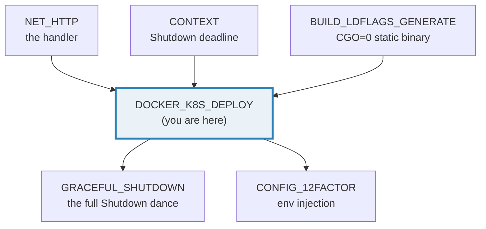
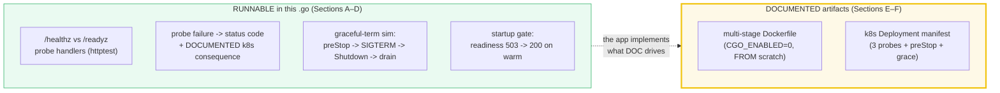
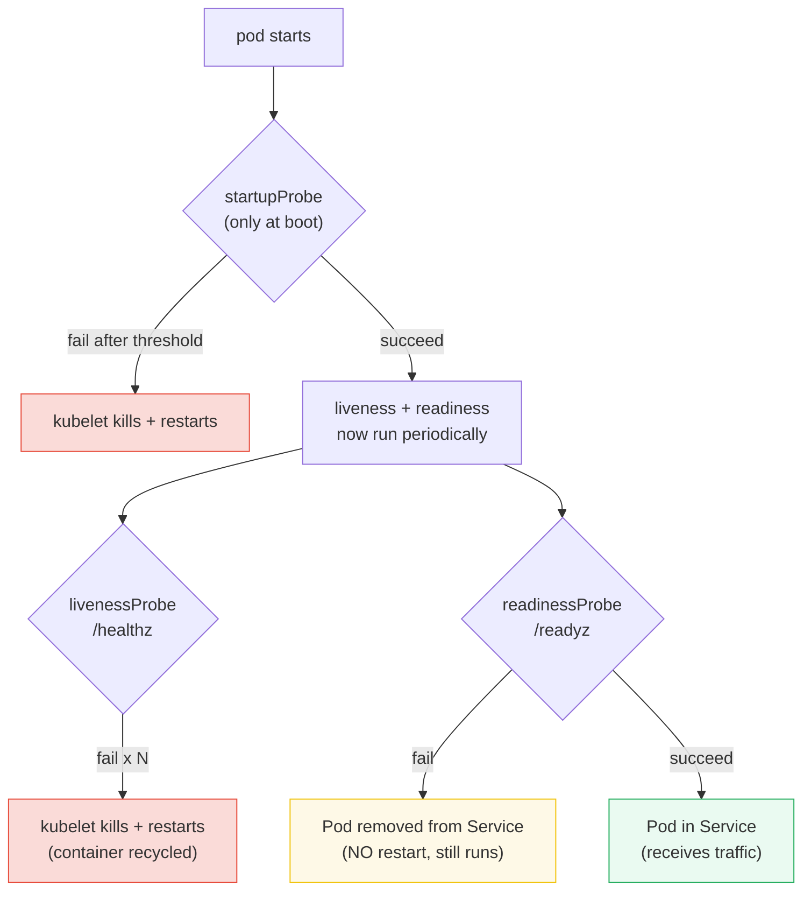
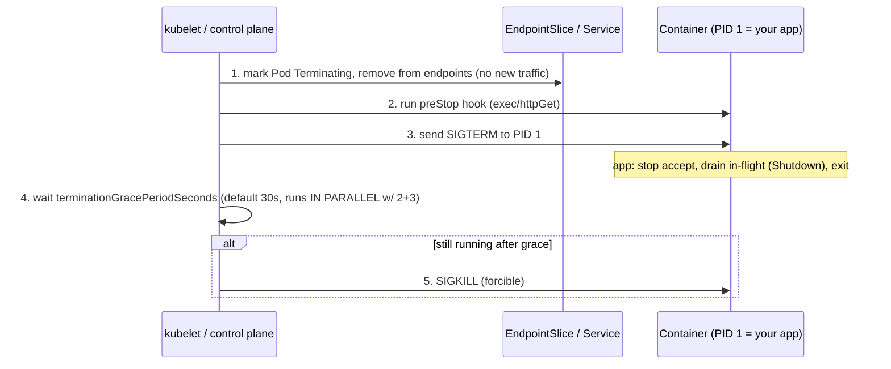
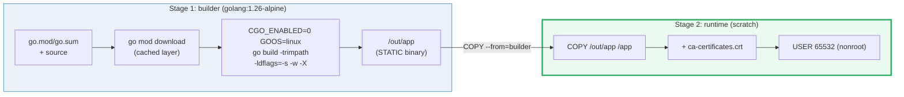

# DOCKER_K8S_DEPLOY — Multi-Stage Docker, Distroless/scratch & Kubernetes Probes + Graceful Termination

> **Goal (one line):** show, by exercising the RUNNABLE mechanics (a `/healthz`
> vs `/readyz` probe server and a graceful-termination simulation) and by
> DOCUMENTING the deployment artifacts (a multi-stage `scratch` Dockerfile and a
> k8s `Deployment` manifest), how a Go service is **built small** and
> **operated safely** on Kubernetes.
>
> **Run:** `go run docker_k8s_deploy.go`
>
> **Ground truth:** [`docker_k8s_deploy.go`](./docker_k8s_deploy.go) → captured
> stdout in [`docker_k8s_deploy_output.txt`](./docker_k8s_deploy_output.txt).
> Every status code and `[check]` below is pasted **verbatim** from that file
> under a `> From docker_k8s_deploy.go Section X:` callout. The Dockerfile and
> k8s manifest are **DOCUMENTED deployment artifacts** (Sections 7–8) — clearly
> labelled, not under callouts — reproduced verbatim from the `.go`. Nothing is
> hand-computed.
>
> **Prerequisites:** 🔗 [`NET_HTTP`](./NET_HTTP.md) (the handlers + `httptest`
> the probes hit), 🔗 [`CONTEXT`](./CONTEXT.md) (`Shutdown(ctx)` is the
> cancellation deadline that drains in-flight requests), 🔗
> [`BUILD_LDFLAGS_GENERATE`](./BUILD_LDFLAGS_GENERATE.md) (`CGO_ENABLED=0` +
> `-ldflags "-s -w -X"` for the tiny static binary), 🔗
> [`SLOG`](./SLOG.md) (structured startup/shutdown logs).

---

## 1. Why this bundle exists (lineage)

Writing a correct Go HTTP handler is only half the job. The other half is making
it **survive production**: ship as a tiny immutable image, let the orchestrator
know when it is alive / ready / done booting, and shut it down **without dropping
in-flight requests**. Kubernetes gives you the primitives — three probe kinds, a
lifecycle hook, and a grace period — but it is **the application** that has to
implement the endpoints and the signal-handling dance correctly. Get any of it
wrong and you get either **needless restarts** (a flaky readiness probe that was
accidentally wired to liveness) or **dropped connections on every deploy** (a
missing `preStop` hook racing endpoint propagation against `SIGTERM`).



This bundle keeps a sharp boundary between **what runs** and **what is
documented**:



> A running program cannot `docker build` or make a cluster restart a pod, so
> the Dockerfile and manifest are printed **verbatim** by the `.go` (single
> source of truth) and asserted by `[check]` lines, but never *executed* from
> `main()`. This is the same "document the build-time action" discipline as 🔗
> `BUILD_LDFLAGS_GENERATE`.

---

## 2. The mental model: three probes, one lifecycle, one race

| k8s probe | Answers | Endpoint here | On failure (N times) |
|---|---|---|---|
| **startupProbe** | *has the app finished booting?* | `/healthz` (gated) | kubelet **kills + restarts** the container |
| **livenessProbe** | *is the process alive / making progress?* | `/healthz` | kubelet **kills + restarts** the container |
| **readinessProbe** | *is it ready to serve traffic right now?* | `/readyz` | Pod's IP **removed from the Service** (NOT restarted) |

The expert detail juniors miss: **liveness and readiness are independent.** A
failing readiness (a downstream DB is down, a cache is cold) must **never** take
down liveness — the process is still healthy, it just can't serve yet. Wire them
to the same endpoint/flag and a slow dependency will get your pod **restarted**
under load instead of merely **deprioritized**. Section A models exactly this
independence with two separate `atomic.Bool` flags.



> From `pkg.go.dev`/kubernetes.io — *Liveness, Readiness, and Startup Probes*:
> *"Liveness probes determine when to restart a container."* *"Readiness probes
> determine when a container is ready to accept traffic."* *"Startup probes
> verify whether the application within a container is started. If a startup
> probe is configured, Kubernetes does not execute liveness or readiness probes
> until the startup probe succeeds."* And the crux — on `Failure`: *"For liveness
> and startup probes, the kubelet kills the container, and the container is
> subjected to its restart policy. For readiness probes, the kubelet marks the
> container as not ready, and the Pod stops receiving traffic from matching
> Services."*

---

## 3. Section A — `/healthz` (liveness) vs `/readyz` (readiness)

The `probeApp` exposes two handlers behind two **independent** atomic flags
(`alive` for liveness, `ready` for readiness). We toggle **only** readiness and
assert liveness never moves — the whole point of the separation.

> From `docker_k8s_deploy.go` Section A:
> ```
> ready=false: GET /healthz -> 200   GET /readyz -> 503  (warming, not in Service)
> ready=true : GET /healthz -> 200   GET /readyz -> 200  (now receiving traffic)
> ```
> ```
> [check] liveness /healthz is 200 even while NOT ready: OK
> [check] readiness /readyz is 503 when NOT ready: OK
> [check] liveness /healthz stays 200 once ready: OK
> [check] readiness /readyz is 200 once ready: OK
> [check] liveness never moved (200 both times): OK
> ```

**What to notice.** `GET /healthz` returns **200 in both rows** — the process is
alive the entire time, so a liveness probe would never restart it. `GET /readyz`
flips **503 → 200** exactly when readiness comes up. While `/readyz` is 503 the
Pod is **not in the Service** (kube-proxy/EndpointSlice excludes it), so it
receives no traffic; the moment it returns 200, traffic flows. This is the
contract: **200 from liveness = "don't restart me"; 200 from readiness = "send me
traffic."**

> From kubernetes.io — *Liveness, Readiness, and Startup Probes* (Readiness): *"If
> the readiness probe returns a failed state, the EndpointSlice controller
> removes the Pod's IP address from the EndpointSlices of all Services that match
> the Pod."*

**The handler mechanics (🔗 NET_HTTP).** The handlers are plain
`http.HandlerFunc`s exercised via `httptest.NewRecorder` — **no socket at all**,
so the output is byte-identical run to run (the recorder captures `Code` and body
in memory). The Go 1.22 method+path pattern `"GET /healthz"` is used so a
non-GET probe (kubelet always uses GET) would be a 405, not a false negative.

**The status-code semantics the kubelet applies.** An `httpGet` probe *"is
considered successful if the response has a status code greater than or equal to
200 and less than 400"* (kubernetes.io). So `/healthz` returning **503** (what
`http.Error` writes with `http.StatusServiceUnavailable`) is a probe **Failure**;
200/201/…/399 are **Success**. Anything ≥400 fails the probe.

---

## 4. Section B — Probe failure semantics → k8s consequence

Here we deliberately fail each probe (`alive=false` for liveness, `ready=false`
for readiness) and observe the **identical 503** — k8s distinguishes them not by
status code but by **which probe field** they sit under, which determines the
**completely different** cluster-side reaction.

> From `docker_k8s_deploy.go` Section B:
> ```
> liveness  /healthz -> 503  -> kubelet RESTARTS the container (after failureThreshold)
> readiness /readyz  -> 503  -> Pod removed from Service (NOT restarted)
> probe type  on failure                          k8s action
> ----------  --------------------------------    ------------------------------------------
> liveness    /healthz returns 503 (N times)       kubelet KILLS + restarts the container
> readiness   /readyz  returns 503                 Pod's IP removed from EndpointSlice (no traffic, still runs)
> startup     /healthz never succeeds in time     kubelet KILLS + restarts the container
> ```
> ```
> [check] liveness failure yields 503: OK
> [check] readiness failure yields 503: OK
> [check] both failure modes are 503 (k8s distinguishes by WHICH probe): OK
> ```

**Why the two failures look the same on the wire but differ in effect.** Both
handlers return 503 — the HTTP behavior is identical. The **only** thing that
differs is the YAML field (`livenessProbe` vs `readinessProbe`). The kubelet reads
that field and branches: liveness `Failure` → kill+restart (subject to
`restartPolicy`); readiness `Failure` → set the Pod `Ready` condition to `false`
and let the EndpointSlice controller drop it from the Service.

> From kubernetes.io — *Probe results* (`Failure`): *"For liveness and startup
> probes, the kubelet kills the container, and the container is subjected to its
> restart policy. For readiness probes, the kubelet marks the container as not
> ready, and the Pod stops receiving traffic from matching Services."*

**The cascading-failure warning.** k8s docs caution that *"Incorrect
implementation of liveness probes can lead to cascading failures … restarting of
container under high load; failed client requests as your application became less
scalable; and increased workload on remaining pods."* The classic mistake: point
liveness at an endpoint that depends on a flaky backend. Under load the backend
slows, liveness starts failing, k8s restarts pods, the remaining pods get even
more load, more restarts → death spiral. **A liveness probe must indicate
unrecoverable failure (e.g. a deadlock), never a transient overload** — that is
what readiness is for.

**The four check mechanisms** (each probe declares exactly one): `httpGet`
(used here), `exec` (command exits 0 = success), `tcpSocket` (port open =
success), `grpc` (health check `SERVING`). `exec` forks a process each time, so
at high pod density prefer `httpGet`/`grpc` to avoid CPU overhead.

---

## 5. Section C — Graceful termination: preStop → SIGTERM → Shutdown → drain → exit

This is the runnable heart of the bundle. A real `http.Server` listens on a
loopback port (never printed), an in-flight request is open against it, and a
background worker has an in-flight batch. On the simulated "SIGTERM" the app
calls `srv.Shutdown(ctx)` — which **stops accepting new connections and waits for
in-flight handlers to finish** — then drains the worker, all within a deadline
**strictly less than** `terminationGracePeriodSeconds`, so SIGKILL never fires.

> From `docker_k8s_deploy.go` Section C:
> ```
> STEP 1: pod marked Terminating; removed from Service endpoints (no new traffic)
> STEP 2: preStop hook executed (bridges endpoint-removal/SIGTERM propagation latency)
> STEP 3: SIGTERM delivered to PID 1  -> app stops accepting new connections, begins drain
> STEP 4: in-flight request drained; background worker drained
> STEP 5: app exits cleanly (drained in 500ms < grace 5s) -> no SIGKILL
>         server.Shutdown(ctx) err = <nil>
>         background worker items drained = 3
> ```
> ```
> [check] in-flight request drained (handler completed): OK
> [check] background worker drained (finished batch of 3): OK
> [check] server.Shutdown returned nil (drained within deadline): OK
> [check] graceful exit within grace period (no SIGKILL needed): OK
> ```

**The k8s termination sequence (verbatim from the docs), in order:**



> From kubernetes.io — *Pod termination flow*: the kubelet *"makes requests to the
> container runtime to attempt to stop the containers in the pod by first sending
> a TERM (aka. SIGTERM) signal, with a grace period timeout … Once the grace
> period has expired, the KILL signal is sent to any remaining processes, and the
> Pod is then deleted."* Step-by-step: (1) delete with the default grace period
> (**30 seconds**); (2) on the node the kubelet runs the **`preStop` hook** if
> defined (default `terminationGracePeriodSeconds` is 30); (3) the container
> runtime sends **TERM to process 1**; (4) **at the same time** the control plane
> removes the Pod's endpoint (its `ready` status goes `false`); (5) when the grace
> period expires, any still-running process gets **SIGKILL**.

**The race the `preStop` hook exists to fix.** Steps 2/3 (preStop/SIGTERM to the
app) and step 4 (endpoint removal across the cluster) happen **in parallel and
asynchronously**. Endpoint propagation to every kube-proxy is not instant, so if
your app closes its listener the moment it sees SIGTERM, **connections that were
already routed to it can still arrive** and get dropped (connection refused). The
`preStop` hook buys time: a `sleep` (or an app-internal grace-sleep, since
`scratch` has no shell) delays SIGTERM long enough for the endpoint removal to
propagate, so by the time the app actually drains, **no new traffic is coming.**
Google's canonical guidance: *"Kubernetes does not wait for the preStop hook to
finish"* — the grace-period clock runs concurrently, so **preStop duration +
drain time must fit inside `terminationGracePeriodSeconds`**.

**The "drain faster than the grace period" rule (the one this section asserts).**
`server.Shutdown(ctx)` is called with a deadline of **500 ms**; the Pod's grace
period is **5 s**. Because the drain finishes well inside the deadline,
`Shutdown` returns **`nil`** and the process exits **before** SIGKILL could ever
fire. If your drain could ever exceed the grace period, SIGKILL murders it
mid-request — so **always set the Shutdown deadline < grace period**, and **raise
`terminationGracePeriodSeconds`** to cover `preStop` + your worst-case drain.

> From `pkg.go.dev/net/http` — `Server.Shutdown`: *"Shutdown gracefully shuts down
> the server without interrupting any active connections. Shutdown works by first
> closing all open listeners, then closing all idle connections, and then waiting
> indefinitely for connections to return to idle and then shut down. … Shutdown
> does not attempt to close nor wait for hijacked connections such as
> WebSockets. … When Shutdown is called, Serve, ListenAndServe, and
> ServeTLS immediately return ErrServerClosed."* It returns the **context error**
> (e.g. `context.DeadlineExceeded`) if the deadline fires first — here it returns
> `nil` because all handlers finished in time.

**Why this bundle asserts state, never elapsed time.** Section C uses fixed short
durations (a 20 ms handler, a 5×3 ms worker, a 500 ms deadline) but the printed
values are **`err = <nil>`** and **`items = 3`** — sentinels and counts, never
milliseconds. Timings are scheduler-dependent and would make `just out`
non-reproducible; `Shutdown`'s error code and the drained-item count are stable
forever. This is the same discipline as 🔗 `CONTEXT` Section C.

---

## 6. Section D — Startup gate: readiness 503 → 200 as the app warms up

A slow-to-start app (loading a model, running migrations, warming a cache) is the
textbook reason **`startupProbe`** exists. Without it you'd have to choose between
a long `initialDelaySeconds` (slow rollouts) or a liveness probe that restarts
the container mid-boot. The gate here is a `warmed` flag: readiness is 503 until
the fixed warm-up completes, then flips to 200.

> From `docker_k8s_deploy.go` Section D:
> ```
> before warm (still loading caches / connecting DB): /readyz -> 503
> after warm  (warmed up, deps connected):          /readyz -> 200
> ```
> ```
> [check] readiness is 503 while still warming: OK
> [check] readiness transitions to 200 once warmed: OK
> [check] the warm-up flipped readiness exactly once (503 -> 200): OK
> ```

**What.** Before the flag flips, `/readyz` is 503 → the Pod is **not in the
Service** (no traffic while it boots). After it flips, 200 → traffic flows. With a
`startupProbe` configured against the same `/healthz`, *"Kubernetes does not
execute liveness or readiness probes until the startup probe succeeds"* — so the
slow boot is granted up to `failureThreshold × periodSeconds` (in the manifest:
`30 × 10s = 5 min`) without any liveness restart.

> From kubernetes.io — *Startup probe*: *"This type of probe is only executed at
> startup, unlike liveness and readiness probes, which are run periodically. If
> the startup probe fails, the kubelet kills the container, and the container is
> subjected to its restart policy."* And *"If your container usually starts in
> more than `initialDelaySeconds + failureThreshold × periodSeconds`, you should
> specify a startup probe … set its `failureThreshold` high enough to allow the
> container to start."*

**Why use a separate startup probe instead of just readiness.** A readiness
probe that stays 503 for minutes during boot would keep the Pod out of the
Service — fine — but a *liveness* probe running during that window would see…
nothing healthy yet and **restart** the Pod before it finishes booting
(`CrashLoopBackOff`). The `startupProbe` **gates** both: until it succeeds,
liveness and readiness don't even run, so a 90-second boot is never punished as a
crash.

---

## 7. DOCUMENTED — The multi-stage `scratch` Dockerfile (Section E)

> This is a **deployment artifact**, reproduced verbatim from `docker_k8s_deploy.go`
> Section E. It is not executed by `main()`; a developer runs `docker build`.

**Why `scratch`/distroless for Go.** Go compiles to a **single static binary**
when `CGO_ENABLED=0`, so the runtime image needs **no OS, no shell, no libc, no
package manager** — just the binary (and CA certs / tzdata if you do TLS or
timezone math). That yields a **~5 MB** image with a **minimal attack surface**
(no `curl`/`sh`/`apt` for an attacker to pivot through) versus a ~300 MB+
`golang:`-based image carrying the whole toolchain.



```dockerfile
# syntax=docker/dockerfile:1
# =============================================================================
# Stage 1 (builder): compile a STATIC binary. CGO disabled => no libc link =>
# the binary runs in 'scratch' (which has zero shared libraries).
# =============================================================================
FROM golang:1.26-alpine AS builder
WORKDIR /src
# Cache deps: copy manifests first, download, THEN copy source.
COPY go.mod go.sum ./
RUN go mod download
COPY . .
# Static binary: -trimpath + -ldflags="-s -w" strip paths/symbols for a tiny
# reproducible image; -X injects the release version at link time.
RUN CGO_ENABLED=0 GOOS=linux go build \
      -trimpath -ldflags="-s -w -X main.version=v1.2.3" -o /out/app .

# =============================================================================
# Stage 2 (runtime): FROM scratch. ~5 MB image; no shell, no package manager,
# no libc -> minimal attack surface. A static Go binary + CA certs is all it has.
# (Alternative: FROM gcr.io/distroless/static:nonroot -> ships CA certs + tzdata
#  + a nonroot user (UID 65532); still no shell/package manager.)
# =============================================================================
FROM scratch
# CA certs so net/http can do TLS to external services (scratch ships none).
COPY --from=builder /etc/ssl/certs/ca-certificates.crt /etc/ssl/certs/
# The static binary (and only that).
COPY --from=builder /out/app /app
# Run as non-root (numeric UID works in scratch with no /etc/passwd).
USER 65532:65532
EXPOSE 8080
# No HEALTHCHECK: scratch has no shell/binary to run one. Rely on k8s probes.
ENTRYPOINT ["/app"]
```

**Every line, explained:**

- **`AS builder`** names the first stage so `COPY --from=builder` can pull
  *only* the compiled binary out of it. The toolchain, source, and build cache
  **stay in the builder stage** and never reach the final image — that is the
  whole point of multi-stage.
- **`CGO_ENABLED=0`** disables cgo → the linker produces a **static** binary with
  no `libc` dependency. *This is the precondition for `FROM scratch`* (🔗
  `BUILD_LDFLAGS_GENERATE` covers the cgo/cross-compile interaction in depth).
- **`GOOS=linux`** targets the container's kernel even when you build on macOS.
- **`-trimpath`** strips absolute host paths (reproducible builds); **`-ldflags
  "-s -w"`** strips the symbol table and DWARF (~25% smaller); **`-X
  main.version=…`** injects the release version at link time.
- **`COPY go.mod go.sum ./` then `RUN go mod download` BEFORE `COPY . .`** exploits
  Docker layer caching: the dependency layer is rebuilt only when manifests
  change, not on every source edit.
- **`FROM scratch`** is Docker's reserved empty image — literally nothing.
- **`COPY … ca-certificates.crt`** is required if the app makes outbound HTTPS
  calls (scratch ships no trust store); drop it if you don't.
- **`USER 65532:65532`** runs as non-root. A **numeric** UID works in `scratch`
  (no `/etc/passwd` needed). `gcr.io/distroless/static:nonroot` ships a named
  `nonroot` user at the same UID 65532 — a common drop-in for `scratch` that also
  bundles CA certs + tzdata.
- **No `HEALTHCHECK`** in scratch: there's no shell/binary to run one. Rely on
  **k8s probes** (Section 8) instead — they run from the kubelet on the node, not
  inside the container.

> From `docker_k8s_deploy.go` Section E (verified `[check]` properties):
> ```
> [check] Dockerfile is multi-stage (has an AS builder stage): OK
> [check] builder disables CGO for a static binary (CGO_ENABLED=0): OK
> [check] builder targets linux (GOOS=linux): OK
> [check] final stage is FROM scratch (no OS, no shell): OK
> [check] final stage runs as a non-root UID (USER 65532): OK
> [check] image documents its port (EXPOSE 8080): OK
> ```

---

## 8. DOCUMENTED — The k8s `Deployment` manifest (Section F)

> This is a **deployment artifact**, reproduced verbatim from
> `docker_k8s_deploy.go` Section F. It is not executed by `main()`; a developer
> runs `kubectl apply -f`. It wires the three probes, a `preStop` hook, the grace
> period, resources, and env — the production baseline.

```yaml
apiVersion: apps/v1
kind: Deployment
metadata:
  name: app
spec:
  replicas: 3
  selector:
    matchLabels: { app: app }
  template:
    metadata:
      labels: { app: app }
    spec:
      terminationGracePeriodSeconds: 30   # SIGTERM..SIGKILL window (default 30s)
      containers:
        - name: app
          image: registry.example.com/app:v1.2.3
          ports:
            - { containerPort: 8080 }
          env:
            - { name: PORT, value: "8080" }
            - { name: LOG_LEVEL, value: "info" }
          # startupProbe GATES liveness+readiness until the app is up, so a slow
          # boot is not mistaken for a liveness failure. (failureThreshold x
          # periodSeconds = the max boot time the app is granted.)
          startupProbe:
            httpGet: { path: /healthz, port: 8080 }
            failureThreshold: 30            # 30 x 10s = up to 5 min to come up
            periodSeconds: 10
          # livenessProbe failure => kubelet RESTARTS the container.
          livenessProbe:
            httpGet: { path: /healthz, port: 8080 }
            periodSeconds: 10
            failureThreshold: 3
          # readinessProbe failure => Pod removed from the Service (NOT restarted).
          readinessProbe:
            httpGet: { path: /readyz, port: 8080 }
            periodSeconds: 5
            failureThreshold: 1
          lifecycle:
            preStop:
              exec:
                # scratch has no 'sleep': the binary ships its own grace-sleep
                # to bridge the endpoint-removal/SIGTERM propagation race.
                command: ["/app", "-grace-sleep", "5s"]
          resources:
            requests: { cpu: 100m, memory: 64Mi }
            limits:   { cpu: 500m, memory: 256Mi }
```

**Reading the manifest against Sections 3–6:**

| Field | What it does | Ties to |
|---|---|---|
| `terminationGracePeriodSeconds: 30` | the SIGTERM→SIGKILL window (default 30) | §5 step 4; **must exceed `preStop` + drain** |
| `startupProbe` (`failureThreshold 30 × periodSeconds 10`) | gates liveness/readiness for up to 5 min of boot | §6; kills+restarts if boot never succeeds |
| `livenessProbe` (`/healthz`) | fail × `failureThreshold` → **kill + restart** | §3, §4 |
| `readinessProbe` (`/readyz`) | fail → **removed from Service** (no restart) | §3, §4 |
| `lifecycle.preStop` (`exec`) | runs **before** SIGTERM; bridges endpoint propagation | §5 step 2 (the race fix) |
| `resources.requests/limits` | scheduling + QoS/throttling bounds | keeps the pod from being evicted/OOM-killed |
| `env` | 12-factor config injection | 🔗 `CONFIG_12FACTOR` |

**Why `preStop` is `exec` with the binary's own sleep, not `sleep 5`.** `scratch`
has **no shell and no coreutils** — there is no `sleep` binary to exec. So the
`preStop` hook calls back into your own binary (`/app -grace-sleep 5s`), which
implements a fixed sleep in-process. (Equivalently, use an `httpGet` `preStop`
that flips an internal "draining" flag so `/readyz` immediately returns 503,
accelerating endpoint removal.) The goal is identical: **delay SIGTERM until the
cluster agrees the Pod is no longer a traffic target.**

**`failureThreshold` × `periodSeconds` is the real SLO knob.** A liveness probe
with `failureThreshold: 3, periodSeconds: 10` tolerates **~30 s** of badness
before restarting — long enough to ride out a GC stall, short enough to recover a
true deadlock. A readiness probe with `failureThreshold: 1, periodSeconds: 5`
pulls the Pod out of the Service **fast** (within one probe interval) when a
dependency degrades. Tune these deliberately; defaults are rarely right.

> From `docker_k8s_deploy.go` Section F (verified `[check]` properties):
> ```
> [check] manifest sets terminationGracePeriodSeconds: OK
> [check] manifest defines a startupProbe (gates liveness+readiness): OK
> [check] manifest defines a livenessProbe (failure -> restart): OK
> [check] manifest defines a readinessProbe (failure -> removed from Service): OK
> [check] manifest has a preStop lifecycle hook: OK
> [check] probes use httpGet against /healthz and /readyz: OK
> [check] manifest sets resource requests and limits: OK
> ```

---

## 9. Pitfalls (the expert payoff)

| Trap | Symptom | Fix |
|---|---|---|
| Wiring liveness and readiness to the same endpoint/flag | a slow downstream dep → liveness fails → **restart storm** under load | Keep them **independent** (two flags/endpoints). Liveness = "process itself healthy"; readiness = "deps up + warmed". |
| Liveness probe depends on a flaky backend | cascading restarts (restart → more load → more restarts) | Liveness must signal **unrecoverable** failure (deadlock), never transient overload — that's readiness. |
| Missing `preStop` hook | dropped connections / 502s on every deploy (SIGTERM arrives before endpoint removal propagates) | Add a `preStop` that sleeps (or flips a draining flag) so the Pod stops receiving traffic before it drains. |
| `preStop` + drain > `terminationGracePeriodSeconds` | SIGKILL murders the pod mid-drain → forced request failures | Raise `terminationGracePeriodSeconds` to **strictly exceed** `preStop` + worst-case drain. |
| `Shutdown` deadline ≥ grace period | drain can be cut off by SIGKILL even though the app "tried" | Set the `Shutdown(ctx)` deadline **<** `terminationGracePeriodSeconds` (the rule Section C asserts). |
| `CGO_ENABLED=0` not set in the builder | binary links glibc → won't run in `scratch` (`no such file or directory`) | Always build with `CGO_ENABLED=0 GOOS=linux go build` for `scratch`/distroless-static. |
| `scratch` image with outbound HTTPS, no CA certs | TLS errors (`x509: certificate signed by unknown authority`) | `COPY --from=builder /etc/ssl/certs/ca-certificates.crt …` or use `distroless/static` (bundles them). |
| Running the container as root | container escape → root on the node; fails Pod Security `restricted` | `USER 65532:65532` (numeric works in scratch) or `distroless/static:nonroot`. |
| `HEALTHCHECK` in a `scratch` Dockerfile | build/run fails (no shell to execute it) | Drop it; use **k8s probes** (kubelet runs them from the node, not in-container). |
| No `startupProbe` on a slow booting app | `CrashLoopBackOff` — liveness restarts the pod before it finishes starting | Add a `startupProbe` with a high `failureThreshold`; it gates liveness/readiness until boot completes. |
| `time.Sleep` in `preStop` for a scratch image | fails — no `sleep` binary | Ship your own (`/app -grace-sleep`) or use an `httpGet` `preStop` to flip a draining flag. |
| Asserting elapsed drain time in tests | flaky (scheduler-dependent) | Assert `Shutdown`'s error code (`nil` vs `DeadlineExceeded`) and the drained-item count — never ms. |

---

## 10. Cheat sheet

```go
// ---- The probe handlers (liveness vs readiness are INDEPENDENT) ------------
type app struct {
    alive atomic.Bool // liveness:  process healthy?
    ready atomic.Bool // readiness: able to serve traffic now?
}
mux.HandleFunc("GET /healthz", func(w http.ResponseWriter, r *http.Request) {
    if !alive.Load() { http.Error(w, "unhealthy", 503); return } // -> kubelet RESTARTS
    w.WriteHeader(200)
})
mux.HandleFunc("GET /readyz", func(w http.ResponseWriter, r *http.Request) {
    if !ready.Load() { http.Error(w, "not ready", 503); return } // -> removed from Service
    w.WriteHeader(200)
})
// httpGet probe success = status in [200,400). 503/500/... = Failure.

// ---- Graceful termination on SIGTERM (the Shutdown dance) -------------------
srv := &http.Server{Handler: mux}
go srv.Serve(ln)
// on SIGTERM:
ctx, cancel := context.WithTimeout(context.Background(), drainDeadline) // < grace!
defer cancel()
err := srv.Shutdown(ctx) // stops accept, waits for in-flight handlers; nil if drained
// drain background workers (wg.Wait()), then os.Exit(0) BEFORE grace -> no SIGKILL.
// srv.Shutdown returns context.DeadlineExceeded if the deadline fires first.
```

```dockerfile
# ---- Multi-stage scratch Dockerfile (the 5 MB image) ------------------------
FROM golang:1.26-alpine AS builder
WORKDIR /src
COPY go.mod go.sum ./
RUN go mod download
COPY . .
RUN CGO_ENABLED=0 GOOS=linux go build -trimpath -ldflags="-s -w -X main.version=v1.2.3" -o /out/app .
FROM scratch
COPY --from=builder /etc/ssl/certs/ca-certificates.crt /etc/ssl/certs/  # only if you do TLS
COPY --from=builder /out/app /app
USER 65532:65532                       # non-root; numeric UID works with no /etc/passwd
EXPOSE 8080
ENTRYPOINT ["/app"]
# No HEALTHCHECK in scratch (no shell) -> use k8s probes.
```

```yaml
# ---- k8s Deployment: 3 probes + preStop + grace + resources -----------------
spec:
  terminationGracePeriodSeconds: 30          # MUST exceed preStop + drain
  containers:
  - name: app
    startupProbe:                            # GATES liveness+readiness until booted
      httpGet: { path: /healthz, port: 8080 }
      failureThreshold: 30                   # x periodSeconds(10s) = max boot time
      periodSeconds: 10
    livenessProbe:                           # fail -> kubelet KILLS + RESTARTS
      httpGet: { path: /healthz, port: 8080 }
      periodSeconds: 10
      failureThreshold: 3
    readinessProbe:                          # fail -> removed from Service (no restart)
      httpGet: { path: /readyz, port: 8080 }
      periodSeconds: 5
      failureThreshold: 1
    lifecycle:
      preStop:
        exec: { command: ["/app", "-grace-sleep", "5s"] }   # bridge endpoint race
    resources:
      requests: { cpu: 100m, memory: 64Mi }
      limits:   { cpu: 500m, memory: 256Mi }
# Termination order: mark Terminating+remove endpoint -> preStop -> SIGTERM ->
#   wait grace (parallel) -> SIGKILL if still running. Drain faster than grace.
```

---

## Sources

Every probe/lifecycle claim, Dockerfile convention, and behavioral rule above was
verified against the Kubernetes and Go standard-library docs, then corroborated by
independent secondary sources:

- Kubernetes — *Liveness, Readiness, and Startup Probes*:
  https://kubernetes.io/docs/concepts/workloads/pods/probes/
  - Startup probe (*"verify whether the application … is started … does not
    execute liveness or readiness probes until the startup probe succeeds"*);
    Liveness (*"determine when to restart a container"*);
    Readiness (*"determine when a container is ready to accept traffic" … "the
    EndpointSlice controller removes the Pod's IP address"*); Probe results
    `Failure` (*"For liveness and startup probes, the kubelet kills the
    container … For readiness probes, the kubelet marks the container as not
    ready, and the Pod stops receiving traffic"*); the cascading-failure
    caution; the four check mechanisms (`httpGet` success = status `>= 200` and
    `< 400`, `exec`, `tcpSocket`, `grpc`); `failureThreshold`/`periodSeconds`/
    `initialDelaySeconds` semantics.
- Kubernetes — *Pod Lifecycle* → *Pod termination flow*:
  https://kubernetes.io/docs/concepts/workloads/pods/pod-lifecycle/#pod-termination
  - default grace period **30 seconds**; the `preStop` hook runs before SIGTERM
    (default `terminationGracePeriodSeconds` is 30; a one-off 2 s extension if
    `preStop` overruns); the container runtime sends **TERM to process 1**;
    endpoint removal happens **in parallel** (terminating endpoints have
    `ready=false`); **SIGKILL** when the grace period expires with still-running
    containers; the graceful-shutdown SIGTERM-then-KILL contract.
- Google Cloud Blog — Sandeep Dinesh, *"Kubernetes best practices: terminating
  with grace"* (the canonical 5-step termination lifecycle: Terminating+removed
  from endpoints → preStop → SIGTERM → wait grace period in parallel → SIGKILL;
  *"Kubernetes does not wait for the preStop hook to finish"*):
  https://cloud.google.com/blog/products/containers-kubernetes/kubernetes-best-practices-terminating-with-grace
- `pkg.go.dev/net/http` — `Server.Shutdown` (*"gracefully shuts down the server
  without interrupting any active connections … closing all open listeners, then
  closing all idle connections, and then waiting … to return to idle" … "does not
  attempt to close nor wait for hijacked connections such as WebSockets" … "Serve
  … immediately return ErrServerClosed"*; returns the context error if the
  deadline fires): https://pkg.go.dev/net/http#Server.Shutdown
- `pkg.go.dev/os/signal` — `signal.Notify` / `NotifyContext` (the API a real app
  uses to catch SIGTERM and trigger `Shutdown`; this bundle simulates the cancel
  in-process for determinism): https://pkg.go.dev/os/signal
- 🔗 `BUILD_LDFLAGS_GENERATE` (sibling bundle) — `CGO_ENABLED=0` static-binary
  mechanics, `-ldflags "-s -w -X"` link-time injection, `GOOS`/`GOARCH`
  cross-compile: https://go.dev/cmd/link (`-X`), https://pkg.go.dev/cmd/go
- Secondary corroboration (>=2 independent sources, web-verified):
  - OneUptime — *"How to Containerize Go Apps with Multi-Stage Dockerfiles"*
    (multi-stage builder + `scratch`/`distroless/static:nonroot`; `CGO_ENABLED=0`
    for static binaries; CA-cert/timezone/non-root additions; the ~5 MB scratch
    vs ~250 MB alpine vs ~850 MB golang size comparison; no shell = reduced attack
    surface): https://oneuptime.com/blog/post/2026-01-07-go-docker-multi-stage/view
  - chemidy (Medium) — *"Create the smallest and secured golang docker image
    based on scratch"* (the multi-stage → scratch pattern, CA certs, non-root):
    https://chemidy.medium.com/create-the-smallest-and-secured-golang-docker-image-based-on-scratch-4752223b7324

**Facts that could not be verified by running** (documented, not executed,
because they are build-time / cluster-side operations a single `go run` cannot
self-trigger): the `docker build` actually producing a ~5 MB scratch image (a
build action — sizes per the OneUptime/chemidy sources); the kubelet actually
killing/restarting a container on liveness failure, and the EndpointSlice
controller actually removing a Pod's IP on readiness failure (cluster behavior —
per the kubernetes.io probe/termination docs); the preStop→SIGTERM→grace→SIGKILL
ordering happening on a real node (per the Pod termination flow + the Google
blog). The runnable `.go` simulates the **app side** of all of this (the probe
status codes and the `Shutdown`-drains-cleanly dance) and asserts those invariants;
the cluster-side consequences are cited verbatim from the docs above, not
reproduced as output (a file would need a live cluster to do so).
