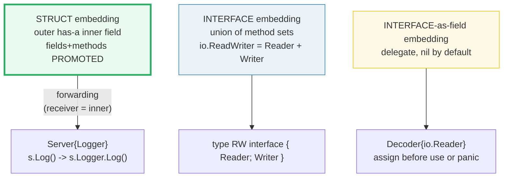
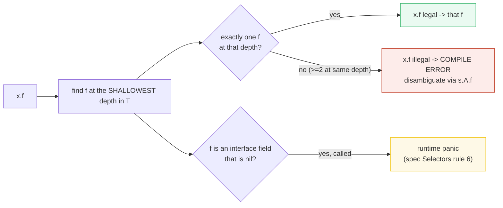

# EMBEDDING_COMPOSITION — Struct Embedding, Interface Embedding & the Decorator Pattern

> **Goal (one line):** show, by printing every value, how Go's embedding builds
> **composition** (method/field forwarding) — and why it is *not* inheritance:
> struct embedding vs interface embedding, the mock/decorator pattern, embedding
> an interface as a delegate field (and its nil-deref trap), and selector-depth
> conflict resolution.
>
> **Run:** `go run embedding_composition.go`
>
> **Ground truth:** [`embedding_composition.go`](./embedding_composition.go) →
> captured stdout in
> [`embedding_composition_output.txt`](./embedding_composition_output.txt).
> Every number/table below is pasted **verbatim** from that file under a
> `> From embedding_composition.go Section X:` callout. Nothing is hand-computed.
>
> **Prerequisites:** 🔗 [`STRUCTS_METHODS`](./STRUCTS_METHODS.md) (the embedding
> *basics* — `Car` embeds `Engine`, field/method promotion, the method-set rule)
> and 🔗 [`INTERFACES_BASICS`](./INTERFACES_BASICS.md) (interface embedding *basics*
> — `GreeterNamer` as a union). **This bundle is the synthesis + the production
> patterns** that the two basics bundles only previewed: the decorator/mock, the
> interface-as-delegate, and conflict resolution by selector depth.

---

## 1. Why this bundle exists (lineage)

Go has **no inheritance** — no `extends`, no subtype hierarchy, no virtual
dispatch. What it has instead is **embedding**: one type can embed another, and
the embedded type's fields/methods are *promoted* to the outer type through
**selector forwarding**. Syntactically this *looks* like inheritance to
arrivals from Java/C++/Python; semantically it is **composition** (a `has-a`
field) with a touch of sugar. The single rule that separates the two worlds is
the spec's selector rule: `x.f` "denotes the field or method at the **shallowest
depth**", and promotion is just a shorthand for that traversal.

This bundle takes the basics (`Car`/`Engine` in STRUCTS_METHODS, the
`GreeterNamer` union in INTERFACES_BASICS) and drills into the **five things
that bite working engineers**:

1. **Composition ≠ inheritance.** Embedding promotes methods (so the outer type
   *satisfies interfaces* the inner satisfies — the "accidental interface"), but
   it creates **no subtype relationship**: a `*Server` is **not** a `*Logger`.
2. **Interface embedding = union of method sets.** `io.ReadWriter` is defined
   *exactly* as `interface { Reader; Writer }`.
3. **The mock/decorator pattern.** Embed the real implementation, override one
   method, keep the rest delegated — a free wrapper that still satisfies the same
   interface.
4. **Embedding an *interface* (not a struct)** gives a nil-by-default delegate
   field: the middleware shape, and the source of a classic nil-deref panic.
5. **Name conflicts** are resolved by **selector depth**: same depth is an error;
   shallower wins.



> From Effective Go (*Embedding*): *"Go does not provide the typical, type-driven
> notion of subclassing, but it does have the ability to 'borrow' pieces of an
> implementation by **embedding** types within a struct or interface."* And the
> line that explains every "override didn't work" bug in this bundle: *"When we
> embed a type, the methods of that type become methods of the outer type, but
> when they are invoked **the receiver of the method is the inner type, not the
> outer one**."*

---

## 2. Section A — Struct embedding & promotion (forwarding, same storage)

`type Server struct { Logger }` declares an **embedded field**: a field with a
type but no explicit name. The field's name *is* the type name (`Logger`), so
you initialize it as `Server{Logger: Logger{...}}`. The embedded type's fields
(`prefix`) and methods (`Log`) are **promoted** to `Server`: `s.Log("x")` and
`s.prefix` are legal shorthands that forward to `s.Logger.Log("x")` and
`s.Logger.prefix` — and they reach the **same storage**.

> From `embedding_composition.go` Section A:
> ```
> s := Server{Logger: Logger{prefix: "[srv] "}, id: 7}
> s.Log("boot")        == "[srv] boot"   (PROMOTED method, forwarded to s.Logger.Log)
> s.Logger.Log("boot") == "[srv] boot"   (explicit selector, identical receiver)
> s.prefix (promoted)  == "[srv] "   (PROMOTED field == s.Logger.prefix)
> s.Logger.prefix      == "[srv] "   s.id == 7 (declared field)
> s.prefix = "[S] "  ->  s.Logger.prefix == "[S] "  (promoted write reaches embedded field)
> reflect: Server method set = [Log]  (Log PROMOTED from Logger)
> ```
> ```
> [check] promoted method s.Log() == s.Logger.Log(): OK
> [check] promoted field s.prefix == s.Logger.prefix: OK
> [check] promoted write reaches the embedded field: s.Logger.prefix == "[S] ": OK
> [check] reflect sees promoted Log in Server's method set: OK
> ```

**What.** The spec (*Struct types*) defines an embedded field precisely:
*"A field declared with a type but no explicit field name is called an embedded
field... The unqualified type name acts as the field name."* Promotion is then
defined via selectors: *"A field or method `f` of an embedded field in a struct
`x` is called promoted if `x.f` is a legal selector that denotes that field or
method `f`."*

**Why the reflect check matters.** Promotion is not a textual trick — `Log`
genuinely enters `Server`'s **method set**, which is what lets `Server` satisfy
the `Loggable` interface in Section B. `reflect.TypeOf(Server{}).MethodByName
("Log")` returns true; the promoted method is real.

**Gotcha — promoted fields are NOT literal keys.** You initialize with the
embedded *type* name, not the promoted field name:

```go
Server{Logger: Logger{prefix: "x"}} // OK
Server{prefix: "x"}                 // COMPILE ERROR: unknown field 'prefix' in struct literal
```

The spec is explicit: *"Promoted fields act like ordinary fields of a struct
except that they **cannot be used as field names in composite literals** of the
struct."* (See 🔗 [`STRUCTS_METHODS`](./STRUCTS_METHODS.md) §B for the same rule
with `Car{Engine: ...}`.)

---

## 3. Section B — Composition, not inheritance (no subtype polymorphism)

This is the section that corrects the most common misconception. Embedding does
**two** things that look contradictory until you separate them:

- **Promotion** makes `Server` *satisfy* any interface that `Logger`'s methods
  satisfy (`Loggable`). This is real and is the source of Go's **"accidental
  interface"** leak — embed a type and you silently implement everything it
  implements.
- **But embedding creates NO subtype relationship.** `Server` is **not** a
  `Logger`; `*Server` is **not** a `*Logger`. There is no upcast. You can only
  reach the inner field explicitly (`s.Logger` / `&s.Logger`).

> From `embedding_composition.go` Section B:
> ```
> var lg Loggable = s   -> lg.Log("hi") == "[srv] hi"   (Server SATISFIES Loggable via promotion)
>                        %T of lg == main.Server  (dynamic type is Server, not Logger)
> COMPILE ERROR (documented): var lp *Logger = &s   // *Server is NOT a *Logger (no subtype)
> COMPILE ERROR (documented): var lf Logger  = s    // Server is NOT a Logger
> var innerPtr *Logger = &s.Logger -> innerPtr.Log("x") == "[inner] x"  (reach the embedded field)
> ```
> ```
> [check] Server satisfies Loggable via promoted Log: OK
> [check] the interface value's dynamic type is Server: OK
> [check] embedded field is extractable: &s.Logger is a *Logger: OK
> ```

**Why the assignment `var lp *Logger = &s` is a compile error.** `Server` and
`Logger` are **distinct defined types** with different underlying struct types.
Go's assignability rules require either identical types, identical underlying
types (for the channel/numeric cases), or one being an interface the other
implements. A `*Server` is none of these for `*Logger`. Contrast with an
inheritance language, where `Server extends Logger` makes `Server IS-A Logger`
and the upcast `Logger l = server` is the whole point — that simply does not
exist in Go.

**The two compile-error lines are deliberately not in the runnable file** (a file
containing them would not build), exactly as STRUCTS_METHODS documents the
"promoted field as literal key" error. They are confirmed by the spec sections
cited in §Sources, not reproduced as runnable output.

**The expert reframe.** "Satisfies an interface" (method-set promotion, happens)
and "is a subtype" (type relationship, never happens) are **different** things.
Embedding gives you the former for free and the latter never. If you need to
pass a `*Logger` somewhere, take the address of the field: `&s.Logger`.

---

## 4. Section C — Interface embedding (union of method sets)

An interface may embed other interfaces. The composite's method set is the
**union** of the embedded interfaces' methods. This is *exactly* how the
standard library defines `io.ReadWriter`:

```go
// From io/io.go (pkg.go.dev/io):
type ReadWriter interface {
    Reader
    Writer
}
```

> From `embedding_composition.go` Section C:
> ```
> io.ReadWriter (stdlib) = interface { Reader; Writer }  // embedded union
> var rw TokenReadWriter = &TokenStream{}
> rw.ReadToken() == "tok1"   (satisfies the embedded union)
> TokenReadWriter method set = [ReadToken WriteToken]   (UNION of ReadToken + WriteToken)
> var ioRW io.ReadWriter = &bytes.Buffer -> %T = *bytes.Buffer  (stdlib composite, same shape)
> ```
> ```
> [check] TokenReadWriter's method set is the union {ReadToken, WriteToken}: OK
> [check] *TokenStream satisfies TokenReadWriter: OK
> [check] *bytes.Buffer satisfies io.ReadWriter (non-nil interface): OK
> ```

**What.** The spec (*Embedded interfaces*) is precise about the *type set*: *"The
type set of `T` is the **intersection** of the type sets defined by `T`'s
explicitly declared methods and the type sets of `T`'s embedded interfaces."*
The type set is an intersection (a type must implement **all** of them); since
each method specification's type set is "all types with that method", the
intersection is the set of types with **every** method — which is exactly the
**union of the method sets**. Same fact, two framings. Either way:
`TokenReadWriter` requires both `ReadToken` **and** `WriteToken`.

**Why this matters at scale.** The standard library leans on this heavily:
`io.ReadCloser`, `io.WriteCloser`, `io.ReadWriteCloser`, `io.ReadSeeker`,
`io.WriteSeeker`, `io.ReadWriteSeeker` are all one-liners built by embedding —
the alternative would repeat the `Read(p []byte) (int, error)` signature a dozen
times. There is deep ecosystem coverage in 🔗 [`IO_READER_WRITER`](./IO_READER_WRITER.md).

**The 1.14 history (the overlapping-method fix).** Before Go 1.14, if two
embedded interfaces each declared the *same* method (e.g. embedding both
`io.ReadCloser` and `io.WriteCloser`, which both bring in `Closer`), the
composite was a **"Duplicate method"** error. Go 1.14 fixed this: methods with
the same name and **identical signature** are merged, so
`interface { io.ReadCloser; io.WriteCloser }` is now a legal `ReadWriteCloser`.
This is why you can compose the `io.*Closer` family freely today.

---

## 5. Section D — The mock/decorator pattern (embed + override one)

This is the production payoff. Embed a real implementation, override exactly the
method(s) you want to change, and the rest stay delegated — a free
wrapper/decorator that **still satisfies the same interface** as the wrapped
type. But the section's first half is the **trap** that makes "override" behave
nothing like inheritance.

> From `embedding_composition.go` Section D:
> ```
> o.Hello()  == "Override.Hello"   (depth-0 Override.Hello wins on direct call)
> o.Greet()  == "Base.Hello"   (Greet promoted from Base; calls Base.Hello, NOT Override.Hello)
> => embedding has NO virtual dispatch: the receiver is always the inner type.
> cb.Write([]byte("hello")) -> n=5, writeCalls=1, cb.String()=="seedhello"
> cb.WriteString("!!")      -> writeCalls=1 (UNCHANGED), cb.String()=="seedhello!!"
> var rw io.ReadWriter = cb   -> %T = *main.CountingBuffer  (decorator keeps the interface)
> ```
> ```
> [check] direct o.Hello() picks the depth-0 override: OK
> [check] no virtual dispatch: o.Greet() still calls Base.Hello: OK
> [check] override counts direct Write calls: writeCalls == 1: OK
> [check] delegated WriteString bypasses the override: writeCalls still 1, content appended: OK
> [check] *CountingBuffer satisfies io.ReadWriter: OK
> ```

### 5.1 No virtual dispatch (the "override didn't propagate" trap)

`Override` embeds `Base` and redeclares `Hello` at **depth 0**. By the
shallowest-depth rule, `o.Hello()` picks `Override.Hello` (§8 confirms the rule).
But `Greet` is **promoted from `Base`**; when you call `o.Greet()`, it forwards
to `Base.Greet` with **the embedded `Base` field as the receiver**. Inside
`Greet`, `b.Hello()` is a call on a statically-typed `Base` — it binds to
`Base.Hello`, **never** to `Override.Hello`. This is Effective Go's verbatim
rule: *"the receiver of the method is the inner type, not the outer one."*

In an inheritance language, `Greet` would be a virtual method and `Hello` a
virtual call, so overriding `Hello` in the subclass would change what `Greet`
does. **Go has no virtual dispatch**, so the override does not propagate. This
is why you cannot "override a method and expect the base's other methods to call
your override" — the most common embedding surprise.

### 5.2 The real decorator (CountingBuffer)

`CountingBuffer` embeds `*bytes.Buffer` (the concrete implementation) and
overrides `Write` to count calls, forwarding explicitly via `c.Buffer.Write`:

```go
type CountingBuffer struct {
    *bytes.Buffer
    writeCalls int
}
func (c *CountingBuffer) Write(p []byte) (int, error) {
    c.writeCalls++
    return c.Buffer.Write(p)
}
```

Three things are true, and the checks pin each:

1. **Direct calls route through the override.** `cb.Write([]byte("hello"))`
   increments `writeCalls` to 1 and writes.
2. **Delegated methods bypass it.** `cb.WriteString("!!")` is *promoted* from
   `*bytes.Buffer`; its receiver is the embedded `*bytes.Buffer` field, which
   has its own `Write` (or appends directly). `writeCalls` stays 1 — yet the
   content `"!!"` is appended. The override is invisible to delegated methods.
3. **The decorator keeps the interface.** `Write` is `CountingBuffer`'s own
   pointer-receiver method; `Read` is promoted from `*bytes.Buffer`. So
   `*CountingBuffer` satisfies `io.ReadWriter`, and the wrapper is a drop-in.

This is the same shape as `io.LimitedReader`, `io.TeeReader`, `httptest`
recorders, and HTTP middleware (🔗 [`NET_HTTP`](./NET_HTTP.md)): embed the real
thing, override the one method you care about, keep the rest delegated, and your
wrapper still implements the interface callers expect.

---

## 6. Section E — Embedding an interface as a delegate field (the nil-deref trap)

A struct may embed an **interface** (not a struct). The embedded field's type is
the interface; its name is the interface's type name (`Reader`); and its **zero
value is `nil`**. The interface's methods are promoted, so `d.Read(p)` *compiles*
— but the **field starts empty**. Calling a promoted method while the field is
nil is a **runtime panic** (spec *Selectors* rule 6).

> From `embedding_composition.go` Section E:
> ```
> var d Decoder  ->  d.Reader == <nil>  (embedded INTERFACE field is nil by default)
> d.Read(buf) with nil Reader -> panicked=true, msg="runtime error: invalid memory address or nil pointer dereference"
> d.Reader = strings.NewReader("hi"); d.Read(buf) -> n=2, data="hi"
> ```
> ```
> [check] fresh Decoder's embedded io.Reader is nil: OK
> [check] calling Read on a nil embedded interface panics: OK
> [check] after assigning the field, the promoted Read works: OK
> ```

**What.** The spec (*Selectors*) is explicit: *"If `x` is of interface type and
has the value `nil`, calling or evaluating the method `x.f` causes a run-time
panic."* `d.Reader` is a nil interface value (a `(nil, nil)` pair), so dispatch
has nowhere to go → nil-pointer dereference. The program catches it via
`recover` (so `just check` stays green); in production it would crash.

**Why this shape exists — the delegate / middleware pattern.** Embedding an
interface (rather than a concrete struct) is how you build **wrappers whose
inner behavior is supplied later**:

```go
type Decoder struct { io.Reader }   // the delegate, nil until assigned
```

You construct `&Decoder{Reader: someReader}` — exactly how the standard library
builds `io.LimitedReader{R: r, N: n}` and how HTTP middleware wraps a handler
(embed an `http.Handler`, override `ServeHTTP`, assign the inner handler in the
constructor). The contract is: **assign the field before use, or document that
the zero value is unusable.** This connects directly to 🔗
[`NIL_INTERFACE_TRAP`](./NIL_INTERFACE_TRAP.md): the panic here is the
interface-dispatch half of the same `(type, value)` story.

---

## 7. Section F — Name conflicts & selector depth

When two embedded types promote a field/method of the same name, the spec
resolves it by **depth**: the number of embedded fields traversed to reach the
name. The rule has two outcomes, both demonstrated:

> From `embedding_composition.go` Section F:
> ```
> Ambiguous embeds Alpha + Beta (both Name() at depth 1)
> a.Alpha.Name() == "Alpha"   a.Beta.Name() == "Beta"   (explicit selectors disambiguate)
> COMPILE ERROR (documented): a.Name()   // ambiguous selector (same depth)
> Shadowed embeds Alpha + Beta AND declares its own Name() at depth 0
> s.Name() == "Shadowed"   (depth-0 Shadowed.Name shadows both depth-1 candidates)
> ```
> ```
> [check] explicit selector a.Alpha.Name() reaches Alpha: OK
> [check] explicit selector a.Beta.Name() reaches Beta: OK
> [check] shallowest-depth wins: s.Name() == Shadowed.Name() (depth 0): OK
> ```

**The rule (spec *Selectors*), verbatim:** *"The number of embedded fields
traversed to reach `f` is called its depth in `T`. The depth of a field or
method `f` declared in `T` is zero. The depth of a field or method `f` declared
in an embedded field `A` in `T` is the depth of `f` in `A` plus one."* And the
resolution: *"`x.f` denotes the field or method at the **shallowest depth** in
`T` where there is such an `f`. If there is **not exactly one `f`** with
shallowest depth, the selector expression is **illegal**."*

**Two consequences:**

1. **Same depth → ambiguous (compile error), but only on the bare selector.**
   `Ambiguous` embeds `Alpha` and `Beta`, both promoting `Name()` at depth 1.
   `a.Name()` is an illegal selector (two candidates at the shallowest depth 1)
   → **compile error**. The type declaration itself is fine; only the ambiguous
   *use* is rejected. The explicit selectors `a.Alpha.Name()` and `a.Beta.Name()`
   are legal and are the only way to disambiguate.
2. **Shallower wins (shadowing, no error).** `Shadowed` adds its **own** `Name()`
   at depth 0. Now there is *exactly one* `Name` at the shallowest depth (0), so
   `s.Name()` is legal and picks `Shadowed.Name`. The two depth-1 candidates are
   silently shadowed — no error, no ambiguity.

**Note on diamond embedding.** The classic "diamond" (A embeds B and C, both of
which embed D) resolves the same way: D's methods are at depth 2 via *two*
paths. That makes the bare selector `a.DMethod` ambiguous (same depth, two
candidates) → compile error; you must write `a.B.D.DMethod()` or `a.C.D.DMethod()`.
Go gives you no "virtual" merge — you disambiguate explicitly.

---

## 8. The selector-depth model (why all of this works)

Every promotion, override, shadowing, and conflict in this bundle is one rule:



- **Section A** (promotion): `s.Log` finds `Log` at depth 1 (in `Logger`) —
  exactly one → legal, forwarded.
- **Section B** (interface satisfaction): promotion puts `Log` in `Server`'s
  method set, so `Server` satisfies `Loggable` — but the *type* relationship is
  unaffected.
- **Section D** (override): `Override.Hello` at depth 0 shadows `Base.Hello` at
  depth 1 for **direct** `o.Hello()`; but `o.Greet()` is a promoted method whose
  body runs with the `Base` field as receiver, so its `b.Hello()` binds at depth
  0 *of `Base`* → `Base.Hello`. No virtual dispatch.
- **Section E** (nil delegate): the field is found (depth 1) but it holds a nil
  interface → calling it panics.
- **Section F** (conflict): two `Name` at depth 1 → bare selector illegal; one
  `Name` at depth 0 → shallowest wins.

One rule, five consequences. That *is* Go embedding.

---

## 9. Pitfalls (the expert payoff)

| Trap | Symptom | Fix |
|---|---|---|
| Treating embedding as inheritance | `var lp *Logger = &s` → compile error: cannot use `*Server` as `*Logger` | There is no subtype. Reach the field: `&s.Logger`, or pass via an interface `Server` already satisfies. |
| Expecting an override to propagate | You override `Write` on a wrapper, but the wrapped type's own methods (e.g. `WriteString`, `Greet`) don't call it | No virtual dispatch — the receiver is always the inner type. Forward explicitly in each method you need, or make the wrapped type's method call back through an interface you control. |
| Using a promoted field as a literal key | `Server{prefix: "x"}` → compile error: unknown field | Initialize with the embedded *type* name: `Server{Logger: Logger{prefix: "x"}}`. Promoted fields can't be literal keys. |
| Calling a method on an unassigned embedded interface | Runtime panic: `invalid memory address or nil pointer dereference` | The embedded interface field is nil by default. Assign it in the constructor (`&Decoder{Reader: r}`) before any call. |
| Bare selector on a diamond / same-depth conflict | Compile error: `ambiguous selector a.Name` | Disambiguate explicitly: `a.Alpha.Name()`. Go never "merges" struct method conflicts. |
| Assuming promotion = subtype | "I embedded `Logger` so `Server` IS-A `Logger`" | Promotion adds to the *method set* (so `Server` satisfies `Loggable`), but never creates a type relationship. Two different facts. |
| Embedding a value vs a pointer carelessly | Copy of the outer copies the inner; a pointer embed shares it | Embed `*T` when the wrapper should share/mutate the inner; embed `T` for a copy. (🔗 `POINTERS`, `ESCAPE_ANALYSIS`.) |
| "Accidental interface" leak | Embedding a type makes the outer silently implement every interface the inner does | Intentional or not, it widens your API surface. Embed an *unexported* wrapper or embed an interface if you want to hide it. |

---

## 10. Cheat sheet

```go
// STRUCT embedding — compose, NOT inherit (no subtype, no virtual dispatch)
type Logger struct{ prefix string }
func (l Logger) Log(msg string) string { return l.prefix + msg }

type Server struct {        // embedded field: name == "Logger"
    Logger                  // s.Log(x) forwards to s.Logger.Log(x); same storage
    id int
}
// init with the TYPE as key: Server{Logger: Logger{prefix: "x"}, id: 1}
// promoted fields CANNOT be literal keys: Server{prefix:"x"} is a COMPILE ERROR

// Composition, not inheritance:
//   var lg Loggable = s      // OK  — promotion makes Server satisfy Loggable
//   var lp *Logger = &s      // ERR — *Server is NOT a *Logger (no subtype)
//   var lp *Logger = &s.Logger // OK — reach the embedded field

// INTERFACE embedding — union of method sets (type set = intersection)
type ReadWriter interface {
    Reader
    Writer
}                          // io.ReadWriter is defined exactly this way

// DECORATOR — embed real impl, override one, keep the interface
type CountingBuffer struct {
    *bytes.Buffer           // embed the concrete impl
    writeCalls int
}
func (c *CountingBuffer) Write(p []byte) (int, error) {
    c.writeCalls++          // direct calls route here
    return c.Buffer.Write(p) // explicit forward
}
// *CountingBuffer satisfies io.ReadWriter (Write: own; Read: promoted).
// BUT: delegated methods (WriteString, Read) do NOT call the override —
//      the receiver is always the inner type (no virtual dispatch).

// INTERFACE-as-delegate field — nil by default, assign before use
type Decoder struct{ io.Reader }   // d.Reader == nil; d.Read() PANICS until assigned
d := &Decoder{Reader: strings.NewReader("hi")}   // the middleware shape

// NAME CONFLICTS — resolved by SELECTOR DEPTH:
//   same depth  -> bare selector s.Name() is a COMPILE ERROR; use s.A.Name()
//   shallower   -> s.Name() picks the shallowest (depth 0 shadows depth 1)
//   x is nil interface & you call x.f -> runtime panic (spec Selectors rule 6)
```

---

## Sources

Every signature, rule, and behavioral claim above was verified against the Go
specification, the standard-library source, and Effective Go:

- The Go Programming Language Specification — https://go.dev/ref/spec
  - *Struct types* (embedded field: "type but no explicit field name"; the
    unqualified type name acts as the field name; promotion definition; promoted
    fields cannot be literal keys; the method-set promotion bullets): https://go.dev/ref/spec#Struct_types
  - *Embedded interfaces* ("the type set of T is the intersection of the type
    sets..."; the `ReadWriter`/`ReadCloser` examples): https://go.dev/ref/spec#Interface_types
  - *Selectors* (depth definition; the shallowest-depth rule; "not exactly one f
    with shallowest depth -> illegal"; nil-interface method call -> runtime
    panic): https://go.dev/ref/spec#Selectors
- Effective Go — *Embedding*: https://go.dev/doc/effective_go
  - Verbatim: "Go does not provide the typical, type-driven notion of
    subclassing, but it does have the ability to 'borrow' pieces of an
    implementation by embedding types within a struct or interface."
  - Verbatim: "When we embed a type, the methods of that type become methods of
    the outer type, but when they are invoked the receiver of the method is the
    inner type, not the outer one."
- `io` package — `io.ReadWriter` source: https://pkg.go.dev/io#ReadWriter
  - Verified verbatim: `type ReadWriter interface { Reader; Writer }` ("groups
    the basic Read and Write methods"). Also `ReadCloser`, `ReadWriteCloser`,
    `ReadSeeker`, `ReadWriteSeeker` are all defined by embedding.
- Eli Bendersky, *Embedding in Go: Part 2 — interfaces in interfaces*
  (https://eli.thegreenplace.net/2020/embedding-in-go-part-2-interfaces-in-interfaces/)
  — the Go 1.14 "overlapping method" fix (duplicate `Close` from
  `io.ReadCloser` + `io.WriteCloser`); "the method set of D is the *union* of the
  method sets of the interfaces it embeds and of its own methods"; the `net.Error`
  and `heap.Interface` examples of interface embedding expressing intent.
- Ardan Labs, *Methods, Interfaces and Embedded Types in Go*
  (https://www.ardanlabs.com/blog/2014/05/methods-interfaces-and-embedded-types.html)
  — the composition-over-inheritance framing and the inner-vs-outer receiver
  semantics for embedded types.
- DoltHub, *Type embedding: Golang's fake inheritance*
  (https://www.dolthub.com/blog/2023-02-22-golangs-fake-inheritance/) — practical
  walkthrough of "override doesn't propagate" and the method-set leak.

**Facts that could not be verified by running** (documented, not executed, since
they are compile errors by design): `var lp *Logger = &s` and `var lf Logger = s`
are rejected (`*Server`/`Server` not assignable to `*Logger`/`Logger`); the bare
`a.Name()` on a same-depth conflict is an `ambiguous selector` compile error;
`Server{prefix: "x"}` is an `unknown field` compile error. These are confirmed
by the spec sections cited above (assignability, selectors, struct types), not
reproduced as runnable output (a file containing them would not build).
