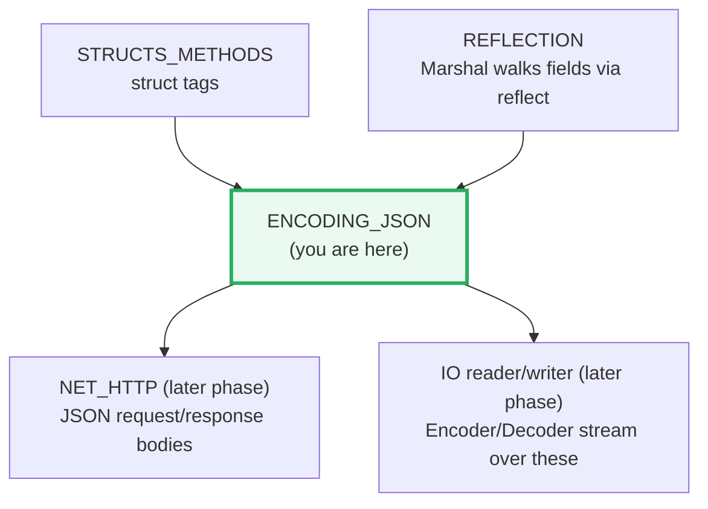
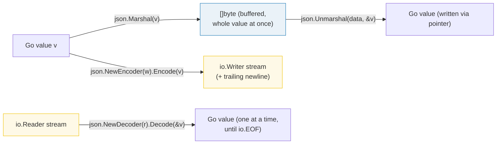
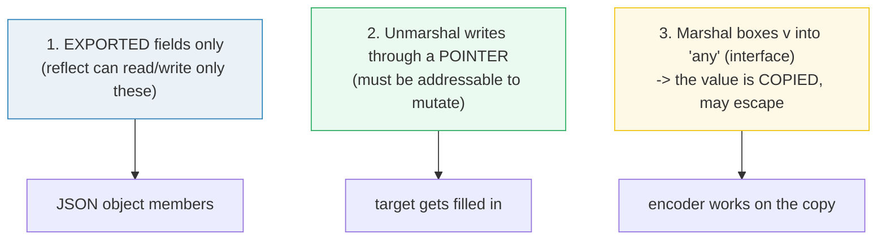
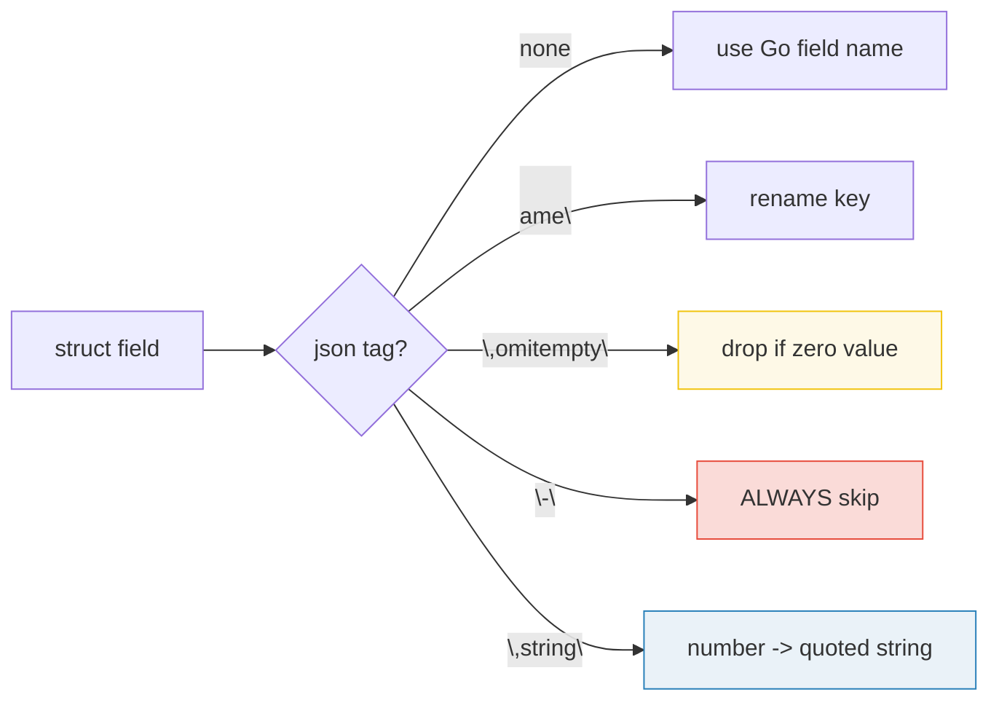

# ENCODING_JSON — Marshal, Unmarshal, Tags, Streaming & RawMessage

> **Goal (one line):** show, by printing every byte, how `encoding/json` turns Go
> values into JSON and back — struct tags, custom `(Un)MarshalJSON`, the streaming
> `Encoder`/`Decoder`, deferred parsing with `RawMessage`, and `json.Number`
> precision.
>
> **Run:** `go run encoding_json.go`
>
> **Ground truth:** [`encoding_json.go`](./encoding_json.go) → captured stdout in
> [`encoding_json_output.txt`](./encoding_json_output.txt). Every number/bytes
> literal below is pasted **verbatim** from that file under a
> `> From encoding_json.go Section X:` callout. Nothing is hand-computed.
>
> **Prerequisites:** 🔗 [`STRUCTS_METHODS`](./STRUCTS_METHODS.md) (struct **tags**
> are how you steer JSON keys) and 🔗 [`REFLECTION`](./REFLECTION.md) (`json`
> reads and writes struct fields *by reflection* — it never touches your methods
> directly). The streaming sections are built on `io.Reader`/`io.Writer`.

---

## 1. Why this bundle exists (lineage)

`encoding/json` is the stdlib's RFC-compliant JSON codec. It has one design that
shapes everything: **it is reflection-driven.** `Marshal` walks your value with
`reflect`, reads each exported field's name and `json:"..."` tag, and emits JSON.
`Unmarshal` does the inverse, allocating maps/slices/pointers as needed and
matching incoming keys to fields **case-insensitively**. There is no code
generation, no schema file — your struct *is* the schema.



The headline API is two functions and two streaming types:



The **buffering vs. streaming** split is the first expert fork: `Marshal`/
`Unmarshal` materialize the entire JSON in memory (fine for one message);
`Encoder`/`Decoder` work incrementally over a reader/writer (essential for large
or continuous streams like NDJSON). Section D pins the exact byte difference.

> From `pkg.go.dev/encoding/json` — `Marshal`: *"Marshal traverses the value v
> recursively… Struct values encode as JSON objects. Each exported struct field
> becomes a member of the object, using the field name as the object key, unless
> the field is omitted…"* And `Unmarshal`: *"Unmarshal parses the JSON-encoded
> data and stores the result in the value pointed to by v. If v is nil or not a
> pointer, Unmarshal returns an InvalidUnmarshalError."*

---

## 2. The mental model: value-vs-pointer and what reflection sees

Three rules govern the whole package. Every behavior in this bundle follows from
them:



- **Exported only.** A lowercase field is invisible to `reflect`, so `json` cannot
  read it on encode and cannot write it on decode. This is why Section A's
  `email` round-trips to `""` (🔗 `REFLECTION` — the third law: only addressable,
  exported fields are settable).
- **Unmarshal needs a pointer.** `json.Unmarshal(data, &v)` — the `&` is
  mandatory, because the decoder must *mutate* `v`. Pass a value (or `nil`) and
  you get `InvalidUnmarshalError`.
- **Marshal copies.** `Marshal(v any)` takes an `any`, so `v` is boxed into an
  interface header — for a struct that is a shallow copy onto the heap (🔗
  `ESCAPE_ANALYSIS`). The encoder therefore never mutates your original; a
  pointer field is followed, but the pointer itself is copied.

---

## 3. Section A — Marshal/Unmarshal round-trip (struct + map)

> From `encoding_json.go` Section A:
> ```
> User{Name:"Al", Age:42, email:"secret@x.io"}
>   -> Marshal  = {"name":"Al","age":42}
>   (note: email is unexported -> absent from JSON)
>   -> Unmarshal = {Name:Al Age:42 email:}  (email stayed zero: "")
> ```
> ```
> [check] Marshal(User) == {"name":"Al","age":42}: OK
> [check] round-trip: Name preserved: OK
> [check] round-trip: Age preserved: OK
> [check] round-trip: unexported email is lost (zero value): OK
> ```
> ```
> map[string]int{"zulu":1,"alpha":2,"mike":3}
>   -> Marshal  = {"alpha":2,"mike":3,"zulu":1}   (keys sorted: alpha,mike,zulu)
> ```
> ```
> [check] map keys sorted alphabetically: OK
> ```

**What.** `Marshal` turns the struct into the exact bytes
`{"name":"Al","age":42}`; `Unmarshal` parses those bytes back into a fresh `User`
and the exported fields match. The unexported `email` is dropped on encode and
stays `""` on decode — it cannot survive the trip.

**Why the struct bytes are exact and the map bytes are sorted.** For a *struct*,
`Marshal` emits fields in **declaration order** (not alphabetical), so the output
is fully deterministic — that is why this bundle can pin the literal string
`{"name":"Al","age":42}`. For a *map*, Go would normally iterate in random order
(🔗 the determinism rule in `HOW_TO_RESEARCH`), **but `json.Marshal` sorts map
keys alphabetically** before emitting them. So `{"zulu","alpha","mike"}` comes
out as `{"alpha","mike","zulu"}`. That is the single fact that lets us pin a map
literal too, and it is why re-running this bundle is byte-identical.

> From `pkg.go.dev/encoding/json` — `Marshal`: *"Map values encode as JSON
> objects. The map's key type must either be a string, an integer type, or
> implement encoding.TextMarshaler. The map keys are sorted…"*

---

## 4. Section B — Struct tags: `omitempty`, `"-"`, and `,string`



> From `encoding_json.go` Section B:
> ```
> Tagged{Visible:"hi", Hidden:"TOP SECRET", Age:0, Count:7}
>   -> Marshal  = {"visible":"hi","count":"7"}
>   (Age omitempty'd at 0; Hidden skipped via "-"; Count emitted as a string)
> ```
> ```
> [check] omitempty dropped Age (zero value): OK
> [check] json:"-" skipped Hidden: OK
> [check] ",string" emitted Count as a string: OK
> [check] exact bytes: OK
> ```

**What.** One struct, four tag directives, asserted byte-exact:

| Field | Tag | Result |
|---|---|---|
| `Visible "hi"` | `json:"visible"` | renamed key, present |
| `Hidden "TOP SECRET"` | `json:"-"` | **always omitted** |
| `Age 0` | `json:"age,omitempty"` | omitted (zero value) |
| `Count 7` | `json:"count,string"` | emitted as the string `"7"` |

**Why `omitempty` is a zero-check, not an "empty" check.** `omitempty` drops a
field whose value is the **zero value** of its type. Per the docs, "empty" means:
`false`, `0`, a `nil` pointer/interface, and any array/slice/map/string of length
zero. Two consequences experts hit:

1. **A zero-valued *struct* is NOT "empty"** — `omitempty` never omits a struct
   field (even `{}`), because a struct is not in the "empty" definition. Make the
   field a *pointer* to the struct if you need it dropped.
2. **`json:"-"` is unconditional** — it skips the field no matter its value. To
   actually have a JSON key named literally `"-"`, use `json:"-,"` (the trailing
   comma switches the meaning).

**Why `,string` exists.** Some JavaScript consumers mis-handle large integers; the
`,string` tag forces a numeric field out as a quoted JSON string. It applies only
to `string`, floating-point, integer, or boolean fields.

> From `pkg.go.dev/encoding/json` — `Marshal`: *"The 'omitempty' option specifies
> that the field should be omitted… false, 0, a nil pointer, a nil interface
> value, and any array, slice, map, or string of length zero… if the field tag is
> '-', the field is always omitted. Note that a field with name '-' can still be
> generated using the tag '-,'… The 'string' option signals that a field is
> stored as JSON inside a JSON-encoded string."*

---

## 5. Section C — Custom `MarshalJSON`: a type controls its own form

> From `encoding_json.go` Section C:
> ```
> LogItem{Level:LevelWarn, Msg:"disk 90%"}
>   -> Marshal  = {"level":"warn","msg":"disk 90%"}   (Level emitted as the quoted string "warn")
> ```
> ```
> [check] custom MarshalJSON: level == "warn": OK
>   -> Unmarshal = {Level:2 Msg:disk 90%}  ("warn" decoded back to LevelWarn)
> ```
> ```
> [check] custom UnmarshalJSON round-trips LevelWarn: OK
> ```
> ```
> var pLevel *Level // nil
>   -> Marshal(nil *Level) = null   (null; MarshalJSON NOT called)
> ```
> ```
> [check] nil *Level marshals to null (MarshalJSON skipped): OK
> ```

**What.** `Level` implements `json.Marshaler` (`MarshalJSON() ([]byte, error)`)
and `*Level` implements `json.Unmarshaler` (`UnmarshalJSON([]byte) error`). So
when `LogItem.Level` is marshaled, the encoder calls `Level.MarshalJSON`, which
returns `"warn"` — and the whole struct becomes
`{"level":"warn","msg":"disk 90%"}`. Unmarshaling reverses it: `"warn"` →
`LevelWarn`. This is the pattern for **enums** and for any custom wire format (a
non-standard timestamp, a trimmed number, a redacted secret).

**Why `MarshalJSON` must return *valid JSON bytes*.** The method does not return a
Go value to be re-encoded — it returns the *final* JSON fragment. So if you want
a JSON string, you must return it **already quoted**. The safe idiom is to call
`json.Marshal` on the inner Go value (here the plain string `"warn"`) so the
quoting and escaping are done for you. Returning the bare bytes `warn` (no quotes)
produces invalid JSON and a runtime error.

**The nil-pointer exception (the expert payoff).** The contract is subtle:
*"If an encountered value implements Marshaler and is **not a nil pointer**,
Marshal calls its MarshalJSON method."* A `nil *Level` therefore serializes to
`null` **without ever calling `MarshalJSON`** — the bundle pins exactly this
(`Marshal(nil *Level) = null`). This matters for pointer-receiver marshalers: a
nil pointer will *not* hit your method, so you cannot rely on `MarshalJSON` to
emit a default for nil. The corollary for `UnmarshalJSON`: it **is** called even
when the input is JSON `null`, so your unmarshaler must handle empty input.

> From `pkg.go.dev/encoding/json` — `Marshal`: *"If an encountered value
> implements Marshaler and is not a nil pointer, Marshal calls
> Marshaler.MarshalJSON to produce JSON."* `Marshaler` interface:
> `MarshalJSON() ([]byte, error)`; `Unmarshaler` interface:
> `UnmarshalJSON([]byte) error`.

---

## 6. Section D — Streaming `Encoder`/`Decoder` vs `Marshal`/`Unmarshal`

> From `encoding_json.go` Section D:
> ```
> value: {Msg:"<b>hi&bye</b>"}
>   Marshal        = {"msg":"\u003cb\u003ehi\u0026bye\u003c/b\u003e"}
>   Encoder.Encode = {"msg":"\u003cb\u003ehi\u0026bye\u003c/b\u003e"}
>    ^ note Encode added a trailing newline that Marshal does not
> ```
> ```
> [check] Encode output ends with newline: OK
> [check] Encode (minus newline) == Marshal output: OK
> ```
> ```
>   Encoder.SetEscapeHTML(false) = {"msg":"<b>hi&bye</b>"}
>    ^ raw <,>,& preserved; Marshal has no way to do this
> ```
> ```
> [check] SetEscapeHTML(false) keeps raw angle brackets/ampersand: OK
> ```
> ```
> stream of 3 concatenated JSON objects -> decoded IDs: [1 2 3]
> ```
> ```
> [check] streaming Decoder read all 3 in order: OK
> ```

**What.** For the same value, `Encoder.Encode` produces **exactly** the bytes
`Marshal` produces, **plus a trailing newline** — asserted byte-for-byte. Two
further behaviors only the streaming API exposes:

1. **HTML escaping is toggleable only on the `Encoder`.** By default both
   `Marshal` and `Encode` escape `<`, `>`, `&` to `\u003c`, `\u003e`, `\u0026`
   (so JSON is safe inside HTML `<script>` tags). `Marshal` has **no** option to
   disable this; `Encoder.SetEscapeHTML(false)` does. The bundle proves it: with
   escaping off, `<b>hi&bye</b>` survives verbatim.
2. **A `Decoder` consumes a stream of concatenated JSON values** one at a time,
   returning `io.EOF` when the input is exhausted — perfect for NDJSON/JSONL,
   where you cannot buffer the whole stream.

**Why streaming is "the same JSON, different plumbing."** `Marshal`/`Unmarshal`
allocate one `[]byte` holding the *entire* document. `Encoder`/`Decoder` wrap an
`io.Writer`/`io.Reader` and write/read incrementally, so they never hold the full
document (the real advantage for large or endless streams). The JSON *content* is
identical; only the newline and the buffering differ. **Note the newline trap:**
if you `Encode` into a buffer and then compare to a `Marshal` literal, the extra
`\n` will surprise you — strip it, or expect it.

> From `pkg.go.dev/encoding/json` — `Encoder.Encode`: *"writes the JSON encoding
> of v to the stream, with insignificant space characters elided, followed by a
> newline character."* `SetEscapeHTML`: *"specifies whether problematic HTML
> characters should be escaped… The default behavior is to escape &, <, and >."*
> `NewDecoder`/`Decode`: *"A Decoder reads and decodes JSON values from an input
> stream."*

---

## 7. Section E — `json.RawMessage`: defer parsing of a sub-field

```mermaid
graph TD
    J["JSON: {\"type\":\"rgb\",\"data\":{...}}"] --> U1["Unmarshal envelope<br/>(type + raw bytes)"]
    U1 --> T{"envelope.Type?"}
    T -->|"\"rgb\""| D1["Unmarshal Data into RGB"]
    T -->|"\"reading\""| D2["Unmarshal Data into Reading"]
    RM["json.RawMessage = []byte<br/>captures bytes, defers the parse"] -.-> T
    style RM fill:#fef9e7,stroke:#f1c40f,stroke-width:3px
```

> From `encoding_json.go` Section E:
> ```
> input: {"type":"rgb","data":{...}}
>   envelope.Type = "rgb"
>   envelope.Data = {"r":98,"g":218,"b":255}   (still raw bytes; not yet parsed)
>   decoded as RGB      -> {R:98 G:218 B:255}
> ```
> ```
> [check] RawMessage: RGB decoded with exact channels: OK
> ```
> ```
> input: {"type":"reading","data":{"temp":36.6}}
>   envelope.Data = {"temp":36.6}
>   decoded as Reading  -> {Temp:36.6}
> ```
> ```
> [check] RawMessage: second envelope parsed as Reading: OK
> [check] RawMessage kept bytes verbatim (deferred, not float64): OK
> ```

**What.** `json.RawMessage` is just `type RawMessage []byte`. It implements both
`Marshaler` and `Unmarshaler`, so when it appears as a field the codec **stores
the raw bytes verbatim instead of parsing them.** The bundle decodes an envelope
*first* (learning `Type`), then — depending on `Type` — decodes those stored
bytes into an `RGB` or a `Reading`. One field, many possible shapes: this is the
basis for **polymorphic JSON** (and it is exactly how `json`'s own
`MarshalJSON`/precomputed-JSON examples work).

**Why this beats "decode into `any`."** You could decode `data` into `any`, but
then every number becomes `float64` and every object becomes `map[string]any`,
losing all type safety and precision (see Section F). `RawMessage` keeps the
**exact original bytes** (asserted: `{"r":98,"g":218,"b":255}` survives
untouched) so a second `Unmarshal` into a real struct gets full type checking and
no precision loss. It is also how you precompute/forward JSON: marshal a
`RawMessage` you already trust without re-encoding it.

> From `pkg.go.dev/encoding/json` — `RawMessage`: *"a raw encoded JSON value. It
> implements Marshaler and Unmarshaler and can be used to delay JSON decoding or
> precompute a JSON encoding."*

---

## 8. Section F — `json.Number` vs `float64` (precision) & dynamic JSON

> From `encoding_json.go` Section F:
> ```
> input: {"id":9007199254740993}   (2^53 + 1)
>   default decode   -> float64 = 9.007199254740992e+15   -> int64 = 9007199254740992   (DRIFTED)
>   UseNumber decode -> json.Number = 9007199254740993   -> int64 = 9007199254740993   (EXACT)
> ```
> ```
> [check] float64 path drifted (precision lost): OK
> [check] json.Number path preserved exact int64: OK
> [check] json.Number.String() is the literal text: OK
> ```
> ```
> dynamic map[string]any -> Marshal = {"active":true,"meta":{"n":1},"name":"Al","tags":["go","json"]}
>   (flexible, but every access needs a type assertion; numbers are float64)
> ```
> ```
> [check] dynamic JSON marshals (keys sorted): OK
> ```

**What.** The integer `9007199254740993` is `2^53 + 1` — one more than `float64`
can represent exactly (it has 53 bits of significand). Decoding it into `any`
yields a `float64` that **rounds to `9007199254740992`** (drifted by one). With
`Decoder.UseNumber()`, the same digit string is kept as a `json.Number` — a
`string` holding the literal text — whose `.Int64()` returns the exact
`9007199254740993`.

**Why `float64` is the default (and why that bites).** When `Unmarshal` lands a
JSON number into an `interface{}` value, it stores a `float64` — *even if the
number is an integer in the source*. So a 64-bit ID, a timestamp in nanoseconds,
or a big serial number silently loses precision the moment you touch `any`. The
fix is `Decoder.UseNumber()` (decode into `any` with a `Decoder`, not
`Unmarshal`), which makes numbers come back as `json.Number`; you then call
`.Int64()`/`.Float64()`/`.String()` to convert on your terms. (`Marshal` does not
have this problem going *out*: an `int64` marshals to its exact digits.)

**Dynamic JSON = `map[string]any`.** When you cannot predict the schema, decode
into `map[string]any` (or `any`). The bundle shows it marshals cleanly (keys
sorted, so deterministic). The cost: **every** access needs a runtime type
assertion (`m["active"].(bool)`), and **every** number is the lossy `float64` —
which is exactly the trap above. Prefer structs whenever the shape is known; reach
for `map[string]any` only for truly arbitrary payloads.

> From `pkg.go.dev/encoding/json` — `Unmarshal`: numbers into `interface{}` land
> as *"float64, for JSON numbers"*. `Number`: *"a Number represents a JSON number
> literal"* (`type Number string`). `Decoder.UseNumber`: *"causes the Decoder to
> unmarshal a number into an interface value as a Number instead of as a
> float64."* The package **Security Considerations** note: *"Large JSON number
> integers will lose precision when unmarshaled into floating-point types."*

---

## 9. Pitfalls (the expert payoff)

| Trap | Symptom | Fix |
|---|---|---|
| Unexported field silently dropped | Field is `""`/`0` after a round-trip; no error | Rename the field to exported (capital), or expose it via a custom `(Un)MarshalJSON`. |
| `Unmarshal(data, v)` (no `&`) | `InvalidUnmarshalError` (must pass a non-nil pointer) | Always `json.Unmarshal(data, &v)` — the decoder writes through the pointer. |
| `omitempty` won't drop a zero-valued struct / `time.Time` | `{}` / `"0001-01-01T00:00:00Z"` appears | `omitempty` only sees the zero-value rule (structs are never "empty"); make the field a **pointer** so `nil` counts as empty. |
| Expecting `json:"-"` to keep the field | Field vanishes from output | `"-"` *always* omits; use `"-,"` if the JSON key must literally be `"-"`. |
| Custom `MarshalJSON` returns an unquoted string | runtime error: `invalid character 'x' after top-level value` | Return *valid JSON*; wrap with `json.Marshal(inner)` to get correct quoting/escaping. |
| Nil-pointer marshaler never called | `*T` that is `nil` emits `null`, not your default | The contract: `MarshalJSON` is skipped for nil pointers. Handle nil explicitly, or marshal a non-nil value. |
| `Encoder.Encode` output has an extra `\n` | byte-compare against a `Marshal` literal fails | `Encode` appends a newline `Marshal` does not — strip it or expect it. |
| `Marshal` escapes `<`,`>`,`&`; you can't turn it off | `\u003c`/`\u003e`/`\u0026` in output | Use `Encoder.SetEscapeHTML(false)` — `Marshal` has no such option. |
| `[]byte` marshals to a base64 string, not an array | `"Zm9v"` instead of `[102,111,111]` | `[]byte` is special-cased to base64; use `[N]uint8` or a slice of `int` for a JSON array of bytes. |
| Nil vs empty slice differ | `null` (nil) vs `[]` (empty, len 0) | `omitempty` treats an empty slice as empty; to always emit `[]`, initialize a non-nil empty slice. |
| Large integer ID decoded into `any` drifts | `9007199254740993` becomes `9007199254740992` | `Decoder.UseNumber()` then `.Int64()`; or decode directly into an `int64` field. |
| Unknown JSON keys silently ignored | Extra fields vanish, typo'd key not caught | `Decoder.DisallowUnknownFields()` to make unknown keys an error. |
| `More()` mis-used to detect end of a value stream | trailing garbage not reported as an error | Loop on `Decode` until `io.EOF`; `More()` is only for *elements within* an array/object. |

---

## 10. Cheat sheet

```go
// Marshal / Unmarshal (whole document in memory)
b, err := json.Marshal(v)          // []byte; reflection over EXPORTED fields; struct=decl order, map=sorted keys
err := json.Unmarshal(b, &v)       // MUST be a non-nil pointer; unknown keys ignored

// Struct tags (the field's "json:" key)
type T struct {
    A string `json:"a"`            // rename key
    B int    `json:"b,omitempty"`  // drop if zero value (0,false,"",nil,len-0)
    C string `json:"-"`            // ALWAYS skip
    D string `json:"-,"`           // JSON key literally "-"
    E int    `json:"e,string"`     // number emitted as a quoted string
}

// Custom serialization — implement these interfaces
type Marshaler   interface{ MarshalJSON() ([]byte, error) }   // return VALID JSON; nil *T -> null (method skipped)
type Unmarshaler interface{ UnmarshalJSON([]byte) error }     // copy input if you keep it past return

// Streaming over io.Reader/io.Writer (no full-document buffer)
enc := json.NewEncoder(w); enc.Encode(v)            // appends a '\n' Marshal does not
enc.SetEscapeHTML(false)                            // disable <,>,& escaping (Marshal can't)
dec := json.NewDecoder(r)
for { err := dec.Decode(&v); if err == io.EOF { break }; ... } // one value per call
dec.UseNumber()                                     // numbers -> json.Number, NOT float64
dec.DisallowUnknownFields()                         // error on unknown struct keys

// Deferred parse / polymorphic JSON
type Env struct{ Type string `json:"type"`; Data json.RawMessage `json:"data"` }
// unmarshal Env first, then Unmarshal(env.Data, &concrete) based on Type

// Precision: a Number into interface{} becomes float64 (loses precision > 2^53)
var n json.Number; i, _ := n.Int64(); n.String()   // exact digits, not float64

// Dynamic / schema-less: map[string]any (numbers are float64, access needs a type assertion)
```

---

## Sources

Every signature, tag directive, and behavioral claim above was verified against
the Go standard-library docs, then corroborated by independent secondary sources:

- `encoding/json` package — https://pkg.go.dev/encoding/json
  - Overview & Security Considerations (the JSON/RFC mapping; *"Large JSON number
    integers will lose precision when unmarshaled into floating-point types"*;
    case-insensitive key matching; unknown keys ignored unless
    `DisallowUnknownFields`): https://pkg.go.dev/encoding/json#pkg-overview
  - `Marshal` (recursive traversal; exported fields only; `"omitempty"`,
    `"-"`/`"-,"`, `",string"`, `"omitzero"`; map keys sorted; `[]byte`→base64;
    *"if an encountered value implements Marshaler and is not a nil pointer,
    Marshal calls MarshalJSON"*): https://pkg.go.dev/encoding/json#Marshal
  - `Unmarshal` (must be a non-nil pointer; numbers into `interface{}` land as
    `float64`; null→nil for interface/map/pointer/slice): https://pkg.go.dev/encoding/json#Unmarshal
  - `Marshaler` / `Unmarshaler` interfaces: https://pkg.go.dev/encoding/json#Marshaler
  - `Encoder.Encode` (*"followed by a newline character"*),
    `Encoder.SetEscapeHTML` (*"default behavior is to escape &, <, and >"*),
    `NewDecoder`/`Decoder.Decode`: https://pkg.go.dev/encoding/json#Encoder
  - `Decoder.UseNumber` (*"as a Number instead of as a float64"*),
    `Decoder.DisallowUnknownFields`: https://pkg.go.dev/encoding/json#Decoder
  - `type Number string` (`Float64`/`Int64`/`String`): https://pkg.go.dev/encoding/json#Number
  - `type RawMessage []byte` (*"delay JSON decoding or precompute a JSON
    encoding"*; implements Marshaler and Unmarshaler): https://pkg.go.dev/encoding/json#RawMessage
- Go Blog — *"JSON and Go"* (Andrew Gerrand): the canonical intro to the package
  (Marshal/Unmarshal, type-driven decoding, RawMessage deferred parsing):
  https://go.dev/blog/json
- Secondary corroboration (>=2 independent sources, web-verified):
  - Alex Edwards — *"Surprises and gotchas when working with JSON"* (map keys
    sorted; `[]byte`→base64; nil vs empty slice differ; angle brackets/ampersands
    escaped; `omitempty` never omits a struct/`time.Time`; the `string` tag;
    numbers into `interface{}` yield `float64`; `MarshalJSON` strings must be
    quoted; `More()` misuse): https://www.alexedwards.net/blog/json-surprises-and-gotchas
  - Go issue #48430 — *"Marshal skips checking Marshaler implementation for nil
    pointer"* (the nil-pointer `Marshaler` exception asserted in Section C):
    https://github.com/golang/go/issues/48430

**Facts that could not be verified by running** (documented, not executed,
because reproducing them as printable output would either need an intentionally
broken `MarshalJSON` or a stream with trailing garbage): a custom
`MarshalJSON` returning an unquoted string yields a runtime `invalid character`
error; and `More()` silently accepts malformed trailing bytes. These are
confirmed by the `pkg.go.dev/encoding/json` docs and the Alex Edwards source
above, not reproduced as runnable output (a file triggering them would not pass
`just check`).
