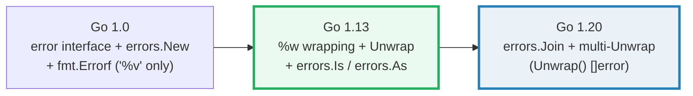
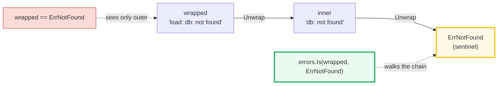

# ERRORS — The `error` Interface, Wrapping, Is/As/Join & panic/recover

> **Goal (one line):** by printing every value, show how Go's built-in `error`
> interface, sentinel errors, `%w` wrapping, `errors.Is`/`As`/`Unwrap`/`Join`,
> and `panic`/`recover` actually behave.
>
> **Run:** `go run errors.go`
>
> **Ground truth:** [`errors.go`](./errors.go) → captured stdout in
> [`errors_output.txt`](./errors_output.txt). Every number/table below is pasted
> **verbatim** from that file under a `> From errors.go Section X:` callout.
> Nothing is hand-computed.
>
> **Prerequisites:** 🔗 [`VALUES_TYPES_ZERO`](./VALUES_TYPES_ZERO.md) (the zero
> value of an interface is `nil`), 🔗 [`INTERFACES_BASICS`](./INTERFACES_BASICS.md)
> (structural satisfaction; the `(type, value)` pair), 🔗
> [`CONTROL_FLOW_DEFER`](./CONTROL_FLOW_DEFER.md) (defer LIFO; `recover` lives
> in a deferred function).

---

## 1. Why this bundle exists (lineage)

Go takes an **unusual** position on errors: there is no `try`/`catch`. Errors
are **ordinary values** — specifically, values of the built-in interface
`type error interface { Error() string }`. The canonical pattern is therefore
literal:

```go
if err := doWork(); err != nil {
    return err
}
```

This looks verbose to newcomers (Java/Python refugees reach for `panic`/`recover`
as if it were `throw`/`catch` — **do not**; see §7). The payoff is that errors
flow through the same value/pointer semantics as everything else, are explicit
at every call site, and compose with the type system.

The history that produced today's API (this is the "old → new" story):



- **Go 1.0** gave us the interface, `errors.New`, and `fmt.Errorf` (with `%v`
  for *formatting* an inner error). The only way to "match" an error was `==`.
  That worked for **sentinels** (package-level singletons like `io.EOF`,
  `sql.ErrNoRows`) — but the moment you *added context* with `%v`, the chain was
  broken and `==` could no longer find the original sentinel.
- **Go 1.13** fixed that: the `%w` verb in `fmt.Errorf` produces an error with
  an `Unwrap() error` method; `errors.Is` (identity walk) and `errors.As` (type
  walk) traverse the chain; `errors.Unwrap` peels one layer. This is the
  foundation of modern error handling.
- **Go 1.20** generalized the chain into a **tree** with `errors.Join` and the
  `Unwrap() []error` method, so one error can wrap *several* — the natural fit
  for parallel/fan-out work where multiple sub-tasks each fail.

This bundle exercises **all three eras** in six runnable sections.

---

## 2. The mental model: the error tree

An error `e` **wraps** another error if `e`'s type has an `Unwrap() error`
method (single child) **or** an `Unwrap() []error` method (multiple children).
Successive unwrapping therefore forms a **tree**, not just a list. `errors.Is`
and `errors.As` traverse that tree **pre-order, depth-first**.

```mermaid
graph TD
    W["wrapped<br/>fmt.Errorf(\"load: %w\", inner)"] -->|Unwrap| I["inner<br/>fmt.Errorf(\"db: %w\", ErrNotFound)"]
    I -->|Unwrap| S["ErrNotFound<br/>(sentinel)"]
    J["joined = errors.Join(e1, e2)"] -->|Unwrap &#40;&#41; &#91;&#93;error| E1["e1"]
    J -->|Unwrap &#40;&#41; &#91;&#93;error| E2["e2"]
    style S fill:#fef9e7,stroke:#f1c40f,stroke-width:3px
    style J fill:#eaf2f8,stroke:#2980b9,stroke-width:3px
```

> From `pkg.go.dev/errors` (overview): "An error e wraps another error if e's
> type has one of the methods `Unwrap() error` or `Unwrap() []error`... Successive
> unwrapping of an error creates a tree. The `Is` and `As` functions inspect an
> error's tree by examining first the error itself followed by the tree of each
> of its children in turn (pre-order, depth-first traversal)."

Two traversal verbs, two purposes:

| Verb | What it matches | Use it for |
|---|---|---|
| `errors.Is(err, target)` | **identity** — `err == target` anywhere in the tree (or a custom `Is(error) bool` returns true) | **sentinel** errors (`io.EOF`, `sql.ErrNoRows`, `fs.ErrNotExist`) |
| `errors.As(err, &target)` | **type** — the first error in the tree assignable to `*target`'s type | **typed** errors that carry fields you want to read (`*fs.PathError`, a custom `MyError{Code int}`) |

---

## 3. Section A — `error` is a built-in one-method interface

> From `errors.go` Section A:
> ```
> var e error            -> <nil>   (zero value: a nil interface)
> e == nil               -> true
> nfe := NotFoundError{Item:"X"}; var asErr error = nfe
>     asErr              -> not found: X
>     concrete type      -> main.NotFoundError   (the dynamic type behind the interface)
> errors.New("dup") == errors.New("dup") -> false   (distinct instances; reuse a sentinel)
> ```
> ```
> [check] zero value of the error interface is nil: OK
> [check] NotFoundError satisfies error (assignable to error): OK
> [check] NotFoundError{X}.Error() == "not found: X": OK
> [check] two errors.New with same text are distinct (a != b): OK
> ```

**What.** `error` is a predeclared interface with exactly one method:

```go
type error interface { Error() string }
```

Any type — struct, int, string, pointer — that has an `Error() string` method
*is* an error. There is no `implements` keyword; satisfaction is **structural**
and checked at the assignment site (`var asErr error = nfe` compiles iff
`NotFoundError` has `Error() string`). See 🔗 [`INTERFACES_BASICS`](./INTERFACES_BASICS.md).

**Why — the nil interface is what makes `if err != nil` work.** The zero value
of the `error` interface is `nil` — a `(type=nil, val=nil)` pair (the two-word
interface representation). A function declared to return `error` therefore
returns a nil interface until something assigns a real error. That is the entire
basis of the idiom. Beware the 🔗 [`NIL_INTERFACE_TRAP`](./NIL_INTERFACE_TRAP.md):
an interface holding a **nil pointer** is *not* a nil interface, so
`return myNilErrPointer` makes `err != nil` true even when "nothing went wrong".

**Why `errors.New` returns distinct values.** Each call to `errors.New`
allocates a fresh `*errorString`. Two calls with identical text are **not**
`==`. That is why a **sentinel** must be declared **once** at package scope
(`var ErrX = errors.New(...)`) and reused by name — recreating it per call would
make `==` and `errors.Is` both miss. Section B leans on exactly this.

---

## 4. Section B — Sentinels & `errors.Is` (walks the Unwrap chain)



> From `errors.go` Section B:
> ```
> wrap chain (built bottom-up with %w):
>   ErrNotFound (sentinel) = errors.New("not found")
>   inner   = fmt.Errorf("db:   %w", ErrNotFound)   -> "db: not found"
>   wrapped = fmt.Errorf("load: %w", inner)         -> "load: db: not found"
> errors.Is(wrapped, ErrNotFound)        = true   (walked the chain)
> wrapped == ErrNotFound                 = false   (== sees only the outer error)
> errors.Unwrap(wrapped)                 = "db: not found"   (one step -> inner)
> errors.Unwrap(errors.Unwrap(wrapped))  = "not found"   (two steps -> the sentinel)
> ```
> ```
> [check] errors.Is(wrapped, ErrNotFound) is true: OK
> [check] wrapped == ErrNotFound is false (identity differs): OK
> [check] two Unwrap steps reach the sentinel: OK
> ```

**What.** `errors.Is(err, target)` reports whether **any** error in `err`'s tree
matches `target`. `errors.Unwrap(err)` peels exactly **one** layer (calling the
`Unwrap() error` method). Both were added in Go 1.13.

**Why `Is` wins over `==`.** Once an error is wrapped, `==` is **blind** to the
inner sentinel — it compares only the outer `*wrapError` pointer, which is never
the same object as `ErrNotFound`. `errors.Is` walks `wrapped → inner → ErrNotFound`
and matches. The `pkg.go.dev/errors` guidance is explicit: prefer
`errors.Is(err, fs.ErrExist)` over `err == fs.ErrExist` "because the former will
succeed if err wraps `io/fs.ErrExist`."

> From `go.dev/blog/go1.13-errors`: "The `fmt.Errorf` function has long had a
> `%v` formatting verb... Go 1.13 adds a new `%w` verb... The error returned by
> `fmt.Errorf` will have an `Unwrap` method returning the argument." And:
> "`errors.Is`... reports whether any error in the tree matches target."

**Why `errors.Is` and not `errors.Unwrap` in a loop?** A custom error can
implement a custom `Is(error) bool` method (e.g. `syscall.Errno.Is` maps whole
*families* of errno values to a single target). `Is` honors that; a hand-rolled
`==`/`Unwrap` loop does not. Standard sentinels you should know:
- 🔗 [`IO_READER_WRITER`](./IO_READER_WRITER.md) — `io.EOF` (`var EOF = errors.New("EOF")`).
- 🔗 [`DATABASE_SQL`](./DATABASE_SQL.md) — `sql.ErrNoRows`
  (`var ErrNoRows = errors.New("sql: no rows in result set")`).

---

## 5. Section C — `errors.As` (extract a typed error from the chain)

> From `errors.go` Section C:
> ```
> source  = NotFoundError{Item:"X"}
> wrapped = fmt.Errorf("lookup: %w", fmt.Errorf("cache: %w", source)) -> "lookup: cache: not found: X"
> var target NotFoundError; errors.As(wrapped, &target) -> true
> target.Item = "X"   (the field survived the wrap chain)
> ```
> ```
> [check] errors.As found NotFoundError in the chain: OK
> [check] target.Item == "X" (per-call context preserved): OK
> errors.As(errors.New("something else"), &miss) -> false   (target untouched: "PRESET")
> ```
> ```
> [check] errors.As returns false when the type is absent in the chain: OK
> [check] errors.As leaves target untouched on failure (still PRESET): OK
> ```

**What.** `errors.As(err, &target)` walks `err`'s tree; when it finds an error
whose concrete type is **assignable** to `*target`'s type, it copies that error
into `*target` and returns `true`. Otherwise it returns `false` and **leaves
`target` untouched** (the `"PRESET"` value survives — proven by the check).

**Why typed errors beat sentinels.** A sentinel (`ErrNotFound`) only answers
*"did this class of thing happen?"* — it carries **no per-call context**. A
**typed error** (a struct implementing `error`, like `NotFoundError{Item string}`)
answers *"what exactly went wrong?"* and lets the caller branch on fields:
`target.Item`, `target.Code`, `target.Path`, etc. The idiomatic pairing is:

```go
var pathErr *fs.PathError
if errors.As(err, &pathErr) {
    log.Println("failed at", pathErr.Path)   // read a field off the typed error
}
```

`errors.As` is implemented in terms of type assertions internally — see 🔗
[`TYPE_ASSERTIONS`](./TYPE_ASSERTIONS.md). It will **panic** if `target` is not a
non-nil pointer to a type that implements `error` (or to `any`).

> From `pkg.go.dev/errors` (`As`): "As finds the first error in err's tree that
> matches target, and if one is found, sets target to that error value and
> returns true. Otherwise, it returns false." And it "panics if target is not a
> non-nil pointer to either a type that implements error, or to any interface
> type."

**Custom matching.** Like `Is`, a type can override `As` by implementing
`As(any) bool` — letting one error type masquerade as another (used in the stdlib
by `*fs.PathError` and friends).

---

## 6. Section D — `%w` (wrap) vs `%v` (format-only, breaks the chain)

> From `errors.go` Section D:
> ```
> withW = fmt.Errorf("open: %w", ErrNotFound) -> "open: not found"
> withV = fmt.Errorf("open: %v", ErrNotFound) -> "open: not found"   (SAME text!)
> The Error() strings are identical — the ONLY difference is the Unwrap method:
> errors.Unwrap(withW)        = "not found"   (%w produced an Unwrap() error method)
> errors.Unwrap(withV)        = <nil>   (%v produced NO Unwrap method -> nil)
> errors.Is(withW, ErrNotFound) = true   (chain alive)
> errors.Is(withV, ErrNotFound) = false   (chain BROKEN)
> ```
> ```
> [check] %w keeps the chain: errors.Is(withW, ErrNotFound) is true: OK
> [check] %v breaks the chain: errors.Is(withV, ErrNotFound) is false: OK
> [check] %w gives an Unwrap method (non-nil): OK
> [check] %v gives no Unwrap method (nil): OK
> ```

**What.** `fmt.Errorf` with `%w` **wraps** the argument (the returned error gets
an `Unwrap() error` method pointing at it); `%v` merely **stringifies** it and
discards the original. The two produce **byte-identical `Error()` text**, which
is exactly why `%v` is a *silent* bug — your logs look fine, but
`errors.Is(err, sentinel)` quietly stops matching.

**Why — the rule of thumb.** The Go blog's guidance: **wrap with `%w` when you
want callers to be able to test/handle the inner error** (`errors.Is`/`As` still
reach it); **use `%v` when the inner error is an implementation detail you want
to hide** and you don't want callers branching on it. Reaching for `%v` by
default is a defensive choice; reaching for `%w` by default is the common one.
Either way, **be deliberate** — the choice changes the observable API.

> From `go.dev/blog/go1.13-errors`: "If you do want callers to be able to match
> on the wrapped error, use `%w`; otherwise use `%v`."

A `fmt.Errorf` call may include **multiple** `%w` verbs (Go 1.20+); the returned
error then exposes the `Unwrap() []error` form — the same multi-error shape as
`errors.Join` (Section E).

---

## 7. Section E — `errors.Join` (1.20) & multi-Unwrap (`[]error`)

> From `errors.go` Section E:
> ```
> e1     = errors.New("disk full") -> "disk full"
> e2     = errors.New("timeout")    -> "timeout"
> joined = errors.Join(e1, e2)
>     joined.Error() = "disk full\ntimeout"   (newline-joined messages)
> errors.Is(joined, e1) = true   (branch 1)
> errors.Is(joined, e2) = true   (branch 2)
> errors.Unwrap(joined)        = <nil>   (single-Unwrap does NOT see Join)
> joined.Unwrap() []error       = ["disk full" "timeout"]   (the multi-error branch list)
> ```
> ```
> [check] errors.Is(joined, e1) is true (branch 1): OK
> [check] errors.Is(joined, e2) is true (branch 2): OK
> [check] plain errors.Unwrap(joined) is nil (Join uses the []error form): OK
> [check] joined multi-Unwrap has exactly 2 branches: OK
> ```

**What.** `errors.Join(errs...)` (Go 1.20) returns one error that wraps **every**
non-nil argument; its `Error()` is the messages joined by newlines, and its
`Unwrap() []error` returns the list. `errors.Is`/`As` reach **every branch**.

**The expert detail (the `[check]`-guarded one).** There are **two** `Unwrap`
shapes: `Unwrap() error` (single child) and `Unwrap() []error` (children). The
standalone `errors.Unwrap` function **only** calls the **single** form — so on a
joined error it returns `nil`. To see the branches you must type-assert to
`interface{ Unwrap() []error }` yourself. This is by design: `errors.Unwrap` is
the one-step peeler; `Is`/`As` are the tree walkers.

> From `pkg.go.dev/errors` (`Join`): "Join returns an error that wraps the given
> errors. Any nil error values are discarded... A non-nil error returned by Join
> implements the `Unwrap() []error` method. The errors may be inspected with Is
> and As." And (`Unwrap`): "Unwrap only calls a method of the form `Unwrap() error`.
> In particular Unwrap does not unwrap errors returned by Join."

**When to use it.** Fan-out: a function that runs N sub-tasks concurrently and
wants to surface **all** their failures, not just the first. (Later phases cover
`errgroup`; `errors.Join` is the stdlib primitive underneath such patterns.)

---

## 8. Section F — `panic` & `recover` (programmer errors, NOT control flow)

> From `errors.go` Section F:
> ```
> deliberatePanic: panic("boom...") recovered -> "boom: unrecoverable programmer error"   (type string)
>     the function returned NORMALLY despite the panic
> indexOutOfRange: s[10] on a len-3 slice -> runtime panic recovered:
>     value = runtime error: index out of range [10] with length 3
>     implements error? true   (runtime.Error satisfies error)
> recover() called directly (not deferred) = <nil>   (nil: only works in a defer)
> ```
> ```
> [check] recover caught the string panic value: OK
> [check] runtime panic value implements error (runtime.Error): OK
> [check] recover() outside a defer returns nil: OK
> ```

**What.** `panic` stops the current function, runs its **deferred** functions
(LIFO), and unwinds the stack to the caller — which *also* runs its defers — and
so on, until a deferred `recover()` catches it. `recover()` returns the panic
value **only** when called from the deferred function of the panicking
**goroutine**; everywhere else it is `nil`.

**Why `recover` is scoped so tightly.** A panic is fundamentally a **goroutine**
event: the runtime panics *this* goroutine. If a goroutine panics with no
recovered defer, the **whole program crashes** (the runtime prints the stack and
exits non-zero) — `recover` in another goroutine cannot help. That is why the
two `recover`s that *work* above live inside `defer` of the function that
panicked (`deliberatePanic`, `indexOutOfRange`), while the bare `recover()` in
`sectionF` returns `nil`.

**Why runtime panics carry an `error`.** Index-out-of-range, nil-pointer
dereference, divide-by-zero, and concurrent-map-write produce a `runtime.Error`
value — an interface that **satisfies `error`** (it has both `Error() string`
and `RuntimeError()`). That is why `rec.(error)` succeeds on the recovered
slice-index panic above. It ties panics back to the `error` type: even a crash
value is still an error you can inspect (and convert to a returned error if you
choose).

> From `go.dev/ref/spec` (*Handling panics*): "A panic during the execution of
> function F terminates F... execution of all deferred functions... A call to
> `recover`... [returns] the value passed to `panic`... [only] within the
> deferred function." And from `go.dev/blog/defer-panic-and-go`: "recover...
> stops the panicking sequence by restoring normal execution... [and] only works
> in the deferred function."

**The cardinal rule.** Use `panic`/`recover` for **truly unrecoverable /
programmer errors** — a broken invariant, an impossible state, a nil deref, a
malformed input that should never reach production. **Do not** use it for normal,
expected failures (file not found, network timeout, "no rows"); those are
**values** (`error`) and flow through `if err != nil`. Treating `panic` as
`throw`/`catch` produces code that crashes unpredictably and hides bugs. The
honest pattern for "this can't happen" is:

```go
defer func() {
    if r := recover(); r != nil {
        // log, flush, convert to an error, or re-panic — but do NOT silently swallow.
    }
}()
```

Defer mechanics (LIFO order, argument snapshot, named-return mutation) are the
prerequisite here — see 🔗 [`CONTROL_FLOW_DEFER`](./CONTROL_FLOW_DEFER.md).

---

## 9. Pitfalls (the expert payoff)

| Trap | Symptom | Fix |
|---|---|---|
| `==` on a wrapped error | `if err == io.EOF` is **false** even though EOF was the cause | Use `errors.Is(err, io.EOF)`; reserve `==` for bare, unwrapped sentinels. |
| Using `%v` where `%w` was meant | `errors.Is` quietly stops matching; logs look fine | Use `%w` to keep the chain; reserve `%v` for hiding implementation detail. |
| Returning a nil typed pointer as `error` | `if err != nil` is **true** with a nil inside (the 🔗 `NIL_INTERFACE_TRAP`) | Return a bare `nil`, not a typed nil; or return a concrete non-nil error. |
| `recover()` outside a `defer` | Always `nil` — the panic keeps unwinding | Put `recover()` *inside* the deferred function of the panicking goroutine. |
| Panicking across goroutines | Unrecovered goroutine panic **crashes the whole program** | Each goroutine's top-level function should defer a `recover` (e.g. an `http.Handler`). |
| `errors.As(err, target)` where `target` is not `*T` | **panic**: "target must be a non-nil pointer" | Pass `&target` (a `**PathError`), never the value itself. |
| Recreating a sentinel per call (`return errors.New("not found")`) | `errors.Is`/`==` never match across functions | Declare `var ErrX = errors.New(...)` once at package scope; reuse the name. |
| Inspecting `errors.Join` with `errors.Unwrap` | Gets `nil` — thinks there is no inner error | Use `Is`/`As`, or type-assert to `interface{ Unwrap() []error }`. |
| Using `panic`/`recover` for expected failures | Crashes where a returned error belonged | Return `error`; reserve `panic` for impossible/programmer states. |
| Swallowing errors (`_ = err`) | Silent data loss / wrong behavior | Always handle: return wrapped, log, or explicitly convert. |
| Comparing a `string`-backed error by text | `err.Error() == "x"` breaks when wording changes | Compare by identity/type (`errors.Is`/`As`), never by message text. |

---

## 10. Cheat sheet

```go
// The type (built-in):
//   type error interface { Error() string }
//   zero value of the interface is nil -> makes `if err != nil` work.

// Create:
e := errors.New("boom")              // sentinel; EACH call is a DISTINCT value
e := fmt.Errorf("user %q: %w", u, inner)  // %w WRAPS (adds an Unwrap() error method)
e := fmt.Errorf("user %q: %v", u, inner)  // %v formats only (NO Unwrap; chain broken)
e := errors.Join(e1, e2, e3)         // 1.20+; Unwrap() []error; nil args dropped

// Match (walk the tree, pre-order DFS):
errors.Is(err, sentinel)             // identity match -> bool (use for sentinels)
var t *MyErr; errors.As(err, &t)     // type match -> sets t, bool (use for typed errors)

// Peel (single layer only):
errors.Unwrap(err)                   // calls Unwrap() error ONLY; nil on Join / %v

// Custom matching: implement
//   func (e MyErr) Is(target error) bool { ... }   // override identity matching
//   func (e MyErr) As(target any) bool { ... }     // override type matching

// panic / recover (programmer errors, NOT normal control flow):
defer func() { if r := recover(); r != nil { /* log/flush/convert */ } }()
// recover() is non-nil ONLY in the deferred func of the panicking goroutine;
// runtime panics (nil deref, index OOR) carry a runtime.Error that satisfies error.

// Rule of thumb:
//   expected failure   -> return error   (value)
//   impossible state   -> panic           (rare; recover at a boundary if at all)
```

---

## Sources

Every signature, version, and behavioral claim above was verified against the Go
specification, standard-library docs, and the official Go blog (≥2 independent
sources):

- The Go Programming Language Specification — https://go.dev/ref/spec
  - *Errors* (the predeclared `error` interface): https://go.dev/ref/spec#Errors
  - *Handling panics* (`recover` semantics, deferred execution): https://go.dev/ref/spec#Handling_panics
  - *Run-time panics* (nil deref, index out of range, etc.): https://go.dev/ref/spec#Run_time_panics
- `errors` package — https://pkg.go.dev/errors  (authoritative for `Is`/`As`/`Join`/`Unwrap`/`New`;
  the error-tree overview; the two `Unwrap` shapes `() error` vs `() []error`;
  "Unwrap does not unwrap errors returned by Join"; "target must be a non-nil
  pointer"; custom `Is`/`As` methods). Version cited: go1.26.4.
- `fmt` package — https://pkg.go.dev/fmt  (`Errorf`; the `%w` wrap verb vs `%v`
  format-only; multiple `%w` produces `Unwrap() []error`).
- `builtin` package — https://pkg.go.dev/builtin  (the `error` interface;
  `Error() string`).
- `io` package — https://pkg.go.dev/io  (`var EOF = errors.New("EOF")`, the
  canonical sentinel).
- `database/sql` package — https://pkg.go.dev/database/sql
  (`var ErrNoRows = errors.New("sql: no rows in result set")`).
- Go Blog — *Working with Errors in Go 1.13* — https://go.dev/blog/go1.13-errors
  (`%w` and `Unwrap`; prefer `errors.Is` to `==`; when to use `%w` vs `%v`).
- Go Blog — *Defer, Panic, and Recover* — https://go.dev/blog/defer-panic-and-go
  (panic unwinds the stack running defers; `recover` only in a deferred
  function; "real" use is a recovered panic converted to an error).
- Go Blog — *Error handling and Go* — https://go.dev/blog/error-handling-and-go
  (the `error` interface; `if err != nil` as the standard pattern).
- Datadog — *A practical guide to error handling in Go* —
  https://www.datadoghq.com/blog/go-error-handling/  (corroborating practitioner
  guidance on `%w`/`%v` and `Is`/`As`).
- DoltHub — *Golang Panic Recovery* — https://www.dolthub.com/blog/2026-01-09-golang-panic-recovery/
  (corroborating: `recover` only when called directly by a deferred function
  during panic unwinding; goroutine-local nature).

**Facts that could not be verified by running** (documented, not executed):
`errors.As` *panics* when `target` is not a non-nil pointer to an error/`any`
type — reproduced as prose only (a triggering call would crash `go run` and fail
`just check`); confirmed by the `pkg.go.dev/errors` `As` documentation. The
"unrecovered goroutine panic crashes the whole process" behavior is likewise
documented rather than triggered (a deliberate crash would abort the sweep).
