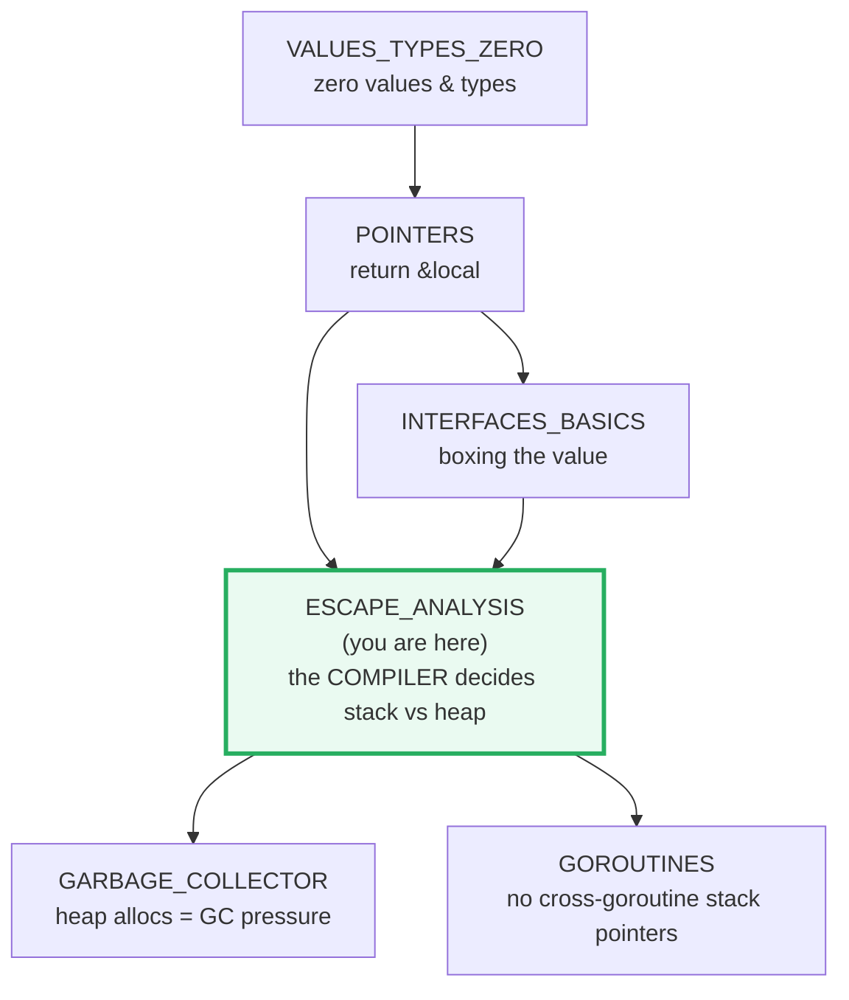
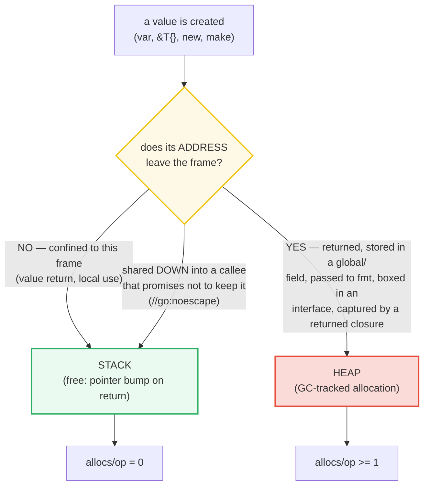
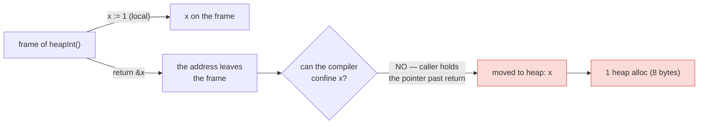
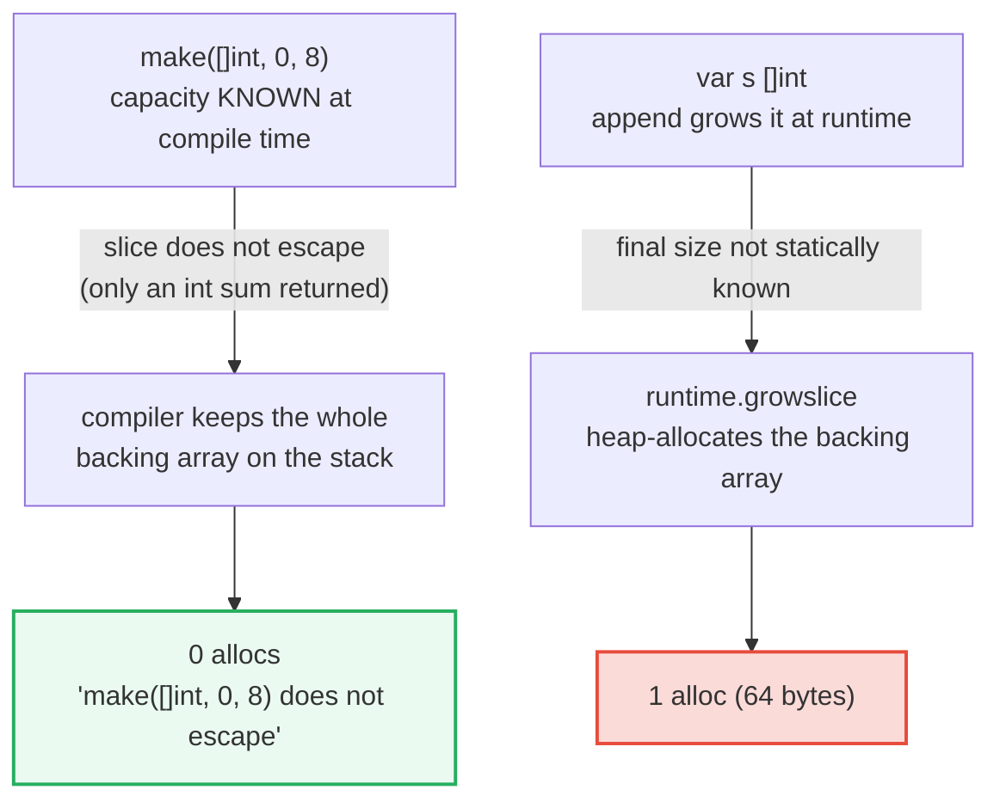
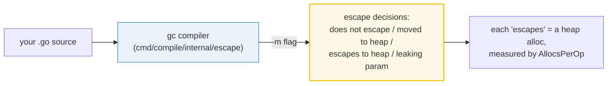

# ESCAPE_ANALYSIS — Escape Analysis: Who Goes to the Heap?

> **Goal (one line):** show, by **measuring allocation counts**, that the
> **compiler** — not the `new`/`&` keyword — decides stack vs heap via **escape
> analysis**, and that fewer escapes mean a faster, GC-lighter program.
>
> **Run:** `go run escape_analysis.go`
>
> **Ground truth:** [`escape_analysis.go`](./escape_analysis.go) → captured
> stdout in [`escape_analysis_output.txt`](./escape_analysis_output.txt). Every
> `allocs/op` and `bytes/op` below is **measured** by `testing.Benchmark` and
> pasted **verbatim** from that file under a
> `> From escape_analysis.go Section X:` callout. Nothing is hand-computed.
>
> **Prerequisites:** 🔗 [`POINTERS`](./POINTERS.md) (returning `&local`, value
> vs pointer semantics), 🔗 [`INTERFACES_BASICS`](./INTERFACES_BASICS.md) (the
> 2-word `(type, value)` pair and boxing), and 🔗
> [`FUNCTIONS_CLOSURES`](./FUNCTIONS_CLOSURES.md) (closures capturing by
> reference). 🔗 [`VALUES_TYPES_ZERO`](./VALUES_TYPES_ZERO.md) (zero values &
> the type system) is assumed.

---

## 1. Why this bundle exists (lineage)

This is the **flagship internals bundle**: it sits at the hinge where syntax
ends and the *compiler's* reasoning begins. The single most common misconception
about Go memory is:

> *"`new` and `&` allocate on the heap; plain values allocate on the stack."*

That is **wrong**. From the Ardan Labs series: *"Escape analysis is the process
that the compiler uses to determine the placement of values that are created by
your program… In Go, there is no keyword or function you can use to direct the
compiler in this decision. It's only through the convention of how you write
your code that dictates this decision."* The **compiler** chooses — and it
chooses based on whether a value's address or lifetime can be **proven confined
to a single stack frame**. If it can't, the value **escapes to the heap**.



**Why the heap is more expensive.** From Ardan Labs: *"The heap is not self
cleaning like stacks, so there is a bigger cost… the costs are associated with
the garbage collector (GC), which must get involved to keep this area clean.
When the GC runs, it will use 25% of your available CPU capacity. Plus, it can
potentially create microseconds of 'stop the world' latency."* Stack allocation
is essentially **free** — reclaimed by moving the stack pointer when the frame
pops, no GC involvement. So the whole game of "Go performance" reduces, in large
part, to: **help the compiler prove things don't escape.** That is what this
bundle measures.

---

## 2. The mental model: the compiler decides, via a decision tree

Escape analysis is a **static, compile-time** pass (it lives in
`cmd/compile/internal/escape`). It walks every value and asks, for each, one
question with branches:



The key word is **prove**. Escape analysis is conservative: when it *cannot*
prove a value stays on the stack, it **must** assume it escapes (and heap-allocate)
to preserve correctness. From Ardan Labs: *"Anytime a value is shared outside
the scope of a function's stack frame, it will be placed (or allocated) on the
heap."* The deep reason is architectural: *"No goroutine is allowed to have a
pointer that points to memory on another goroutine's stack"* (stacks can be
replaced when they grow/shrink), so anything whose address could cross frames
must live on the heap, where pointers to it stay valid.

**You see the decisions with `-gcflags=-m`.** From `pkg.go.dev/cmd/compile`, the
`-m` flag *"Print[s] optimization decisions. Higher values or repetition produce
more detail."* The output uses a precise vocabulary:

| `-gcflags=-m` phrase | Meaning |
|---|---|
| `does not escape` | value proven confined to the stack — **free** |
| `moved to heap: x` | a local `x` had to be heap-allocated (e.g. `return &x`) |
| `escapes to heap` | an address/value crosses the frame boundary |
| `leaking param: p` | parameter `p`'s lifetime leaks out of the function |
| `func literal escapes to heap` | a closure value is heap-allocated |

> ⚠️ This bundle has **two kinds** of evidence, kept visually distinct:
> - `> From escape_analysis.go Section X:` — numbers **printed by the `.go`**
>   (measured `allocs/op` via `testing.Benchmark`). These are program stdout.
> - `> Compiler evidence (from go build -gcflags=-m):` — lines emitted by the
>   **compiler itself**. This is the *one* bundle where compiler diagnostics
>   legitimately appear, because escape decisions come from the compiler, not
>   from program output. (Run `go build -gcflags=-m escape_analysis.go` to
>   reproduce them.)

---

## 3. Section A — Stack: a value that stays put (0 allocs)

A function that returns a **plain value** and takes no address keeps everything
on the stack. The benchmark stores the result in a package-level **sink** so the
optimizer cannot prove the result unused and elide it (the standard allocation-
benchmark idiom; see `goperf.dev`). Only `allocs/op` and `bytes/op` are printed —
those are deterministic for a fixed workload; `ns/op` is not.

> From `escape_analysis.go` Section A:
> ```
> stackSum(a,b int) int returns a plain VALUE — no pointer leaves
> the frame, so nothing escapes. The compiler keeps everything on
> the stack, which is reclaimed for free (no GC) when the frame pops.
>   stackSum(2,3)                    allocs/op = 0    bytes/op = 0
> ```
> ```
> [check] stackSum allocates 0 (stays on the stack): OK
> ```

**What.** `stackSum(a, b int) int { return a + b }` returns an `int` by value.
No pointer to `a`, `b`, or the result ever leaves the frame, so escape analysis
proves all of it is stack-confined → **0 allocations**. The function is marked
`//go:noinline` so inlining does not erase the lesson (the Ardan Labs
methodology); even so, nothing escapes.

**Why this is the baseline.** Stack allocation is reclaimed by a pointer bump
when the frame returns — no GC, no latency. Every section that follows adds an
escape and watches `allocs/op` tick from `0` to `>=1`. **Fewer escapes = less GC
work = lower tail latency.**

---

## 4. Section B — `return &local` escapes (>=1 alloc)



> From `escape_analysis.go` Section B:
> ```
> heapInt() *int { x := 1; return &x } — the address of x leaves
> the frame, so x's lifetime can't be confined to the stack. Escape
> analysis MOVES x to the heap: one allocation the GC must track.
>   heapInt() -> sinkPtr             allocs/op = 1    bytes/op = 8
> ```
> ```
> [check] heapInt allocates >=1 (x moved to heap): OK
> ```

**What.** `heapInt() *int { x := 1; return &x }` returns the **address** of a
local. The caller now holds a pointer that outlives `heapInt`'s frame, so `x`
can no longer live on that stack — the compiler emits **`moved to heap: x`** and
allocates 8 bytes (one `int`) on the heap. This is legal Go (returning `&local`
is not a use-after-free like in C), but it is **not free**: it is one GC-tracked
object per call. (🔗 [`POINTERS`](./POINTERS.md) §8 demonstrates the same move
and links here for the full treatment.)

**Why `&` is not the cause — sharing is.** A pointer `&x` only forces a heap
move when its **lifetime** can't be confined. Sharing a value *down* into a
callee that promises not to keep it (the `//go:noescape` contract) keeps it on
the stack. From `pkg.go.dev/cmd/compile`: `//go:noescape` *"specifies that the
function does not allow any of the pointers passed as arguments to escape into
the heap… This information can be used during the compiler's escape analysis."*
So the rule is **not** "`&` = heap"; it is **"an address that outlives its frame
= heap."** Read `&` as the word *"sharing"* — that is the readability win Ardan
Labs emphasizes.

---

## 5. Section C — Interface boxing: `strconv.Itoa` (0) vs `fmt.Sprintf` (>=1)

```mermaid
graph TD
    I["int n = 42"] -->|"strconv.Itoa(n)"| S1["monomorphic: small(n)<br/>returns substring of<br/>const 'smalls' (read-only data)"]
    S1 --> Z["0 allocs"]
    I -->|"fmt.Sprintf(\"%d\", n)"| B["n BOXED into any<br/>(...any variadic)"]
    B --> D["dynamic reflection-style<br/>formatting builds a fresh string"]
    D --> H["1 heap alloc (the result string)"]
    B -.->|"compiler says: n escapes to heap"| H
    style Z fill:#eafaf1,stroke:#27ae60,stroke-width:2px
    style H fill:#fadbd8,stroke:#e74c3c,stroke-width:2px
```

> From `escape_analysis.go` Section C:
> ```
> fmt.Sprintf takes (string, ...any): the int is BOXED into an
> interface{} and formatted through reflection-like dispatch -> an
> allocation. strconv.Itoa is monomorphic and uses a stack buffer
> for small ints -> 0 allocations. Same output, different cost.
>   strconv.Itoa(42)                 allocs/op = 0    bytes/op = 0
>   fmt.Sprintf("%d",42)             allocs/op = 1    bytes/op = 2
> ```
> ```
> [check] strconv.Itoa(42) allocates 0: OK
> [check] strconv.Itoa allocates <= fmt.Sprintf: OK
> [check] fmt.Sprintf allocates >=1 (interface boxing): OK
> ```

**What.** Both calls return the string `"42"`. `strconv.Itoa(42)` allocates
**0** bytes; `fmt.Sprintf("%d", 42)` allocates **1** object (2 bytes). This is
the canonical "type-specialized converter beats the reflection-based formatter"
result.

**Why `strconv.Itoa(42)` is zero-alloc (source-verified, Go 1.26).**
`strconv.Itoa` → `FormatInt` → for base 10 and `i < nSmalls` (100) it calls
`small(i)`, defined in `internal/strconv/itoa.go` as:

```go
const smalls = "00010203040506070809" + "10111213..." + ... // 00..99, constant
func small(i int) string {
    if i < 10 { return digits[i : i+1] }
    return smalls[i*2 : i*2+2]   // "42" for i==42
}
```

`small(42)` returns a **substring of the constant `smalls`**. A substring of a
string constant is backed by the binary's **read-only data segment** — the
memory already exists in the executable — so no heap allocation is needed, even
though the result is stored in a global sink. (For an int `>= 100`, e.g.
`123456789`, the fast path doesn't apply; `strconv.Itoa` builds the digits into a
stack buffer and copies them out, which then **does** allocate — measured
`1 alloc / 16 bytes`. The small-int fast path is what makes the common case free.)

**Why `fmt.Sprintf` allocates.** `fmt.Sprintf`'s signature is
`func Sprintf(format string, a ...any) string` (`pkg.go.dev/fmt`). The `int` is
**boxed into an `any`** to build the variadic argument slice. Escape analysis
marks this boxing — the compiler literally reports **`n escapes to heap`** for
this call (see the compiler-evidence block below) — and `fmt`'s dynamic,
reflection-style formatter then builds a **fresh** result string on the heap.

> **Expert nuance (the small-int interface optimization).** Boxing a tiny int
> (0–255) into `any` is itself **free**: the runtime's `staticuint64s` table
> hands back a pointer into static storage, so no new object is allocated. That
> is why the single measured allocation for `fmt.Sprintf("%d", 42)` is the
> 2-byte **result string**, not the boxing. For larger values and non-trivial
> formats `fmt`'s cost grows further. The lesson holds either way: the
> monomorphic, type-specialized `strconv` path avoids the boxing + dynamic-format
> machinery that `fmt` cannot escape. (🔗 [`INTERFACES_BASICS`](./INTERFACES_BASICS.md):
> an interface value is a 2-word `(type, value)` pair, and boxing a value into it
> generally requires that value to be **heap-addressable**.)

---

## 6. Section D — Slice preallocation: `make(_, 0, n)` (0) vs `append` growth (>=1)



> From `escape_analysis.go` Section D:
> ```
> Neither slice below escapes (only an int sum is returned). But a
> slice preallocated with a KNOWN capacity can keep its backing array
> on the stack (0 allocs), while one grown by appending from nil has
> its backing array heap-allocated by runtime.growslice (>=1 alloc).
>   preallocSum (make cap=8)         allocs/op = 0    bytes/op = 0
>   growSum (append from nil)        allocs/op = 1    bytes/op = 64
> ```
> ```
> [check] preallocated slice allocates 0: OK
> [check] grown slice allocates >=1: OK
> [check] preallocated allocates <= grown: OK
> ```

**What.** Both `preallocSum` and `growSum` build an 8-element slice, sum it, and
return only the `int` sum — **neither slice escapes**. Yet `preallocSum`
(`make([]int, 0, 8)`) allocates **0**, while `growSum` (`var s []int` + append)
allocates **1** (64 bytes = 8 `int`s).

**Why the difference.** When the capacity is a **compile-time constant** and the
slice doesn't escape, the compiler can keep the entire backing array on the stack
(the diagnostic reads `make([]int, 0, 8) does not escape`). When the slice is
grown dynamically by `append` from `nil`, the final backing-array size is decided
at **runtime** by `runtime.growslice`, which heap-allocates — so even though the
slice *header* "does not escape", its backing array lands on the heap. The
fix-and-the-lesson in one line: **preallocate with a known capacity**
(`make([]T, 0, n)`) so the compiler can keep it on the stack.

> **The subtle read.** Note that `-gcflags=-m` reports `append does not escape`
> for *both* functions (see compiler evidence below). "Does not escape" refers to
> the **slice value/header**; the backing-array *growth* is a separate runtime
> allocation decision. Do not assume "does not escape" ⇒ "zero allocations" —
> always confirm with `allocs/op`. (🔗 [`ARRAYS_SLICES`](./ARRAYS_SLICES.md) for
> the slice header/backing-array model.)

---

## 7. Section E — Closure capture: the captured value escapes (>=1 alloc)

> From `escape_analysis.go` Section E:
> ```
> makeAdder(base) returns a closure that captures base. Because the
> closure outlives the call, the captured base and the closure value
> itself are moved to the heap -> one allocation.
>   makeAdder(10) closure            allocs/op = 1    bytes/op = 16
> ```
> ```
> [check] closure capture allocates >=1: OK
> ```

**What.** `makeAdder(base int) func(int) int { return func(n int) int { return n + base } }`
returns a **closure** that captures `base`. Because the closure outlives
`makeAdder` (it is returned and the caller keeps it), both the captured `base`
and the closure value itself must live on the heap → **1 allocation** (16 bytes:
the closure struct + captured int). The compiler reports
**`func literal escapes to heap`**.

**Why closures capture by reference.** A Go closure captures variables **by
reference** to the enclosing scope. When the closure escapes, everything it
captures that would otherwise be a stack local is promoted to the heap so the
reference stays valid. This is the same root cause as `return &local` (Section B)
— an address/reference outliving its frame — generalized to the closure's
captured environment. (🔗 [`FUNCTIONS_CLOSURES`](./FUNCTIONS_CLOSURES.md) covers
the capture model; the pre-1.22 loop-variable capture bug lived exactly here.)

---

## 8. Section F — Summary: every measured allocation count, pinned

> From `escape_analysis.go` Section F:
> ```
> label                            allocs/op   bytes/op   verdict
> -------------------------------- ---------- ---------- ----------------------------
> stackSum(2,3)                             0          0   stack (free)
> heapInt() return &x                       1          8   heap (moved to heap)
> strconv.Itoa(42)                          0          0   stack (monomorphic)
> fmt.Sprintf("%d",42)                      1          2   heap (interface box)
> preallocSum cap=8                         0          0   stack (known cap)
> growSum append nil                        1         64   heap (growslice)
> makeAdder(10) closure                     1         16   heap (closure esc)
> ```
> ```
> These counts are deterministic for a fixed workload and are what
> `just check escape_analysis` asserts. To SEE the compiler's escape
> DECISIONS (not just their cost), run:
>     go build -gcflags=-m escape_analysis.go
> and look for: "moved to heap", "escapes to heap", "does not escape".
> ```

**How to read the table.** `allocs/op` is the count of heap allocations per
benchmark iteration (measured by `testing.Benchmark(...).AllocsPerOp()`); it is
**deterministic** for a fixed workload and is exactly what the `[check]` lines
assert. `bytes/op` is the bytes allocated per iteration (also deterministic).
The pattern is the whole point of the bundle: **every escape shows up as a
non-zero `allocs/op`, and every non-escape is `0`.** The compiler's *decisions*
(the `-m` messages) and the *cost* (the measured allocs) are two views of the
same mechanism.

---

## 9. Compiler evidence — the `-gcflags=-m` decisions (run it yourself)

> Compiler evidence (from `go build -gcflags=-m escape_analysis.go`):
> ```
> ./escape_analysis.go:86:23: moved to heap: x
> ./escape_analysis.go:99:58: n escapes to heap
> ./escape_analysis.go:108:11: make([]int, 0, 8) does not escape
> ./escape_analysis.go:110:13: append does not escape
> ./escape_analysis.go:128:13: append does not escape
> ./escape_analysis.go:143:9: func literal escapes to heap
> ./escape_analysis.go:46:20: leaking param: title
> ./escape_analysis.go:52:12: leaking param: description
> ```

**Reading each line, mapped to the measured cost:**

| `-m` line | Function | What it means | Measured cost |
|---|---|---|---|
| `moved to heap: x` (line 86) | `heapInt` | `return &x` ⇒ `x` promoted to heap | 1 alloc / 8 B |
| `n escapes to heap` (line 99) | `sprintfStr` | `n` boxed into `...any` for `fmt.Sprintf` | 1 alloc / 2 B |
| `make([]int, 0, 8) does not escape` (line 108) | `preallocSum` | known cap, stack-confined | **0 allocs** |
| `append does not escape` (line 110) | `preallocSum` | append stays stack-confined | (part of 0) |
| `append does not escape` (line 128) | `growSum` | header doesn't escape, **but** growslice still heap-allocs | 1 alloc / 64 B |
| `func literal escapes to heap` (line 143) | `makeAdder` | the returned closure | 1 alloc / 16 B |
| `leaking param: title` (line 46) | `sectionBanner` | `title` flows into `fmt.Printf` ⇒ leaks | (fmt cost) |
| `leaking param: description` (line 52) | `check` | `description` flows into `fmt.Printf` ⇒ leaks | (fmt cost) |

> **Note on `leaking param`.** A "leaking parameter" is one whose value flows
> somewhere that escapes (here, into `fmt.Printf`'s `...any`). It does not mean
> the function is buggy — it is an accurate report that the argument cannot be
> kept on the caller's stack. `stackSum`, by contrast, has **no** escape line at
> all, which is why it is `0 allocs`.

**The `-m` diagnostic flow:**



> ⚠️ Line numbers above are from `escape_analysis.go` on Go 1.26; `-m` output is
> stable for a given source + toolchain but **line numbers shift if you edit the
> file**. Re-run `go build -gcflags=-m escape_analysis.go` to refresh them.

---

## 10. Reducing escapes / allocations (the practical payoff)

The bundle's six contrasts each teach one reduction technique. Stated as rules:

- **Return values, not pointers, for small types.** A value return (`stackSum`)
  is `0` allocs; `return &local` (`heapInt`) is `1`. For small types, prefer
  value returns; reserve pointer returns for large structs or when the caller
  needs aliasing/mutation. (Measure — for a large struct, copying can cost more
  than the alloc.)
- **Prefer type-specialized converters over `fmt` in hot paths.**
  `strconv.Itoa`/`strconv.AppendInt` avoid `fmt`'s `...any` boxing + dynamic
  formatting. (`fmt` is for ad-hoc formatting, not per-request hot loops.)
- **Preallocate slices with a known capacity:** `make([]T, 0, n)` — it lets the
  compiler keep the backing array off the heap when the slice doesn't escape, and
  avoids `growslice` reallocations when it does.
- **Avoid boxing in interfaces on the hot path.** Every value stored in an
  interface may need to be heap-addressable (🔗 `INTERFACES_BASICS`).
- **Watch captured-by-reference in closures.** A returned closure promotes its
  captures to the heap.
- **When you genuinely need many short-lived heap objects, consider `sync.Pool`**
  (out of scope here; it reuses allocations the GC would otherwise reclaim).

From `goperf.dev`: a forced escape (assigning a pointer to a global) costs *"a
40x slower call, a 24-byte allocation, and one garbage-collected object per
call."* That ratio is why these micro-optimizations matter *in hot paths* — and
why they should be **measured, not guessed** (`testing.Benchmark` +
`-gcflags=-m`, exactly as this bundle does).

---

## 11. Pitfalls (the expert payoff)

| Trap | Symptom | Fix |
|---|---|---|
| Believing "`&` / `new` = heap" | Wrong mental model; you "optimize" the wrong thing | The *compiler* decides via escape analysis. `&` only forces a move when the address **outlives** its frame. Run `-gcflags=-m`. |
| Returning `&local` and assuming it's free | Hidden per-call heap allocation (GC pressure) | Legal but allocates. For small types, return by value; measure before optimizing. |
| `fmt.Sprintf("%d", n)` in a hot loop | 1+ allocs/op from `...any` boxing + dynamic formatting | Use `strconv.Itoa` / `strconv.AppendInt` (0 allocs for small ints). |
| Growing a slice with `append` from `nil` | Backing array heap-allocated by `growslice` even if the slice "does not escape" | Preallocate: `make([]T, 0, n)` with a known cap. |
| A returned closure capturing locals | Each capture promoted to the heap (1+ allocs) | Accept it (closures are heap objects by nature); don't allocate closures in tight loops. |
| Assuming "does not escape" ⇒ 0 allocations | Surprised by a non-zero `allocs/op` (the growslice case) | `-m` reports whether the *value* escapes; confirm *cost* with `AllocsPerOp`. |
| Benchmarking `_ = f()` and getting 0 allocs falsely | The optimizer elides a "returned pointer" it can prove unused | Store the result in a package-level **sink** so the alloc is observable. |
| Editing the file and trusting old `-m` line numbers | Mismatched evidence | `-m` line numbers are source-dependent; re-run `go build -gcflags=-m` after edits. |
| Optimizing escapes that aren't on the hot path | Diminishing returns; uglier code | Escape analysis matters in **hot paths**; leave constructors (`NewX() *X`) readable. |
| Passing `&x` to an unknown/foreign function | Conservative escape analysis assumes the worst → `x` escapes | If you control the callee and it won't keep the pointer, mark it `//go:noescape` (rare; mainly for asm/low-level code). |

---

## 12. Cheat sheet

```go
// THE RULE: the COMPILER decides stack vs heap via escape analysis —
// NOT the `new`/`&` keyword. A value escapes when its address or lifetime
// can't be PROVEN confined to one stack frame.

// SEE the decisions:
//   go build -gcflags=-m file.go        // -m -m for more detail
//   vocab: "does not escape" | "moved to heap: x" | "escapes to heap"
//          | "leaking param: p" | "func literal escapes to heap"

// MEASURE the cost (deterministic allocs/op; never guess):
//   r := testing.Benchmark(func(b *testing.B) {
//       for range b.N { sink = fn() }   // store in a SINK so it can't be elided
//   })
//   r.AllocsPerOp()        // count of heap allocations per op (0 = stack/free)
//   r.AllocedBytesPerOp()  // bytes per op

// WHAT ESCAPES (→ heap, >=1 alloc):
//   - return &local                 // "moved to heap: x"
//   - stored in a global / struct field that outlives the frame
//   - boxed into an interface       // "escapes to heap" (fmt, any, error wrapping)
//   - captured by a RETURNED closure// "func literal escapes to heap"
//   - slice grown by append from nil// runtime.growslice heap-allocs the backing array

// REDUCE ESCAPES (→ 0 allocs):
//   - return small types by VALUE            // stackSum: 0 allocs
//   - strconv.Itoa / AppendInt over fmt      // 0 vs 1+ for small ints
//   - make([]T, 0, n) with a known cap       // backing array stays on the stack
//   - avoid interface boxing in hot paths
//   - sync.Pool for many short-lived objects

// WHY IT MATTERS: stack = free (pointer bump, no GC); heap = GC-tracked
// (the GC targets ~25% CPU + may add stop-the-world latency). Fewer escapes
// = less GC work = lower tail latency. Measure, don't guess.
```

---

## Sources

Every claim above was verified against the Go compiler docs, the Ardan Labs
escape-analysis series, the Go optimization guide, and the Go runtime/stdlib
source, then corroborated by independent secondary sources:

- **`pkg.go.dev/cmd/compile`** — the compiler command and its flags:
  https://pkg.go.dev/cmd/compile
  - `-m` flag (*"Print optimization decisions. Higher values or repetition
    produce more detail"*); `-N` (disable optimizations); `-l` (disable
    inlining).
  - `//go:noescape` directive (*"specifies that the function does not allow any
    of the pointers passed as arguments to escape into the heap… This
    information can be used during the compiler's escape analysis of Go code
    calling the function"*).
  - `//go:noinline` directive (*"specifies that calls to the function should not
    be inlined, overriding the compiler's usual optimization rules"*).
  - The escape-analysis pass lives in `cmd/compile/internal/escape`.
- **Ardan Labs — William Kennedy, "Language Mechanics On Escape Analysis"**
  (2017), the canonical methodology this bundle follows:
  https://www.ardanlabs.com/blog/2017/05/language-mechanics-on-escape-analysis.html
  - *"Escape analysis is the process that the compiler uses to determine the
    placement of values… there is no keyword or function you can use to direct
    the compiler in this decision."*
  - `-gcflags "-m -m"` reporting (`"&u escapes to heap"`, `"moved to heap: u"`,
    `"&u does not escape"`); the `//go:noinline` methodology for readable
    diagnostics.
  - *"Anytime a value is shared outside the scope of a function's stack frame,
    it will be placed (or allocated) on the heap."*
  - *"No goroutine is allowed to have a pointer that points to memory on another
    goroutine's stack"* (why cross-frame addresses must be heap-allocated).
  - *"When the GC runs, it will use 25% of your available CPU capacity."*
- **Ardan Labs — "Escape-Analysis Flaws"** (2018), on interfaces/indirect calls
  forcing escapes that escape analysis cannot yet prove away:
  https://www.ardanlabs.com/blog/2018/01/escape-analysis-flaws.html
- **goperf.dev — "Stack Allocations and Escape Analysis"** (the Go performance
  guide): https://goperf.dev/01-common-patterns/stack-alloc/
  - Causes of escape (returning pointers, closures, interface conversions,
    assignments to globals/fields, large composites); the **sink idiom** used by
    this bundle's benchmarks; the measured impact of a forced escape (*"a 40x
    slower call, a 24-byte allocation, and one garbage-collected object per
    call"*).
- **`pkg.go.dev/fmt`** — `func Sprintf(format string, a ...any) string`
  (the `...any` variadic that boxes arguments and drives the dynamic formatting
  path): https://pkg.go.dev/fmt#Sprintf
- **`pkg.go.dev/strconv`** — `func Itoa(i int) string` (the monomorphic
  converter): https://pkg.go.dev/strconv#Itoa
- **Go source — `internal/strconv/itoa.go`** (Go 1.26), the **`small`/`smalls`
  fast path** that makes `Itoa(42)` zero-alloc by returning a substring of the
  constant `smalls` (`"00..99"`) backed by read-only data:
  `src/internal/strconv/itoa.go` (`const smalls`, `const nSmalls = 100`,
  `func small(i int) string`).
- **Russ Cox — "Go Data Structures: Interfaces"** (why boxing a value into an
  interface generally requires it to be heap-addressable): https://research.swtch.com/interfaces

**Facts verified by *measurement* (run, not just read):** every `allocs/op` and
`bytes/op` in Sections A–F is printed by `escape_analysis.go` via
`testing.Benchmark().AllocsPerOp()` and is deterministic across `just out` runs
(`allocs/op` and `bytes/op` are stable; `ns/op` is timing-dependent and is not
printed). The `-gcflags=-m` lines in §9 are real compiler output captured from
`go build -gcflags=-m escape_analysis.go` on Go 1.26; their **line numbers are
source-dependent** and will shift if the file is edited (re-run to refresh).

**Unverified-at-source but measured facts (compiler heuristics, not spec'd):**
the exact size threshold at which `append`-grown slices stop being stack-allocated
(here `growSum` with 8 elements heap-allocates while smaller growths may not) is
a compiler heuristic, not a language guarantee — it can change between Go
versions. This bundle **measures** it (`allocs/op`) rather than asserting a
fixed threshold, and pins the measured counts to Go 1.26.
