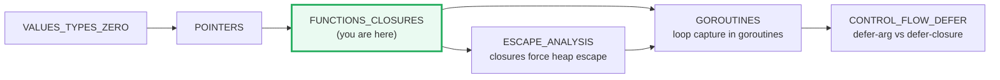
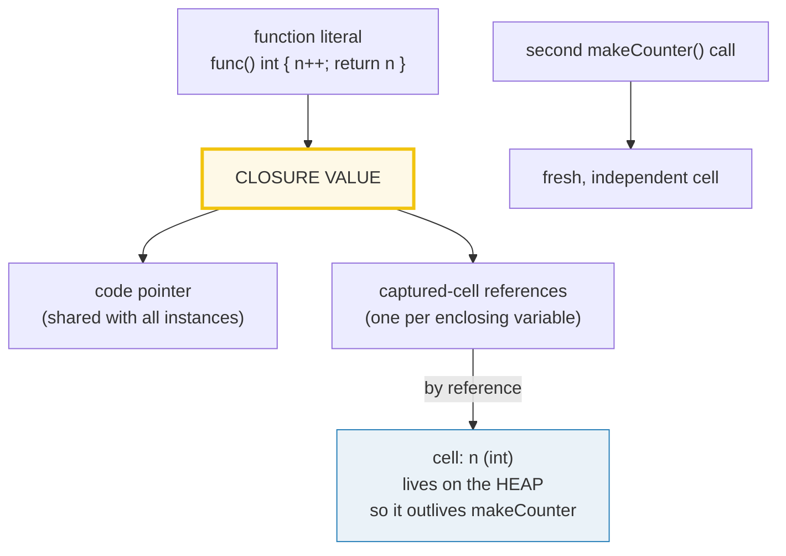
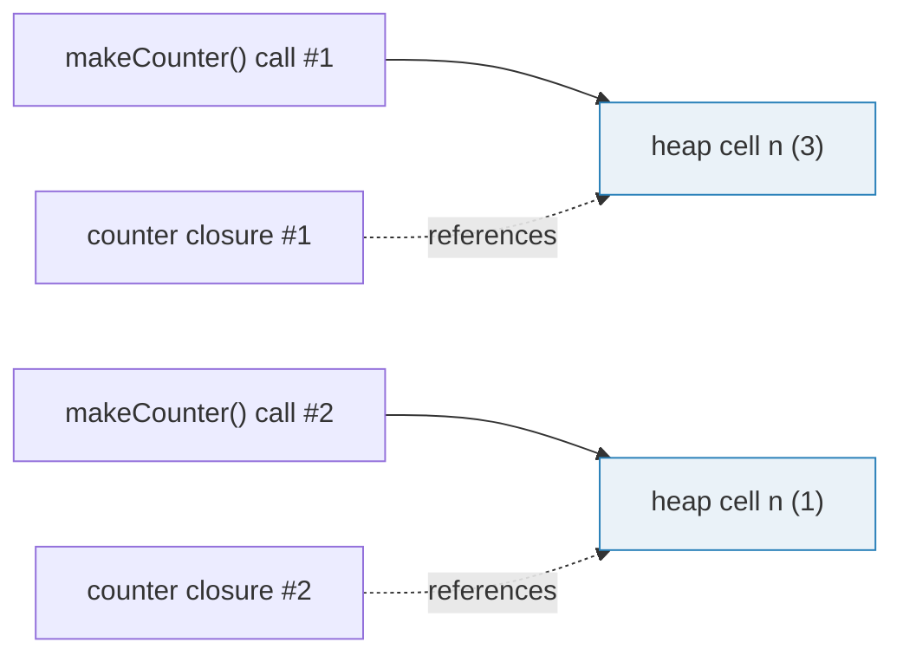
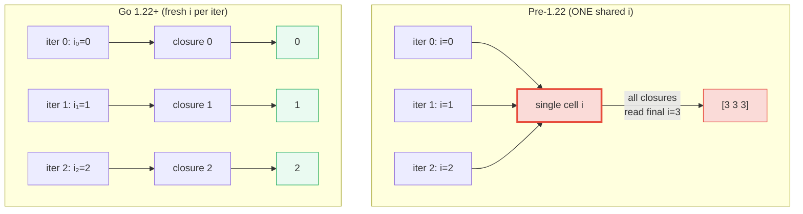
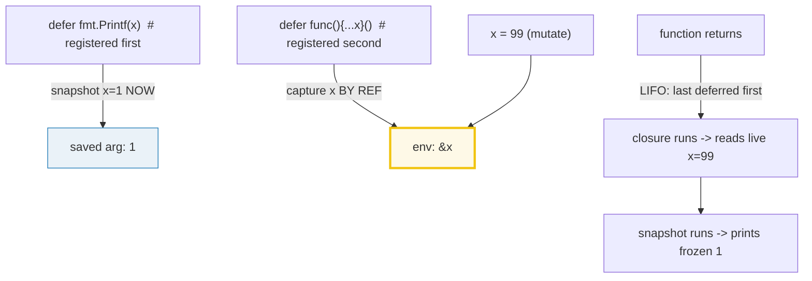

# FUNCTIONS_CLOSURES — First-Class Functions, Closures & the Loop-Var Trap

> **Goal (one line):** by printing every value, show that Go functions are
> first-class values, that a closure captures the **variables** of its enclosing
> scope **by reference** (the same cell, not a copy), and why the pre-1.22
> loop-variable-capture trap existed — and how the Go 1.22+ per-iteration fix
> resolves it.
>
> **Run:** `go run functions_closures.go`
>
> **Ground truth:** [`functions_closures.go`](./functions_closures.go) → captured
> stdout in [`functions_closures_output.txt`](./functions_closures_output.txt).
> Every number/table below is pasted **verbatim** from that file under a
> `> From functions_closures.go Section X:` callout. Nothing is hand-computed.
>
> **Prerequisites:** 🔗 [`VALUES_TYPES_ZERO`](./VALUES_TYPES_ZERO.md) (the zero
> value of a `func` type is `nil`) and 🔗 [`POINTERS`](./POINTERS.md) (capture by
> reference is pointer-like sharing of one cell).

---

## 1. Why this bundle exists (lineage)

Three Go features look ordinary in isolation but hide the single most
consequential mechanics in the language:

1. **Functions are values.** A `func` has a type (`func(int) int`), a zero value
   (`nil`), and can be stored in a variable, passed as an argument, returned
   from a function, or filed in a slice. This is what makes higher-order
   functions, callbacks, and the whole `http.HandlerFunc` / `mux.HandleFunc`
   style possible.
2. **Closures capture *variables*, not values.** A function literal written
   inside another function may refer to that outer function's variables. Per the
   Go spec (*Function literals*): "Function literals are closures: they may
   refer to variables defined in a surrounding function. Those variables are
   then **shared** between the surrounding function and the function literal,
   and they survive as long as they are accessible." The word *shared* is the
   entire story — the closure holds a **reference** to the same cell, so later
   mutations are visible, and the cell **escapes to the heap** to outlive its
   declaring scope.
3. **The loop-variable trap.** Combining (1) and (2) inside a `for` produced
   the most common Go bug of the pre-1.22 era: every closure/goroutine captured
   the *same* reused loop variable, so they all saw its *final* value. Go 1.22
   (Feb 2024) fixed this by giving each iteration its **own** variable.

This bundle sits in the middle of the expertise spine:



- 🔗 [`ESCAPE_ANALYSIS`](./ESCAPE_ANALYSIS.md) — *why* a captured variable
  survives its function: the compiler proves the closure may outlive the stack
  frame and moves the variable to the heap. Section B prints `*nAddr` *after*
  `makeCounter` returned, which is only legal because `n` escaped.
- 🔗 [`GOROUTINES`](./GOROUTINES.md) — Section D launches goroutines that capture
  `i`; this bundle covers the *capture* mechanics, that one covers the
  scheduler (GMP) and `sync` discipline.
- 🔗 [`CONTROL_FLOW_DEFER`](./CONTROL_FLOW_DEFER.md) — Section E contrasts a
  deferred *expression* (arguments snapshotted) with a deferred *closure*
  (reads live values); the full `defer`/LIFO/`recover` story lives there.

---

## 2. The mental model: a closure is (code pointer + captured cells)



The expert detail: a closure is **not** a snapshot. It is a `(code pointer,
environment)` pair where the environment holds **pointers to the captured
cells**. That is why `counter()` can *increment* `n` (write) and why two
counters from two `makeCounter()` calls are independent — each built a fresh
cell. It is also why the pre-1.22 loop trap existed: every iteration's closure
pointed at the **same** loop-variable cell.

---

## 3. Section A — First-class functions (assign, pass, return, nil)

> From `functions_closures.go` Section A:
> ```
> var f func(int) int   ->  f == nil? true   (zero value of a func type)
> [check] zero value of a func type is nil: OK
> f = func(n) n*n       ->  f(5) = 25
> [check] func value assigned then called: f(5)==25: OK
> applyTwice(f, 3)      ->  f(f(3)) = 81
> [check] func passed as arg: applyTwice(f,3)==81: OK
> add10 := makeAdder(10) ->  add10(5) = 15
> [check] func returned from a func: add10(5)==15: OK
> g := func(n) n*n       ->  g(5) = 25  (same code & type, distinct value)
> [check] f and g share the func type func(int) int: OK
> ```

**What.** A function type is spelled `func(<params>) <results>`, e.g.
`func(int) int`. Its **zero value is `nil`** (just like a pointer), so a freshly
declared `var f func(int) int` compares `== nil` and **calling a nil func
panics** (`invalid memory address`). A *function literal* —
`func(n int) int { ... }` — is an expression that yields a function value; assign
it, pass it (`applyTwice(f, 3)`), or return it (`makeAdder`).

**Why — function types are reference-like but compared only to nil.** A function
value is internally a pointer to the code plus (for closures) a pointer to the
captured environment. Because of that, two function values are **not comparable
with `==`** except against `nil`:

```go
var f, g func(int) int = sq, sq
_ = f == g   // COMPILE ERROR: invalid operation: func can only be compared to nil
_ = f == nil // OK — the only legal comparison
```

This is why maps and structs that *store* function values (and thus need to be
comparable) reject `func` keys/fields. If you need a comparable handle to a
callback, store an `int` ID or a `string` name and look the func up in a map.

> From `go.dev/ref/spec` — *Comparison operators*: "Map, function, and slice
> types are not comparable... they may be compared to `nil`." Calling a `nil`
> function value "causes a run-time panic."

---

## 4. Section B — Closures capture by reference (shared cell, not a copy)

> From `functions_closures.go` Section B:
> ```
> counter, _ := makeCounter()
> counter() -> 1   counter() -> 2   counter() -> 3   (each call shares one n)
> [check] counter shares captured n: calls return 1,2,3: OK
> *nAddr (captured n, after 3 calls) = 3   (outlived makeCounter's scope)
> [check] captured n outlived its declaring scope: *nAddr==3: OK
> c1() x2; then c1()->3 ; c2()->1   (two independent captured n's)
> [check] two counters are independent: c1->3, c2->1: OK
> ```

**What.** `makeCounter` declares `n := 0` and returns a function literal that
does `n++`. Three facts fall out, each verified above:

1. **The calls share one `n`** → `1, 2, 3` (a running count). If capture were
   by-value, every call would print `1`.
2. **`n` outlives `makeCounter`** → `*nAddr == 3` *after* the function returned.
   The captured cell **escaped to the heap** (see 🔗 `ESCAPE_ANALYSIS`). A normal
   stack-local would have been destroyed at return; the closure keeps `n` alive.
3. **Two counters are independent** → `c1()` reaches 3 while `c2()` is still at
   1. Each `makeCounter()` call creates a **fresh** `n`, and each returned
   closure captures **its own** cell.

**Why — "shared", not "copied".** The spec's exact word is *shared*. The closure
does not store `n`'s value; it stores a *reference* to `n`'s storage. That is
the mechanism behind:

- **Accumulators / counters** (this section) — the closure mutates shared state.
- **The loop-variable trap** (Section D) — every iteration's closure shared the
  *same* loop variable pre-1.22.
- **Iteration helpers** like `func() (T, bool)` generators that keep a cursor.



> From `go.dev/ref/spec` — *Function literals*: "Function literals are closures:
> they may refer to variables defined in a surrounding function. Those variables
> are then **shared** between the surrounding function and the function literal,
> and they survive as long as they are accessible."

---

## 5. Section C — Variadic parameters & multiple return values

> From `functions_closures.go` Section C:
> ```
> sum(1, 2, 3)           -> 6   (nums is []int{1,2,3} inside)
> [check] variadic call with args: sum(1,2,3)==6: OK
> sum()                  -> 0   (nums is []int(nil) — zero args)
> [check] variadic with zero args: sum()==0: OK
> nums := []int{...}; sum(nums...) -> 100   (spread operator, no copy)
> [check] spread a slice into variadic: sum(nums...)==100: OK
> divmod(17, 5)          -> q=3, r=2
> [check] multiple return: divmod(17,5) -> quotient 3, remainder 2: OK
> _, rem := divmod(17, 5) -> rem=2   (quotient discarded with _)
> [check] blank identifier discards a return value: rem==2: OK
> ```

**What — variadic.** A parameter declared `nums ...int` is the *last* parameter
and becomes type `[]int` inside the function. Two call forms:

| Call form | What `nums` is | Cost |
|---|---|---|
| `sum(1, 2, 3)` | a **new** `[]int{1,2,3}` (new backing array) | one allocation |
| `sum()` | `nil` (zero args) — `len(nums) == 0`, range does nothing | none |
| `sum(nums...)` (spread) | the **same** `nums` slice — **no copy** | none |

**Why the spread is zero-copy.** Per the spec (*Passing arguments to ...
parameters*): if the final argument is assignable to `[]T` and is followed by
`...`, "it may be passed **unchanged**" — the variadic parameter aliases the
caller's slice. (If you call with individual args instead, the compiler builds a
fresh slice.) The expert gotcha: mutating `nums` inside a variadic function
called with the spread form **can** mutate the caller's slice, but only within
its existing length — exactly the slice-aliasing rules from
🔗 [`ARRAYS_SLICES`](./ARRAYS_SLICES.md).

**What — multiple return.** A function may return several values
(`func divmod(a, b int) (int, int)`); the caller binds them positionally
(`q, r := divmod(17, 5)`) and uses the **blank identifier `_`** to discard any.
`_, rem := divmod(17, 5)` throws away the quotient and keeps the remainder `2`.
This is idiomatic for the `v, ok := m[k]` and `n, err := f()` patterns — and
note `_, rem` discards the *first* return, not the last.

> From `go.dev/ref/spec` — *Passing arguments to ... parameters*: "If f is
> variadic with a final parameter p of type `...T`, then within f the type of p
> is `[]T`... If the final argument is assignable to a slice type `[]T`, it may
> be passed unchanged as the value for a `...T` parameter if the argument is
> followed by `...`. In this case no new slice is created."

---

## 6. Section D — The loop-variable-capture trap (Go 1.22+ per-iteration fix)

> From `functions_closures.go` Section D:
> ```
> GOMAXPROCS(4); launched 3 goroutines capturing loop var i
> captured (sorted)      -> [0 1 2]
> pre-1.22: usually [3 3 3] (shared i). Go 1.22+: [0 1 2] (fresh i per iter)
> [check] Go 1.22+ concurrent loop-var capture: sorted == [0 1 2]: OK
> non-concurrent (funcs) -> [0 1 2]   (each closure has its own i)
> [check] Go 1.22+ non-concurrent loop-var capture: sorted == [0 1 2]: OK
> ```

**The bug (pre-1.22).** Before Go 1.22 the spec said *"Variables declared by the
init statement are **re-used** in each iteration"* — there was **one** loop
variable `i`, assigned `0, 1, 2` in turn. A closure/goroutine capturing `i`
captured that **single cell**; by the time the goroutines ran, the loop had
finished and the cell held `3`, so they printed `[3 3 3]`. This caused
[real production outages](https://bugzilla.mozilla.org/show_bug.cgi?id=1619047)
at Let's Encrypt and countless `x := x` copy lines sprinkled into loops.

**The fix (Go 1.22, Feb 2024).** Each iteration now gets its **own fresh**
variable:



**Why both forms matter.** This bundle prints **two** verifications:

1. **Concurrent** (goroutines + `GOMAXPROCS(4)` + mutex-guarded slice + `sort`):
   the classic FAQ example. Sorted → `[0 1 2]`.
2. **Non-concurrent** (collecting function literals): the bug needs *no*
   goroutines — `var fns []func(); for i {...; fns = append(fns, func(){...i})}`
   captured the shared `i` too. Pre-1.22 every `fn()` returned `3`.

**Determinism note (house rule).** Goroutine scheduling order is
nondeterministic, so this bundle **collects** each goroutine's `i` into a
mutex-guarded slice, joins with `sync.WaitGroup`, **sorts**, and prints from
`main()`. Never `fmt.Println` directly from a goroutine — the `_output.txt`
would not reproduce. This is 🔗 `GOROUTINES` discipline applied here.

**Module gating.** The new semantics apply only to packages in modules that
declare `go 1.22` or later in `go.mod` (this module declares `go 1.26`), so old
code keeps its old meaning. You can also force the preview on older toolchains
with `GOEXPERIMENT=loopvar`.

> From `go.dev/blog/loopvar-preview` (Chase & Cox, 2023): "For Go 1.22, we plan
> to change `for` loops to make these variables have **per-iteration scope**
> instead of per-loop scope." And: "To ensure backwards compatibility with
> existing code, the new semantics will only apply in packages contained in
> modules that declare `go 1.22` or later in their `go.mod` files."

---

## 7. Section E — Defer argument vs defer closure (snapshot vs live read)

> From `functions_closures.go` Section E:
> ```
> x := 1; ...two defers...; x = 99   -> x is now 99
> [check] x mutated to 99 before the function returns: OK
> defer func(){Printf(x)}: x = 99   (read at execution, LIFO)
> defer fmt.Printf(x): x = 1   (argument snapshotted at the defer)
> ```

**The pin — exact LIFO order.** Both `defer`s are registered *before* `x = 99`:

- `defer fmt.Printf("...%d", x)` — the argument `x` is evaluated **now**
  (snapshot `1`), then the call is postponed.
- `defer func() { fmt.Printf("...%d", x) }()` — a **closure**; `x` is *captured
  by reference* and read only when the deferred call runs.

At return, deferred calls fire **LIFO** (last registered first): the closure
runs first and reads the *live* `x == 99`; the snapshotted call runs second and
prints the frozen `1`. So output is `99` then `1`.



**Why — the two rules combine.** This section is the intersection of *closures
capture by reference* (Section B) with *defer* mechanics:

1. **Immediate argument evaluation** (spec, *Defer statements*): "the function
   value and parameters to the call are evaluated as usual and saved anew" — at
   the `defer`, not at execution. So `defer fmt.Println(x)` freezes `x`.
2. **LIFO execution**: deferred calls run in reverse registration order at
   return.
3. **A deferred closure** is still a closure: its body reads captured variables
   *at execution time*, so it sees the mutated `x`.

> From `go.dev/tour/flowcontrol/12`: "The deferred call's arguments are
> evaluated immediately, but the function call is not invoked until the
> surrounding function returns." The full `defer`/`panic`/`recover` story is in
> 🔗 [`CONTROL_FLOW_DEFER`](./CONTROL_FLOW_DEFER.md).

---

## 8. The "why" (internals): escape analysis & capture representation

When the compiler sees a function literal that references an outer variable, it
asks: *can this closure outlive the stack frame that owns the variable?* If yes
(and `makeCounter` *returns* the closure, so it trivially can), the variable is
**moved to the heap**. That is why `*nAddr` is a valid, readable pointer *after*
`makeCounter` returns — the storage is no longer on `makeCounter`'s (destroyed)
stack frame; it is GC-managed heap memory kept alive by the closure.

You can see this directly with the compiler's escape-analysis pass:

```
go build -gcflags=-m functions_closures.go   # (remove //go:build ignore first)
#   ...makeCounter ... n escapes to heap
#   ...func literal ... escapes to heap
```

Relevant internals:

- A closure value is a **two-word** struct: a code pointer + an environment
  pointer. Calling it is an indirect call through the code pointer, with the
  environment available as upvalues (this is why closures are slightly slower
  than direct calls and cannot be inlined across the boundary in general).
- Each **captured variable** that escapes becomes a heap allocation *unless* the
  compiler proves the closure does not escape (e.g. `slices.SortFunc` callback
  used inline) — that is the escape-analysis optimization that keeps hot paths
  allocation-free.
- The pre-1.22 loop bug was *really* a capture-by-reference bug: one heap cell
  per loop, shared by every iteration's closure environment. Go 1.22 hoists the
  per-iteration copy so each environment points at its own cell.

See 🔗 [`ESCAPE_ANALYSIS`](./ESCAPE_ANALYSIS.md) for the full `-gcflags=-m`
treatment and the heap-allocation cost model.

---

## 9. Pitfalls (the expert payoff)

| Trap | Symptom | Fix |
|---|---|---|
| Calling a nil function value | Run-time panic: `invalid memory address or nil pointer dereference` | Check `f != nil` before calling; the zero value of a `func` type is `nil`. |
| Comparing two functions with `==` | Compile error: `func can only be compared to nil` | Compare only to `nil`; use an ID/handle if you need a map key. |
| Treating capture as a snapshot | Counter/generator always returns the same value, or "sees" later mutations | Closures capture **by reference**; capture-by-value needs an explicit `v := v` copy (pre-1.22 loop idiom). |
| Loop-variable capture (pre-1.22) | All goroutines/closures see the **final** loop value (e.g. `[3 3 3]`) | Go 1.22+ fixes it per-iteration; on older Go add `i := i` inside the loop. |
| Expecting the loop fix in old modules | Old behavior persists silently | The fix is gated by `go 1.22+` in `go.mod`; bump the module's `go` directive. |
| Mutating the spread slice in a variadic | Caller's slice (within its length) silently mutates | `...T` aliases the caller's slice when spread; copy first if you must mutate (`slices.Clone`). |
| `defer fmt.Println(x)` reading a later `x` | Prints the *old* value, not what you expect at return | Defer args are snapshotted; wrap in a closure (`defer func(){ ... x }()`) to read live. |
| Defer order surprise | Resources closed in unexpected order | Deferred calls run **LIFO**; register in open→close reverse of desired order. |
| Closure capturing a loop var in `go vet` | Pre-1.22 `loopclosure` warning on `go func(){...v}()` | The analyzer is silent under 1.22+ semantics; the capture is now safe. |
| `defer` of a method on a nil receiver | Panic *inside* the deferred call at return | The receiver is evaluated at the `defer`; nil receivers panic when the method body dereferences. |

---

## 10. Cheat sheet

```go
// Function types & zero value
var f func(int) int        // zero value: nil — calling it panics
f = func(n int) int { return n * n }   // assign a function literal (value)
f(5)                       // 25 — call the value
// _ = f == g              // COMPILE ERROR: funcs compare only to nil

// Closures capture VARIABLES by reference (shared cell, escapes to heap)
func makeCounter() func() int {
    n := 0                 // escapes to heap because the closure is returned
    return func() int { n++; return n }   // n is shared, not copied
}
c := makeCounter(); c(); c(); c()   // 1, 2, 3 — one cell, mutated each call

// Variadic: last param `...T` becomes []T inside
func sum(nums ...int) int { ... }   // sum(1,2,3) / sum() / sum(slice...)
//   spread `s...` aliases the caller's slice (no copy); individual args make a new slice

// Multiple return + blank identifier
func divmod(a, b int) (int, int) { return a / b, a % b }
q, r := divmod(17, 5)       // 3, 2
_, rem := divmod(17, 5)     // discard quotient, keep remainder

// Loop-var capture: Go 1.22+ = fresh i per iteration (gate: go.mod `go 1.22+`)
for i := 0; i < 3; i++ { go func(){ capture(i) }() }   // 1.22+: each gets its own i

// Defer: args snapshotted at defer; a deferred closure reads live (LIFO)
x := 1
defer fmt.Println(x)               // prints 1 (frozen)
defer func() { fmt.Println(x) }()  // prints 99 (live, runs FIRST — LIFO)
x = 99
```

---

## Sources

Every signature, value, and behavioral claim above was verified against the Go
specification, the official blog, and the standard-library docs:

- The Go Programming Language Specification — https://go.dev/ref/spec
  - *Function literals* (closures: "shared... survive as long as they are accessible"): https://go.dev/ref/spec#Function_literals
  - *Function types* (`func` types are first-class): https://go.dev/ref/spec#Function_types
  - *Comparison operators* ("Map, function, and slice types are not comparable... may be compared to `nil`"): https://go.dev/ref/spec#Comparison_operators
  - *Passing arguments to ... parameters* (variadic; spread aliases, no copy): https://go.dev/ref/spec#Passing_arguments_to_..._parameters
  - *Return statements* / multiple result values: https://go.dev/ref/spec#Return_statements
  - *Blank identifier* (`_` discards a value): https://go.dev/ref/spec#Blank_identifier
  - *Defer statements* ("function value and parameters... evaluated... and saved anew"): https://go.dev/ref/spec#Defer_statements
  - *For statements* — pre-1.22 "Variables declared by the init statement are re-used in each iteration": https://go.dev/ref/spec#For_statements
- The Go Blog — *Fixing For Loops in Go 1.22* (Chase & Cox, 19 Sep 2023; per-iteration scope; `go 1.22` go.mod gating; Let's Encrypt case): https://go.dev/blog/loopvar-preview
- Go 1.22 Release Notes — *Loop variable scoping* ("Each iteration of the loop creates new variables"): https://go.dev/doc/go1.22
- Go FAQ — *What happens with closures running as goroutines?*: https://go.dev/doc/faq#closures_and_goroutines
- A Tour of Go — *Defer* ("arguments are evaluated immediately, but the function call is not invoked until the surrounding function returns"): https://go.dev/tour/flowcontrol/12
- Effective Go — *Functions* / closures: https://go.dev/doc/effective_go
- Eli Bendersky — *Go internals: capturing loop variables in closures* (mechanics walkthrough): https://eli.thegreenplace.net/2019/go-internals-capturing-loop-variables-in-closures/
- go101 — *For Loop Semantic Changes in Go 1.22* (per-iteration copy mechanics): https://go101.org/blog/2024-03-01-for-loop-semantic-changes-in-go-1.22.html

**Facts that could not be verified by running** (documented, not executed,
because they are compile errors by design): `f == g` for two `func` values is
rejected ("func can only be compared to nil"); calling a nil function value
panics at run time. These are confirmed by the spec sections cited above, not
reproduced as runnable output (a file containing them would not build). The
pre-1.22 loop behavior (`[3 3 3]`) is **not** reproducible on this toolchain
(Go 1.26, `go 1.26` module directive ⇒ 1.22+ per-iteration semantics); it is
documented from the cited Go blog and release notes.
