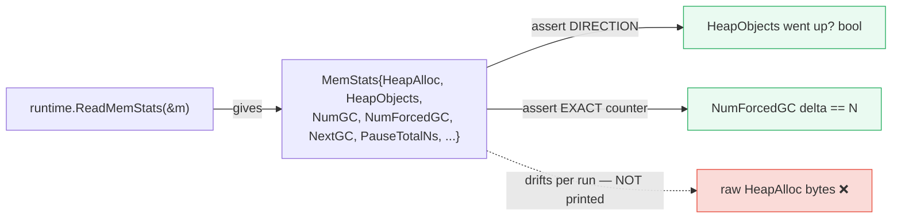
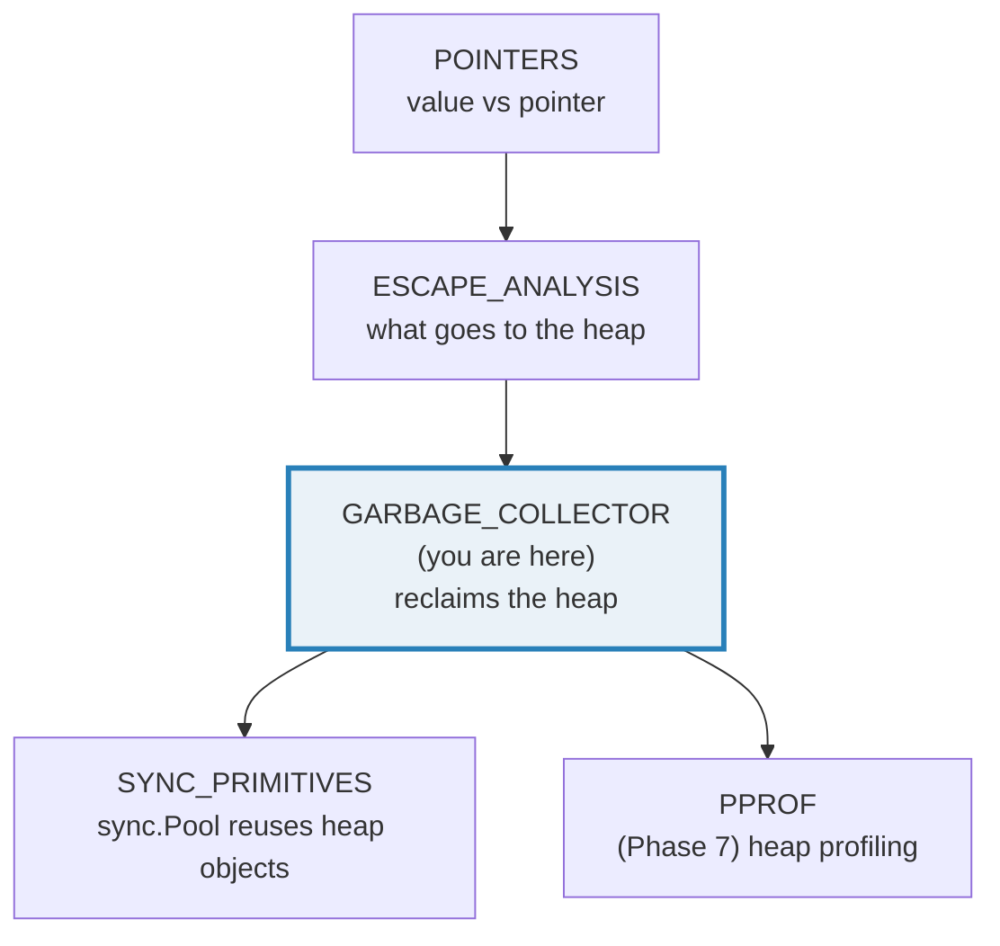
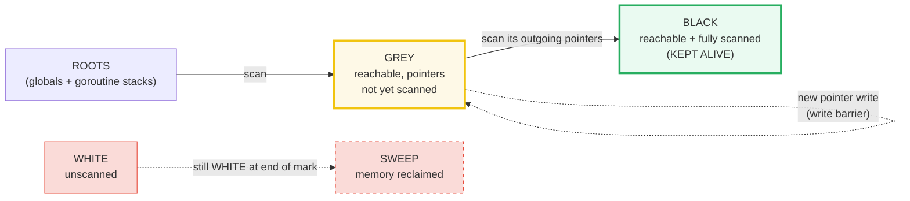
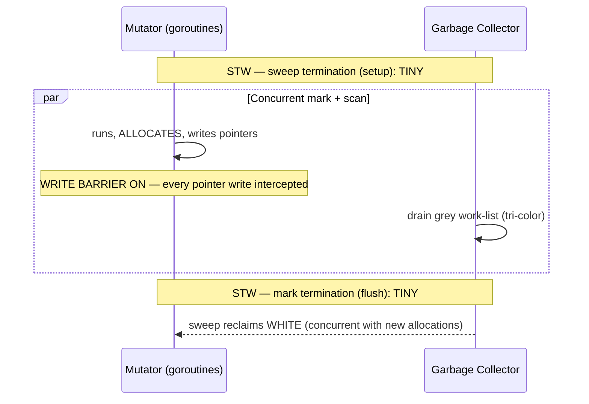
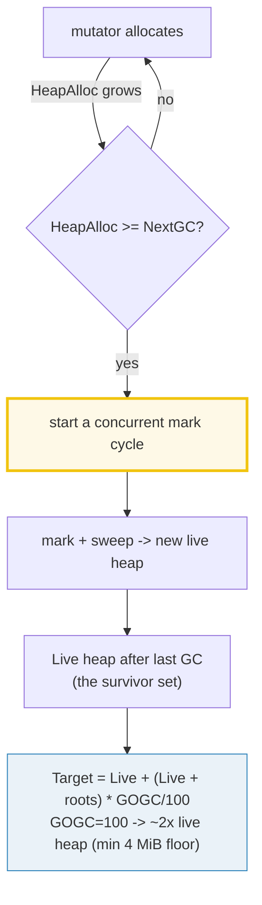

# GARBAGE_COLLECTOR — The Concurrent Tri-Color Mark-Sweep GC, GOGC & GOMEMLIMIT

> **Goal (one line):** show, by measuring `runtime.MemStats` deltas and GC
> counts, how Go's **concurrent, non-generational, non-compacting tri-color
> mark-sweep** collector behaves, and how `GOGC`, `GOMEMLIMIT`, `runtime.GC`,
> finalizers, and `sync.Pool` affect it.
>
> **Run:** `go run garbage_collector.go`
>
> **Ground truth:** [`garbage_collector.go`](./garbage_collector.go) → captured
> stdout in [`garbage_collector_output.txt`](./garbage_collector_output.txt).
> Every number/delta below is pasted **verbatim** from that file under a
> `> From garbage_collector.go Section X:` callout. Nothing is hand-computed.
>
> **Prerequisites:** 🔗 [`POINTERS`](./POINTERS.md) (you must understand value
> vs pointer and what "escapes to the heap" means) and 🔗 `ESCAPE_ANALYSIS`
> (stack vs heap allocation — the GC only touches the heap). 🔗
> [`GOROUTINES`](./GOROUTINES.md) (the GC runs concurrently with the
> scheduler's goroutines) is assumed.

---

## 0. The determinism discipline (read this first)

Go's GC is **timing- and address-dependent**: absolute `HeapAlloc` bytes and
heap addresses change every run (they depend on sweep timing, goroutine
scheduling, and ASLR). A naïve tutorial that prints `HeapAlloc = 48271361`
produces output that **differs on every run** and is useless as ground truth.

This bundle therefore follows a strict rule (mirroring the determinism rules in
[`HOW_TO_RESEARCH.md`](./HOW_TO_RESEARCH.md) §4.2):

- **Assert only RELATIVE deltas and deterministic integer counters.** `NumGC`
  went *up* after `runtime.GC()`; `HeapObjects` went *up* after allocation;
  `AllocsPerOp` is `0` for a pool vs `1` for fresh alloc. These are stable.
- **Never print raw drifting values.** No `HeapAlloc` byte counts, no `ns/op`,
  no `b.N`, no addresses, no durations appear in the asserted output.
- The result: **two `just out garbage_collector` runs are byte-identical.**



---

## 1. Why this bundle exists (lineage)

Go's central design bet is that **memory is cheap and growing cheaper, while CPU
latency is precious** (Rick Hudson, *Getting to Go*). That bet drove the GC to a
surprising place: not a generational copying collector like the JVM's, but a
**concurrent, non-generational, non-compacting tri-color mark-sweep** collector
whose obsession is **sub-millisecond stop-the-world pauses**, not maximum
throughput. The two knobs (`GOGC`, `GOMEMLIMIT`) are the entire tuning surface —
by design the team refused to add a third.



The expertise chain is: a value stays on the **stack** unless it **escapes**
(🔗 `ESCAPE_ANALYSIS`); escaped values live on the **heap**; the **GC** reclaims
unreachable heap objects concurrently; and you reduce GC pressure by **allocating
less** (value types, `sync.Pool`, escape-aware code). This bundle is the middle
link.

> From `go.dev/doc/gc-guide` — *Where Go Values Live*: *"Go values whose memory
> cannot be allocated this way, because the Go compiler cannot determine its
> lifetime, are said to escape to the heap. … That's where a GC comes in: it's a
> system that specifically identifies and cleans up dynamic memory
> allocations."*

---

## 2. The mental model: tri-color marking + the GC cycle

Go's GC is a **tracing** collector: it finds live objects by following pointers
transitively from the **roots** (globals + every goroutine's stack), then
**sweeps** everything that was not reached. It tracks progress with the classic
**tri-color abstraction**:



- **White** = not yet scanned → candidate for reclamation.
- **Grey** = known reachable, but its pointers haven't all been followed yet.
- **Black** = reachable and fully scanned → definitely kept.

The invariant that makes concurrent marking correct: **no black object points to
a white object.** The **write barrier** (enabled *only* during the mark phase)
intercepts every pointer write and preserves that invariant — if a black object
gains a pointer to a white one, the barrier shades the target grey. Because the
mutator keeps running, this is the key mechanism that lets marking happen
**concurrently** without losing objects.



> From `go.dev/blog/ismmkeynote` (Rick Hudson): *"the write barrier is on only
> during the GC. At other times the compiled code loads a global variable and
> looks at it. … When we are inside the GC that variable is different, and the
> write barrier is responsible for ensuring that no reachable objects get lost
> during the tri-color operations."* And on the design: Go is a **value-oriented
> language**, so escape analysis keeps most objects on the stack — *"It isn't
> that the generational hypothesis isn't true for Go, it's just that the young
> objects live and die young on the stack."* That is *why* Go rejected a
> generational collector.

The two STW windows are deliberately **tiny and unrelated to heap size** — they
scale with `GOMAXPROCS` and goroutine count, not with megabytes of heap. That is
the whole latency story.

---

## 3. Section A — Tri-color mark-sweep & `runtime.MemStats`

> From `garbage_collector.go` Section A:
> ```
> Go's GC is a CONCURRENT, NON-GENERATIONAL, NON-COMPACTING,
> tri-color MARK-AND-SWEEP collector:
>   WHITE = unscanned  (candidate for sweep)
>   GREY  = reachable, its pointers not yet scanned
>   BLACK = reachable, fully scanned (kept alive)
> Marking runs CONCURRENTLY with the mutator; only small STW
> (stop-the-world) windows occur at the start (sweep termination)
> and end (mark termination) of each cycle. Sweeping reclaims the
> WHITE objects. The WRITE BARRIER is enabled only while marking.
> 
> runtime.MemStats key fields (measured here, asserted by direction):
>   HeapAlloc    bytes of allocated heap objects (live + not-yet-swept)
>   HeapObjects  count of allocated heap objects
>   NumGC        uint32, # of completed GC cycles (cumulative)
>   NumForcedGC  uint32, # of cycles forced by an application runtime.GC()
>   NextGC       target heap size; the goal is HeapAlloc <= NextGC
>   PauseTotalNs cumulative ns spent in STW pauses
>   EnableGC (always true, even when GOGC=off): true
> 
> allocated 10000 *Box into a live slice:
>   HeapObjects went up? true
>   HeapAlloc   went up? true
>   (raw byte counts are runtime-dependent; only the delta is asserted)
> ```
> ```
> [check] MemStats.EnableGC is always true (even with GOGC=off): OK
> [check] NumGC is a cumulative, monotonic counter (after >= before): OK
> [check] allocating 10000 live objects raised HeapObjects: OK
> [check] allocating 10000 live objects raised HeapAlloc: OK
> ```

**What.** `runtime.ReadMemStats(&m)` snapshots the allocator into a `MemStats`
struct. The fields that matter for reasoning about the GC:

| Field | Meaning | Stable? |
|---|---|---|
| `HeapAlloc` | bytes of allocated heap objects (live + not-yet-swept) | drifts → assert **direction only** |
| `HeapObjects` | count of allocated heap objects | drifts → assert **direction only** |
| `NumGC` | `uint32`, cumulative completed GC cycles | exact → assert **delta** |
| `NumForcedGC` | `uint32`, cycles forced by `runtime.GC()` | exact → assert **delta == N** |
| `NextGC` | target heap size; goal is `HeapAlloc ≤ NextGC` | exact-ish |
| `PauseTotalNs` | cumulative ns in STW pauses | monotonic → assert **non-decreasing** |
| `EnableGC` | always `true`, **even when `GOGC=off`** | exact → assert `true` |

> From `pkg.go.dev/runtime` — `HeapAlloc`: *"bytes of allocated heap objects …
> 'Allocated' heap objects include all reachable objects, as well as unreachable
> objects that the garbage collector has not yet freed."* `NumGC`: *"the number
> of completed GC cycles."* `NumForcedGC`: *"the number of GC cycles that were
> forced by the application calling the GC function."* `NextGC`: *"the target
> heap size of the next GC cycle. The garbage collector's goal is to keep
> HeapAlloc ≤ NextGC."*

**Why `EnableGC` is `true` even with `GOGC=off`.** Turning the GC *off* with
`GOGC=off` / `SetGCPercent(-1)` disables **automatic** triggering, but the
collector machinery is still wired up (a `GOMEMLIMIT` can still force it, and
`runtime.GC()` still works). So `EnableGC` is documented as *"always true, even
if GOGC=off"* — and the bundle pins exactly that.

**Why we only assert direction for `HeapAlloc`/`HeapObjects`.** Both include
"unreachable objects the GC has not yet freed," so their absolute value depends
on *when sweeping last ran* — which is nondeterministic. Two runs of the same
program print different byte counts. The bundle therefore prints **`went up?
true`** (a stable boolean) instead of a number, and asserts that monotonic
invariant. This is the discipline that makes the output reproducible.

---

## 4. Section B — Force a cycle: `runtime.GC()` bumps `NumGC`/`NumForcedGC`

> From `garbage_collector.go` Section B:
> ```
> runtime.GC() runs a full collection and BLOCKS until it completes,
> so each call completes exactly one cycle. NumGC counts every cycle;
> NumForcedGC counts only the application-forced ones — a precise
> signal that is byte-identical across runs.
> forced 3 runtime.GC() calls:
>   NumGC       delta = 3  (>= 3; background cycles may add more)
>   NumForcedGC delta = 3  (exactly the forced cycles)
>   PauseTotalNs did not decrease? true  (STW pauses accumulate)
> ```
> ```
> [check] NumGC increased by >= 3 after 3 runtime.GC calls: OK
> [check] NumForcedGC increased by exactly 3: OK
> [check] PauseTotalNs is monotonic non-decreasing: OK
> ```

**What.** `runtime.GC()` *"runs a garbage collection and blocks the caller until
the garbage collection is complete"* (`pkg.go.dev/runtime#GC`). Because it blocks
until the cycle *finishes*, each call corresponds to exactly one completed cycle.

**Why `NumForcedGC` is the sharpest signal.** `NumGC` counts *all* cycles —
forced **and** automatic — so a background cycle that happens to fire during the
loop would inflate the `NumGC` delta beyond the 3 we forced (hence we assert
`delta >= 3`, not `== 3`). But `NumForcedGC` counts *only* cycles the application
explicitly forced. Three `runtime.GC()` calls → `NumForcedGC` delta **exactly 3**,
deterministically, every run. That is the most precise, reproducible GC counter
in the runtime, and it is what the bundle asserts exactly.

> From `pkg.go.dev/runtime` — `GC()`: *"GC runs a garbage collection and blocks
> the caller until the garbage collection is complete. It may also block the
> entire program."* (The "may also block the entire program" is the small STW.)

**`PauseTotalNs` is monotonic.** STW pause time only ever accumulates, so
`after.PauseTotalNs >= before.PauseTotalNs` is an invariant. The bundle asserts
the **direction** (non-decreasing), never a duration value — durations are
non-reproducible across runs.

---

## 5. Section C — `GOGC`: the live-heap-growth trigger



> From `garbage_collector.go` Section C:
> ```
> GOGC (default 100) triggers a GC when the heap GROWS by GOGC% since
> the last sweep (at 100 it roughly doubles). GOGC=off disables automatic
> collection entirely (unless GOMEMLIMIT applies). debug.SetGCPercent
> returns the PREVIOUS value. Target heap = LiveHeap + (LiveHeap + GC
> roots) * GOGC/100 (roots counted since Go 1.18); minimum heap 4 MiB.
> SetGCPercent round-trip: initial=100  offEcho=-1  backEcho=100
> ```
> ```
> [check] SetGCPercent(-1) then restore echoes -1 (it was off): OK
> [check] SetGCPercent round-trips back to the initial value: OK
> GOGC=off, allocated ~64 MiB -> NumGC delta = 0 (no automatic GC)
> ```
> ```
> [check] with GOGC=off, allocating ~64 MiB triggered 0 GC cycles: OK
> GOGC=default(100), allocated ~64 MiB -> NumGC delta = 4 (>=1 automatic GC)
> [check] with GOGC enabled, allocating ~64 MiB triggered >= 1 GC cycle: OK
> ```

**What.** `GOGC` (env var) / `debug.SetGCPercent` (API) sets the trigger: the GC
fires when the heap grows by `GOGC`% over the live heap left by the last sweep.
The default `100` means the heap roughly **doubles** before the next cycle. The
precise target is:

> From `go.dev/doc/gc-guide` — *GOGC*: *"Target heap memory = Live heap +
> (Live heap + GC roots) × GOGC / 100."* With a **4 MiB minimum**: *"the Go GC
> has a minimum total heap size of 4 MiB, so if the GOGC-set target is ever below
> that, it gets rounded up."* And: *"Note: GOGC includes the root set only as of
> Go 1.18."*

`debug.SetGCPercent` returns the **previous** value, and a **negative** argument
(`-1`) disables automatic collection (`GOGC=off`). The bundle's round-trip
demonstrates the return contract deterministically regardless of the `GOGC` env:
set `-1` (returns the initial `100`), restore `100` (returns `-1`, the "off" we
just had), set `-1` again (returns `100`). Those echoes are exact and stable.

**The decisive experiment.** With `GOGC=off`, allocating ~64 MiB produces a
`NumGC` delta of **exactly 0** — no automatic cycle fires. Restore the default
`100`, allocate the *same* ~64 MiB, and the delta jumps to **4** (≥1) cycles. The
contrast is the whole point of the knob: `GOGC` directly controls GC frequency.

> From `pkg.go.dev/runtime` (env vars): *"The GOGC variable sets the initial
> garbage collection target percentage. A collection is triggered when the ratio
> of freshly allocated data to live data remaining after the previous collection
> reaches this percentage. The default is GOGC=100. Setting GOGC=off disables the
> garbage collector entirely."*

**The rule of thumb to internalize** (gc-guide): *"doubling GOGC will double
heap memory overheads and roughly halve GC CPU cost, and vice versa."* Raise
`GOGC` (e.g. `200`) to spend more memory for less GC CPU; lower it (e.g. `50`)
for a smaller heap at the cost of more frequent cycles.

---

## 6. Section D — `GOMEMLIMIT`: the soft memory ceiling (Go 1.19+)

> From `garbage_collector.go` Section D:
> ```
> GOMEMLIMIT (debug.SetMemoryLimit, added in Go 1.19) sets a SOFT ceiling
> on total Go-runtime memory (MemStats.Sys - HeapReleased). It is enforced
> EVEN IF GOGC=off: the GC runs more often (up to ~50% CPU) to stay under
> it, which helps avoid OOM in memory-capped containers. It is SOFT on
> purpose: under extreme pressure the runtime lets memory exceed the limit
> rather than thrash (stall) the program. SetMemoryLimit returns the
> PREVIOUS limit; a NEGATIVE argument only queries, without changing it.
> current memory limit: 9223372036854775807 bytes  (math.MaxInt64 == disabled? true)
> SetMemoryLimit(1 GiB) -> previous=9223372036854775807  queryNow=1073741824  restoreEcho=1073741824
> ```
> ```
> [check] SetMemoryLimit(-1) is a non-mutating query (q1 == q2): OK
> [check] SetMemoryLimit(N) takes effect (a query then returns N): OK
> [check] SetMemoryLimit returns the value that was previously set: OK
> [check] after restore, querying again equals the original limit: OK
> ```

**What.** `GOMEMLIMIT` (env var) / `debug.SetMemoryLimit` (API, **Go 1.19**) caps
the *total* memory the Go runtime manages — precisely `MemStats.Sys -
MemStats.HeapReleased`. Unlike `GOGC` (a relative ratio), it is an **absolute**
ceiling, and it is enforced **even when `GOGC=off`**. The default is
`math.MaxInt64` (= disabled); the bundle observes exactly that
(`9223372036854775807`), then exercises the deterministic API round-trip (set →
query confirms → restore echoes).

> From `pkg.go.dev/runtime/debug` — `SetMemoryLimit`: *"SetMemoryLimit provides
> the runtime with a soft memory limit. … This limit will be respected even if
> GOGC=off (or, if SetGCPercent(-1) is executed). … A zero limit or a limit
> that's lower than the amount of memory used by the Go runtime may cause the
> garbage collector to run nearly continuously. … SetMemoryLimit returns the
> previously set memory limit. A negative input does not adjust the limit, and
> allows for retrieval of the currently set memory limit."*

**Why it is SOFT, and why that matters.** A hard limit plus a live heap bigger
than the limit would force the GC to run **nearly continuously** — a stall called
**thrashing** that is *worse* than an OOM (the program hangs instead of failing
fast). So the runtime caps GC CPU use at **~50%** (over a `2 * GOMAXPROCS`
CPU-second window) and lets memory exceed the limit rather than thrash forever:

> From `go.dev/doc/gc-guide` — *Memory limit*: *"the memory limit is defined to
> be soft. The Go runtime makes no guarantees that it will maintain this memory
> limit under all circumstances; it only promises some reasonable amount of
> effort. … the GC sets an upper limit on the amount of CPU time it can use …
> currently set at roughly 50%. … the program will slow down at most by 2x,
> because the GC can't take more than 50% of its CPU time away."*

**When to use it** (gc-guide, *Suggested uses*): **do** set it to ~90–95% of a
container's memory limit to absorb transient heap spikes without OOM; **don't**
set it for CLI/desktop tools whose memory scales with unknown inputs, and
**don't** combine `GOGC=off` with a memory limit when memory is shared with
uncoordinated co-tenants. The behavioral effect (GC working harder) requires
huge sustained allocation and timing to observe, so the bundle asserts only the
deterministic **API contract** and describes the behavior.

---

## 7. Section E — Finalizers are NOT a reliable cleanup hook

> From `garbage_collector.go` Section E:
> ```
> runtime.SetFinalizer attaches a callback that runs AFTER an object
> becomes unreachable and a GC sweeps it. But its timing is UNDEFINED
> and it is NOT guaranteed to run at process exit. Finalizers even
> RESURRECT the object (passing it in alive), so prefer defer / Close
> / runtime.AddCleanup (1.24+). Here we only observe that it CAN fire.
> finalizer fired within a bounded GC loop? true
> ```
> ```
> [check] the object is no longer referenced by the program (obj == nil): OK
> [check] the finalizer was observed to run after forced GC: OK
> ```

**What.** `runtime.SetFinalizer(obj, fn)` attaches `fn` to run after `obj`
becomes unreachable and a later GC sweeps it. The bundle sets one, drops the
reference, and loops `runtime.GC()` + `runtime.Gosched()` until the callback
signals — observing that it **can** fire. But the bundle deliberately asserts
only the *boolean* (`fired`), never the cycle count: the exact cycle on which a
finalizer runs is **scheduling-dependent** and would break byte-identical output.

**Why finalizers are a footgun — the four expert facts:**

1. **Timing is undefined.** You cannot predict *when* (or even *whether*, within
   a run) a finalizer runs. It depends on GC scheduling.
2. **Not guaranteed at exit.** Finalizers are **not** run when the program exits.
   A finalizer meant to flush a buffer or close an fd may simply never execute.
3. **They resurrect the object.** The finalizer receives the object *alive*, so
   the object (and anything it transitively references) survives at least one
   extra GC cycle. Objects in a **reference cycle** with a finalizer can *never*
   be reclaimed.
4. **`runtime.GC()` only *queues* them.** Per the gc-guide: *"`runtime.GC` will
   not wait until finalizers for unreachable objects are executed, only until
   they are all queued."* So you must `Gosched`/spin to observe execution.

> From `go.dev/doc/gc-guide` — *Finalizers, cleanups, and weak pointers*:
> *"there's no guarantee cleanups or finalizers will be run at program exit, or
> at all for that matter."* And: *"Prefer cleaning up non-memory resources
> deterministically when possible, with finalizers and cleanups as a fallback. …
> If you're a package author exposing an API that wraps some non-memory resource,
> consider providing an explicit API for releasing the resource deterministically
> (through a `Close` method), rather than relying on the garbage collector."*

**The fix.** Use `defer file.Close()` / an explicit `Close()` for deterministic
cleanup; use a finalizer only as a best-effort safety net for programmer mistakes
(like `os.File` does). As of **Go 1.24**, prefer `runtime.AddCleanup` over
`SetFinalizer` — cleanups don't resurrect, can attach multiple per object, and
are more efficient.

---

## 8. Section F — Reducing GC pressure: `sync.Pool` vs fresh allocation

> From `garbage_collector.go` Section F:
> ```
> Fewer heap allocations = less GC work (see ESCAPE_ANALYSIS). sync.Pool
> loans out objects across GC cycles (Get/Put), turning a per-op heap
> allocation into ~0 in the steady state. testing.Benchmark reports
> AllocsPerOp, a deterministic integer we compare here.
> fresh &Box{} every op : AllocsPerOp = 1
> sync.Pool Get/Put      : AllocsPerOp = 0
> pool allocates fewer ops per iteration? true
> ```
> ```
> [check] fresh allocation allocates >= 1 object per op: OK
> [check] sync.Pool AllocsPerOp < fresh-allocation AllocsPerOp: OK
> ```

**What.** `testing.Benchmark` measures `AllocsPerOp` — a **deterministic
integer** (total heap allocations ÷ iterations). Allocating `&Box{}` fresh on
every iteration costs exactly **1 alloc/op** (the address escapes into
`globalSink`). Reusing a `sync.Pool` (Get → use → Put) costs **0 allocs/op** in
the steady state, because the first `New()` is amortized away over thousands of
iterations.

> From `pkg.go.dev/sync` — `Pool`: *"A Pool is a set of temporary objects that
> may be individually saved and retrieved. … any item stored in the Pool may be
> removed automatically at any time without notification. … Pool's purpose is to
> cache allocated but unused items for later reuse, relieving pressure on the
> garbage collector."*

**Why fewer allocations = less GC work.** The GC's CPU cost is proportional to
the **live heap** (it must trace every live pointer) and the number of cycles is
driven by the **allocation rate** (how fast `HeapAlloc` grows toward `NextGC`).
The three levers, in order of impact:

1. **Allocate less** — value types instead of pointers (🔗 `ESCAPE_ANALYSIS`),
   pre-sized slices, avoiding `&x` that escapes. This is the biggest win.
2. **Reuse objects** — `sync.Pool` (🔗 `SYNC_PRIMITIVES`) for scratch buffers,
   `[]byte`, etc. The bundle proves it: 0 vs 1 alloc/op.
3. **Tune the knobs** — lower `GOGC` only if you are latency-bound and can afford
   the CPU; set `GOMEMLIMIT` in containers to avoid OOM. **Never** hand-tune
   these without a heap profile (🔗 `PPROF`, Phase 7) showing the GC is the
   bottleneck.

**Determinism note.** `ns/op` and `b.N` vary between runs (time-based), so the
bundle prints **only** `AllocsPerOp` — the integer that is identical across runs.

---

## 9. The knobs, side by side

| | `GOGC` | `GOMEMLIMIT` |
|---|---|---|
| **Kind** | relative ratio (live-heap growth %) | absolute ceiling (bytes) |
| **Default** | `100` (heap ~doubles) | `math.MaxInt64` (disabled) |
| **API** | `debug.SetGCPercent(int) int` | `debug.SetMemoryLimit(int64) int64` |
| **Disable** | `GOGC=off` / `SetGCPercent(-1)` | `SetMemoryLimit(math.MaxInt64)` |
| **Added** | forever | **Go 1.19** |
| **Effect** | trades CPU ↔ memory (frequency) | caps RSS; enforced even if `GOGC=off` |
| **Failure mode** | too low → GC thrashes CPU | too low → GC thrashes CPU (soft, ~50% cap) |
| **Returns** | the previous percentage | the previous limit (neg arg = query only) |

They compose: with a `GOMEMLIMIT` set, the runtime will *reduce* the effective
`GOGC` target to stay under the limit. This is why
`debug.SetGCPercent`'s doc warns: *"This setting may be effectively reduced in
order to maintain a memory limit."*

---

## 10. Pitfalls (the expert payoff)

| Trap | Symptom | Fix |
|---|---|---|
| Printing/asserting raw `HeapAlloc` bytes | `_output.txt` differs every run; flaky tests | Assert **direction** (`went up?`) and exact counters (`NumGC`, `NumForcedGC`, `AllocsPerOp`); never bytes/`ns/op`. |
| `GOGC=off` thinking the GC is dead | `EnableGC` still `true`; `GOMEMLIMIT` or `runtime.GC()` still fire | `GOGC=off` only disables **automatic** triggering; set `GOMEMLIMIT` too, or expect unbounded heap growth. |
| `GOMEMLIMIT` set too low | program slows to a crawl (~2x), GC ~50% CPU, "thrashing" | Leave 5–10% headroom under the container limit; don't set it near the live heap. Profile first (🔗 `PPROF`). |
| `GOMEMLIMIT` + `GOGC=off` with co-tenant processes | the Go runtime reserves the whole limit for itself → neighbors OOM | Keep `GOMEMLIMIT` but set a sane `GOGC`; only use `off` when Go owns all the memory. |
| Relying on a finalizer to close/release | fd/memory leak — finalizer may **never** run (not at exit, timing undefined) | `defer Close()` / explicit lifecycle; finalizer only as a best-effort safety net. |
| Finalizer referencing the object (or a cycle) | object never reclaims — finalizers **resurrect** the receiver | Don't capture `obj` in `fn`; avoid finalizers on cyclic structures; prefer `runtime.AddCleanup` (1.24+). |
| Assuming `runtime.GC()` waits for finalizers | finalizer "didn't run" right after `GC()` | `runtime.GC()` only *queues* finalizers; `Gosched`/spin to observe, or inject a signal channel. |
| `sync.Pool` for long-lived state | pooled object quietly cleared mid-use (Pool can drop items any time) | Pool is for **scratch** objects only; never store state you can't recreate. |
| Tuning `GOGC`/`GOMEMLIMIT` blind | latency or memory gets *worse* | Always profile first (🔗 `PPROF`): is the GC actually the bottleneck? Allocation rate usually is. |
| Thinking Go is generational/compacting | wrong mental model → misdiagnosed pauses | Go is **non-generational, non-compacting**; most "young" objects die on the **stack** (escape analysis), not in a nursery. |

---

## 11. Cheat sheet

```go
// Go's GC: concurrent, non-generational, non-compacting, tri-color mark-sweep.
// Two STW windows per cycle (sweep-termination setup, mark-termination flush) —
// tiny and ~independent of heap size.

// Observe it (runtime.ReadMemStats — assert DIRECTION for bytes, EXACT for counters)
var m runtime.MemStats
runtime.ReadMemStats(&m)
// m.HeapAlloc   bytes (drifts -> assert direction only)
// m.HeapObjects count  (drifts -> assert direction only)
// m.NumGC       uint32 cumulative cycles (exact delta)
// m.NumForcedGC uint32 cycles from runtime.GC() (exact delta == N)
// m.NextGC      target heap; goal is HeapAlloc <= NextGC
// m.EnableGC    always true, even when GOGC=off

// Force a cycle (blocks until complete)
runtime.GC()

// GOGC (default 100): GC when heap grows GOGC% since last sweep (~doubles at 100).
//   target = LiveHeap + (LiveHeap + roots) * GOGC/100; 4 MiB minimum floor.
prev := debug.SetGCPercent(-1)   // -1 / "off" disables AUTOMATIC GC; returns previous
debug.SetGCPercent(prev)         // restore

// GOMEMLIMIT (Go 1.19): SOFT absolute ceiling on MemStats.Sys - HeapReleased.
//   enforced even if GOGC=off; GC capped at ~50% CPU to avoid thrashing.
cur := debug.SetMemoryLimit(-1)  // negative = non-mutating QUERY
debug.SetMemoryLimit(1 << 30)    // 1 GiB; returns previous

// Finalizers: timing undefined, NOT run at exit, RESURRECT the object.
//   -> prefer defer Close() / runtime.AddCleanup (1.24+); finalizer = safety net only.
runtime.SetFinalizer(obj, func(o *T) { ... })

// Reduce GC pressure: (1) allocate less (value types, escape-aware),
// (2) reuse via sync.Pool, (3) tune GOGC/GOMEMLIMIT only after profiling.
var pool = sync.Pool{New: func() any { return &Buf{} }}
x := pool.Get().(*Buf); defer pool.Put(x)
```

---

## Sources

Every signature, behavioral claim, and design rationale above was verified
against the Go standard-library docs and the Go team's own GC literature, then
corroborated by independent secondary sources:

- **A Guide to the Go Garbage Collector** (authoritative) —
  https://go.dev/doc/gc-guide
  - *Where Go Values Live* (stack vs heap, escape): https://go.dev/doc/gc-guide#where-go-values-live
  - *Tracing Garbage Collection* (mark-sweep, **non-moving** GC, roots, scanning,
    reachability): https://go.dev/doc/gc-guide#tracing-garbage-collection
  - *The GC cycle* (sweep → off → mark): https://go.dev/doc/gc-guide#the-gc-cycle
  - *GOGC* (target formula `Live + (Live+roots)*GOGC/100`, **roots since Go
    1.18**, **4 MiB minimum**, *"doubling GOGC doubles heap, ~halves GC CPU"*,
    `SetGCPercent`/`GOGC=off`): https://go.dev/doc/gc-guide#gogc
  - *Memory limit* (**Go 1.19**, soft, `Sys - HeapReleased`, enforced even with
    `GOGC=off`, **thrashing**, **~50% GC CPU cap**, suggested uses):
    https://go.dev/doc/gc-guide#memory-limit
  - *Latency* (concurrent, STW ∝ GOMAXPROCS not heap): https://go.dev/doc/gc-guide#latency
  - *Finalizers, cleanups, and weak pointers* (not guaranteed at exit,
    resurrection, prefer `Close`/`AddCleanup`, `runtime.GC` only *queues*):
    https://go.dev/doc/gc-guide#finalizers-cleanups-and-weak-pointers
- `runtime` package — https://pkg.go.dev/runtime
  - Env vars `GOGC` (*"default 100… off disables… ratio of freshly allocated to
    live data"*) and `GOMEMLIMIT` (*"soft memory limit… default
    math.MaxInt64"*): https://pkg.go.dev/runtime#hdr-Environment_Variables
  - `GC()` (*"blocks the caller until… complete. It may also block the entire
    program"*): https://pkg.go.dev/runtime#GC
  - `ReadMemStats` / `MemStats` fields (`HeapAlloc`, `HeapObjects`, `NumGC`,
    `NumForcedGC`, `NextGC`, `PauseTotalNs`, `EnableGC` — *"always true, even if
    GOGC=off"*): https://pkg.go.dev/runtime#MemStats
  - `SetFinalizer` / `KeepAlive`: https://pkg.go.dev/runtime#SetFinalizer
- `runtime/debug` package — https://pkg.go.dev/runtime/debug
  - `SetGCPercent` (*"returns the previous setting… A negative percentage
    effectively disables garbage collection, unless the memory limit is
    reached… may be effectively reduced in order to maintain a memory limit"*):
    https://pkg.go.dev/runtime/debug#SetGCPercent
  - `SetMemoryLimit` (**added in go1.19**, *"soft… respected even if
    GOGC=off… A negative input does not adjust the limit, and allows for
    retrieval… returns the previously set memory limit"*):
    https://pkg.go.dev/runtime/debug#SetMemoryLimit
- **Go Blog — "Getting to Go: The Journey of Go's Garbage Collector"** (Rick
  Hudson, ISMM 2018): the design rationale — **value-oriented language**, the
  **write barrier on only during GC**, the **GC pacer**, **non-moving** +
  size-segregated spans, and *why Go rejected a generational collector* ("the
  young objects live and die young on the stack"): https://go.dev/blog/ismmkeynote
- **Go Blog — "Go GC: Prioritizing low latency and simplicity"** (Richard
  Hudson) — the Go 1.5 concurrent GC announcement (tri-color, low-latency goal):
  https://go.dev/blog/go15gc
- **Go Blog — "Go runtime: 4 years later"** (Michael Knyszek, 2022) — the Go
  1.18/1.19 runtime context in which `GOMEMLIMIT` and the pacer redesign landed:
  https://go.dev/blog/go119runtime
- Design proposals: *Soft memory limit* (Go 1.19) —
  https://go.googlesource.com/proposal/+/master/design/48409-soft-memory-limit.md
  and *GC pacer redesign* (Go 1.18) —
  https://go.googlesource.com/proposal/+/master/design/44167-gc-pacer-redesign.md
- `sync.Pool` — *"cache allocated but unused items for later reuse, relieving
  pressure on the garbage collector"*: https://pkg.go.dev/sync#Pool

**Secondary corroboration (≥2 independent sources, web-verified):**
- Ardan Labs — *"Garbage Collection In Go: Part I — Semantics"* (*"a
  non-generational concurrent tri-color mark and sweep collector"*):
  https://www.ardanlabs.com/blog/2018/12/garbage-collection-in-go-part1-semantics.html
- Ardan Labs — *"Kubernetes Memory Limits and Go"* (`GOMEMLIMIT` in containers,
  the `GOGC=off` + limit pattern):
  https://www.ardanlabs.com/blog/2024/02/kubernetes-memory-limits-go.html
- Weaviate — *"GOMEMLIMIT is a game changer for high-memory applications"*
  (avoiding GC-driven OOM):
  https://weaviate.io/blog/gomemlimit-a-game-changer-for-high-memory-applications
- Stack Overflow — *"What kind of Garbage Collection does Go use?"*
  (*"tri-color mark-and-sweep algorithm; non-generational; non-compacting;
  fully precise"*): https://stackoverflow.com/questions/7823725

**Facts that could not be verified by running** (documented, not executed,
because they are timing/CPU-budget behaviors or environment-dependent rather
than printable invariants): the **~50% GC CPU cap / `2*GOMAXPROCS` window** that
mitigates `GOMEMLIMIT` thrashing; the **4 MiB minimum total heap floor**; the
**write barrier being enabled only during the mark phase**; and the guarantee
that **finalizers are not run at process exit**. These are confirmed by the
`go.dev/doc/gc-guide`, `pkg.go.dev/runtime`, and the `ismmkeynote` references
above, not reproduced as asserted numeric output (reproducing them would require
huge sustained allocations and timing measurements that are non-deterministic by
nature — exactly what this bundle's determinism discipline excludes).
