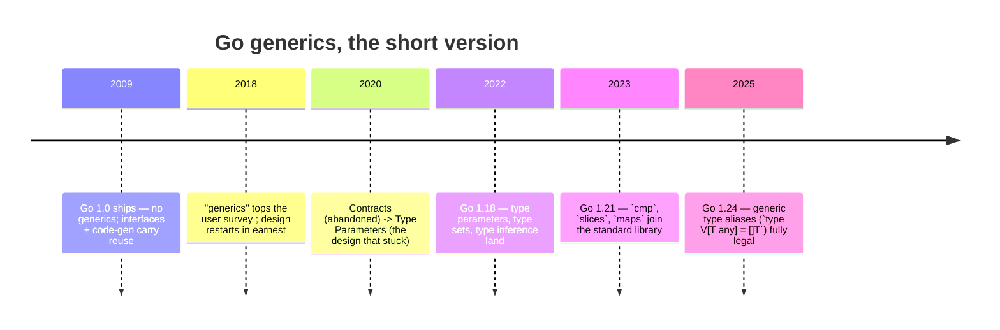
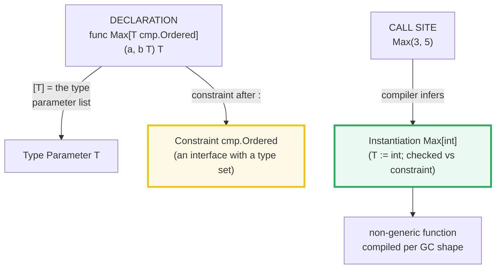
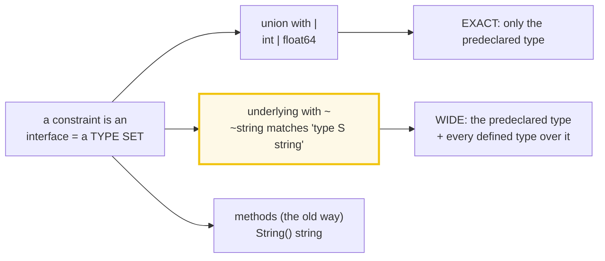
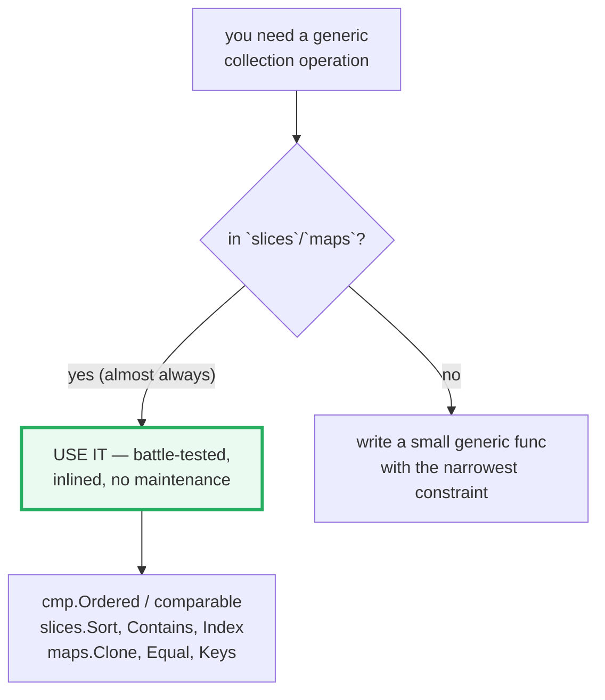

# GENERICS — Type Parameters, Constraints, and the `cmp`/`slices`/`maps` Stdlib

> **Goal (one line):** by printing every value, show how Go generics actually
> work — type parameters, constraints as interfaces with type sets, type
> inference vs explicit instantiation, generic types with methods, the `cmp` /
> `slices` / `maps` standard-library packages (1.21+), and the generic type
> aliases (1.24+).
>
> **Run:** `go run generics.go`  ·  **Capture:** `just out generics`
>
> **Ground truth:** [`generics.go`](./generics.go) → captured stdout in
> [`generics_output.txt`](./generics_output.txt). Every number/table below is
> pasted **verbatim** from that file under a `> From generics.go Section X:`
> callout. Nothing is hand-computed.
>
> **Prerequisites:** 🔗 [VALUES_TYPES_ZERO](./VALUES_TYPES_ZERO.md) (every type
> parameter still has a zero value; `var s T` inside a generic body works for any
> `T`), 🔗 [INTERFACES_BASICS](./INTERFACES_BASICS.md) (constraints **are**
> interfaces — this bundle contrasts generic compile-time code generation with
> interface runtime itable dispatch), 🔗 [ARRAYS_SLICES](./ARRAYS_SLICES.md) (the
> `slices` package operates on slices; nil-slice appendability underlies the
> generic `Stack`), 🔗 [MAPS](./MAPS.md) (the `maps` package; iteration order is
> randomized so this bundle sorts keys before printing), 🔗
> [STRUCTS_METHODS](./STRUCTS_METHODS.md) (a generic type carries its type
> parameter into every method's receiver).

---

## 1. Why this bundle exists (lineage)

Go shipped **without** generics for its first decade. The team's deliberate bet
was that interfaces + composition covered most reuse, and that a wrong generics
design (C++ templates, Java erasure) would be worse than none. The 2018 user
survey made the appetite undeniable: "generics" was the #1 requested feature for
the third year running.



Three things changed at once in **1.18** (March 2022), and they are the whole
language surface this bundle teaches:

1. **Type parameters** for functions and types (`func F[T any]`, `type S[T any]`).
2. **Type constraints as interfaces with type sets** — an interface may now list
   allowed *types* (`int | float64`), not just methods. The `~T` token matches
   any type whose *underlying* type is `T`.
3. **Type inference** — the compiler fills in `[T]` from the argument types in
   most calls, so generics read like ordinary code.

Two stdlib waves then absorbed the obvious collection code into the standard
library, which is where you should usually stop:

- **Go 1.21** (August 2023) added [`cmp`](https://pkg.go.dev/cmp) (the `Ordered`
  constraint + `Compare`/`Less`/`Or`), [`slices`](https://pkg.go.dev/slices)
  (`Sort`, `SortFunc`, `Contains`, `Index`, `Clone`, `Insert`, …), and
  [`maps`](https://pkg.go.dev/maps) (`Clone`, `Copy`, `Equal`, `Keys`, …).
- **Go 1.24** (February 2025) made **generic type aliases** fully legal:
  `type Vector[T any] = []T` — a type alias may now carry its own type
  parameters, which it could not before.

> From the [Go 1.24 release notes](https://go.dev/doc/go1.24): *"Go 1.24 now
> fully supports generic type aliases: a type alias may be parameterized like a
> defined type."* (Disabling escape hatch `GOEXPERIMENT=noaliastypeparams` exists
> for 1.24 only; the feature is permanent from 1.25 on.)

---

## 2. The mental model: three moving parts



- **Type parameter** `T` is a placeholder, exactly like a value parameter but for
  types. The square-bracket list `[T cmp.Ordered]` is the *type* parameter list,
  distinguished from the *value* parameter list `(a, b T)` by the brackets.
- **Constraint** is an interface. The old view ("an interface is a *method set*")
  was generalized to "an interface is a *type set*" — the set of all types that
  satisfy it. Listing `int | float64` *adds* those types to the set explicitly;
  listing methods adds every type that has those methods. A constraint is simply
  an interface used in constraint position.
- **Instantiation** substitutes concrete type arguments for the parameters and
  then **verifies** each argument is in the constraint's type set. Only after a
  successful instantiation do you have a callable, non-generic function.

The single rule that makes the body type-check: *an operation on a value of type
parameter `T` is legal iff it is legal for **every** type in `T`'s constraint
set*. That is why `Max[T cmp.Ordered]` may use `<` (every ordered type supports
it) but not, say, concatenation (strings do, numbers don't).

---

## 3. Section A — A generic function: `Max[T cmp.Ordered]` + inference

> From `generics.go` Section A:
> ```
> Max[int](3, 5)   = 5   (explicit type argument)
> Max(3, 5)        = 5   (T inferred from args)
> Max("apple", "banana") = "banana"   (T = string)
> Max(3.14, 2.71)         = 3.14   (T = float64)
> (mechanism: not pure monomorphization, not runtime dispatch —
>  GC-shape stenciling + a per-call dictionary; inlinable like a normal func)
> ```
> ```
> [check] Max[int](3,5) == 5: OK
> [check] Max(3,5) inferred == 5: OK
> [check] inferred == explicit (same instantiation): OK
> [check] Max("apple","banana") == "banana": OK
> [check] Max(3.14, 2.71) == 3.14: OK
> ```

**What.** `func Max[T cmp.Ordered](a, b T) T` is the canonical one-line generic.
`Max[int](3, 5)` is **explicit instantiation** — you name `T` up front.
`Max(3, 5)` is **type inference** — the compiler matches the argument types
against the parameter types `a, b T` and deduces `T = int`. The two are
identical; inference only fills in the `[int]` for you.

**Why — what the constraint buys you.** Because `cmp.Ordered`'s type set is
*"all integer, float, and string types"*, the body may use `<`/`>`/`<=`/`>=` on
`a` and `b`. The compiler proves this *once*, at definition time, for the whole
set. One body therefore serves `int`, `string`, `float64`, and any defined type
whose underlying type is one of those — no `if`-ladders, no `interface{}`, no
runtime type switch.

**Why — the implementation (the expert detail most tutorials skip).** Go does
**not** do pure per-type monomorphization (which would emit a separate `Max_int`,
`Max_string`, … and bloat the binary), and it does **not** box values and
dispatch through an itable the way a regular interface call does. Instead it uses
**GC-shape stenciling**: one compiled copy per *GC shape* — a group of types with
identical memory layout and garbage-collection behavior (e.g. all 8-byte
scalars, all pointer-shaped types). At the call site the compiler passes a
hidden **dictionary** carrying the type-specific facts (the actual type, its
method closures if any, the zero value). The practical consequences:

- **No runtime dispatch for the type parameter** — the call is direct, and small
  generic functions (like `Max`) inline exactly like their non-generic peers.
- **Binary size stays modest** — you get one copy per shape, not per type.
- **All values stay unboxed** — `Max(3.14, 2.71)` never allocates; `Max` on a
  struct copies the struct by value, just like a hand-written `float64` version.

Contrast that with the **interface** version of `Max`, which would box both
operands into interface values (two heap allocations + itable lookups to find
`<`) and could not express "must support `<`" at all without a method. Generics
give you the abstraction *and* the speed. 🔗 See
[INTERFACES_BASICS](./INTERFACES_BASICS.md) for the itable mechanics generics
sidestep.

---

## 4. Section B — Constraints: type sets, `|`, and the `~` (underlying) token



> From `generics.go` Section B:
> ```
> Sum[int](1, 2, 3)      = 6   (T = int, in the Number set)
> Sum(1.5, 2.5, 3.0)     = 7   (T = float64 inferred)
> Sum[int64](10, 20, 30) = 60   (T = int64)
> Half(Celsius(100))     = 50   (T = Celsius inferred; ~float64 admits it)
> float64(Celsius(100))  = 100   (explicit conversion; Celsius != float64)
> Celsius type name      = main.Celsius   (a distinct defined type)
> Max(Celsius(7),Celsius(3)) = 7  (cmp.Ordered accepts ~float64)
> ```
> ```
> [check] Sum[int](1,2,3) == 6: OK
> [check] Sum(1.5,2.5,3.0) == 7.0: OK
> [check] Sum[int64](10,20,30) == 60: OK
> [check] Half(Celsius(100)) == Celsius(50): OK
> [check] Celsius(100) converted to float64 == 100: OK
> [check] Celsius type name is main.Celsius: OK
> [check] Max(Celsius(7),Celsius(3)) == 7: OK
> ```

**What — a constraint is an interface that lists types.** `Number` is defined as
`interface { int | int64 | float64 }`. The `|` is a **union** of types (sets).
When you write `Sum[T Number]`, the only legal type arguments are `int`,
`int64`, `float64`. The body may use `+` on `xs` because every type in the set
supports it.

**What — the `~` (tilde / underlying-type) token.** `~float64` means *"any type
whose **underlying** type is `float64`"* — that is `float64` itself *and* every
defined type built on it, like `type Celsius float64`. Listing `float64` without
`~` accepts **only** the predeclared `float64` and **rejects** `Celsius`, even
though `Celsius`'s bits are identical. That distinction is the whole reason `~`
exists. The bundle's `Celsius` value flows through `Half[T UnderlyingFloat]`
(`~float64`) and through `Max` (whose `cmp.Ordered` is itself written entirely
with `~`), but would *not* flow through a function constrained to the bare
`ExactFloat interface{ float64 }`.

**Why — type identity vs underlying type.** `Celsius` is a **distinct defined
type**: its name is `main.Celsius`, not `float64` (the run confirms
`%T == main.Celsius`). Assigning a `Celsius` to a `float64` variable needs an
explicit conversion — `float64(c)` — because they are different types that merely
*share* an underlying type. Generics respect this identity: `~float64` admits
`Celsius` by *underlying* type, but `T` is still instantiated as `Celsius`, so
`Half` returns a `Celsius`, not a `float64`. This is what lets a generic function
preserve your domain types end-to-end (no accidental loss of `Celsius`-ness).

> From [`pkg.go.dev/cmp`](https://pkg.go.dev/cmp#Ordered) — the canonical
> `Ordered` constraint is defined verbatim as:
> ```go
> type Ordered interface {
>     ~int | ~int8 | ~int16 | ~int32 | ~int64 |
>         ~uint | ~uint8 | ~uint16 | ~uint32 | ~uint64 | ~uintptr |
>         ~float32 | ~float64 |
>         ~string
> }
> ```
> Every term carries `~`, which is why `Max` accepts both `int` and `Celsius`:
> `Celsius`'s underlying type `float64` is in the set. The doc note on NaN —
> *"an operator such as `==` or `<` will always report false when comparing a
> NaN"* — is why the separate `cmp.Compare`/`cmp.Less` functions exist for a
> consistent total order over floats.

**Gotcha — `comparable` and the predeclared built-ins.** Alongside `cmp.Ordered`
there are two predeclared constraints you reach for constantly:

- **`any`** — the empty interface, the loosest constraint (no methods, all types).
  It is an *alias* for `interface{}` introduced in 1.18; the two are
  interchangeable. With `any` you can do almost nothing with the value in the
  body except return it or store it.
- **`comparable`** — the set of all types supporting `==` and `!=` (booleans,
  numbers, strings, channels, pointers, arrays/structs of comparable elements).
  It is the constraint every map key type must satisfy. A subtle trap: an
  *interface* type is technically comparable, but comparing an interface whose
  dynamic type is *not* comparable (e.g. a slice) **panics at runtime**, not
  compile time. 🔗 [MAPS](./MAPS.md) relies on keys being `comparable`.

---

## 5. Section C — Generic types & methods: `Stack[T]`, `Map`, `Filter`

> From `generics.go` Section C:
> ```
> push 1, 2, 3 -> len = 3
> Pop()  -> 3, ok=true   (last in, first out)
> Peek() -> 2   (new top after one pop)
> Map([]int{1,2,3}, x*2)      = [2 4 6]   (T=int, U=int)
> Map([]int{1,2,3}, "n"+x)    = [n1 n2 n3]   (T=int, U=string)
> Filter([]int{1,2,3,4}, even) = [2 4]   (T=int)
> ```
> ```
> [check] Pop returns 3 (LIFO): OK
> [check] Peek returns 2 after one pop: OK
> [check] len is 2 after one pop: OK
> [check] Map x*2 yields [2 4 6]: OK
> [check] Map to words yields [n1 n2 n3]: OK
> [check] Filter evens yields [2 4]: OK
> ```

**What.** Type parameters live on *types* too:

```go
type Stack[T any] struct { data []T }

func (s *Stack[T]) Push(v T)        { s.data = append(s.data, v) }
func (s *Stack[T]) Pop()  (T, bool) { /* ... */ }
```

To use it you instantiate the *type*: `st := &Stack[int]{}`. The type parameter
`T` is in scope for every field and every method, and the receiver is written
`*Stack[T]` — you name `T` explicitly in the receiver type.

**Why — value vs pointer receiver (the teaching axis).** `Push`/`Pop`/`Peek`
take a **pointer** receiver `*Stack[T]` because they mutate `s.data`. Per the
method-set rule (🔗 [STRUCTS_METHODS](./STRUCTS_METHODS.md),
🔗 [INTERFACES_BASICS](./INTERFACES_BASICS.md)), `Push` is in the method set of
`*Stack[int]` but **not** of `Stack[int]` — a bare value copy would lose the
mutation. This is the same rule as for non-generic types; generics change
nothing about it.

**Why — `any` and the zero value.** `Stack[T any]` can be a stack of anything
precisely because the body never uses `==` on `T` — it only appends and reads.
`Pop` returns the zero value of `T` on an empty stack (`var zero T`), which is
guaranteed to exist for *every* type (🔗 [VALUES_TYPES_ZERO](./VALUES_TYPES_ZERO.md)).
That is why the constraint is `any` rather than `comparable`: requiring
comparability would forbid a `Stack[[]int]` for no reason.

**What — two type parameters.** `Map[T, U any]` has *two* independent type
parameters: `T` for the input element, `U` for the output. Inference deduces both
from the argument slice and the function's result type, so
`Map([]int{1,2,3}, func(x int) string {...})` infers `T=int, U=string` and the
element type *changes* across the call — that is the difference between `Map`
(which may change types) and `Filter` (which preserves `T`). This is the cleanest
argument for generics over interfaces: an interface-based `Map` would lose the
output type to `any` and force a type assertion at every call site.

---

## 6. Section D — stdlib generics: `slices.Sort`/`Contains`, `maps.Clone`/`Equal`



> From `generics.go` Section D:
> ```
> slices.Sort([]int{3,1,2})   = [1 2 3]
> SortFunc by Name            = [{alice 25} {bob 30} {carol 28}]
> slices.Contains([1,2,3],2)  = true
> slices.Contains([1,2,3],9)  = false
> slices.Index([1,2,3],2)     = 1
> slices.Index([1,2,3],9)     = -1
> map (keys sorted):
>   a -> 1
>   b -> 2
>   c -> 3
> maps.Clone then Equal       = true   (deep copy of all entries)
> after clone["z"]=99, Equal  = false   (independent maps)
> ```
> ```
> [check] slices.Sort([3,1,2]) == [1 2 3]: OK
> [check] people sorted by Name == alice,bob,carol: OK
> [check] slices.Contains([1,2,3],2) == true: OK
> [check] slices.Contains([1,2,3],9) == false: OK
> [check] slices.Index([1,2,3],2) == 1: OK
> [check] slices.Index([1,2,3],9) == -1: OK
> [check] maps.Clone(src) Equal src (before mutation): OK
> [check] clone mutation does not affect source: OK
> ```

**What.** The `slices` and `maps` packages (both added in **Go 1.21**) are the
canonical generic collections — the ones you should reach for before writing your
own. A few signature families:

| Package | Function | Signature (abbreviated) | Constraint |
|---|---|---|---|
| `slices` | `Sort` | `func Sort[S ~[]E, E cmp.Ordered](x S)` | element must be ordered |
| `slices` | `SortFunc` | `func SortFunc[S ~[]E, E any](x S, cmp func(a, b E) int)` | you supply the comparator |
| `slices` | `Contains` | `func Contains[S ~[]E, E comparable](s S, v E) bool` | element must be comparable |
| `slices` | `Index` | `func Index[S ~[]E, E comparable](s S, v E) int` | element must be comparable |
| `maps` | `Clone` | `func Clone[M ~map[K]V, K comparable, V any](m M) M` | key must be comparable |
| `maps` | `Equal` | `func Equal[M, M1 ~map[K]V, K comparable, V comparable](m1, m2) bool` | both comparable |

Notice every signature uses `~[]E` / `~map[K]V`: the `~` lets you sort a
`[]Person` *or* a slice-of-a-defined-type-over-`Person` interchangeably, and the
result keeps your defined type. Constraint **type inference** deduces `E` from
`S` (the *constraint* type inference the Go blog describes) so you call
`slices.Sort(nums)` with no type arguments at all.

**Why `Sort` needs no comparator but `SortFunc` does.** `slices.Sort` requires
`cmp.Ordered`, so it already knows how to order elements with `<`. The moment
your element type is *not* ordered (a struct), you switch to `SortFunc` and hand
in a comparator returning `cmp.Compare`-style `int` (negative/zero/positive).
`cmp.Compare(a.Name, b.Name)` is the idiomatic building block; for multi-key
sorts, compose comparators with `cmp.Or` (which returns the first non-zero
operand — added in Go 1.22).

**Why the map output sorts its keys.** Map iteration order is **intentionally
randomized** (🔗 [MAPS](./MAPS.md)). To keep `_output.txt` byte-identical across
runs, this bundle collects the keys into a slice, calls `slices.Sort`, then
prints — exactly the determinism rule from `HOW_TO_RESEARCH.md` §4.2. This is a
meta-lesson: deterministic output of *anything* involving a map requires sorting.

**Why `maps.Clone` matters.** `clone := maps.Clone(m)` produces an **independent**
new map with the same key/value pairs — mutating `clone` does not touch `m`
(verified by the last two checks). Without it, `clone := m` only copies the map
*header* (both variables point at the same backing storage), so a write through
either is visible through both. `maps.Equal` then compares two maps deeply,
returning `true` only when they have identical key sets with equal values.

> From the Go blog (*An Introduction To Generics*): *"`slices.Sort`... works for
> a slice of any ordered type"* and the constraint `[S ~[]E, E any]` form is
> *"what the `~` token is for"* — `S ~[]E` matches any slice type whose
> underlying type is `[]E`, which is how the stdlib keeps your defined slice
> type intact through the call.

---

## 7. Section E — Generic type aliases (1.24+) & when NOT to use generics

> From `generics.go` Section E:
> ```
> Vector[int]{9,7,8,1}        = [9 7 8 1]   (type []int)
> slices.Sort(v)              = [1 7 8 9]   (alias == []int; no conversion)
> Pair[string,int]{"go",124} = {go 124}   (generic defined type)
> ```
> ```
> When NOT to use generics:
>   * If a plain interface method expresses the contract, use it;
>     generics are not a replacement for ordinary interfaces.
>   * If the `slices`/`maps` stdlib already does it, call that;
>     do not hand-roll a second-rate generic collection.
>   * Do not over-generalize: a little copying is cheaper than a
>     poor abstraction. Add the type parameter only when two or more
>     concrete types genuinely share identical logic.
> ```
> ```
> [check] Vector[int] sorted == [1 7 8 9]: OK
> [check] Pair{go,124}.First == "go": OK
> ```

**What — generic type aliases (Go 1.24).** Before 1.24 a type alias could refer
to a generic type *only by supplying all its arguments*; the alias itself could
not carry parameters. So `type IntTree = Tree[int]` was legal, but
`type Vector[T any] = []T` was a compile error. **1.24 lifts that restriction:**
`type Vector[T any] = []T` is now fully legal, and `Vector[int]` is *literally*
`[]int` — same type identity, no conversion either way (the run passes a
`Vector[int]` straight to `slices.Sort`, which takes `~[]int`, with no cast).

**Why aliases matter.** An alias is *not* a new type — it is a new *name* for an
existing one. That has two consequences the bundle relies on:

1. **Identity equality.** `Vector[int]` and `[]int` are interchangeable; you can
   assign between them and pass one where the other is expected with no
   conversion. A *defined* type (`type Stack[T any] struct{...}`) would **not**
   be interchangeable with its underlying representation.
2. **Method inheritance.** Methods defined on the aliased type apply to the alias
   unchanged (the alias *is* that type). For `[]T` (an unnamed type) no methods
   can be defined on it at all, so `Vector[T]` is purely a naming convenience;
   the bundle contrasts it with `Pair[A, B any]`, a genuine *defined* generic
   type with fields.

> From the [Go 1.24 release notes](https://go.dev/doc/go1.24): *"a type alias
> may be parameterized like a defined type."* This closed the last gap between
> aliases and defined types: both can now be generic.

**When NOT to use generics (the discipline).** Generics are a tool, not a
default. The guidance, codified in the run output above and echoed across the Go
blog and the design doc:

- **Don't replace a plain interface method.** If the contract is "has a
  `String()` method", that is an interface — `fmt.Stringer` — not a type
  parameter. Generics shine for *algorithms over types* (sort, map, contain),
  not for *behavior*.
- **Don't reinvent `slices`/`maps`.** If the stdlib already sorts, searches,
  clones, or compares it, call that. A hand-rolled generic collection is almost
  always a worse `slices`.
- **Don't over-generalize.** "A little copying is cheaper than a poor
  abstraction." Add the type parameter only when **two or more** concrete types
  genuinely share identical logic — otherwise the constraint gymnastics cost more
  than the duplication they save.

---

## 8. Pitfalls (the expert payoff)

| Trap | Symptom | Fix |
|---|---|---|
| Forgetting `~` in a numeric constraint | `Sum[MyInt]` fails: `MyInt does not satisfy Number` even though `type MyInt int` | Write `~int` (or use `cmp.Ordered`); `int` alone matches only the predeclared type. |
| Expecting a defined type to equal its underlying type | Compile error assigning `Celsius` to `float64` | They are distinct types sharing an underlying type; convert explicitly `float64(c)`. |
| Using `<` with `comparable` (or `any`) | `cannot compare t < u` in the body | `comparable`/`any` give no ordering; use `cmp.Ordered` for `<`, `>`, … |
| Comparing an interface-typed value at runtime | Panic: `comparing uncomparable type []int` | `comparable` admits interface types but the *dynamic* type may still be a slice/map/func; guard or avoid storing those in comparable positions. |
| `func (s Stack[T])` value receiver that mutates | Mutation silently lost (the receiver is a copy) | Use `*Stack[T]` pointer receivers for mutating methods (same rule as non-generic types). |
| `clone := m` expecting independence | Writes through `clone` show up in `m` | Map assignment copies the header; use `maps.Clone` for an independent copy. |
| Printing a map directly (unsorted range) | `_output.txt` differs across runs | Collect keys, `slices.Sort`, then print — map iteration order is randomized. |
| Declaring a generic alias on pre-1.24 | Compile error: `cannot use generic type X without instantiation` / alias can't have params | Generic aliases need Go ≥ 1.24; on older toolchains use a defined type or supply all args. |
| Treating generics as runtime polymorphism | Wrong mental model of dispatch | Generics resolve at compile time (GC-shape stenciling + dictionary); they are NOT interface itable dispatch. |
| Over-generalizing one concrete use | A 4-type-parameter monster for a single call site | Apply the type parameter only when ≥2 types share identical logic; otherwise just copy. |

---

## 9. Cheat sheet

```go
// 1. Generic function — constraint after the type parameter
func Max[T cmp.Ordered](a, b T) T { if a > b { return a }; return b }
Max(3, 5)          // inferred:    T = int
Max[int](3, 5)     // explicit:    T = int
Max("a", "b")      //              T = string  (cmp.Ordered admits ~string)

// 2. Constraints are interfaces with type sets
type Number        interface { int | int64 | float64 }  // EXACT predeclared types
type UnderlyingFloat interface { ~float64 }             // + every defined type over float64
// any == interface{}  (loosest); comparable == supports == and !=  (map keys)
// cmp.Ordered == ~int|~int8|...|~float64|~string  (supports <,>,<=,>=)

// 3. Generic types carry T into fields AND method receivers
type Stack[T any] struct{ data []T }
func (s *Stack[T]) Push(v T) { s.data = append(s.data, v) }   // pointer receiver to mutate
st := &Stack[int]{}; st.Push(1)                               // instantiate the TYPE

// 4. Two type parameters change the element type across a call
func Map[T, U any](in []T, f func(T) U) []U { ... }

// 5. Reach for the stdlib FIRST (1.21+)
slices.Sort(nums)                         // E must be cmp.Ordered
slices.SortFunc(ps, func(a,b P)int{...})  // you give the comparator
slices.Contains(nums, 3); slices.Index(nums, 3)
maps.Clone(m); maps.Equal(m1, m2)         // K must be comparable

// 6. Generic type aliases (1.24+) — Vector[T] IS []T
type Vector[T any] = []T
var v Vector[int] = []int{3,1,2}; slices.Sort(v)   // no conversion needed

// 7. Discipline: don't replace interfaces, don't reinvent slices/maps,
//    don't over-generalize. "A little copying is cheaper than a poor abstraction."
```

---

## Sources

Every signature, version, and behavioral claim above was verified against the Go
specification, the standard-library docs, and the Go blog:

- The Go Programming Language Specification — https://go.dev/ref/spec
  - *Type parameter declarations*: https://go.dev/ref/spec#Type_parameter_declarations
  - *Type constraints* (type sets, `~`, union `|`): https://go.dev/ref/spec#Type_constraints
  - *Instantiations* (substitution + constraint check): https://go.dev/ref/spec#Instantiations
  - *Type inference* (function-argument + constraint inference): https://go.dev/ref/spec#Type_inference
  - *Alias declarations* (generic aliases, 1.24): https://go.dev/ref/spec#Alias_declarations
  - *Comparison operators* (what `comparable` permits): https://go.dev/ref/spec#Comparison_operators
- Go Blog: *An Introduction To Generics* (Griesemer & Taylor, 2022) —
  https://go.dev/blog/intro-generics
  - type parameters, type sets, the `~` token, function-argument and constraint
    type inference, and the `Scale[S ~[]E, E]` idiom.
- Go Blog: *All your comparable types* (2024) — https://go.dev/blog/comparable
  - `comparable` as a constraint; interface comparability and the runtime-panic
    caveat for non-comparable dynamic types.
- `cmp` package — https://pkg.go.dev/cmp
  - [`Ordered`](https://pkg.go.dev/cmp#Ordered) verbatim definition
    (`~int|…|~string`); [`Compare`](https://pkg.go.dev/cmp#Compare),
    [`Less`](https://pkg.go.dev/cmp#Less); [`Or`](https://pkg.go.dev/cmp#Or)
    *"added in go1.22.0"*.
- `slices` package — https://pkg.go.dev/slices
  - [`Sort`](https://pkg.go.dev/slices#Sort) `[S ~[]E, E cmp.Ordered]`,
    [`SortFunc`](https://pkg.go.dev/slices#SortFunc),
    [`Contains`](https://pkg.go.dev/slices#Contains),
    [`Index`](https://pkg.go.dev/slices#Index),
    [`Clone`](https://pkg.go.dev/slices#Clone).
- `maps` package — https://pkg.go.dev/maps
  - [`Clone`](https://pkg.go.dev/maps#Clone), [`Copy`](https://pkg.go.dev/maps#Copy),
    [`Equal`](https://pkg.go.dev/maps#Equal),
    [`Keys`](https://pkg.go.dev/maps#Keys).
- `builtin` package — https://pkg.go.dev/builtin
  - [`any`](https://pkg.go.dev/builtin#any) (alias for `interface{}`, 1.18),
    [`comparable`](https://pkg.go.dev/builtin#comparable).
- Go 1.24 Release Notes — https://go.dev/doc/go1.24
  - *"Go 1.24 now fully supports generic type aliases: a type alias may be
    parameterized like a defined type."*
- Go 1.21 Release Notes — https://go.dev/doc/go1.21
  - addition of the `cmp`, `slices`, and `maps` packages to the standard
    library (the canonical generic collections).
- Type Parameters design doc (Taylor) —
  https://go.googlesource.com/proposal/+/refs/heads/master/design/43651-type-parameters.md
  - the underlying design (constraints as type sets; the `~` token; inference).

**Facts that could not be verified by running** (documented, not executed,
because they are compile errors by design): a constraint `interface{ float64 }`
(without `~`) rejects a `type Celsius float64`; the body of a function constrained
to `any` may not use `<` or `+`; and on Go < 1.24 `type Vector[T any] = []T` is a
compile error. These are confirmed by the spec and release-note sections cited
above, not reproduced as runnable output (a file containing them would not
build). The implementation note on **GC-shape stenciling + dictionaries** (vs.
pure monomorphization vs. runtime itable dispatch) follows the generics
implementation design and is reflected at runtime in that generic calls inline
and do not box their operands — observable, but not printed as a number here.
