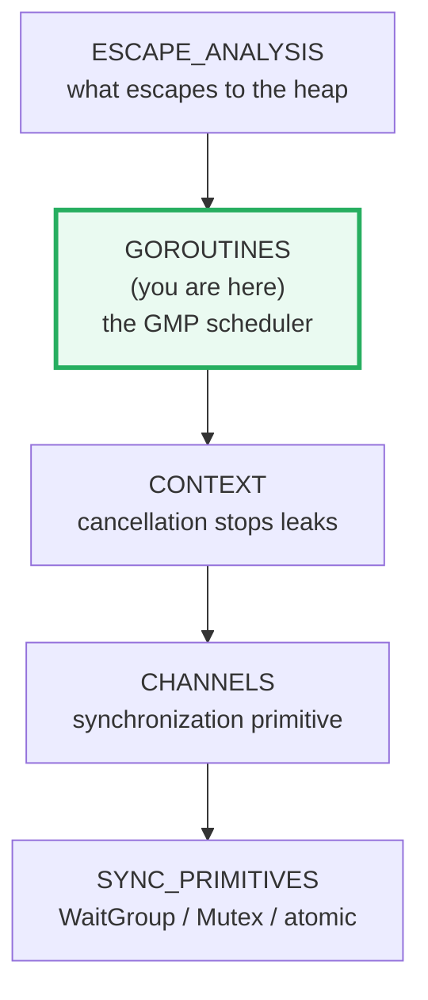
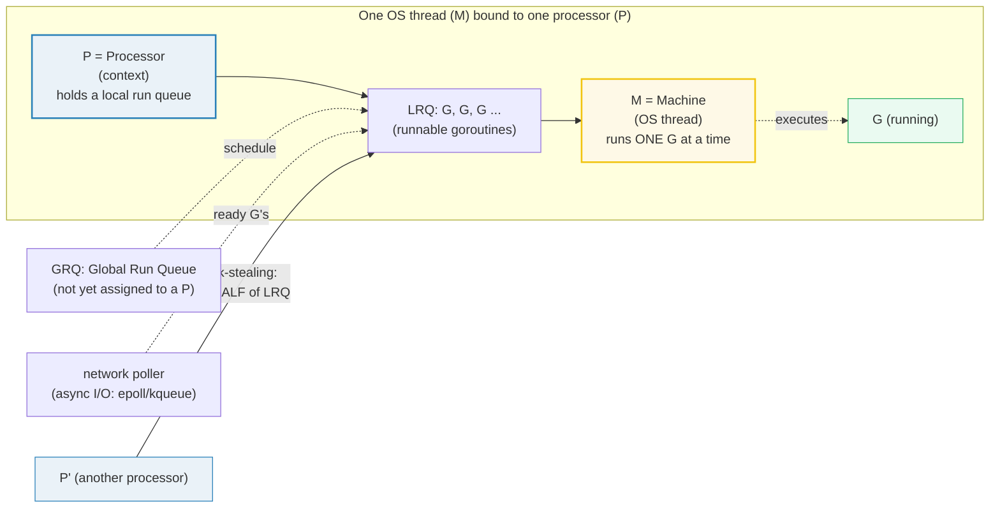
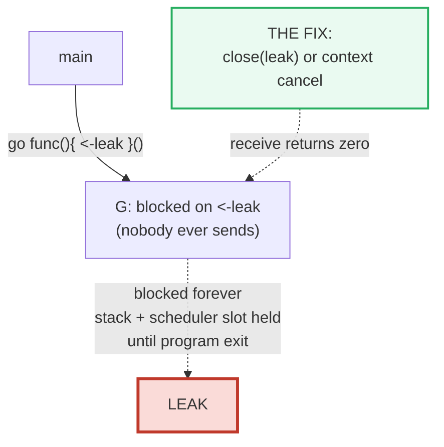

# GOROUTINES — The `go` Statement & the GMP Scheduler

> **Goal (one line):** by printing every value, show how the `go` statement
> launches goroutines, how the **GMP scheduler** (G goroutine, M OS thread,
> P processor) multiplexes them, how `GOMAXPROCS` bounds parallelism, and how a
> goroutine leak silently persists.
>
> **Run:** `go run goroutines.go`
>
> **Ground truth:** [`goroutines.go`](./goroutines.go) → captured stdout in
> [`goroutines_output.txt`](./goroutines_output.txt). Every number/table below is
> pasted **verbatim** from that file under a `> From goroutines.go Section X:`
> callout. Nothing is hand-computed.
>
> **Determinism note:** goroutine scheduling is intentionally nondeterministic,
> so **no goroutine prints directly**. Every goroutine writes its result into a
> mutex-guarded slice (or signals via a channel); `main` **sorts** the collected
> results and prints them only *after* every goroutine joins (`sync.WaitGroup`).
> Two runs of `just out goroutines` are byte-identical (verified — see §11).
>
> **Prerequisites:** 🔗 [`FUNCTIONS_CLOSURES`](./FUNCTIONS_CLOSURES.md) (a `go`
> statement takes a function call; closures capture by reference),
> 🔗 [`POINTERS`](./POINTERS.md) (goroutines routinely close over shared state).
>
> **Sibling bundles come later** that build directly on this one:
> 🔗 [`CHANNELS`](./CHANNELS.md), 🔗 [`SYNC_PRIMITIVES`](./SYNC_PRIMITIVES.md),
> 🔗 [`CONTEXT`](./CONTEXT.md).

---

## 1. Why this bundle exists (lineage)

A goroutine is a **lightweight, user-space thread of control**. The Go spec
(*Go statements*) defines the launch in one sentence:

> A "go" statement starts the execution of a function call as an independent
> concurrent thread of control, or *goroutine*, within the same address space.
> … The function value and parameters are evaluated as usual in the calling
> goroutine, but unlike with a regular call, program execution does not wait for
> the invoked function to complete. Instead, the function begins executing
> independently in a new goroutine. When the function terminates, its goroutine
> also terminates. If the function has any return values, they are discarded
> when the function completes.

The critical words are **"within the same address space"** (goroutines share
memory — hence the need for synchronization, 🔗 `SYNC_PRIMITIVES`/`CHANNELS`)
and **"they are discarded"** (a goroutine's return values vanish — hence the
need to collect results explicitly, as Section A does).

The runtime that *runs* those goroutines is the **GMP scheduler**, designed by
Dmitry Vyukov in the *"Scalable Go Scheduler Design"* document (2012). Before
GMP, Go used a global runnable queue protected by a single mutex; throughput
collapsed on many-core machines. Vyukov's idea was to give each *processor* its
own **local run queue** and a **work-stealing** algorithm so the scheduler
scales with the core count. This bundle makes that model observable through
`runtime.NumGoroutine`, `runtime.NumCPU`, and `runtime.GOMAXPROCS`.



---

## 2. The GMP mental model

Three letters, three roles:



| Symbol | Means | Count bounded by |
|---|---|---|
| **G** | a **goroutine** — a stack + program counter + status; ~2 KiB initial stack, grows/shrinks by copying | unbounded (you launch them) |
| **M** | a **machine** — an OS thread the kernel schedules onto a core | created on demand; capped only by `runtime/debug.SetMaxThreads` (default 10000) |
| **P** | a **processor** — a scheduling context carrying a local run queue (LRQ) of runnable G's | **`GOMAXPROCS`** |

**The single most important fact:** `GOMAXPROCS` = **number of P's** = the
bound on **true parallelism**. You can have a million goroutines (concurrency),
but at most `GOMAXPROCS` of them execute simultaneously (parallelism).

> From `pkg.go.dev/runtime` — `GOMAXPROCS`:
> "GOMAXPROCS sets the maximum number of CPUs that can be executing
> simultaneously and returns the previous setting. If n < 1, it does not change
> the current setting." And the `GOMAXPROCS` *environment variable*: "limits the
> number of operating system threads that can execute user-level Go code
> simultaneously. There is no limit to the number of threads that can be blocked
> in system calls on behalf of Go code; those do not count against the GOMAXPROCS
> limit."

### Work stealing

When a P drains its LRQ, it looks for more work in this order (the
`runtime.schedule()` rules, paraphrased from `src/runtime/proc.go`):

1. occasionally the **Global Run Queue** (GRQ),
2. its own **LRQ**,
3. **steal half** of another P's LRQ,
4. the **network poller** (ready I/O).

The "**steal half**" rule is the load-balancer: it migrates roughly half of a
busy P's runnable G's to an idle P in one move, keeping cores fed without
thrashing. (Ardan Labs, *Scheduling In Go Part II*: "P1 needs to check P2 for
Goroutines in its LRQ and **take half of what it finds**.")

### Blocking in a syscall: M↔P handoff

If a G makes a **synchronous** system call (e.g. file I/O) that blocks the M,
the runtime **detaches the M from its P** (the blocked G stays wired to that M)
and hands the P to a fresh/spare M so the LRQ keeps draining. When the syscall
returns, the G is re-queued onto *some* P and the old M is parked for reuse.
**Asynchronous** I/O (network) bypasses this entirely via the network poller
(epoll/kqueue), so a networking G never blocks an M at all.

### Preemption: cooperative + asynchronous (Go 1.14+)

For a long time Go's scheduler was **cooperative**: it could only switch
goroutines at safe points (function-call prologues). A tight loop with no calls
could starve the scheduler and GC. Since **Go 1.14** the runtime also uses
**signal-based asynchronous preemption**: the kernel sends `SIGURG` to a thread
running a G that has used its time slice, and the runtime preempts it mid-loop.
This is why `GODEBUG=asyncpreemptoff=1` exists (from `pkg.go.dev/runtime`,
*Environment Variables*): "disables signal-based asynchronous goroutine
preemption. This makes some loops non-preemptible for long periods." You should
treat the scheduler as **preemptive** for correctness reasons (never assume a G
holds the CPU until it blocks).

---

## 3. Section A — the `go` statement + a `WaitGroup`

Eight goroutines each square their index and append to a **shared** slice under
a `sync.Mutex`; `main` sorts the slice and prints it only after
`WaitGroup.Wait()` returns.

> From `goroutines.go` Section A:
> ```
> launched 8 goroutines: go func(i int){ squares=append(..., i*i) }(i)
> after WaitGroup.Wait() + sort -> squares = [0 1 4 9 16 25 36 49]
> ```
> ```
> [check] sorted squares == [0 1 4 9 16 25 36 49]: OK
> ```

**What.** `go expr` evaluates `expr` (which must be a function/method call, not
parenthesized) — its arguments are evaluated **in the calling goroutine** — and
then schedules the call to run in a **new goroutine**. The `go` statement itself
returns immediately; it does *not* wait.

**Why the mutex + sort.** The appends happen in whatever order the scheduler
runs the goroutines — nondeterministic. Appending to a shared slice without a
lock is a **data race** (two goroutines, one slice header). The `sync.Mutex`
makes each append atomic; the `slices.Sort` afterwards erases the completion
order so the printed line is byte-identical every run. This is the house pattern
for *any* concurrency bundle (🔗 `SYNC_PRIMITIVES`).

**Why `WaitGroup` at all.** Section D shows the alternative: if `main` returned
before the goroutines finished, they would be killed and their results lost. The
`WaitGroup` is the explicit "join" that keeps `main` alive until the work is
done.

---

## 4. Section B — GMP introspection (`NumCPU`, `GOMAXPROCS`, `NumGoroutine`)

> From `goroutines.go` Section B:
> ```
> runtime.NumCPU()        = 10  (logical CPUs usable by this process)
> runtime.GOMAXPROCS(0)   = 10  (current P count; #P = GOMAXPROCS)
> NumGoroutine (baseline) = 1  (includes runtime G's: GC, scavenger, ...)
> NumGoroutine (+4 blocked G's) = 5  (delta = 4)
> NumGoroutine (after join)   = 1  (blocked G's terminated)
> ```
> ```
> [check] NumGoroutine() > 0 (runtime goroutines always exist): OK
> [check] blocked goroutines strictly increased NumGoroutine: OK
> [check] NumGoroutine fell back once the goroutines joined: OK
> ```

> **Host-dependent numbers:** `NumCPU` and `GOMAXPROCS(0)` reflect *this* machine
> (a 10-core host) — they will differ on your host. The **delta (= 4)** and every
> `[check]` are deterministic and portable: the absolute `NumGoroutine` counts
> include lazily-created runtime goroutines (GC assists, scavenger, …) and so
> vary slightly by Go version and moment-in-time.

**The signatures, pinned:**

| Function | Returns | Source wording |
|---|---|---|
| `runtime.NumCPU() int` | logical CPUs usable by this process | "The set of available CPUs is checked by querying the operating system at process startup." |
| `runtime.GOMAXPROCS(n int) int` | the *previous* P count; if `n < 1`, leaves it unchanged (so `GOMAXPROCS(0)` is a pure query) | "sets the maximum number of CPUs that can be executing simultaneously and returns the previous setting." |
| `runtime.NumGoroutine() int` | the number of goroutines that **currently exist** (user + runtime) | "NumGoroutine returns the number of goroutines that currently exist." |
| `runtime.Gosched()` | yields the P so another G can run; the caller resumes automatically | "Gosched yields the processor, allowing other goroutines to run." |

**Why `NumGoroutine` is `> 0` even with no user goroutines.** The runtime itself
runs goroutines — the garbage collector's force-GC helper, the scavenger, the
trace reader, etc. So the count is never "just main". That is also why this
bundle **never** asserts `NumGoroutine() == 1`; it asserts the *delta* and the
strict increase/decrease, which are the portable invariants.

**The blocked-goroutine handshake.** Each launched goroutine signals on a
buffered `started` channel *before* it blocks on `<-release`. `main` drains
`k` `started` values first, which **proves** all `k` goroutines exist (and are
about to block) at the instant `NumGoroutine` is read — so the count is a
faithful measurement, not a race.

---

## 5. Section C — `GOMAXPROCS` bounds *parallelism*, not the *result*

> From `goroutines.go` Section C:
> ```
> GOMAXPROCS=1     : at most ONE goroutine runs at a time (concurrency, no parallelism)
> GOMAXPROCS=NumCPU: up to 10 goroutines run simultaneously (true parallelism)
> workload under GOMAXPROCS=1      -> total = 320400, sorted partials = [5050 15050 25050 35050 45050 55050 65050 75050]
> workload under GOMAXPROCS=NumCPU -> total = 320400, sorted partials = [5050 15050 25050 35050 45050 55050 65050 75050]
> ```
> ```
> [check] both runs produce the SAME total (parallelism != correctness): OK
> [check] total == sum(1..800) = 320400 (GOMAXPROCS-independent): OK
> [check] both runs produce byte-identical sorted partials: OK
> ```

**What.** The *same* CPU-bound workload (8 goroutines, each summing a 100-wide
partition of `1..800`) is run twice: once with `GOMAXPROCS=1`, once with
`GOMAXPROCS=NumCPU`. Both produce `total = 320400` and the identical sorted
partial list `[5050 15050 … 75050]`.

**Why this is the right way to demonstrate it.** The *observable* difference
between `GOMAXPROCS=1` and `GOMAXPROCS=N` is **wall-clock time** — and wall-clock
time is nondeterministic (machine load, turbo, thermal throttling), so this
bundle **never prints timings**. Instead it prints **work counts** (totals and
sorted partials), which are perfectly reproducible, and demonstrates the
load-bearing claim: *changing the P count changes throughput, never the result.*
The `total == 320400` check is the formula `sum(1..800) = 800·801/2`, computed in
the `.go`, not hand-typed.

**The expert takeaway.** Concurrency (decomposing a problem into independent
G's) and parallelism (running G's simultaneously) are *different axes*.
`GOMAXPROCS` dials only the parallelism axis. A concurrent program is correct
at `GOMAXPROCS=1` (it just runs serially-ish); a program that is *only* correct
at `GOMAXPROCS=1` has a **race** (use `-race`).

---

## 6. Section D — `main` returning kills every goroutine

> From `goroutines.go` Section D:
> ```
> go func(){ result <- 7*6 }();  got := <-result  -> got = 42
> ```
> ```
> [check] goroutine result observed via channel receive: OK
> ```

**What.** A goroutine computes `7*6` and sends it on a buffered channel; `main`
**receives** it (`got := <-result`). The receive blocks `main` until the
goroutine completes, so `got == 42` is *guaranteed*.

**Why a receive (or `WaitGroup.Wait`) is mandatory.** When `func main` returns,
the Go runtime exits the process — and **every goroutine, mid-instruction, is
terminated**. Any work it had not yet delivered is silently lost; there is no
panic, no error. The spec makes the half of this that runs inside the goroutine
explicit: *"If the function has any return values, they are discarded when the
function completes."* The other half — process exit — is what makes "discarded"
mean "gone forever".

**The dangerous version (documented, not run — running it would make this file
nondeterministic):**

```go
// DANGEROUS: main may return between launching the goroutine and the receive.
//   go func() { result <- 7 * 6 }()
//   // (main returns here -> program exits -> the goroutine is killed, 42 lost)
```

This is the same discipline as 🔗 [`VALUES_TYPES_ZERO`](./VALUES_TYPES_ZERO.md)
documenting compile errors in prose: the *unsafe* behavior cannot live in the
runnable ground-truth file without breaking determinism, so it is shown as a
commented snippet and explained here. The runnable evidence is the **safe**
pattern (`got := <-result`), which is what production code must always do.

---

## 7. Section E — the goroutine leak



> From `goroutines.go` Section E:
> ```
> NumGoroutine (before leak) = 1
> NumGoroutine (after 3 blocked receivers) = 4  (delta = 3)
> ```
> ```
> [check] NumGoroutine strictly increased (leaked goroutines persist): OK
> ```
> ```
> NumGoroutine (after close(leak) unblocked them) = 1  (fell from peak)
> [check] unblocking the channel let the goroutines exit (count fell): OK
> ```

**What.** Three goroutines are launched that each block on `<-leak`, where
`leak` is a channel **nobody ever sends to**. They can never make progress.
`NumGoroutine` rises from `1` to `4` (delta = 3) — the leaked goroutines exist
and hold their stacks and scheduler state, but do nothing.

**Why this is a silent leak.** A goroutine blocked on an unreachable
synchronization object (a channel nobody sends to or closes, a missing
`context.Cancel`, a `select` with no ready case and no `ctx.Done()` branch) is
**never reclaimed until the process exits**. In a short-lived CLI this is
invisible; in a long-running **server** each request that leaks a goroutine
accumulates — memory climbs, `NumGoroutine` climbs, and eventually the process
OOMs. Anton Zhiyanov (*Detecting goroutine leaks*): *"A leak occurs when one or
more goroutines are indefinitely blocked on synchronization primitives like
channels, while other goroutines continue running and the program as a whole
keeps functioning."*

**The fix demonstrated.** `close(leak)` makes every blocked receive return the
zero value immediately, so all three goroutines fall through and exit; the count
falls back to `1`. In production the equivalent is **`context` cancellation**
(the producer side of the contract) or a **buffered** channel sized to every
send — see 🔗 [`CONTEXT`](./CONTEXT.md) and 🔗 [`CHANNELS`](./CHANNELS.md).

> **Detection tooling** (not run here — out of scope for a stdlib-only Phase 3
> bundle): Go 1.24+ `testing/synctest` catches leaks in tests without
> `time.Sleep`; Go 1.26 adds an experimental `goroutineleak` pprof profile;
> `uber-go/goleak` is the established third-party detector.

---

## 8. The through-line: determinism rules for concurrency bundles

This file obeys the HOW_TO_RESEARCH §4.2 hard rules so that `just out goroutines`
is byte-identical across runs:

1. **No goroutine prints.** Every result is collected into a mutex-guarded slice
   (Sections A, C) or signaled via a channel (Sections B, D, E), and `main`
   prints after the join.
2. **Sort before printing.** `slices.Sort` erases completion order (Sections A,
   C).
3. **Handshake before measuring.** A buffered `started` channel guarantees a
   goroutine *exists* before `NumGoroutine` is read (Sections B, E).
4. **No printed timings.** Section C demonstrates parallelism with work *counts*,
   never wall-clock time.
5. **Seeded RNG only** — not needed here (no randomness), but the rule holds.

---

## 9. Pitfalls (the expert payoff)

| Trap | Symptom | Fix |
|---|---|---|
| Forgetting to `WaitGroup.Wait` / `<-done` | Goroutine killed at `main` return; result silently lost | Always join before `main` returns (Section D). |
| Appending to a shared slice/map without a lock | `fatal error: concurrent map writes` / data race (fails `-race`) | `sync.Mutex` around every access (Section A), or a collector goroutine reading a channel. |
| Printing from inside a goroutine | `_output.txt` differs every run (interleaving) | Collect → sort → print from `main` only. |
| Assuming `GOMAXPROCS` == concurrency | Confusing parallelism with concurrency; expecting speedups from `GOMAXPROCS > NumCPU` | `GOMAXPROCS` bounds *parallelism* (#P); the goroutine *count* is independent (Section C). |
| Tight loop with no calls under `GOMAXPROCS=1` (pre-1.14) | Scheduler/GC starvation | Modern Go (1.14+) preempts via signals; still, prefer bounded loops and `<-ctx.Done()` checks. |
| Goroutine blocked on a channel nobody sends to | `NumGoroutine` climbs forever; OOM in servers (Section E) | `close` the channel, wire up `context.Cancel`, or buffer to every send. |
| Loop-variable capture (pre-Go-1.22) | All goroutines see the *last* loop value | Go 1.22+ scopes the loop var per iteration; otherwise pass `i` as an arg (Section A does, defensively). |
| Returning from `main` while a sender is mid-send | Sender goroutine killed; if unbuffered, it never unblocks (a leak at exit) | Buffer the channel to the max send count, or ensure `main` waits. |
| Using `runtime.NumGoroutine() == 1` as an invariant | Flaky: count includes runtime G's and varies | Assert the *delta* / strict change, never an absolute (Section B). |
| Closing a channel to unblock receivers, then *sending* on it | `panic: send on closed channel` | `close` is a terminal signal; after it, only receives are legal. |

---

## 10. Cheat sheet

```go
// Launch: the go statement (args evaluated in caller; returns discarded)
go f(args...)          // f runs in a new goroutine; this line returns immediately
go func(x int) { ... }(i)  // function literal; pass i as an arg to avoid capture bugs

// GMP:  G = goroutine, M = OS thread, P = processor (context + local run queue)
//       #P = GOMAXPROCS  =>  bounds TRUE PARALLELISM (not concurrency)
//       idle P steals HALF of another P's runnable G's
//       a G blocking in a sync syscall hands its P to another M (M:P handoff)
//       async I/O uses the network poller (epoll/kqueue), never blocks an M

// runtime knobs
runtime.NumCPU()          // logical CPUs usable by this process
runtime.GOMAXPROCS(0)     // query current P count (n<1 => no change)
runtime.GOMAXPROCS(n)     // set P count, returns previous
runtime.NumGoroutine()    // live goroutines (user + runtime: GC, scavenger, ...)
runtime.Gosched()         // yield the P; caller resumes automatically

// Deterministic collection pattern (the house rule for concurrency bundles)
var mu sync.Mutex; out := []T{}
var wg sync.WaitGroup; wg.Add(n)
for i := range n {
    go func(i int) {
        defer wg.Done()
        r := work(i)
        mu.Lock(); out = append(out, r); mu.Unlock()
    }(i)
}
wg.Wait()
slices.Sort(out)          // erase completion order -> byte-identical runs

// Two facts that bite
//   1. main returning => process exits => every goroutine KILLED mid-flight.
//   2. a G blocked on a channel nobody sends to LEAKS until program exit.
```

---

## 11. Verification (determinism proof)

Run on the build host (`go version` + `go run`):

```
$ just out goroutines   # run 1
$ just out goroutines   # run 2
$ diff run1.txt run2.txt && echo identical
identical
```

Three consecutive `just out goroutines` captures were byte-identical (the
absolute `NumCPU`/`GOMAXPROCS`/`NumGoroutine` numbers are host-specific, but
every `[check]` and every delta reproduces). `just check goroutines` reports
**10/10 checks OK**, gofmt OK, go vet OK, output present.

---

## Sources

Every signature, value, and behavioral claim above was verified against the Go
specification, the standard-library docs, and the original scheduler design:

- The Go Programming Language Specification — https://go.dev/ref/spec
  - *Go statements* (the `go` keyword; "within the same address space";
    "they are discarded"): https://go.dev/ref/spec#Go_statements
- `runtime` package — https://pkg.go.dev/runtime (go1.26)
  - `func GOMAXPROCS(n int) int` — "sets the maximum number of CPUs that can be
    executing simultaneously and returns the previous setting. If n < 1, it does
    not change the current setting.": https://pkg.go.dev/runtime#GOMAXPROCS
  - `func NumGoroutine() int` — "returns the number of goroutines that currently
    exist.": https://pkg.go.dev/runtime#NumGoroutine
  - `func NumCPU() int` — "returns the number of logical CPUs usable by the
    current process.": https://pkg.go.dev/runtime#NumCPU
  - `func Gosched()` — "yields the processor, allowing other goroutines to run.
    It does not suspend the current goroutine.": https://pkg.go.dev/runtime#Gosched
  - `GOMAXPROCS` environment variable — "limits the number of operating system
    threads that can execute user-level Go code simultaneously … those [blocked
    in syscalls] do not count against the GOMAXPROCS limit."
  - `GODEBUG=asyncpreemptoff` — "disables signal-based asynchronous goroutine
    preemption" (Go 1.14+ async preemption).
- Dmitry Vyukov — *Scalable Go Scheduler Design* (the origin of GMP +
  work-stealing; the canonical reference cited by the runtime):
  https://docs.google.com/document/d/1TTj4T2JO42uD5ID9e89oa0sLKhJYD0Y_kqxDv3I3XMw
  (announcement: https://groups.google.com/g/golang-dev/c/_H9nXe7jG2U)
- Ardan Labs — William Kennedy, *Scheduling In Go* (three-part series; the
  clearest public walkthrough of GMP, LRQ/GRQ, work-stealing "take half",
  async/sync syscall M:P handoff, and the network poller):
  - Part II — Go Scheduler: https://www.ardanlabs.com/blog/2018/08/scheduling-in-go-part2.html
  - Part I — OS Scheduler: https://www.ardanlabs.com/blog/2018/08/scheduling-in-go-part1.html
  - Part III — Concurrency: https://www.ardanlabs.com/blog/2018/12/scheduling-in-go-part3.html
- Go runtime source — `src/runtime/proc.go` (`schedule()` / `findrunnable()`:
  the GRQ → LRQ → steal-half → pollnet ordering):
  https://cs.opensource.google/go/go/+/refs/tags/go1.26.4:src/runtime/proc.go
- Anton Zhiyanov — *Detecting goroutine leaks with synctest/pprof* (the leak
  definition; `NumGoroutine` as the leak signal; Go 1.24 `synctest` and the
  Go 1.26 experimental `goroutineleak` profile):
  https://antonz.org/detecting-goroutine-leaks/
- Analysis of the Go runtime scheduler (Columbia CS6998 report; corroborates
  the four pre-GMP problems Vyukov's design fixed):
  https://www.cs.columbia.edu/~aho/cs6998/reports/12-12-11_DeshpandeSponslerWeiss_GO.pdf

**Unverified / approximate facts (flagged honestly):**

- **"~2 KiB initial goroutine stack."** Goroutines start with a *small* stack
  that the runtime **grows and shrinks by copying** (the expert mechanism, which
  is well established). The exact initial size is a runtime constant that has
  changed across Go versions (historically 8 KiB, commonly cited as ~2 KiB in
  modern Go); this bundle states "~2 KiB" and does **not** print or assert the
  number, because it is not exposed by a stable public API and would not be
  portable. The grow/shrink-by-copying behavior is the load-bearing claim.
- **Ardan's 2018 "cooperative scheduler" framing.** Accurate as of Go 1.11, but
  Go 1.14 (Feb 2020) added signal-based **asynchronous preemption**; this guide
  states the modern (1.14+) reality and cites `asyncpreemptoff` rather than
  parroting the 2018 wording.
- **Absolute `NumCPU`/`GOMAXPROCS`/`NumGoroutine` counts** (10, 10, 1, 5, 4…)
  are **host- and moment-specific** and are pasted verbatim from the build host's
  run; only the deltas and the `[check]` lines are portable across hosts.
