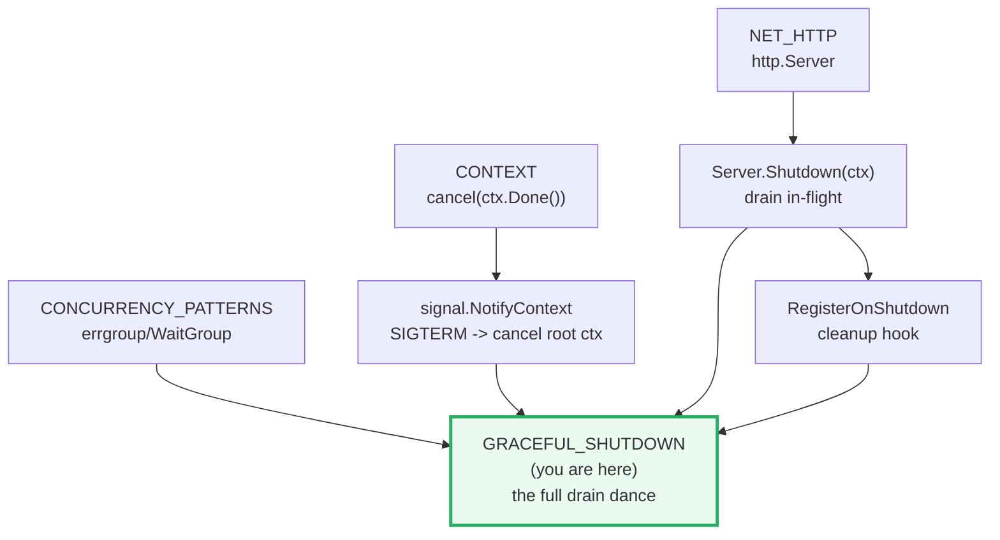
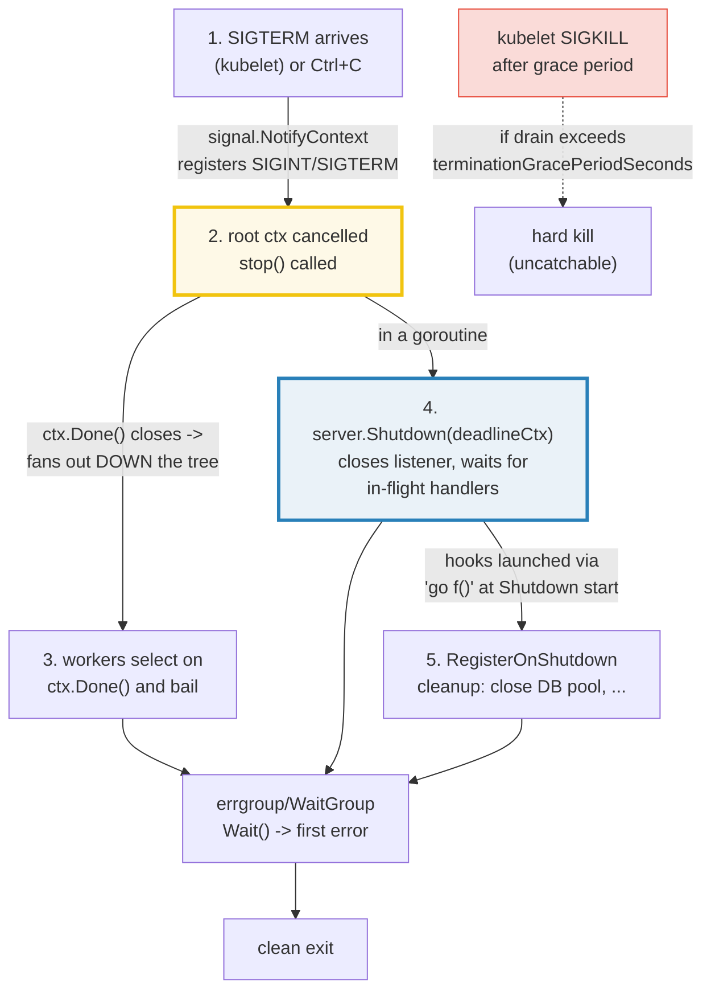
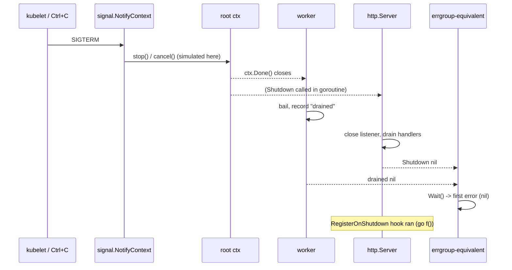

# GRACEFUL_SHUTDOWN — `signal.NotifyContext`, `server.Shutdown` & the Drain Dance

> **Goal (one line):** show, by **simulating** the shutdown trigger, how a Go
> service drains an `http.Server` without dropping in-flight requests, propagates
> cancellation through a root `context`, fires `RegisterOnShutdown` hooks, and
> orchestrates the full graceful-termination dance — all offline via `httptest`.
>
> **Run:** `go run graceful_shutdown.go`
>
> **Ground truth:** [`graceful_shutdown.go`](./graceful_shutdown.go) → captured
> stdout in [`graceful_shutdown_output.txt`](./graceful_shutdown_output.txt).
> Every status code, error, and outcome below is pasted **verbatim** from that
> file under a `> From graceful_shutdown.go Section X:` callout. Nothing is
> hand-computed.
>
> **Prerequisites:** 🔗 [`CONTEXT`](./CONTEXT.md) (cancellation propagation —
> `Shutdown(ctx)` and `ctx.Done()` *are* context), 🔗 [`NET_HTTP`](./NET_HTTP.md)
> (`http.Server`/handlers/`httptest`), 🔗 [`GOROUTINES`](./GOROUTINES.md) &
> 🔗 [`CONCURRENCY_PATTERNS`](./CONCURRENCY_PATTERNS.md) (`WaitGroup`/errgroup +
> collecting goroutine output deterministically), and 🔗 [`SELECT`](./SELECT.md)
> (every worker `select`s on `ctx.Done()`).

---

## 1. Why this bundle exists (lineage)

A server that dies mid-request is a server that corrupts state, truncates writes,
and returns `502`s to clients. Before Go 1.8 there was **no** stdlib way to
drain an `http.Server` — `server.Close()` (the only option) hard-killed every
connection. Go 1.8 added `Server.Shutdown(ctx)`, the missing primitive: stop
accepting new connections, **let in-flight handlers finish**, then exit. Go 1.9
added `RegisterOnShutdown` so you could hook cleanup into that moment, and Go
1.16 added `signal.NotifyContext`, folding OS-signal handling into the
`context.Context` tree so a single `cancel` fans out across the whole program.



The headline idea: graceful shutdown is a **coordination problem with a
deadline**. A signal arrives → you cancel one root context → every worker, every
in-flight handler, and the server's listener all observe it and wind down — while
a hard deadline (the kubelet's `SIGKILL`) counts down in the background. This
bundle exercises each moving part in isolation, then stitches them into the dance.

> From `pkg.go.dev/net/http` — `Server.Shutdown` (verbatim): *"Shutdown gracefully
> shuts down the server without interrupting any active connections. Shutdown
> works by first closing all open listeners, then closing all idle connections,
> and then waiting indefinitely for connections to return to idle and then shut
> down. If the provided context expires before the shutdown is complete, Shutdown
> returns the context's error, otherwise it returns any error returned from
> closing the Server's underlying Listener(s)."*

> **The determinism discipline (why this bundle simulates the signal).** A real
> OS signal (`SIGTERM`) is awkward and timing-dependent to trigger from *inside*
> a program — so this file **never** sends itself one. It calls the real
> `signal.NotifyContext` API but **simulates** the signal by invoking the
> returned `stop()` cancel func, and it drives `server.Shutdown`/`server.Close`
> directly. The trigger is therefore synchronous and reproducible. Crucially,
> **no elapsed duration is ever printed** — only error codes, HTTP statuses, and
> booleans. Two `just out graceful_shutdown` runs are byte-identical. (The
> loopback port `httptest` picks is random and is **never** printed.)

---

## 2. The mental model: the five-step drain dance



Three stdlib primitives compose into the dance:

| Primitive | Role | Since |
|---|---|---|
| `signal.NotifyContext(ctx, sigs...)` | returns a `ctx` **cancelled** when one of `sigs` arrives (or `stop()` is called). The fan-out root. | Go 1.16 |
| `server.Shutdown(ctx)` | stops new connections, **drains** in-flight handlers (up to `ctx`), returns `nil` on clean drain / `ctx.Err()` on timeout. | Go 1.8 |
| `server.RegisterOnShutdown(f)` | registers `f` to run **at the start of** `Shutdown` (e.g. close a DB pool). | Go 1.9 |

> From `pkg.go.dev/os/signal` — `NotifyContext` (verbatim, added in go1.16):
> *"NotifyContext returns a copy of the parent context that is marked done (its
> Done channel is closed) when one of the listed signals arrives, when the
> returned stop function is called, or when the parent context's Done channel is
> closed, whichever happens first."* And: *"The stop function releases resources
> associated with it, so code should call stop as soon as the operations running
> in this Context complete and signals no longer need to be diverted to the
> context."*

> From `pkg.go.dev/os/signal` — default behavior (Overview, verbatim): by default,
> *"A SIGHUP, SIGINT, or SIGTERM signal causes the program to exit."*
> `NotifyContext`/`Notify` **overrides** that — the signal is diverted to cancel
> the context instead of killing the process, giving you the window to drain.

---

## 3. Section A — `Shutdown` drains an in-flight request (the core promise)

A slow handler (a fixed tiny sleep) is running when `Shutdown` is called. The
handler closes a `started` channel the instant it begins, so the test **knows**
the request is in-flight before shutting down — removing any startup race.

> From `graceful_shutdown.go` Section A:
> ```
> server.Shutdown(ctx) with 1 in-flight request -> err = <nil>
> in-flight request outcome: ok=true status=200 body="drained-ok"
> handler ran to completion and wrote the response: true
> ```
> ```
> [check] Shutdown returned nil (clean drain): OK
> [check] in-flight request received HTTP 200 (not dropped): OK
> [check] in-flight request body == "drained-ok": OK
> [check] handler ran to completion (wrote the response): OK
> ```

**What.** `Shutdown(ctx)` returns `<nil>` **and** the in-flight request completed
with a full `HTTP 200` + body `"drained-ok"`. The handler was *not* cut off — it
ran to completion. That is the contract: **in-flight work finishes; new work is
refused.**

> From `pkg.go.dev/net/http` — `Server.Shutdown` (verbatim): *"When Shutdown is
> called, Serve, ServeTLS, ListenAndServe, and ListenAndServeTLS immediately
> return ErrServerClosed. Make sure the program doesn't exit and waits instead
> for Shutdown to return."*

**Why the `started` channel (a determinism trick).** Goroutine scheduling is
nondeterministic; a bare `time.Sleep` to "ensure the request landed" would race
on a loaded machine. Instead the handler *signals* when it begins, and the test
blocks on that signal before calling `Shutdown`. The trigger is now perfectly
synchronous, yet the assertion (handler completed, client got `200`) is real.
This is the same discipline as 🔗 `CONCURRENCY_PATTERNS` §E (observe the event,
don't guess the timing).

---

## 4. Section B — `Shutdown` (drain) vs `Close` (hard kill)

The **same** slow handler, two servers. `Shutdown` waits → the client gets
`200`. `Close` tears the connection down immediately → the handler's request
context is cancelled, it never writes `200`, and the client receives a transport
error (an `EOF`/reset, the loopback port of which is intentionally omitted for
determinism).

> From `graceful_shutdown.go` Section B:
> ```
> Shutdown: err=<nil>  request received-response=true status=200 body="shutdown-ok"
> Close:    err=<nil>  request received-response=false  handler-wrote-200=false
> ```
> ```
> [check] Shutdown returned nil: OK
> [check] Shutdown case: in-flight request finished with HTTP 200: OK
> [check] Close returned nil (it closes the listener): OK
> [check] Close case: in-flight request got NO response (dropped, transport error): OK
> [check] Close case: handler did NOT write 200 (cut off mid-flight): OK
> ```

**What.** The two rows are the entire payoff of the bundle:

| | `Shutdown(ctx)` | `Close()` |
|---|---|---|
| New connections | refused (listener closed) | refused (listener closed) |
| In-flight handlers | **waits** for them to finish | **dropped** mid-flight |
| Client sees | full `HTTP 200` response | transport error (`EOF`/reset) |
| `Err()` of `r.Context()` in handler | unchanged (handler completes) | **cancelled** (handler bails) |
| Return value | `nil` on clean drain, else `ctx.Err()` | `nil` (listener close error) |

> From `pkg.go.dev/net/http` — `Server.Close` (verbatim): *"Close immediately
> closes all active net.Listeners and any connections in state StateNew,
> StateActive, or StateIdle. For a graceful shutdown, use Server.Shutdown."*

**Why `Close` cancels the handler's context (the expert detail).** `Close` does
not merely close the *listener* — it walks every tracked connection and closes
the underlying `net.Conn`. The server wraps each connection's request in a
context that is cancelled when the connection's serve loop ends; tearing the conn
down ends that loop, so `r.Context().Done()` fires and the handler's
`select { case <-time.After(work): … ; case <-r.Context().Done(): return }`
takes the cancel branch — the handler returns *without* writing `200`. (Verified
by reading `GOROOT/src/net/http/server.go` and reproduced by this bundle.) This
is exactly why a context-aware handler is the **second** half of graceful
shutdown: without it, a `Close` or a timed-out `Shutdown` leaves a handler
writing into a dead connection.

---

## 5. Section C — context cancellation: `cancel()` → worker exits

Both `Shutdown` and the full dance are built on one primitive: a goroutine that
`select`s on `ctx.Done()`. Section C isolates it.

> From `graceful_shutdown.go` Section C:
> ```
> cancel() -> worker observed ctx.Done() and recorded: "cancelled: context canceled"
> ctx.Err() after cancel = context canceled
> ```
> ```
> [check] worker recorded 'cancelled' after cancel(): OK
> [check] ctx.Err() == context.Canceled: OK
> ```

**What.** Calling `cancel()` closes the context's `Done()` channel (🔗
`CONTEXT`); the worker's `select` immediately observes it and records
`"cancelled: context canceled"`. `ctx.Err()` becomes the sentinel
`context.Canceled`. This is the cancellation propagation that lets **one** signal
ripple to a whole tree of workers — the same mechanism `signal.NotifyContext`
wires to `SIGTERM` in Section E.

**Why this bundle asserts `Err()`, never elapsed time.** Timings are
non-reproducible; sentinel error codes are stable forever. `context.Canceled`
and `context.DeadlineExceeded` are the two outcomes worth asserting (see 🔗
`CONTEXT` §5 for the deadline variant). This bundle's every `check` asserts a
code/boolean, so two runs are byte-identical even though timeouts are
timing-dependent.

---

## 6. Section D — `RegisterOnShutdown`: a hook fires when Shutdown begins

A function registered **before** `Shutdown` runs when `Shutdown` starts — the
natural place to close a DB pool, flush a buffer, or notify hijacked/WebSocket
connections.

> From `graceful_shutdown.go` Section D:
> ```
> server.Shutdown err = <nil>
> RegisterOnShutdown hook ran = true
> ```
> ```
> [check] Shutdown returned nil: OK
> [check] RegisterOnShutdown hook fired (flag set): OK
> ```

> From `pkg.go.dev/net/http` — `RegisterOnShutdown` (verbatim, added in go1.9):
> *"RegisterOnShutdown registers a function to call on Server.Shutdown. This can
> be used to gracefully shutdown connections that have undergone ALPN protocol
> upgrade or that have been hijacked. This function should start protocol-specific
> graceful shutdown, but should not wait for shutdown to complete."*

**The expert detail — hooks run asynchronously via `go f()`.** Reading
`GOROOT/src/net/http/server.go`, `Shutdown` launches each registered hook with
`go f()` at its start:

```go
for _, f := range s.onShutdown {
    go f()
}
```

So the hooks run **concurrently** with the drain and may not have finished when
`Shutdown` returns. That is precisely why the doc says *"should not wait for
shutdown to complete"* — and it is why this bundle's hook closes a channel that
the test then `<-`waits on before asserting the flag. A bare
`hookRan.Load()` immediately after `Shutdown` would race the hook goroutine and
flap. (The same `go f()` mechanism is what makes `RegisterOnShutdown` safe to
use for *starting* — not waiting on — protocol-specific shutdowns like
WebSockets, which `Shutdown` itself does not touch.)

---

## 7. Section E — the full dance (signal.NotifyContext, simulated)

All five steps composed: `signal.NotifyContext` registers `SIGINT`/`SIGTERM`;
the **signal is simulated** by calling `stop()` (in production the kubelet
delivers `SIGTERM` and `NotifyContext` cancels for us). `server.Shutdown` runs in
a goroutine; a worker `select`s on the root `ctx.Done()`; the
errgroup-equivalent coordinates both and surfaces the first error; a
`RegisterOnShutdown` hook closes a "DB pool".

> From `graceful_shutdown.go` Section E:
> ```
> simulated signal (stop) -> server.Shutdown err = <nil>
> worker drained on ctx.Done: "drained: context canceled"
> RegisterOnShutdown cleanup hook ran (dbClosed) = true
> root ctx.Err() after stop() = context canceled
> ```
> ```
> [check] signal.NotifyContext ctx cancelled after stop(): OK
> [check] server.Shutdown returned nil (clean drain): OK
> [check] worker drained with 'context canceled': OK
> [check] RegisterOnShutdown cleanup hook ran: OK
> ```

**What.** One simulated signal fans out to **everything**: the root `ctx` is
cancelled (`context.Canceled`), the worker drains, `Shutdown` returns `nil`, and
the cleanup hook ran. The errgroup-equivalent (`group`, built from
`sync.WaitGroup` + `atomic.Pointer[error]`, first-error-wins — the same design
as 🔗 `CONCURRENCY_PATTERNS` §F) runs `Shutdown` and the worker-drain
concurrently and joins them.



**Why `stop()` simulates SIGTERM faithfully.** `NotifyContext` returns a `ctx`
and a `stop CancelFunc`. When a registered signal arrives, the package cancels
the ctx internally; calling `stop()` yourself cancels it **identically** (and
also unregisters the signal handler). So simulating the signal by calling
`stop()` exercises the exact same `ctx.Done()` closure that a real `SIGTERM`
would — with no OS dependency and no timing flakiness. After `stop()`,
`ctx.Err()` is exactly `context.Canceled`, which is what every downstream worker
observes.

---

## 8. Section F — the Kubernetes graceful-termination timeline (DOCUMENTED)

```mermaid
gantt
    title k8s pod termination grace window (default 30s)
    dateFormat X
    axisFormat %s
    section Pod lifecycle
    SIGTERM sent        :milestone, 0, 0
    App drains (Shutdown deadline 25s) :active, 0, 25
    safety margin       :crit, 25, 30
    SIGKILL (hard)      :milestone, 30, 0
```



> From `graceful_shutdown.go` Section F:
> ```
> k8s graceful-termination sequence (DOCUMENTED, not triggered here):
>   1. kubelet sends SIGTERM to the pod's process (PID 1).
>   2. App: signal.NotifyContext cancels root ctx -> stop accepting new requests,
>      drain in-flight handlers via server.Shutdown(deadlineCtx).
>   3. kubelet waits up to terminationGracePeriodSeconds (default 30s) for exit.
>   4. If still alive, kubelet sends SIGKILL (uncatchable) -> hard kill.
> recommended: Shutdown deadline (25s) < grace period (30s); margin = 5s
> note: the preStop hook AND Shutdown both count against the grace period.
> ```
> ```
> [check] recommended Shutdown deadline < k8s grace period: OK
> [check] safety margin is positive: OK
> ```

**What.** This section is **documentation, not a triggered run** — a real pod
lifecycle is environment-dependent. It pins the canonical ordering and the one
invariant that matters for correctness: the `Shutdown` deadline must be **shorter
than** `terminationGracePeriodSeconds`, leaving a safety margin.

> From Kubernetes docs — *Pod termination*: when a pod is deleted, *"the kubelet
> ... grace period ... `terminationGracePeriodSeconds` (defaults to 30 seconds)"*
> elapses; if the container is still running, the kubelet then sends `SIGKILL`.
> (kubernetes.io/docs/concepts/workloads/pods/pod-lifecycle/#pod-termination)

> From VictoriaMetrics — *"Graceful Shutdown in Go: Practical Patterns"* (>=2
> independent source): *"in Kubernetes, the default grace period is 30 seconds,
> unless otherwise specified using the `terminationGracePeriodSeconds` field.
> After this period, Kubernetes sends a `SIGKILL` to forcefully stop the
> application."* And: *"The `server.Shutdown` function returns in only two
> situations: [1] All active connections are closed and all handlers have
> finished processing. [2] The context passed to `Shutdown(ctx)` expires before
> the handlers finish."*

**Why the margin.** Both the `preStop` hook (e.g. a `sleep 10` so the external
load balancer deregisters) **and** your `Shutdown` drain count against the single
grace window. If `Shutdown(deadline)` ≥ the grace period, the kubelet `SIGKILL`s
mid-drain — exactly the truncation graceful shutdown exists to prevent. Reserve
~20% of the window as margin (the bundle uses 25s of 30s). Note also that failing
the **readiness** probe *first* (before `Shutdown`) lets the load balancer stop
sending new traffic while in-flight requests finish — the missing sixth step in a
production deployment.

---

## 9. Pitfalls (the expert payoff)

| Trap | Symptom | Fix |
|---|---|---|
| Using `Close()` instead of `Shutdown()` | In-flight requests dropped; clients get `EOF`/`502`; partial writes. | Call `server.Shutdown(ctx)`. Reserve `Close()` only as a fallback after `Shutdown` times out. |
| Exiting right after `ListenAndServe` returns | `Serve`/`ListenAndServe` return `ErrServerClosed` *immediately* on `Shutdown`; if you `log.Fatal` or return from `main`, the drain is aborted. | Run `ListenAndServe` in a goroutine; in `main` wait on the signal, then block on `Shutdown` returning. |
| Reusing a `Server` after `Shutdown` | `Serve` returns `ErrServerClosed`; the server "won't start". | *"Once Shutdown has been called on a server, it may not be reused."* Build a new `Server`. |
| Passing `context.Background()` to `Shutdown` (no deadline) | A stuck/hijacked handler hangs `Shutdown` **forever** ("waiting indefinitely"). | Always `context.WithTimeout(bg, deadline)` with `deadline < terminationGracePeriodSeconds`. |
| Blocking inside a `RegisterOnShutdown` hook | The hook runs via `go f()`; blocking in it can extend (or deadlock) shutdown. | The hook *"should start ... but should not wait for shutdown to complete"* — kick off cleanup and return. |
| Assuming `Shutdown` drains WebSockets / hijacked conns | *"Shutdown does not attempt to close nor wait for hijacked connections."* They linger. | Use `RegisterOnShutdown` to notify hijacked/WebSocket connections and wait on them separately. |
| Unbuffered `signal.Notify` channel | *"signal will not block sending to c"* — an unbuffered channel **drops** the signal if no receiver is ready. | `make(chan os.Signal, 1)`; or use `signal.NotifyContext` (buffering is internal). |
| Second `Ctrl+C` doesn't force-quit | After `NotifyContext`, `SIGINT` is diverted to cancel, not exit — repeated `Ctrl+C` just re-cancels. | Call `stop()` after the first signal so the next `SIGINT` restores the default (exit) behavior. |
| `Shutdown` deadline ≥ `terminationGracePeriodSeconds` | Kubelet `SIGKILL`s before the drain finishes — the very data loss you tried to prevent. | Keep `deadline` < grace period, leaving margin for the `preStop` hook (both share the window). |
| Releasing DB/lock resources **on signal receipt** (before drain) | In-flight handlers still using them hit closed handles mid-request. | Delay cleanup until **after** `Shutdown` returns, or drive it from a `RegisterOnShutdown` hook that runs at shutdown time. |
| Not failing the readiness probe on shutdown | External LB keeps routing new requests to a terminating pod for a few moments → refused connections. | Flip readiness → `503` *first*, sleep a beat, **then** `Shutdown`. |

---

## 10. Cheat sheet

```go
// 1. Root context cancelled on SIGINT/SIGTERM (Go 1.16+). Buffer is internal.
ctx, stop := signal.NotifyContext(context.Background(), os.Interrupt, syscall.SIGTERM)
defer stop()                 // unregisters the handler; double-call is a no-op

// 2. Server with a context-aware handler + a cleanup hook (Go 1.9).
srv := &http.Server{Addr: ":8080", Handler: mux}
srv.RegisterOnShutdown(func() { /* close DB pool, flush buffers, ... */ })
go func() {
    if err := srv.ListenAndServe(); err != nil && !errors.Is(err, http.ErrServerClosed) {
        log.Fatal(err)       // any error OTHER than ErrServerClosed is fatal
    }
}()

// 3. Wait for the signal, then drain with a deadline < k8s grace period.
<-ctx.Done()                 // SIGTERM arrived (or stop() was called)
readiness.Store(false)       // (prod) fail readiness so the LB deregisters first
shutdownCtx, cancel := context.WithTimeout(context.Background(), 25*time.Second)
defer cancel()
if err := srv.Shutdown(shutdownCtx); err != nil {
    log.Printf("graceful shutdown failed (%v); forcing Close", err)
    _ = srv.Close()          // fallback hard kill
}

// server.Shutdown(ctx):
//   - closes listeners  (no NEW connections)
//   - waits for in-flight handlers to finish, up to ctx's deadline
//   - returns nil on clean drain; ctx.Err() (e.g. DeadlineExceeded) on timeout
//   - does NOT touch hijacked/WebSocket connections (use RegisterOnShutdown)
//   - "may not be reused" once called (Serve -> ErrServerClosed)
// server.Close(): HARD kill — closes active conns immediately, drops in-flight.
//   Use Shutdown for graceful; Close only as a forced fallback.

// The dance: signal -> cancel root ctx -> workers select on ctx.Done() to bail,
// Shutdown drains the server, errgroup/WaitGroup joins them, hooks run cleanup —
// all within a deadline SHORTER than the kubelet's terminationGracePeriodSeconds.
```

---

## Sources

Every signature, sentinel, and behavioral claim above was verified against the Go
standard-library docs, the Go source, and independent secondary sources:

- `net/http` package — https://pkg.go.dev/net/http
  - `Server.Shutdown` ("Shutdown gracefully shuts down the server without
    interrupting any active connections… first closing all open listeners, then
    closing all idle connections, and then waiting indefinitely… If the provided
    context expires… returns the context's error"; "When Shutdown is called,
    Serve… immediately return ErrServerClosed. Make sure the program doesn't exit
    and waits instead for Shutdown to return"; "Once Shutdown has been called on
    a server, it may not be reused"):
    https://pkg.go.dev/net/http#Server.Shutdown
  - `Server.Close` ("Close immediately closes all active net.Listeners and any
    connections in state StateNew, StateActive, or StateIdle. For a graceful
    shutdown, use Server.Shutdown"):
    https://pkg.go.dev/net/http#Server.Close
  - `Server.RegisterOnShutdown` (added in go1.9; "registers a function to call on
    Server.Shutdown… should start protocol-specific graceful shutdown, but should
    not wait for shutdown to complete"):
    https://pkg.go.dev/net/http#Server.RegisterOnShutdown
  - `ErrServerClosed` / the Serve goroutine contract:
    https://pkg.go.dev/net/http#ErrServerClosed
- Go source — `net/http/server.go` (`Shutdown` invokes `for _, f := range
  s.onShutdown { go f() }`, i.e. hooks run asynchronously): viewed at
  `$(go env GOROOT)/src/net/http/server.go` ( Shutdown / onShutdown );
  https://cs.opensource.google/go/go/+/go1.26.4:src/net/http/server.go
- `os/signal` package — https://pkg.go.dev/os/signal
  - Overview — default behavior: "A SIGHUP, SIGINT, or SIGTERM signal causes the
    program to exit":
    https://pkg.go.dev/os/signal#hdr-Default_behavior_of_signals_in_Go_programs
  - `Notify` ("relays incoming signals to c… will not block sending to c…
    buffer of size 1 is sufficient"):
    https://pkg.go.dev/os/signal#Notify
  - `NotifyContext` (added in go1.16; "marked done when one of the listed signals
    arrives, when the returned stop function is called, or… parent… whichever
    happens first"; "The stop function releases resources… call stop as soon as
    the operations… complete"):
    https://pkg.go.dev/os/signal#NotifyContext
- `context` package (the cancellation mechanism `Shutdown` and `ctx.Done()` are
  built on; `context.Canceled` sentinel): https://pkg.go.dev/context
- Secondary corroboration (>=2 independent sources, web-verified):
  - VictoriaMetrics — *"Graceful Shutdown in Go: Practical Patterns"* (the three
    minimum conditions; k8s default grace period 30s then SIGKILL; "Shutdown
    returns in only two situations" — drain-complete vs context-expiry; readiness
    probe / preStop hook strategy; `Close` forceful fallback):
    https://victoriametrics.com/blog/go-graceful-shutdown/
  - Kubernetes docs — *Pod termination* (`terminationGracePeriodSeconds`
    defaults to 30; SIGKILL after the grace period):
    https://kubernetes.io/docs/concepts/workloads/pods/pod-lifecycle/#pod-termination
  - DEV Community — *"Proper HTTP shutdown in Go"* (Shutdown-with-timeout then
    Close fallback; SIGTERM/SIGINT handling):
    https://dev.to/mokiat/proper-http-shutdown-in-go-3fji

**Facts that could not be verified by running** (documented, not executed,
because they depend on a real orchestration environment / OS): the kubelet
delivering `SIGTERM` and the post-grace-period `SIGKILL`, and the exact external
transport error text on `Close` (`EOF` vs `connection reset by peer` — platform-
and timing-dependent, hence deliberately **not** printed; the loopback port is
random and likewise never printed). These are confirmed by the Kubernetes docs
and the secondary sources above, not reproduced as deterministic output.
