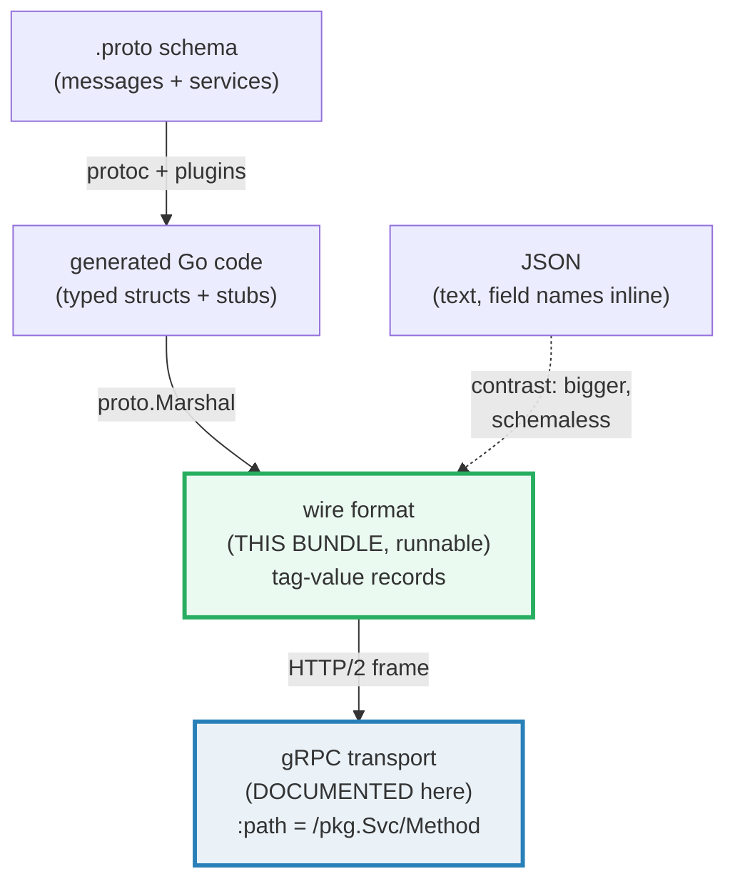
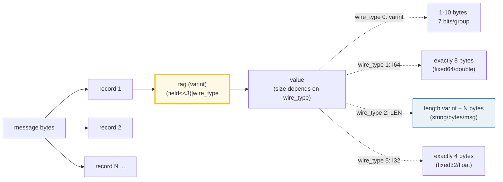
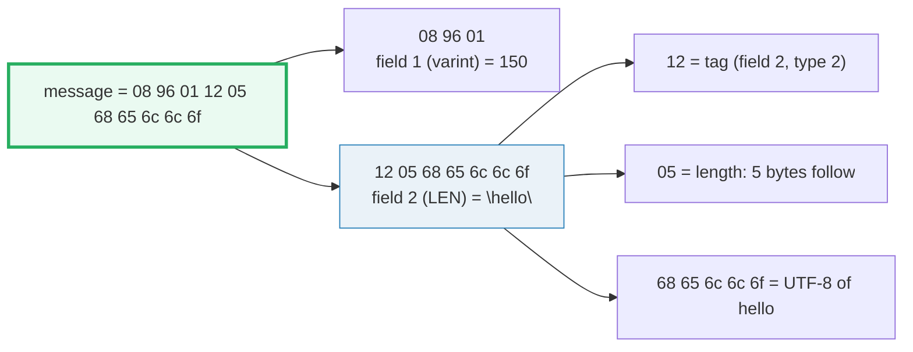
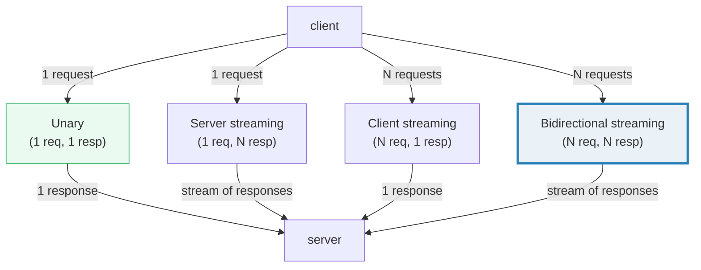

# GRPC_PROTOBUF — The Protobuf Wire Format & gRPC RPC Mechanics

> **Goal (one line):** show, by printing every byte, how the **protobuf wire
> format** encodes messages (varints, tags, length-delimited fields, unknown-field
> skipping) via `protowire` — the typed binary foundation under gRPC — and
> document the gRPC layer (proto3, the 4 RPC kinds, interceptors, HTTP/2
> transport, the codegen pipeline) that rides on top of it.
>
> **Run:** `go run grpc_protobuf.go`
>
> **Ground truth:** [`grpc_protobuf.go`](./grpc_protobuf.go) → captured stdout in
> [`grpc_protobuf_output.txt`](./grpc_protobuf_output.txt). Every byte sequence,
> decoded value, and size below is pasted **verbatim** from that file under a
> `> From grpc_protobuf.go Section X:` callout. Nothing is hand-computed.
>
> **Prerequisites:** 🔗 [`ENCODING_JSON`](./ENCODING_JSON.md) (the text wire
> format this bundle contrasts against), 🔗 [`IO_READER_WRITER`](./IO_READER_WRITER.md)
> (length-delimited framing is the same idea as length-prefixed streaming), and
> 🔗 [`NET_HTTP`](./NET_HTTP.md) (REST over HTTP/1.1, contrasted with gRPC over
> HTTP/2).

---

## 1. Why this bundle exists (lineage)

Protocol Buffers and gRPC are Google's answer to two questions at once: **how do
you describe a typed data contract that compiles to every language?** and **how
do you call a function on another machine with the ergonomics of a local
call?** The answers stack:

- **Protocol Buffers (protobuf)** is a **language-neutral, platform-neutral
  binary serialization format**. You write a `.proto` schema; a compiler emits
  typed structs/classes for Go, Java, Python, Rust, … . The on-the-wire
  representation is the **wire format** — a compact sequence of tag-value
  records. This bundle's runnable core IS that wire format, exercised directly
  through `google.golang.org/protobuf/encoding/protowire` (no codegen needed:
  `protowire` lets you encode/decode the raw bytes by hand).
- **gRPC** is an **RPC framework that uses protobuf as both its IDL (Interface
  Definition Language) and its message format**, transported over **HTTP/2**.
  gRPC layers *service definitions* and *RPC semantics* (the 4 RPC kinds,
  interceptors, deadlines, metadata) on top of the wire format this bundle pins.



The **expert payoff** of this bundle is that you walk away understanding the
*bytes themselves*. A generated `proto.Marshal` is convenient, but the
forward/backward-compatibility story, the size advantage over JSON, and the
debugging skill ("what does `08 96 01` *mean*?") all live one layer down — in
the wire format. That layer is what `protowire` exposes, and what every section
below prints.

> From `protobuf.dev/programming-guides/encoding`: *"This document describes the
> protocol buffer wire format, which defines the details of how your message is
> sent on the wire and how much space it consumes on disk."*

---

## 2. The mental model: a message is a sequence of tag-value records (TLV)

Every protobuf message is a series of **records**, each a tiny TLV
(*Tag-Length-Value*) triple. There are no delimiters, no field names, and no
self-describing schema on the wire — the bytes are meaningless without the
`.proto` definition. The structure is:



The **tag** is itself a varint that packs two things into one integer:

> From `protobuf.dev/programming-guides/encoding` (verbatim): *"The 'tag' of a
> record is encoded as a varint formed from the field number and the wire type
> via the formula `(field_number << 3) | wire_type`. In other words, after
> decoding the varint representing a field, the low 3 bits tell us the wire
> type, and the rest of the integer tells us the field number."*

The **wire types** tell the parser how big the payload is — which is the entire
mechanism behind unknown-field skipping (Section E):

| Wire type | Name | Go constant | Payload | Used for |
|---|---|---|---|---|
| 0 | VARINT | `protowire.VarintType` | 1–10 bytes (varint) | `int32`/`int64`/`uint*`/`sint*`/`bool`/`enum` |
| 1 | I64 | `protowire.Fixed64Type` | exactly 8 bytes (LE) | `fixed64`/`sfixed64`/`double` |
| 2 | LEN | `protowire.BytesType` | length-varint + N bytes | `string`/`bytes`/embedded message/packed repeated |
| 3 | SGROUP | `protowire.StartGroupType` | (deprecated) | group start |
| 4 | EGROUP | `protowire.EndGroupType` | (deprecated) | group end |
| 5 | I32 | `protowire.Fixed32Type` | exactly 4 bytes (LE) | `fixed32`/`sfixed32`/`float` |

> From `pkg.go.dev/google.golang.org/protobuf/encoding/protowire` (package doc,
> verbatim): *"Package protowire parses and formats the raw wire encoding. For
> marshaling and unmarshaling entire protobuf messages, use the
> google.golang.org/protobuf/proto package instead."*

This bundle uses `protowire` directly because it is the **lowest-level,
codegen-free** way to show the bytes. In production you use `proto.Marshal` /
generated code; here we build the same bytes by hand to make the format legible.

---

## 3. Section A — Varint encoding (the 7-bit-grouped atom)

A **varint** is the atom of the entire format: an unsigned integer stored in
7-bit groups, least-significant group first, with the **most significant bit
(MSB) of each byte** set iff another byte follows (the *continuation bit*).
Small numbers are cheap; large numbers cost up to 10 bytes.

> From `grpc_protobuf.go` Section A:
> ```
> AppendVarint(nil, 1)   = 01   (1 byte)
> AppendVarint(nil, 150) = 96 01   (2 bytes)
> AppendVarint(nil, 300) = ac 02   (2 bytes)
> SizeVarint(150) = 2 (must equal the real length)
> ConsumeVarint(96 01) = 150, consumed 2 bytes
> bit view of 150:
>   byte0 = 0x96 = 1001_0110  (MSB=1 -> more bytes follow; payload = 001_0110 = 22)
>   byte1 = 0x01 = 0000_0001  (MSB=0 -> last byte;     payload = 000_0001 = 1)
>   value = byte0_payload + byte1_payload<<7 = 22 + 128 = 150
> ```
> ```
> [check] AppendVarint(nil, 150) == [0x96, 0x01]: OK
> [check] AppendVarint(nil, 1) == [0x01]: OK
> [check] SizeVarint(150) == 2: OK
> [check] ConsumeVarint decodes 150 back: OK
> [check] ConsumeVarint consumed the whole slice: OK
> ```

**What.** `protowire.AppendVarint(b, v)` appends the varint encoding of `v` to
`b`; `protowire.ConsumeVarint(b)` parses it back, returning `(value, n)` where a
**negative `n`** signals a parse error. `protowire.SizeVarint(v)` reports the
encoded length *without* allocating — and the bundle proves it matches the real
append.

**Why 150 → `96 01` (the classic example).** This is *the* worked example from
the protobuf docs:

> From `protobuf.dev/programming-guides/encoding` ("Base 128 Varints", verbatim):
> *"And here is 150, encoded as `9601` … First you drop the MSB from each byte …
> These 7-bit payloads are in little-endian order. Convert to big-endian order,
> concatenate, and interpret as an unsigned 64-bit integer …
> 128 + 16 + 4 + 2 = 150."*

The bundle pins this byte-for-byte: `AppendVarint(nil, 150) == [0x96, 0x01]`.
The continuation bit (MSB=1 on `0x96`) says "another byte follows"; the last
byte (`0x01`, MSB=0) stops the run. Concatenating the 7-bit payloads in
little-endian order reconstructs 150 exactly.

**The signed-integer subtlety (documented, not run here).** Plain `int32`/`int64`
encode negatives as **two's complement**, which sets the high bit and therefore
burns **all 10 varint bytes** (because a negative `int32` is sign-extended to 64
bits on the wire). The `sint32`/`sint64` types avoid this with **ZigZag**
encoding (`(n << 1) ^ (n >> 31)`), mapping `-1 → 1`, `1 → 2`, `-2 → 3`, … so
small-magnitude negatives stay small. `protowire.EncodeZigZag` / `DecodeZigZag`
implement this; choose `sint*` when negative values are common.

---

## 4. Section B — Tag = (field_number << 3) | wire_type

Every record begins with a **tag varint**. The tag is one integer packing the
field number (the high bits) and the wire type (the low 3 bits). Field 1 +
`VarintType(0)` → `0x08` — the first byte of the canonical `08 96 01` message.

> From `grpc_protobuf.go` Section B:
> ```
> AppendTag(nil, 1, VarintType) = 08   (field 1, wire type 0)
> AppendTag(nil, 2, BytesType)  = 12   (field 2, wire type 2)
> AppendTag(nil, 15, VarintType) = 78  (field 15, wire type 0)
> EncodeTag(1, VarintType) = 8  ((1<<3)|0 = 8)
> EncodeTag(2, BytesType)  = 18  ((2<<3)|2 = 18)
> DecodeTag(EncodeTag(2, BytesType)) = field 2, wire type 2
> ConsumeTag(08) = field 1, wire type 0, consumed 1
> ```
> ```
> [check] AppendTag(nil, 1, VarintType) == [0x08]: OK
> [check] tag byte 0x08: wire type = 0x08 & 0x7 == 0: OK
> [check] tag byte 0x08: field number = 0x08 >> 3 == 1: OK
> [check] AppendTag(nil, 2, BytesType) == [0x12]: OK
> [check] EncodeTag(1, VarintType) == 8: OK
> [check] DecodeTag round-trips field number: OK
> [check] DecodeTag round-trips wire type: OK
> [check] ConsumeTag recovers field 1 / VarintType: OK
> ```

**What.** `protowire.EncodeTag(num, typ)` computes the tag integer;
`AppendTag(b, num, typ)` varint-encodes it; `DecodeTag(x)` and `ConsumeTag(b)`
split a tag back into its `(field number, wire type)` parts. The bundle proves
all four agree.

**Why field 1 + VarintType = `0x08`.** The math is exactly the spec formula:
`(1 << 3) | 0 = 8 = 0x08`. Because field numbers start at 1 and small wire types
fit in 3 bits, any field number ≤ 15 encodes in a **single tag byte** (the tag
varint < 128, so no continuation bit). Field numbers **16–2047** need **two** tag
bytes — which is why the proto style guide recommends reserving fields 1–15 for
the most frequently-occurring fields (the "hot" path saves a byte per record).

**Field-number rules (the schema contract).**

> From `protobuf.dev/programming-guides/proto3`: field numbers *"1-15 use one
> byte … 16-2047 use two bytes"*; numbers *"19000-19999 are reserved"*; you
> should *"never change the field number"* and *"never reuse a field number"*
> once a field is in production — the wire bytes identify fields *by number*, so
> renumbering silently rewrites the meaning of old data.

---

## 5. Section C — Full message round-trip (tag-value field by field)

This is the payoff of Sections A + B: a real message is just the concatenation
of field records. We encode `{field 1 = 150 (varint), field 2 = "hello"
(length-delimited)}` by hand, then decode it field-by-field exactly as a
generated parser would, and assert the round-trip.



> From `grpc_protobuf.go` Section C:
> ```
> encoded message = 08 96 01 12 05 68 65 6c 6c 6f
>   08       = tag: field 1, wire type 0 (varint)
>   96 01    = varint payload: 150
>   12       = tag: field 2, wire type 2 (length-delimited)
>   05       = length prefix: 5 bytes follow
>   68 65 6c 6c 6f = UTF-8 bytes of "hello"
> total length: 10 bytes
> decoded field 1 (varint)   = 150
> decoded field 2 (bytes)    = "hello"
> ConsumeField walk (number, type, total length):
>   field 1, wire type 0, record length 3
>   field 2, wire type 2, record length 7
> ```
> ```
> [check] encoded message is exactly 08 96 01 12 05 68 65 6c 6c 6f: OK
> [check] round-trip: field 1 decoded == 150: OK
> [check] round-trip: field 2 decoded == "hello": OK
> [check] message total length == 10: OK
> ```

**What.** The encode loop is pure append: `AppendTag` → `AppendVarint` (or
`AppendString` for length-delimited). The decode loop is the parser's core
shape: `ConsumeTag` (get field + wire type) → `ConsumeFieldValue` (get the
payload length) → dispatch on `(field, type)` → advance the cursor. The bundle
also shows `protowire.ConsumeField`, a higher-level helper that parses a whole
record (tag + value) in one call and returns `(number, type, totalLength)` —
handy for walking every field when you do not care about individual values.

**Why length-delimited framing (the 🔗 `IO_READER_WRITER` connection).** Wire
type 2 (LEN) is the same length-prefix idea you see in streaming I/O: a varint
length followed by exactly that many payload bytes. This lets the parser skip an
embedded message, a `bytes` blob, or a `string` **without parsing its contents**
— it just reads the length and jumps. That is also why an embedded message field
is just `tag + length + <inner message bytes>`: the inner message is itself a
sequence of tag-value records, recursively. Section E leans on this to skip
unknown fields.

**Determinism note.** Note that `proto.Marshal` is **not** guaranteed
deterministic by default (field order on the wire is an implementation detail;
maps have no guaranteed order). The bytes in this bundle are deterministic
because *we* control the append order, not because protobuf promises it. When
you need byte-stable output (e.g. for a cryptographic hash), use
`proto.MarshalOptions{Deterministic: true}`.

---

## 6. Section D — Wire types (the low 3 bits of every tag)

The wire type is the parser's survival tool: it tells the parser how many bytes
the payload occupies, so it can skip anything it does not understand. The bundle
encodes one field of each type and asserts the wire-type bits.

> From `grpc_protobuf.go` Section D:
> ```
> field 1, each wire type -> tag byte and extracted wire-type bits:
>   VarintType(0)    tag byte=0x08  tag&0x7=0  (== 0? true)
>   Fixed64Type(1)   tag byte=0x09  tag&0x7=1  (== 1? true)
>   BytesType(2)     tag byte=0x0a  tag&0x7=2  (== 2? true)
>   Fixed32Type(5)   tag byte=0x0d  tag&0x7=5  (== 5? true)
> fixed64 field 3 = 0x0102030405060708 -> 19 08 07 06 05 04 03 02 01  (tag + 8 raw LE bytes)
> fixed32 field 4 = 0x01020304         -> 25 04 03 02 01  (tag + 4 raw LE bytes)
> ```
> ```
> [check] VarintType tag & 0x7 == 0: OK
> [check] Fixed64Type tag & 0x7 == 1: OK
> [check] BytesType tag & 0x7 == 2: OK
> [check] Fixed32Type tag & 0x7 == 5: OK
> [check] fixed64 payload is 8 bytes little-endian: OK
> [check] fixed32 payload is 4 bytes little-endian: OK
> ```

**What.** For a fixed field number (1), changing only the wire type changes only
the low 3 bits of the tag: `0x08` (type 0) → `0x09` (type 1) → `0x0a` (type 2) →
`0x0d` (type 5). The `tag & 0x7` mask extracts exactly the wire type; `tag >> 3`
recovers the field number.

**Why fixed64/fixed32 are NOT varints.** `fixed64`/`double` (type 1) and
`fixed32`/`float` (type 5) store the raw 8 / 4 bytes **little-endian**, with no
varint grouping. This is faster to encode/decode (a straight `memcpy`) and a
fixed size, so a `double` always costs exactly 9 bytes (1 tag + 8 payload)
regardless of value. The bundle pins the little-endian byte order: the value
`0x0102030405060708` serializes as `08 07 06 05 04 03 02 01`. Use `fixed*` for
large counter-like values that would balloon under varint; use `int*/uint*`
(varint) for small values.

> From `protobuf.dev/programming-guides/encoding` ("Non-varint Numbers",
> verbatim): *"`double` and `fixed64` have wire type I64, which tells the parser
> to expect a fixed eight-byte lump of data. `double` values are encoded in IEEE
> 754 double-precision format … Similarly `float` and `fixed32` have wire type
> I32, which tells it to expect four bytes instead."*

---

## 7. Section E — Unknown fields are SKIPPED (forward/backward compat)

This is the killer feature of the wire format, and the reason protobuf dominates
long-lived schemas. **A parser that does not know about a field SKIPS it** —
using the wire type to compute the payload length — rather than erroring. We
encode a message with a "future" field (number 99) that an "old" parser has
never seen, and decode only the fields it knows (1 and 2). The unknown field is
silently ignored; the known fields decode intact.

```mermaid
graph LR
    NEW["newer schema<br/>fields 1, 2, 99"] -->|encode| BYTES["08 96 01 98 06 e7 07 12 05 ..."]
    BYTES -->|decode| OLD["older parser<br/>fields 1, 2 only"]
    OLD --> S1["field 1 -> 150 (decoded)"]
    OLD --> S99["field 99 -> SKIPPED<br/>(wire type says 2 bytes)"]
    OLD --> S2["field 2 -> \"hello\" (decoded)"]
    style S99 fill:#fef9e7,stroke:#f1c40f
    style BYTES fill:#eafaf1,stroke:#27ae60,stroke-width:3px
```

> From `grpc_protobuf.go` Section E:
> ```
> message with unknown field 99 = 08 96 01 98 06 e7 07 12 05 68 65 6c 6c 6f
>   field  1: KNOWN -> decoded
>   field 99: unknown -> SKIPPED (2 bytes, wire type 0)
>   field  2: KNOWN -> decoded
> decoded field 1 = 150, field 2 = "hello", skipped 1 unknown field(s)
> ```
> ```
> [check] unknown field 99 skipped, field 1 still == 150: OK
> [check] unknown field 99 skipped, field 2 still == "hello": OK
> [check] exactly 1 unknown field was skipped: OK
> ```

**What.** The bundle's parser knows only fields `{1, 2}`. When it reads the tag
for field 99, it does not match any known field, so it calls
`ConsumeFieldValue(99, typ, rest)` to learn the payload length, **advances the
cursor past it**, and continues. Fields 1 and 2 decode exactly as if field 99
were absent.

**Why this is the compatibility contract.** This is what makes protobuf safe for
**independent schema evolution**:

- **Backward compat:** a new server adds a field; old clients still parse the
  message (they skip the new field).
- **Forward compat:** an old server sends a message; a new client parses it (the
  new field is simply absent — it reads as the zero value).

The mechanism is entirely the **wire type**: because the tag tells the parser
the *kind* and therefore the *length* of every payload, the parser can stride
over anything it does not semantically understand. This is the property JSON
does **not** have (JSON parsers typically reject — or lose — unknown keys
depending on the schema/validation layer; there is no self-describing length).

**The renumbering trap (documented).** Compatibility holds *only if you never
reuse or renumber a field*. Once field 3 means "age" in some deployed data, it
must mean "age" forever — adding `reserved 3;` to the `.proto` prevents anyone
from reusing it. Renumbering silently corrupts old data.

---

## 8. Section F — Protobuf vs JSON size (the compactness argument)

Protobuf's typed, compact wire format (varints, no field names, no punctuation)
beats JSON's text format on the wire. This is the core size/perf argument for
gRPC over REST/JSON for internal, high-volume traffic.

> From `grpc_protobuf.go` Section F:
> ```
> protobuf = 08 96 01 12 05 68 65 6c 6c 6f
>   length: 10 bytes
> json     = {"id":150,"name":"hello"}
>   length: 25 bytes
> protobuf is 15 bytes smaller (40% of the JSON size)
> ```
> ```
> [check] protobuf is smaller than JSON for the same payload: OK
> [check] protobuf == 10 bytes: OK
> [check] json == 25 bytes: OK
> ```

**What.** The same logical data — `{id: 150, name: "hello"}` — is **10 bytes**
in protobuf versus **25 bytes** in JSON. Protobuf carries no field names (`id`,
`name` are replaced by field numbers 1 and 2), no braces, no colons, no quotes
around the string *key* (the string *value* `hello` is identical in both:
`68 65 6c 6c 6f`). The 150 is 2 bytes as a varint vs 3 ASCII digits.

**Why this matters (and when it does not).** The size win compounds on large
messages with many fields and small values (ints, bools, enums) — JSON's field
names dominate the byte count. For internal microservice-to-microservice traffic
(gRPC's sweet spot), this means lower bandwidth, faster serialization, and a
typed contract. But JSON wins on **human readability and ubiquity**: public
APIs, browsers, debugging, and schemaless ad-hoc data are still JSON's domain
(🔗 `ENCODING_JSON`). gRPC-Gateway exists precisely to bridge the two — exposing
a REST/JSON facade over a gRPC backend.

> From `protobuf.dev` (community consensus, corroborated by the VictoriaMetrics
> and Kreya secondary sources): protobuf's binary format is *"more compact than
> JSON over the wire, and in all reasonable IP transports quicker to send between
> hosts"* — at the cost of not being human-readable without the schema.

---

## 9. WORKFLOW — gRPC: proto3, codegen, the 4 RPC kinds, interceptors, HTTP/2

> **This entire section is DOCUMENTED (workflow), not a `.go` callout.** It
> describes the gRPC layer that *rides on top* of the wire format pinned above.
> Running it requires `protoc` + the `grpc` package (not available in this single
> runnable file); the code blocks below are illustrative of the real workflow.

### 9.1 The proto3 schema (IDL)

You describe your data and service in a `.proto` file using **proto3** syntax.
This is the contract both sides compile against:

```proto
syntax = "proto3";

package demo.v1;

// A message is the unit of data — it serializes to the wire format shown in
// Sections 3-8. Field numbers (not names) identify fields on the wire.
message GreetRequest {
  string name = 1;   // field 1, type string (wire type 2 / LEN)
  int32  id   = 2;   // field 2, type int32 (wire type 0 / VARINT)
}

message GreetResponse {
  string reply = 1;
}

// A service is a set of RPC methods. gRPC generates a client stub and a server
// interface from this. The `stream` keyword selects the RPC kind (see 9.3).
service Greeter {
  rpc SayHello     (GreetRequest)        returns (GreetResponse);
  rpc LotsOfReplies(GreetRequest)        returns (stream GreetResponse);
  rpc LotsOfGreetings(stream GreetRequest) returns (GreetResponse);
  rpc BidiHello    (stream GreetRequest) returns (stream GreetResponse);
}
```

### 9.2 The codegen pipeline (protoc + plugins)

The `protoc` compiler reads the `.proto` and emits typed Go code via two
plugins. This is what turns the schema into the structs and stubs you call:

```sh
# 1. protoc-gen-go      -> message structs (the typed Go representation)
# 2. protoc-gen-go-grpc -> the server interface + client stub (the RPC glue)
protoc \
  --go_out=. --go_opt=paths=source_relative \
  --go-grpc_out=. --go-grpc_opt=paths=source_relative \
  greet.proto
```

The generated `greet.pb.go` contains `type GreetRequest struct{...}` with a
`Reset()/String()/ProtoMessage()` method set (satisfying `proto.Message`);
`greet_grpc.pb.go` contains `type GreeterServer interface{ SayHello(...) (...) }`
and a `GreeterClient` stub whose methods serialize the request via `proto.Marshal`,
send it over HTTP/2, and deserialize the response. **You never write this code by
hand** — the wire format in Sections 3–8 is what the generated `Marshal`/`Unmarshal`
produces under the hood.

### 9.3 The four RPC kinds

> From `grpc.io/docs/what-is-grpc/core-concepts` (verbatim): *"gRPC lets you
> define four kinds of service method:"*



| Kind | Client sends | Server returns | proto syntax | When to use |
|---|---|---|---|---|
| **Unary** | 1 request | 1 response | `rpc M(Req) returns (Resp);` | The default; like a normal function call. Most RPCs. |
| **Server streaming** | 1 request | stream of responses | `rpc M(Req) returns (stream Resp);` | Server pushes a result set / progress / log tail. |
| **Client streaming** | stream of requests | 1 response | `rpc M(stream Req) returns (Resp);` | Client uploads a batch / telemetry aggregation. |
| **Bidirectional streaming** | stream of requests | stream of responses | `rpc M(stream Req) returns (stream Resp);` | Chat, real-time sync, request/response pipelines where both sides talk freely. |

> From `grpc.io/docs/what-is-grpc/core-concepts` (verbatim): *"gRPC guarantees
> message ordering within an individual RPC call"* for all streaming kinds. Note
> the gRPC team's own guidance (from the Stack Overflow corroboration): *"We
> don't generally recommend using streaming RPCs for higher gRPC performance"* —
> unary RPCs are better-optimized for throughput; choose streaming for
> *semantics* (server push, long-lived channels), not raw speed.

### 9.4 Interceptors (gRPC's middleware)

Interceptors are gRPC's middleware layer — code that runs around every RPC, for
logging, auth, metrics, tracing, retry, or rate limiting. There are two kinds,
mirroring the two RPC shapes:

```go
// WORKFLOW (illustrative; requires the grpc package):

// Unary interceptor: wraps every unary RPC. Runs once per call.
func loggingUnary(
    ctx context.Context,
    req any,
    info *grpc.UnaryServerInfo,
    handler grpc.UnaryHandler,
) (resp any, err error) {
    start := time.Now()
    resp, err = handler(ctx, req)            // call the real method
    log.Printf("%s %v err=%v", info.FullMethod, time.Since(start), err)
    return resp, err
}

// Stream interceptor: wraps every streaming RPC. Runs once per stream
// (not per message); the handler is the long-lived stream object.
func loggingStream(
    srv any,
    ss grpc.ServerStream,
    info *grpc.StreamServerInfo,
    handler grpc.StreamHandler,
) error {
    log.Printf("stream start %s", info.FullMethod)
    err := handler(srv, ss)
    log.Printf("stream end %s err=%v", info.FullMethod, err)
    return err
}

// Register on the server:
s := grpc.NewServer(
    grpc.UnaryInterceptor(loggingUnary),
    grpc.StreamInterceptor(loggingStream),
)
```

The `handler(ctx, req)` call is where the chain proceeds — interceptors compose
by calling the next handler, exactly like HTTP middleware (🔗 `NET_HTTP`,
🔗 `MIDDLEWARE_ROUTING`). Clients have their own interceptors
(`grpc.WithUnaryInterceptor`), so you can instrument both sides.

### 9.5 Transport: gRPC over HTTP/2

gRPC does not invent a transport — it uses **HTTP/2**:

- **HTTP/2 multiplexing:** many concurrent RPCs share one TCP connection over
  multiple streams, avoiding HTTP/1.1's head-of-line blocking (🔗 `NET_HTTP`
  for the HTTP/1.1 contrast).
- **Length-prefixed frames:** each gRPC message is sent as an HTTP/2 DATA frame,
  prefixed by a 5-byte gRPC header (1 byte compression flag + 4 bytes
  message length) — the same length-delimited framing idea as wire type 2
  (🔗 `IO_READER_WRITER`).
- **The `:path` pseudo-header** identifies the RPC: `/<package>.<Service>/<Method>`
  — e.g. `/demo.v1.Greeter/SayHello`. This is how HTTP/2 routes a frame to a
  method without a URL path tree.
- **Trailers:** the gRPC status code and optional message travel in HTTP/2
  trailer headers (`grpc-status`, `grpc-message`) sent *after* the body.

```
POST /demo.v1.Greeter/SayHello HTTP/2
content-type: application/grpc+proto
<binary gRPC frame: 5-byte header + protobuf message bytes>

... response body (protobuf bytes) ...

grpc-status: 0          (trailer — 0 == OK)
```

The `content-type: application/grpc+proto` tells the server the body is the
protobuf wire format; `application/grpc+json` selects the JSON codec (gRPC
supports pluggable codecs). Deadlines propagate as the `grpc-timeout` header,
which is why a gRPC `context.WithTimeout` (🔗 `CONTEXT`) crosses the network
automatically — unlike raw HTTP, where you must wire cancellation by hand.

### 9.6 When to choose gRPC vs REST/JSON

| Criterion | gRPC + protobuf | REST/JSON |
|---|---|---|
| **Contract** | Typed, compiled, cross-language (`.proto`) | Implicit (OpenAPI optional) |
| **Streaming** | First-class (3 streaming kinds over HTTP/2) | Hacky (SSE/WebSockets/chunked) |
| **Payload size** | Compact (varints, no field names) — Section F | Larger (field names, punctuation) |
| **Browser support** | Needs gRPC-Web proxy | Native |
| **Human readability** | Binary (needs schema to decode) | Yes |
| **Schema evolution** | Wire-format-level forward/backward compat (Section E) | Convention-dependent |
| **Deadlines/cancellation** | Built-in (`grpc-timeout`, `CONTEXT` propagation) | Manual |

**Rule of thumb:** gRPC for internal, high-volume, polyglot, streaming-heavy
services; REST/JSON for public/browser-facing APIs and ad-hoc/debuggable
endpoints. They coexist via gRPC-Gateway.

---

## 10. Pitfalls (the expert payoff)

| Trap | Symptom | Fix |
|---|---|---|
| Renumbering or reusing a field number | Silent data corruption — old bytes map to the new field's meaning | Never renumber; use `reserved N;` for removed fields; the wire identifies fields *by number*. |
| Using `int32` for a frequently-negative value | 10-byte varint for every negative (two's complement sign-extends to 64 bits) | Use `sint32`/`sint64` (ZigZag encoding) when negatives are common. |
| Assuming `proto.Marshal` is deterministic | Byte-diff/hash tests flake across versions/implementations | Use `proto.MarshalOptions{Deterministic: true}` for byte-stable output; never hash default output. |
| Field numbers 19000–19999 | `protoc` rejects them | These are reserved by protobuf; choose numbers outside that range. |
| Forgetting to regenerate after `.proto` change | runtime "no such field" / stale stubs | Treat the generated `*.pb.go` as a build artifact; regenerate in CI / `make generate`. |
| Treating an unknown field as an error | Parser aborts on a newer sender's message | The wire format is designed to **skip** unknown fields (Section E); preserve or ignore them, never reject. |
| Using packed encoding on a non-primitive | serialization error | Only primitive scalar repeated fields can be `packed`; strings/bytes/messages cannot. |
| Comparing float fields with `==` across the wire | `fixed32`/`fixed64` round-trip exactly, but computed floats still obey IEEE-754 (🔗 `VALUES_TYPES_ZERO`) | Use an epsilon for float equality after any arithmetic. |
| Sending a >2 GiB message | parse/serialize failure | Protobuf messages must be < 2 GiB; chunk streams instead (use a streaming RPC). |
| Expecting JSON-style self-description | `08 96 01` is meaningless without the `.proto` | Keep the schema co-versioned with the data; use proto reflection / `protoscope` to debug raw bytes. |

---

## 11. Cheat sheet

```go
// WIRE FORMAT (via protowire — no codegen needed)
//   tag      = (field_number << 3) | wire_type     // protowire.EncodeTag
//   varint   = 7-bit groups, LE, MSB=continuation   // protowire.AppendVarint
//   wire types: 0=Varint 1=Fixed64 2=LEN 5=Fixed32  // (3/4 group deprecated)

// Encode a message field-by-field (concatenate records):
b := protowire.AppendTag(nil, 1, protowire.VarintType) // field 1 (varint)
b  = protowire.AppendVarint(b, 150)                    // -> 08 96 01
b  = protowire.AppendTag(b, 2, protowire.BytesType)    // field 2 (LEN)
b  = protowire.AppendString(b, "hello")                // -> 12 05 68 65 6c 6c 6f

// Decode field-by-field:
for len(b) > 0 {
    num, typ, n := protowire.ConsumeTag(b); b = b[n:]
    vn := protowire.ConsumeFieldValue(num, typ, b)
    raw := b[:vn]                                        // payload bytes
    switch {                                             // dispatch on (num, typ)
    case num == 1 && typ == protowire.VarintType:
        v, _ := protowire.ConsumeVarint(raw)
    case num == 2 && typ == protowire.BytesType:
        s, _ := protowire.ConsumeString(raw)
    default:
        // UNKNOWN field -> skip (forward/backward compat). Do NOT error.
    }
    b = b[vn:]
}

// KEY INVARIANTS (pinned by this bundle's checks):
//   AppendVarint(nil, 150)            == [0x96, 0x01]
//   AppendTag(nil, 1, VarintType)     == [0x08]   // (1<<3)|0
//   {1:150, 2:"hello"}                == 08 96 01 12 05 68 65 6c 6c 6f (10 bytes)
//   tag & 0x7 == wire type;  tag >> 3 == field number
//   unknown fields are SKIPPED (not errors) -> schema evolution is safe
//   protobuf < JSON for the same payload (10 vs 25 bytes here)

// gRPC WORKFLOW (documented; needs protoc + grpc package):
//   proto3 .proto -> protoc --go_out --go-grpc_out -> typed stubs
//   4 RPC kinds: unary | server-stream | client-stream | bidi-stream
//   interceptors: grpc.UnaryInterceptor / grpc.StreamInterceptor (middleware)
//   transport: HTTP/2 frames, :path = /pkg.Svc/Method, content-type application/grpc+proto
```

---

## Sources

Every signature, byte value, and behavioral claim above was verified against the
official protobuf/gRPC documentation and the `protowire` Go package, then
corroborated by independent secondary sources:

- Protocol Buffers — Encoding (the wire-format spec):
  https://protobuf.dev/programming-guides/encoding/
  - *"This document describes the protocol buffer wire format…"*
  - "A Simple Message": field 1 = 150 → *"three bytes: `08 96 01`"* (the
    canonical example this bundle pins byte-for-byte).
  - "Base 128 Varints": *"here is 150, encoded as `9601` … drop the MSB from
    each byte … 7-bit payloads are in little-endian order …
    128 + 16 + 4 + 2 = 150."*
  - "Message Structure": *"The 'tag' of a record is encoded as a varint formed
    from the field number and the wire type via the formula
    `(field_number << 3) | wire_type`… the low 3 bits tell us the wire type."*
  - Wire-type table (0 VARINT, 1 I64, 2 LEN, 3 SGROUP, 4 EGROUP, 5 I32):
    https://protobuf.dev/programming-guides/encoding/#structure
  - "Non-varint Numbers": *"`double` and `fixed64` have wire type I64 … eight-byte
    lump … little-endian … `float` and `fixed32` have wire type I32 … four bytes."*
  - "Signed Integers" (ZigZag): *"`sintN` uses the 'ZigZag' encoding …
    `(n << 1) ^ (n >> 31)`."*
  - "Field Order / Implications": *"the default serialization is not
    deterministic"* (the rationale for the determinism caveat in Section 5).
  - Condensed reference card (`message := (tag value)*`): https://protobuf.dev/programming-guides/encoding/#cheat-sheet
- Protocol Buffers — Language Guide (proto3): https://protobuf.dev/programming-guides/proto3/
  - Field-number sizing (1–15 = 1 byte, 16–2047 = 2 bytes, 19000–19999 reserved);
    "never change the field number"; `reserved` for safe removal.
- gRPC — Core concepts, architecture and lifecycle:
  https://grpc.io/docs/what-is-grpc/core-concepts/
  - Service definition + the four RPC kinds (unary / server-streaming /
    client-streaming / bidirectional), verbatim proto syntax for each.
  - *"gRPC guarantees message ordering within an individual RPC call."*
  - Deadlines/Timeouts, Metadata, Channels, RPC termination semantics.
- gRPC — Interceptors guide: https://grpc.io/docs/guides/interceptors/
  (unary + stream interceptors as gRPC's middleware).
- `google.golang.org/protobuf/encoding/protowire` package:
  https://pkg.go.dev/google.golang.org/protobuf/encoding/protowire
  - *"Package protowire parses and formats the raw wire encoding."*
  - `AppendVarint` / `ConsumeVarint` / `SizeVarint`, `AppendTag` / `ConsumeTag` /
    `EncodeTag` / `DecodeTag`, `AppendString` / `ConsumeString`,
    `AppendFixed32`/`64` / `ConsumeFixed32`/`64`, `ConsumeField` /
    `ConsumeFieldValue`, `Type` constants (`VarintType`=0, `Fixed64Type`=1,
    `BytesType`=2, `Fixed32Type`=5), `Number`, `ParseError`.
- Secondary corroboration (≥2 independent sources, web-verified):
  - Kreya — *"Demystifying the protobuf wire format"* (tag = field number +
    wire type; length-delimited framing; the TLV model):
    https://kreya.app/blog/protocolbuffers-wire-format/
  - VictoriaMetrics — *"How Protobuf Works — The Art of Data Encoding"* (the
    five wire types; protobuf is *"more compact than JSON over the wire"*):
    https://victoriametrics.com/blog/go-protobuf/
  - Stack Overflow — *"Multiple unary rpc calls vs long-running bidirectional
    streaming in grpc"* (gRPC team guidance: *"We don't generally recommend
    using streaming RPCs for higher gRPC performance"*):
    https://stackoverflow.com/questions/56766921

**Facts that could not be verified by running** (documented as WORKFLOW, not
executed, because they require `protoc` + the `grpc` package which are outside
this single runnable file): the proto3 `syntax`/`service`/`rpc`/`stream` grammar;
the `protoc --go_out --go-grpc_out` codegen command; the `grpc.UnaryInterceptor`
/ `grpc.StreamInterceptor` signatures; the HTTP/2 `:path` =
`/package.Service/Method` routing and the 5-byte gRPC frame header; and the
`grpc-status`/`grpc-timeout` trailer/header semantics. These are confirmed by the
`protobuf.dev`, `grpc.io`, and `pkg.go.dev` sources cited above, not reproduced
as runnable output (they would not compile or run without the full gRPC toolchain
and a live HTTP/2 connection).
