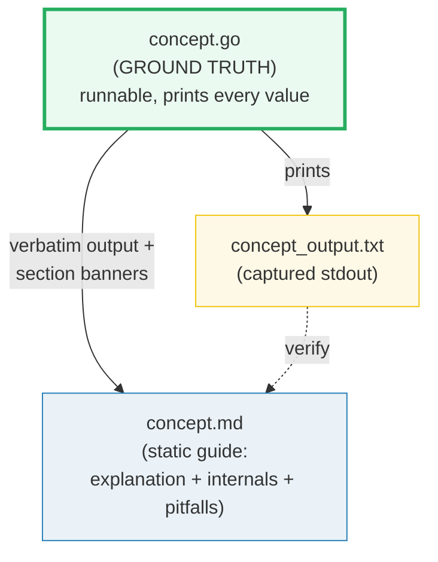
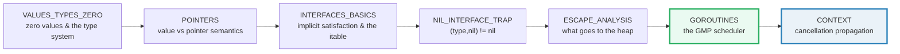

# HOW_TO_RESEARCH — The "Concept-as-a-Bundle" Workflow (Go)

> A note from past-me to future-me: **how this `go/` folder is organized, why it
> is laid out this way, and how to extend it.** Each concept is a small, runnable
> `.go` program whose output is pasted verbatim into a `.md` guide. Nothing is
> hand-waved; every claim is reproducible by `go run`.
>
> **The north-star goal:** a reader who walks every bundle start-to-finish
> becomes a **Go expert** — fluent in the type system and value/pointer
> semantics, the goroutine scheduler (GMP) and the memory model, escape analysis
> and the garbage collector, the standard library, and the production patterns
> built on top.
>
> **The golden rule of building:** you (the orchestrator) **never write or edit a
> bundle file by hand.** Every bundle is produced by a **subagent** (one worker
> per bundle). Your job is to write tight worker briefs, launch them in parallel
> (max 4 at a time), and run the verification sweep. This is the
> [`../llm/`](../llm/) delegation discipline, applied to the **Go language and its
> production ecosystem**.
>
> Sister folders:
> - [`../llm/`](../llm/) — the same ground-truth discipline for LLM *systems*.
> - [`../python/`](../python/) — the same discipline for the Python language.

---

## 0. The one rule (of a bundle)

> **Every concept is a `.go` + `_output.txt` + `.md` triple that cite each other,
> all deriving from ONE runnable `.go`. Nothing is hand-computed.**

If a claim, value, or output appears in a `.md`, it was printed by the `.go` (or
recomputed with the identical logic). This is the discipline that keeps the
guides trustworthy as they scale to 50+ topics.



There is **no `.html`** in this folder (unlike `../llm/`). The runnable `.go`
*is* the interactive artifact — a reader opens it, runs it, edits it, and watches
the output change. This keeps the surface area small and the focus on code.

---

## 1. The directory layout

```
go/
├── HOW_TO_RESEARCH.md          ← you are here (per-bundle workflow)
├── SUBAGENTS_GUIDE.md          ← delegation at scale (the worker prompt + batch sweep)
├── TODO.md                     ← the phase-by-phase build checklist (all 52 bundles)
├── go.mod                      ← module tutorials/go, go 1.26 (read-only to workers)
├── .gitignore                  ← ignores binaries / coverage / profiles
│
├── values_types_zero.go         ← ground-truth impl   ─┐
├── values_types_zero_output.txt ← captured stdout       │ one concept bundle
├── VALUES_TYPES_ZERO.md         ← static guide          ─┘
│
├── strings_runes_bytes.go  ─┐
├── STRINGS_RUNES_BYTES.md   │  another bundle (cross-referenced 🔗)
└── ...                     ─┘
```

A **concept bundle** = `{name}.go` + `{name}_output.txt` + `{NAME}.md`.

**Naming convention** (matches `../python/` and `../llm/`):
- `.go` / `_output.txt` → `lower_snake_case` (e.g. `escape_analysis.go`).
- `.md` → `UPPER_SNAKE_CASE` (e.g. `ESCAPE_ANALYSIS.md`).
- One stem per concept; the three files share it so cross-links are obvious.

### Why every bundle file starts with `//go:build ignore`

This module hosts **52 standalone `package main` programs in one directory**. Go
normally forbids two `func main()` in the same package, so a naive layout would
make `go build ./...`, `go vet ./...`, and `go test ./...` fail with
*`main redeclared in this block`*.

The fix is the first line of every bundle's `.go`:

```go
//go:build ignore

package main
```

The `//go:build ignore` constraint **excludes the file from whole-module
compilation** (`go build ./...` skips it) but **does NOT stop you running it
explicitly** — `go run concept.go` compiles exactly the named files and ignores
the build tag. Verified empirically:

| Command | Untagged `package main` (many in dir) | With `//go:build ignore` |
|---|---|---|
| `go run concept.go` | ✅ runs | ✅ runs (file arg overrides tag) |
| `go build ./...` | ❌ `main redeclared` | ✅ clean (file excluded) |
| `go vet concept.go` | ✅ | ✅ |
| `gofmt -l concept.go` | ✅ | ✅ |

So: **every worker MUST put `//go:build ignore` as the very first line** of its
`concept.go`. It is non-negotiable; without it the whole module breaks.

---

## 2. The three roles of each file

| File | Role | Hard rules |
|---|---|---|
| **`name.go`** | Ground truth. Clean, runnable, **self-contained** `package main` that prints every value the `.md` needs, behind a section banner. | Single source of truth. Run via `go run name.go`. Starts with `//go:build ignore`. Each teachable point gets its own `sectionX()` printing a banner + a readable block. Use **tiny but complete** examples so every line is printable while every behavior shows up. Deterministic inputs only. Add `[check] ... OK` asserts for invariants (see §4). |
| **`{NAME}.md`** | Static, rigorous guide. Mermaid diagrams + **verbatim** output pasted from the `.go`. | Every output block sits under a `> From name.go Section X:` callout — no orphan numbers. Explains **what**, **why** (internals), and the **expert-level gotchas**. Cross-refs to siblings marked 🔗. Ends with a pitfalls table + cheat sheet + `## Sources`. |
| **`name_output.txt`** | Captured stdout. Committed so the `.md` can be re-derived/audited without running. | `go run name.go > name_output.txt 2>/dev/null`. Diff it against the `.md` callouts to audit any value. |

---

## 3. The "expert depth" requirement

A junior tutorial stops at "here's how you declare a slice." This folder's bar is
higher. **Every `.md` a worker produces must answer three layers:**

1. **What** — the syntax / API and a runnable worked example (the `.go`).
2. **Why** — the mechanism beneath it. For Go this usually means: the
   **value-vs-pointer semantics** (when something is copied, when it escapes),
   the **goroutine scheduler** (GMP: G goroutine, M OS thread, P processor;
   work-stealing; `GOMAXPROCS`), the **memory model** (happens-before via
   channels and `sync`; the race detector), the **interface internals** (the
   itable; nil-interface vs nil-value), or the **compiler/runtime** (escape
   analysis `-gcflags=-m`, the concurrent mark-sweep GC, `GOGC`/`GOMEMLIMIT`).
3. **Gotchas that separate juniors from experts** — the silent-bug traps:
   nil-interface-vs-nil-value, the pre-1.22 loop-variable capture (and the 1.22+
   fix), closed-channel send panics, concurrent-map-write panics, slice aliasing
   after `append`, pointer-receiver method sets, escaping to the heap, etc.

The **pitfalls table** at the end of each `.md` is non-negotiable — it is the
"expert payoff." If a worker ships a `.md` with no pitfalls table, re-spawn it.

---

## 4. The `.go` authoring conventions (the house style)

Every bundle's `.go` follows the same skeleton so output is uniform and
verifiable. Workers MUST replicate it exactly. Study
`values_types_zero.go` (the Phase 1 style anchor) and copy its structure.

### 4.1 The required file skeleton

```go
//go:build ignore

// values_types_zero.go — Phase 1 bundle #1 (STYLE ANCHOR).
//
// GOAL (one line): show, by printing every value, how Go's type system, zero
// values, and constants behave.
//
// This is the GROUND TRUTH for VALUES_TYPES_ZERO.md. Every number, table, and
// worked example in the guide is printed by this file. Change it -> re-run ->
// re-paste. Never hand-compute.
//
// Run:
//     go run values_types_zero.go

package main

import (
	"fmt"
	"strings"
)

const bannerWidth = 70

var banner = strings.Repeat("=", bannerWidth) // a const initializer cannot call a function, so this is a var

// sectionBanner prints a clearly delimited section divider (the house style).
func sectionBanner(title string) {
	fmt.Printf("\n%s\nSECTION %s\n%s\n", banner, title, banner)
}

// check asserts an invariant and prints a uniform [check] ... OK line.
// On failure it panics (non-zero exit) so the verification sweep catches it.
func check(description string, ok bool) {
	if !ok {
		panic("INVARIANT VIOLATED: " + description)
	}
	fmt.Printf("[check] %s: OK\n", description)
}

// ... sectionA, sectionB, ... each prints a banner + a readable block + checks ...

func main() {
	fmt.Println("values_types_zero.go — Phase 1 bundle #1 (style anchor).")
	fmt.Println("Every value below is computed by this file; the .md guide pastes")
	fmt.Println("it verbatim. Nothing is hand-computed.")
	sectionA()
	sectionB()
	sectionBanner("DONE — all sections printed")
}
```

### 4.2 The Go-specific HARD RULES (these make output reproducible)

Go differs from Python in ways that bite determinism. Every worker MUST honor:

1. **Map iteration is intentionally randomized.** Never print a map by ranging
   it directly — sort the keys first:

   ```go
   keys := make([]string, 0, len(m))
   for k := range m { keys = append(keys, k) }
   slices.Sort(keys)
   for _, k := range keys { fmt.Println(k, m[k]) }
   ```

   Otherwise `_output.txt` will not reproduce across runs.

2. **Goroutine output interleaving is nondeterministic.** For any concurrency
   bundle, never print directly from goroutines. Collect results into a slice
   (guarded by a mutex, or sent over a channel), **sort them**, then print from
   `main()` after all goroutines join. Stable stdout is the goal.

3. **Seeded RNG only.** Use `math/rand/v2` with a fixed seed (or a deterministic
   stream). Never use `time.Now()` to derive a *printed* value (it's fine for a
   timeout you don't print). `time.Now()` may appear only as wall-clock context,
   never as a verified number.

4. **`gofmt` is canon.** The file MUST be `gofmt`'d (and `goimports`'d for import
   grouping). Unformatted Go is an automatic verification FAIL. Run
   `gofmt -w name.go` before capturing output.

5. **No `assert`.** Use the `check(description, ok)` helper above. It prints
   `[check] desc: OK` and **panics** on failure → non-zero exit → the sweep
   flags it. (Go has no stdlib `assert`; panic-on-invariant is the house idiom.)

6. **Value-vs-pointer is a teaching axis, not an afterthought.** When a section
   touches a type, the `.md` must address: is the receiver/argument a value or a
   pointer? Does it copy or alias? Does it escape to the heap? This is the
   through-line of Go expertise (🔗 `ESCAPE_ANALYSIS.md`, `POINTERS.md`).

7. **Self-contained, stdlib-first.** Each `.go` is a single file with no sibling
   imports. Use ONLY the dependencies already in `go.mod` for this phase (Phase
   1–5 are pure stdlib). Never edit `go.mod` / `go.sum`. If a worker "needs" a
   third-party lib, it must implement from scratch — or wait for a later phase.

8. **Tiny-but-complete examples.** Small dims (a 4-element slice, a 3-field
   struct) so every value prints while every behavior shows.

---

## 5. The `.md` authoring conventions

Each `{NAME}.md` is a static, rigorous guide. Structure (copy the style anchor
`VALUES_TYPES_ZERO.md`):

1. **Header block** — one-line goal; "Run: `go run name.go`"; prerequisites
   (which bundles to read first).
2. **Lineage / "why this exists"** — for ecosystem bundles, the old→new story and
   WHY each step happened (e.g. why `errgroup` exists over raw goroutines).
3. **Mermaid diagram(s)** — at least one diagram per guide (data flow, scheduler
   state, call graph, whatever makes the mechanism visible).
4. **`> From name.go Section X:` callouts** — every printed value/table in the
   `.md` sits under such a callout, pasted **verbatim** from `_output.txt`. No
   orphan numbers, no hand-typed tables.
5. **The "why" (internals) section** — the second depth layer: itables, GMP,
   escape analysis, GC pacing, happens-before, etc. This is the expert payoff.
6. **🔗 cross-references** — to sibling bundles, each with a one-line *why*.
7. **Pitfalls table** — non-negotiable; columns: trap | symptom | fix.
8. **Cheat sheet** — a one-block quick reference.
9. **`## Sources`** — URLs (go.dev/ref/spec, go.dev/ref/mem, go.dev/blog/*,
   arXiv/the original paper where relevant). Every signature/version cited must
   be web-verified (see `SUBAGENTS_GUIDE.md` §2 Step 2).

---

## 6. Tooling & environment

**The `Justfile` is the canonical interface.** Run, capture, verify, and scaffold
bundles through `just` — every recipe routes through `go run`, so **no binary
ever lands in the module** (nothing to gitignore by stem). Run `just --list` to
see all recipes; the essentials:

| Recipe | Does |
|---|---|
| `just run NAME` | run a bundle (no binary left behind) |
| `just out NAME` | (re)capture `NAME_output.txt` |
| `just check NAME` | verify ONE bundle: run + `[check]` count + gofmt + go vet + output presence |
| `just sweep` | verify ALL bundles (the batch sweep — see `SUBAGENTS_GUIDE.md` §5) |
| `just new NAME` | scaffold a bundle from `scripts/skeleton.go` (vet-clean, `//go:build ignore`'d) |
| `just fmt [NAME]` | gofmt + goimports one (or all) |
| `just module` | verify every bundle has `//go:build ignore` + `go mod verify` |
| `just clean` | remove coverage/profile/test artifacts |

Under the hood, the recipes are thin wrappers over the raw toolchain below
(workers should understand both layers):

- **`go run name.go`** runs a bundle (compiles to a temp dir, no binary left
  behind). Never `go build name.go` into the module root.
- **`gofmt -l name.go`** checks formatting (empty output = formatted);
  `gofmt -w name.go` fixes it. `goimports` adds import grouping — `just fmt`
  installs it on first use.
- **`go vet name.go`** static checks. **Exits non-zero on diagnostics** (e.g. a
  `fmt.Println` with a redundant trailing `\n`) — so `just check` will FAIL the
  bundle. This is deliberate: it enforces expert-level lint discipline.
- **`staticcheck`** deeper static analysis (`just static NAME`; install on first
  use). Used from Phase 4 on.
- **`go test`** powers the testing bundles and any fixture-based checks.
- **`go.mod`** is the single dependency manifest. Floor: `go 1.26`. Workers are
  FORBIDDEN from editing it; the orchestrator adds deps between phases:
  - Phase 1–5: **pure stdlib** (no third-party deps).
  - Phase 6: `chi` (router contrast), `sqlx` + `gorm` (ORM contrast),
    `golang.org/x/crypto/bcrypt`, `google.golang.org/grpc` + protobuf.
  - Phase 7: `cobra`, `spf13/viper` (P8), dev-only `staticcheck`/`golangci-lint`.
  - Phase 8: `gobreaker`, `golang.org/x/time/rate`, `otlp`, `nhooyr.io/websocket`.

> **Offline by default** — a real Go advantage. `net/http/httptest`, in-process
> fakes, and a mock `database/sql` driver let every bundle run with **no network
> and no API key**. No bundle should require a live key; if one genuinely does,
> mark it loudly in the `.md` header.

---

## 7. Verifying a single bundle (worker self-check)

Every worker runs this before reporting done (`just check NAME` does it all at
once; the raw steps below are what it checks):

1. `go run name.go` runs clean; every `[check] ... OK` prints.
2. `go run name.go > name_output.txt 2>/dev/null` (i.e. `just out name`) — the
   captured file is non-empty and **byte-identical on re-run** (determinism:
   sorted maps, serialized goroutine output, seeded RNG).
3. `gofmt -l name.go` prints nothing (formatted) — `just fmt name` fixes it.
4. `go vet name.go` passes (exit 0 — note vet fails on diagnostics like a
   redundant trailing `\n` in a `Println`).
5. The `.md` callouts match `_output.txt` verbatim.

For the **batch** verification sweep (after a swarm returns), see
[`SUBAGENTS_GUIDE.md`](./SUBAGENTS_GUIDE.md) §5 (or just run `just sweep`).

---

## 8. Cross-referencing conventions

The whole point is **contrast to build understanding**. Tell workers to be
explicit:

- 🔗 marker in a `.md` = a cross-reference to a related bundle.
- Always state *why* the link matters in one line, e.g.
  "🔗 [NIL_INTERFACE_TRAP](./NIL_INTERFACE_TRAP.md) — you cannot understand the
  nil-interface bug until you see that an interface value is a (type, pointer)
  pair, and a nil *pointer is still a non-nil interface."

The expertise spine across the phases:



That chain — **type → pointer → interface → nil-trap → escape → scheduler →
context** — *is* Go expertise.

---

## 9. Common failure modes (single-bundle)

| Worker symptom | Cause | Fix |
|---|---|---|
| `go run` panics | bad logic / wrong API | re-spawn with the correct anchor concepts + exact signature |
| `[check]` count is 0 | worker skipped invariants | re-spawn, emphasize "add a `check(...)` for every invariant" |
| `_output.txt` differs on re-run | unsorted map / unsynced goroutine output / unseeded RNG | re-spawn citing §4.2 rules 1–3 |
| `gofmt -l` non-empty | worker didn't format | run `gofmt -w`; or re-spawn with "format before capture" |
| `main redeclared` on `go build ./...` | missing `//go:build ignore` first line | re-spawn citing §1 |
| Numbers in `.md` don't match `_output.txt` | worker hand-typed | re-spawn, emphasize "paste verbatim under callouts" |
| No `## Sources` | worker skipped web search | re-spawn, make Step 2 of the worker prompt non-optional |
| No pitfalls table | worker wrote a junior tutorial | re-spawn, cite §3 (the "expert payoff") |

---

## 10. Why this produces experts (not just users)

- **The `.go` makes it falsifiable.** Anyone can `go run` and see the exact
  output — including the internals (`-gcflags=-m` escape diagnostics, goroutine
  stacks via `runtime.Stack`, the race detector, pprof). No hand-waving over
  "trust me, that's how the scheduler works."
- **The three-layer depth rule** forces every concept past syntax into mechanism
  and into the traps that working engineers actually hit.
- **Subagent delegation keeps depth uniform** — bundle #52 is as deep as #1
  because each gets a fresh context and the same constant preamble.
- **Cross-references force the big picture.** Linking the nil-interface trap to
  the itable, the itable to escape analysis, escape analysis to the GC, and the
  GC to the scheduler — that chain *is* Go expertise.

---

## 11. Where to start

1. Open [`TODO.md`](./TODO.md) for the full phase-by-phase build plan (52
   bundles, 8 phases).
2. Open [`SUBAGENTS_GUIDE.md`](./SUBAGENTS_GUIDE.md) for the worker prompt
   template + batch verification sweep — the delegation mechanics you use to
   actually build the swarm.
3. Launch the **Phase 1 swarm** (max 4 workers per batch), designating
   `values_types_zero` as the style anchor. Ship it first, then launch the rest
   of Phase 1 against it.
