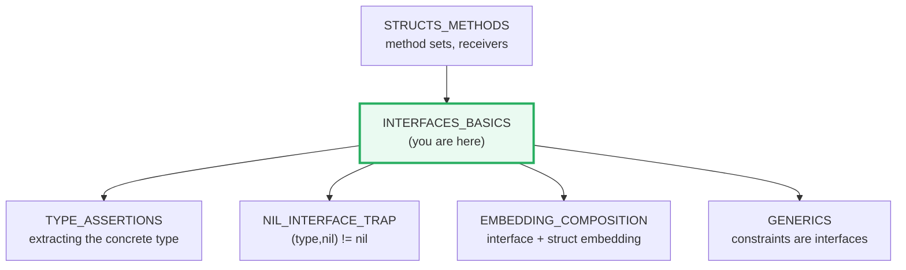
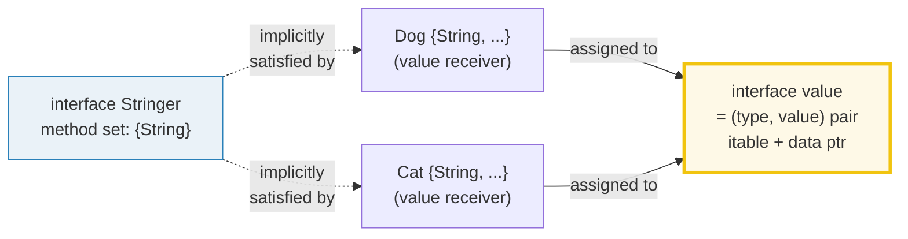
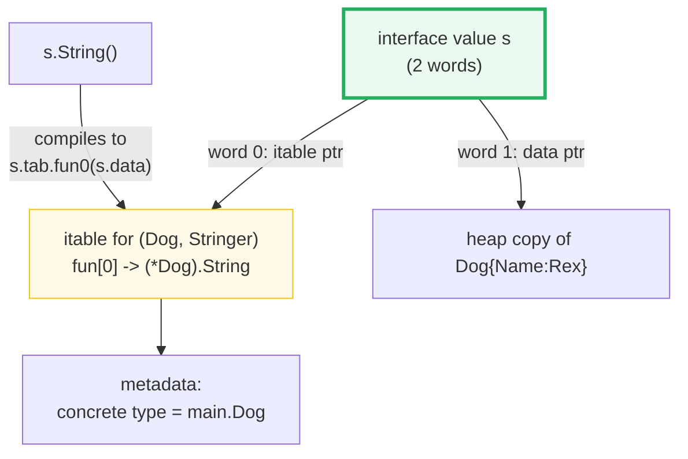

# INTERFACES_BASICS — Implicit Satisfaction, Method Sets & the (type, value) Pair

> **Goal (one line):** by printing every value, show how Go interfaces are
> satisfied *implicitly* by method sets, how the method-set rule governs `T`
> vs `*T`, what an interface value really is at runtime (a `(type, value)`
> pair), how interface embedding composes interfaces, and why the proverb
> "accept interfaces, return structs" is the Go design discipline.
>
> **Run:** `go run interfaces_basics.go`
>
> **Ground truth:** [`interfaces_basics.go`](./interfaces_basics.go) → captured
> stdout in [`interfaces_basics_output.txt`](./interfaces_basics_output.txt).
> Every number/table below is pasted **verbatim** from that file under a
> `> From interfaces_basics.go Section X:` callout. Nothing is hand-computed.
>
> **Prerequisites:**
> - 🔗 [`STRUCTS_METHODS`](./STRUCTS_METHODS.md) — methods, value vs pointer
>   receivers, and the *exact* method-set rule (this bundle *uses* that rule to
>   build interfaces on top of it; read it first).
> - 🔗 [`VALUES_TYPES_ZERO`](./VALUES_TYPES_ZERO.md) — `any`/`interface{}` is
>   the zero-value row in that bundle's table; this bundle explains *why*.

---

## 1. Why this bundle exists (lineage)

Go's interfaces are the language's most distinctive feature. Unlike Java or
C#, **there is no `implements` keyword**: a type satisfies an interface purely
because its method set happens to contain the interface's methods — the type
need not even *name* the interface, and the interface's author need not know
the type exists. Russ Cox calls this "the most exciting part of Go from a
language design point of view."

This single decision — *implicit, structural* satisfaction — has three
consequences that this bundle pins, by printing every value:

1. **Decoupling.** A function that takes an `io.Reader` works with
   `*strings.Reader`, `*bytes.Reader`, `*bytes.Buffer`, `*os.File`, or a mock
   you wrote today — *because none of them had to be registered anywhere.*
2. **The method-set rule is the bridge from structs to interfaces.** The spec
   defines the method set of `T` and `*T` differently (🔗 `STRUCTS_METHODS`
   Section D already proved this with `reflect`). That rule *determines* which
   of `T`/`*T` can be assigned to an interface variable.
3. **An interface value is a 2-word `(type, value)` pair.** That runtime
   representation is the foundation for the most famous Go trap — the
   🔗 [`NIL_INTERFACE_TRAP`](./NIL_INTERFACE_TRAP.md) — so this bundle builds
   the mental model the trap will later break.



---

## 2. The mental model: an interface is a method set

An interface type defines a **method set**. A concrete type **satisfies**
(implements) the interface when *its* method set is a superset of the
interface's. There is no declaration that links the two — the compiler just
checks the set relationship.



> From `go.dev/ref/spec` — *Interface types*: "A variable of interface type can
> store a value of any type that is in the type set of the interface. Such a
> type is said to implement the interface." And on the empty interface:
> "all types implement the *empty interface*… `interface{}`. For convenience,
> the predeclared type `any` is an alias for the empty interface." [Go 1.18]

The empty interface `interface{}` (alias `any`) has **zero methods**, so its
method-set-superset condition is trivially met by *every* type — that is why
`any` is the universal container and the foundation of pre-generics
polymorphism (and, post-1.18, of reflection's entry point, see §6).

---

## 3. Section A — Implicit satisfaction (no `implements` keyword)

`Dog` and `Cat` are declared with a `String() string` method each. `Stringer`
is declared separately as `interface { String() string }`. Neither type ever
names `Stringer`; both satisfy it because their method sets ⊇ `Stringer`'s.

> From `interfaces_basics.go` Section A:
> ```
> var s Stringer = Dog{Name:"Rex"}
> s.String()  = "dog:Rex"   (dispatched to Dog.String)
> s %T        = main.Dog   (the CONCRETE type, not Stringer)
> []Stringer{ Dog{Rex}, Cat{Tom}, Dog{Ace} } ->
>     main.Dog -> dog:Rex
>     main.Cat -> cat:Tom
>     main.Dog -> dog:Ace
> any holds Dog: %T=main.Dog %v=dog:Rex
> any holds int: %T=int %v=42
> any holds str: %T=string %v=go
> ```
> ```
> [check] Dog satisfies Stringer (implicit): OK
> [check] []Stringer dispatches per concrete type: OK
> [check] any (empty interface) is satisfied by every type: holds a string here: OK
> [check] any and interface{} are the identical type: OK
> ```

**What to notice**

- **`%T` on an interface variable prints the CONCRETE (dynamic) type**, never
  the interface type. `s` is *statically* `Stringer` but `%T` reports
  `main.Dog` — the type actually boxed inside. This is the single most useful
  debugging fact about interfaces.
- **`[]Stringer` is polymorphic dispatch in action.** One slice holds three
  values of *two* different concrete types; the loop calls each one's own
  `String`. There is no vtable on the struct — the dispatch table is on the
  *interface value* (see §6).
- **`any` is satisfied by everything.** The same `var anything any` variable
  is reassigned a `Dog`, an `int`, and a `string` — all legal, because `any`
  demands zero methods. The last `check` proves `any` and `interface{}` are
  the *identical* type (reflect compares canonical `reflect.Type` pointers).

> From the Go spec — *Method sets* (the bridge): "The method set of a defined
> type `T` … consists of all methods declared with receiver type `T`. The
> method set of a pointer to a defined type `T` … is the set of all methods
> declared with receiver `*T` or `T`." That asymmetry is the subject of §4.

---

## 4. Section B — The method-set rule: `T` has value methods; `*T` has BOTH

This is the rule that turns the value-vs-pointer choice (🔗 `STRUCTS_METHODS`
Section C–D) into an interface-satisfaction question. `W` declares one method,
`M`, with a **pointer** receiver. Per the spec, `M` lives in `*W`'s method set
but **not** in `W`'s.

> From `interfaces_basics.go` Section B:
> ```
> W declares: func (w *W) M()   // POINTER receiver -> in *W ONLY
> reflect.TypeOf(W{}).NumMethod()  = 0   (value-receiver methods of W)
> reflect.TypeOf(&W{}).NumMethod() = 1   (value + pointer methods of *W)
> method set of W : []
> method set of *W: [M]
> var i I = &W{}  -> %T=*main.W  (legal: *W satisfies I)
> COMPILE ERROR (documented, not run): var i I = W{}  // W does not implement I
> ```
> ```
> [check] W's method set is EMPTY (M is pointer-receiver): OK
> [check] *W's method set has 1 method: M: OK
> [check] *W has strictly MORE methods than W: OK
> [check] *W satisfies I (concrete type is *main.W): OK
> ```

**The consequence.** Interface `I` requires `M`. Because `M` has a pointer
receiver:

- `var i I = &W{}` is **legal** — `*W`'s method set `{M}` ⊇ `I`'s `{M}`.
- `var i I = W{}` is a **compile error** — `W`'s method set `{}` ⊊ `I`'s `{M}`.

The error line is deliberately **not** compiled (a file containing it would
not build); it is the canonical statement of the rule. The compiler's actual
message is:

```
cannot use W{} (value of type W) as I value in variable declaration:
	W does not implement I (method M has pointer receiver)
```

**The design lesson.** If *any* method of a type has a pointer receiver, then
only `*T` can satisfy interfaces that require that method — so a type that
mutates via its methods (and therefore uses pointer receivers) is meant to be
*stored and passed as a pointer* wherever an interface is expected. Mixing
pointer-receiver methods into a type that callers will use as a value is a
common source of "doesn't implement" surprises.

---

## 5. Section C — The interface value is a `(type, value)` pair (boxing copies)

An interface value is **not** a thin tag. It is a 2-word struct holding a
pointer to an **itable** (the dispatch table for the concrete type) and a
pointer to the **boxed data** (see §6 for the runtime layout). The single most
important behavioral consequence: **assigning a concrete value to an interface
variable copies that value** — the interface's data word points at the copy,
not at the original.

> From `interfaces_basics.go` Section C:
> ```
> var s Stringer = Dog{Name:"Rex"}
> static type of s   : Stringer (the interface)
> %T (concrete type): main.Dog   (the dynamic type inside the pair)
> %v (concrete val) : dog:Rex
> n := 7; var a any = n  -> a == 7 (a boxed copy)
> n = 999 (mutate source) -> a == 7 (the boxed copy is UNCHANGED)
> d.Name="Rex" before; after d.Name="BOOM", sd=dog:Rex (copy, source mutation invisible)
> ```
> ```
> [check] interface %T reports the concrete type, not the interface: OK
> [check] boxing copies: mutating source n=999 leaves boxed a == 7: OK
> [check] boxing copies structs: sd unchanged after d.Name=BOOM: OK
> ```

**What to notice**

- **Static type vs dynamic type.** `s`'s *static* type is `Stringer` (fixed at
  compile time); its *dynamic* type is `main.Dog` (what `%T` prints). The Go
  spec: "Variables of interface type … have a distinct *dynamic type*, which
  is the (non-interface) type of the value assigned to the variable at run
  time."
- **Boxing copies.** After `var a any = n`, `a` holds `7`. Mutating the source
  `n = 999` does **not** change `a` — the interface boxed a *copy* of `7`.
  The same holds for structs: `sd` keeps `dog:Rex` after `d.Name = "BOOM"`.
- **Why this matters for the nil trap.** Because the pair is `(type, value)`,
  an interface holding a *nil pointer of a concrete type* still has a non-nil
  *type* word → the interface is **not** nil even though the value is. That is
  exactly the 🔗 [`NIL_INTERFACE_TRAP`](./NIL_INTERFACE_TRAP.md), built on the
  pair you see printed here.

---

## 6. The "why": the itable and the 2-word interface value

The Go runtime represents an interface value as a **two-word pair**: a pointer
to an **itable** (interface table / dispatch table) and a pointer to the
**data**. This is the implementation Russ Cox describes in *Go Data
Structures: Interfaces*, and it is why interface dispatch is cheap and the
method-set rule matters.



> From Russ Cox, *Go Data Structures: Interfaces* (research.swtch.com):
> "Interface values are represented as a two-word pair giving a pointer to
> information about the type stored in the interface and a pointer to the
> associated data." "The first word … points at what I call an interface table
> or itable … a list of function pointers." "The second word … points at the
> actual data, in this case a copy of `b`. The assignment `var s Stringer = b`
> makes a copy of `b` rather than point at `b`." On itable construction:
> "The compiler generates a type description structure for each concrete type
> … [and] for each interface type … The interface runtime computes the itable
> by looking for each method listed in the interface type's method table in
> the concrete type's method table. The runtime caches the itable after
> generating it, so that this correspondence need only be computed once."

> From *The Laws of Reflection* (go.dev/blog/laws-of-reflection):
> "A variable of interface type stores a pair: the concrete value assigned to
> the variable, and that value's type descriptor … the pair inside an
> interface variable always has the form (value, concrete type) and cannot
> have the form (value, interface type). Interfaces do not hold interface
> values." This is why `reflect.TypeOf(i any) Type` can recover the concrete
> type — the type descriptor is already inside the pair.

**Three expert consequences of this layout:**

1. **The itable is per (concrete type, interface type), built lazily and
   cached.** Dispatch is `s.tab.fun0(s.data)` — a couple of memory fetches and
   one indirect call. The lookup happens at *assignment* time, not at every
   call, so a tight loop calling an interface method pays the lookup once.
2. **Boxing may allocate.** A value larger than one word is copied onto the
   heap so its address fits in the data word; a word-sized value may be stored
   inline. This is one route by which an interface assignment triggers an
   escape (🔗 `ESCAPE_ANALYSIS`).
3. **`%T` reads the type word; `nil` is the all-nil pair.** A nil interface
   has *both* words nil. The trap arises when only the *value* word is nil.

---

## 7. Section D — Interface embedding (union of method sets)

An interface can *embed* other interfaces; its method set is the **union** of
its own methods and the embedded interfaces' methods. The spec phrases this as
the **intersection of type sets** (a type must satisfy *all* embedded
interfaces) — which, for basic interfaces, is exactly a union of method sets.
The canonical stdlib example is `io.ReadWriter`, which embeds `io.Reader` and
`io.Writer`.

> From `interfaces_basics.go` Section D:
> ```
> type GreeterNamer interface { Greeter; Namer }  // embedded union
> var gn GreeterNamer = Person{name:"Ada"}
> gn.Greet() = "hi, Ada"   gn.Name() = "Ada"
> GreeterNamer method set: [Greet Name]  (union of Greet + Name)
> ```
> ```
> [check] Person satisfies GreeterNamer (has Greet and Name): OK
> [check] GreeterNamer's method set is the union {Greet, Name}: OK
> ```

> From the Go spec — *Embedded interfaces*: "an interface `T` may use a …
> interface type name `E` as an interface element. This is called *embedding*
> interface `E` in `T`. The type set of `T` is the *intersection* of the type
> sets defined by `T`'s explicitly declared methods and the type sets of `T`'s
> embedded interfaces. In other words, the type set of `T` is the set of all
> types that implement all the explicitly declared methods of `T` and also all
> the methods of `E`." [Go 1.18]

`Person` has both `Greet` and `Name` (value receivers), so a `Person` value
satisfies `GreeterNamer` — and `reflect` confirms the embedded interface's
method set is exactly `[Greet Name]`. This is interface-level composition, the
sibling of struct-field embedding covered in 🔗 `EMBEDDING_COMPOSITION`.

---

## 8. Section E — "Accept interfaces, return structs"

The Go proverb **"accept interfaces, return structs"** (🔗
https://go-proverbs.github.io/) is the design discipline that flows from
implicit satisfaction: a *consumer* should ask for the *smallest* interface it
needs (so it works with the widest set of concrete types and is trivially
mockable in tests), while a *producer* should return a *concrete* type (so
callers see the full API and the compiler can devirtualize).

> From `interfaces_basics.go` Section E:
> ```
> readN(io.Reader, 5) applied to three DIFFERENT concrete types:
>     strings.NewReader    concrete type *strings.Reader          -> "hello"
>     bytes.NewReader      concrete type *bytes.Reader            -> "world"
>     *bytes.Buffer        concrete type *bytes.Buffer            -> "buff!"
> var rw io.ReadWriter = &bytes.Buffer  -> %T=*bytes.Buffer
> ```
> ```
> [check] strings.NewReader satisfies io.Reader: OK
> [check] bytes.NewReader satisfies io.Reader: OK
> [check] *bytes.Buffer satisfies io.ReadWriter (non-nil interface): OK
> [check] the SAME readN body serves 3 concrete types: OK
> ```

**What to notice**

- **One function body, three concrete types.** `readN(r io.Reader, n int)`
  compiles once and serves `*strings.Reader`, `*bytes.Reader`, and
  `*bytes.Buffer` — none of which had to declare any relationship to
  `io.Reader`. This is *structural* (duck-typed) polymorphism, checked at
  compile time.
- **A concrete type commonly satisfies several interfaces at once.**
  `*bytes.Buffer` has both `Read` and `Write`, so it satisfies `io.Reader`,
  `io.Writer`, **and** `io.ReadWriter` (the embedded union) simultaneously —
  with no registration.
- **Why "return structs".** If `readN` instead *returned* an `io.Reader`, the
  caller could call `Read` but nothing else — even if the concrete value is a
  `*bytes.Buffer` with `Write`, `String`, `Bytes`, …. Returning the concrete
  type keeps the full API available; accepting the interface keeps the
  *dependency* narrow. (Decoupling, testability, and easy mocking are the
  practical payoff.)

---

## 9. Pitfalls (the expert payoff)

| Trap | Symptom | Fix |
|---|---|---|
| `var i I = T{}` where a required method has a pointer receiver | Compile error: `T does not implement I (method M has pointer receiver)` | Assign the pointer: `var i I = &T{}`. Only `*T`'s method set contains pointer-receiver methods. |
| Mixing value and pointer receivers on one type | Some callers can satisfy the interface, others can't (silent asymmetry) | Be consistent: if *any* method needs a pointer receiver (mutation/large size), give the whole type pointer receivers. |
| Assuming `%T` of an interface prints the interface | Prints the *concrete* type instead → confusing debug output | That's by design: `%T` reads the type word. To see the static type, read the declaration, not `%T`. |
| Mutating the source after boxing and expecting the interface to change | Interface value unchanged (boxing copied the value) | The interface holds a copy; re-assign to the interface, or store/share a pointer if you need aliasing. |
| Interface holding a nil pointer compared to `nil` | `if i == nil` is `false` (the 🔗 `NIL_INTERFACE_TRAP`) | The pair's type word is non-nil. Check the concrete value explicitly; return a bare `nil` interface, not a typed nil pointer. |
| Comparing interface values with `==` that may hold incomparable types | Runtime panic: `comparing uncomparable type` | Interface `==` compares the (type, value) pair and panics if the dynamic type is a slice/map/func. Compare types first or use `reflect.DeepEqual`. |
| Defining an interface before you have ≥2 implementations | Over-abstraction, brittle seams | Go idiom: *discover* interfaces at the consumer, keep them small, define them when a second concrete type appears (YAGNI). |
| Embedding an interface in an interface with a clashing method name | Compile error if the same method name has a different signature | Same-named embedded methods must have *identical* signatures (spec). |
| Expecting `any` to be a "type" you can call methods on | `any` has no methods; every dynamic type does | `any` is the empty interface. To call a method, type-assert first: `v, ok := x.(Stringer)` (🔗 `TYPE_ASSERTIONS`). |

---

## 10. Cheat sheet

```go
// An interface is a METHOD SET. A type SATISFIES it implicitly (no `implements`)
// when its method set ⊇ the interface's method set.
type Stringer interface { String() string }
func (d Dog) String() string { ... }   // Dog now satisfies Stringer, unilaterally

// any == interface{} (alias, Go 1.18): the EMPTY method set, satisfied by all types.
var x any = 42; x = "go"; x = Dog{}     // all legal

// METHOD-SET RULE (spec):
//   method set of  T  = its VALUE-receiver methods only
//   method set of *T  = its value- AND pointer-receiver methods
// => a pointer-receiver method is satisfiable ONLY by *T, never a bare T.
type W struct{}
func (w *W) M() {}                       // var i I = &W{} OK;  var i I = W{}  COMPILE ERROR

// An interface VALUE is a 2-word (type, value) PAIR:
//   word 0 -> itable (dispatch table, lazily built + cached per (concrete, iface))
//   word 1 -> data   (a COPY of the concrete value; may be heap-allocated)
var s Stringer = Dog{Name:"Rex"}
fmt.Printf("%T\n", s)                    // main.Dog   <- the DYNAMIC type, not Stringer

// Boxing COPIES: mutating the source after assignment does not change the iface.
n := 7; var a any = n; n = 999           // a == 7 (the copy is independent)

// Interface EMBEDDING = union of method sets (spec: intersection of type sets).
type ReadWriter interface { io.Reader; io.Writer }   // == Read + Write

// ACCEPT interfaces, RETURN structs: ask for the narrowest interface you need,
// return the concrete type so callers keep the full API.
func readN(r io.Reader, n int) ([]byte, error) { ... }  // works for any Reader
```

---

## Sources

Every signature, value, and behavioral claim above was verified against the Go
specification, the standard-library docs, and the canonical implementation
write-ups:

- The Go Programming Language Specification — https://go.dev/ref/spec
  - *Interface types* (type sets, basic interfaces, empty interface = `any` [Go 1.18]): https://go.dev/ref/spec#Interface_types
  - *Embedded interfaces* (type set = intersection of type sets): https://go.dev/ref/spec#Interface_types
  - *Method sets* ("method set of `T` … receiver type `T`; method set of `*T` … receiver `*T` or `T`"): https://go.dev/ref/spec#Method_sets
  - *Implementing an interface* (a type implements `I` when its method set is a superset): https://go.dev/ref/spec#Implementing_an_interface
  - *Variables* (static type vs dynamic type of an interface variable): https://go.dev/ref/spec#Variables
- Russ Cox — *Go Data Structures: Interfaces* (the 2-word `(type, value)` pair; the itable; lazy/cached itable construction; boxing copies): https://research.swtch.com/interfaces
- *The Laws of Reflection* (go.dev/blog/laws-of-reflection) — "an interface variable stores a pair: the concrete value … and that value's type descriptor … the pair … always has the form (value, concrete type) and cannot have the form (value, interface type)": https://go.dev/blog/laws-of-reflection
- Effective Go — *Interfaces and other types* (implicit satisfaction, "accept interfaces, return structs" idiom): https://go.dev/doc/effective_go
- Go Proverbs — "accept interfaces, return structs": https://go-proverbs.github.io/
- Standard library `io` package — `Reader`, `Writer`, `ReadWriter` (embedded union): https://pkg.go.dev/io
- Standard library `reflect` package — `Type.NumMethod`, `Type.Method` (method-set enumeration hides unexported methods; counts pointer-receiver methods only for `reflect.TypeOf(T{})` vs `reflect.TypeOf(&T{})`): https://pkg.go.dev/reflect
- Web fact-check (pointer-receiver method-set rule, >=2 sources): Stack Overflow https://stackoverflow.com/questions/33936081/golang-method-with-pointer-receiver ; Sentry https://sentry.io/answers/interface-pointer-receiver/ ; golangbot.com https://golangbot.com/interfaces-part-2/

**Facts that could not be verified by running** (documented, not executed, since
they are compile errors by design): `var i I = W{}` is rejected with
`W does not implement I (method M has pointer receiver)`. This is confirmed by
the spec's *Method sets* section cited above (the method set of `W` excludes
pointer-receiver methods), corroborated by the Stack Overflow / Sentry /
golangbot sources, and *not* reproduced as runnable output (a file containing
it would not build). The runtime layout of the interface value (itable +
2-word pair, lazy caching, boxing-copies) is taken from Russ Cox's article and
the laws-of-reflection blog; it is observable indirectly through `%T`, the
boxing-copy check, and `reflect`, but the raw memory words are not printed
here.
