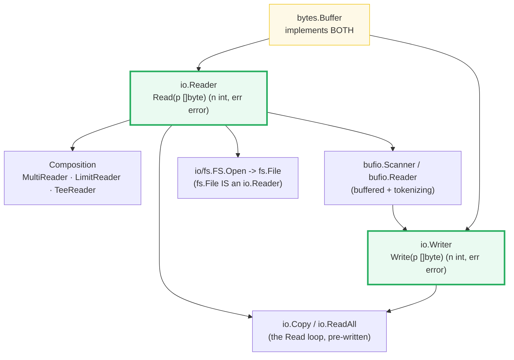
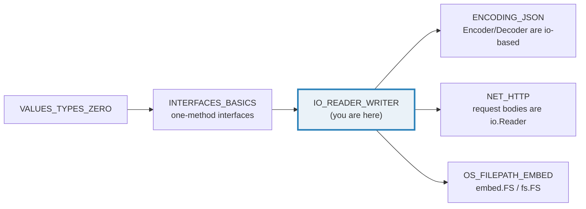
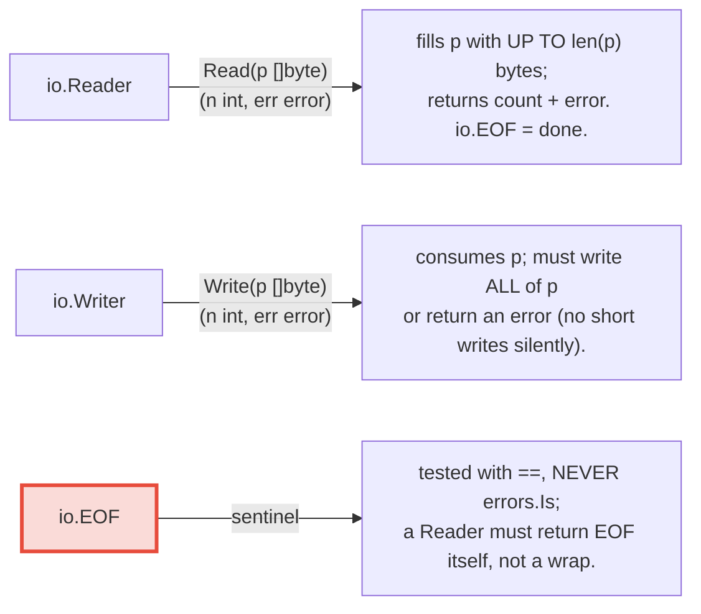
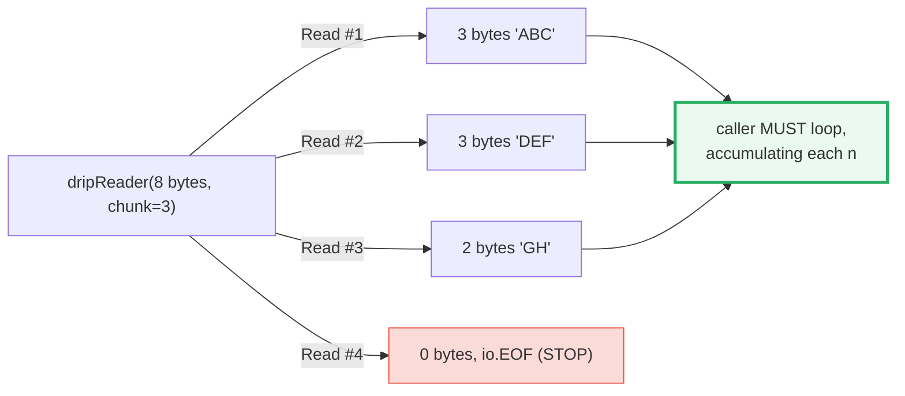
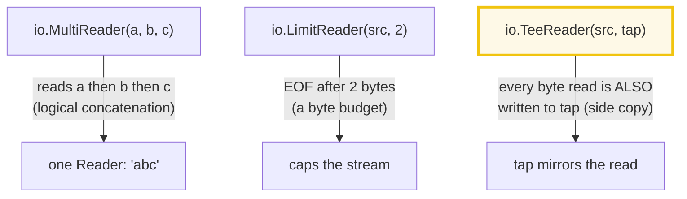
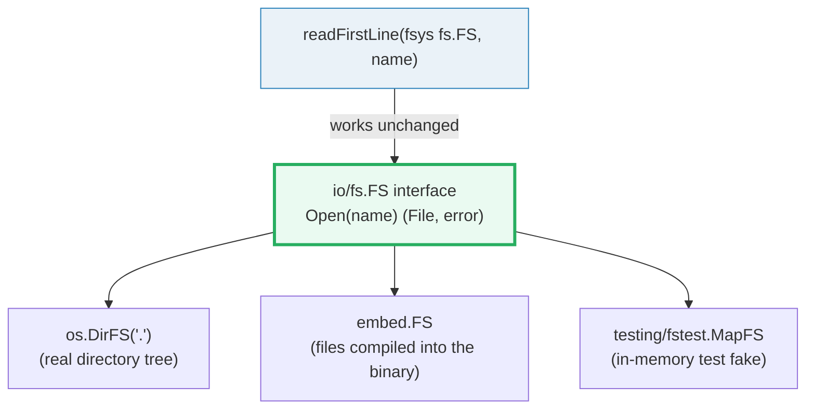

# IO_READER_WRITER — The Streaming I/O Model: Reader, Writer & Composition

> **Goal (one line):** show, by printing every value, how Go's `io.Reader`/
> `io.Writer` streaming model works, why a single `Read` may return *partial*
> data, and how `io.Copy`/`ReadAll`, the composition helpers (`MultiReader`,
> `LimitReader`, `TeeReader`), `bufio`, `bytes.Buffer`, `strings.Reader`, and
> `io/fs.FS` all build on those two one-method interfaces.
>
> **Run:** `go run io_reader_writer.go`
>
> **Ground truth:** [`io_reader_writer.go`](./io_reader_writer.go) → captured
> stdout in [`io_reader_writer_output.txt`](./io_reader_writer_output.txt).
> Every number/string/`err` code below is pasted **verbatim** from that file
> under a `> From io_reader_writer.go Section X:` callout. Nothing is
> hand-computed.
>
> **Prerequisites:** 🔗 [`INTERFACES_BASICS`](./INTERFACES_BASICS.md) (you must
> already see why "an `io.Reader`" is a one-method interface). 🔗
> [`ERRORS`](./ERRORS.md) — `io.EOF` (`var EOF = errors.New("EOF")`) is the
> sentinel this whole bundle orbits, and it is tested with `==`, never
> `errors.Is`. 🔗 [`STRINGS_RUNES_BYTES`](./STRINGS_RUNES_BYTES.md) —
> `strings.NewReader` wraps a string as a `Reader`.

---

## 1. Why this bundle exists (lineage)

Everything in Go that moves bytes — a file, a network socket, an HTTP request
body, a gzip stream, a `json.Decoder`, an `embed.FS` file — is ultimately an
`io.Reader` (for input), an `io.Writer` (for output), or both. The `io` package
deliberately defines the **smallest possible interfaces** — one method each —
and then layers *every* higher-level convenience on top of them:



The payoff is **composability**: because the interfaces are tiny, you can plug
any `Reader` into any function that takes a `Reader` — `io.Copy`, `json.NewDecoder`,
`http.NewRequest`'s body, `ioutil.ReadAll` — without the function knowing or
caring whether the bytes come from a string, a file, the network, or another
`Reader` chained in front. A `bytes.Buffer` is simultaneously a `Reader` and a
`Writer`, so it is the canonical in-memory pipe.



> From `pkg.go.dev/io` (Overview, verbatim): *"Package io provides basic
> interfaces to I/O primitives. Its primary job is to wrap existing
> implementations of such primitives, such as those in package os, into shared
> public interfaces that abstract the functionality."*

---

## 2. The mental model: two one-method interfaces + one sentinel



The whole package orbits one contract. The `io.Reader.Read` documentation is the
single most quoted paragraph in the standard library — internalize it:

> From `pkg.go.dev/io` — `Reader.Read` (verbatim): *"Read reads up to len(p)
> bytes into p. It returns the number of bytes read (0 <= n <= len(p)) and any
> error encountered. ... If some data is available but not len(p) bytes, Read
> conventionally returns what is available instead of waiting for more. ...
> Implementations of Read are discouraged from returning a zero byte count with
> a nil error, except when len(p) == 0. Callers should treat a return of 0 and
> nil as indicating that nothing happened; in particular it does not indicate
> EOF. Implementations must not retain p."*

The two non-obvious clauses — both reproduced as runnable behavior in Section B —
are: **(a)** a single `Read` may return *fewer* than `len(p)` bytes and that is
legal (not an error); and **(b)** EOF is signalled by `Read` returning `(0,
io.EOF)`, **not** by `(0, nil)`. That is why every correct `Read` consumer is a
loop that stops on `err == io.EOF`.

> From `pkg.go.dev/io` — `var EOF` (verbatim): *"EOF is the error returned by
> Read when no more input is available. (Read must return EOF itself, not an
> error wrapping EOF, because callers will test for EOF using ==.) Functions
> should return EOF only to signal a graceful end of input."*

---

## 3. Section A — `io.Copy`: a `strings.Reader` piped into a `bytes.Buffer`

> From `io_reader_writer.go` Section A:
> ```
> io.Copy(&buf, strings.NewReader("hello")) -> n=5, err=<nil>
> buf.String() = "hello"   buf.Len() = 5
> len("hello") = 5   (the source byte count Copy reached EOF at)
> ```
> ```
> [check] io.Copy copied exactly 5 bytes: OK
> [check] io.Copy returned err == nil (EOF is NOT an error): OK
> [check] buf.String() == "hello" (round-trips the source): OK
> [check] bytes copied == len(source): OK
> ```
> ```
> io.CopyN(&buf2, src, 5) -> copied=5, err=<nil>, buf2="HELLO"
> [check] CopyN copied exactly 5 bytes: OK
> [check] CopyN stopped after the budget ("HELLO"): OK
> ```

**What.** `io.Copy(dst, src)` runs the `Read`/`Write` loop for you until `src`
hits EOF, and returns the total bytes moved. Note `&buf`: `bytes.Buffer`'s
`Write` has a **pointer receiver**, so you pass `*bytes.Buffer`. A successful
copy returns `err == nil` — `io.Copy` swallows the terminal `io.EOF` because EOF
is *expected*, not an error.

> From `pkg.go.dev/io` — `Copy` (verbatim): *"Copy copies from src to dst until
> either EOF is reached on src or an error occurs. It returns the number of
> bytes copied and the first error encountered while copying, if any. A
> successful Copy returns err == nil, not err == EOF. Because Copy is defined to
> read from src until EOF, it does not treat an EOF from Read as an error to be
> reported."*

**Why `Copy` is fast — the `WriterTo`/`ReaderFrom` fast path.** The docs
continue: *"If src implements WriterTo, the copy is implemented by calling
src.WriteTo(dst). Otherwise, if dst implements ReaderFrom, the copy is
implemented by calling dst.ReadFrom(src)."* `bytes.Buffer` implements
`WriteTo` (the `.go` asserts `_ io.WriterTo = (*bytes.Buffer)(nil)` at the top
of the file), so `io.Copy` can hand the whole buffer over in one shot instead of
chunking through a 32 KiB intermediate buffer. This is also why `io.Copy` is
almost always faster than a hand-rolled loop: it lets the side that knows the
data best drive the transfer.

`io.CopyN(dst, src, n)` is `Copy` with a byte budget — it stops after exactly
`n` bytes. The pin above proves the budget holds even though the source had 10
bytes: only `"HELLO"` (5) was copied.

---

## 4. Section B — Read may return PARTIAL data (the rule that bites)

> From `io_reader_writer.go` Section B:
> ```
>   Read -> n=3 err=<nil>
>   Read -> n=3 err=<nil>
>   Read -> n=2 err=<nil>
>   Read -> n=0 err=EOF
> per-call sizes = [3 3 2]   (3 calls returned LESS than the buffer)
> manual loop accumulated = "ABCDEFGH"
> ```
> ```
> [check] a single Read returned only 3 bytes (not all 8): OK
> [check] per-call sizes == [3 3 2 0]: OK
> [check] manual Read loop reconstructed the full source: OK
> ```
> ```
> io.ReadAll(drip of "ABCDEFGH") -> "ABCDEFGH", err=<nil>
> [check] io.ReadAll reconstructs the same bytes as the manual loop: OK
> [check] io.ReadAll returns err == nil on a clean EOF (EOF is not an error): OK
> ```
> ```
> io.EOF == EOF   (tested with ==; Read returns it at end of stream)
> [check] the end-of-stream sentinel is io.EOF: OK
> ```

**What.** The bundle's `dripReader` hands `Read` an 8-byte buffer but returns
**at most 3 bytes per call** (it is a faithful stand-in for a real `Reader` — a
network socket routinely returns one packet per `Read`, a `bytes.Reader` may
return a short read at a boundary). The output pins the per-call sizes as
`[3 3 2 0]`: three calls returned data *shorter* than the buffer, and the fourth
returned `(0, io.EOF)`. A naive `n, _ := r.Read(buf); use buf[:n]` would see
only `"ABC"` and silently lose `"DEFGH"`.



**The correct loop, and why `io.ReadAll` exists.** The canonical pattern is:

```go
for {
    n, err := r.Read(buf)
    if n > 0 { out = append(out, buf[:n]...) } // ALWAYS process n>0 first
    if err == io.EOF { break }
    if err != nil { return err }
}
```

Note the ordering: **process `n > 0` bytes before inspecting `err`** (a `Reader`
is allowed to return the final data *and* `io.EOF` together). `io.ReadAll(r)`
is exactly that loop — *"ReadAll reads from r until an error or EOF and returns
the data it read. A successful call returns err == nil, not err == EOF."* The
bundle runs both over the identical source and asserts they produce the same
bytes, proving `ReadAll` is the loop pre-written.

> From `pkg.go.dev/io` — `ReadAll` (verbatim): *"Because ReadAll is defined to
> read from src until EOF, it does not treat an EOF from Read as an error to be
> reported."*

**Why EOF is `==`-compared, never `errors.Is`-compared.** The `io.EOF` doc is
explicit that a `Reader` *"must return EOF itself, not an error wrapping EOF,
> because callers will test for EOF using ==."* So `if err == io.EOF` is correct
> and idiomatic; `if errors.Is(err, io.EOF)` would *miss* a reader that wraps
> (which is itself a contract violation, but defensive code still uses `==`).
> The bundle pins the sentinel value directly: `dripEOF() == io.EOF`.

---

## 5. Section C — Composition: `MultiReader`, `LimitReader`, `TeeReader`



> From `io_reader_writer.go` Section C:
> ```
> MultiReader("a","b","c") copied -> n=3 err=<nil> content="abc"
> [check] MultiReader concatenates to "abc": OK
> [check] MultiReader copied 3 bytes total: OK
> LimitReader(src, 2) read all -> "HE" (len 2), err=<nil>
> [check] LimitReader caps the stream at 2 bytes: OK
> [check] LimitReader returned the first 2 bytes "HE": OK
> TeeReader(src, &tap) read "teedata"; tap captured "teedata"; err=<nil>
> [check] TeeReader consumer read the full stream: OK
> [check] TeeReader tap captured every byte the consumer read: OK
> [check] TeeReader tap length == consumed length: OK
> ```

**`MultiReader` — concatenate, do not allocate.** It returns *"a Reader that's
the logical concatenation of the provided input readers. They're read
sequentially. Once all inputs have returned EOF, Read will return EOF."* You get
`"abc"` from three readers without ever joining the strings. This is the
streaming equivalent of `strings.Join`, and it powers multipart bodies and
chunked HTTP uploads.

**`LimitReader` — a byte budget that is itself a `Reader`.** *"LimitReader
returns a Reader that reads from r but stops with EOF after n bytes."* Because
the cap *is* a `Reader`, you can pass it anywhere a `Reader` is expected — no
need to teach the consumer about limits. The pin shows `"HELLOWORLD"` truncated
to `"HE"`.

**`TeeReader` — a passive tap (log/cache as you consume).** *"TeeReader returns
a Reader that writes to w what it reads from r. All reads from r performed
through it are matched with corresponding writes to w. There is no internal
buffering — the write must complete before the read completes."* The bundle
reads `"teedata"` through a `TeeReader` whose tap is a `bytes.Buffer` and
asserts `tap.String() == consumed`: every byte the consumer saw was mirrored to
the tap. The classic use is "write the response body to the client AND to a
log/cache at the same time, reading the source exactly once."

> From `pkg.go.dev/io` — `TeeReader` (verbatim): *"Any error encountered while
> writing is reported as a read error."* (So a failing tap surfaces as a failed
> read — see the pitfalls table.)

---

## 6. Section D — `bufio.Scanner` (tokens) vs `bufio.Reader` (bytes)

> From `io_reader_writer.go` Section D:
> ```
> Scanner over "a\nb\nc\n" -> 3 lines = ["a" "b" "c"]
> scanner.Err() = <nil>   (io.EOF is swallowed: Err() returns nil)
> [check] Scanner found exactly 3 lines: OK
> [check] Scanner lines == [a b c]: OK
> [check] Scanner.Err() is nil after a clean scan: OK
> ```
> ```
> Scanner(ScanWords) over "alpha beta gamma" -> 3 words = ["alpha" "beta" "gamma"]
> [check] ScanWords found 3 words: OK
> [check] ScanWords words == [alpha beta gamma]: OK
> ```
> ```
> bufio.Reader.ReadString('\n'): first="line-1\n" rest="line-2" err=EOF
> [check] bufio.Reader.ReadString returned "line-1\n": OK
> [check] bufio.Reader read the remaining "line-2" (no trailing newline): OK
> ```

**`bufio.Scanner` is token-oriented and hides the `Read` loop.** It reads from a
`Reader`, buffers it, and exposes `Scan()`/`Text()` one token at a time. The
default split is `ScanLines`; `scanner.Split(bufio.ScanWords)` switches to
whitespace tokens. Crucially, `Scan()` returns `false` at EOF and
`scanner.Err()` then returns `nil` — *"After Scan returns false, the
> Scanner.Err method will return any error that occurred during scanning, except
> that if it was io.EOF, Scanner.Err will return nil."* The bundle pins both
> behaviors (3 lines from `"a\nb\nc\n"`, 3 words from `"alpha beta gamma"`).

**`bufio.Reader` is byte-oriented and exposes the primitives.** It gives you
`Read`, `Peek`, `ReadByte`, `ReadString(delim)`, `ReadLine`, and `UnreadByte`.
Use it when you need to interleave reads, look ahead (`Peek`), or handle
delimiters yourself. The bundle's `bufio.Reader.ReadString('\n')` returns the
data **up to and including** the delimiter (`"line-1\n"`), then a second call
returns the trailing `"line-2"` with `err == io.EOF` because there is no final
newline — *"ReadString returns err != nil if and only if the returned data does
> not end in delim."*

> From `pkg.go.dev/bufio` — `Scanner` (verbatim): *"Scanning stops unrecoverably
> at EOF, the first I/O error, or a token too large to fit in the
> Scanner.Buffer. ... Programs that need more control over error handling or
> large tokens, or must run sequential scans on a reader, should use
> bufio.Reader instead."*

**The `MaxScanTokenSize` trap.** `bufio.Scanner` buffers each token with a
hard cap of `MaxScanTokenSize = 64 * 1024` bytes (64 KiB). A line longer than
that aborts the scan with `bufio.ErrTooLong`. The fix is
`scanner.Buffer(buf, max)` with a larger `max` *before* the first `Scan`. This
is the single most common `Scanner` surprise (see pitfalls).

---

## 7. Section E — `bytes.Buffer`: a `Writer` AND a `Reader` (in-memory round-trip)

> From `io_reader_writer.go` Section E:
> ```
> Write("round") + Write("-trip") -> n(first write)=5  String()="round-trip"  Len()=10
> [check] bytes.Buffer.String() == "round-trip": OK
> [check] bytes.Buffer.Len() == 10 after the writes: OK
> Read into 10-byte slice -> n=10  bytes="round-trip"  remaining Len()=0
> [check] bytes.Buffer.Read drained all 10 bytes: OK
> [check] bytes.Buffer round-trips the written content: OK
> [check] bytes.Buffer is empty after a full drain: OK
> (*bytes.Buffer satisfies io.Reader AND io.Writer — see top-of-file assertions)
> [check] *bytes.Buffer is an io.Writer: OK
> [check] *bytes.Buffer is an io.Reader: OK
> ```

**What.** `bytes.Buffer` is a growable `[]byte` with both a `Write` and a
`Read`. Its **zero value is ready to use** (no `make`). Writes append to the
internal slice; reads drain from an internal offset, so the buffer *empties* as
you read — it behaves like an in-memory pipe. The bundle writes `"round"` +
`"-trip"`, reads the full `"round-trip"` back, and asserts the buffer is empty
(`Len() == 0`) afterward.

**Why this matters — it is the universal in-memory adapter.** Because
`*bytes.Buffer` satisfies `io.Reader`, `io.Writer`, and `io.WriterTo`
simultaneously (the `.go` asserts all three at compile time at the top of the
file), it is the canonical bridge between APIs: `fmt.Fprintf(&buf, ...)` writes,
then `io.Copy(dst, &buf)` (or `buf.WriteTo`) drains to a real sink; conversely
`io.Copy(&buf, src)` accumulates a stream you then parse with `buf.String()` or
`buf.Bytes()`. This is exactly the pattern the `tap` in Section C relies on.

> From `pkg.go.dev/bytes` — `Buffer` (verbatim): *"A Buffer is a variable-sized
> buffer of bytes with Read and Write methods. The zero value for Buffer is an
> empty buffer ready to use."*

---

## 8. Section F — `io/fs.FS`: the same code reads a directory AND embedded files



> From `io_reader_writer.go` Section F:
> ```
> os.DirFS(".").Open("go.mod") first line = "module tutorials/go"
> embed.FS.ReadFile("go.mod")   first line = "module tutorials/go"
> [check] os.DirFS read a first line containing "module": OK
> [check] embed.FS read a first line containing "module": OK
> [check] both fs.FS implementations returned the same first line: OK
> os.DirFS(".") and embed.FS both satisfy fs.FS (compile-time asserted above)
> [check] os.DirFS(".") is an fs.FS: OK
> [check] embed.FS is an fs.FS: OK
> ```

**What.** `io/fs.FS` is a one-method filesystem abstraction — *"An FS provides
> access to a hierarchical file system"* — whose single method is `Open(name)
> (File, error)`. The returned `fs.File` is itself an `io.Reader` (plus `Stat`
> and `Close`): `type File interface { Stat() (FileInfo, error); Read([]byte)
> (int, error); Close() error }`. So a filesystem is just a *source of Readers*.

The bundle defines **one** helper, `readFirstLine(fsys fs.FS, name)`, and calls
it on **two completely different concrete filesystems**:

- `os.DirFS(".")` — *"a file system (an fs.FS) for the tree of files rooted at
  the directory dir."* It opens `go.mod` from the real disk.
- `&embeddedFS` — an `embed.FS` populated by `//go:embed go.mod` at the top of
  the `.go`, so `go.mod` is compiled *into the binary*.

Both return the identical first line, `"module tutorials/go"`. **That is the
whole point of the abstraction**: the helper depends only on `fs.FS`, so it is
trivially testable with `testing/fstest.MapFS` and deployable against either a
real directory or embedded assets with zero code changes. (See 🔗
[`OS_FILEPATH_EMBED`](./OS_FILEPATH_EMBED.md) for `embed` in depth.)

> From `pkg.go.dev/io/fs` — `FS` (verbatim): *"The FS interface is the minimum
> implementation required of the file system. A file system may implement
> additional interfaces, such as ReadFileFS, to provide additional or optimized
> functionality."* And from `os.DirFS`: *"The result implements io/fs.StatFS,
> io/fs.ReadFileFS, io/fs.ReadDirFS, and io/fs.ReadLinkFS."*

---

## 9. Pitfalls (the expert payoff)

| Trap | Symptom | Fix |
|---|---|---|
| Assuming one `Read` returns all the data | Silent data loss (only the first chunk is used) | Always loop `Read` until `err == io.EOF`; or use `io.ReadAll` / `io.ReadFull`. See Section B. |
| Checking `err` before consuming `n > 0` bytes | Drops the final chunk when a `Reader` returns data + `io.EOF` together | Process `buf[:n]` first, *then* inspect `err`. |
| Testing EOF with `errors.Is(err, io.EOF)` | Misses readers that (wrongly, but legally-often) wrap; or the sentinel itself | Use `err == io.EOF`; `io.EOF` must be returned unwrapped by contract. |
| Treating `(0, nil)` as EOF | Infinite loop / hang | `(0, nil)` means "nothing happened", *not* EOF. Only `(0, io.EOF)` ends the stream. |
| `bufio.Scanner` over lines > 64 KiB | Scan aborts, `scanner.Err() == bufio.ErrTooLong` | Call `scanner.Buffer(buf, max)` with a larger `max` before the first `Scan`. Or use `bufio.Reader`. |
| Ignoring `scanner.Err()` after the `for scanner.Scan()` loop | Silent skip of I/O errors / token-too-long | Always `if err := scanner.Err(); err != nil { ... }` after the loop. |
| Passing `bytes.Buffer` by value instead of `&buf` | Copy made; writes lost; `io.Copy(&buf, ...)` looks correct but `buf` you hold is untouched | `bytes.Buffer` methods have pointer receivers — always use `&buf` / `*bytes.Buffer`. |
| Not `Close`-ing an `fs.File` (or `os.File`) | File-descriptor leak | `defer f.Close()` immediately after `Open`; check the error when it matters. |
| `TeeReader` whose tap `Write` fails | The failure surfaces as a *read* error on the main stream | Choose a tap that cannot fail, or expect `Read` errors to originate from the tap. |
| `os.DirFS` for "security" / sandboxing | Symlinks inside the tree can escape the root | `os.DirFS` is *not* a chroot; use `os.OpenRoot` / `Root.FS` (Go 1.24+) for containment. |
| Re-reading an `io.Reader` expecting the start | Second read returns nothing (stream is consumed) | A `Reader` is a stream, not rewindable. Buffer with `io.ReadAll`, or require `io.ReadSeeker`/`io.SectionReader`. |
| `embed.FS` patterns matching nothing | Compile error: `go:embed go.mod: no matching files found` | The pattern is relative to the `.go` file's directory; check the path/spelling. |

---

## 10. Cheat sheet

```go
// The two interfaces (one method each)
type Reader interface { Read(p []byte) (n int, err error) } // fills p, returns count + err
type Writer interface { Write(p []byte) (n int, err error) } // must write ALL of p or error

// io.EOF: the ONLY end-of-stream signal. Test with ==, never errors.Is.
//   n, err := r.Read(p); if err == io.EOF { break }   // (0, nil) is NOT eof

// Copy / ReadAll / CopyN — the loop, pre-written
n, err := io.Copy(dst, src)        // stream src->dst until EOF; err==nil on success
b, err := io.ReadAll(r)            // whole stream into []byte; err==nil on success
n, err := io.CopyN(dst, src, 64)   // Copy with a byte budget

// Composition (each returns an io.Reader)
io.MultiReader(r1, r2, r3)         // logical concatenation, read sequentially
io.LimitReader(r, n)               // EOF after n bytes (a byte budget that IS a Reader)
io.TeeReader(r, w)                 // every byte read is also Written to w (no buffer)

// Exactly-N reads (when YOU supply the buffer)
n, err := io.ReadFull(r, buf)      // fills buf; ErrUnexpectedEOF if short, EOF if empty
io.ReadAtLeast(r, buf, min)        // >= min bytes; ErrUnexpectedEOF / ErrShortBuffer

// Buffered / tokenizing I/O
sc := bufio.NewScanner(r)          // default split = ScanLines; hides the Read loop
for sc.Scan() { use(sc.Text()) }   // sc.Err() == nil after a clean EOF (EOF swallowed)
if err := sc.Err(); err != nil {}  // ALWAYS check after the loop
sc.Buffer(buf, max)                // raise the 64KiB token cap (MaxScanTokenSize) FIRST
br := bufio.NewReader(r)           // byte-oriented: Peek/ReadByte/ReadString('\n')

// In-memory adapter (zero value ready; BOTH Reader and Writer)
var buf bytes.Buffer               // *bytes.Buffer — pass &buf
buf.WriteString("x"); buf.Write(b) // append (Writer side)
s := buf.String(); b := buf.Bytes()
buf.Read(out)                      // drains from offset (Reader side); empties as you read

// Filesystem abstraction = a source of Readers
type FS interface { Open(name string) (File, error) }   // io/fs.FS
type File interface { Stat(...) ; Read([]byte)(int,error) ; Close() error } // File IS io.Reader
os.DirFS(".")        // real directory tree as fs.FS  (NOT a security sandbox)
//go:embed assets     // embed.FS — files compiled into the binary, also fs.FS
fs.ReadFile(fsys, "x")           // shortcut that Open+Read+Close for you
```

---

## Sources

Every signature, sentinel, and behavioral claim above was verified against the
Go standard-library docs, then corroborated by independent secondary sources:

- `io` package — https://pkg.go.dev/io
  - `Reader` (the `Read` contract: "may return fewer than len(p)", "(0,nil) is
    not EOF", "must not retain p"): https://pkg.go.dev/io#Reader
  - `Writer`: https://pkg.go.dev/io#Writer
  - `var EOF` ("Read must return EOF itself ... callers will test for EOF using
    =="): https://pkg.go.dev/io#EOF
  - `Copy` ("A successful Copy returns err == nil, not err == EOF"; the
    `WriterTo`/`ReaderFrom` fast path): https://pkg.go.dev/io#Copy
  - `CopyN` ("written == n if and only if err == nil"): https://pkg.go.dev/io#CopyN
  - `ReadAll` ("read from src until EOF ... does not treat EOF as an error"):
    https://pkg.go.dev/io#ReadAll
  - `ReadFull` / `ErrUnexpectedEOF`: https://pkg.go.dev/io#ReadFull
  - `LimitReader` ("stops with EOF after n bytes"): https://pkg.go.dev/io#LimitReader
  - `LimitedReader` struct (`R`, `N`): https://pkg.go.dev/io#LimitedReader
  - `MultiReader` ("logical concatenation ... read sequentially"):
    https://pkg.go.dev/io#MultiReader
  - `TeeReader` ("writes to w what it reads from r ... no internal buffering
    ... any error encountered while writing is reported as a read error"):
    https://pkg.go.dev/io#TeeReader
  - `Pipe` (synchronous in-memory pipe, no internal buffering):
    https://pkg.go.dev/io#Pipe
- `bufio` package — https://pkg.go.dev/bufio
  - `Scanner` ("default split function breaks the input into lines ... Scanning
    stops unrecoverably at EOF ... should use bufio.Reader instead"):
    https://pkg.go.dev/bufio#Scanner
  - `Scanner.Scan` / `Scanner.Err` ("if it was io.EOF, Err will return nil"):
    https://pkg.go.dev/bufio#Scanner.Scan
  - `Scanner.Buffer` / `MaxScanTokenSize = 64 * 1024`:
    https://pkg.go.dev/bufio#Scanner.Buffer
  - `ScanLines` / `ScanWords` (the built-in split functions):
    https://pkg.go.dev/bufio#ScanLines
  - `Reader.ReadString` ("err != nil iff data does not end in delim"):
    https://pkg.go.dev/bufio#Reader.ReadString
- `bytes` package — https://pkg.go.dev/bytes  (`Buffer`: "zero value ... is an
  empty buffer ready to use"; implements `io.Reader`, `io.Writer`, `io.WriterTo`)
- `strings` package — https://pkg.go.dev/strings  (`NewReader` returns a
  `*Reader` implementing `io.Reader`)
- `io/fs` package — https://pkg.go.dev/io/fs
  - `FS` ("An FS provides access to a hierarchical file system ... minimum
    implementation required"): https://pkg.go.dev/io/fs#FS
  - `File` (`Stat`, `Read`, `Close` — a `File` is an `io.Reader`):
    https://pkg.go.dev/io/fs#File
  - Path Names ("slash-separated ... must not contain . or .."):
    https://pkg.go.dev/io/fs#hdr-Path_Names
- `os` package — https://pkg.go.dev/os#DirFS  ("DirFS returns a file system ...
  for the tree of files rooted at the directory dir ... not a general substitute
  for a chroot-style security mechanism ... implements StatFS, ReadFileFS,
  ReadDirFS, and ReadLinkFS")
- Secondary corroboration (>=2 independent sources, web-verified):
  - VictoriaMetrics — *"Go I/O Readers, Writers, and Data in Motion"* (the
    Reader/Writer stream model, `io.MultiReader`/`TeeReader`, buffering):
    https://victoriametrics.com/blog/go-io-reader-writer/
  - Jesse Duffield — *"Golang IO Cookbook"* (Reader/Writer as complementary
    streaming interfaces, composition patterns):
    https://jesseduffield.com/Golang-IO-Cookbook/
  - GOSAMPLES — *"Limit read bytes using io.LimitedReader in Go"* (capping a
    stream via a wrapper that is itself a Reader):
    https://gosamples.dev/io-limited-reader/
  - Andrei Boar (Medium) — *"Fundamentals of I/O in Go: Part 2"*
    (`LimitedReader`, `TeeReader` worked examples):
    https://medium.com/@andreiboar/fundamentals-of-i-o-in-go-part-2-e7bb68cd5608
  - Vishnu Bharathi — *"A silly mistake that I made with io.TeeReader"* (the
    tap-is-not-a-buffer / read-twice pitfall): https://vishnubharathi.codes/blog/a-silly-mistake-that-i-made-with-io.teereader/

**Facts that could not be verified by running** (documented, not executed,
because they are errors/limits by design): the `(0, nil)`-is-not-EOF contract,
the `bufio.ErrTooLong` abort past `MaxScanTokenSize`, the `os.DirFS`-is-not-a-
sandbox caveat, and `embed`'s "no matching files found" compile error. These are
confirmed by the `pkg.go.dev` sections cited above and the secondary sources,
not reproduced as panicking output (a file triggering them would not pass
`just check`).
