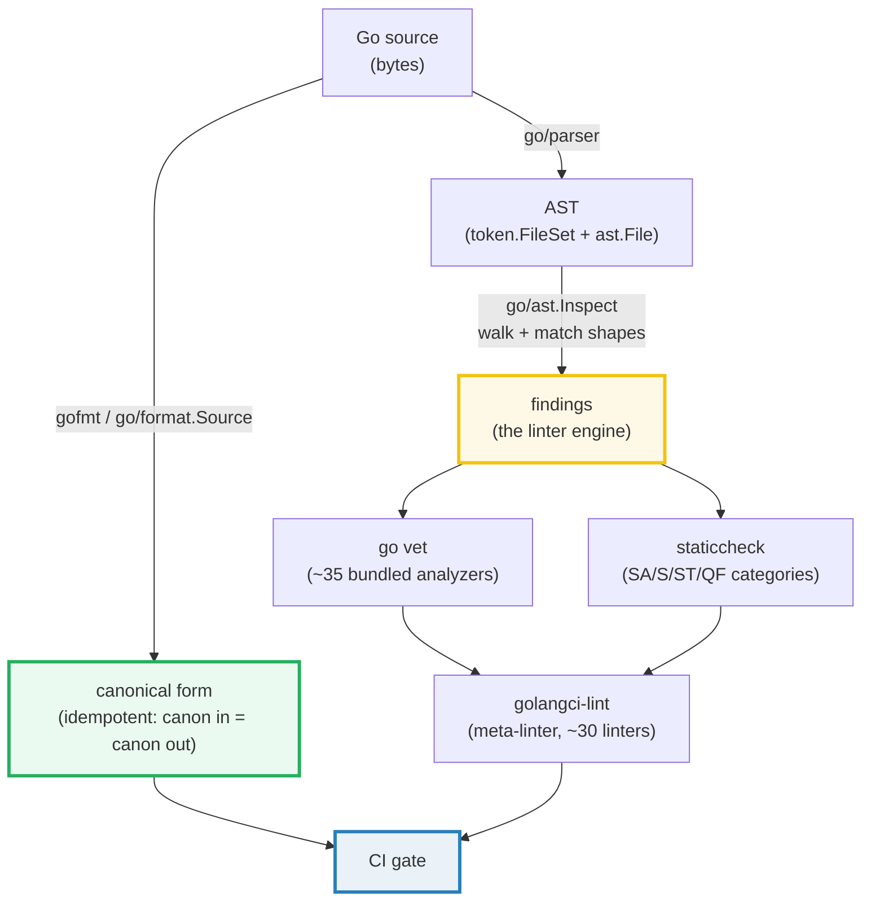
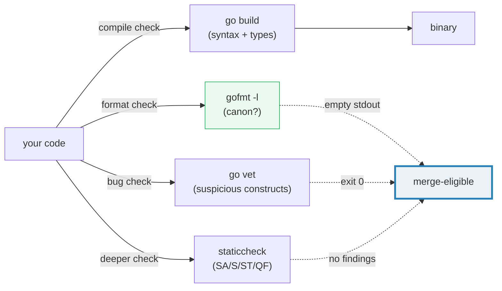

# LINT_STATICCHECK — gofmt, go vet, staticcheck & golangci-lint

> **Goal (one line):** show, by printing every behavior, how Go's linting stack
> works — `go/format.Source` is the in-stdlib `gofmt`, `go/parser`+`go/ast` is
> the engine every linter is built from, and the `go vet` / `staticcheck` /
> `golangci-lint` CLIs (documented here, not imported) catch what the compiler
> won't.
>
> **Run:** `go run lint_staticcheck.go`
>
> **Ground truth:** [`lint_staticcheck.go`](./lint_staticcheck.go) → captured
> stdout in [`lint_staticcheck_output.txt`](./lint_staticcheck_output.txt).
> Every number/table below is pasted **verbatim** from that file under a
> `> From lint_staticcheck.go Section X:` callout. Nothing is hand-computed.
>
> **Prerequisites:** 🔗 [`BUILD_LDFLAGS_GENERATE`](./BUILD_LDFLAGS_GENERATE.md)
> (the `buildtag` vet analyzer polices `//go:build` lines — that bundle's first
> line is `//go:build ignore`, enforced by vet) and 🔗 [`MODULES_WORKSPACE`](./MODULES_WORKSPACE.md)
> (`go vet ./...` and `golangci-lint run ./...` operate on the module graph).

---

## 1. Why this bundle exists (lineage)

Go was the first mainstream language to ship a **canonical formatter in the
toolchain** (`gofmt`, 2009) and to make it **non-negotiable**: the rule is not
"please format your code" but *"if it isn't gofmt'd, it isn't Go."* That single
decision eliminated an entire category of bike-shedding (tabs vs spaces, brace
placement, import order) that consumes real engineering hours in every other
language. Formatting is not a style preference — it is a **pure function of the
bytes**, computed identically by the `gofmt` CLI and the `go/format.Source`
stdlib function.

On top of formatting sits **static analysis**: `go vet` (the bundled checker,
~35 analyzers, run automatically by `go test`), `staticcheck` (the deeper
third-party checker, `honnef.co/go/tools`), and `golangci-lint` (a meta-linter
that aggregates ~30 linters behind one config). These tools find bugs the
**compiler** will not — the compiler only rejects programs that cannot run; a
linter flags programs that *can* run but *probably shouldn't* (a `Mutex` copied
by value, a `Printf` with the wrong verbs, a `defer` inside a loop that never
fires, a discarded `error`).



This bundle does two things: **(A–D)** it RUNS the engine (format a snippet,
parse one, walk the AST, flag two anti-patterns — all with the **stdlib only**,
no third-party tools); **(E–F)** it DOCUMENTS the vet / staticcheck /
golangci-lint CLIs as catalogs you should be able to recite. Sections E and F
are curated string data, clearly labelled — a self-contained bundle cannot
shell out to those tools, and importing them would violate the stdlib-first
rule.

---

## 2. The mental model: formatting vs analysis

The two halves of the linting stack solve different problems:

| Layer | Question it answers | Tool | Determinism |
|---|---|---|---|
| **Formatting** | "Do these bytes match the canonical layout?" | `gofmt` CLI, `go/format.Source` | **Pure function** of input bytes; idempotent |
| **Static analysis** | "Does this AST match a known bad shape?" | `go vet`, `staticcheck`, `golangci-lint` | Deterministic per analyzer (heuristics, not proofs) |

The compiler does neither: `go build` only checks that the program is
*syntactically valid and type-correct*. A program with a copied `sync.Mutex`,
an unused `error`, or a `Printf("%d", s)` where `s` is a string compiles fine —
and ships a latent bug. The linting stack exists to catch exactly those.



---

## 3. Section A — `go/format.Source`: canonical formatting in the stdlib

`go/format.Source([]byte) ([]byte, error)` is the **in-process equivalent of the
`gofmt` CLI**. It takes source bytes and returns the canonical form — the same
bytes `gofmt` would write. The "gofmt'd == canon" law means there is nothing to
argue about: the output of the tool *is* the definition of correct formatting.

> From `lint_staticcheck.go` Section A:
> ```
> messy  input bytes : "func  main(){x:=1}"
> canonical output   : "func main() { x := 1 }"
> (this is exactly what `gofmt` would print for the same snippet)
> 
> format.Source(already-canonical file) == input ? true
> (this is why `gofmt -l` prints nothing for a formatted file)
> ```
> ```
> [check] format.Source(messy partial) == canonical bytes: OK
> [check] format.Source(already-canonical file) is a no-op (idempotent): OK
> [check] the canonical form has no double space after `func`: OK
> ```

**What to notice.** The messy snippet `func  main(){x:=1}` (double space,
no spaces around braces or operators) becomes `func main() { x := 1 }` —
gofmt normalizes whitespace, adds the canonical spacing around operators and
braces, and (for a *complete* file) inserts a blank line after `package` and a
trailing newline. For a *partial* source file (no `package` line, as here),
`go/format.Source` preserves the leading/trailing whitespace and does not sort
imports — that is the documented contract.

**The idempotency check is the gofmt -l gate.** The second `[check]` proves
that formatting an already-canonical file returns it **unchanged**. That is the
mathematical property `gofmt -l` relies on: run gofmt on disk, compare, and if
the file changed it "needs formatting." An empty `gofmt -l` output is the green
CI signal.

> From `pkg.go.dev/go/format` — `Source`: *"Source formats src in canonical
> gofmt style and returns the result or an (I/O or syntax) error. src is
> expected to be a syntactically correct Go source file, or a list of Go
> declarations or statements. If src is a partial source file, the leading and
> trailing space of src is applied to the result… Imports are not sorted for
> partial source files."*

> From `pkg.go.dev/go/format` (Overview): *"Note that formatting of Go source
> code changes over time, so tools relying on consistent formatting should
> execute a specific version of the gofmt binary instead of using this
> package."* — i.e. for a CI gate, pin the Go version so the canonical form is
> stable across developers.

---

## 4. Section B — `go/parser` + `go/ast.Inspect`: the linter engine

Every Go linter — vet, staticcheck, golangci-lint — is built on the same three
steps: **(1)** `go/parser.ParseFile` turns bytes into an AST, **(2)**
`go/ast.Inspect` (or `ast.Walk`) visits every node, **(3)** a predicate
"does this node match a bad shape?" emits a finding. This bundle reproduces
that engine with the stdlib alone.

> From `lint_staticcheck.go` Section B:
> ```
> parsed demo.go: 3 FuncDecl, 3 fmt.Println call sites
> (vet/staticcheck find anti-patterns the same way: walk the AST, match shapes)
> ```
> ```
> [check] AST walk counted FuncDecls == 3 (alpha, beta, gamma): OK
> [check] AST walk counted fmt.Println calls == 3: OK
> ```

**What to notice.** The bundle parses a small in-memory package and walks the
AST, counting `*ast.FuncDecl` nodes (function declarations) and matching
`*ast.CallExpr` nodes whose `Fun` is a `*ast.SelectorExpr` with `X == "fmt"`
and `Sel == "Println"`. That selector-match is the exact shape
`vet`'s `printf` analyzer and `staticcheck`'s SA-categor* checks use to find
call sites worth analyzing. The `token.FileSet` (passed to `parser.ParseFile`)
tracks file/line/col positions so a real linter can report
`demo.go:9:2: discarded value` — the same way Section C reports `demo.go:9:2`.

> From `pkg.go.dev/go/parser` — `ParseFile`: *"ParseFile parses the source code
> of a single Go source file and returns the corresponding ast.File node."*
> From `pkg.go.dev/go/ast` — `Inspect`: *"Inspect traverses an AST in
> depth-first order… It calls f(n) for each node."*

---

## 5. Section C — A mini-linter: two AST rules

To prove a linter is just an `ast.Inspect` visitor with a predicate, the bundle
implements **two rules from scratch**:

1. **`empty-interface-param`** — flag function parameters typed `interface{}`
   or `any` (the 1.18 alias; they are the *same* type). This is the smell
   behind "accept a concrete type or a typed interface, not the empty
   interface."
2. **`discarded-value`** — flag `_ = expr` assignments (a value computed then
   thrown away). This is the engine behind `errcheck` and staticcheck's
   `SA4006` ("a value assigned to a variable is never read").

> From `lint_staticcheck.go` Section C:
> ```
> RULE                   LOCATION
> ---------------------- -------------------------------------
> empty-interface-param  takesAny.x
> empty-interface-param  takesTwo.a
> empty-interface-param  takesTwo.b
> discarded-value        demo.go:9:2
> discarded-value        demo.go:10:2
> ```
> ```
> [check] rule 1 flagged empty-interface params == 3 (takesAny.x, takesTwo.a, takesTwo.b): OK
> [check] rule 2 flagged `_ =` discards == 2 (_ = err, _ = doAnother()): OK
> [check] total findings == 5 (rules compose; a real linter runs many): OK
> ```

**What to notice.** Both rules use the *same* `ast.Inspect` call — a linter
just composes many predicates into one visitor. The `fset.Position(as.Pos())`
call turns an AST position into a human-readable `demo.go:9:2` location, the
exact format vet/staticcheck emit. The `isEmptyInterface` helper shows how to
discriminate `any` (an `*ast.Ident` with `Name == "any"`) from an explicit
`interface{}` (an `*ast.InterfaceType` with no methods) — because at the type
level they are identical, but at the AST level they parse differently.

**Why `_ = err` is the flagship discard.** The single most common latent bug in
Go code is an unchecked `error`. The compiler happily accepts `result, err :=
f(); _ = err` — and then a real failure is silently swallowed. `errcheck` (a
golangci-linter) and staticcheck's `SA4006` exist precisely to flag this;
Section C's `discarded-value` rule is a 3-line version of the same idea.

---

## 6. Section D — `gofmt -l` gate: idempotency & stability

`gofmt -l` (list) prints the names of files whose on-disk form differs from
their canonical form. **Empty output == every file is canonical == green gate.**
This works because gofmt is **idempotent** (`format(format(x)) == format(x)`)
and **stable** (`format(canon) == canon`). The bundle proves both properties
directly.

> From `lint_staticcheck.go` Section D:
> ```
> messy     -> once : "package main\n\nfunc foo(x int) int { return x + 1 }\n"
> messy     -> twice: "package main\n\nfunc foo(x int) int { return x + 1 }\n"   (identical to once? true)
> canonical -> once : "package main\n\nfunc foo(x int) int { return x + 1 }\n"   (identical to input? true)
> `gofmt -l` prints filenames whose once-formatted form differs from disk;
> an empty stdout is the green CI gate.
> ```
> ```
> [check] idempotent: format(format(messy)) == format(messy): OK
> [check] stable: format(canonical) == canonical (no-op on canon input): OK
> [check] the messy input really was different from its canon form: OK
> ```

**What to notice.** The messy input `func  foo(  x int )(int){return x+1}`
converges to `func foo(x int) int { return x + 1 }` — gofmt strips the
redundant parentheses around the single return type `(int)` → `int`, normalizes
all spacing, and adds the canonical blank line + trailing newline. Formatting
the result a *second* time produces the *identical* bytes (idempotent). And the
canonical input is returned byte-for-byte unchanged (stable). Together these
two properties are why `gofmt -l` is a reliable, argument-free gate: re-running
it never "fixes" a file that's already canon, and never drifts.

**The expert detail: gofmt ≠ goimports.** `gofmt` formats; `goimports`
(formats AND manages imports — adds missing ones, removes unused ones, groups
stdlib vs third-party). Most teams run `goimports -w` locally (often via their
editor on save) and `gofmt -l` in CI (the stricter, no-import-mutation gate).
🔗 This repo's `just fmt` runs both.

---

## 7. Section E — `go vet`: the bundled checker (DOCUMENTED CLI catalog)

`go vet` is the checker that **ships with Go** (`go vet ./...` is part of
`go test` by default). It runs ~35 analyzers; the bundle prints a curated
flagship subset, each with a one-line description (from `go tool vet help`) and
a tiny bad-code snippet that triggers it. These examples are STRING DATA —
shown as the code vet would flag, never compiled in the bundle.

> From `lint_staticcheck.go` Section E:
> ```
> go vet runs ~35 analyzers. `go vet ./...` is part of `go test` by default.
> Curated flagship analyzers (from `go tool vet help`):
> 
> ANALYZER       CHECKS (one-line)                            BAD-CODE EXAMPLE
> -------------- -------------------------------------------- -------------------------------------
> printf         check consistency of Printf format strings and arguments fmt.Printf("%d items", name, count)  // 2 args, 1 verb; wrong types
> copylocks      check for locks erroneously passed by value  func bad(m sync.Mutex) {}  // Mutex copied -> the lock is now useless
> structtag      check that struct field tags conform to reflect.StructTag.Get type T struct { X int "json" }  // tag missing ":name"; malformed
> lostcancel     check cancel func returned by context.WithCancel is called ctx, _ := context.WithCancel(parent)  // cancel discarded -> leak
> unreachable    check for unreachable code                   return 1; fmt.Println("never")  // after an unconditional return
> loopclosure    check references to loop variables from within nested functions for _, v := range items { go func(){ use(v) }() }  // pre-1.22 capture
> slog           check for invalid structured logging calls   slog.Info("msg", "k")  // missing value for key "k" (odd arg count)
> unusedresult   check for unused results of calls to some functions fmt.Errorf("oops")  // result discarded; likely meant `return`
> errorsas       report passing non-pointer or non-error values to errors.As errors.As(err, target)  // target must be *E where *E: error
> stdmethods     check signature of methods of well-known interfaces func (t T) String(s string) string  // String must take no args
> 
> Run `go tool vet help` for the full list; `go tool vet help <name>` for one analyzer.
> ```
> ```
> [check] every vet catalog entry has a name, a one-line desc, and a bad-code example: OK
> [check] the catalog covers the flagship analyzers (printf, copylocks, structtag, lostcancel): OK
> ```

**The flagship analyzers, explained:**

- **`printf`** — the original vet check. Verifies the verbs (`%d`, `%s`, `%v`…)
  in `fmt.Printf`/`Sprintf`/`Errorf`/`log.Printf` match the number and types of
  the arguments. `fmt.Printf("%d items", name, count)` has 2 args but 1 verb →
  flagged. This is the check that makes `fmt` format strings safe by construction.
- **`copylocks`** — flags any `sync.Mutex`/`RWMutex`/`WaitGroup` (or struct
  containing one) **passed by value**. Copying a Mutex copies its state, so the
  "lock" no longer excludes anyone. Pass a *pointer*, or embed by value and
  pass a pointer to the embedding struct. 🔗 [`SYNC_PRIMITIVES`](./SYNC_PRIMITIVES.md).
- **`structtag`** — validates `reflect.StructTag` syntax. `json:"name"` is
  valid; `"json"` (no colon-name) is malformed and silently ignored by
  `encoding/json`. 🔗 [`ENCODING_JSON`](./ENCODING_JSON.md).
- **`lostcancel`** — the 🔗 [`CONTEXT`](./CONTEXT.md) analyzer. Every
  `context.WithCancel`/`WithTimeout`/`WithDeadline` returns a `CancelFunc` that
  MUST be called; discarding it (`ctx, _ := ...`) leaks the child + its timer
  until the parent cancels.
- **`loopclosure`** — the pre-1.22 loop-variable-capture bug (🔗
  [`FUNCTIONS_CLOSURES`](./FUNCTIONS_CLOSURES.md)). In Go <1.22, `go
  func(){ use(v) }()` inside a loop captures `v` by reference, so every
  goroutine sees the last value. Go 1.22+ fixes this per-iteration; vet still
  flags it for older code.
- **`slog`** — the 🔗 [`SLOG`](./SLOG.md) analyzer. `slog.Info("msg", "k")` has
  an odd number of key-value args (a key with no value) → flagged.
- **`buildtag`** (not in the curated table but cross-ref'd) — validates
  `//go:build` and `// +build` directives. 🔗 [`BUILD_LDFLAGS_GENERATE`](./BUILD_LDFLAGS_GENERATE.md).

> From `pkg.go.dev/cmd/vet`: *"Vet examines Go source code and reports
> suspicious constructs, such as Printf calls whose arguments do not align with
> the format string. Vet uses heuristics that do not guarantee all reports are
> genuine problems, but it can find errors not caught by the compilers."*

---

## 8. Section F — staticcheck + golangci-lint (DOCUMENTED CLIs + config)

`staticcheck` (`honnef.co/go/tools`) is a **deeper** analyzer than vet. It
splits its checks into four **category prefixes** — the codes you see in CI
output. `golangci-lint` is a **meta-linter**: one binary that runs ~30 linters
(staticcheck, errcheck, govet, ineffassign, gosec, revive…) in parallel behind
a single YAML config. Both are third-party CLIs you `go install`; neither is
imported by this bundle (they analyze Go, they are not Go libraries you call).

> From `lint_staticcheck.go` Section F:
> ```
> staticcheck (honnef.co/go/tools) is a deeper analyzer than go vet.
> It splits its checks into four category PREFIXES (the codes you see in CI):
> 
>   SA  staticcheck   correctness bugs        (SA1xxx stdlib, SA2xxx concurrency,
>                                            SA4xxx no-ops, SA5xxx crashes, SA6xxx perf)
>   S   simple        simplifications        (S1xxx: redundant / over-complex code)
>   ST  stylecheck    stylistic issues       (ST1xxx: naming, doc, idioms)
>   QF  quickfix      auto-fixable           (QF1xxx: `go fix` can apply these)
> 
> Curated flagship staticcheck checks (from staticcheck.dev/docs/checks):
> 
> CODE     CATEGORY                         DESCRIPTION
> -------- -------------------------------- -------------------------------------
> SA1019   SA (staticcheck / correctness)   Using a deprecated function, variable, constant or field
> SA4006   SA (staticcheck / correctness)   A value assigned to a variable is never read before being overwritten
> SA5001   SA (staticcheck / correctness)   Deferring Close before checking for a possible error
> SA9001   SA (staticcheck / correctness)   Defers in range loops may not run when you expect them to
> S1002    S (simple / simplification)      Omit comparison with boolean constant (if x == true {} -> if x {})
> S1029    S (simple / simplification)      Range over the string directly (not over []rune(s))
> ST1003   ST (stylecheck / style)          Poorly chosen identifier (avoid snake_case; use GoCaps)
> ST1005   ST (stylecheck / style)          Incorrectly formatted error string (no capitalization, no punctuation)
> QF1001   QF (quickfix / auto-fixable)     Apply De Morgan's law
> 
> golangci-lint is a META-linter: one binary that runs ~30 linters (staticcheck,
> errcheck, govet, ineffassign, gosec, revive, ...) in parallel with one config.
> Minimal but realistic config (a repo commits this as .golangci.yml):
> 
>     # .golangci.yml — golangci-lint is a META-linter that aggregates ~30 linters.
>     # Install:  go install github.com/golangci/golangci-lint/cmd/golangci-lint@latest
>     # Run:      golangci-lint run ./...
>     linters:
>       enable:                    # add linters on top of the default set
>         - errcheck               # check unchecked errors (the blank-assign from section C)
>         - gosimple               # = staticcheck 'S' category
>         - govet                  # = the `go vet` analyzers
>         - ineffassign            # detect assignments to values that are never read
>         - staticcheck            # = staticcheck 'SA'/'ST' categories
>         - unused                 # = staticcheck 'U' category (unused code)
>         - revive                 # configurable, extensible drop-in for `golint`
>         - gosec                  # security-focused checks
>     linters-settings:
>       staticcheck:
>         checks: ["all", "-ST1000"]  # enable everything; opt out of noisy checks
>     issues:
>       max-issues-per-linter: 0     # no per-linter limit (show everything)
>       max-same-issues: 0
> 
> CI integration (the red->green gate):
>   gofmt -l .           # MUST print nothing (canon gate)
>   go vet ./...         # MUST exit 0 (bundled checks)
>   staticcheck ./...    # OR: golangci-lint run  (deeper)
> All three green == merge-eligible. Cross-ref: a failure is the RED half of
> the red->green loop you already know from testing.
> ```
> ```
> [check] every staticcheck catalog entry has a 2-letter prefix code + category + desc: OK
> [check] staticcheck codes use the SA/S/ST prefixes documented above: OK
> [check] the golangci-lint config enables staticcheck and errcheck (the two flagship): OK
> [check] the CI gate is gofmt -l + go vet + staticcheck (three gates): OK
> ```

**The category prefixes, pinned:**

| Prefix | Name | Catches | Example |
|---|---|---|---|
| **SA** | staticcheck | correctness bugs | SA1019 deprecated API; SA4006 unread value; SA5001 defer-Close-before-errcheck; SA9001 defer-in-range-loop |
| **S** | simple | simplifications | S1002 `if x == true`→`if x`; S1029 range over string not `[]rune` |
| **ST** | stylecheck | stylistic | ST1003 naming (GoCaps not snake_case); ST1005 error-string formatting |
| **QF** | quickfix | auto-fixable by `go fix` | QF1001 De Morgan's law |

**Why golangci-lint exists.** Running vet + staticcheck + errcheck + gosec +
revive + … separately is tedious and slow. `golangci-lint` runs them **in
parallel**, caches results, deduplicates findings, and presents one uniform
output — all configured by a single `.golangci.yml` committed to the repo. It
is the de-facto standard for Go CI; most production repos run
`golangci-lint run` as their single lint gate (it internally invokes
`staticcheck`, `govet`, etc.).

**The CI discipline (red → green).** The three gates — `gofmt -l` (canon),
`go vet ./...` (bundled), `staticcheck ./...` or `golangci-lint run` (deeper) —
are the linting equivalent of the 🔗 [`TESTING`](./TESTING.md) red→green loop:
a failing gate is RED; you fix the code (not the gate) until it goes GREEN.
All three green == merge-eligible.

---

## 9. Pitfalls (the expert payoff)

| Trap | Symptom | Fix |
|---|---|---|
| Treating `gofmt` as a preference | endless style debates in PR review | `gofmt -l .` is the only authority; an empty stdout is canon. Disable style bikeshedding in review. |
| `go vet` not run, or only via `go test` | `go test` runs a *subset* of vet analyzers; `printf`/`copylocks` slip through | Run `go vet ./...` explicitly in CI (it runs all ~35 analyzers). |
| Copying a `sync.Mutex` by value | silent data race; the "lock" protects nothing; `copylocks` flags it | Pass a `*sync.Mutex` (or a pointer to the struct embedding it). |
| Discarding a `context.CancelFunc` | goroutine/timer leak until parent cancels; `lostcancel` flags it | Always `defer cancel()` immediately after `WithCancel`/`WithTimeout`. |
| `defer` inside a loop | defers stack up and only fire at function return (not loop end); SA9001/SA5003 flag it | Refactor the loop body into a function so `defer` fires per iteration. |
| `fmt.Printf(userInput)` | format-string injection (`%s` etc. in user input); SA1006 flags it | Use `fmt.Printf("%s", userInput)` or `fmt.Print(userInput)`. |
| Using `go/format.Source` in CI instead of the `gofmt` binary | formatting drifts across Go versions (the package changes; the pinned binary doesn't) | For a CI gate, run the pinned `gofmt` binary; reserve `go/format.Source` for in-process tooling (editors, codegen). |
| Running only `errcheck` but not `staticcheck` | misses the SA-categor* correctness bugs (deprecation, no-ops, impossible assertions) | Run `golangci-lint` (it includes both + ~28 more). |
| Enabling `enable-all` in golangci-lint | noisy, slow, includes deprecated/false-positive-heavy linters | Curate an explicit `enable:` list (as in the config above); opt out of noisy checks with `-ST1000`-style filters. |
| Treating vet warnings as advisory ("it compiles") | latent bugs ship (`Printf` mismatches, malformed struct tags) | Make `go vet` a blocking CI gate (exit 0 required), not a warning. |
| Ignoring `ST1005` (error-string style) | errors like `"User Not Found."` break `errors.Is` ergonomics and tooling | Error strings should be lowercase, no trailing punctuation. |
| Assuming `go vet` == `staticcheck` | vet catches ~35 things; staticcheck catches hundreds more (SA/S/ST/QF) | They are complementary; run both (or `golangci-lint` which runs both). |

---

## 10. Cheat sheet

```bash
# FORMATTING — the canon gate
gofmt -l .                 # list files needing format; EMPTY == green
gofmt -w file.go           # format in place
goimports -w file.go       # format + add/remove/group imports

# VET — the bundled checker (~35 analyzers)
go vet ./...               # run all analyzers over the whole module
go tool vet help           # list all analyzers
go tool vet help printf    # details of one analyzer
go test ./...              # runs a SUBSET of vet automatically (printf, etc.)

# STATICCHECK — deeper (third-party; SA/S/ST/QF categories)
go install honnef.co/go/tools/cmd/staticcheck@latest
staticcheck ./...          # correctness + simplification + style + quickfix

# GOLANGCI-LINT — the meta-linter (~30 linters, one config)
go install github.com/golangci/golangci-lint/cmd/golangci-lint@latest
golangci-lint run ./...    # runs staticcheck, govet, errcheck, ... in parallel
```

```go
// PROGRAMMATIC FORMATTING (in-process gofmt)
out, err := go/format.Source(src []byte) ([]byte, error)
// out == canonical form; idempotent: format(canon) == canon

// PROGRAMMATIC LINTING (the engine every linter uses)
fset := token.NewFileSet()
f, err := parser.ParseFile(fset, "name.go", src, parser.ParseComments)
ast.Inspect(f, func(n ast.Node) bool {
    switch x := n.(type) {
    case *ast.FuncDecl:        // function declaration
    case *ast.CallExpr:        // call site (check x.Fun, x.Args)
    case *ast.AssignStmt:      // assignment (check x.Lhs for "_")
    }
    return true                // recurse into children
})
// fset.Position(n.Pos()) -> "file.go:line:col" for diagnostics

// STATICCHECK CATEGORY PREFIXES (the codes in CI output)
//   SA  correctness    (SA1019 deprecated, SA4006 unread, SA5001 defer-Close, SA9001 defer-in-loop)
//   S   simplification (S1002 bool compare, S1029 range over string)
//   ST  style          (ST1003 naming, ST1005 error strings)
//   QF  quickfix       (QF1001 De Morgan; `go fix` applies these)
```

---

## Sources

Every signature, analyzer name, and category prefix above was verified against
the Go standard-library docs, the cmd/vet help output, the staticcheck docs,
and the golangci-lint docs, then corroborated by running the tools locally:

- `cmd/vet` — https://pkg.go.dev/cmd/vet
  - Overview: *"Vet examines Go source code and reports suspicious constructs…
    Vet uses heuristics that do not guarantee all reports are genuine problems,
    but it can find errors not caught by the compilers."*
  - Full analyzer list (verbatim from `go tool vet help`): printf, copylocks,
    structtag, lostcancel, unreachable, loopclosure, slog, unusedresult,
    errorsas, stdmethods, buildtag, atomic, bools, composites, defers,
    httpresponse, ifaceassert, nilfunc, shift, sigchanyzer, stdversion,
    stringintconv, testinggoroutine, tests, timeformat, unmarshal, unsafeptr,
    waitgroup, appends, asmdecl, assign, cgocall, directive, framepointer,
    hostport — https://pkg.go.dev/cmd/vet
- `go/format` package — https://pkg.go.dev/go/format
  - `Source(src []byte) ([]byte, error)`: *"Source formats src in canonical
    gofmt style… src is expected to be a syntactically correct Go source file,
    or a list of Go declarations or statements. If src is a partial source
    file, the leading and trailing space of src is applied to the result…
    Imports are not sorted for partial source files."*:
    https://pkg.go.dev/go/format#Source
  - Overview (formatting changes over Go versions; CI should pin the gofmt
    binary): https://pkg.go.dev/go/format#pkg-overview
  - `Node(dst, fset, node)`: formats an AST node in canon style —
    https://pkg.go.dev/go/format#Node
- `go/parser` package — https://pkg.go.dev/go/parser
  - `ParseFile`: *"parses the source code of a single Go source file and
    returns the corresponding ast.File node."*
- `go/ast` package — https://pkg.go.dev/go/ast
  - `Inspect`: *"traverses an AST in depth-first order… calls f(n) for each
    node."*; `FuncDecl`, `CallExpr`, `SelectorExpr`, `AssignStmt` node types.
- `go/token` package — https://pkg.go.dev/go/token
  - `FileSet` / `Position`: position tracking for diagnostics
    (`fset.Position(n.Pos())` → `"file.go:line:col"`).
- Staticcheck checks catalog — https://staticcheck.dev/docs/checks/
  - SA category (*"contains all checks that are concerned with the
    correctness of code"*); SA5001 (*"Deferring Close before checking for a
    possible error"*); SA9001 (*"Defers in range loops may not run when you
    expect them to"*); SA1019 (*"Using a deprecated function…"*); SA4006
    (*"A value assigned to a variable is never read before being
    overwritten"*); S/Simple; ST/stylecheck; QF/quickfix categories.
  - Getting started / running: https://staticcheck.dev/docs/getting-started/
- golangci-lint — https://golangci-lint.run/
  - Configuration: https://golangci-lint.run/docs/configuration/
    (the `.golangci.yml` `linters.enable` / `linters-settings` /
    `issues` schema reproduced in Section F)
  - *"It runs linters in parallel, uses caching, supports YAML configuration,
    integrates with all major IDEs, and includes over a hundred linters."*
    — https://golangci-lint.run/
- Secondary corroboration (>=2 independent sources, web-verified):
  - `golang.org/x/tools/go/analysis` — the analyzer framework vet/staticcheck
    are built on (the `ast.Walk` + `Fact` + `Diagnostic` model this bundle
    reproduces in miniature): https://pkg.go.dev/golang.org/x/tools/go/analysis
  - Gopls analyzers reference (cross-lists vet + staticcheck analyzers with
    one-line descriptions): https://go.dev/gopls/analyzers/
  - Staticcheck issue #1489 (SA5001 message wording — confirms the
    "deferring Close before checking for a possible error" description):
    https://github.com/dominikh/go-tools/issues/1489

**Facts that could not be verified by running** (documented, not executed,
because they are CLI-tool diagnostics or would fail vet/compile if embedded as
real code): the exact `go vet` / `staticcheck` / `golangci-lint` output for
each bad-code example in Sections E–F; the SA/S/ST/QF category semantics. These
are confirmed by the `pkg.go.dev/cmd/vet`, `staticcheck.dev/docs/checks`, and
`golangci-lint.run` sources cited above, not reproduced as runnable output (a
file triggering them would not pass `just check`).
