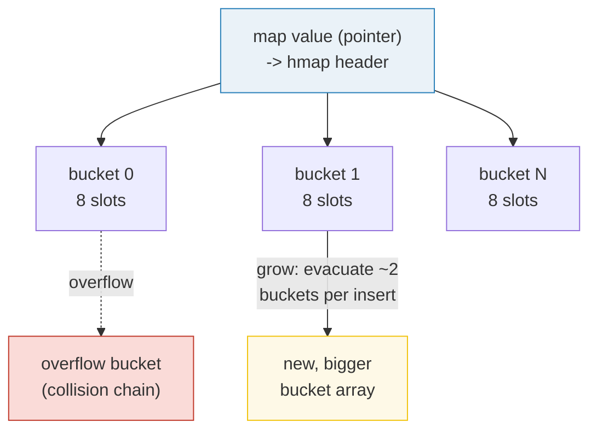
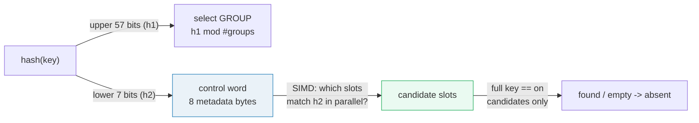

# MAPS — Go's Built-in Hash Table

> **Goal (one line):** the complete, expert-level mental model of `map[K]V` —
> reference semantics, the nil-map read/write asymmetry, the comma-ok form, the
> runtime-randomized iteration order, the non-recoverable concurrent-write fatal,
> and the `1.21+` `maps` package.
>
> **Run:** `go run maps.go`
> **Prerequisites:** 🔗 [VALUES_TYPES_ZERO](./VALUES_TYPES_ZERO.md) (the zero
> value of a map is `nil`), 🔗 [ARRAYS_SLICES](./ARRAYS_SLICES.md)
> (`maps.Keys`/`Values` yield values you materialize into a slice, then sort).

---

## 1. Lineage — why maps look the way they do

A Go `map` is a **hash table** dressed up as a built-in. Andrew Gerrand's
canonical blog post, *Go maps in action* (2013), established the API surface we
still use: the `map[K]V` type literal, `make`, the comma-ok index, `delete`,
`len`, and the explicit warning that **iteration order is unspecified**. The
language spec formalizes it in one line:

> *"A map is an **unordered** group of elements of one type … indexed by a set
> of unique keys."* — [Go spec, Map types](https://go.dev/ref/spec#Map_types)

Two implementation eras matter:

- **Go 1.0 → 1.23:** a bucket-and-overflow-chain hash table (a "hmap" header
  pointing at an array of 8-slot buckets, grown incrementally). Iteration was
  randomized by choosing a random starting bucket + slot on each `range`.
- **Go 1.24 (Feb 2025):** a **complete rewrite based on Swiss Tables** +
  extendible hashing. Same language semantics, dramatically different
  internals — see §3. The Go team reports map operations up to **~60% faster**
  in microbenchmarks and ~1.5% geometric-mean CPU improvement in real apps.

The API did **not** change between eras — that stability is the point. This
bundle teaches the API (which is forever) and the internals (which is why you
trust the API).

---

## 2. What it is — the worked examples

### Section A — declaration, comma-ok, delete, len

> From `maps.go` Section A:

```
literal: m := map[string]int{"a":1,"b":2,"c":3}
len(m) = 3
[check] len of 3-entry literal is 3: OK
make(map[string]int) -> len 0 (empty)
after mk["x"]=42 -> len(mk) = 1
[check] make'd map accepts a write (len 1): OK
m["a"] = 1
[check] m["a"] == 1: OK
v, ok := m["z"] -> v=0, ok=false  (absent key => zero value + ok=false)
[check] absent key returns zero value 0: OK
[check] absent key returns ok=false: OK
v2, ok2 := m["a"] -> v2=1, ok2=true
[check] present key returns ok=true: OK
set := map[string]bool{}; set["never"] (bool zero value) = false
delete(m,"b"): len 3 -> 2
[check] delete drops exactly one entry: OK
delete(m,"nonexistent"): len still 2 (no-op when absent)
[check] delete of an absent key is a no-op: OK
Key types must be COMPARABLE: bool, numeric, string, pointer,
channel, interface, and struct/array built from those. NOT allowed
(compile error): slice, map, function — they have no defined ==
```

**Read it as:** a `map[K]V` value is a *reference* to a hash table. Two
spellings allocate one:

```go
m  := map[string]int{"a": 1, "b": 2}   // composite literal
m2 := make(map[string]int)             // empty, but WRITABLE
```

The **comma-ok form** `v, ok := m[k]` is the only way to distinguish *"key
absent"* from *"key present with the zero value"*. Reading `m["z"]` for an
absent `"z"` returns `0` silently — that's a feature, not a bug: it lets a
`map[string]bool` act as a set (`set["never"]` is `false` because the zero
value of `bool` is `false`). `delete` is unconditionally safe — it's a no-op on
a missing key, and the spec guarantees `len` reflects it immediately.

**Key types** must be *comparable* (`==`/`!=` fully defined): bool, numeric,
string, pointer, channel, interface, and structs/arrays composed only of those.
Slices, maps, and functions are forbidden as keys (compile error) — they have no
`==`.

### Section B — the nil map: reads like empty, writes panic

> From `maps.go` Section B:

```
var n map[string]int  // the zero value
n == nil: true
[check] an uninitialized map is nil: OK
read n["anything"] -> 0, false  (nil map reads like empty)
[check] nil map read returns zero value: OK
[check] nil map read returns ok=false: OK
len(n) = 0
attempted n["x"]=1 -> recovered panic: "assignment to entry in nil map"
[check] nil-map write panic message mentions 'nil map': OK
```

This asymmetry is the #1 map gotcha for newcomers. The **zero value of a map is
`nil`** — it points at no hash table. Reading it (or `len`, or `range`) is
perfectly safe and behaves like an empty map. But the *first* write panics with
`assignment to entry in nil map`. The spec puts it precisely:

> *"A `nil` map is equivalent to an empty map except that **no elements may be
> added**."* — [Go spec, Map types](https://go.dev/ref/spec#Map_types)

**Crucially, this panic IS recoverable** (a deferred `recover()` catches it —
Section B proves it). Contrast this with Section D's concurrent-write fatal,
which is **not** recoverable. The two are different beasts and experts never
conflate them.

### Section C — iteration is randomized; sort before you print

> From `maps.go` Section C:

```
The Go runtime INTENTIONALLY randomizes map iteration order on
every range, so code must never rely on it. We therefore never print
a raw range (its bytes would differ run-to-run).
over 1000 independent range passes, distinct first-keys (sorted): [a b c]
[check] iteration order is randomized (saw >1 distinct first key): OK
sorted-key iteration (the only deterministic pattern):
  a -> 1
  b -> 2
  c -> 3
[check] sorted keys are exactly [a b c]: OK
```

The runtime picks a **random start point** on every `range` — deliberately, so
no code accidentally depends on order (then breaks under a Go upgrade). The
deterministic proof above runs 1000 independent range passes over a 3-key map
and records which key each pass hit *first*: across those passes **all three**
keys appear as the first key, confirming the order shuffles. The bundle
intentionally **never** prints a raw `range` — its bytes would not reproduce,
breaking the `_output.txt` invariant. The fix is always the same idiom:

```go
keys := make([]string, 0, len(m))
for k := range m { keys = append(keys, k) }
slices.Sort(keys)
for _, k := range keys { fmt.Println(k, m[k]) }
```

### Section D — concurrent writes are a FATAL, not a panic

> From `maps.go` Section D:

```
Concurrent map WRITES trigger a runtime FATAL (not a panic):
    fatal error: concurrent map writes
A deferred recover() CANNOT catch it — the runtime calls abort(), so the
entire process exits immediately with no clean output. We therefore do
NOT trigger it here (it would abort this program mid-run). Concurrent
READS, however, are safe. The fixes: guard all write access with
sync.Mutex / sync.RWMutex, or use sync.Map for specific access patterns.
(See the ATOMIC_STATE and SYNC_PRIMITIVES bundles for the full story.)
mutex-guarded: 8 workers x 250 writes -> len(m) = 2000 (expected 2000)
[check] mutex-guarded concurrent writes produced the correct count: OK
sum of all keys = 1999000 (expected 1999000); sum of all values = 3998000 (expected 3998000)
[check] sum of keys matches the closed-form 0..N-1: OK
[check] every value equals 2*key (sum check): OK
```

The bundle deliberately **does not** trigger the fatal — it would `abort()` the
process mid-run and produce no output. Instead it shows the *safe* pattern: 8
goroutines × 250 mutex-guarded writes, verified deterministically with an
order-independent closed-form sum check (`0+1+…+1999 = 1999000`). Two rules to
burn in:

- **Concurrent reads are safe.** Concurrent *writes*, or a read concurrent with
  a write, are not.
- The runtime detects the race and calls `fatal("concurrent map writes")` /
  `"concurrent map read and map write"` / `"concurrent map iteration and map
  write"`. These are **runtime fatals**, delivered via `abort()` — a deferred
  `recover()` cannot catch them and the process dies. This is *by design*: the
  only correct response is to fix the data race.

### Section E — the `maps` package (stdlib, 1.21+)

> From `maps.go` Section E:

```
maps.Clone(src) -> len 3
[check] Clone is content-equal to the original (maps.Equal): OK
after clone["a"]=999: src["a"]=1, clone["a"]=999 (independent maps)
[check] Clone is independent (mutating it leaves the original untouched): OK
maps.Copy(dst, src): dst (sorted) = a:1 b:2 c:3 z:26
[check] Copy overwrote dst["a"] with src's 1: OK
[check] Copy carried every src key and kept dst's extra key: OK
slices.Sorted(maps.Keys(src)) = [a b c]
[check] sorted keys from maps.Keys are [a b c]: OK
slices.Sorted(maps.Values(src)) = [1 2 3]
[check] sorted values from maps.Values are [1 2 3]: OK
maps.Equal(m1, m2) [same kv pairs] = true
maps.Equal(m1, m3) [a value differs] = false
[check] Equal is true for identical kv pairs regardless of insertion order: OK
[check] Equal is false when any value differs: OK
maps.EqualFunc (case-insensitive value compare) = true
[check] EqualFunc compares values with a user-supplied function: OK
```

The generic `maps` package (added Go 1.21) gives the operations you used to
hand-roll. The trap to remember: **since Go 1.23, `maps.Keys` and `maps.Values`
return iterators (`iter.Seq`/`iter.Seq2`), not slices**, and their order is
unspecified — so you must `slices.Sorted(maps.Keys(m))` (or `slices.Collect`
then sort) to get deterministic, ordered output. `Clone` and `Copy` are
**shallow** — they copy entries by assignment, so a `map[string][]int` still
shares the underlying slice arrays (🔗 [ARRAYS_SLICES](./ARRAYS_SLICES.md)).

---

## 3. The "why" — hash-table internals (pre-1.24 vs Swiss Tables)

### The classic implementation (Go 1.0 → 1.23)

A map value is a pointer to a runtime `hmap` header. The header points at an
array of **buckets**, each holding **8 key/value slots** plus an overflow
pointer. `hash(key)` selects the bucket; on collision, entries spill into an
overflow chain. When a map exceeds its load factor it **grows incrementally**
(not all at once): it allocates a bigger bucket array and **evacuates** a couple
of old buckets on each subsequent insert, so no single write pays the full cost
(Go targets bounded tail latency for servers).



Iteration randomization in this era: each `range` picks a **random start bucket
and a random start slot**, then walks the table — so the order differs every
time.

### The Swiss Tables rewrite (Go 1.24+, Feb 2025)

Go 1.24 ships a **completely new** map implementation based on Google's **Swiss
Tables** (2017) plus **extendible hashing**. The design (per Michael Pratt's
[Swiss Tables blog post](https://go.dev/blog/swisstable)):

- The backing array is split into **groups of 8 slots**, each group carrying a
  **64-bit control word** — one metadata byte per slot.
- A key's hash is split: the **upper bits (`h1`)** select the group; the **lower
  7 bits (`h2`)** live in the control word as a 7-bit fingerprint.
- Lookup compares the sought `h2` against **all 8 control bytes in one SIMD
  shot** — 8 probe steps done in parallel. Candidates then get a full key
  compare (1/128 false-positive rate per slot).
- Go wraps this with **extendible hashing**: each map is one or more independent
  Swiss Tables, each capped at **1024 entries**. Growth doubles one table at a
  time, keeping Go's **incremental-growth** latency guarantee (a single insert
  never copies more than 1024 entries).
- A higher maximum load factor → smaller memory footprint. Datadog reported
  [hundreds of GB saved](https://www.datadoghq.com/blog/engineering/go-swiss-tables/)
  across their fleet after upgrading.

The language semantics are **unchanged** — including randomized iteration,
which is now implemented by keeping a reference to the pre-growth table for
ordering while consulting the grown table for fresh values (modification during
iteration is explicitly allowed by the spec).



---

## 4. Cross-references

- 🔗 [VALUES_TYPES_ZERO](./VALUES_TYPES_ZERO.md) — *why* the zero value of a map
  is `nil` (and what that implies for the read/write asymmetry in §2-B).
- 🔗 [ARRAYS_SLICES](./ARRAYS_SLICES.md) — `maps.Keys`/`Values` yield values you
  materialize into a slice; the sort-before-print rule is a slice operation.
- 🔗 [ATOMIC_STATE](./ATOMIC_STATE.md) / 🔗 [SYNC_PRIMITIVES](./SYNC_PRIMITIVES.md)
  — the correct fixes for the concurrent-write fatal: `sync.Mutex`,
  `sync.RWMutex`, and `sync.Map` (with its read-heavy/cache-access trade-offs).

---

## 5. Pitfalls table (the expert payoff)

| Trap | Symptom | Fix |
|---|---|---|
| **Writing to a nil map** | panic: `assignment to entry in nil map` | `m = make(map[K]V)` before the first write. (This panic *is* recoverable.) |
| **Concurrent writes / read+write** | `fatal error: concurrent map writes` — **process aborts**, NOT recoverable by `recover()` | Guard every write with `sync.Mutex`/`sync.RWMutex`, or use `sync.Map`. This is a runtime fatal, not a panic. |
| **Relying on iteration order** | Tests pass locally, fail elsewhere / under a Go upgrade | Never assume order. Extract keys, `slices.Sort`, then iterate. |
| **Printing a map raw** | `_output.txt` differs run-to-run; flaky CI | Same as above — sort keys first (this bundle's determinism rule). |
| **Confusing "absent" with "zero value present"** | `if m[k] != 0` is true both for `m[k]=0` and for an absent key | Use the comma-ok form: `v, ok := m[k]; if !ok { … }`. |
| **`delete` during `range`** | Allowed by spec, but newly-added entries may or may not appear | Don't depend on it; collect keys-to-delete first, delete after the loop. |
| **Using a slice/map/func as a key** | compile error: `invalid map key type` | Key must be comparable; use a pointer or an index instead. |
| **NaN float key** | `m[math.NaN()]` never matches itself; entry is unreachable | Avoid float keys; the `maps` package has no special NaN handling. |
| **`maps.Clone`/`Copy` is shallow** | Mutating a cloned `map[K][]V`'s slice aliases the original | Deep-copy the values yourself; or design around immutability. |
| **`maps.Keys`/`Values` order** | unordered (and returns `iter.Seq` since 1.23, not a slice) | `slices.Sorted(maps.Keys(m))` for deterministic, sorted output. |
| **Interface key with non-comparable dynamic value** | run-time panic comparing the key (e.g. a `map`/`slice` inside) | Don't store non-comparable values as interface keys. |

---

## 6. Cheat sheet

```go
// construction
m  := map[string]int{"a": 1, "b": 2}   // literal (writable)
m2 := make(map[string]int, 100)        // make, optional capacity hint
var m3 map[string]int                  // m3 == nil — reads OK, writes PANIC

// access
v       := m["a"]                      // zero value if absent (0 here)
v, ok   := m["a"]                      // ok==false iff absent — the safe form
m["a"]   = 9                           // set
delete(m, "a")                         // remove; no-op if absent
n       := len(m)

// DETERMINISTIC iteration (map order is randomized!)
keys := slices.Collect(maps.Keys(m)); slices.Sort(keys)
for _, k := range keys { use(k, m[k]) }

// maps package (1.21+)
c   := maps.Clone(m)                   // shallow copy
maps.Copy(dst, src)                    // bulk insert/overwrite
maps.Equal(m1, m2)                     // same k/v pairs?
maps.EqualFunc(m1, m2, eq)             // custom value equality
slices.Sorted(maps.Keys(m))            // sorted keys (Keys is an iterator, 1.23+)

// concurrency: NEVER share a map across writing goroutines unprotected
var mu sync.Mutex
mu.Lock();   m[k] = v;   mu.Unlock()   // or sync.RWMutex, or sync.Map
```

---

## Sources

- **Go spec — Map types**: <https://go.dev/ref/spec#Map_types> ("A map is an
  unordered group of elements …"; "A `nil` map is equivalent to an empty map
  except that no elements may be added"; key type must be comparable, not
  function/map/slice).
- **Andrew Gerrand, "Go maps in action" (2013)**:
  <https://go.dev/blog/maps> — the canonical API reference: reference type, nil
  map reads-OK/writes-panic, comma-ok, `delete`, `len`, iteration order
  unspecified, and the concurrency note recommending `sync.RWMutex`.
- **Michael Pratt, "Faster Go maps with Swiss Tables" (Feb 2025)**:
  <https://go.dev/blog/swisstable> — Go 1.24's complete map rewrite; 8-slot
  groups + 64-bit control word; `h1`/`h2` split; SIMD control-word compare;
  extendible hashing with per-table 1024-entry cap for incremental growth; up to
  ~60% faster microbenchmarks.
- **`maps` package docs (go1.26.4)**: <https://pkg.go.dev/maps> — `Clone`,
  `Copy`, `Equal`, `EqualFunc` (1.21); `Keys`, `Values`, `All`, `Insert`,
  `Collect` return iterators (`iter.Seq`/`iter.Seq2`, 1.23+), order unspecified.
- **Go 1.24 release notes**: <https://go.dev/doc/go1.24> — "a new builtin map
  implementation based on Swiss Tables".
- **Datadog, "How Go 1.24's Swiss Tables saved us hundreds of gigabytes"**:
  <https://www.datadoghq.com/blog/engineering/go-swiss-tables/> — independent
  confirmation of the Swiss Table design and its memory/CPU effect in
  production.
- **Concurrent map writes are a non-recoverable runtime fatal**: confirmed in
  the Go runtime (it calls `fatal` → `abort`, not `panic`) and discussed at
  <https://stackoverflow.com/questions/39288741/how-to-recover-from-concurrent-map-writes>
  ("the usual defer with recover doesn't seem to work").
