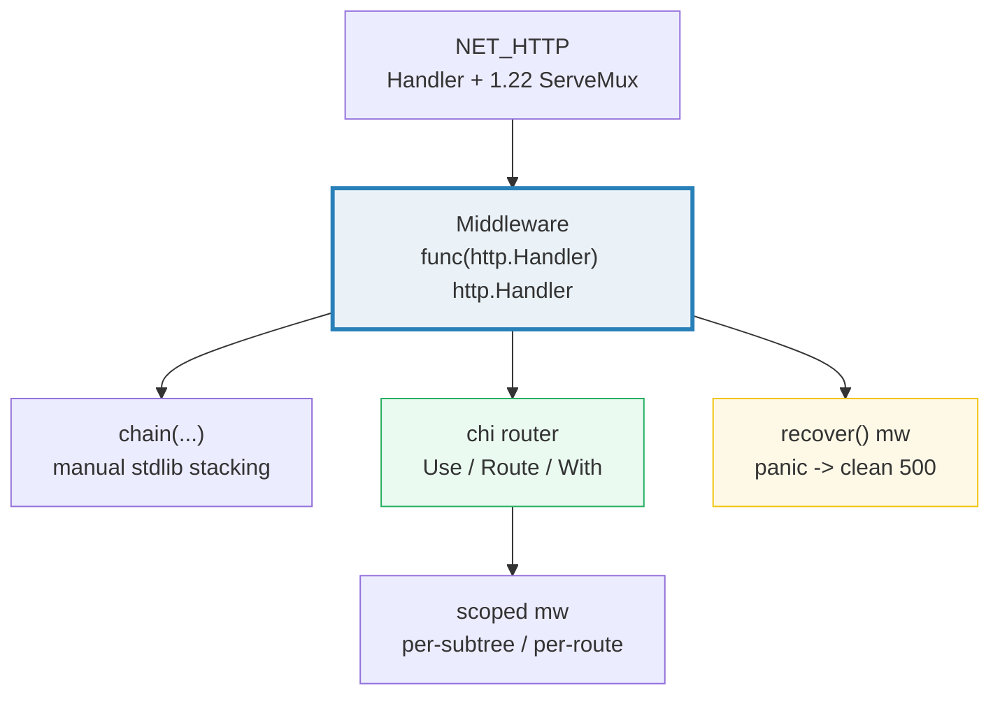
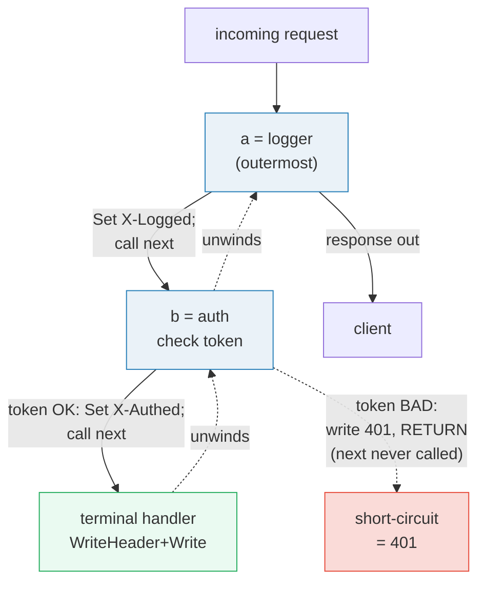
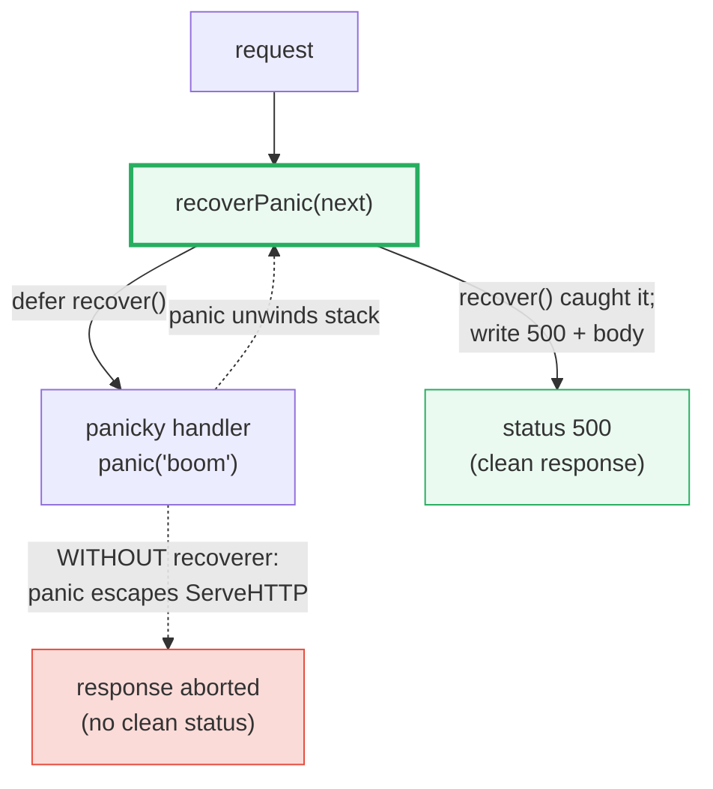
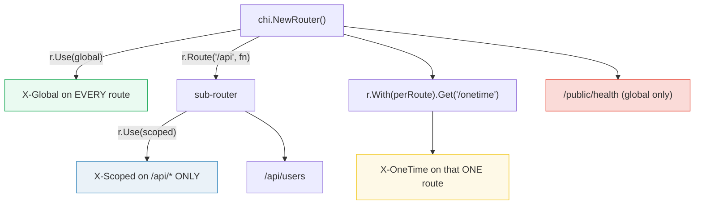

# MIDDLEWARE_ROUTING — Middleware Composition & Router Scoping (stdlib vs chi)

> **Goal (one line):** show, by exercising every form against `httptest`, how Go
> middleware is just `func(http.Handler) http.Handler` composition — hand-chained
> in the stdlib, then declared declaratively with **chi**'s `Use` / `Route` /
> `With` — and how a `recover()` middleware turns a panicking handler into a clean
> 500.
>
> **Run:** `go run middleware_routing.go`
>
> **Ground truth:** [`middleware_routing.go`](./middleware_routing.go) → captured
> stdout in [`middleware_routing_output.txt`](./middleware_routing_output.txt).
> Every status code, header, and body below is pasted **verbatim** from that file
> under a `> From middleware_routing.go Section X:` callout. Nothing is
> hand-computed.
>
> **Prerequisites:** 🔗 [`NET_HTTP`](./NET_HTTP.md) (the `Handler`/`HandlerFunc`
> interface and the 1.22 `ServeMux` this bundle builds on), 🔗
> [`INTERFACES_BASICS`](./INTERFACES_BASICS.md) (`Handler` *is* a one-method
> interface; middleware returns a value satisfying it), and 🔗
> [`CONTEXT`](./CONTEXT.md) (request-scoped values flow through `r.Context()`
> across the chain). 🔗 [`EMBEDDING_COMPOSITION`](./EMBEDDING_COMPOSITION.md)
> (middleware is decoration of `Handler`) and 🔗
> [`AUTH_SESSIONS_JWT`](./AUTH_SESSIONS_JWT.md) (real auth middleware) are the
> production follow-ups.

---

## 1. Why this bundle exists (lineage)

`NET_HTTP` showed that a handler is an `http.Handler` and that the 1.22 `ServeMux`
matches method+path. The moment you have more than one route you need
**cross-cutting concerns** that apply to *many* handlers without being copy-pasted
into each: logging, auth, request IDs, panic recovery, CORS, rate limiting. That
is what **middleware** is for, and in Go it is *astonishingly* small:

```go
func logger(next http.Handler) http.Handler {
    return http.HandlerFunc(func(w http.ResponseWriter, r *http.Request) {
        /* before */ ; next.ServeHTTP(w, r) ; /* after */
    })
}
```

There is **no special type**. A middleware is any `func(http.Handler) http.Handler`:
it takes the "next" handler and returns a wrapped one. Because `http.HandlerFunc`
*is* an `http.Handler` (🔗 `INTERFACES_BASICS`), the return value slots straight
into another middleware or a mux. This single function signature is the **entire**
mechanism behind every Go web framework's middleware chain — and since 1.22 the
stdlib is good enough that you often do not need a framework at all.



This bundle then **contrasts** the two ways to organize that primitive:

- **stdlib** — you stack middlewares by hand: `logger(auth(h))`, or via a tiny
  `chain(...)` helper. The 1.22 `ServeMux` has **no** notion of "apply this
  middleware only to `/admin`," so scoped middleware is manual per-route wrapping.
- **chi** — a third-party router (already in `go.mod`) whose `Router` *is* an
  `http.Handler` and adds **declarative scoping**: `r.Use(...)` (global),
  `r.Route("/api", ...)` (subtree), `r.With(...).Get(...)` (per-route).

> From `pkg.go.dev/github.com/go-chi/chi/v5` (Overview, verbatim): *"`chi` is a
> lightweight, idiomatic and composable router for building HTTP services… 100%
> compatible with net/http — use any http or middleware pkg in the ecosystem that
> is also compatible with `net/http`."* And: *"chi's middlewares are just stdlib
> net/http middleware handlers. There is nothing special about them."* So chi does
> not reinvent middleware — it gives you a way to *scope* the same primitive.

---

## 2. The mental model: middleware as onion layers

A request flows **in** through the outermost middleware, reaches the terminal
handler, and the response unwinds **back out**. Each layer may act before
`next.ServeHTTP`, after it, or **not call next at all** (short-circuit). Stacking
`chain(a, b)(h)` produces `a(b(h))`: the first middleware is outermost.



**Why "before vs after next" matters for headers.** The `ResponseWriter`'s header
map is **frozen** the moment the status line is flushed (🔗 `NET_HTTP`). So a
middleware that wants to *set* a response header must do so **before** calling
`next.ServeHTTP(w, r)`; a middleware that wants to *read* the status code or body
must wrap `w` and do it **after** (or use a custom `ResponseWriter` that captures
`WriteHeader`). This bundle's `stdLogger` sets `X-Logged` *before* `next` — that is
why it survives to the client.

---

## 3. Section A — Stdlib middleware chain: logger + auth

> From `middleware_routing.go` Section A:
> ```
> valid token -> status 200, X-Logged="yes", X-Authed="yes", body="from inner handler"
> bad token   -> status 401, X-Logged="yes", X-Authed="", body="unauthorized\n"
> ```
> ```
> [check] valid token: status == 200: OK
> [check] valid token: X-Logged == "yes": OK
> [check] valid token: X-Authed == "yes": OK
> [check] bad token: status == 401 (auth short-circuited): OK
> [check] bad token: logger still ran (X-Logged set): OK
> [check] bad token: auth did NOT set X-Authed (next skipped): OK
> ```

**What.** `chain(stdLogger, stdAuth)(final)` builds `stdLogger(stdAuth(final))`.
Two requests are run through `httptest.NewRecorder` (no socket):

1. **Valid token** → the chain runs to completion: logger sets `X-Logged`, auth
   passes and sets `X-Authed`, the terminal handler writes `200` + body. Both
   headers are present.
2. **Bad token** → logger still sets `X-Logged` (it ran first, outermost), but
   auth **short-circuits**: it writes `401` and `return`s *without calling `next`*.
   So `X-Authed` is **absent** and the terminal handler never ran. This is the
   defining power of middleware — any layer can abort the whole chain.

**Why the `chain` helper folds right-to-left.**

```go
func chain(mw ...func(http.Handler) http.Handler) func(http.Handler) http.Handler {
    return func(h http.Handler) http.Handler {
        for i := len(mw) - 1; i >= 0; i-- { h = mw[i](h) }
        return h
    }
}
```

Folding from the **last** middleware inward means `chain(a, b)(h)` first wraps `h`
in `b`, then wraps *that* in `a` → `a(b(h))`. So `a` is outermost and runs first on
the way in. This is the same semantics as writing `logger(auth(h))` by hand, just
reusable. (Equivalent to `alice.New` / the `slices.Backward`-based `chain` shown by
Alex Edwards — see Sources.)

**Why a bare `func` is not a `Handler` (the adapter, again).** `final` is a plain
`func(ResponseWriter, *Request)`. It has no `ServeHTTP` method, so it is **not** an
`http.Handler` until `http.HandlerFunc(final)` adapts it (🔗 `NET_HTTP` §2, 🔗
`INTERFACES_BASICS`). Every middleware returns `http.HandlerFunc(...)` precisely so
its return value satisfies `http.Handler` and chains further.

---

## 4. Section B — A 1.22 `ServeMux` *through* middleware (PathValue survives)

> From `middleware_routing.go` Section B:
> ```
> GET /users/7 via logger(mux) -> status 200, X-Logged="yes", body="user id=7"
> ```
> ```
> [check] GET /users/{id} -> status 200: OK
> [check] middleware set X-Logged on a mux-wrapping response: OK
> [check] PathValue "7" reached the handler through the middleware: OK
> ```

**What.** The classic "outer middleware" pattern: wrap the *entire mux* once —
`stdLogger(mux)` — and every route the mux serves gets the middleware for free.
A `GET /users/7` is matched by the 1.22 pattern `"GET /users/{id}"`, the handler
reads `r.PathValue("id")` → `"7"`, and the logger's `X-Logged` header rides along.

**The key invariant:** wrapping a mux in middleware does **not** disturb routing or
`PathValue`. The middleware calls `next.ServeHTTP(w, r)` with the **same `r`** (it
does not need to touch it); the mux then does its own method+pattern matching and
populates `PathValue` exactly as if the middleware were not there. The request
passes *through* middleware as an opaque value — which is why you can layer
logging/auth/recovery around any `http.Handler`, including a whole mux.

> From `go.dev/blog/routing-enhancements` (Jonathan Amsterdam): the 1.22 patterns
> let you *"express common routes as patterns instead of Go code… write
> `http.HandleFunc("GET /posts/{id}", handlePost)`,"* with the id read via
> *"the new `PathValue` method on `Request`."* Section B proves that machinery is
> indifferent to being wrapped — see 🔗 `NET_HTTP` for the full pattern story.

---

## 5. Section C — Panic-recovery middleware: panic → clean 500



> From `middleware_routing.go` Section C:
> ```
> no recoverer  -> panic propagated? true, status 200 (default; response aborted), body=""
> with recoverer -> status 500, body="internal server error\n"
> ```
> ```
> [check] without recoverer: panic propagated out of ServeHTTP: OK
> [check] without recoverer: no status written (default 200, empty body): OK
> [check] with recoverer: status == 500: OK
> [check] with recoverer: body == "internal server error": OK
> ```

**What.** A `panicky` handler calls `panic("boom from handler")`. Two runs contrast
the outcome:

1. **Without** `recoverPanic`: the panic escapes `ServeHTTP`. Here it is caught by a
   *local* `defer/recover` (only so the bundle survives to print the contrast). The
   recorder keeps its default `200` and an empty body — **nothing was written**, the
   response is effectively "aborted."
2. **With** `recoverPanic(panicky)`: the `defer func(){ recover() }()` catches the
   panic and `http.Error` writes a clean `500` + body. The process never crashes.

**The expert detail — what a *real* `http.Server` does without recovery middleware.**
This is the part most tutorials get wrong. A panic in a handler does **not** crash
the Go process even without your own `recover()`, because `net/http`'s connection
goroutine already has a built-in recover. But that built-in recover does **not**
send a clean status — it **aborts the response**:

> From `pkg.go.dev/net/http` (the `Handler` / `ServeMux` docs, verbatim): *"any
> panic from ServeHTTP aborts the response to the client."* And from the proposal
> `golang/go#16542` ("allow net/http server to fail on panic instead of
> recovering"): the server's current behavior *is* to recover every handler panic,
> log a stack trace, and close the connection — leaving the client with a broken
> connection, **not** a `500`.

So the value of a `recover()` middleware is **not** "keep the process alive" (the
server already does that) — it is **"turn an aborted connection into a real 500
response, and centralize your panic logging."** That is exactly what chi's bundled
`middleware.Recoverer` does ("Gracefully absorb panics and prints the stack
trace"). The bundle's `recoverPanic` is the same mechanism, written by hand to make
the `defer/recover` visible.

**Why the `recover` must be `defer`d and guard a started response.** `recover()`
only works inside the deferred function of the panicking goroutine; it cannot catch
a panic from another goroutine. And if the handler already flushed the status line
before panicking, calling `WriteHeader(500)` afterward is a no-op (and logs
`superfluous response.WriteHeader call`). Production recoverers wrap `w` to detect
whether the headers were already sent before writing a 500 (see pitfalls).

---

## 6. Section D — chi `r.Use`: global middleware on every route

> From `middleware_routing.go` Section D:
> ```
> GET /a -> status 200, X-Global="yes", body="a"
> GET /b -> status 200, X-Global="yes", body="b"
> ```
> ```
> [check] chi.Router is an http.Handler (served by NewServer): OK
> [check] chi Use: X-Global set on /a: OK
> [check] chi Use: X-Global set on /b: OK
> [check] /a body == "a": OK
> [check] /b body == "b": OK
> ```

**What.** `chi.NewRouter()` returns a `chi.Router`, which **embeds `http.Handler`**
— so `httptest.NewServer(r)` accepts it directly, no adapter. `r.Use(mw...)`
appends middlewares to the router's stack; they run on **every** matched route.
Here both `/a` and `/b` get `X-Global`, because the global middleware wraps the
whole router. This is the chi equivalent of `stdLogger(mux)` from Section B, but
expressed declaratively.

> From `pkg.go.dev/github.com/go-chi/chi/v5` (the `Router` interface, verbatim):
> *"`Use` appends one or more middlewares onto the Router stack."* And the
> signature is exactly the stdlib one: `Use(middlewares ...func(http.Handler)
> http.Handler)`. The same `stdLogger` you wrote for the stdlib would pass straight
> into `r.Use(stdLogger)` — chi does not ask for a different type.

---

## 7. Section E — chi `Route` / `With`: scoped vs per-route middleware

This is where chi earns its keep. The stdlib `ServeMux` has **no** concept of "this
middleware applies only under `/api`." chi gives you three scopes, demonstrated on
one router:



> From `middleware_routing.go` Section E:
> ```
> GET /api/users     -> status 200, X-Global="yes" X-Scoped="yes" X-OneTime="", body="api users"
> GET /onetime       -> status 200, X-Global="yes" X-Scoped="" X-OneTime="yes", body="one time"
> GET /public/health -> status 200, X-Global="yes" X-Scoped="" X-OneTime="", body="public ok"
> ```
> ```
> [check] /api/users: status 200: OK
> [check] /api/users: has X-Global (inherited): OK
> [check] /api/users: has X-Scoped (route-scoped mw): OK
> [check] /onetime: status 200: OK
> [check] /onetime: has X-OneTime (per-route mw via With): OK
> [check] /public/health: status 200: OK
> [check] /public/health: has X-Global: OK
> [check] /public/health: does NOT have X-Scoped (mw did not leak): OK
> [check] /public/health: does NOT have X-OneTime: OK
> ```

**What.** Three routes, three different middleware footprints:

- `/api/users` → `X-Global` **and** `X-Scoped` (the global stack *plus* the
  `/api` sub-router's own stack, which it **inherits**).
- `/onetime` → `X-Global` **and** `X-OneTime` (the global stack plus a single
  middleware attached to just this endpoint via `r.With(...).Get(...)`).
- `/public/health` → `X-Global` **only**. The check asserts `X-Scoped == ""` and
  `X-OneTime == ""`: the scoped middleware did **not leak** outside its subtree.

**The `Route` vs `Group` distinction (the expert payoff).** These two are easy to
confuse; the difference is whether a **path prefix** is attached:

| chi call | Adds a path prefix? | Middleware scope |
|---|---|---|
| `r.Route("/api", fn)` | **Yes** — mounts a sub-router at `/api` | `fn`'s `r.Use` applies to `/api/*` |
| `r.Group(fn)` | **No** — "along the current routing path" | `fn`'s `r.Use` applies to whatever routes `fn` registers, at their existing paths |

> From `pkg.go.dev/github.com/go-chi/chi/v5` (the `Router` interface, verbatim):
> *"`Group` adds a new inline-Router along the current routing path, with a fresh
> middleware stack for the inline-Router."* Versus *"`Route` mounts a sub-Router
> along a `pattern` string."* So `Group` is "scoped middleware, same paths";
> `Route` is "scoped middleware **+** a path prefix." Use `Group` when several
> routes share middleware but live at the top level; use `Route` for the classic
> `/api/v1/...` sub-tree.

And `With` is the one-off: `r.With(mw).Get("/x", h)` attaches `mw` to **only** that
single endpoint, without affecting any other route.

---

## 8. Section F — Stdlib manual chaining vs chi declarative groups

> From `middleware_routing.go` Section F:
> ```
> stdlib /admin  -> status 200, X-Logged="yes" X-Authed="yes", body="admin area"
> chi    /admin  -> status 200, X-Logged="yes" X-Authed="yes", body="admin area"
> stdlib /public -> status 200, X-Logged="yes" X-Authed="", body="public area"
> chi    /public -> status 200, X-Logged="yes" X-Authed="", body="public area"
> ```
> ```
> [check] stdlib /admin: status 200 (auth passed): OK
> [check] chi    /admin: status 200 (auth passed): OK
> [check] stdlib /admin: X-Logged + X-Authed both set: OK
> [check] chi    /admin: X-Logged + X-Authed both set: OK
> [check] both /admin: identical body: OK
> [check] both /public: status 200: OK
> [check] both /public: X-Logged set, X-Authed absent: OK
> [check] both /public: identical body: OK
> ```

**What.** The identical requirement — "every request is logged; `/admin` requires
auth; `/public` does not" — implemented twice and run through `httptest.NewRecorder`:

- **stdlib**: because `ServeMux` cannot scope middleware, you wrap each handler by
  hand — `stdLogger(stdAuth(adminH))` for `/admin`, bare `stdLogger(publicH)` for
  `/public` — then `mux.Handle(pattern, wrappedHandler)`.
- **chi**: declarative — one `r.Use(stdLogger)` (global) plus
  `r.Route("/admin", func(r){ r.Use(stdAuth); r.Get("/", h) })` (scoped).

Both produce **byte-identical** responses: `/admin` gets `X-Logged`+`X-Authed`;
`/public` gets only `X-Logged`. The checks assert the two implementations agree on
status, headers, and body. This is the bundle's thesis in one table: **chi is
declarative sugar over the same `func(http.Handler) http.Handler` primitive** — it
does not change semantics, it changes *ergonomics and scoping*.

**When to reach for which.** For a handful of routes the stdlib + a `chain` helper
is enough (zero dependencies, 🔗 `NET_HTTP`). Once you have many routes with
overlapping middleware sets — "these need auth, those need admin, all need logging"
— the per-route wrapping becomes repetitive and error-prone (easy to forget one
route's auth wrapper). That repetition is exactly what chi's `Route`/`Group`
eliminate, and it is why the stdlib got method+path matching in 1.22 but
deliberately left **scoped middleware** to libraries.

---

## 9. Pitfalls (the expert payoff)

| Trap | Symptom | Fix |
|---|---|---|
| Setting a response header **after** `next.ServeHTTP` | Header silently dropped (the map froze when the status line flushed) | Set headers **before** calling `next`; wrap `w` if you must mutate after. |
| A middleware that **forgets to call `next`** (except when short-circuiting on purpose) | The terminal handler never runs; client gets the middleware's response or an empty 200 | Always end with `next.ServeHTTP(w, r)` unless you intentionally abort (auth fail, etc.). |
| Thinking a handler panic **crashes the process** | Misled: `net/http` already recovers it — but it **aborts the response** (client sees a broken connection, not a 500) | Add a `recover()` middleware to convert the abort into a clean 500 + central logging. |
| Calling `WriteHeader(500)` in `recover` after the handler already flushed headers | `http: superfluous response.WriteHeader call` logged; 500 never sent | Wrap `w` to track whether status was sent; only write the 500 if not started. |
| `recover()` in a different goroutine than the panic | Recovers nothing — `recover` only catches panics in the **same** goroutine | Keep the deferred recover in the request's own goroutine; never `go` the handler. |
| Mixing up chi `Route` (adds prefix) vs `Group` (no prefix) | Middleware scoped to the wrong paths, or routes mounted at unexpected paths | `Route("/api", fn)` = prefix + scoped mw; `Group(fn)` = scoped mw, same paths. |
| Expecting stdlib `ServeMux` to scope middleware | No effect — the 1.22 mux has **no** per-subtree middleware | Wrap handlers manually (`chain`), or use chi/stdlib-mux-wrapper (see Sources). |
| Forgetting `http.HandlerFunc(f)` around a plain `func` | `cannot use f as http.Handler` — a bare func has no `ServeHTTP` method | Wrap it, or return `http.HandlerFunc(...)` from the middleware. |
| Reusing an `*http.Request` across middleware that calls `r.WithContext` | Stale context; the next layer ignores values set via `r.WithContext` | Propagate the returned request: `next.ServeHTTP(w, r.WithContext(ctx))` (🔗 `CONTEXT`). |
| Putting chi's `middleware.Recoverer` (or any logger) **inside** a `Route` when you meant it global | Recovery/logging only on that sub-tree; panics elsewhere still abort | Put cross-cutting mw on the top-level `r.Use(...)`, before any `Route`/`Group`. |
| Assuming `r.With(...)` mutates the router | It does not — `With` returns a **new** inline router for that one chain | Capture the return: `r.With(mw).Get(...)`; never `r.With(mw)` alone expecting a side effect. |

---

## 10. Cheat sheet

```go
// A middleware is just func(http.Handler) http.Handler — NO special type.
func logger(next http.Handler) http.Handler {
    return http.HandlerFunc(func(w http.ResponseWriter, r *http.Request) {
        w.Header().Set("X-Logged", "yes") // BEFORE next (headers freeze on flush)
        next.ServeHTTP(w, r)              // call next; or `return` to short-circuit
    })
}

// Stdlib chain: chain(a, b)(h) == a(b(h)); a is outermost (runs first in).
func chain(mw ...func(http.Handler) http.Handler) func(http.Handler) http.Handler {
    return func(h http.Handler) http.Handler {
        for i := len(mw) - 1; i >= 0; i-- { h = mw[i](h) }
        return h
    }
}
wrapped := chain(logger, auth)(final)            // == logger(auth(final))
mux.Handle("GET /x", chain(logger, auth)(hF))    // stdlib: wrap EACH route by hand

// Panic recovery: defer/recover -> clean 500 (the server already recovers, but
// only to ABORT the response; this turns the abort into a real status).
func recoverPanic(next http.Handler) http.Handler {
    return http.HandlerFunc(func(w http.ResponseWriter, r *http.Request) {
        defer func() {
            if rec := recover(); rec != nil {
                http.Error(w, "internal server error", http.StatusInternalServerError)
            }
        }()
        next.ServeHTTP(w, r)
    })
}

// --- chi: declarative scoping (Router IS an http.Handler) ---
r := chi.NewRouter()
r.Use(logger)                                    // GLOBAL: every route
r.Route("/api", func(r chi.Router) {             // ROUTE: prefix + scoped mw
    r.Use(auth)                                  //   -> /api/* only
    r.Get("/users", h)                           //   chi.URLParam(r, "id") for params
})
r.Group(func(r chi.Router) {                     // GROUP: scoped mw, NO prefix
    r.Use(extra)                                 //   -> routes registered here, at their paths
})
r.With(onetimeMw).Get("/special", h)             // WITH: one endpoint only

// httptest — in-process, NO real network, deterministic
rec := httptest.NewRecorder()                    // no socket: h.ServeHTTP(rec, req); read rec.Code/Header/Body
srv := httptest.NewServer(r); defer srv.Close()   // loopback socket; NEVER print srv.URL (random port)
```

---

## Sources

Every signature, behavioral claim, and chi API above was verified against the Go
standard-library docs, the Go blog, the chi package docs, and corroborated by
independent secondary sources:

- `net/http` package — https://pkg.go.dev/net/http
  - `Handler` interface / `HandlerFunc` adapter ("allows the use of ordinary
    functions as HTTP handlers… HandlerFunc(f) is a Handler that calls f"):
    https://pkg.go.dev/net/http#Handler
  - The panic-abort contract, verbatim: *"any panic from ServeHTTP aborts the
    response to the client"* (and `ErrAbortHandler` suppresses the stack-trace
    log): https://pkg.go.dev/net/http#ServeMux
  - `Request.PathValue` (1.22 wildcard accessor):
    https://pkg.go.dev/net/http#Request.PathValue
- Go Blog — Jonathan Amsterdam, *"Routing Enhancements for Go 1.22"* (method
  matching, `{wildcard}`, `PathValue`, the `405`+`Allow` behavior):
  https://go.dev/blog/routing-enhancements
- `net/http/httptest` — `NewRecorder` / `NewServer` (in-process, no real network):
  https://pkg.go.dev/net/http/httptest
- `github.com/go-chi/chi/v5` package — https://pkg.go.dev/github.com/go-chi/chi/v5
  - Overview: *"100% compatible with net/http"* and *"chi's middlewares are just
    stdlib net/http middleware handlers. There is nothing special about them."*
  - The `Router` interface, verbatim signatures: `Use(middlewares ...func(http.Handler)
    http.Handler)`, `With(...) Router`, `Group(fn func(r Router)) Router` ("adds a
    new inline-Router along the current routing path, with a fresh middleware
    stack"), `Route(pattern string, fn func(r Router)) Router` ("mounts a
    sub-Router along a `pattern` string"), `Mount(pattern string, h http.Handler)`:
    https://pkg.go.dev/github.com/go-chi/chi/v5#pkg-overview
  - `chi.URLParam(r, "name")` for route params; the REST preview showing
    `r.Route("/articles", ...)` + `r.With(paginate).Get(...)` nesting.
  - chi `middleware.Recoverer` ("Gracefully absorb panics and prints the stack
    trace") and the core middleware table:
    https://pkg.go.dev/github.com/go-chi/chi/v5/middleware
- Secondary corroboration (>=2 independent sources, web-verified):
  - Alex Edwards — *"Organize Your Go Middleware Without Dependencies"* (the
    `slices.Backward`-based `chain` type; stdlib lacks scoped mw; chi `Group`/
    `Route` for nested per-group middleware; alice-equivalent):
    https://www.alexedwards.net/blog/organize-your-go-middleware-without-dependencies
  - golang/go proposal #16542 — *"allow net/http server to fail on panic instead
    of recovering"* (documents that `net/http` currently **recovers** every
    handler panic by default, logging a trace and closing the connection):
    https://github.com/golang/go/issues/16542
  - Vishnu Bharathi — *"Exploring Middlewares in Go"* (`func(http.Handler)
    http.Handler`; `HandlerFunc` adapter requirement):
    https://vishnubharathi.codes/blog/exploring-middlewares-in-go/
  - Jones Charles (dev.to) — *"Go HTTP Middleware: Build Better APIs"* (wraps an
    `http.Handler` to run before/after `next`; `http.HandlerFunc` composition):
    https://dev.to/jones_charles_ad50858dbc0/go-http-middleware-build-better-apis-with-these-patterns-2nl2

**Facts verified by running** (`just check middleware_routing`): the stdlib
`chain(logger, auth)` happy path (200 + `X-Logged` + `X-Authed`) and short-circuit
(401, `X-Logged` present / `X-Authed` absent); `PathValue` surviving a mux-wrapping
middleware; the panic propagating without a recoverer vs. a clean 500 with one;
chi `Use` setting `X-Global` on every route; chi `Route`/`With` scoping
(`X-Scoped` on `/api/*` only, `X-OneTime` on one route only, neither on
`/public`); and the byte-identical stdlib-vs-chi head-to-head. Two
`just out middleware_routing` runs are byte-identical (only status codes / headers
/ bodies are printed — never the random server port).

**Facts that could not be verified by running** (documented, not executed): the
precise behavior of `net/http`'s built-in panic recovery on a *real* `http.Server`
(this bundle uses `httptest`, where a direct `ServeHTTP` call propagates the panic
to the caller instead); and chi's `middleware.Recoverer` printing a stack trace
(the bundle hand-rolls `recoverPanic` to make `defer/recover` visible, and does not
print traces to keep output deterministic). Both are confirmed by the
`pkg.go.dev/net/http` "any panic aborts the response" doc, the golang/go#16542
proposal, and the chi `middleware.Recoverer` description cited above.
