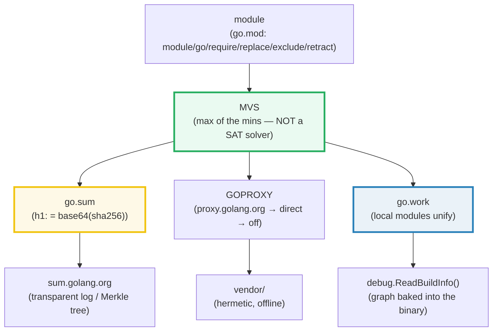
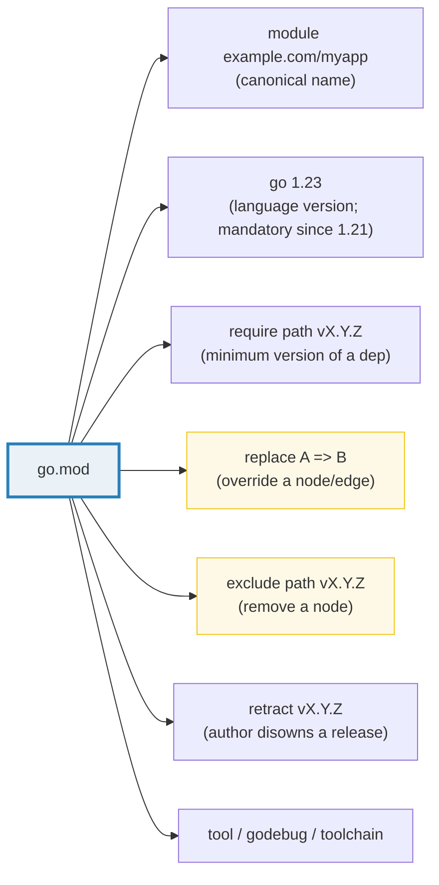
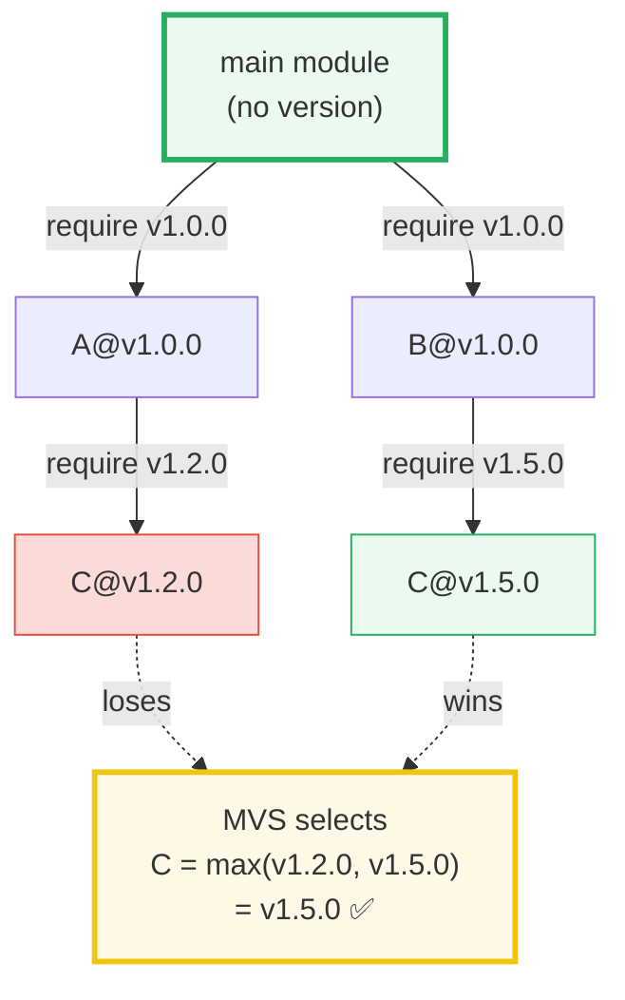
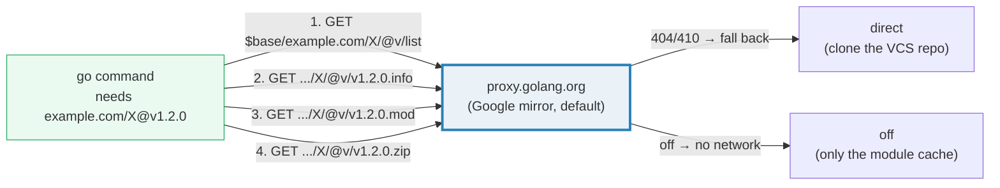
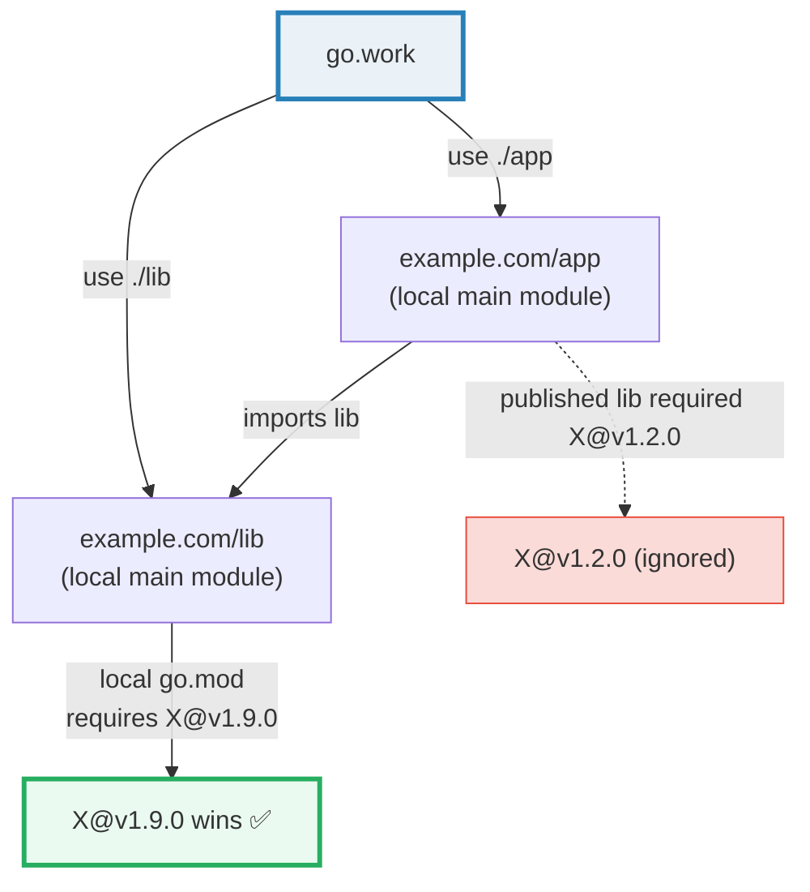

# MODULES_WORKSPACE — Modules, MVS, go.sum, Proxy, Vendoring & Workspaces

> **Goal (one line):** show, by *simulating the toolchain in Go itself*, how a
> Go **module** is versioned, how **Minimal Version Selection (MVS)** picks one
> version per dependency, how **`go.sum`** guarantees supply-chain integrity, how
> the **module proxy** and **vendoring** deliver code, how **workspaces** unify
> local modules, and how `runtime/debug.ReadBuildInfo()` exposes it all at
> runtime.
>
> **Run:** `go run modules_workspace.go`
>
> **Ground truth:** [`modules_workspace.go`](./modules_workspace.go) → captured
> stdout in [`modules_workspace_output.txt`](./modules_workspace_output.txt).
> Every version, hash, and build list below is pasted **verbatim** from that file
> under a `> From modules_workspace.go Section X:` callout. Nothing is
> hand-computed — MVS is *implemented* in the `.go`, not described.
>
> **Prerequisites:** 🔗 [`VALUES_TYPES_ZERO`](./VALUES_TYPES_ZERO.md) (you must
> understand Go's type system & maps) and 🔗 [`STRINGS_RUNES_BYTES`](./STRINGS_RUNES_BYTES.md)
> (the tiny `go.mod` parser is line/string oriented). Basic familiarity with
> `go.mod` from any real project is assumed.

---

## 1. Why this bundle exists (lineage)

Before Go 1.11 (2018) there were **no modules**. Dependencies lived in `GOPATH`,
versions were a free-for-all (`dep`, `glide`, `godep` all competed), and
"works on my machine" was the norm. Modules fixed this with one radical bet:
**the dependency resolver is not a SAT solver.** Cargo, npm, pip, and Maven all
run constraint-satisfaction search — backtracking, conflict resolution,
"non-reproducible because the solver found a different answer today." Go refused.
Russ Cox's **Minimal Version Selection (MVS)** is a *single, deterministic,
exhaustion-free* graph walk: for every module, pick the **highest version any
module in the build asks for**. No search, no backtracking, no surprises.

That single design decision is why `go build` is reproducible years later and
why Go's dependency story feels calm compared to every other ecosystem. This
bundle exists to make MVS **legible**: the `.go` *implements* it on a small
graph so you can watch the "max of the minimums" happen, watch a "bumpy
upgrade" cascade, and watch a `replace`/workspace override it.



---

## 2. The mental model: module, version, directive

A **module** is "a collection of packages that are released, versioned, and
distributed together" (go.dev/ref/mod). It is identified by a **module path**
(e.g. `example.com/myapp`) declared by exactly one `module` directive in a
UTF-8 `go.mod` at the module root. A **version** is a semantic version
`vX.Y.Z` — an immutable snapshot. Every package's import path is the module
path joined with its subdirectory.



The keywords allowed in a `go.mod` are exactly: `module`, `go`, `toolchain`,
`require`, `replace`, `exclude`, `retract`, `tool`, `godebug`, `ignore`. The
two you reach for under pressure are the **escape hatches**:

- **`replace`** — "use *this* module (a local path or fork) instead of the
  published one." Rewrites a graph node. Applies **only in the main module's
  `go.mod`** (or a `go.work`).
- **`exclude`** — "never select *this* version." Removes a node; requirements
  on it redirect to the next-higher available version. Main module only.

> From `go.dev/ref/mod` — *replace*: "The content of a module (including its
> go.mod file) may be replaced using a `replace` directive… A `replace`
> directive may apply to a specific version of a module or to all versions of a
> module." And: "`replace` directives only apply in the main module's `go.mod`
> file and are ignored in other modules." Crucially: "A `replace` directive
> alone does not add a module to the module graph" — you still need a
> `require` that reaches it.

---

## 3. Section A — Parsing a `go.mod` (module path + require directives)

The bundle ships a fixed `go.mod` text and a tiny line-oriented parser that
extracts the `module` path and every `require` directive from it — a
miniature of what `golang.org/x/mod/modfile` does for the real toolchain.

> From `modules_workspace.go` Section A:
> ```
> parsed module path  : example.com/myapp
> parsed require count: 3
>     require example.com/A            v1.0.0
>     require example.com/B            v1.0.0
>     require example.com/C            v1.2.0
> ```
> ```
> [check] parsed module path == "example.com/myapp": OK
> [check] parsed require count == 3: OK
> [check] require example.com/A v1.0.0 present: OK
> [check] require example.com/C v1.2.0 present: OK
> ```

**What to notice**

- **`require` is "minimum version," not "exact version."** `require example.com/A v1.0.0`
  means "I need *at least* `v1.0.0`." MVS may raise it (Section B/C). This is the
  semantic that makes upgrades cheap and is the input MVS consumes.
- **Comments (`// direct`, `// indirect`) are metadata, not syntax.** `// indirect`
  marks a dep that no package in the main module directly imports; the toolchain
  adds them automatically (at `go 1.17+`, one per transitively-imported module,
  to enable *module graph pruning*). The parser strips `//` comments before
  reading fields.
- **The `go` directive is a hard floor, not advice.** "Before Go 1.21, the
  directive was advisory only; now it is a mandatory requirement: Go toolchains
  refuse to use modules declaring newer Go versions" (go.dev/ref/mod). The
  module in this bundle's parent `go.mod` declares `go 1.26.4`.

---

## 4. Section B — Minimal Version Selection: the diamond (the headline)

This is the whole bundle's reason for being. The `.go` **implements MVS** on the
canonical teaching graph: `main` requires `A` and `B`; `A` needs `C@v1.2.0`;
`B` needs `C@v1.5.0`. Both reach `C` — a *diamond dependency*. MVS picks
**`C@v1.5.0`**, the maximum of the two requested minimums.



> From `modules_workspace.go` Section B:
> ```
> graph edges:
>     main        -> A@v1.0.0
>     main        -> B@v1.0.0
>     A@v1.0.0    -> C@v1.2.0
>     B@v1.0.0    -> C@v1.5.0
> MVS rule: take the HIGHEST version required by any module in the
>           build list -> C is max(v1.2.0, v1.5.0) = v1.5.0.
> MVS build list:
>     example.com/A              v1.0.0
>     example.com/B              v1.0.0
>     example.com/C              v1.5.0
> ```
> ```
> [check] MVS selects A@v1.0.0: OK
> [check] MVS selects B@v1.0.0: OK
> [check] MVS selects C@v1.5.0 (max of A's v1.2.0 and B's v1.5.0): OK
> [check] MVS did NOT pick the lower C@v1.2.0: OK
> ```

**The algorithm, verbatim from the spec.** The bundle's `mvs()` function is a
direct transcription of this one sentence:

> From `go.dev/ref/mod` — *Minimal version selection*: "MVS starts at the main
> modules (special vertices in the graph that have no version) and traverses the
> graph, tracking the highest required version of each module. At the end of the
> traversal, the highest required versions comprise the build list: they are the
> minimum versions that satisfy all requirements."

The implementation keeps a worklist. It enqueues `(path, version)` only when the
version **strictly rises** above what's already selected — so it always halts
(there are finitely many versions in the graph) and the final map *is* the build
list. The reference's own worked example (main→A@1.2/B@1.2, A→C@1.3, B→C@1.4)
yields `C@1.4` by the identical rule; this bundle's `C@v1.5.0` is the same
mechanism on different numbers.

**Why MVS is not a SAT solver (the expert payoff).** Cargo/npm/Maven formulate
dependency resolution as a constraint-satisfaction problem and *search* for a
satisfying assignment, which means (a) it can backtrack, (b) two runs can pick
different answers if new versions appear, and (c) it needs a lockfile to freeze
the answer. MVS has **none** of that:

> From `go.dev/ref/mod`: "Unlike other dependency management systems, the build
> list is not saved in a 'lock' file. MVS is deterministic, and the build list
> doesn't change when new versions of dependencies are released, so MVS is used
> to compute it at the beginning of every module-aware command."

No lockfile. No search. The build list is a *pure function* of the `go.mod`
files in the graph, so it is recomputed from scratch every command and always
agrees. That reproducibility is the property the rest of this bundle (go.sum,
proxy, vendoring) is built to *preserve*.

---

## 5. Section C — The bumpy upgrade & the `replace` escape hatch

Add a transitive `D`. Baseline: `B` needs `C@v1.5.0`, and `C@v1.5.0` needs
`D@v1.2.0`, so the build list transitively contains `D@v1.2.0`. Then **bump
only `B`'s view of `C`** from `v1.5.0` to `v1.7.0` — one line in `B`'s
`go.mod`. Nothing in `main` changes. Yet `C` rises *and* `D` cascades with it,
because `C@v1.7.0` needs `D@v1.3.0`.

> From `modules_workspace.go` Section C:
> ```
> baseline build list:
>     example.com/A              v1.0.0
>     example.com/B              v1.0.0
>     example.com/C              v1.5.0
>     example.com/D              v1.2.0
> after bumping B's C-req to v1.7.0:
>     example.com/A              v1.0.0
>     example.com/B              v1.0.0
>     example.com/C              v1.7.0
>     example.com/D              v1.3.0
> after replace C => cfork v1.6.0:
>     example.com/A              v1.0.0
>     example.com/B              v1.0.0
>     example.com/D              v1.0.0
>     example.com/cfork          v1.6.0
> ```
> ```
> [check] baseline: C@v1.5.0: OK
> [check] baseline: D@v1.2.0 (cascade from C@v1.5.0): OK
> [check] bumpy: C rose to v1.7.0: OK
> [check] bumpy: D cascaded to v1.3.0: OK
> [check] bumpy: C strictly higher than baseline: OK
> [check] replace: cfork@v1.6.0 selected (C substituted out): OK
> [check] replace: D pulled back down to v1.0.0: OK
> ```

**The "bumpy" property.** Because MVS always takes the max, **bumping one
dependency can drag a shared transitive dependency upward** — even a transitive
dep you never named. In the run, raising `C` from `v1.5.0` to `v1.7.0` silently
raised `D` from `v1.2.0` to `v1.3.0`. This is *the* classic surprise for people
coming from lockfile ecosystems: a single `go get example.com/B@v1.0.1` can move
`D`, and if `D@v1.3.0` has a bug, your build breaks for a reason that is not
obvious from `main`'s `go.mod`. (`go mod why example.com/D` answers "who pulled
this in.")

**The `replace` escape hatch.** When the published graph gives you a version you
cannot live with, `replace` rewrites the node. The third build list models
`replace example.com/C => example.com/cfork v1.6.0`: every edge that pointed at
`C` now points at `cfork`, whose `go.mod` needs only `D@v1.0.0` — so `D` is
*pulled back down* to `v1.0.0` and `C` vanishes from the build list entirely
(substituted by `cfork@v1.6.0`). This is how you pin a local fork, vendor a
hotfix, or test an unreleased change without forking the upstream repo. The
matching `exclude` directive does the opposite-ish job: it forbids one version
and redirects requirements to the next-higher available one (main module only,
and "Since Go 1.16… the requirement is ignored" if it lands on an excluded
version, per the spec).

---

## 6. Section D — `go.sum`: the supply-chain hash line

`go.sum` is **not a lockfile** (there is no lockfile in Go). It is a local cache
of **cryptographic hashes** — one per `(module, version)` the build has ever
touched — so the toolchain can detect tampering the *next* time it downloads.
The bundle hashes a fixed fake module `.zip` and formats the line **exactly as
the toolchain writes it**.

> From `modules_workspace.go` Section D:
> ```
> sha256 hex of zip  : 7d2bfef639613c0a72de1b917b95044b6371001827fcef5542122f72e3818000
> go.sum zip line    : example.com/X v1.0.0 h1:fSv+9jlhPApy3huRe5UES2NxABgn/O9VQhIvcuOBgAA=
> go.sum go.mod line : example.com/X v1.0.0/go.mod h1:fSv+9jlhPApy3huRe5UES2NxABgn/O9VQhIvcuOBgAA=
> tampered zip hex   : fba1d45fba667e26a025e9f9a11bf7c7ad319b59529e74dddfe64770a036812d
> ```
> ```
> [check] sha256 hex matches pinned digest: OK
> [check] sha256 is deterministic (recomputed == first): OK
> [check] tampering changes the hash (supply-chain integrity): OK
> [check] zip line has the h1: prefix: OK
> [check] zip line ends with the base64 sha256: OK
> ```

**The format, verbatim from the spec.**

> From `go.dev/ref/mod` — *go.sum files*: "Each line in go.sum has three fields
> separated by spaces: a module path, a version (possibly ending with
> `/go.mod`), and a hash." And: "The hash column consists of an algorithm name
> (like `h1`) and a base64-encoded cryptographic hash, separated by a colon
> (`:`). Currently, SHA-256 (`h1`) is the only supported hash algorithm."

So a line is `<module> <version> h1:<base64-sha256>`. The `/go.mod` variant
hashes **only the `go.mod` file** (cheap, needed for MVS even when you don't
download the zip); the non-suffixed line hashes **the whole `.zip`**. The bundle
prints both, and they share a digest here only because the fake bytes are
identical — in real `go.sum` files the two digests always differ.

**The integrity guarantee.** Section D flips one byte of the zip and re-hashes:
the digest changes completely (`7d2b…` → `fba1…`). That is the entire
supply-chain mechanism: the checksum database (next section) publishes the
"correct" `h1:` for every public `(module, version)`; if a proxy or upstream
repo ever serves different bytes, the recomputed hash will not match the
recorded one and the toolchain reports a **security error** and refuses to
install. Note the digest is **base64**, not hex — a common misreading. (🔗 see
Filippo Valsorda's "go.sum Is Not a Lockfile" in Sources.)

> From `go.dev/ref/mod` — *Authenticating modules*: "After downloading a `.mod`
> or `.zip` file, the go command computes a cryptographic hash and checks that
> it matches a hash in the main module's `go.sum` file. If the hash is not
> present in `go.sum`, by default, the go command retrieves it from the checksum
> database. If the computed hash does not match, the go command reports a
> security error and does not install the file in the module cache."

---

## 7. The module proxy, the checksum DB & vendoring (the delivery layer)

MVS tells you *which* versions; the **proxy** delivers the *bytes*; the
**checksum database** vouches they are the *right* bits; **vendoring** freezes
them offline. None of these is exercised by the `.go` (they need a network or a
real repo), so they are documented here from the spec and corroborated by the
Sources — but every quoted default below is the documented, web-verified value.

### 7.1 GOPROXY — the module proxy protocol



The default `GOPROXY` is **`https://proxy.golang.org,direct`** — try the public
Google-run mirror first, and only if it returns `404`/`410` fall back to cloning
the origin VCS. `off` forbids any network (air-gapped builds). A module proxy is
just an HTTP server answering four GET endpoints over the **module proxy
protocol**: `$base/$module/@v/list` (version list), `.../@v/$version.info`
(JSON metadata), `.../@v/$version.mod` (the go.mod), and `.../@v/$version.zip`
(the source).

> From `go.dev/ref/mod` — *Privacy*: "The default value of `GOPROXY` is:
> `https://proxy.golang.org,direct`." And *Module proxy protocol*: "A module
> proxy is an HTTP server that can respond to `GET` requests for paths specified
> below." `GOPRIVATE`/`GONOPROXY` exclude private module paths from the proxy.

### 7.2 The checksum database (sum.golang.org)

> From `go.dev/ref/mod`: "The default value of `GOSUMDB` is `sum.golang.org`, the
> public checksum database operated by Google… It is a Transparent Log (or
> 'Merkle Tree') of `go.sum` line hashes, which is backed by Trillian. The main
> advantage of a Merkle tree is that independent auditors can verify that it
> hasn't been tampered with."

When a hash is **missing** from your local `go.sum`, the toolchain fetches it
from `sum.golang.org` and runs cryptographic *inclusion* and *consistency*
proofs against the signed Merkle tree before trusting it. This is what makes
**untrusted proxies safe**: even if `proxy.golang.org` were compromised, it
could not silently serve malicious bytes for a version already in the log
without the hash mismatch being detected. `GOSUMDB=off` disables it (at the cost
of the guarantee); `GOPRIVATE`/`GONOSUMDB` exempt private modules.

### 7.3 Vendoring — hermetic, offline builds

`go mod vendor` copies the *exact selected versions* of every dependency into a
`./vendor` directory plus a `vendor/modules.txt` manifest, and from then on the
build uses those local copies — **no network, no module cache, fully
reproducible from the source tree alone.** Enable it explicitly with
`-mod=vendor` (or `GOFLAGS=-mod=vendor`); at `go 1.14+` it is *automatic* if
`vendor/` is present and consistent with `go.mod`. The trade-off: the vendor
tree is large, must be committed, and must be regenerated (`go mod vendor`)
whenever `go.mod` changes or the build errors with "inconsistent vendoring."

> From `go.dev/ref/mod` — *Vendoring*: "`go mod vendor` constructs a directory
> named `vendor`… containing copies of all packages needed to build and test
> packages in the main module… `go mod vendor` also creates the file
> `vendor/modules.txt`… When vendoring is enabled, this manifest is used as a
> source of module version information."

---

## 8. Section E — Workspaces (`go.work`): local edits without publishing

`replace` in a `go.mod` is awkward for everyday multi-module development: you
edit it, risk committing it, and it only covers one module. **Workspaces**
(Go 1.18) solve this: a `go.work` file lists several local modules with `use`,
and the toolchain treats **all of them as main modules at once** — so an edit in
one local module is immediately visible to the others, with **no `go get` and no
publish**.



The bundle models this precisely: `app` requires `lib@v1.0.0` (the published
version), and published `lib@v1.0.0` requires `X@v1.2.0`. **Without** a
workspace, MVS selects `X@v1.2.0`. **With** `go.work use ./lib`, the *local*
`lib`'s `go.mod` (which has been edited to require `X@v1.9.0`) is added to the
top-level requirement set — so `X` rises to `v1.9.0`.

> From `modules_workspace.go` Section E:
> ```
> without go.work (published only):
>     example.com/X              v1.2.0
>     example.com/lib            v1.0.0
> with go.work `use ./lib` (local lib wins):
>     example.com/X              v1.9.0
>     example.com/lib            v1.0.0
> ```
> ```
> [check] published: X@v1.2.0: OK
> [check] workspace: X rose to v1.9.0 (local override, no publish): OK
> [check] workspace: X strictly higher than published: OK
> ```

**What a `go.work` looks like** (directives: `go`, `use`, `replace`, and since
1.22 `tool`; `replace` in `go.work` overrides any same-module `replace` in the
member `go.mod` files):

```
go 1.23.0

use (
    ./app
    ./lib
)

replace example.com/X => ./localX
```

> From `go.dev/ref/mod` — *Workspaces*: "A workspace is a collection of modules
> on disk that are used as the main modules when running minimal version
> selection (MVS)." And: "It is generally inadvisable to commit `go.work` files
> into version control systems" — because a checked-in `go.work` can make CI
> test the *wrong* versions (a `go.work` inside a module has no effect when that
> module is consumed as a dependency). Detection is via the `GOWORK` env var
> (`go env GOWORK`; `GOWORK=off` forces single-module mode).

**`go.work` vs `replace` — when to use which.** `go.work` is for *you, locally,
temporarily*: edit several modules together, never commit it. `replace` in a
`go.mod` is for *everyone, permanently*: pin a fork, vendor a hotfix, work
around a broken upstream release. If you find yourself `replace`-ing a local
path in `go.mod` and accidentally committing it, you almost certainly wanted a
`go.work` instead.

---

## 9. Section F — `runtime/debug.ReadBuildInfo()`: the graph baked into the binary

A compiled Go binary **embeds its own module graph** — module path, version,
every dependency, build settings, and (for `go build` in a VCS) the commit. At
runtime, `runtime/debug.ReadBuildInfo()` reads it back. This is how a server
answers `GET /version` with its own commit, or how `go version -m binary` audits
a deployed artifact's dependencies without the source.

> From `modules_workspace.go` Section F:
> ```
> ReadBuildInfo() ok : true
> info == nil?       : false
> info.Path          : command-line-arguments   (under `go run`: "command-line-arguments")
> info.GoVersion     : go1.26.4   (toolchain that compiled this binary)
> info.Main.Path     : 
> info.Main.Version  : ""   (empty under `go run`; real for `go build`)
> info.Deps length   : 0   (external modules; the stdlib is NOT listed)
> info.Settings (sorted):
>     -buildmode       exe
>     -compiler        gc
>     CGO_CFLAGS       
>     CGO_CPPFLAGS     
>     CGO_CXXFLAGS     
>     CGO_ENABLED      1
>     CGO_LDFLAGS      
>     GOARCH           arm64
>     GOARM64          v8.0
>     GOOS             darwin
> ```
> ```
> [check] ReadBuildInfo returns non-nil info: OK
> [check] info.GoVersion is non-empty (toolchain known): OK
> [check] info.Path under `go run` is the command-line-arguments pseudo-path: OK
> [check] no external deps (this bundle is stdlib-only): OK
> ```

> From `pkg.go.dev/runtime/debug` — `ReadBuildInfo`: "returns the build
> information embedded in the running binary. The information is available only
> in binaries built with module support." `BuildInfo` holds `Path`, `Main Module`,
> `Deps []*Module`, and `Settings []BuildSetting`; a `Module` holds `Path`,
> `Version`, `Sum`, and `Replace`.

**The `go run` caveat (verified empirically by this very run).** This bundle is
executed with `go run modules_workspace.go`. The toolchain compiles a throwaway
binary from the synthetic **`command-line-arguments`** pseudo-module, so:

- `info.Path` is `"command-line-arguments"` (not the real module path);
- `info.Main.Path` is **empty** and `info.Main.Version` is `""` (the pseudo-module has no version);
- `info.Deps` is empty — the **standard library is never listed in `Deps`**, and this bundle imports only stdlib;
- **no `vcs.*` settings appear** (`vcs`, `vcs.revision`, `vcs.time`,
  `vcs.modified`) — even though this directory *is* inside a git repo — because
  VCS info is attached to the *main module*, and `command-line-arguments` is not
  a real main module.

A real `go build` binary (built inside `tutorials/go`, which has a `go.mod`)
behaves completely differently: `info.Main.Path == "tutorials/go"`,
`info.Main.Version` is the tag or pseudo-version, `info.Deps` lists every
external dependency with its `Sum`, and the `vcs.*` settings are populated. The
determinism discipline still holds: `Settings` is **sorted by key** before
printing, and the captured values (`go1.26.4`, `arm64`, `darwin`) are stable
across consecutive `just out` runs on the same machine — they are build-machine
facts, which is *exactly* what `ReadBuildInfo` is for. (The runtime fields that
would vary across *machines* — `GOARCH`, `GOOS`, `GoVersion` — are precisely the
ones a real binary should report at startup; see 🔗 `BUILD_LDFLAGS_GENERATE` for
injecting your own version string at link time.)

---

## 10. Pitfalls (the expert payoff)

| Trap | Symptom | Fix |
|---|---|---|
| Expecting MVS to pick the **newest** version | "I ran `go get` but the build list didn't change" — MVS only takes the max of *required* versions; nothing pulls the newest if nothing requires it | Explicitly `go get example.com/X@latest` to add the requirement edge; MVS then uses it. |
| **Bumpy upgrade surprises** | Bumping one dep breaks an unrelated transitive dep | `go mod why example.com/D` to see who pulled it; `go get example.com/D@v1.2.0` to pin, or `replace`/`exclude`. |
| Reading `go.sum` as a lockfile | Confused why it has hashes for versions you don't use | `go.sum` is a hash *cache*, not a lock; the build list is recomputed by MVS every command. `go mod tidy` prunes it. |
| Thinking the `h1:` digest is hex | Mis-parsing a `go.sum` line / writing a checker that fails | It is **base64** of the raw 32-byte sha256, prefixed `h1:`. |
| Committing `go.work` | CI tests the wrong dependency versions (a `go.work` inside a consumed module is ignored) | Add `go.work` and `go.work.sum` to `.gitignore`; use `GOWORK=off` in CI. |
| Committing a **local-path** `replace` in `go.mod` | Breaks everyone else's build ("cannot find module ./foo") | Use `go.work` for local dev; reserve committed `replace` for forks/hotfixes with module paths. |
| `replace`/`exclude` in a **dependency's** `go.mod` | No effect — build still uses the published version | These directives apply **only in the main module** (or `go.work`). Fork or `replace` at the top. |
| `GOPROXY=off` but no module cache / vendor | Build fails: "module lookup disabled" | `go mod vendor` first, or pre-populate the cache; `GOFLAGS=-mod=vendor` for hermetic builds. |
| `go.sum` "missing go.sum entry" security error | Build refuses to use a freshly-added dep | Run `go mod tidy`/`go mod download`; for private modules set `GOPRIVATE`/`GONOSUMDB`. |
| `ReadBuildInfo()` returns empty `Main` under `go run` | "My version endpoint reports nothing" | That's the `command-line-arguments` caveat — `go build` a real binary (or inject version via `-ldflags -X`; see 🔗 `BUILD_LDFLAGS_GENERATE`). |
| Assuming `info.Deps` includes the stdlib | "Where is `fmt`?" | Stdlib is never in `Deps`; only external modules are. |
| Stale `vendor/modules.txt` | "inconsistent vendoring" error after editing `go.mod` | Re-run `go mod vendor`; never hand-edit vendored code. |

---

## 11. Cheat sheet

```go
// --- Module / go.mod ---
//   module example.com/myapp          // canonical path (one per go.mod)
//   go 1.23                           // language version; MANDATORY floor since 1.21
//   require example.com/A v1.0.0      // MINIMUM version (not exact)
//   replace A => ./forkA              // override a node (main module / go.work only)
//   replace A v1.2 => B v1.3          // ...or a specific version
//   exclude A v1.2                    // forbid a version (main module only)
//   retract v1.9.0                    // author disowns a release

// --- MVS (NOT a SAT solver; no lockfile) ---
//   For each module: selected = MAX version required by ANY module in the build.
//   Diamond {A->C@1.2; B->C@1.5} -> C@1.5. Deterministic, recomputed every cmd.
//   "Bumpy": bumping one dep can raise a shared transitive dep transitively.

// --- go.sum line format (h1: = SHA-256, base64-encoded) ---
//   <module> <version>            h1:<base64-sha256-of-zip>
//   <module> <version>/go.mod     h1:<base64-sha256-of-gomod>
//   It's a tamper-evident hash cache, NOT a lockfile. go mod tidy prunes it.

// --- GOPROXY / GOSUMDB defaults ---
//   GOPROXY = https://proxy.golang.org,direct      (mirror, then VCS clone)
//   GOSUMDB = sum.golang.org                        (Merkle-tree checksum log)
//   GOPROXY=off  -> no network;  GOPROXY=direct -> skip mirror, clone VCS.
//   GOPRIVATE=*.corp.com -> bypass proxy AND sumdb for private modules.

// --- Vendoring (hermetic) ---
//   go mod vendor            // copies selected deps into ./vendor + modules.txt
//   GOFLAGS=-mod=vendor      // (auto at go 1.14+ if vendor/ is consistent)

// --- Workspaces (local, multi-module; do NOT commit go.work) ---
//   go work init ./app ./lib // creates go.work with `use` directives
//   go work use ./lib        // add a module; local edits seen everywhere, no publish
//   GOWORK=off               // force single-module mode (for CI)

// --- runtime introspection ---
//   info, _ := debug.ReadBuildInfo()   // graph baked into the binary
//   info.Main.Path / .Version / .Deps / .Settings  // empty/limited under `go run`
```

---

## Sources

Every directive semantics, MVS rule, `go.sum` format, default, and
`ReadBuildInfo` behavior above was verified against the Go module reference, the
Russ Cox MVS paper, the standard-library docs, and at least two independent
secondary sources:

- Go Modules Reference — https://go.dev/ref/mod
  - *Modules, packages, and versions* ("a collection of packages that are
    released, versioned, and distributed together"; module path / semantic
    version): https://go.dev/ref/mod#modules-overview
  - *`go.mod` files* / directives (`module`, `go`, `require`, `replace`,
    `exclude`, `retract`, `tool`): https://go.dev/ref/mod#go-mod-file
  - *`go` directive* ("Before Go 1.21, the directive was advisory only; now it
    is a mandatory requirement"): https://go.dev/ref/mod#go-mod-file-go
  - *`replace` directive* ("content of a module… may be replaced"; "only apply
    in the main module's `go.mod` file and are ignored in other modules";
    "A `replace` directive alone does not add a module to the module graph"):
    https://go.dev/ref/mod#go-mod-file-replace
  - *`exclude` directive* ("prevents a module version from being loaded";
    "Since Go 1.16… the requirement is ignored"):
    https://go.dev/ref/mod#go-mod-file-exclude
  - *Minimal version selection (MVS)* ("starts at the main modules… traverses
    the graph, tracking the highest required version of each module… the highest
    required versions comprise the build list"; "the build list is not saved in
    a 'lock' file. MVS is deterministic… used to compute it at the beginning of
    every module-aware command"): https://go.dev/ref/mod#minimal-version-selection
  - *Workspaces* ("a collection of modules on disk that are used as the main
    modules when running minimal version selection"; "generally inadvisable to
    commit `go.work` files"): https://go.dev/ref/mod#workspaces
  - *`go.sum` files* ("Each line… three fields… a module path, a version
    (possibly ending with `/go.mod`), and a hash"; "SHA-256 (`h1`) is the only
    supported hash algorithm"; base64-encoded): https://go.dev/ref/mod#go-sum-files
  - *Authenticating modules* ("computes a cryptographic hash and checks that it
    matches… If the computed hash does not match, the go command reports a
    security error"): https://go.dev/ref/mod#authenticating
  - *Checksum database* ("default value of `GOSUMDB` is `sum.golang.org`";
    "Transparent Log (or 'Merkle Tree')… backed by Trillian"):
    https://go.dev/ref/mod#checksum-database
  - *Privacy* (default `GOPROXY` = `https://proxy.golang.org,direct`):
    https://go.dev/ref/mod#private-module-privacy
  - *Module proxy protocol* ("A module proxy is an HTTP server that can respond
    to `GET` requests"; endpoints `@v/list`, `@v/$version.info`, `.mod`, `.zip`):
    https://go.dev/ref/mod#module-proxy
  - *Vendoring* ("`go mod vendor` constructs a directory named `vendor`… also
    creates the file `vendor/modules.txt`"): https://go.dev/ref/mod#vendoring
- Russ Cox — *"Minimal Version Selection (Go & Versioning, Part 4)"* (the
  original MVS algorithm and its motivation vs SAT-solver resolvers):
  https://research.swtch.com/vgo-mvs
- Go Blog — *"Get familiar with workspaces"* (Go 1.18; the motivation for
  `go work` as a replacement for committed local `replace` directives):
  https://go.dev/blog/get-familiar-with-workspaces
- `runtime/debug` package — `ReadBuildInfo` ("returns the build information
  embedded in the running binary. The information is available only in binaries
  built with module support") and the `BuildInfo`/`Module`/`BuildSetting`
  types: https://pkg.go.dev/runtime/debug#ReadBuildInfo
- Secondary corroboration (>=2 independent sources, web-verified):
  - Ardan Labs — *"Modules 03: Minimal Version Selection"* (MVS "selects the
    maximum of minimum required versions"; worked real-world example):
    https://www.ardanlabs.com/blog/2019/12/modules-03-minimal-version-selection.html
  - golang.design — *"Minimal Version Selection | Go: Under the Hood"* ("for
    each dependency, pick the highest of the lowest requirements"):
    https://golang.design/under-the-hood/en/part5toolchain/ch17modules/minimum/
  - Filippo Valsorda — *"go.sum Is Not a Lockfile"* (`go.sum` is a local cache
    for the checksum DB; the `h1:` base64-vs-hex detail):
    https://words.filippo.io/gosum/
  - Stack Overflow — *"How are the checksums in go.sum computed?"* (SHA-256 is
    the only supported `h1` algorithm; hash of zip vs go.mod):
    https://stackoverflow.com/questions/72234905
  - proxy.golang.org (the default public mirror; `GOPROXY=direct` opt-out):
    https://proxy.golang.org/

**Facts that could not be verified by running the `.go`** (documented, not
executed, because they require a network, a real published module, or a real
`go build` binary — none of which a hermetic `go run` of a single stdlib file
can produce): the live `GOPROXY`/`GOSUMDB` fetch-and-proof flow; the
`vendor/modules.txt` contents; and the *real-binary* `ReadBuildInfo()` output
(non-empty `Main.Path`/`Version`, populated `Deps`, and the `vcs.*` settings).
These are confirmed by the `go.dev/ref/mod` and `pkg.go.dev/runtime/debug`
sections cited above. The `go run`/`command-line-arguments` *limitation* of
`ReadBuildInfo()` — empty `Main`, no `vcs.*` settings — is **verified
empirically** by this bundle's own Section F output.
