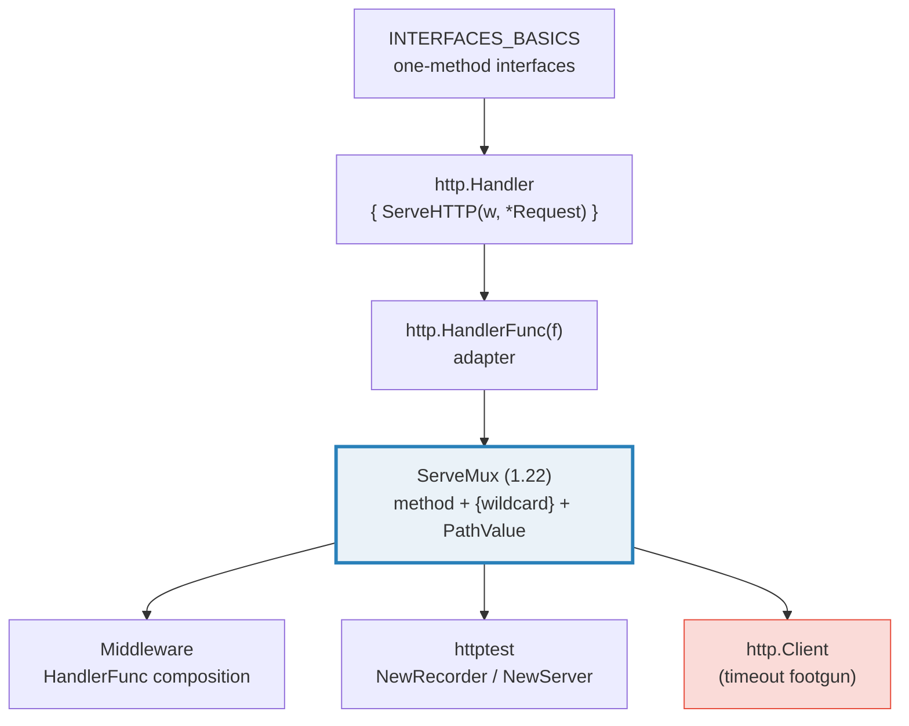
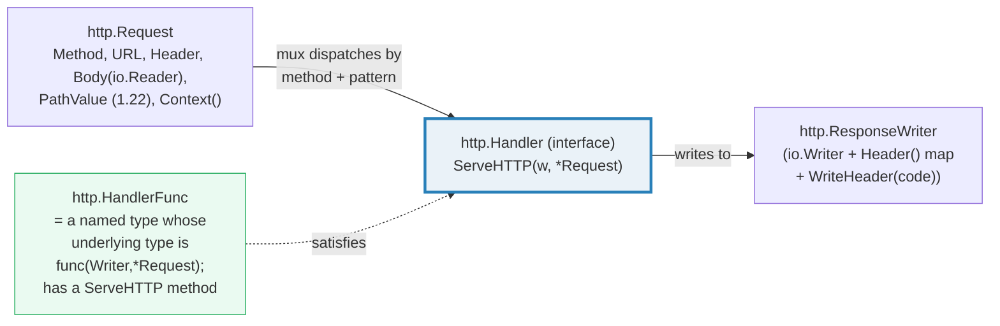
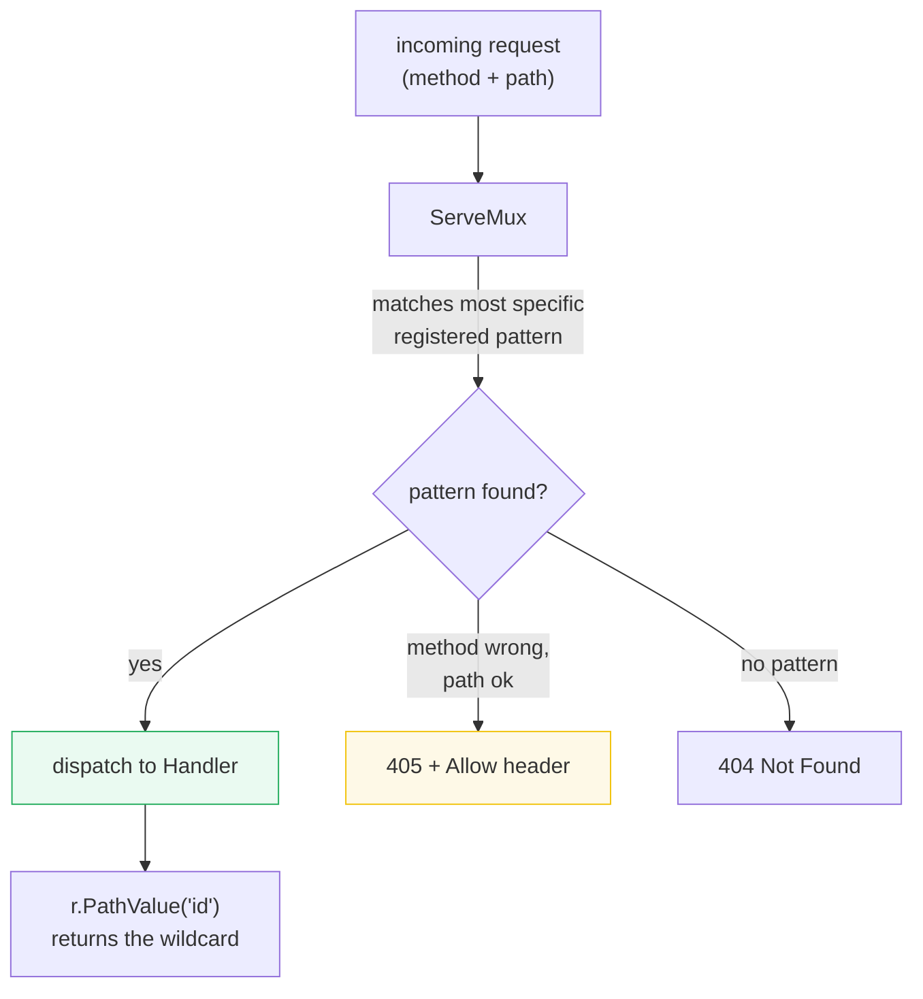
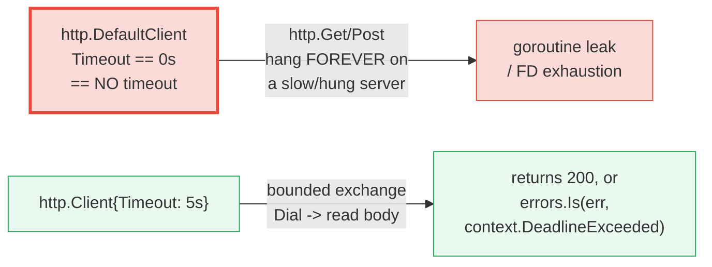
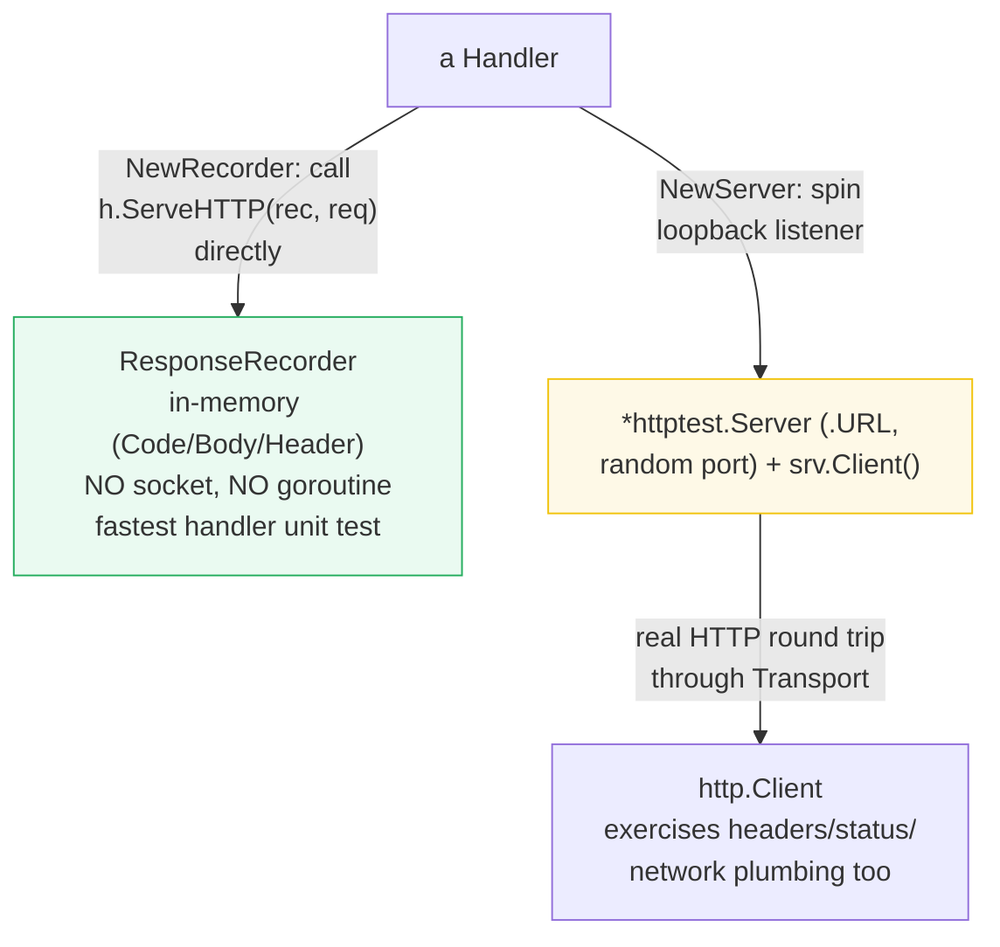

# NET_HTTP — Handlers, the 1.22 ServeMux, Client Timeouts, Middleware & httptest

> **Goal (one line):** show, by exercising every part against an in-process
> `httptest` server, how `net/http`'s `Handler`/`HandlerFunc`, the Go 1.22
> enhanced `ServeMux` (method matching + `{wildcard}` + `PathValue`), the
> `http.Client` **timeout footgun**, and middleware composition actually behave.
>
> **Run:** `go run net_http.go`
>
> **Ground truth:** [`net_http.go`](./net_http.go) → captured stdout in
> [`net_http_output.txt`](./net_http_output.txt). Every status code, header, and
> body below is pasted **verbatim** from that file under a
> `> From net_http.go Section X:` callout. Nothing is hand-computed.
>
> **Prerequisites:** 🔗 [`INTERFACES_BASICS`](./INTERFACES_BASICS.md) (`Handler`
> *is* a one-method interface), 🔗 [`IO_READER_WRITER`](./IO_READER_WRITER.md)
> (request/response bodies are `io.Reader`/`io.Writer`), and
> 🔗 [`ENCODING_JSON`](./ENCODING_JSON.md) (JSON handlers). 🔗
> [`CONTEXT`](./CONTEXT.md) is assumed for the timeout section.

---

## 1. Why this bundle exists (lineage)

Go's `net/http` is unusual among standard libraries: it ships a **production-grade
HTTP server *and* client**, in pure stdlib, with no third-party router required
since **Go 1.22**. The whole stack flows from three small abstractions:

- an **interface** — `http.Handler{ ServeHTTP(ResponseWriter, *Request) }`;
- an **adapter** — `http.HandlerFunc(f)` turns any plain function into a `Handler`;
- a **mux** — `http.ServeMux`, which (since 1.22) matches on **method + path
  pattern**, extracts **wildcards**, and dispatches to a `Handler`.



The big story is the **1.22 ServeMux**. Pre-1.22, `HandleFunc("/items/", h)` only
did **prefix matching**: you parsed the method and the path suffix yourself in the
handler, which made `DELETE /items/234` silently fetch item 234 if you forgot the
method check. In Go 1.22 the pattern itself carries the method and the wildcards:

> From `go.dev/blog/routing-enhancements` (Jonathan Amsterdam): *"Go 1.22 brings
> two enhancements to the `net/http` package's router: method matching and
> wildcards. These features let you express common routes as patterns instead of
> Go code… you could instead write `http.HandleFunc("GET /posts/{id}", handlePost2)`
> … `DELETE /posts/234` will fail if no other matching pattern is registered. In
> accordance with HTTP semantics, a `net/http` server will reply to such a
> request with a `405 Method Not Allowed` error that lists the available methods
> in an `Allow` header."*

This bundle exercises the **entire chain** end-to-end with `httptest`, the
in-process test harness: `httptest.NewRecorder()` captures a response **with no
socket at all**, and `httptest.NewServer(handler)` spins a real loopback server
**on a random port in-process** — no DNS, no real network, fully deterministic.

---

## 2. The mental model: the four abstractions



The key type-system fact (🔗 `INTERFACES_BASICS`): **`Handler` is satisfied
implicitly.** `http.HandlerFunc` is a named type defined as
`type HandlerFunc func(ResponseWriter, *Request)`. It has a method
`func (f HandlerFunc) ServeHTTP(w ResponseWriter, r *Request) { f(w, r) }` — so a
`HandlerFunc` *value* **is** a `Handler`, and the conversion `http.HandlerFunc(f)`
adapts *any* ordinary function `f` of the matching signature into a `Handler`. A
**bare** `func(ResponseWriter, *Request)` has **no method**, so it is **not** a
`Handler` on its own — the adapter is required (Section A asserts this).

---

## 3. Section A — `Handler`, `HandlerFunc`, and `httptest.NewRecorder`

> From `net_http.go` Section A:
> ```
> type of http.HandlerFunc(helloHandler): http.HandlerFunc
> hello handler via NewRecorder -> status 200, body "hello"
> ```
> ```
> [check] hello handler status == 200: OK
> [check] hello handler body == "hello": OK
> ```

**What.** A plain function `helloHandler` is written; `http.HandlerFunc(helloHandler)`
adapts it into an `http.Handler`. The handler then runs against an
`httptest.ResponseRecorder` — `%T` reports the underlying named type
`http.HandlerFunc`, and the recorder captured `status 200, body "hello"` with
**no socket involved at all**.

> From `pkg.go.dev/net/http` — `Handler` is *"an interface for responding to an
> HTTP request"* with one method `ServeHTTP(http.ResponseWriter, *http.Request)`.
> `HandlerFunc` *"allows the use of ordinary functions as HTTP handlers. If f is
> a function with the appropriate signature, HandlerFunc(f) is a Handler that
> calls f."*

**Why `NewRecorder` is the foundation of handler unit tests.**
`httptest.NewRecorder()` returns a `*ResponseRecorder` that implements
`http.ResponseWriter` but stores everything in memory (`Code`, `Body`, `HeaderMap`).
You call `h.ServeHTTP(rec, req)` directly — **no `Serve`, no listener, no TCP**.
That is why handler tests are fast, deterministic, and need no port. `NewServer`
(used from Section B on) adds a real loopback socket on top of the same handler,
exercising the *full* client→network→server round trip in-process.

**The `ResponseWriter` write order (the rule that bites).** A handler may call
`w.Header().Set(k, v)` **only before** the first `WriteHeader`/`Write`; once the
status line is flushed the header map is frozen. Section E's middleware sets
`X-Wrapped` *before* calling `next`, which is why the header survives.

---

## 4. Section B — The 1.22 `ServeMux`: `{id}` wildcard + `r.PathValue`

> From `net_http.go` Section B:
> ```
> GET /items/42 -> status 200, body "item id=42"
> ```
> ```
> [check] GET /items/{id} -> status 200: OK
> [check] body contains PathValue "42": OK
> ```

**What.** A single registration `"GET /items/{id}"` matches a `GET` whose path has
two segments, the second captured into the `{id}` wildcard. The handler reads it
with the 1.22 `r.PathValue("id")` and echoes `"42"` straight into the body. The
mux is served through `httptest.NewServer`, fetched with the server's own
`http.Client`, and the response is decoded — a complete round trip with **no real
network**.

> From `go.dev/blog/routing-enhancements`: *"extracting the identifier string can
> be written using the new `PathValue` method on `Request`… `idString :=
> req.PathValue("id")`."*

**Two wildcard kinds, pinned.**
- `{id}` matches **exactly one** path segment (no slashes).
- `{path...}` (the `...` suffix) matches **all remaining** segments, e.g.
  `"GET /files/{path...}"` captures a multi-segment path.

**The precedence rule — "most specific wins."** When patterns overlap
(`/items/latest` vs `/items/{id}` both match `/items/latest`), the more specific
literal wins, *regardless of registration order*. Two patterns that overlap with
**neither** more specific (`/items/{id}` vs `/{x}/latest`) **conflict** and
**panic at registration**. `GET` also matches `HEAD` as a special case (which is
why Section C's `Allow` header lists `HEAD` too).



---

## 5. Section C — Method matching: `GET`/`POST` 200, `DELETE` → 405

> From `net_http.go` Section C:
> ```
> GET    /x -> status 200, body "GET ok"
> POST   /x -> status 200, body "POST ok"
> DELETE /x -> status 405, Allow="GET, HEAD, POST"
> ```
> ```
> [check] GET /x -> 200: OK
> [check] POST /x -> 200: OK
> [check] DELETE /x -> 405 (Method Not Allowed): OK
> [check] 405 response has a non-empty Allow header: OK
> [check] Allow header advertises GET and POST: OK
> ```

**What.** Two patterns are registered for the same path with different methods
(`"GET /x"` and `"POST /x"`). `GET` and `POST` each hit their own handler → `200`.
A `DELETE` matches *no* pattern (the path matches but the method does not), so the
1.22 mux auto-generates **`405 Method Not Allowed`** with an **`Allow`** header
listing every method that *does* match — here `"GET, HEAD, POST"` (the `HEAD` is
free, because `GET` implicitly covers `HEAD`). This is precisely the pre-1.22 bug
the enhancement fixes: you can no longer *forget* the method check.

> From `go.dev/blog/routing-enhancements`: *"a `net/http` server will reply to
> such a request with a `405 Method Not Allowed` error that lists the available
> methods in an `Allow` header."*

---

## 6. Section D — The `http.Client` **timeout footgun**

> From `net_http.go` Section D:
> ```
> http.DefaultClient.Timeout = 0s  (0s == NO timeout: the footgun)
> client{Timeout:1s} GET /fast -> status 200, err=<nil>
> client{Timeout:10ms} GET /slow -> err wraps context.DeadlineExceeded? true
> ```
> ```
> [check] client with Timeout gets 200 from fast handler: OK
> [check] short-timeout client errors on a slow handler: OK
> [check] short-timeout error wraps context.DeadlineExceeded: OK
> ```

**What — the footgun, printed verbatim.** `http.DefaultClient.Timeout` is the zero
value **`0s`**, and `0` means **no timeout**. `http.Get`, `http.Post`, and
`http.Head` all use `DefaultClient`, so a single hung upstream server **hangs
your goroutine forever** (or until the OS kills the process). Section D proves it
two ways:

1. A client constructed *with* `Timeout: 1s` hits a fast handler → `200` (the
   timeout is set, and it does not fire).
2. A client with `Timeout: 10ms` hits a handler that sleeps `100ms` → the client
   aborts, and the returned error **wraps** `context.DeadlineExceeded`
   (`errors.Is(err, context.DeadlineExceeded)` is `true`).



**Why the fix is "always construct your own client."** The whole exchange (dial,
TLS, write request, read headers, read body) is bounded by the one `Timeout`
field. When it fires, the client cancels the request's internal context, so the
error is a `*url.Error` whose chain ends in `context.DeadlineExceeded` — which is
why `errors.Is` reliably detects it. This is the bridge to 🔗 `CONTEXT`: a client
timeout is just a deadline applied to the request context.

> From `blog.cloudflare.com/the-complete-guide-to-golang-net-http-timeouts`
> (Filippo Valsorda): *"Like the server-side case above, the package level
> functions such as `http.Get` use a Client without timeouts, so are dangerous to
> use on the open Internet."* And on the server side:
> *"the package-level convenience functions that bypass `http.Server` like
> `http.ListenAndServe` … are unfit for public Internet servers. Those functions
> leave the Timeouts to their default off value, with no way of enabling them."*

**The server-side mirror (documented, not runnable here).** An `http.Server` has
`ReadTimeout`, `ReadHeaderTimeout` (the **Slowloris** guard — set this even if you
stream), `WriteTimeout`, and `IdleTimeout`. Production hygiene always uses an
explicit `&http.Server{}` instead of `http.ListenAndServe`, and tunes all four.
This connects directly to 🔗 `GRACEFUL_SHUTDOWN` (Phase 8): `Server.Shutdown(ctx)`
drains in-flight requests under a context deadline.

**Determinism note.** Section D asserts the error **kind** (`errors.Is` against a
sentinel) and the status code, **never a duration**. Timing is inherently
non-reproducible; `context.DeadlineExceeded` is a stable sentinel. The margin
(10ms timeout vs 100ms sleep) is wide enough that the result is robust on any
machine, which is why two `just out net_http` runs are byte-identical.

---

## 7. Section E — Middleware = `HandlerFunc` composition


> From `net_http.go` Section E:
> ```
> GET via middleware -> status 200, X-Wrapped="yes", body="from inner handler"
> ```
> ```
> [check] middleware response status == 200: OK
> [check] middleware set X-Wrapped header == "yes": OK
> [check] inner handler body delivered through middleware: OK
> ```

**What.** `logging` is a function `func(http.Handler) http.Handler`: it takes the
"next" handler and returns a wrapped `http.HandlerFunc` that sets a header **before**
calling `next.ServeHTTP`. The final handler's body (`"from inner handler"`) still
arrives, *and* the middleware-injected `X-Wrapped: yes` header is present —
because the header was set before the first `Write`. Wrapping nests:
`a(b(c(final)))`, with control unwinding back up the stack after the inner handler
returns (post-processing happens after the `next.ServeHTTP` call).

**Why it is "just functions."** There is no special middleware type. A middleware
is any `func(http.Handler) http.Handler`. Because `HandlerFunc` *is* a `Handler`
(Section 3), the return value slots directly into another middleware or a mux.
This is the entire mechanism behind every Go web framework's middleware chain —
and since 1.22 the stdlib `ServeMux` is good enough that you often don't need a
framework at all (🔗 `MIDDLEWARE_ROUTING`, Phase 6, contrasts this with `chi`).

---

## 8. Section F — End-to-end: JSON handler over `NewServer` + decode

> From `net_http.go` Section F:
> ```
> decoded JSON -> ID=42 Name="widget" (Content-Type="application/json")
> ```
> ```
> [check] decoded widget ID == 42: OK
> [check] decoded widget Name == "widget": OK
> [check] Content-Type == "application/json": OK
> ```

**What.** A `GET /widget` handler sets `Content-Type: application/json` and streams
a `widget{ID: 42, Name: "widget"}` through `json.NewEncoder(w).Encode(...)`. The
client fetches it through `httptest.NewServer` and decodes the body with
`json.NewDecoder(resp.Body).Decode(&got)` — the round-trip wires together
`Handler` + `ServeMux` + `Client` + 🔗 `ENCODING_JSON` + 🔗 `IO_READER_WRITER`
(the response body is an `io.Reader`, the `ResponseWriter` is an `io.Writer`).

**Why `json.NewEncoder(w)` / `json.NewDecoder(r.Body)`.** Both stream: the encoder
writes directly to the `ResponseWriter` (no intermediate buffer to marshal into a
`[]byte` first), and the decoder reads directly from the response body. This is
the idiomatic JSON-over-HTTP shape and the bridge to 🔗 `ENCODING_JSON`.

---

## 9. `httptest`: `NewRecorder` (no socket) vs `NewServer` (loopback socket)

This bundle uses **both** `httptest` helpers, and the difference matters:



> From `pkg.go.dev/net/http/httptest` — `NewRecorder`: *"returns an initialized
> ResponseRecorder."* `ResponseRecorder` *"implements http.ResponseWriter… to
> record the changes for later inspection in tests."* `NewServer`: *"starts and
> returns a new Server. The caller should call Close when finished, to shut it
> down."*

**When to use which.** `NewRecorder` tests a **single handler in isolation** — the
fastest possible, no socket. `NewServer` tests the **integration**: the mux, the
client, the transport, headers, and status codes all flow through a real (but
loopback) connection. Section A uses `NewRecorder`; Sections B–F use `NewServer`.
Either way there is **no DNS and no real network** — that is what makes the
bundle fully offline and deterministic. Crucially, **server URLs carry a random
port**, so this bundle never prints a URL — only status codes, headers, and bodies.

---

## 10. Pitfalls (the expert payoff)

| Trap | Symptom | Fix |
|---|---|---|
| Using `http.DefaultClient` / `http.Get` | `Timeout == 0` → a hung server hangs your goroutine **forever** (goroutine/FD leak) | Always construct `&http.Client{Timeout: ...}`; never use `http.Get` on the open Internet. |
| Using `http.ListenAndServe` for a public server | No `ReadHeaderTimeout` → **Slowloris** slow-header DoS exhausts file descriptors | Build `&http.Server{ReadHeaderTimeout, ReadTimeout, WriteTimeout, IdleTimeout}` and call `srv.ListenAndServe()`. |
| Setting a header **after** `Write`/`WriteHeader` | Header silently dropped (the header map is frozen once the status line flushes) | Call `w.Header().Set(k, v)` before the first `Write`/`WriteHeader`. |
| Forgetting `http.HandlerFunc` around a plain func | `cannot use f (type func(...)) as type http.Handler` — a bare func has no method | Wrap it: `http.HandlerFunc(f)`, or register via `mux.HandleFunc(pat, f)` which wraps for you. |
| Calling `WriteHeader` twice / writing after it | `http: superfluous response.WriteHeader call` logged; status already sent | Call `WriteHeader` at most once, before the body. |
| `defer resp.Body.Close()` **before** the `err != nil` check | `go vet` `httpresponse` warning (resp may be nil when err != nil); potential nil deref | Read/`defer` the body only **after** confirming `err == nil`. |
| Conflicting 1.22 patterns | **Panic at registration**: `mux: conflicting registrations` (e.g. `/items/{id}` and `/{x}/latest`) | Patterns must be disambiguated by specificity; design routes so overlaps have a strict winner. |
| Reading `r.PathValue("id")` for an unmatched segment | Returns `""` (empty string), not an error — easy to mistake for a real empty value | Validate `PathValue` results; convert with care (e.g. `strconv.Atoi`). |
| Ignoring `resp.Body.Close()` / not draining it | Connection **not returned to the pool** → leaks; `IdleConnTimeout` won't help a held conn | `defer resp.Body.Close()` and read the body to EOF (or `io.Copy(io.Discard, resp.Body)`). |
| Assuming the pre-1.22 prefix mux still braces literally | Go 1.22 treats `{...}` as wildcards (old code using literal braces breaks) | Set `GODEBUG=httpmuxgo121=1` only as a migration shim; rewrite patterns. |
| A bare `func` registered where a `Handler` is required (e.g. `mux.Handle`) | Compile error: `mux.Handle(pat, handler)` wants a `Handler`, not a raw func | Use `mux.Handle(pat, http.HandlerFunc(f))`, or simply `mux.HandleFunc(pat, f)`. |

---

## 11. Cheat sheet

```go
// The four abstractions
type Handler interface { ServeHTTP(http.ResponseWriter, *http.Request) }
type HandlerFunc func(http.ResponseWriter, *http.Request) // adapts a plain func into a Handler
mux := http.NewServeMux()
mux.HandleFunc(pattern, f)        // f is auto-wrapped as HandlerFunc
mux.Handle(pattern, handler)      // handler must already be a Handler

// Go 1.22+ patterns (method + wildcard + PathValue)
mux.HandleFunc("GET /items/{id}", func(w http.ResponseWriter, r *http.Request) {
    id := r.PathValue("id")                 // "42" for /items/42
    fmt.Fprintf(w, "item %s", id)
})
mux.HandleFunc("GET /files/{path...}", h)   // {x...} matches the REST of the path
mux.HandleFunc("POST /items", createItem)   // method is part of the pattern
// Precedence: most-specific wins; truly ambiguous pairings PANIC at registration.
// Wrong method on a matched path -> 405 + "Allow: GET, HEAD, POST".

// ResponseWriter: header MUST be set before Write/WriteHeader
w.Header().Set("Content-Type", "application/json")
w.WriteHeader(http.StatusOK)                // call at most once
w.Write([]byte("..."))                      // or json.NewEncoder(w).Encode(v)

// Client: NEVER use http.DefaultClient / http.Get in production (Timeout == 0)
client := &http.Client{Timeout: 5 * time.Second}
resp, err := client.Get(url)                // err may wrap context.DeadlineExceeded
if err != nil { /* handle */ }
defer resp.Body.Close()                     // ONLY after the err check (go vet httpresponse)
b, _ := io.ReadAll(resp.Body)              // drain it so the conn returns to the pool

// Server: build it yourself, tune all four timeouts (don't use ListenAndServe)
srv := &http.Server{
    Addr:              ":8080",
    Handler:           mux,
    ReadHeaderTimeout: 5 * time.Second,     // Slowloris guard — set even if streaming
    ReadTimeout:       10 * time.Second,
    WriteTimeout:      15 * time.Second,
    IdleTimeout:       60 * time.Second,
}
srv.ListenAndServe()                        // -> srv.Shutdown(ctx) for graceful drain

// Middleware: a func(http.Handler) http.Handler; nest them
func logging(next http.Handler) http.Handler {
    return http.HandlerFunc(func(w http.ResponseWriter, r *http.Request) {
        w.Header().Set("X-Wrapped", "yes")  // BEFORE calling next
        next.ServeHTTP(w, r)
    })
}
wrapped := logging(logging2(final))

// httptest — in-process, NO real network, deterministic
rec := httptest.NewRecorder()               // NO socket: h.ServeHTTP(rec, req); read rec.Code/rec.Body
srv := httptest.NewServer(mux); defer srv.Close()  // loopback socket; srv.Client(); NEVER print srv.URL (random port)
```

---

## Sources

Every signature, status-code behavior, and pattern rule above was verified against
the Go standard-library docs and the Go blog, then corroborated by independent
secondary sources:

- `net/http` package — https://pkg.go.dev/net/http
  - `Handler` interface ("an interface for responding to an HTTP request… with
    one method `ServeHTTP`"):
    https://pkg.go.dev/net/http#Handler
  - `HandlerFunc` ("allows the use of ordinary functions as HTTP handlers. If f
    is a function with the appropriate signature, HandlerFunc(f) is a Handler
    that calls f"):
    https://pkg.go.dev/net/http#HandlerFunc
  - `ServeMux` / `Handle` / `HandleFunc` (pattern registration):
    https://pkg.go.dev/net/http#ServeMux
  - `Request.PathValue` / `Request.SetPathValue` (1.22 wildcard accessors):
    https://pkg.go.dev/net/http#Request.PathValue
  - `ResponseWriter` (`Header()`, `Write([]byte) (int, error)`,
    `WriteHeader(statusCode)`):
    https://pkg.go.dev/net/http#ResponseWriter
  - `Client` / `Client.Timeout` ("a time limit for requests made by this Client…
    A Timeout of zero means no timeout"):
    https://pkg.go.dev/net/http#Client
  - `DefaultClient` / `Get` / `Post` / `Head` (package-level helpers that use
    `DefaultClient`):
    https://pkg.go.dev/net/http#Get
  - `Server` (`ReadTimeout`, `ReadHeaderTimeout`, `WriteTimeout`, `IdleTimeout`;
    `ListenAndServe` "listens on the TCP network address… and then calls Serve"):
    https://pkg.go.dev/net/http#Server
- `net/http/httptest` package — https://pkg.go.dev/net/http/httptest
  - `NewRecorder` / `ResponseRecorder` ("implements http.ResponseWriter… records
    the changes for later inspection in tests"):
    https://pkg.go.dev/net/http/httptest#NewRecorder
  - `NewServer` ("starts and returns a new Server. The caller should call Close
    when finished, to shut it down"):
    https://pkg.go.dev/net/http/httptest#NewServer
  - `NewRequest` (test request helper):
    https://pkg.go.dev/net/http/httptest#NewRequest
- Go Blog — Jonathan Amsterdam, *"Routing Enhancements for Go 1.22"* (the
  canonical source for method matching, `{wildcard}` vs `{path...}`, `PathValue`,
  the "most specific wins" precedence, the 405 + `Allow` behavior, and the
  `{$}` trailing-slash syntax):
  https://go.dev/blog/routing-enhancements
- `net/http.ServeMux` doc (the authoritative precedence/conflict + 405 rules):
  https://pkg.go.dev/net/http#ServeMux
- Secondary corroboration (>=2 independent sources, web-verified):
  - Cloudflare Blog — Filippo Valsorra, *"The complete guide to Go net/http
    timeouts"* (the canonical timeout footgun article: `http.Get` uses "a Client
    without timeouts, so are dangerous to use on the open Internet"; server-side
    `ReadTimeout`/`WriteTimeout`/`ReadHeaderTimeout`/`IdleTimeout`; package-level
    `ListenAndServe` is "unfit for public Internet servers"):
    https://blog.cloudflare.com/the-complete-guide-to-golang-net-http-timeouts/
  - Eli Bendersky — *"Better HTTP server routing in Go 1.22"* (wildcard matches a
    single path component; value accessed via `Request.PathValue`; method matching
    + 405 behavior):
    https://eli.thegreenplace.net/2023/better-http-server-routing-in-go-122/
  - Nathan Smith — *"Don't use Go's default HTTP client (in production)"*
    (`DefaultClient` has no timeout; always specify a custom `http.Client`):
    https://medium.com/@nate510/don-t-use-go-s-default-http-client-4804cb19f779

**Facts verified by running** (`just check net_http`): the `Handler`→`HandlerFunc`
adaptation under `%T`; `NewRecorder` capturing `200` + `"hello"`; the 1.22
`GET /items/{id}` route returning `PathValue` `"42"`; method routing
(`GET`/`POST` 200, `DELETE` 405 with `Allow: GET, HEAD, POST`); `http.DefaultClient.Timeout == 0s`; the short-timeout client error wrapping
`context.DeadlineExceeded` (`errors.Is` true); the middleware `X-Wrapped` header;
and the JSON end-to-end round trip. Two `just out net_http` runs are byte-identical
(only status codes/headers/bodies are printed — never the random server port).

**Facts that could not be verified by running** (documented, not executed, since
they would either panic or need a real network): the conflict panic on two
ambiguous patterns (would abort the bundle before its checks print); the
`ReadHeaderTimeout`/Slowloris mitigation on a real `http.Server` (this bundle uses
`httptest.NewServer`, which does not expose the production server's timeout
fields); and the literal-brace breaking change under `GODEBUG=httpmuxgo121=1`.
These are confirmed by the `pkg.go.dev/net/http#ServeMux` documentation and the
Cloudflare/Go-blog sources cited above, not reproduced as runnable output (a file
triggering them would not pass `just check`).
