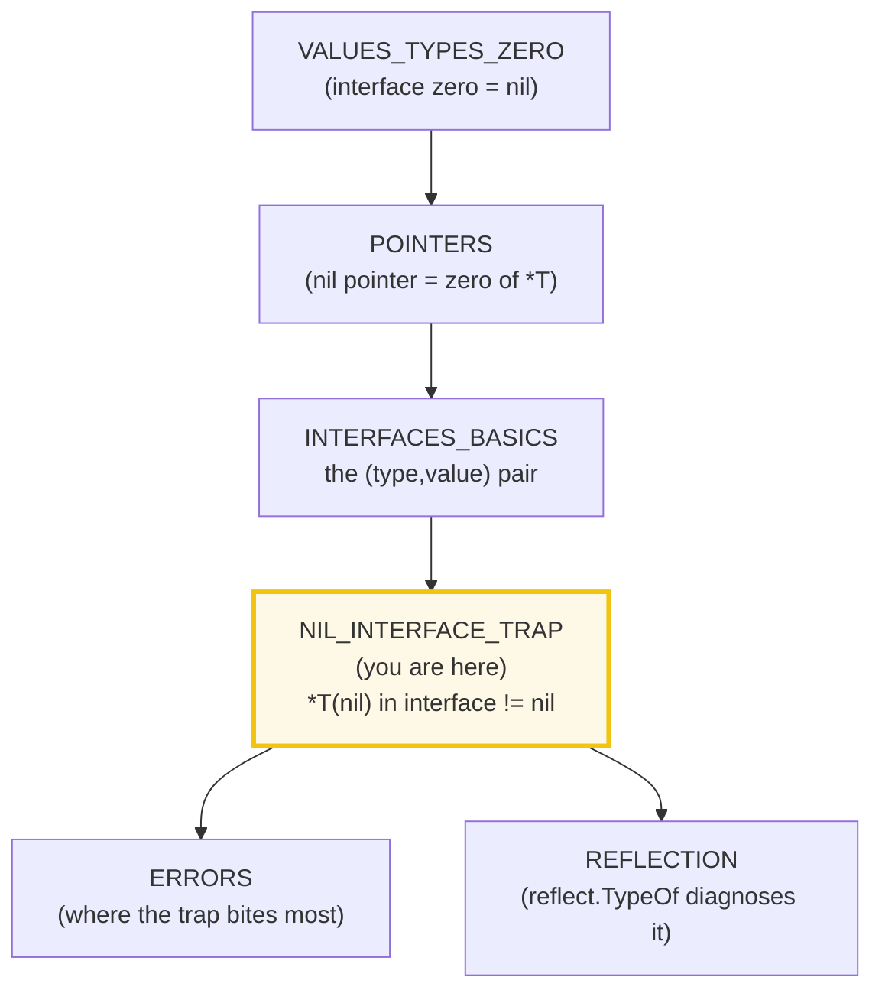
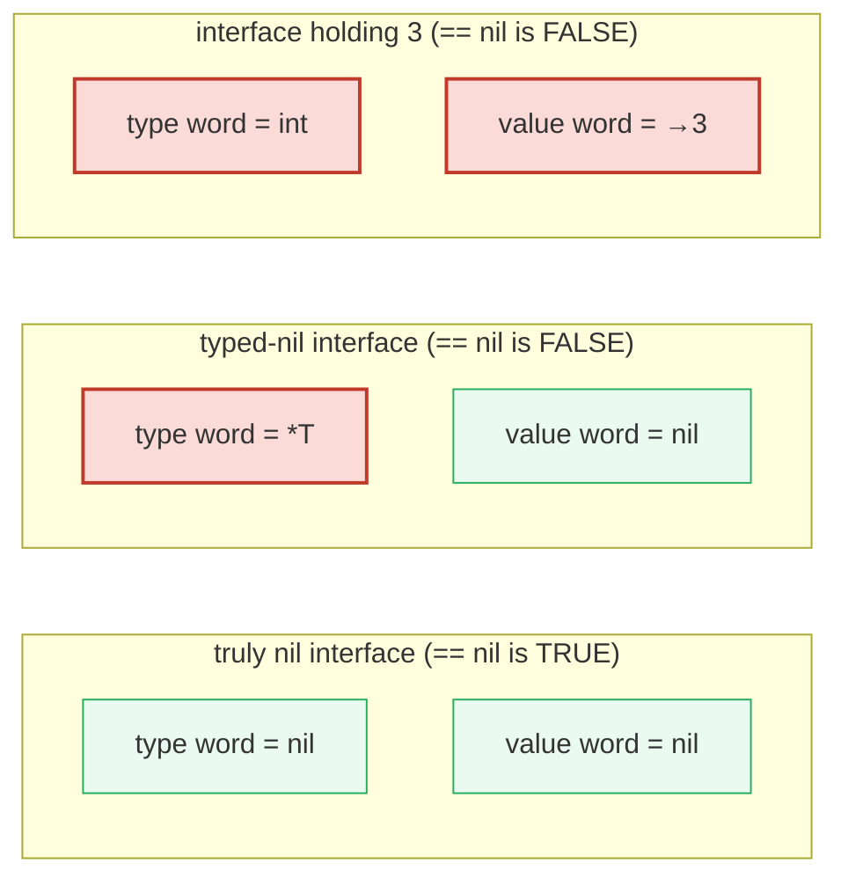
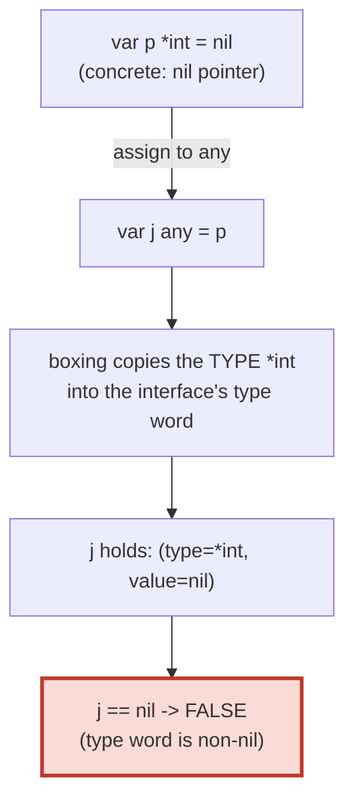
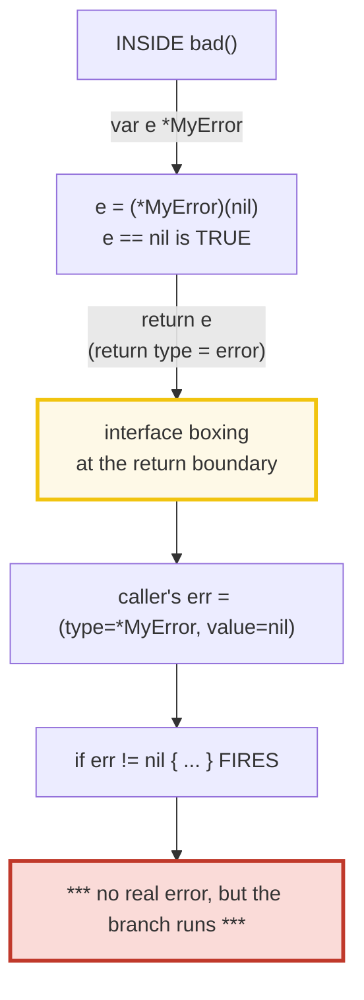

# NIL_INTERFACE_TRAP — The Typed-Nil Bug (Go's Most Famous Footgun)

> **Goal (one line):** show, by printing every value, why storing a nil pointer
> into an interface produces a **non-nil** interface — and why that turns a
> well-meant `return nil` into a lying `error`.
>
> **Run:** `go run nil_interface_trap.go`
>
> **Ground truth:** [`nil_interface_trap.go`](./nil_interface_trap.go) → captured
> stdout in [`nil_interface_trap_output.txt`](./nil_interface_trap_output.txt).
> Every number/table below is pasted **verbatim** from that file under a
> `> From nil_interface_trap.go Section X:` callout. Nothing is hand-computed.
>
> **Prerequisites:**
> - 🔗 [`POINTERS`](./POINTERS.md) — a nil pointer is the zero value of `*T`;
>   you cannot understand this bug without a firm grip on what a nil pointer is.
> - 🔗 [`INTERFACES_BASICS`](./INTERFACES_BASICS.md) *(planned)* — the (type,
>   value) pair model is *why* this trap exists. This bundle assumes you have
>   seen that an interface value is a two-word struct.
> - 🔗 [`VALUES_TYPES_ZERO`](./VALUES_TYPES_ZERO.md) — the zero value of an
>   interface is `nil`, i.e. a `(type=nil, value=nil)` pair (Section A there).

---

## 1. Why this bundle exists (lineage)

This is the single bug that catches **every** Go programmer at least once, and
it has its own entry in the official Go FAQ. Dave Cheney calls it *"the dreaded
typed nil"* and filed it as a Go 2 experience report because it *"consumed 700
words — and several hours over chat — to explain."* It is a flagship bundle not
because it is obscure, but because it is **common, silent, and counter-intuitive:
the code reads correctly and yet lies.**

The bug is this one-liner:

```go
func bad() error {
    var e *MyError      // e is a nil *MyError
    return e            // returns a NON-nil error
}

err := bad()
if err != nil {         // FIRES — even though nothing went wrong
    log.Fatal(err)      // ... so this runs with no real error
}
```

`e` is `nil`. `bad` returns `e`. The caller's `err != nil` is `true`. **How can
returning a nil value produce a non-nil error?** The answer is the interface's
two-word representation — and once you see it, the entire bug is mechanical.



---

## 2. The mental model: an interface value is a (type, value) pair

An interface value is **not** a pointer. It is a **two-word struct**: one word
for the dynamic **type**, one word for the dynamic **value**. (Internally the
runtime also caches an *itable*, but the conceptual model is just the pair.)



> From the **Go FAQ** ("Why is my nil error value not equal to nil?"):
> > Under the covers, interfaces are implemented as two elements, a type `T` and
> > a value `V`. `V` is a concrete value such as an `int`, `struct` or pointer,
> > never an interface itself, and has type `T`... An interface value is `nil`
> > only if the `V` and `T` are both unset, (`T=nil`, `V` is not set). In
> > particular, a `nil` interface will always hold a `nil` type. If we store a
> > `nil` pointer of type `*int` inside an interface value, the inner type will
> > be `*int` regardless of the value of the pointer: (`T=*int`, `V=nil`). Such
> > an interface value will **therefore be non-nil even when the pointer value
> > `V` inside is `nil`.**

The rule, stated once and for all:

> **An interface value equals `nil` if and only if BOTH its dynamic type AND its
> dynamic value are `nil`.** The moment any concrete type is recorded — even for
> a nil pointer — the interface becomes non-nil.

Dave Cheney's crisp formulation: `(*T, nil) == (nil, nil)` is `false`, because
"equality in Go almost always operates as a bitwise comparison... the bits that
hold `(*T, nil)` are different to the bits that hold `(nil, nil)`."

> From the **Go spec** (*Comparison operators*): interface values are
> comparable; two interface values are equal if they have **identical dynamic
> types and equal dynamic values**, or **both have value `nil`**. Two typed nils
> of *different* concrete types are therefore unequal even when both wrapped
> values are nil — pinned in Section B.

---

## 3. Section A — A truly nil interface

> From `nil_interface_trap.go` Section A:
> ```
> var i any
>   i                 = <nil>
>   i == nil          = true   (type=nil, value=nil -> genuinely nil)
>   reflect.TypeOf(i) = <nil>   (nil -> the interface holds no type)
> ```
> ```
> [check] truly-nil interface compares == nil: OK
> [check] reflect.TypeOf(nil interface) == nil: OK
> ```

**What.** A bare `var i any` holds nothing — both words are nil — so `i == nil`
is `true`. This is the only kind of interface value that compares equal to `nil`.

**Why `reflect.TypeOf(i)` returns `nil`.** From `pkg.go.dev/reflect`:
`TypeOf` "returns the reflection Type that represents the **dynamic type** of
`i`. If `i` is a nil interface value, `TypeOf` returns `nil`." A nil interface
has *no* dynamic type to report. This is your forensic tool: a nil `error`
variable gives `reflect.TypeOf(e) == nil`; a typed-nil `error` does not.

---

## 4. Section B — The typed-nil trap (pin this surprising result)



> From `nil_interface_trap.go` Section B:
> ```
> var p *int = nil; var j any = p
>   p                 = <nil>
>   p == nil          = true   (the pointer itself IS nil)
>   j                 = (*int)(nil)
>   j == nil          = false   <-- THE TRAP: type is *int, so j is NOT nil
>   reflect.TypeOf(j) = *int   (the interface remembers the type)
> ```
> ```
> [check] the nil pointer itself is nil: OK
> [check] the interface holding a nil *int is NON-nil (THE TRAP): OK
> [check] reflect.TypeOf(typed-nil interface) is non-nil: OK
>   (*int)(nil)    == (*string)(nil) as interfaces? false   (different types)
>   (*int)(nil)    == (*int)(nil)    as interfaces? true   (same type, both nil)
> ```
> ```
> [check] typed nils of different concrete types are NOT equal: OK
> [check] typed nils of the same concrete type ARE equal: OK
> ```

**The crux — pinned exactly.** `p == nil` is `true` (it is a nil pointer), yet
`j == nil` is **`false`** the instant `p` is stored into the interface `j`. The
`%#v` form makes the trap visible: `j` prints `(*int)(nil)` — a concrete type
`*int` paired with a nil value. `reflect.TypeOf(j)` is `*int` (non-nil),
confirming the type word is occupied.

**The expert detail — equality is type-sensitive.** Two typed nils are equal
**only when their dynamic types match**: `(*int)(nil) == (*int)(nil)` is `true`
(same type, both nil values), but `(*int)(nil) == (*string)(nil)` is `false`
(different dynamic types). This follows directly from the spec's "identical
dynamic types and equal dynamic values" rule. So `i != nil` is not even a
reliable *kind* test across types — only the *specific* `(nil, nil)` interface
compares nil.

---

## 5. Section C — THE bug: `bad()` returns a non-nil error



> From `nil_interface_trap.go` Section C:
> ```
> err := bad()
>   err                = (*main.MyError)(nil)
>   err == nil         = false   <-- caller's `if err != nil` FIRES (no real error!)
>   reflect.TypeOf(err)= *main.MyError   (non-nil: the interface holds type *MyError)
> ```
> ```
> [check] bad() returns a NON-nil error even though *MyError is nil: OK
> [check] reflect.TypeOf(bad()'s error) is non-nil: OK
> [check] reflect.TypeOf(a truly nil error) == nil: OK
> ```

**What.** `bad()` declares `var e *MyError` (which is nil) and returns it. The
return type is `error` — an interface — so the return statement *boxes* the nil
`e` into an `error` value. Boxing copies the concrete type `*MyError` into the
interface's type word. The result `(type=*MyError, value=nil)` is **non-nil**, so
the caller's `err != nil` is `true` and the error branch runs for an error that
does not exist.

**Diagnosis — two tools that reveal a typed nil.** When `err != nil` fires
suspiciously, inspect the interface, not the value:

| Tool | Truly-nil `error` | Typed-nil `error` (`bad()`) |
|---|---|---|
| `%#v` (fmt) | `<nil>` | `(*main.MyError)(nil)` ← type is visible |
| `reflect.TypeOf` | `nil` | `*main.MyError` ← non-nil |
| `err == nil` | `true` | **`false`** ← the lie |

`%#v` is usually enough in a `log`/`Println`; `reflect.TypeOf` is the programmatic
test (`reflect.TypeOf(err) != nil` ⟺ "a concrete type is stored"). A genuinely
nil `error` yields `reflect.TypeOf(error(nil)) == nil`, as pinned above.

> 🔗 This is where 🔗 [`REFLECTION`](./REFLECTION.md) *(planned)* earns its keep:
> `reflect.TypeOf` is the simplest reflection call, and it is the canonical
> typed-nil detector. `reflect.ValueOf(nil)` likewise returns the **zero
> `Value`** (whose `IsValid()` is `false`) — the same two-word reality, viewed
> from the value side.

---

## 6. Section D — The fix: return `nil` explicitly

> From `nil_interface_trap.go` Section D:
> ```
> err := good()
>   err                = <nil>
>   err == nil         = true   (genuinely nil: type=nil, value=nil)
>   reflect.TypeOf(err)= <nil>
> ```
> ```
> [check] good() returns a genuinely nil error: OK
> [check] reflect.TypeOf(good()'s error) == nil: OK
> ```

**The one-line fix.** Return a bare `nil` from the `error`-typed function so no
concrete value is ever stored:

```go
func good() error {
    return nil          // (type=nil, value=nil) — genuinely nil
}
```

`%#v` prints `<nil>` and `reflect.TypeOf` returns `nil`: both words empty, the
caller's `err == nil` is `true`. **The fix is structural, not a runtime check**:
never let a typed nil cross an interface boundary in the first place. The Go FAQ
states it directly: "to return a proper `nil` `error` to the caller, the function
must return an explicit `nil`," and recommends that error-returning functions
"use the `error` type in their signature... rather than a concrete type such as
`*MyError`, to help guarantee the error is created correctly."

---

## 7. Section E — The leak propagates through real code

The bug is not confined to a single `return`. Once a nil pointer is boxed into an
interface, the non-nil interface travels **everywhere** unchanged — through
struct fields, wrappers, channels, and stored error values. The leak is "baked
in" at the boxing point; downstream code cannot un-bake it by re-passing.

> From `nil_interface_trap.go` Section E:
> ```
> h := Holder{err: (*MyError)(nil)}
>   h.err == nil       = false   (the field absorbed the type *MyError)
> ```
> ```
> [check] embedded error field holds a non-nil typed nil: OK
> wrapped := wrap(bad())
>   wrapped == nil     = false   (boxing already happened; wrapping preserves it)
> ```
> ```
> [check] typed nil survives an identity wrapper unchanged: OK
> safe((*MyError)(nil))
>   safe(nil) == nil   = true   (checked before boxing -> genuinely nil)
> ```
> ```
> [check] safe() converts a nil pointer into a genuinely nil error: OK
> ```

**(1) Embedded/stored interface fields.** This is the Dave Cheney "Thing{P}"
experience report distilled: a struct with an `error` (or any interface) field
absorbs the concrete type on assignment. `Holder{err: rawErr}` where `rawErr` is
a nil `*MyError` yields `h.err != nil`. Structs that cache or wrap errors
(`multierror`, retry helpers, middleware) are frequent hiding places.

**(2) Wrappers preserve the lie.** `wrap := func(e error) error { return e }`
returns its argument unchanged; `wrap(bad())` is still non-nil because the
boxing already happened inside `bad`. `fmt.Errorf("%w", err)`, `errors.Join`,
and `errors.Is` are *not* identity wrappers — they allocate a fresh concrete
type — but they still *carry* the original non-nil error inside, so the outer
`!= nil` is also `true`. Once boxed, the only remedy is to never have boxed it.

**(3) The defensive pattern.** When a helper must return a concrete pointer type
internally but expose `error`, **check the pointer before the interface
boundary**:

```go
func safe(e *MyError) error {
    if e == nil {
        return nil          // bare nil crosses the boundary
    }
    return e                // non-nil pointer -> legitimate error
}
```

`safe(nil)` returns a genuinely nil `error` (both words empty). The check must
happen on the **concrete** value (`e == nil`, a `*MyError`), not on an interface.

---

## 8. ⚠️ Pitfalls — THIS is the payoff (read it twice)

This table is the whole point of the bundle. The typed-nil trap is silent,
common, and the single most upvoted Go gotcha — memorize the symptom column.

| # | Trap | Symptom (what you see) | Fix |
|---|---|---|---|
| 1 | **`func f() error { var e *T; return e }`** | `err := f(); err != nil` is **TRUE** even though `e` is nil — your `if err != nil` branch runs with no real error. | Return an explicit `nil`. Declare the function's return type as `error`, never `*MyError`. |
| 2 | Storing a nil `*T` into any interface | `var i any = (*T)(nil); i == nil` is **FALSE**. | Compare the concrete pointer (`p == nil`) *before* boxing, or never box a nil pointer. |
| 3 | `var i any = (*T)(nil)` then `i == (*U)(nil)` | **FALSE** — two typed nils are equal only if their **dynamic types match**. | Don't cross-compare typed nils across types; compare concrete values. |
| 4 | Struct with an `error` field set from a nil pointer | `h.err != nil` even though the source was nil (Dave Cheney's `Thing{P}` report). | Nil-check the concrete value before assigning to the field; or store concrete types, not interfaces. |
| 5 | Wrapper/middleware that forwards an error | A nil pointer boxed upstream stays non-nil through `func(e error) error { return e }`, `fmt.Errorf("%w", e)`, etc. | Fix the boxing point upstream; wrappers cannot un-box. |
| 6 | Diagnosing `err != nil` with `%v` | `%v` prints `<nil>` for a typed nil — looks nil, **isn't** nil. | Use `%#v` (→ `(*MyError)(nil)`) or `reflect.TypeOf(err)` (→ `*MyError`, non-nil) to see the type word. |
| 7 | `reflect.TypeOf(err) == nil` as "is nil" test | Returns `nil` only for a truly-nil interface; a typed nil returns `*T`. | That is exactly why it's the detector — pair it with `err == nil` to tell the two apart. |
| 8 | Assuming `error(nil)` and `(*T)(nil)`-as-error are the same | They are not: `error(nil)` is `(nil,nil)`; the latter is `(*T,nil)`. | Always type your returns as `error` and `return nil` literally. |
| 9 | Pointer-receiver method on nil `*T`, returned as `error` | The interface is non-nil AND calling its method may dereference the nil pointer → panic, not a nil error. | Guard `if e == nil { return nil }` at the boundary; never assume a non-nil interface means a usable value. |

> **One-sentence rule:** *If any concrete value (even nil) has been stored in an
> interface, the interface is not nil.* `os.Open` returns `error`, not
> `*os.PathError`, precisely so this cannot happen — the Go FAQ cites it as the
> canonical correct shape.

---

## 9. Cheat sheet

```go
// THE RULE
//   An interface == nil  <=>  BOTH dynamic type AND dynamic value are nil.
//   Storing a nil *T into an interface makes a NON-nil interface: (*T, nil).

// THE BUG
func bad() error {
    var e *MyError      // e == nil
    return e            // -> (type=*MyError, value=nil)  -> err != nil is TRUE
}

// THE FIX
func good() error {
    return nil          // -> (type=nil, value=nil)       -> err == nil is TRUE
}

// THE DEFENSIVE BOUNDARY (when you must return a concrete *T internally)
func safe(e *MyError) error {
    if e == nil {
        return nil      // never let a nil pointer cross the interface boundary
    }
    return e
}

// DIAGNOSE a suspicious `err != nil`
//   fmt.Printf("%#v", err)      // (*MyError)(nil)  vs  <nil>
//   reflect.TypeOf(err)         // *MyError         vs  nil
//   reflect.TypeOf(err) != nil  // TRUE for typed nil; FALSE only for a nil interface

// EQUALITY OF TYPED NILS
//   (*int)(nil) == (*int)(nil)     // TRUE  (same dynamic type, both nil)
//   (*int)(nil) == (*string)(nil)  // FALSE (different dynamic types)

// SIGNATURE DISCIPLINE
//   Return `error`, not `*MyError` — keeps the boxing point under YOUR control.
```

---

## Sources

Every behavioral claim above was verified against the Go specification, the
official FAQ, and standard-library docs (web-checked), and every printed value is
reproduced verbatim from `nil_interface_trap_output.txt`:

- The Go FAQ — *"Why is my nil error value not equal to nil?"* — https://go.dev/doc/faq#nil_error
  (the `(T, V)` two-element model; storing a nil `*int` yields `(T=*int, V=nil)`
  which "will therefore be non-nil"; the fix is "return an explicit `nil`";
  error functions should use `error`, not `*MyError`; `os.Open` cited as correct)
- The Go Programming Language Specification — https://go.dev/ref/spec
  - *Interface types* — https://go.dev/ref/spec#Interface_types
  - *Comparison operators* (two interface values equal iff identical dynamic
    types and equal dynamic values, or both nil) — https://go.dev/ref/spec#Comparison_operators
  - *The zero value* (interface zero is nil) — https://go.dev/ref/spec#The_zero_value
  - *Type assertions* — https://go.dev/ref/spec#Type_assertions
- Dave Cheney — *"Typed nils in Go 2"* (experience report; the
  `(*T, nil) == (nil, nil)` bitwise-equality explanation; the embedded-interface
  `Thing{P}` leak) — https://dave.cheney.net/2017/08/09/typed-nils-in-go-2
- Russ Cox — *"Go Data Structures: Interfaces"* (the two-word interface value
  `(type, data)`, the itable, and why a nil pointer in an interface is non-nil) —
  https://research.swtch.com/interfaces
- `reflect` package — https://pkg.go.dev/reflect (`TypeOf`: "returns the
  reflection Type that represents the dynamic type of `i`. If `i` is a nil
  interface value, `TypeOf` returns `nil`.")
- The Go Blog — *"The Laws of Reflection"* (interface values as `(value, type)`
  pairs; `reflect.TypeOf`/`reflect.ValueOf` semantics) — https://go.dev/doc/articles/laws_of_reflections.html

**Unverified-by-running note.** The text states that calling a method on a
typed-nil error (Pitfall #9) may **panic** on a nil-pointer dereference; this is
not exercised in the runnable file because a panic would abort the program (and
break the determinism/`[check]` sweep). It follows directly from the spec: a
non-nil interface has a valid method set, so the call dispatches — and any
`*receiver` dereference inside the method then dereferences the nil pointer.
Concrete pointer types whose `Error()` does not deref the receiver (e.g. it
checks `e == nil` first) will instead return a string for a nil receiver without
panicking. The defect — a non-nil interface from a nil pointer — is identical in
both cases and is fully pinned in Sections B–E.
