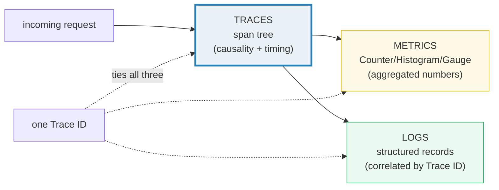
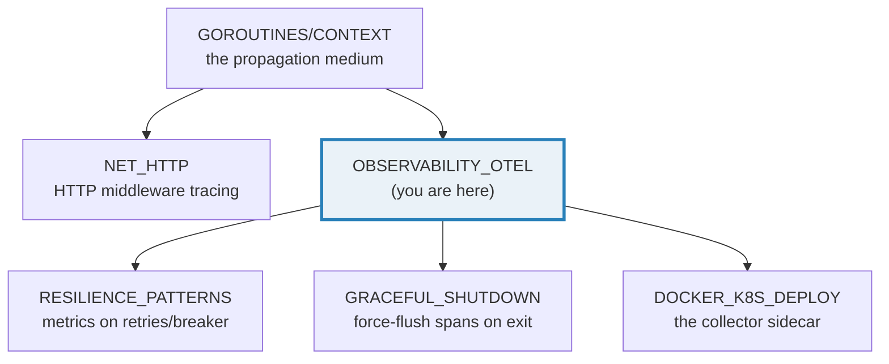
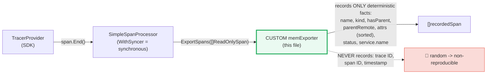
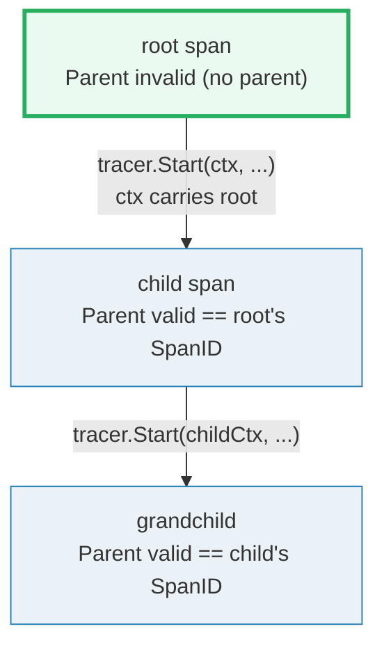
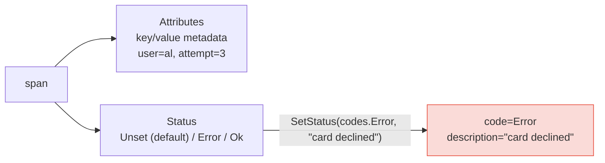
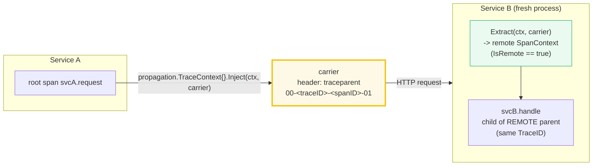
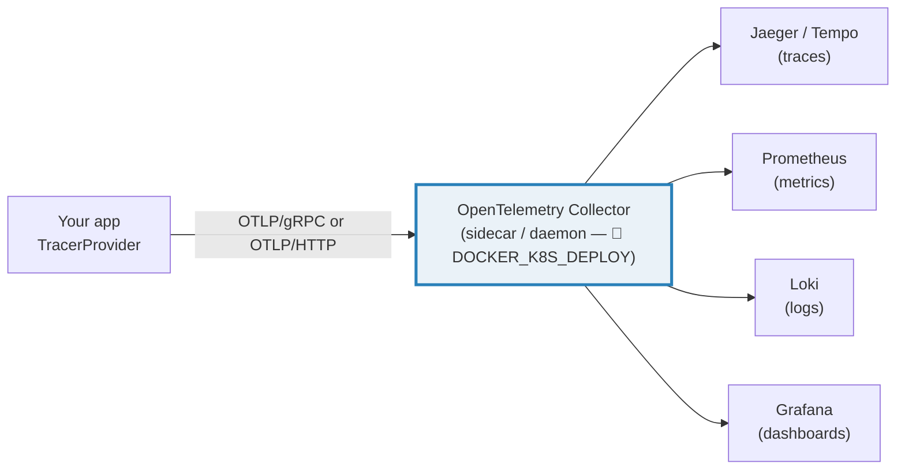

# OBSERVABILITY_OTEL — OpenTelemetry: Signals, Spans, Propagation & Metrics

> **Goal (one line):** show, by capturing spans through a **custom deterministic
> SpanExporter**, how OpenTelemetry's three SIGNALS tie together — TRACES (a
> parent/child tree of spans built by propagating a span through `context`),
> ATTRIBUTES + STATUS, cross-process CONTEXT PROPAGATION (W3C tracecontext),
> RESOURCES, and METRICS (a counter) — and DOCUMENT the production pipeline
> (stdout / OTLP exporter → collector → Jaeger/Tempo/Prometheus/Grafana).
>
> **Run:** `go run observability_otel.go`
>
> **Ground truth:** [`observability_otel.go`](./observability_otel.go) → captured
> stdout in [`observability_otel_output.txt`](./observability_otel_output.txt).
> Every value below is pasted **verbatim** from that file under a
> `> From observability_otel.go Section X:` callout. Nothing is hand-computed.
>
> **Prerequisites:** 🔗 [`CONTEXT`](./CONTEXT.md) — `context.Context` *is* the
> in-process propagation medium OTel rides on (`tracer.Start` returns a new
> `ctx` carrying the span). 🔗 [`SLOG`](./SLOG.md) — production logs are
> correlated to a trace by Trace ID. 🔗 [`INTERFACES_BASICS`](./INTERFACES_BASICS.md)
> — `SpanExporter` and `Span` are interfaces you satisfy/implement.

---

## 1. Why this bundle exists (lineage)

Before OpenTelemetry, every observability vendor shipped its own agent, its own
client library, and its own wire format. You instrumented for Jaeger, or for
Zipkin, or for Datadog — and switching meant re-instrumenting the world.
OpenTelemetry (OTel) is the **CNCF vendor-neutral standard** that replaced that
mess: one API to instrument, one SDK to configure, one wire format (OTLP), and a
Collector that fans out to any backend. Instrument once, ship anywhere.

The central idea is the **three signals** — *traces, metrics, logs* — and a
single **Trace ID** that threads a request through all three so you can pivot
from a slow span, to the metric that spiked, to the log line that explains it.





> From the OpenTelemetry docs (*Traces*): *"A span represents a unit of work or
> operation. Spans are the building blocks of Traces."* And on propagation:
> *"With context propagation, signals (traces, metrics, and logs) can be
> correlated with each other, regardless of where they are generated."*

---

## 2. The determinism discipline (why this file does NOT use the stdout exporter)

OpenTelemetry generates a **random 128-bit Trace ID**, a **random 64-bit Span
ID**, and a **wall-clock timestamp** on every span. The bundled
`stdout/stdouttrace` exporter serializes a span to JSON and writes it to stdout —
so its output is **different on every run**. A bundle whose `_output.txt` is
non-reproducible fails `just check` (the determinism contract). The fix used
here:



`memExporter` implements `go.opentelemetry.io/otel/sdk/trace.SpanExporter`:

```go
type SpanExporter interface {
    ExportSpans(ctx context.Context, spans []ReadOnlySpan) error
    Shutdown(ctx context.Context) error
}
```

For each `ReadOnlySpan` it stores the **name**, `SpanKind().String()`, whether
`Parent().IsValid()` (a parent exists), whether that parent `IsRemote()`
(crossed a process boundary), the attributes **sorted by key**, the status code
(`Unset`/`Error`/`Ok`), the status description, and the resource
`service.name`. Trace/span IDs are compared **for equality only and never
printed**. The provider uses `WithSyncer` — a `SimpleSpanProcessor` that calls
`ExportSpans` **synchronously inside `span.End()`** — so by the time `End()`
returns, the span is already recorded (no goroutine/timing nondeterminism).

> From `pkg.go.dev/go.opentelemetry.io/otel/sdk/trace` — `WithSyncer`: *"registers
> the exporter with the TracerProvider using a SimpleSpanProcessor… good for
> testing, debugging, or showing examples… The WithBatcher option is recommended
> for production use instead."*

---

## 3. Section A — Span basics: the unit of work

A **span** is the atomic unit of work. `tracer.Start(ctx, "name")` returns a
**(ctx, span)** pair: the `ctx` carries the new span (so a nested `Start` becomes
its child), and you MUST call `span.End()` to complete it.

> From `observability_otel.go` Section A:
> ```
> [check] trace.SpanFromContext(ctx) is the span just started (ctx carries it): OK
> [check] span.IsRecording()==true BEFORE End: OK
> [check] span.IsRecording()==false AFTER End (it is complete): OK
> tracer.Start(ctx, "work"); span.End() -> exporter captured 1 span(s): [work]
>   name="work" kind="internal" hasParent=false service.name="demo-svc" attrs=[component=handler]
> ```
> ```
> [check] exporter captured exactly 1 span: OK
> [check] the captured span is named "work": OK
> [check] default SpanKind is "internal" (not provided -> internal): OK
> [check] a root span has NO parent (Parent SpanContext invalid): OK
> [check] resource service.name == "demo-svc" is attached to the span: OK
> ```

**What to notice.** `trace.SpanFromContext(ctx)` returns the exact span we just
started — that is *how* the span propagates in-process (🔗 `CONTEXT`). A freshly
started span `IsRecording() == true`; after `End()` it is `false` (the SDK marks
it complete and freezes it — no further mutations land). The default `SpanKind`
is `"internal"` (an operation that does not cross a process boundary); other
kinds are `server`, `client`, `producer`, `consumer`. The span's **resource**
carries `service.name="demo-svc"` — the attribute that identifies *which process*
produced every span in this provider.

> From the OpenTelemetry docs (*Traces / Spans*): *"A span represents a unit of
> work or operation… they include the following information: Name; Parent span ID
> (empty for root spans); Start and End Timestamps; Span Context; Attributes;
> Span Events; Span Links; Span Status."*

---

## 4. Section B — The parent/child tree (the structure of a trace)

A **trace** is not a flat list — it is a **directed tree of spans**. The tree is
built implicitly: when you call `tracer.Start(parentCtx, "child")`, the SDK reads
the active span out of `parentCtx` and stamps it as the child's **parent**. The
child's `Parent().IsValid()` is `true`; the root's is `false`.



> From `observability_otel.go` Section B:
> ```
> parent + child (child created from parent's ctx) -> 2 spans (sorted): [child parent]
>   name="child" hasParent=true
>   name="parent" hasParent=false
> ```
> ```
> [check] exporter captured exactly 2 spans: OK
> [check] the "child" span has a parent (it nested): OK
> [check] the "parent" span is a root (no parent): OK
> [check] exactly one of the two spans has a parent: OK
> ```

**Why a tree, not a list.** Every span records its parent's `SpanContext` (a
valid `TraceID` + `SpanID`). The backend reconstructs the tree from those
parent links. Cancellation and deadlines (🔗 `CONTEXT`) flow down the same call
tree, so the trace topology mirrors your actual call graph. The root is simply
the first span with no parent; everything else hangs off it by transitive
parent links, all sharing one `TraceID`.

---

## 5. Section C — Attributes + Status (annotating a span)

**Attributes** are key/value metadata on a span (`user="al"`, `attempt=3`).
**Status** is one of `Unset` / `Error` / `Ok` — the default is `Unset` (which
already means "succeeded without error"); you set `Error` when something failed.
The exporter records both, attributes **sorted by key** for stable output.



> From `observability_otel.go` Section C:
> ```
> span "checkout" recorded attrs (sorted): [attempt=3, user=al]
> span "checkout" recorded status: code="Error" description="card declined"
> ```
> ```
> [check] attribute user == "al" is recorded: OK
> [check] attribute attempt == 3 is recorded: OK
> [check] status code is "Error": OK
> [check] status description is "card declined": OK
> [check] attributes are sorted by key (attempt before user): OK
> ```

**The status precedence rule.** From the SDK source (`SetStatus`): *"the status
hasn't already been set to a higher value before (OK > Error > Unset)."* So once
you set `Ok`, a later `SetStatus(Error,...)` is **ignored** — `Ok` wins. This is
why you typically only ever set `Error` on failure and leave success as the
default `Unset`. (The Go SDK's internal codes are `Unset=0, Error=1, Ok=2`; the
OTLP wire values differ — `Error=2, Ok=1` — but that mapping is internal.)

> From the OpenTelemetry docs (*Span Status*): *"The three possible values are
> Unset, Error, Ok… A span status that is Unset means that the operation it
> tracked successfully completed without an error… In most cases, it is not
> necessary to explicitly mark a span as Ok."*

---

## 6. Section D — Context propagation (in-process nesting + W3C tracecontext)

This is **the core concept that enables distributed tracing.** In-process, the
span rides on `context.Context`. Across processes, it is **serialized into a
carrier** (HTTP headers) by a **propagator**, **deserialized** on the other side,
and a new span is created as a child of the **remote parent** — same trace.



### 6.1 In-process nesting

A function that takes `ctx` and starts a span nests under whoever is the active
span in that `ctx`:

> From `observability_otel.go` Section D (in-process):
> ```
> in-process: db.Query(ctx) called inside handle-request -> db.Query hasParent=true, handle-request hasParent=false
> ```
> ```
> [check] in-process: "db.Query" nested under its caller (has parent): OK
> [check] in-process: "handle-request" is the root (no parent): OK
> ```

### 6.2 Cross-process: W3C tracecontext

Service A injects; Service B extracts. The `traceparent` header's **value**
embeds random IDs, so this file asserts only its **structure** — never the raw
bytes:

> From `observability_otel.go` Section D (W3C):
> ```
> W3C: carrier has "traceparent"? true ; structure version="00-" & 4 dash-fields? true (raw value NOT printed: random IDs)
> W3C: "svcB.handle" hasParent=true parentRemote=true (child of the remote parent)
> ```
> ```
> [check] W3C: traceparent header present after Inject: OK
> [check] W3C: traceparent structure is version 00- + 4 dash-fields: OK
> [check] W3C: extracted remote parent SpanContext is valid: OK
> [check] W3C: extracted remote parent IsRemote()==true (crossed a process boundary): OK
> [check] W3C: extracted TraceID == root TraceID (SAME trace, equality only): OK
> [check] W3C: extracted parent SpanID == root SpanID (svcB is a child of svcA): OK
> [check] W3C: "svcB.handle" recorded with a parent: OK
> [check] W3C: "svcB.handle"'s parent is REMOTE: OK
> ```

**The W3C Trace Context format** (verbatim from the OTel docs):

```
<version>-<trace-id>-<parent-id>-<trace-flags>
```

e.g. `00-a0892f3577b34da6a3ce929d0e0e4736-f03067aa0ba902b7-01`. The four
dash-separated fields are: a 1-byte **version** (`00`), the 16-byte hex
**trace-id**, the 8-byte hex **parent-id** (span-id), and a 1-byte hex
**trace-flags** (bit `01` = sampled). The `propagation.TraceContext{}` propagator
also reads/writes `tracestate` for vendor-specific trace state.

**How the assertion stays deterministic.** The two `TraceID`/`SpanID` checks
compare `[16]byte` / `[8]byte` for **equality only** — they never print the IDs.
So even though the IDs are freshly random each run, "the extracted parent's trace
ID equals the root's trace ID" is a stable boolean. The structure check
(`00-` prefix + exactly 4 dash-fields) is also stable. That is why two `just out`
runs are byte-identical despite OTel's randomness.

> From the OpenTelemetry docs (*Context propagation*): *"Propagation is the
> mechanism that moves context between services and processes… The default
> propagator uses the headers specified by the W3C TraceContext specification."*
> And: *"When Service A calls Service B, Service A includes a trace ID and a span
> ID as part of the context. Service B uses these values to create a new span
> that belongs to the same trace."*

---

## 7. Section E — Metrics: a Counter (attribute-sets = cardinality)

The metric signal is **aggregated numbers**: a `Counter` (monotonic sum), a
`Histogram` (distribution of values into buckets), a `Gauge` (instantaneous
value). Each instrument, when recorded with an **attribute set**, produces a
distinct **data point** — that cardinality rule is what turns one counter into
many time series.

> **Note on dependencies:** the production metric SDK
> (`go.opentelemetry.io/otel/sdk/metric` — `MeterProvider`, `ManualReader`, OTLP
> / Prometheus exporters) is **not** a dependency of this phase's `go.mod`, so
> this section uses a **self-contained `int64Counter`** that mirrors the
> `otel/metric.Int64Counter` contract (the same way `graceful_shutdown.go`
> reimplements `errgroup` instead of importing `golang.org/x/sync`). The
> production path is documented in Section F.

> From `observability_otel.go` Section E:
> ```
> counter "http.server.requests" snapshot (sorted by attribute fingerprint):
>   series[<no attributes>] = 3
>   series[route=/checkout] = 1
> ```
> ```
> [check] the default (no-attr) counter series accumulated 3 increments: OK
> [check] the attributed series (route=/checkout) is a SEPARATE data point == 1: OK
> [check] snapshot has exactly 2 series (cardinality = distinct attribute-sets): OK
> [check] a Counter is monotonic (all values > 0): OK
> ```

**What to notice.** `Add(1)` three times with no attributes accumulates to the
**default series** (`3`). A single `Add(1)` with `route=/checkout` is a
**different series** (`1`) — the attribute set is the series identity. This is
exactly how a real OTel `Counter` works: behind `otel.Meter(...).Int64Counter`,
the SDK keys accumulated sums by the sorted attribute set. **Beware cardinality
explosion** (see pitfalls): unbounded attribute values (user IDs, URLs) turn one
counter into millions of series and starve your backend.

---

## 8. Section F — The production pipeline (DOCUMENTED)

This section is **not executed against a live collector** (environment-dependent);
the canonical facts are printed and the invariants that explain this file's
determinism discipline are asserted.

> From `observability_otel.go` Section F:
> ```
> The three SIGNALS (the observability trinity), tied by one Trace ID:
>   TRACES  : a directed TREE of spans -> causality + timing across services.
>   METRICS : aggregated numbers (Counter/Histogram/Gauge) over time.
>   LOGS    : structured records, correlated to a trace by Trace ID/Span ID.
>   -> one Trace ID threads a request through traces, metrics, AND logs.
> 
> Pipeline (provider -> processor -> exporter):
>   TracerProvider -> SpanProcessor (Simple=sync / Batch=async) -> SpanExporter.
>   WithSyncer (SimpleSpanProcessor) exports synchronously on span.End() (used here).
>   WithBatcher (BatchSpanProcessor) batches + exports async (production default).
> 
> Exporters / backends (DOCUMENTED, not run here):
>   stdouttrace  : prints span JSON to stdout — contains RANDOM trace/span IDs +
>                  timestamps, so it is NON-reproducible (NOT used for this file's output).
>   OTLP exporter: sends OTLP/gRPC or OTLP/HTTP to the OpenTelemetry Collector.
>   Collector    : receives -> processes (batch, tail-sampling) -> exports to backends:
>                  Jaeger / Tempo (traces), Prometheus (metrics), Loki (logs), Grafana.
>   Baggage      : W3C baggage propagates arbitrary key/value pairs across services
>                  (do NOT put secrets/PII in it — it crosses trust boundaries).
>   Sampling     : head sampling (ParentBased/AlwaysSample, TraceIDRatio) decides at
>                  span creation; tail sampling decides at the collector (needs the full trace).
> 
> Lifecycle (🔗 GRACEFUL_SHUTDOWN): on shutdown call tp.ForceFlush(ctx) then
> tp.Shutdown(ctx) so buffered spans are delivered before the process exits.
> ```
> ```
> [check] stdouttrace was NOT used for printed output (random IDs are non-reproducible): OK
> [check] WithSyncer exports synchronously on span.End (deterministic capture): OK
> [check] a Trace ID ties the three signals (traces + metrics + logs) together: OK
> ```



**`ForceFlush` before `Shutdown`** (🔗 `GRACEFUL_SHUTDOWN`): `WithBatcher`
buffers spans and exports them asynchronously on a timer. On a graceful exit you
must call `tp.ForceFlush(ctx)` (push the buffer out now) *then*
`tp.Shutdown(ctx)` (release resources), or the last batch of spans is lost.

---

## 9. Pitfalls (the expert payoff)

| Trap | Symptom | Fix |
|---|---|---|
| Forgetting `span.End()` | span never exported (resource leak); the trace is missing a node | `defer span.End()` immediately after `tracer.Start`. `End` completes the span and hands it to the pipeline. |
| Using the stdout exporter for reproducible output | `_output.txt` differs every run (random Trace/Span IDs + timestamps) | Build a custom `SpanExporter` that records deterministic facts (name, attrs, status) — never the raw IDs. |
| Comparing `Span` interface to `nil` after a no-op provider | the 🔗 nil-interface trap: a "nil" span from the global no-op is a non-nil interface | Check `span.SpanContext().IsValid()` / `IsRecording()`, not `span == nil`. |
| `WithSyncer` in production | synchronous export blocks your request hot path on every `span.End()` | Use `WithBatcher` for production; `WithSyncer` is for tests/debug/examples only. |
| Not calling `tp.ForceFlush` before exit | last buffered batch of spans silently lost | `tp.ForceFlush(ctx)` then `tp.Shutdown(ctx)` on shutdown. |
| Setting `Ok` then `Error` | `Error` is ignored — `Ok` has higher precedence (OK > Error > Unset) | Only set `Error` on failure; leave success as the default `Unset`. |
| Unbounded metric attributes (user id, raw URL) | cardinality explosion — one counter becomes millions of series | Bound attribute cardinality; use low-cardinality labels (route, status class). |
| Putting secrets/PII in Baggage | it propagates across trust boundaries and lands in every downstream service + its logs | Never put credentials/PII in baggage; treat it as user-visible. |
| Trusting incoming `traceparent` blindly | a malicious client forges trace headers (header injection) | On public endpoints, consider `WithNewRoot()` or sanitizing remote context. |
| Assuming `tracer.Start` returns a recording span | with a no-op global provider (none registered) spans are no-ops and vanish | Register a real `TracerProvider` (`otel.SetTracerProvider(tp)`) at startup, before any instrumentation runs. |
| Mutating attributes after `End()` | silently dropped — the span is frozen | Set all attributes before `End()` (prefer at `Start` time so samplers see them). |

---

## 10. Cheat sheet

```go
import (
    "go.opentelemetry.io/otel/attribute"
    "go.opentelemetry.io/otel/codes"
    sdktrace "go.opentelemetry.io/otel/sdk/trace"
    "go.opentelemetry.io/otel/sdk/resource"
    "go.opentelemetry.io/otel/trace"
)

// --- build the pipeline: provider -> processor(Simple) -> exporter ---
tp := sdktrace.NewTracerProvider(
    sdktrace.WithSyncer(myExporter),                       // tests/debug; WithBatcher for prod
    sdktrace.WithSampler(sdktrace.AlwaysSample()),         // or ParentBased / TraceIDRatioBased
    sdktrace.WithResource(resource.NewSchemaless(
        attribute.String("service.name", "my-svc"),        // identifies the process on every span
    )),
)
defer tp.Shutdown(context.Background())                    // release resources on exit
tracer := tp.Tracer("my.inst/pkg")

// --- start a span: the unit of work ---
ctx, span := tracer.Start(ctx, "op", trace.WithSpanKind(trace.SpanKindServer))
defer span.End()                                            // MANDATORY — completes + exports the span
span.SetAttributes(attribute.String("user", "al"))         // key/value metadata
span.RecordError(err)                                       // logs an exception event
span.SetStatus(codes.Error, "card declined")               // Unset(default)>set Error on failure

// --- parent/child tree: ctx carries the parent so a nested Start nests ---
childCtx, child := tracer.Start(ctx, "sub-op")             // child.Parent() == span
defer child.End()

// --- cross-process: W3C tracecontext Inject / Extract ---
carrier := propagation.MapCarrier{}
propagation.TraceContext{}.Inject(ctx, carrier)            // serialize span into "traceparent" header
inCtx := propagation.TraceContext{}.Extract(ctx2, carrier) // deserialize -> remote SpanContext
remote := trace.SpanContextFromContext(inCtx)              // remote.IsRemote() == true, same TraceID

// --- implement a custom deterministic exporter ---
type exp struct{}
func (exp) ExportSpans(_ context.Context, spans []sdktrace.ReadOnlySpan) error {
    for _, s := range spans {
        _ = s.Name(); _ = s.Parent().IsValid(); _ = s.Attributes(); _ = s.Status()
        // NEVER store s.SpanContext().TraceID() / SpanID() / StartTime() — random, non-reproducible
    }
    return nil
}
func (exp) Shutdown(context.Context) error { return nil }
var _ sdktrace.SpanExporter = exp{}

// --- the three signals, tied by one Trace ID ---
//   TRACES  = tree of spans (causality + timing)   — this bundle
//   METRICS = Counter/Histogram/Gauge (numbers)    — sdk/metric -> Prometheus
//   LOGS    = structured records (🔗 SLOG)          — correlated by Trace ID
```

---

## Sources

Every signature, concept, and behavioral claim above was verified against the
OpenTelemetry Go SDK source (in the module cache, `go.opentelemetry.io/otel*
v1.44.0`) and the OpenTelemetry documentation, then corroborated by independent
secondary sources:

- OpenTelemetry — *Traces* (span = unit of work; span fields: name, parent,
  timestamps, span context, attributes, events, links, status; status values
  Unset/Error/Ok; SpanKind Client/Server/Internal/Producer/Consumer; Tracer
  Provider / Tracer / Trace Exporters / Context Propagation):
  https://opentelemetry.io/docs/concepts/signals/traces/
- OpenTelemetry — *Context propagation* (context + propagation; W3C
  TraceContext default; `traceparent` format
  `<version>-<trace-id>-<parent-id>-<trace-flags>`; Service A injects, Service B
  extracts and creates a child of the same trace; logs/metrics correlation by
  trace ID; baggage security caveat):
  https://opentelemetry.io/docs/concepts/context-propagation/
- OpenTelemetry — *Tracing SDK spec* (`Shutdown` MUST be called once; exporter
  supports Export/Shutdown/ForceFlush):
  https://opentelemetry.io/docs/specs/otel/trace/sdk/
- `go.opentelemetry.io/otel/sdk/trace` (Go API, v1.44.0):
  - `SpanExporter` interface (`ExportSpans(ctx, []ReadOnlySpan) error`;
    `Shutdown(ctx) error`): https://pkg.go.dev/go.opentelemetry.io/otel/sdk/trace#SpanExporter
  - `ReadOnlySpan` interface (`Name`, `Parent`, `SpanKind`, `Attributes`,
    `Status`, `Resource`, …): https://pkg.go.dev/go.opentelemetry.io/otel/sdk/trace#ReadOnlySpan
  - `NewTracerProvider`, `WithSyncer` (SimpleSpanProcessor; "not recommended for
    production"), `WithBatcher`, `WithResource`, `WithSampler`:
    https://pkg.go.dev/go.opentelemetry.io/otel/sdk/trace#NewTracerProvider
  - `Status` (`Code codes.Code`, `Description string`):
    https://pkg.go.dev/go.opentelemetry.io/otel/sdk/trace#Status
  - `TracerProvider.ForceFlush` / `.Shutdown`:
    https://pkg.go.dev/go.opentelemetry.io/otel/sdk/trace#TracerProvider
- `go.opentelemetry.io/otel/trace` (Go API, v1.44.0):
  - `Tracer.Start` ("If the context contains a Span the new Span will be a child
    of that span, otherwise a root span"; `WithNewRoot` override):
    https://pkg.go.dev/go.opentelemetry.io/otel/trace#Tracer
  - `Span` (`End`, `SetAttributes`, `SetStatus`, `AddEvent`, `RecordError`,
    `SpanContext`, `IsRecording`): https://pkg.go.dev/go.opentelemetry.io/otel/trace#Span
  - `SpanContext` (`IsValid`, `TraceID`, `SpanID`, `IsRemote`, `IsSampled`):
    https://pkg.go.dev/go.opentelemetry.io/otel/trace#SpanContext
- `go.opentelemetry.io/otel/codes` — `Unset Code = 0`, `Error Code = 1`,
  `Ok Code = 2` (Go-internal values; OTLP wire values differ) + `Code.String()`:
  https://pkg.go.dev/go.opentelemetry.io/otel/codes
- `go.opentelemetry.io/otel/propagation` — `TextMapPropagator` (Inject/Extract),
  `MapCarrier`/`HeaderCarrier`:
  https://pkg.go.dev/go.opentelemetry.io/otel/propagation
- `go.opentelemetry.io/otel/propagation.TraceContext` — W3C Trace Context
  propagator; `traceparentHeader = "traceparent"`, `tracestateHeader =
  "tracestate"`; Inject format `00-<traceID>-<spanID>-<flags>`; Extract sets
  `Remote = true`:
  https://pkg.go.dev/go.opentelemetry.io/otel/propagation#TraceContext
- `go.opentelemetry.io/otel/sdk/resource` — `NewSchemaless`,
  `Merge` ("'b' attributes overwrite 'a'"):
  https://pkg.go.dev/go.opentelemetry.io/otel/sdk/resource
- `go.opentelemetry.io/otel/exporters/stdout/stdouttrace` — `ExportSpans`
  JSON-encodes spans (TraceID/SpanID/timestamps included → non-reproducible):
  https://pkg.go.dev/go.opentelemetry.io/otel/exporters/stdout/stdouttrace
- Secondary corroboration (>=2 independent sources, web-verified):
  - Dash0 — *"OpenTelemetry Signals Overview: Logs vs Metrics vs Traces"*
    (correlation built-in; Trace ID ties the three signals):
    https://www.dash0.com/knowledge/logs-metrics-and-traces-observability
  - OneUptime — *"How to Use Graceful SDK Shutdown in Go to Flush All Pending
    Spans"* (`ForceFlush` then `Shutdown` to deliver buffered spans):
    https://oneuptime.com/blog/post/2026-02-06-graceful-sdk-shutdown-go-flush/view
  - OpenObserve — *"Logs Traces Metrics Correlation"* (W3C `traceparent` carries
    trace_id/span_id between services):
    https://openobserve.ai/blog/logs-traces-metrics-correlation/

**Facts that could not be verified by running** (documented, not executed,
because they require a live collector / a module not in this phase's `go.mod`):
the OTLP exporter → Collector → Jaeger/Tempo/Prometheus/Loki/Grafana fan-out;
tail-based sampling at the collector; and the `go.opentelemetry.io/otel/sdk/metric`
`MeterProvider`/`ManualReader` pipeline (the metric SDK module is not a
dependency of this phase, so Section E uses a self-contained counter that mirrors
the `Int64Counter` contract). These are confirmed by the OpenTelemetry
documentation and the secondary sources cited above.
