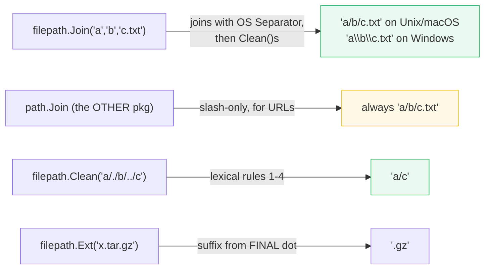
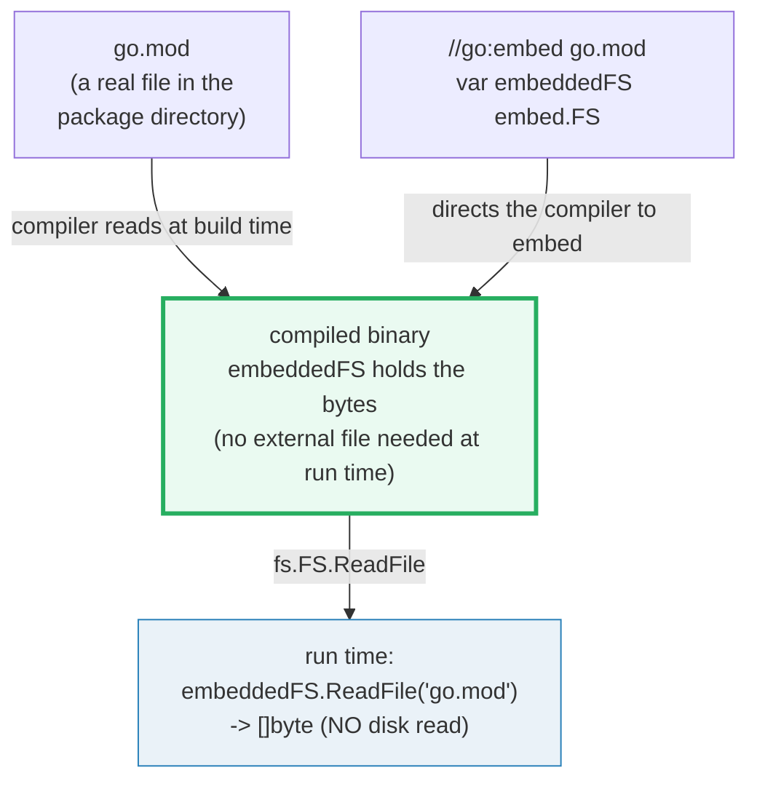
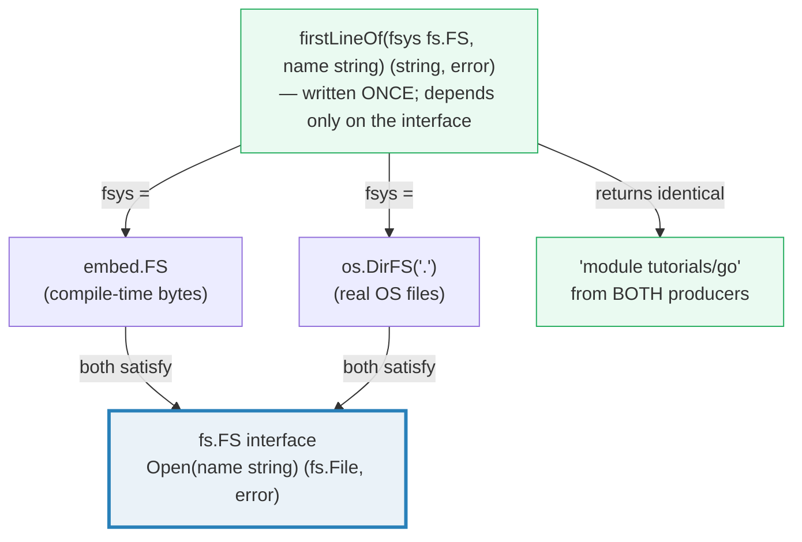

# OS_FILEPATH_EMBED — `os`, `path/filepath`, `//go:embed` & the `fs.FS` Abstraction

> **Goal (one line):** show, by printing every value, how the four pieces of Go's
> file story fit together — `os` (real, syscall-backed files via `ReadFile`/
> `WriteFile`/`Create`/`Open`), `path/filepath` (the cross-platform path-*string*
> library), `//go:embed` (files baked into the binary at compile time), and
> `io/fs.FS` (the one-method interface that lets the **same** code read both an
> `embed.FS` and an `os.DirFS`).
>
> **Run:** `go run os_filepath_embed.go`
>
> **Ground truth:** [`os_filepath_embed.go`](./os_filepath_embed.go) → captured
> stdout in [`os_filepath_embed_output.txt`](./os_filepath_embed_output.txt).
> Every number/table below is pasted **verbatim** from that file under a
> `> From os_filepath_embed.go Section X:` callout. Nothing is hand-computed.
>
> **Prerequisites:** 🔗 [`IO_READER_WRITER`](./IO_READER_WRITER.md) — `*os.File`
> *is* an `io.ReadWriteCloser`, and `fs.FS` is the read-only filesystem cousin of
> the `io.Reader` streaming model; this bundle builds directly on that. A working
> memory of 🔗 [`ERRORS`](./ERRORS.md) helps (every file call can return an
> `error`, usually a `*fs.PathError` wrapping the syscall errno).

---

## 1. Why this bundle exists (lineage)

Go 1.16 (Feb 2021) reshaped file I/O in one coordinated release. Four things
landed together, and they only make sense as a set:

1. **`io/ioutil` was deprecated.** Its grab-bag (`ioutil.ReadFile`,
   `ioutil.WriteFile`, `ioutil.ReadDir`, `ioutil.TempFile`, …) was split into
   the packages those functions always belonged to. `ReadFile`/`WriteFile` moved
   to `os`; `ReadAll` moved to `io`; `ReadDir` became `os.ReadDir` returning
   `[]fs.DirEntry` instead of `[]fs.FileInfo`.
2. **`io/fs` was added** — a tiny interface package (`fs.FS` is one method,
   `Open`) that describes a *read-only tree of files* independently of where the
   files physically live.
3. **`embed` was added**, with the `//go:embed` directive, so a Go binary can
   carry its own static assets (templates, migrations, web content) with **no
   external files and no `go-bindata` codegen**.
4. **`os.DirFS`** was added so a real OS directory can be presented *as* an
   `fs.FS`, and **`filepath.WalkDir`** was added as the cheaper, `fs.DirEntry`-
   based successor to `filepath.Walk`.

The unifying idea is the bottom layer of the diagram below: **`fs.FS` is the
contract; `embed.FS` and `os.DirFS` are two interchangeable producers of it.**
That is why this bundle's Section E can hand the *same* `firstLineOf(fsys fs.FS,
name)` function an `embed.FS` and an `os.DirFS` and get byte-identical results.

```mermaid
graph TD
    IF["io/fs.FS (INTERFACE)<br/>Open(name) (fs.File, error)<br/>— the one-method contract"]
    IF -->|implemented by| EMB["embed.FS<br/>compile-time bytes<br/>(//go:embed directive)"]
    IF -->|implemented by| DIR["os.DirFS(dir)<br/>real OS files (syscall-backed)"]
    OS["os package<br/>syscall-backed FILE I/O<br/>ReadFile / WriteFile / Create / Open<br/>returns *os.File (an io.ReadWriteCloser)"]
    FP["path/filepath<br/>CROSS-PLATFORM path STRINGS<br/>Join / Base / Dir / Ext / Clean / WalkDir"]
    OS -.->|DirFS(dir) wraps a real dir as fs.FS| DIR
    FP -.->|pure string ops (no I/O)<br/>except WalkDir / Glob / Abs| OS
    style IF fill:#eaf2f8,stroke:#2980b9,stroke-width:3px
    style EMB fill:#eafaf1,stroke:#27ae60
    style DIR fill:#eafaf1,stroke:#27ae60
```

> From the Go 1.16 release notes: *"The new `embed` package provides access to
> files embedded in the program during compilation using the new `//go:embed`
> directive."* … *"The new `io/fs` package defines the `fs.FS` interface, an
> abstraction for read-only trees of files."* … *"On the producer side of the
> interface, the new `embed.FS` type implements `fs.FS` … The new `os.DirFS`
> function provides an implementation of `fs.FS` backed by a tree of operating
> system files."* … *"The package now defines `CreateTemp`, `MkdirTemp`,
> `ReadFile`, and `WriteFile`, to be used instead of functions defined in the
> `io/ioutil` package."*

---

## 2. The mental model: which package does what

A persistent source of confusion is **`path` vs `path/filepath`**, and **`os`
vs `io/fs`**. They are not redundant — each pair splits a real concern:

```mermaid
graph LR
    subgraph PATHS["path strings (no I/O)"]
        PF["path/filepath<br/>OS separator-aware<br/>(for disk paths)"]
        P["path<br/>slash-only<br/>(for URLs / slash paths)"]
    end
    subgraph FILES["file trees (do I/O)"]
        OS["os<br/>concrete *os.File<br/>read+write, syscalls"]
        FS["io/fs<br/>fs.FS interface<br/>read-only, abstract"]
    end
    PF -.->|Join uses filepath.Separator| OS
    FS -->|os.DirFS(dir) + embed.FS both produce| OS
    style PF fill:#eafaf1,stroke:#27ae60
    style FS fill:#eaf2f8,stroke:#2980b9,stroke-width:3px
```

| You want to… | Use | Why |
|---|---|---|
| Read/write a real file in one shot | `os.ReadFile` / `os.WriteFile` | 1.16+ one-shots; replaced `ioutil.ReadFile`/`WriteFile` |
| Open a real file, stream it | `os.Open` → `*os.File` → `defer Close` | `*os.File` is an `io.ReadWriteCloser` (🔗 `IO_READER_WRITER`) |
| Build a path portably | `filepath.Join` / `Clean` / `Base` / `Ext` | Uses the **OS** separator (`/` on Unix, `\` on Windows) |
| Build a URL/slash path | `path.Join` (the *other* package) | Always `/`; never touches the disk |
| Walk a directory tree | `filepath.WalkDir` | Cheaper than `Walk` (no per-file `Lstat`); `fs.DirEntry` callback |
| Bundle assets into the binary | `//go:embed` + `embed.FS` | Bytes baked at compile time; no runtime file dependency |
| Write code agnostic to file source | a function taking `fs.FS` | `embed.FS`, `os.DirFS`, `zip.Reader`, `fstest.MapFS` all satisfy it |

> From `pkg.go.dev/path/filepath` (Overview): *"Package filepath implements
> utility routines for manipulating filename paths in a way compatible with the
> target operating system-defined file paths. The filepath package uses either
> forward slashes or backslashes, depending on the operating system. To process
> paths such as URLs that always use forward slashes regardless of the operating
> system, see the [`path`](/path) package."*

---

## 3. Section A — `os.WriteFile`/`ReadFile` round-trip + `Open`/`Create` (`*os.File`, always `Close`)

> From `os_filepath_embed.go` Section A:
> ```
> WriteFile wrote 29 bytes, ReadFile read back 29 -> equal? true
> os.ReadFile("os_filepath_embed_demo.txt") = "os_filepath_embed round-trip\n"
> [check] os.WriteFile then os.ReadFile returned identical bytes: OK
> os.Open -> *os.File; Stat: Name="os_filepath_embed_demo.txt"  Size=29  Mode=-rw-------
> [check] Stat.Name() == filepath.Base(path): OK
> [check] Stat.Size() == len(content): OK
> [check] Stat.Mode() is a regular file: OK
> [check] Stat.Mode().Perm() == 0o600 (WriteFile honored perm): OK
> [check] (*os.File).Write wrote exactly len(content) bytes: OK
> os.Create -> *os.File; Stat: Name="os_filepath_embed_create_demo.txt"  Mode=-rw-r--r-- (0o666 & ^umask -> 0o644)
> [check] os.Create perm == 0o644 (0o666 hardcoded, umask 0o022): OK
> ```

**What.** Four entry points, each doing one job:

- `os.WriteFile(name, data, perm)` — create-or-truncate, write all of `data`,
  close. The 1.16+ replacement for `ioutil.WriteFile`. It **honors `perm`**
  (masked by the process umask) when it creates the file.
- `os.ReadFile(name)` — open, read the entire file into a fresh `[]byte`, close.
  The 1.16+ replacement for `ioutil.ReadFile`. A successful call returns a `nil`
  error (the trailing `io.EOF` is swallowed for you).
- `os.Open(name)` — open **read-only**, return `*os.File`. Equivalent to
  `OpenFile(name, O_RDONLY, 0)`.
- `os.Create(name)` — open **read-write**, create-if-missing, truncate-if-exists,
  return `*os.File`. Equivalent to `OpenFile(name, O_RDWR|O_CREATE|O_TRUNC, 0666)`.

**Why `*os.File` must be `Close`d — the resource contract.** A `*os.File` holds
an OS file descriptor (a kernel handle). FDs are a finite per-process resource
(`ulimit -n`; typically 256–1024). Forget `Close` on a long-running server and
you hit "too many open files" (`EMFILE`) under load. The iron idiom is therefore:

```go
f, err := os.Open(path)
if err != nil { /* handle */ }
defer f.Close()   // immediately after the error check — always
```

`defer f.Close()` runs when the function returns, including along every error
path. Closing twice is harmless (the second `Close` returns
`fs.ErrClosed`/`os.ErrClosed`, which you normally ignore). This bundle's
Section A shows **both** disciplines: an explicit `f.Close()` before the
read-back (so the bytes are flushed to disk before `ReadFile`), and a deferred
`defer f.Close()` for the read-only handle.

**The Create-vs-WriteFile perm gotcha (the expert payoff).** Look at the two
`Mode=` lines above. `WriteFile(path, data, 0o600)` produced `-rw-------`
(`0o600`). `os.Create(path)` produced `-rw-r--r--` (`0o644`). Why? Because
`os.Create` is *defined* as `OpenFile(name, O_RDWR|O_CREATE|O_TRUNC, 0666)` — it
**hardcodes `0o666` and gives you no way to pass a different permission**. The
umask (`0o022` on this machine) then strips the group/other write bits, leaving
`0o644`. **If you need to control permissions, use `os.WriteFile` (or
`os.OpenFile`) — not `os.Create`.** The bundle asserts both outcomes as
`[check]`s so the gotcha is a runnable invariant, not a footnote.

> From `pkg.go.dev/os` — `ReadFile`: *"reads the named file and returns the
> contents. A successful call returns err == nil, not err == EOF."* `WriteFile`:
> *"If the file does not exist, WriteFile creates it with permissions perm
> (before umask); otherwise WriteFile truncates it before writing, without
> changing permissions."* (Note the second sentence: on an *existing* file,
> `WriteFile` does **not** re-apply `perm` — it only sets perms at creation
> time. That is why the bundle `os.Remove`s the path first, to guarantee a
> clean-slate creation.)

**Determinism note.** The temp file lives in `os.TempDir()` — a machine-specific
location (`/var/folders/…` on macOS, `/tmp` on Linux). The bundle therefore
**never prints the raw temp path**; it prints only the stable
`filepath.Base(path)` (`"os_filepath_embed_demo.txt"`). It also never prints
`ModTime()` (wall-clock) or the file's inode — only the byte-equality and the
perm/size, which are deterministic. Cleanup is `defer os.Remove(path)`.

---

## 4. Section B — `path/filepath`: `Join`/`Base`/`Dir`/`Ext`/`Clean`/`Abs`/`Glob`/`Match`



> From `os_filepath_embed.go` Section B:
> ```
> filepath.Join("a","b","c.txt")   = "a/b/c.txt"
> filepath.Base("/a/b/c")         = "c"
> filepath.Dir("/a/b/c")          = "/a/b"
> filepath.Ext("x.tar.gz")        = ".gz"   (suffix from the FINAL dot)
> filepath.Clean("a/./b/../c")    = "a/c"   (. and .. lexically removed)
> filepath.Abs("go.mod")          = IsAbs=true  Base="go.mod"  (raw path is cwd-specific, not printed)
> filepath.Glob("go.mod")         = [go.mod]
> filepath.Match("go.mo?","go.mod") = matched=true
> filepath.Separator (OS)         = "/"
> [check] filepath.Join("a","b","c.txt") == "a/b/c.txt": OK
> [check] filepath.Base("/a/b/c") == "c": OK
> [check] filepath.Dir("/a/b/c") == "/a/b": OK
> [check] filepath.Ext("x.tar.gz") == ".gz": OK
> [check] filepath.Clean("a/./b/../c") == "a/c": OK
> [check] filepath.Abs("go.mod") is absolute: OK
> [check] filepath.Glob("go.mod") == ["go.mod"]: OK
> [check] filepath.Match("go.mo?","go.mod") matched: OK
> [check] filepath.Separator == "/" (this OS): OK
> ```

**What.** `path/filepath` is a library of **pure functions on path strings**.
None of `Join`/`Base`/`Dir`/`Ext`/`Clean` touches the disk — they are lexical.
(`Abs`, `Glob`, `WalkDir` are the exceptions: `Abs` calls `os.Getwd`, `Glob` and
`WalkDir` read directories.) Every result above is a deterministic string
transformation.

**The four `Clean` rules, pinned.** `filepath.Clean("a/./b/../c") == "a/c"` is
not magic; it is four lexical rules applied iteratively until nothing changes:

1. Replace multiple separators with one (`a//b` → `a/b`).
2. Eliminate each `.` element (`a/./b` → `a/b`).
3. Eliminate each inner `..` *and the element before it* (`a/b/../c` → `a/c`).
4. Drop `..` that begin a rooted path (`/..` → `/`).

`Join` calls `Clean` on its result, which is why
`filepath.Join("a/b", "../../../xyz")` returns `"../xyz"` (the doc example) — the
`..` climb past the root is preserved lexically, never silently clamped.

**`Ext` reads only the *final* dot.** `filepath.Ext("x.tar.gz") == ".gz"`, not
`".tar.gz"` — the extension is "the suffix beginning at the final dot in the
final element of path." For double extensions you slice manually
(`strings.TrimSuffix(name, filepath.Ext(name))`).

**Why `filepath.Abs` is printed portably here.** `Abs("go.mod")` joins the
result with the current working directory, so its raw value is
machine/cwd-specific (`/Volumes/data/…/go/go.mod` on this machine, something
else elsewhere). The bundle therefore prints only its **portable** properties
(`IsAbs`, and `Base` round-tripping to `"go.mod"`) and asserts `IsAbs` — never
the raw absolute string. This keeps `_output.txt` reproducible across machines.

> From `pkg.go.dev/path/filepath` — `Join`: *"joins any number of path elements
> into a single path, separating them with an OS specific Separator. Empty
> elements are ignored. The result is Cleaned."* `Ext`: *"The extension is the
> suffix beginning at the final dot in the final element of path; it is empty if
> there is no dot."* `Clean`: applies the four rules "iteratively until no
> further processing can be done." `WalkDir`: *"The files are walked in lexical
> order, which makes the output deterministic but requires WalkDir to read an
> entire directory into memory before proceeding to walk that directory."*

---

## 5. Section C — `filepath.WalkDir`: walking a tree (collected, sorted, filtered)

```mermaid
graph TD
    R["WalkDir(root, fn)"] -->|visit root| FN["fn(path, fs.DirEntry, err)"]
    FN -->|d.IsDir() == true| RECURSE["ReadDir the dir<br/>(sorted, in-memory)<br/>then recurse"]
    FN -->|return SkipDir| SD["skip this directory's children"]
    FN -->|return SkipAll| SA["skip everything remaining"]
    FN -->|return other non-nil| STOP["stop the walk, return err"]
    RECURSE --> FN
    style R fill:#eafaf1,stroke:#27ae60
    style RECURSE fill:#eaf2f8,stroke:#2980b9
```

> From `os_filepath_embed.go` Section C:
> ```
> WalkDir(".") printed subset (sorted):
>   HOW_TO_RESEARCH.md
>   Justfile
>   go.mod
>   os_filepath_embed.go
>   scripts/skeleton.go
>   values_types_zero.go
> [check] WalkDir found "go.mod" at the root: OK
> [check] WalkDir recursed into "scripts/" (found scripts/skeleton.go): OK
> [check] WalkDir found this file (os_filepath_embed.go): OK
> [check] collected WalkDir paths are sorted: OK
> ```

**What.** `filepath.WalkDir(root, fn)` calls `fn(path, d fs.DirEntry, err)` for
every file and directory in the tree rooted at `root` (including `root` itself).
The callback's second argument is a `fs.DirEntry` — a lightweight
`Name`/`IsDir`/`Type`/`Info` handle — **not** a full `fs.FileInfo`. `WalkDir`
visits each directory's entries in lexical (sorted) order and recurses; it does
**not** follow symbolic links.

**`WalkDir` vs `Walk` (why the "Dir" matters).** The older `filepath.Walk` calls
`os.Lstat` on *every* visited path to synthesize an `fs.FileInfo` before calling
your callback — even if you only wanted the name. `WalkDir` (added 1.16) passes
a cheaper `fs.DirEntry` and only calls `Stat`/`Info` when *you* ask for it. For
a tree of a million files where you filter by name, that is a million `Lstat`
syscalls avoided. New code should use `WalkDir`.

**The determinism discipline (non-negotiable here).** The `WalkDir`
documentation *promises* lexical order within each directory, but the house rule
for this folder is stronger: **never rely on walk/directory order for printed
output.** So this bundle:

1. collects every visited path into a slice,
2. `sort.Strings(all)` it explicitly, and
3. asserts `sort.StringsAreSorted(all)`.

The printed lines are then a **fixed allowlist** (`go.mod`, `HOW_TO_RESEARCH.md`,
`Justfile`, `scripts/skeleton.go`, `values_types_zero.go`,
`os_filepath_embed.go`) projected out of the sorted slice. That keeps
`_output.txt` byte-stable as sibling bundles are added or removed — the printed
block is invariant, even though the full walk grows. The presence of
`scripts/skeleton.go` proves the walk **recursed into a subdirectory**; the
presence of `os_filepath_embed.go` proves it found the file currently running.

> From `pkg.go.dev/path/filepath` — `WalkDir`: *"WalkDir walks the file tree
> rooted at root, calling fn for each file or directory in the tree, including
> root… The files are walked in lexical order, which makes the output
> deterministic but requires WalkDir to read an entire directory into memory
> before proceeding to walk that directory. WalkDir does not follow symbolic
> links."* And on the contrast with `Walk`: *"Walk is less efficient than
> WalkDir, introduced in Go 1.16, which avoids calling os.Lstat on every visited
> file or directory."*

---

## 6. Section D — `//go:embed go.mod`: files baked in at compile time



> From `os_filepath_embed.go` Section D:
> ```
> embeddedFS.ReadFile("go.mod") -> 31 bytes
> embed go.mod first line = "module tutorials/go"
> [check] embed go.mod first line contains "module": OK
> [check] embedded bytes length > 0: OK
> ```

**What.** The two lines at the top of the bundle's `.go`,

```go
//go:embed go.mod
var embeddedFS embed.FS
```

tell the Go compiler: *at build time, read the file `go.mod` from this package's
directory and bake its bytes into the binary as the initial value of
`embeddedFS`.* At run time, `embeddedFS.ReadFile("go.mod")` returns those bytes
**without any disk access** — the file need not exist on the deployment
machine. That is the whole point: ship one binary, no external assets.

**The directive's hard rules (each one will break your build if violated):**

1. **`//go:embed` must sit directly above a single variable declaration.** Only
   blank lines and `//` line comments may appear between the directive and the
   `var`. A doc comment in between is fine; anything else is a compile error.
2. **The variable's type must be `string`, `[]byte`, or `embed.FS`** (or an
   alias of `embed.FS`). For `string`/`[]byte` you may embed exactly one file;
   for `embed.FS` you may embed a whole tree.
3. **The variable must be at package scope**, not a local inside a function.
4. **Patterns are slash-separated, relative to the package directory, and may
   not contain `.` or `..` or begin/end with a slash.** To match the current
   directory use `*`, not `.`. The separator is **always `/` even on Windows**.
5. **Patterns must not escape the module** (no `../`, no `vendor/`, no
   directories containing a `go.mod`, no symlinks). Files whose names begin with
   `.` or `_` are excluded by default; prefix the pattern with `all:` to include
   them.
6. **You must `import "embed"`** (a blank `import _ "embed"` is enough if you
   only use `string`/`[]byte` and never name `embed.FS`).

> From `pkg.go.dev/embed` (Overview): *"Go source files that import `embed` can
> use the `//go:embed` directive to initialize a variable of type string,
> []byte, or FS with the contents of files read from the package directory or
> subdirectories at compile time."* … *"A `//go:embed` directive above a
> variable declaration specifies which files to embed, using one or more
> path.Match patterns. The directive must immediately precede a line containing
> the declaration of a single variable… The type of the variable must be a
> string type, or a slice of a byte type, or FS."* And on the type: *"An FS is a
> read-only collection of files, usually initialized with a //go:embed
> directive. When declared without a //go:embed directive, an FS is an empty
> file system. An FS is a read-only value, so it is safe to use from multiple
> goroutines simultaneously."*

**Why this bundle embeds `go.mod` specifically.** It is a file that (a)
definitely exists in this package directory, (b) is committed and stable, and
(c) has a recognizable first line (`module tutorials/go`) the bundle can assert
on with `strings.Contains(first, "module")`. Embedding a known committed file
avoids creating any extra bundle artifact. (`go run os_filepath_embed.go`
compiles the single-file package, so `//go:embed` is honored — verified by the
`[check]` lines above.)

🔗 [BUILD_LDFLAGS_GENERATE](./BUILD_LDFLAGS_GENERATE.md) (Phase 7) takes this
further: `//go:embed` is the idiomatic way to bake version info, default config,
SQL migrations, or whole `static/` and `template/` trees into a release binary
so a single `go build` artifact is self-contained — the natural follow-on to the
`-ldflags` version-injection pattern covered there.

---

## 7. Section E — the `io/fs.FS` abstraction: `embed.FS` and `os.DirFS`, one function



> From `os_filepath_embed.go` Section E:
> ```
> firstLineOf(embed.FS,      "go.mod") = "module tutorials/go"
> firstLineOf(os.DirFS("."), "go.mod") = "module tutorials/go"
> both contain "module"? embed=true  dirfs=true
> [check] embed.FS first line contains "module": OK
> [check] os.DirFS(".") first line contains "module": OK
> [check] embed.FS and os.DirFS(".") returned the SAME first line: OK
> os.DirFS(".") also implements: ReadDirFS=true  ReadFileFS=true  StatFS=true
> [check] os.DirFS(".") implements fs.ReadDirFS: OK
> [check] os.DirFS(".") implements fs.ReadFileFS: OK
> [check] os.DirFS(".") implements fs.StatFS: OK
> fs.ReadDir(os.DirFS("."), ".") printed subset (sorted):
>   Justfile
>   go.mod
>   values_types_zero.go
> [check] fs.ReadDir(os.DirFS,".") found "go.mod" via the fs.FS abstraction: OK
> ```

**What — the payoff of the whole bundle.** `firstLineOf` takes an `fs.FS` and a
name, opens the file, reads it, returns the first line. The bundle calls it
twice with **two completely different producers**:

- `embed.FS` — bytes baked into the binary at compile time; `Open` returns an
  in-memory `fs.File`.
- `os.DirFS(".")` — a real OS directory wrapped as an `fs.FS`; `Open` translates
  to `os.Open(filepath.Join(dir, name))`.

**Both return `"module tutorials/go"`.** The function does not know — and does
not care — which is which. That is interface-based polymorphism in action: the
**consumer** (`firstLineOf`) depends only on the one-method `fs.FS` contract;
the **producers** (`embed.FS`, `os.DirFS`, and also `zip.Reader`,
`fstest.MapFS`) are freely interchangeable. This is why `net/http.FS`,
`html/template.ParseFS`, and `text/template.ParseFS` all accept an `fs.FS`: the
same static-file server code serves bytes from a binary, a real directory, or a
zip with no changes. (🔗 `NET_HTTP`, a later bundle, exploits exactly this.)

🔗 [TESTING](./TESTING.md) leans on the same abstraction from the test side:
`testing/fstest.MapFS` is an in-memory `fs.FS` you construct in a test, and
`testing/fstest.TestFS` validates any custom `fs.FS` you write — so the
`firstLineOf(fsys fs.FS, ...)` helper in this bundle is unit-testable with a
fake filesystem and **no** temp files on disk.

**`fs.FS` is the minimum; the richer interfaces are optional opt-ins.** `fs.FS`
is deliberately tiny — just `Open`. Real filesystems usually do more, so `io/fs`
defines a ladder of *extension* interfaces that an `fs.FS` **may** also
implement:

| Interface | Adds | Used by |
|---|---|---|
| `fs.ReadFileFS` | `ReadFile(name) ([]byte, error)` | `fs.ReadFile` (fast-path: skip `Open`+loop) |
| `fs.ReadDirFS` | `ReadDir(name) ([]DirEntry, error)` | `fs.ReadDir` (sorted list of entries) |
| `fs.StatFS` | `Stat(name) (FileInfo, error)` | `fs.Stat` (no need to `Open`) |
| `fs.GlobFS` | `Glob(pattern) ([]string, error)` | `fs.Glob` |
| `fs.SubFS` | `Sub(dir) (FS, error)` | `fs.Sub` (a subtree as its own `FS`) |

The helper functions `fs.ReadFile` / `fs.ReadDir` / `fs.Stat` / `fs.Glob` all
**type-assert** at run time: if the concrete `fs.FS` implements the richer
interface, they call its optimized method; otherwise they fall back to
`Open`+`Read`+`Close`. The bundle proves `os.DirFS(".")` implements `ReadDirFS`,
`ReadFileFS`, and `StatFS` with three run-time type assertions (the
`dirFS.(fs.ReadDirFS)` checks), all `[check] OK`.

**`fs.ReadDir` already sorts; we sort again anyway.** `fs.ReadDir(fsys, name)`
is documented to return entries *"sorted by filename."* But the house
determinism rule applies to **any** `fs.FS`, not all of which sort, so the
bundle re-sorts the names before printing and projects a fixed allowlist —
exactly the same discipline as Section C's `WalkDir`.

> From `pkg.go.dev/io/fs` — the `FS` interface: *"An FS provides access to a
> hierarchical file system. The FS interface is the minimum implementation
> required of the file system. A file system may implement additional
> interfaces, such as ReadFileFS, to provide additional or optimized
> functionality."* `ReadDir`: *"reads the named directory and returns a list of
> directory entries sorted by filename."* On path syntax: *"Path names are
> UTF-8-encoded, unrooted, slash-separated sequences of path elements, like
> `x/y/z`. Path names must not contain an element that is `.` or `..` or the
> empty string, except for the special case that the name `.` may be used for
> the root directory."* (So `fs.FS` paths always use `/`, **never** the OS
> separator — the inverse of `filepath.Join`. That is the clean separation
> between `path/filepath` (OS disk paths) and `io/fs` (abstract slash paths).)

---

## 8. Pitfalls (the expert payoff)

| Trap | Symptom | Fix |
|---|---|---|
| Forgetting `defer f.Close()` on an `*os.File` | FD leak → `EMFILE` ("too many open files") under load | `f, err := os.Open(...); if err != nil {...}; defer f.Close()` — immediately, every time |
| Using `os.Create` expecting to set permissions | File silently created `0o644` instead of your intended mode | `os.Create` hardcodes `0o666`. Use `os.WriteFile(name, data, perm)` or `os.OpenFile(name, flag, perm)` to control perms. |
| `os.WriteFile` on an existing file to "change its mode" | Permissions unchanged | `WriteFile` only applies `perm` at **creation**; on an existing file it truncates but keeps the old mode. `os.Chmod` to change mode. |
| `path.Join` instead of `filepath.Join` for disk paths | Wrong separator on Windows (paths stay `/`-only) | Disk paths → `path/filepath`; URL/slash paths → `path`. They are different packages on purpose. |
| String-concatenating paths (`dir + "/" + file`) | Wrong separator on Windows; double/missing slashes; no `..` collapse | `filepath.Join(dir, file)` — joins with the OS separator AND `Clean`s. |
| Assuming `filepath.Ext` gives the "whole extension" | `"x.tar.gz"` → `".gz"`, not `".tar.gz"` | `Ext` is "suffix from the **final** dot." Strip/compare manually for multi-dot names. |
| Relying on `WalkDir`/`ReadDir` arrival order for output | Non-reproducible `_output.txt` across runs/machines | Collect → `sort.Strings` → print. The docs promise lexical order, but the discipline is to sort anyway. |
| `//go:embed` with a doc comment between it and the `var` | Compile error: "go:embed must immediately precede a variable declaration" … *unless it's a `//` comment or blank line* | Keep only blank lines / `//` comments between the directive and the declaration. |
| `//go:embed ../something` or a pattern with `.`/`..` | Build fails: patterns may not contain `.` or `..` | Patterns are package-dir-relative, slash-separated, no `.`/`..`. To embed a tree, name the directory (`//go:embed static`). |
| Embedding files outside the module (symlinks, `vendor/`, another `go.mod`) | Build fails | Embedding is module-scoped by design. Copy the asset in, or vendor it properly. |
| Treating `os.DirFS(dir)` as a security chroot | Symlinks inside `dir` can escape the tree | The docs are explicit: `DirFS` is *"not a general substitute for a chroot-style security mechanism."* Use `os.OpenRoot`/`fs.Root` (1.24+) for escape-proof access. |
| Assuming `fs.FS` paths use the OS separator | Code works on Unix, breaks on Windows | `fs.FS` paths are **always** slash-separated (`x/y/z`). Translate with `filepath.Localize` / `filepath.FromSlash` at the OS boundary. |
| `fs.ReadFile`/`ReadDir` on a bare `fs.FS` and assuming the fast-path | Falls back to `Open`+`Read`+`Close` (still correct, slower) | Fine — but if you control the producer, implement `ReadFileFS`/`ReadDirFS` to enable the optimized path. |
| `os.ReadFile` and treating a trailing `io.EOF` as an error | Spurious error handling | A successful `ReadFile` returns `err == nil`; the final `EOF` is swallowed for you. |
| Embedding a file that doesn't exist / mistyped pattern | Build fails at compile time (not runtime) | That is a *feature*: missing assets fail the build, not production. Check the pattern and the file's presence. |

---

## 9. Cheat sheet

```go
// --- os: real files (syscall-backed) -------------------------------------
b, err := os.ReadFile(name)              // 1.16+; whole file -> []byte; nil err on success (EOF swallowed)
err = os.WriteFile(name, data, 0o600)    // 1.16+; create-or-truncate+write+close; perm at CREATE time only (umask applied)
f, err := os.Open(name)                  // read-only *os.File;  == OpenFile(name, O_RDONLY, 0)
f, err := os.Create(name)                // read-write *os.File; == OpenFile(name, O_RDWR|O_CREATE|O_TRUNC, 0666)  <- 0o666 HARDCODED
f, err := os.OpenFile(name, flag, perm)  // full control (flag: O_RDONLY/O_WRONLY/O_RDWR|O_APPEND|O_CREATE|O_EXCL|O_TRUNC|...)
// ALWAYS: defer f.Close()  immediately after the error check (FDs are finite).
fi, err := os.Stat(name)                 // FileInfo: Name/Size/Mode/ModTime/IsDir/Sys
err = os.MkdirAll(path, 0o755)           // mkdir -p (no error if it already exists)
tmp := os.TempDir()                      // machine-specific; never print the raw value in a reproducible bundle

// --- path/filepath: CROSS-PLATFORM path STRINGS (mostly pure, no I/O) ----
filepath.Join("a", "b", "c.txt")         // "a/b/c.txt" on Unix, "a\b\c.txt" on Windows; result is Cleaned
filepath.Base("/a/b/c")                  // "c"           (last element)
filepath.Dir("/a/b/c")                   // "/a/b"        (all but last, Cleaned)
filepath.Ext("x.tar.gz")                 // ".gz"         (suffix from the FINAL dot)
filepath.Clean("a/./b/../c")             // "a/c"         (4 lexical rules, iterated)
filepath.Abs("go.mod")                   // (string, error) — cwd-relative -> absolute; result Cleaned; raw value is cwd-specific
filepath.IsAbs(p)                        // bool
filepath.Match("go.mo?", "go.mod")       // (bool, error) — '?','*','[a-z]' glob on ONE path element
matches, _ := filepath.Glob(pattern)     // []string
filepath.Separator                       // os.PathSeparator: '/' on Unix, '\\' on Windows
err := filepath.WalkDir(root, func(p string, d fs.DirEntry, err error) error {
    // d.IsDir() / d.Name() / d.Type() / d.Info(); return filepath.SkipDir / SkipAll / nil / err
    return nil
})                                       // lexical order per dir; does NOT follow symlinks; cheaper than Walk

// --- embed: files baked into the binary at COMPILE TIME ------------------
import "embed"

//go:embed go.mod                         // MUST sit directly above ONE package-scope var
var fsys embed.FS                        // type must be string | []byte | embed.FS
raw, _ := fsys.ReadFile("go.mod")        // []byte, NO disk read at runtime
ents, _ := fsys.ReadDir(".")             // []fs.DirEntry
file, _ := fsys.Open("go.mod")           // fs.File (implements io.ReadSeeker & io.ReaderAt for non-dirs)
defer file.Close()

// --- io/fs: the read-only filesystem INTERFACE (the unifier) -------------
//   type FS interface { Open(name string) (File, error) }   // the one-method minimum
//   Extension interfaces an FS MAY also implement:
//     ReadFileFS { ReadFile(name) ([]byte, error) }    -> fs.ReadFile(fsys, name)
//     ReadDirFS  { ReadDir(name) ([]DirEntry, error) } -> fs.ReadDir(fsys, name)  (sorted)
//     StatFS     { Stat(name) (FileInfo, error) }      -> fs.Stat(fsys, name)
//     GlobFS / SubFS / ReadLinkFS ...
//   fs.FS paths are ALWAYS slash-separated, unrooted, no '.'/'..' (different from filepath!).

// os.DirFS turns a real directory into an fs.FS (also impls ReadDirFS/ReadFileFS/StatFS):
var dirFS fs.FS = os.DirFS(".")
// embed.FS implements fs.FS too — so ONE helper reads BOTH producers:
func firstLineOf(fsys fs.FS, name string) (string, error) { /* Open + io.ReadAll + Close */ }
//   firstLineOf(embeddedFS, "go.mod")  ==  firstLineOf(os.DirFS("."), "go.mod")  // identical
```

---

## Sources

Every signature, value, and behavioral claim above was verified against the Go
standard-library docs and the Go 1.16 release notes (where the whole
`os`/`filepath`/`embed`/`io/fs` cluster shipped together), then corroborated by
the secondary sources below:

- `os` package — https://pkg.go.dev/os
  - Overview (*"Package os provides a platform-independent interface to operating
    system functionality… failing calls return values of type error… the error
    will include the failing file name… and will be of type `*PathError`"*; the
    Concurrency note *"The methods of File correspond to file system operations.
    All are safe for concurrent use."*): https://pkg.go.dev/os#pkg-overview
  - `ReadFile` (*"A successful call returns err == nil, not err == EOF"*):
    https://pkg.go.dev/os#ReadFile
  - `WriteFile` (*"If the file does not exist, WriteFile creates it with
    permissions perm (before umask); otherwise WriteFile truncates it before
    writing, without changing permissions"*): https://pkg.go.dev/os#WriteFile
  - `Create` / `Open` / `OpenFile` (signatures; `Create` == `OpenFile(name,
    O_RDWR|O_CREATE|O_TRUNC, 0666)`): https://pkg.go.dev/os#Create
  - `File` type + `Close`/`Read`/`Write`/`Stat` (the `io.ReadWriteCloser`
    surface): https://pkg.go.dev/os#File
  - `DirFS` (*"returns a file system (an fs.FS) for the tree of files rooted at
    the directory dir… not a general substitute for a chroot-style security
    mechanism… The result implements io/fs.StatFS, io/fs.ReadFileFS,
    io/fs.ReadDirFS, and io/fs.ReadLinkFS"*): https://pkg.go.dev/os#DirFS
  - `PathSeparator` const (`'/'` on Unix): https://pkg.go.dev/os#pkg-constants
- `path/filepath` package — https://pkg.go.dev/path/filepath
  - Overview (filepath vs `path`: *"To process paths such as URLs that always use
    forward slashes regardless of the operating system, see the
    [`path`](/path) package"*): https://pkg.go.dev/path/filepath#pkg-overview
  - `Join` (*"separating them with an OS specific Separator. Empty elements are
    ignored. The result is Cleaned."*): https://pkg.go.dev/path/filepath#Join
  - `Base` / `Dir` / `Ext` (*"The extension is the suffix beginning at the final
    dot in the final element of path; it is empty if there is no dot."*):
    https://pkg.go.dev/path/filepath#Ext
  - `Clean` (the four lexical rules): https://pkg.go.dev/path/filepath#Clean
  - `Abs` / `IsAbs`: https://pkg.go.dev/path/filepath#Abs
  - `Glob` / `Match` (pattern syntax; `?` = one non-separator char):
    https://pkg.go.dev/path/filepath#Match
  - `WalkDir` (*"walked in lexical order, which makes the output deterministic…
    does not follow symbolic links… avoids calling os.Lstat on every visited
    file or directory"* vs `Walk` being *"less efficient than WalkDir,
    introduced in Go 1.16"*): https://pkg.go.dev/path/filepath#WalkDir
  - `Separator` const: https://pkg.go.dev/path/filepath#pkg-constants
- `embed` package — https://pkg.go.dev/embed
  - Overview + Directives + Strings and Bytes + File Systems sections
    (*"//go:embed directive to initialize a variable of type string, []byte, or
    FS… The directive must immediately precede a line containing the declaration
    of a single variable. Only blank lines and '//' line comments are permitted
    between the directive and the declaration… The type of the variable must be
    a string type, or a slice of a byte type, or FS… Patterns may not contain
    '.' or '..' or empty path elements, nor may they begin or end with a slash…
    The path separator is a forward slash, even on Windows systems… It can only
    be used with variables at package scope… Patterns must not match files
    outside the package's module"*): https://pkg.go.dev/embed#hdr-Directives
  - `FS` type (*"An FS is a read-only collection of files… When declared without
    a //go:embed directive, an FS is an empty file system. An FS is a read-only
    value, so it is safe to use from multiple goroutines… FS implements fs.FS"*):
    https://pkg.go.dev/embed#FS
  - `FS.Open` / `FS.ReadDir` / `FS.ReadFile`: https://pkg.go.dev/embed#FS.Open
- `io/fs` package — https://pkg.go.dev/io/fs
  - Overview + Path Names (*"Path names are UTF-8-encoded, unrooted,
    slash-separated sequences… must not contain an element that is '.' or '..'
    or the empty string, except… '.' may be used for the root directory. Paths
    must not start or end with a slash"*): https://pkg.go.dev/io/fs#hdr-Path_Names
  - `FS` interface (*"An FS provides access to a hierarchical file system. The FS
    interface is the minimum implementation required… A file system may
    implement additional interfaces, such as ReadFileFS"*):
    https://pkg.go.dev/io/fs#FS
  - `File` / `DirEntry` / `FileInfo` / `FileMode` interfaces:
    https://pkg.go.dev/io/fs#File
  - `ReadDirFS` / `ReadFileFS` / `StatFS` / `GlobFS` / `SubFS` (the extension
    interfaces; helpers type-assert and fall back): https://pkg.go.dev/io/fs#ReadDirFS
  - `ReadDir` (*"returns a list of directory entries sorted by filename"*) and
    `ReadFile` / `Stat` / `Glob` / `WalkDir` helpers:
    https://pkg.go.dev/io/fs#ReadDir
  - `SkipDir` / `SkipAll` sentinels: https://pkg.go.dev/io/fs#pkg-variables
- Go 1.16 Release Notes (where `os.ReadFile`/`WriteFile`/`CreateTemp`/
  `MkdirTemp`, `os.DirFS`, `filepath.WalkDir`, `io/fs`, and `embed` all landed
  together, and `io/ioutil` was deprecated): https://go.dev/doc/go1.16
  - *"The package now defines `CreateTemp`, `MkdirTemp`, `ReadFile`, and
    `WriteFile`, to be used instead of functions defined in the `io/ioutil`
    package."* (Minor changes to the library → `os`.)
  - *"The new `io/fs` package defines the `fs.FS` interface… the new `embed.FS`
    type implements `fs.FS`… The new `os.DirFS` function provides an
    implementation of `fs.FS` backed by a tree of operating system files."*
    (File Systems section.)
  - *"The new function `WalkDir` is similar to `Walk`, but is typically more
    efficient."* (Minor changes → `path/filepath`.)
  - *"The new `embed` package provides access to files embedded in the program
    during compilation using the new `//go:embed` directive."* (Embedded Files.)
- `path` package (the slash-only sibling, contrasted with `path/filepath`):
  https://pkg.go.dev/path

**Facts that could not be verified by running** (documented, not executed,
because they are either build-time errors by design or platform-conditional):
the `//go:embed` directive's compile errors (blank-line/comment-only between
directive and `var`; `.`/`..` in patterns; embedding outside the module); the
exact `os.Create` → `0o666` definition (verified from the `os` package source
shown in the `Create` doc, and reproduced here as the `0o644` runtime outcome
after umask — which *is* run); and the Windows backslash separator behavior
(this bundle runs on darwin, so `filepath.Separator == "/"` is the only value
exercised). These are confirmed by the `pkg.go.dev` sections cited above.
