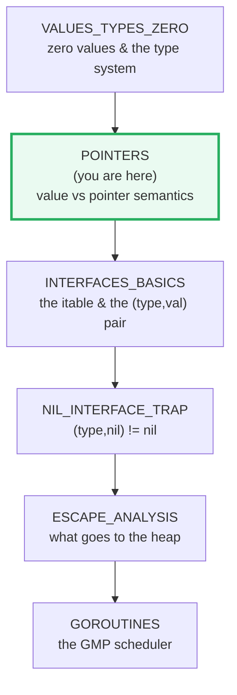
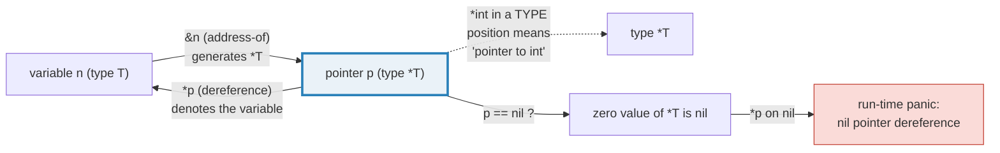
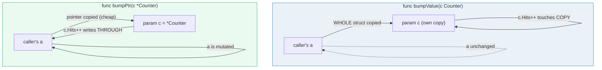

# POINTERS — `&`, `*`, `*T`, `new`, and Value-vs-Pointer Semantics

> **Goal (one line):** by printing every value, show how Go's address operator
> (`&`), dereference (`*`), pointer types (`*T`), `new(T)`, and value-vs-pointer
> argument passing actually behave — and why dereferencing a nil pointer panics.
>
> **Run:** `go run pointers.go`
>
> **Ground truth:** [`pointers.go`](./pointers.go) → captured stdout in
> [`pointers_output.txt`](./pointers_output.txt). Every number/table below is
> pasted **verbatim** from that file under a `> From pointers.go Section X:`
> callout. Nothing is hand-computed.
>
> **Prerequisites:** 🔗 [`VALUES_TYPES_ZERO`](./VALUES_TYPES_ZERO.md) — a
> pointer's zero value is `nil`; you need that mental model before reading this.
> **Followed by:** 🔗 [`STRUCTS_METHODS`](./STRUCTS_METHODS.md) (pointer
> receivers) and 🔗 [`ESCAPE_ANALYSIS`](./ESCAPE_ANALYSIS.md) (what `&local`
> does to the stack).

---

## 1. Why this bundle exists (lineage)

Go has pointers, but they are deliberately **not** C pointers. Two design
choices shape everything here:

1. **There is no pointer arithmetic.** `p + 1`, `p++`, and `p[i]` on a `*T` are
   *compile errors*. You can take an address and dereference it — that is all
   (the only escape hatch is `package unsafe`, out of scope). This removes an
   entire family of buffer-overrun bugs and lets the garbage collector move or
   reason about objects freely.
2. **Everything is passed by value.** Per the Go FAQ, "everything in Go is
   passed by value... passing an `int` value to a function makes a copy of the
   `int`, and passing a pointer value makes a copy of the pointer, but not the
   data it points to." A pointer is *itself* copied — Go has no reference
   parameters. This is the single most misunderstood rule in the language, and
   it is the spine of value-vs-pointer reasoning.

This bundle is the **second** link in the expertise spine:



---

## 2. The mental model: `&`, `*`, and the `*T` type

Three syntactic roles for one glyph pair, and one for `&`. They are easy to
conflate; this diagram fixes them:



From the Go spec (*Address operators*):

> For an operand `x` of type `T`, the address operation `&x` generates a pointer
> of type `*T` to `x`... For an operand `x` of pointer type `*T`, the pointer
> indirection `*x` denotes the variable of type `T` pointed to by `x`. **If `x`
> is `nil`, an attempt to evaluate `*x` will cause a run-time panic.**

The crucial word is **denotes the variable**: `*p` is not a copy, it *is* the
pointed-at storage. Writing through `*p` writes to the original. That is the
entire mechanism behind "mutation through a pointer."

---

## 3. Section A — `&` (address), `*` (dereference), and the `*T` type

> From `pointers.go` Section A:
> ```
> n := 10; p := &n    -> type(p) = *int, *p = 10, n = 10
> *p = 42             -> n = 42  (wrote through the pointer)
> &n == &n (same var) -> true  (one addressable var has one address)
> &Counter{...}       -> type *main.Counter, cp.Hits = 3, cp.Tag = "lit"
> ```
> ```
> [check] *int is the pointer type of &n: OK
> [check] *p = 42 makes n == 42: OK
> [check] &n taken twice yields equal pointers: OK
> [check] &Counter{...} yields *main.Counter: OK
> ```

**What.** `p := &n` makes `p` a `*int` holding the address of `n`. `*p` is the
*variable* `n` (read *and* write). Assigning `*p = 42` is identical to assigning
`n = 42` — that is why `n` becomes 42.

**Why — addressability.** The spec restricts `&` to *addressable* operands: a
variable, a pointer indirection (`*p`), a slice index (`s[i]`), a field selector
of an addressable struct, or an array index of an addressable array. As an
explicit exception, `&` may also take the address of a **composite literal**
(`&Counter{...}`, `&Point{2,3}`), which is the idiomatic way to allocate and
point in one stroke. Non-addressable operands — the return value of a function,
a map element (`&m[k]`), a constant, a string byte (`&s[i]`) — cannot be `&`'d.

**Why — `&n == &n` is stable.** An addressable variable has exactly one address
for its whole lifetime, so taking `&n` twice yields equal pointers. (The reverse
— comparing two *different* variables' addresses — is unspecified and must not
be relied on; see the pitfalls table.)

**Gotcha — no pointer arithmetic.** The following are all compile errors (so they
are documented here, not in the `.go`):

```go
var p *int
_ = p + 1   // COMPILE ERROR: invalid operation (mismatched types *int and int)
p++         // COMPILE ERROR: invalid operation
_ = p[0]    // COMPILE ERROR: invalid operation (cannot index *int)
```

The only way to step through memory by address is `package unsafe` (converting
`*T` to `uintptr` via `unsafe.Pointer`), which opts out of Go's safety
guarantees entirely — it belongs in a later bundle.

---

## 4. Section B — Value copy vs pointer share (pass-by-value ALWAYS)



> From `pointers.go` Section B:
> ```
> after bumpValue(a)  -> a.Hits = 0, a.Tag = "orig"  (copy mutated, original intact)
> [check] by value: a unchanged after bumpValue: OK
> after bumpPtr(&a)   -> a.Hits = 1, a.Tag = "bumped-by-ptr"  (mutated through the pointer)
> [check] by pointer: a.Hits == 1 after bumpPtr: OK
> [check] by pointer: a.Tag == bumped-by-ptr: OK
> ```

**What.** `bumpValue(a)` leaves `a` untouched — the function received a *copy*
of the whole `Counter` (all three fields, including the `[4]int`) and mutated
only that copy. `bumpPtr(&a)` mutates `a` — it received a *copy of the pointer*,
which aliases the caller's storage.

**Why — Go is pass-by-value, period.** The FAQ is unambiguous: even when you
pass a pointer, "passing a pointer value makes a copy of the pointer, but not
the data it points to." There is no `&` reference parameter (as in C++), no
`ref`/`out` (as in C#), no implicit boxing-by-passing (as in Java for
primitives vs objects). The difference between the two calls is purely *what*
gets copied:

- **Value arg `Counter`**: copies N bytes of struct (here, `int` + `string`
  header + `[4]int`). Mutation is local. Safe but potentially expensive for
  large structs, and it forces a read-only contract.
- **Pointer arg `*Counter`**: copies one machine word (the address). Mutation is
  visible to the caller. Cheap for large structs, but introduces aliasing (the
  caller and callee share storage — relevant for concurrency).

**The expert decision.** Prefer **value** receivers/args for small types, maps,
slices, channels, interfaces, and function types (these are already
reference-like descriptors — copying them is one or two words and they share
backing state anyway). Prefer **pointer** for large structs, when the method
must mutate, or to implement an interface with a pointer-receiver-only method
set (🔗 `STRUCTS_METHODS`). Note a subtlety: a slice *value* is a 3-word
descriptor — passing a slice by value still shares its backing array, so a
callee can mutate *elements* but not re-length the caller's header.

---

## 5. Section C — `new(T)` vs `&T{}` (both give `*T`; `new` is rarely used)

> From `pointers.go` Section C:
> ```
> new(int)    -> type *int, *new(int) = 0  (zero value)
> &Counter{}  -> type *main.Counter, Hits = 0, Tag = ""  (zero value)
> new(Counter) and &Counter{} share the type *Counter: true
> ```
> ```
> [check] *new(int) == 0 (new returns pointer to the zero value): OK
> [check] &Counter{} yields *main.Counter: OK
> [check] new(Counter) and &Counter{} have the same type *main.Counter: OK
> ```

**What.** `new(T)` allocates a zero-valued `T` and returns a `*T` to it; the
spec (*Allocation*) confirms "`new(T)` allocates a variable of type `T`
initialized to its zero value... `new(int)`... returns a pointer to a new
variable of type `int`. The value of the first variable is `0`." `&Counter{}`
does the same job for a struct and is the form you will almost always see.

**Why `new` is rare.** `&T{}` (or `&T{field: val}`) lets you *initialize* the
value in the same breath; `new(T)` can only give you the zero value, so you
almost always follow it with field assignments. Idiomatic Go uses `new` only for
non-composite types where a literal is awkward (e.g. `new(int)`), and even there
`v := 0; p := &v` is common. The two are interchangeable in *type* (both `*T`)
and in *effect* (both return a pointer to a fresh zero-valued `T`); the
difference is style and the ability to pre-fill fields.

> From the Go spec (*Variables*): "Calling the built-in function `new` **or**
> taking the address of a composite literal allocates storage for a variable at
> run time. Such an anonymous variable is referred to via a (possibly implicit)
> pointer indirection." — the spec itself treats them as peers.

---

## 6. Section D — Nil pointer dereference panics (`defer`/`recover`)

> From `pointers.go` Section D:
> ```
> var p *int -> p == nil ? true  (zero value of *int)
> defer/recover caught: panicked = true
> panic message: runtime error: invalid memory address or nil pointer dereference
> ```
> ```
> [check] nil pointer deref panicked: OK
> [check] panic message contains "nil pointer": OK
> ```

**What.** `var p *int` leaves `p` at its zero value — `nil`. Dereferencing it
(`*p`) triggers a **run-time panic** whose exact message is
`runtime error: invalid memory address or nil pointer dereference` (a
`runtime.Error`). The bundle catches it with a deferred `recover()` so the
program survives; without the recover, the panic would unwind the goroutine and,
in `main`, exit non-zero.

**Why — this is the zero value biting you.** 🔗 `VALUES_TYPES_ZERO` established
that a pointer's zero value is `nil`, not a usable address. Unlike C (where
dereferencing NULL is undefined behavior that may silently corrupt memory), Go
detects the nil dereference deterministically and panics loudly. That is a
safety win, but it means **every `*p` is a latent panic if `p` could be nil**.

**How experts handle it.** Two disciplines:

1. **Nil-check before deref** when nil is a legitimate state:
   `if p != nil { use(*p) }`.
2. **`defer`/`recover`** only at a goroutine *boundary* (e.g. an HTTP handler or
   a worker loop) to turn a panic into a logged error instead of a crashed
   process. Recovering in the middle of business logic is a smell — it masks
   bugs. See 🔗 `ERRORS` for the panic/recover error-handling pattern and when
   it is appropriate.

---

## 7. Section E — Pointer-to-interface is an anti-pattern

> From `pointers.go` Section E:
> ```
> interface held *Greeter; after type-assert + SetName: g.Name = "bea"
> dynamic type boxed in the interface: *main.Greeter
> ```
> ```
> [check] interface boxes the pointer; mutation visible in original: OK
> [check] the boxed value is a *main.Greeter (type-assertable): OK
> ```

**What.** The bundle stores a `*Greeter` inside an `any` (alias for
`interface{}`), then type-asserts and mutates through it — and the *caller's*
`g` sees the change. That works precisely because the interface already holds
the pointer.

**Why — an interface value is a (type, value) pair.** From the Go FAQ ("Why is
my nil error value not equal to nil?"): "interfaces are implemented as two
elements, a type `T` and a value `V`... The value `V` is a concrete value such
as an `int`, `struct` or pointer." Conceptually the interface *already* boxes a
pointer to (or copy of) its dynamic value. Taking the address of an interface —
`*any`, `*error`, `*fmt.Stringer` — adds a second, meaningless indirection on
top of the one the interface provides.

**The anti-pattern, contrasted:**

```go
// WRONG — pointer-to-interface (legal syntax, wrong idea):
func bad(p *any) { /* ... */ }   // *any: a pointer to an interface value
var itf any = Greeter{}
bad(&itf)                         // meaningless: the interface already holds a
                                  // (type, pointer-to-value) pair; the extra *
                                  // is noise that misleads readers and tools.

// RIGHT — pass the interface value itself:
func good(v any) { /* ... */ }    // accept the interface value directly
good(Greeter{})                   // box a value
good(&Greeter{})                  // box a pointer to a value
```

`*SomeInterface` is almost never what you want. If you need to mutate a value
behind an interface, store a `*ConcreteType` in the interface (as the bundle
does with `*Greeter`) and mutate through the type-asserted pointer — not by
taking the address of the interface.

**The deeper link.** Understanding that an interface is a `(type, value)` pair
is the *same* fact that produces the 🔗 [`NIL_INTERFACE_TRAP`](./NIL_INTERFACE_TRAP.md):
an interface holding a nil pointer (`T=*Greeter, V=nil`) is itself **non-nil**.
You cannot reason about that trap until you see that an interface already
carries its own pointer slot.

---

## 8. Section F — Returning `&local` forces it to escape (heap)

> From `pointers.go` Section F:
> ```
> newBox() -> type *main.Box, bp.N = 7  (local survived via the returned pointer)
> bp.N = 99 -> bp.N = 99  (caller owns the heap object)
> ```
> ```
> [check] newBox returned &local; *bp == 7 (local survived the call): OK
> [check] caller can mutate the heap object (bp.N = 99): OK
> ```

**What.** `newBox` declares `b := Box{N: 7}` and returns `&b`. The returned
pointer is still valid *after* `newBox` returns — `*bp` reads `7`, and the
caller can mutate `bp.N`. In C, returning the address of a stack local would be
a classic use-after-free; in Go it is perfectly legal.

**Why — escape analysis.** The compiler proves that `b`'s address outlives the
call (it escapes the function), so it is **forced onto the heap** instead of the
stack. Stack allocation is free (reclaimed by moving the stack pointer); heap
allocation costs a GC-tracked allocation. So "returning `&local` is cheap-ish"
(it's one word to copy) **but it allocates** — the cheap part is the pointer
pass, the not-free part is the heap object behind it.

This is why pointer returns and pointer arguments are not automatically "faster":
a `*T` argument copies one word (cheap), but if it causes `T` to escape, you pay
a heap allocation. The full `-gcflags=-m` treatment — seeing the compiler emit
`b escapes to heap` — is the subject of 🔗 [`ESCAPE_ANALYSIS`](./ESCAPE_ANALYSIS.md).
Verify this bundle's `newBox` yourself with:

```
go build -gcflags=-m pointers.go
```

---

## 9. Pitfalls (the expert payoff)

| Trap | Symptom | Fix |
|---|---|---|
| Dereferencing a nil `*T` | Run-time panic: `invalid memory address or nil pointer dereference` | Nil-check (`if p != nil`) before `*p`; or initialize with `&T{}`/`new`. |
| `&` on a non-addressable operand | Compile error: `cannot take the address of ...` | Only variables, `*p`, `s[i]`, struct fields of addressable structs, and composite literals are addressable. Map elements, function results, constants, and string bytes are not. |
| Expecting pointer arithmetic | Compile error: `invalid operation: p + 1` | Go has none (by design). Use slicing/indexing, or `unsafe` only when unavoidable. |
| Assuming pass-by-reference | Mutations through a value arg silently vanish | Go is pass-by-value *always*. To mutate, pass `*T`; the pointer is copied, the storage is shared. |
| `func f(p *T)` where `p` is large and always non-nil | Unnecessary heap aliasing / copy of caller's address | If you only read, prefer `f(v T)` for small `T`; benchmark before optimizing. |
| `*SomeInterface` / `*any` / `*error` args | Meaningless double indirection; misleads readers & tools | Pass the interface value directly; store a `*Concrete` inside it if you need mutation. |
| Returning `&local` and assuming it's "free" | Hidden heap allocation (GC pressure) | Legal but allocates. Measure with `-gcflags=-m`; prefer value returns for small types. See 🔗 ESCAPE_ANALYSIS. |
| Comparing addresses of two different variables | Unspecified result (may be true or false) | Only rely on `&x == &x` (same var). Never order distinct variables by address. |
| Interface holding a nil pointer compared to `nil` | `if i == nil` is `false` (🔗 NIL_INTERFACE_TRAP) | The interface is a `(type,value)` pair; check the dynamic type/value, not the interface. |
| `new` for a struct then field-by-field init | Verbose; misses the point of `&T{field: v}` | Use `&Counter{Hits: 3}` to allocate and initialize at once. |
| `uintptr` arithmetic mistaken for safe pointer math | GC may move the object; dangling/corrupted reads | `uintptr` is not a pointer; only `unsafe.Pointer` conversions interoperate, and only around a single syscall/intrinsic. |

---

## 10. Cheat sheet

```go
// The three roles of & and *
//   p := &n        // &x : address-of  -> generates *T
//   v := *p        // *p : dereference -> denotes the variable (read & write)
//   *T             // *T in a TYPE position = "pointer to T"
//   *p = 42        // write THROUGH the pointer (original changes)

// Zero value of *T is nil; *nil PANICS (runtime error: nil pointer dereference).
var p *int   // p == nil here
if p != nil { use(*p) }

// Allocate a fresh zero-valued T and get *T  (both give *T; &T{} is idiomatic)
np := new(int)      // *int, *np == 0        (new is rare)
cp := &Counter{}    // *Counter, zero-valued (preferred; can pre-fill fields)

// Pass-by-value ALWAYS — a pointer is copied too, not the data
func f(c Counter)   // whole struct copied; mutation is LOCAL (caller untouched)
func g(c *Counter)  // one word copied (the address); mutation visible to caller

// Addressability: & works on variables, *p, s[i], addressable struct fields,
// addressable array indexes, AND composite literals (&T{}).
// & does NOT work on map elements, function results, constants, or string bytes.

// No pointer arithmetic: p+1, p++, p[i] are compile errors (only via `unsafe`).

// Escape: returning &local is legal — the local is moved to the HEAP (allocates).
// Verify with:  go build -gcflags=-m file.go   (see ESCAPE_ANALYSIS)

// Interfaces already box their value as (type, value); *SomeInterface is an
// anti-pattern. To mutate behind an interface, store a *Concrete in it.
```

---

## Sources

Every signature, value, and behavioral claim above was verified against the Go
specification, the Go FAQ, Effective Go, and the standard-library docs:

- The Go Programming Language Specification — https://go.dev/ref/spec
  - *Address operators* (`&x` generates `*T`; `*x` denotes the variable; nil `*x` → run-time panic): https://go.dev/ref/spec#Address_operators
  - *Pointer types* (`PointerType = "*" BaseType`; "value of an uninitialized pointer is `nil`"): https://go.dev/ref/spec#Pointer_types
  - *Variables* ("calling `new` **or** taking the address of a composite literal allocates storage at run time"): https://go.dev/ref/spec#Variables
  - *Allocation / The new function* ("`new(T)` allocates a variable of type `T` initialized to its zero value"; `new(int)` value is `0`): https://go.dev/ref/spec#Allocation
  - *Composite literals* ("Taking the address of a composite literal generates a pointer to a unique variable"): https://go.dev/ref/spec#Composite_literals
  - *Run-time panics* / *Handling panics* (`defer`/`recover`): https://go.dev/ref/spec#Handling_panics
- Go FAQ — https://go.dev/doc/faq
  - *When are function parameters passed by value?* ("everything in Go is passed by value... passing a pointer value makes a copy of the pointer, but not the data it points to"): https://go.dev/doc/faq#pass_by_value
  - *Why is my nil error value not equal to nil?* ("interfaces are implemented as two elements, a type `T` and a value `V`"): https://go.dev/doc/faq#nil_error
  - *Should I define methods on values or pointers?*: https://go.dev/doc/faq#methods_on_values_or_pointers
- A Tour of Go — *Pointers* ("Go has pointers... The type `*T` is a pointer to a `T` value. Its zero value is `nil`"): https://go.dev/tour/moretypes/1
- Effective Go — https://go.dev/doc/effective_go  (pointers & address-taking idioms)
- Defer, Panic, and Recover — https://go.dev/doc/articles/defer_panic_recover  (the canonical `recover` pattern for a nil-deref-style panic)

**Facts that could not be verified by running** (documented, not executed, since
they are compile errors by design): `p + 1`, `p++`, and `p[i]` on a `*T` are
rejected by the compiler (no pointer arithmetic); `&` on a map element or a
function result is rejected (not addressable). These are confirmed by the spec
sections cited above (*Address operators*), not reproduced as runnable output —
a file containing them would not build. The `*gcflags=-m` escape diagnostic for
`newBox` is real and reproducible but is deferred to 🔗 ESCAPE_ANALYSIS per the
bundle brief; here it is only stated and linked.
