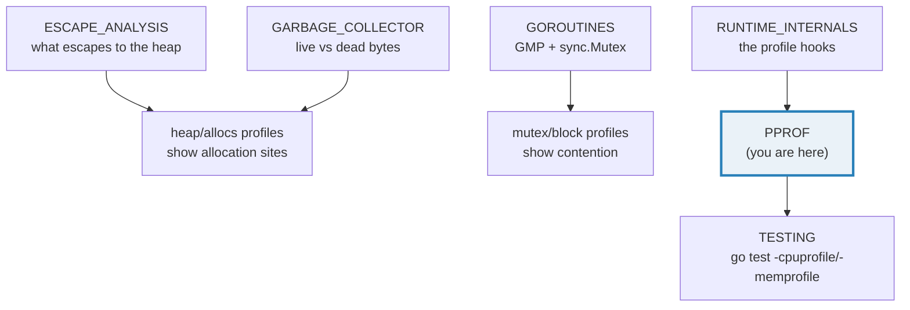
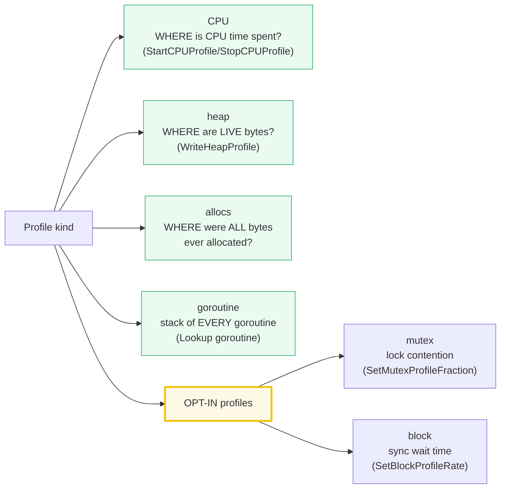
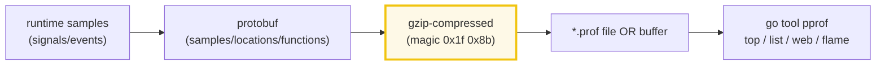
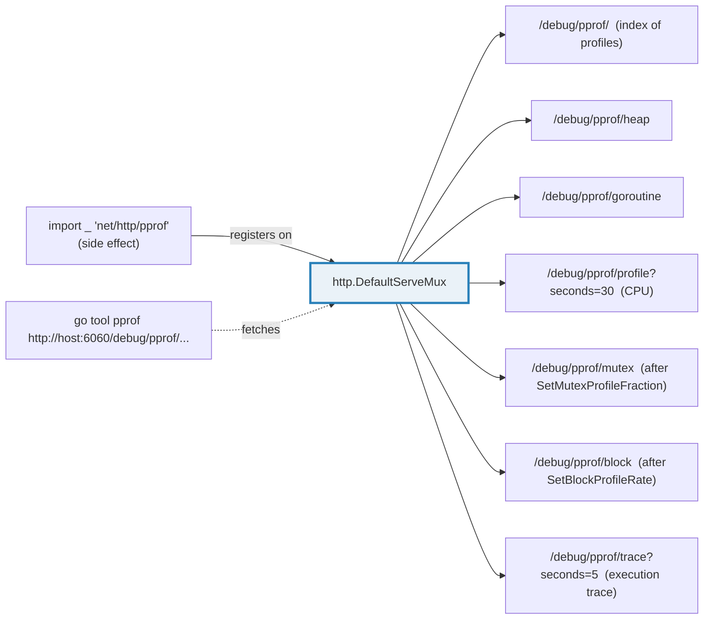

# PPROF — Profiling Go Programs with `runtime/pprof`

> **Goal (one line):** show, by capturing profiles into buffers and asserting
> their **structural** facts, how Go's `runtime/pprof` profiler captures **CPU,
> heap, goroutine, mutex, and block** profiles — and how `go tool pprof` turns
> them into actionable hotspots.
>
> **Run:** `go run pprof.go`
>
> **Ground truth:** [`pprof.go`](./pprof.go) → captured stdout in
> [`pprof_output.txt`](./pprof_output.txt). Every printed value below is pasted
> **verbatim** from that file under a `> From pprof.go Section X:` callout.
> Nothing is hand-computed.
>
> **Prerequisites:** 🔗 [`GOROUTINES`](./GOROUTINES.md) (the goroutine/mutex
> profiles only make sense once you understand GMP and `sync.Mutex`),
> 🔗 [`ESCAPE_ANALYSIS`](./ESCAPE_ANALYSIS.md) and
> 🔗 [`GARBAGE_COLLECTOR`](./GARBAGE_COLLECTOR.md) (the heap/allocs profiles show
> where allocations escape and how the GC sees them), and
> 🔗 [`RUNTIME_INTERNALS`](./RUNTIME_INTERNALS.md) (the profile APIs are runtime
> hooks). 🔗 [`TESTING`](./TESTING.md) is assumed for `go test -cpuprofile`.

---

## 1. Why this bundle exists (lineage)

`pprof` is Go's answer to *"where is my program actually spending time or
memory?"* It grew out of Google's internal `pprof` tool (originally by Russ Cox,
ported to Go) and ships **in the standard library** as `runtime/pprof` (the
profiler) plus the external `go tool pprof` (the analyzer, backed by
`github.com/google/pprof`). Unlike a hand-rolled timer, pprof samples the
**running program at the function/line granularity** — CPU via SIGPROF signals,
heap/goroutine/mutex/block via runtime instrumentation — and emits a
**gzip-compressed protobuf** that the `pprof` tool turns into `top` tables,
`list` source annotations, `web` call graphs, and flame graphs.



**The north-star idea:** a pprof profile is an **opaque binary artifact** — you
*never* read its bytes by hand. You capture it (to a file or an HTTP handler),
hand it to `go tool pprof`, and let the tool annotate your source. This bundle
therefore asserts only **structural facts** (gzip magic, non-empty, set
membership) — the sample counts, addresses, and timings inside the protobuf
vary between runs and are deliberately not printed.

---

## 2. The mental model: five profile kinds, one binary format

Go exposes **five** profile kinds through `runtime/pprof`. Each answers a
different question; two of them (mutex, block) are **off by default** because
they add per-event overhead.



The on-disk wire format is **identical for every kind**: a **gzip-compressed
protobuf** (the schema lives at `github.com/google/pprof/tree/main/proto`). The
gzip stream always begins with the two magic bytes `0x1f 0x8b` (RFC 1952
§2.3.1), so the cheapest deterministic check that "the profile captured
correctly" is `buf[0]==0x1f && buf[1]==0x8b`.



> From `pkg.go.dev/runtime/pprof` — `Profile.WriteTo` (verbatim): *"Passing
> debug=0 writes the gzip-compressed protocol buffer described in
> https://github.com/google/pprof/tree/main/proto#overview. Passing debug=1
> writes the legacy text format with comments translating addresses to function
> names and line numbers, so that a programmer can read the profile without
> tools."*

**The predefined profiles** (the docs call these out verbatim):

| Name | Answers | Opt-in? |
|---|---|---|
| `cpu` | WHERE is CPU time spent? | special API (`StartCPUProfile`) |
| `heap` | WHERE are LIVE bytes/objects? | always on (sampled) |
| `allocs` | WHERE were ALL bytes ever allocated (incl. GC'd)? | always on |
| `goroutine` | stack of EVERY live goroutine | always on |
| `threadcreate` | stacks that led to new OS threads | always on |
| `mutex` | holders of contended mutexes | **opt-in** (`SetMutexProfileFraction`) |
| `block` | where goroutines block on sync | **opt-in** (`SetBlockProfileRate`) |

> From `pkg.go.dev/runtime/pprof` — `type Profile` (verbatim): *"The CPU profile
> is not available as a Profile. It has a special API, the `StartCPUProfile` and
> `StopCPUProfile` functions, because it streams output to a writer during
> profiling."*

---

## 3. Section A — CPU profile: `StartCPUProfile` into a buffer

> From `pprof.go` Section A:
> ```
> CPU profiling answers: WHERE does the program spend CPU time?
> StartCPUProfile(w) turns on sampling (SIGPROF-driven, ~100Hz);
> StopCPUProfile() flushes the buffered, gzip-compressed protobuf
> to w. The payload is OPAQUE BINARY — you never read it directly,
> you hand it to `go tool pprof` for top/list/web/flame analysis.
> [check] StartCPUProfile(buf) returned no error: OK
> deterministic CPU work: sum(0..2000000-1) = 1999999000000  (printed; stable)
> CPU profile captured: non-empty? true   starts with gzip magic 0x1f8b? true
> (the protobuf sample counts/addresses inside vary per run; not printed)
> ```
> ```
> [check] CPU profile buffer is non-empty: OK
> [check] CPU profile starts with gzip magic 0x1f 0x8b: OK
> ```

**What.** `pprof.StartCPUProfile(w io.Writer) error` turns on CPU sampling for
the whole process; `pprof.StopCPUProfile()` flushes the buffered protobuf to `w`
and blocks until the write completes. Between the two calls, the runtime takes
~100 samples/second (driven by `SIGPROF`) and records the **on-CPU** stack at
each tick.

> From `pkg.go.dev/runtime/pprof` — `StartCPUProfile` (verbatim): *"enables CPU
> profiling for the current process. While profiling, the profile will be
> buffered and written to `w`. `StartCPUProfile` returns an error if profiling
> is already enabled."* And `StopCPUProfile`: *"stops the current CPU profile, if
> any. `StopCPUProfile` only returns after all the writes for the profile have
> completed."*

**Why it streams to a writer (not returns bytes).** CPU profiles are captured
over a *window* (often 30s on a live server), so the API is `Start`/`Stop` plus
a writer, not a single call returning `[]byte`. You point it at an `*os.File`
in batch jobs, an `http.ResponseWriter` over the network, or — as here — a
`bytes.Buffer` when you want to inspect the bytes programmatically.

**Why only the magic is asserted.** The CPU sum (`1999999000000`) is
deterministic and printable; the profile bytes are **not** — sample counts,
goroutine stacks, and addresses all drift between runs. The two stable facts
are *"the buffer is non-empty"* and *"it starts with `0x1f 0x8b`"* (gzip wrapping
the protobuf). Asserting those is exactly what proves the capture worked, with
zero flakiness.

> **Caveat (documented, not runnable here):** on Unix, `StartCPUProfile` relies
> on the `SIGPROF` signal. For `c-archive`/`c-shared` builds the signal is
> delivered to the host program's handler, not Go's, so CPU profiling silently
> does nothing unless you `os/signal.Notify(syscall.SIGPROF)`. Confirmed in the
> `StartCPUProfile` doc, cited below.

---

## 4. Section B — Heap profile: `WriteHeapProfile` (live allocations)

> From `pprof.go` Section B:
> ```
> The HEAP profile answers: WHERE are LIVE bytes/objects allocated?
> It is sampled (1 per 512 KiB historically) and reports the snapshot
> as of the last GC. WriteHeapProfile(w) == Lookup("heap").WriteTo(w,0).
> The ALLOCS profile is the same data with a different default view
> (-alloc_space: total since start, incl. GC'd) — see ESCAPE_ANALYSIS
> allocated 100000 *[64]byte (heap-resident); forced runtime.GC()
> heap profile captured: non-empty? true   starts with gzip magic? true
> ```
> ```
> [check] WriteHeapProfile(buf) returned no error: OK
> [check] heap profile buffer is non-empty: OK
> [check] heap profile starts with gzip magic 0x1f 0x8b: OK
> ```

**What.** `pprof.WriteHeapProfile(w)` is — verbatim from the docs — *"shorthand
for `Lookup("heap").WriteTo(w, 0)`."* It captures the **heap** profile: the
allocation sites of **live** objects, reported as of the most recently completed
GC. That is why the bundle calls `runtime.GC()` first — to make the snapshot
current before writing.

**Heap vs allocs — the same data, two default views.** This is the expert
distinction that ties back to 🔗 `ESCAPE_ANALYSIS` and 🔗 `GARBAGE_COLLECTOR`:

- **`heap`** defaults to `-inuse_space` — bytes currently **live** on the heap.
  Use it to find "what is keeping my memory high right now" (a leak).
- **`allocs`** defaults to `-alloc_space` — **total** bytes allocated since
  start, **including objects already garbage-collected**. Use it to find "who
  allocates the most garbage" (GC pressure).

> From `pkg.go.dev/runtime/pprof` — Allocs profile (verbatim): *"The allocs
> profile is the same as the heap profile but changes the default pprof display
> to `-alloc_space`, the total number of bytes allocated since the program began
> (including garbage-collected bytes)."*

The pprof tool can flip between these views on the *same* underlying data
(`pprof -http` lets you switch `inuse_space`/`inuse_objects`/`alloc_space`/
`alloc_objects` in the UI). **Sampling matters:** heap allocation is sampled
(historically ~1 sample per 512 KiB allocated), so the absolute numbers are
statistical estimates, not exact counts — another reason never to assert them.

---

## 5. Section C — Goroutine profile: readable text at `debug=1`

> From `pprof.go` Section C:
> ```
> The GOROUTINE profile dumps a stack trace for EVERY live goroutine
> (the live count is the classic 'goroutine leak' detector). With
> debug=1 WriteTo emits HUMAN-READABLE TEXT (not gzip protobuf);
> debug=2 prints stacks like an unrecovered-panic dump.
> goroutine profile: non-empty? true   contains "goroutine"? true   is text (not gzip)? true
> (exact goroutine count and stack addresses vary; only structure asserted)
> ```
> ```
> [check] Lookup("goroutine") returned a non-nil *Profile: OK
> [check] goroutine WriteTo(debug=1) returned no error: OK
> [check] goroutine profile text is non-empty: OK
> [check] goroutine profile text contains "goroutine": OK
> [check] goroutine profile at debug=1 is TEXT (not gzip binary): OK
> ```

**What.** `pprof.Lookup("goroutine")` returns the goroutine profile — a stack
trace for **every** live goroutine. Its `Count()` is the live goroutine count,
which makes it the standard "do I have a goroutine leak?" probe (🔗
`GOROUTINES`). Unlike heap/mutex (gzip protobuf at `debug=0`), the goroutine
profile at **`debug=1`** emits **human-readable text**, and at **`debug=2`** it
prints stacks in the exact form a program prints when dying from an unrecovered
panic.

> From `pkg.go.dev/runtime/pprof` — `WriteTo` (verbatim): *"The predefined
> profiles may assign meaning to other debug values; for example, when printing
> the 'goroutine' profile, debug=2 means to print the goroutine stacks in the
> same form that a Go program uses when dying due to an unrecovered panic."*

**Why the `is text (not gzip)` check.** This is the structural fact that
distinguishes the two `WriteTo` output modes without printing the (varying)
stack contents. `debug=0` ⇒ `buf[0:2] == {0x1f, 0x8b}` (gzip); `debug=1` ⇒ ASCII
text starting with the literal word `goroutine`. The bundle asserts both the
substring presence **and** the "not gzip" property, which together pin the
format deterministically.

---

## 6. Section D — Mutex & block: the opt-in contention profiles

> From `pprof.go` Section D:
> ```
> MUTEX profile: WHERE do goroutines wait on contended locks? Needs
>   runtime.SetMutexProfileFraction(n) — samples ~1/n of contention events;
>   returns the PREVIOUS fraction (0 = off by default).
> BLOCK profile: WHERE do goroutines block (chan/mutex/cond/select)?
>   Needs runtime.SetBlockProfileRate(n) — samples one block event per n ns;
>   n=1 records all; it returns NO value (no read API, unlike mutex).
> Both are OFF by default because they add per-event overhead.
> SetMutexProfileFraction(1) returned previous fraction = 0
> mutex profile: non-empty? true   starts with gzip magic? true
> SetBlockProfileRate(1) called (returns no value; block now enabled)
> block profile: non-empty? true   starts with gzip magic? true
> ```
> ```
> [check] SetMutexProfileFraction(1) returned 0 (was off by default): OK
> [check] Lookup("mutex") is non-nil after enabling: OK
> [check] mutex WriteTo returned no error: OK
> [check] mutex profile buffer is non-empty: OK
> [check] mutex profile starts with gzip magic 0x1f 0x8b: OK
> [check] Lookup("block") is non-nil after enabling: OK
> [check] block WriteTo returned no error: OK
> [check] block profile buffer is non-empty: OK
> ```

**What.** Two profiles are **opt-in** because they record per-event data (every
contention / every block) and so carry real overhead. You enable them with
runtime knobs, not with pprof directly:

- **Mutex contention** → `runtime.SetMutexProfileFraction(rate int) int`.
  Samples ~`1/rate` of contention events; **returns the previous fraction**.
  `rate==0` turns it off; `rate<0` is a read-only query.
- **Block (sync wait)** → `runtime.SetBlockProfileRate(rate int)`. Samples one
  blocking event per `rate` nanoseconds spent blocked; `rate==1` records
  *every* blocking event; `rate<=0` turns it off. **Returns nothing** — there is
  no read API, which is why the bundle does not (and cannot) print a "previous
  rate" for block the way it does for mutex.

> From `pkg.go.dev/runtime` — `SetMutexProfileFraction` (verbatim): *"controls
> the fraction of mutex contention events that are reported in the mutex
> profile. On average `1/rate` events are reported. The previous rate is
> returned. To turn off profiling entirely, pass rate 0. To just read the
> current rate, pass rate < 0."* And `SetBlockProfileRate`: *"controls the
> fraction of goroutine blocking events that are reported… To include every
> blocking event in the profile, pass rate = 1. To turn off profiling entirely,
> pass rate <= 0."*

**Why the asymmetry matters (the expert payoff).** The two APIs look symmetric
but are not: `SetMutexProfileFraction` returns the old value (so you can save
and restore it, and read it with `<0`); `SetBlockProfileRate` returns nothing.
Forgetting that difference is a common compile bug (go vet catches the
`used as value` mistake, as it did while building this bundle). The **stack
semantics also differ**: the mutex profile reports the stack at **`Unlock`** (the
end of the critical section that caused others to wait), while the block profile
reports the stack at the **blocking call itself** (`Mutex.Lock`, chan send/recv,
`select`). The docs spell both out verbatim (see Sources).

---

## 7. Section E — Profile kinds: enumerate `pprof.Profiles()` (sorted)

> From `pprof.go` Section E:
> ```
> pprof.Profiles() returns every named Profile, SORTED by name.
> Predefined (self-maintained; Add/Remove panic on them):
>   goroutine  stack traces of all current goroutines
>   heap       sampling of LIVE object allocations
>   allocs     sampling of ALL past allocations (incl. GC'd)
>   threadcreate stacks that led to new OS threads
>   block      stacks where goroutines blocked on sync (opt-in)
>   mutex      stacks of holders of contended mutexes (opt-in)
> CPU is NOT a Profile — it has its own Start/Stop streaming API.
> pprof.Profiles() names (sorted): [allocs block goroutine heap mutex threadcreate]
> ```
> ```
> [check] "heap" is a named profile: OK
> [check] "goroutine" is a named profile: OK
> [check] "mutex" is a named profile (enabled in section D): OK
> [check] "block" is a named profile (enabled in section D): OK
> [check] Profiles() list is sorted ascending: OK
> ```

**What.** `pprof.Profiles()` returns every named `*Profile`, **sorted by name**
(the docs guarantee this; the bundle sorts again defensively for stable output).
After section D enables block and mutex, the stable set is exactly
`[allocs block goroutine heap mutex threadcreate]` — byte-identical across runs.

**Why `block`/`mutex` appear only after enabling.** A predefined profile is
*registered* regardless of sampling, but **`Profiles()` lists the profiles that
have data**. `block` and `mutex` start empty (rate/fraction == 0, zero events),
so they are absent until `SetBlockProfileRate`/`SetMutexProfileFraction` feed
them events — exactly the dependency section D→E demonstrates. `heap`,
`allocs`, `goroutine`, and `threadcreate` are always populated because the
runtime always allocates, runs goroutines, and creates OS threads.

**Why CPU is absent from this list.** CPU is not a `Profile` at all — it has the
special `StartCPUProfile`/`StopCPUProfile` streaming API (section A) because it
must write samples *during* a window rather than snapshot them. So it never
shows up in `Profiles()`, and `Lookup("cpu")` returns `nil`.

---

## 8. The `go tool pprof` workflow (documentation — not a `.go` callout)

This section documents the **analyzer**, which is deliberately not exercised in
the runnable `.go` (it is an interactive TUI/browser tool, not something you
byte-assert). Everything here is the standard, web-verified workflow.

### 8.1 Capture, then analyze

```bash
# 1) Batch job: capture to a file, then analyze offline.
go test -cpuprofile cpu.prof -memprofile mem.prof -bench .
go tool pprof cpu.prof            # interactive shell

# 2) Long-running server: capture over HTTP (see §9), 30s CPU sample.
go tool pprof http://localhost:6060/debug/pprof/profile?seconds=30

# 3) One-shot web UI (flame graph) straight from a file.
go tool pprof -http=:8080 cpu.prof
```

### 8.2 The interactive commands

Inside `go tool pprof <source>`, the headline commands are:

| Command | What it shows |
|---|---|
| `top` | Functions ranked by cumulative sample weight (the hotspots). `top10 -cum` sorts by cumulative (inclusive) time. |
| `list <regex>` | Annotated **source** — per-line sample weights so you see exactly which line burns CPU/bytes. |
| `web` | An SVG **call graph** (needs Graphviz `dot`); edge thickness = weight. |
| `flame` / `-http` | A **flame graph** (icicle): x-axis = sample width, y-axis = stack depth. The fastest way to spot a hot path. |
| `tree` | A text call tree (cum + flat) when Graphviz is unavailable. |
| `peek <regex>` | Where a function is called *from*. |
| `help` | All commands. |

> From `pkg.go.dev/runtime/pprof` (Overview, verbatim): *"Profiles can then be
> visualized with the pprof tool: `go tool pprof cpu.prof`. There are many
> commands available from the pprof command line. Commonly used commands include
> 'top', which prints a summary of the top program hot-spots, and 'web', which
> opens an interactive graph of hot-spots and their call graphs. Use 'help' for
> information on all pprof commands."*

### 8.3 Flat vs cumulative (the thing juniors miss)

`top` reports two columns: **flat** (time/bytes spent *in* the function,
excluding callees) and **cum** (time/bytes spent *in the function and everything
it called*). A function with **low flat but high cum** is not itself slow — it
just *calls* something slow; chase the callees. A function with **high flat** is
where the work actually happens. `list` makes this per-line.

### 8.4 `go test` integration (🔗 TESTING)

For benchmark-driven profiling, the testing package has built-in flags — no
`StartCPUProfile` boilerplate needed:

```bash
go test -bench=. -benchmem -cpuprofile cpu.prof -memprofile mem.prof -trace trace.out
go tool pprof cpu.prof          # CPU hotspots during the benchmark
go tool pprof mem.prof          # alloc hotspots; -alloc_space vs -inuse_space
go tool trace trace.out         # execution trace (goroutine scheduling/timeline)
```

`-benchmem` prints `B/op` and `allocs/op` inline; pairing it with `-memprofile`
lets you correlate a high `allocs/op` with the exact allocation site in pprof.
For even tighter allocation feedback in CI, `b.ReportAllocs()` forces `allocs/op`
reporting per benchmark — and `staticcheck`/`golangci-lint` can flag regressions
there in a pipeline.

---

## 9. `net/http/pprof`: live profiles on a long-running server

For a **server** you do **not** want file-based `StartCPUProfile` — you want to
grab a profile on demand, while it runs. `net/http/pprof` does this by **side
effect of importing it**:

```go
import _ "net/http/pprof"   // registers /debug/pprof/* on http.DefaultServeMux

// then, somewhere, serve the default mux:
go func() { log.Println(http.ListenAndServe("localhost:6060", nil)) }()
```



**The two rules to remember:**

1. **It only registers on `http.DefaultServeMux`.** If you use a custom router
   (chi, gin, echo), you must wire `pprof.Handler("heap")` etc. onto it yourself
   (see 🔗 the Phase 6 router bundles). With the default mux, `nil` as the
   handler in `ListenAndServe` picks it up.
2. **CPU and trace are captured *for a duration*, not snapshotted.** `/debug/pprof/
   profile?seconds=30` streams a 30-second CPU profile; `?seconds=5` on `/trace`
   captures a 5-second execution trace. The others (`heap`, `goroutine`,
   `mutex`, `block`) are point-in-time snapshots (optionally a `seconds=N` delta).

> From `pkg.go.dev/net/http/pprof` (Overview, verbatim): *"The package is
> typically only imported for the side effect of registering its HTTP handlers.
> The handled paths all begin with `/debug/pprof/`. As of Go 1.22, all the paths
> must be requested with GET."* And the worked examples: `go tool pprof
> http://localhost:6060/debug/pprof/heap`, `…/profile?seconds=30`, `…/block`
> (after `SetBlockProfileRate`), `…/mutex` (after `SetMutexProfileFraction`).

> **Production caveat:** `/debug/pprof/*` exposes internals and lets an attacker
> cheaply DoS a server (a CPU profile holds a global lock; a 30s capture adds
> overhead). Bind it to localhost, or gate it behind auth / an admin port — never
> expose it on a public interface. (Documented widely; see Sources.)

---

## 10. Pitfalls (the expert payoff)

| Trap | Symptom | Fix |
|---|---|---|
| Profiling an empty window | `cpu.prof` tiny / `top` shows nothing | Ensure real work runs *between* `StartCPUProfile` and `StopCPUProfile`; for a server use `?seconds=30` under load. |
| Reading profile bytes as text | garbage / `gzip: invalid header` on your own parse | Profiles are **gzip protobuf** (magic `0x1f 0x8b`); never parse by hand — hand the file to `go tool pprof`. |
| Forgetting to enable mutex/block | `Lookup("mutex")`/`("block")` profile is empty / absent from `Profiles()` | Call `runtime.SetMutexProfileFraction(1)` / `runtime.SetBlockProfileRate(1)` **before** capturing; both default off. |
| `SetBlockProfileRate` used as a value | compile error: `no value used as value` (go vet catches it) | It returns **nothing**; only `SetMutexProfileFraction` returns the previous rate. Read mutex rate with `SetMutexProfileFraction(-1)`. |
| Confusing `heap` with `allocs` | "fixed" a leak that was really just GC pressure | `heap` = live (`-inuse_space`, leak hunting); `allocs` = total (`-alloc_space`, GC-pressure hunting). Same data, different default view. |
| Expecting exact allocation counts | numbers don't match your allocator | Heap/allocs are **sampled** (~1/512 KiB historically) — statistical estimates, not exact. |
| Missing `runtime.GC()` before heap capture | stale snapshot, misses recent allocations | `runtime.GC()` first; docs: heap profile "reports statistics as of the most recently completed garbage collection." |
| `cpu` looked up as a Profile | `Lookup("cpu")` returns `nil` | CPU is not a `Profile`; use `StartCPUProfile`/`StopCPUProfile`. |
| `c-archive`/`c-shared` CPU profile empty | no samples captured | `StartCPUProfile` needs `SIGPROF`; call `os/signal.Notify(syscall.SIGPROF)` so Go gets the signal. |
| Exposing `/debug/pprof/*` publicly | information leak + cheap DoS (CPU capture holds a global lock) | Bind to localhost / admin port / behind auth; never on a public interface. |
| Flat vs cum misread | "optimizing" a function that just *calls* the slow one | High **cum** but low **flat** = chase callees; high **flat** = the real hotspot. Use `list`. |
| `StopCPUProfile` not deferred / not called | profile never flushed → empty/truncated file | `defer pprof.StopCPUProfile()` right after a successful `StartCPUProfile`. |

---

## 11. Cheat sheet

```go
// ---- CPU profile (special Start/Stop API; streams a gzip protobuf) ----
var buf bytes.Buffer
pprof.StartCPUProfile(&buf)     // turns on ~100Hz SIGPROF sampling
// ... do CPU-bound work between Start and Stop ...
pprof.StopCPUProfile()          // flushes; blocks until the write completes
// buf.Bytes()[0:2] == {0x1f, 0x8b}  -> gzip-wrapped protobuf -> `go tool pprof`

// ---- Heap (live) / Allocs (total) ----
runtime.GC()                            // make the snapshot current first
pprof.WriteHeapProfile(w)               // == pprof.Lookup("heap").WriteTo(w, 0)
pprof.Lookup("allocs").WriteTo(w, 0)    // same data, -alloc_space default view

// ---- Goroutine (text at debug=1; panic-style stack at debug=2) ----
pprof.Lookup("goroutine").WriteTo(w, 1) // human-readable text
pprof.Lookup("goroutine").Count()       // live goroutine count (leak detector)

// ---- Opt-in contention/blocking profiles ----
runtime.SetMutexProfileFraction(1)      // enable mutex; returns prev fraction (0)
runtime.SetBlockProfileRate(1)          // enable block; returns NOTHING (no read API)
pprof.Lookup("mutex").WriteTo(w, 0)     // stack at Unlock of contended lock
pprof.Lookup("block").WriteTo(w, 0)     // stack at the blocking sync call

// ---- Enumerate named profiles (sorted by name) ----
pprof.Profiles()   // [] *Profile; CPU is NOT here (special API)

// ---- The wire format ----
//   gzip-compressed protobuf (magic 0x1f 0x8b) -> schema at
//   github.com/google/pprof/tree/main/proto  -> consumed by `go tool pprof`

// ---- Tooling ----
//   go test -cpuprofile cpu.prof -memprofile mem.prof -trace trace.out -bench .
//   go tool pprof cpu.prof            # interactive: top / list / web / flame
//   go tool pprof -http=:8080 cpu.prof
//   go tool pprof http://host:6060/debug/pprof/profile?seconds=30   # live server

// ---- net/http/pprof (long-running server; side-effect import) ----
//   import _ "net/http/pprof"   // registers /debug/pprof/* on DefaultServeMux
//   go func() { log.Println(http.ListenAndServe("localhost:6060", nil)) }()
```

---

## Sources

Every signature, predefined-profile name, and behavioral claim above was
verified against the Go standard-library docs and the pprof tool README, then
corroborated by independent secondary sources:

- `runtime/pprof` package — https://pkg.go.dev/runtime/pprof
  - Overview ("Profiling a Go program": the `go test -cpuprofile`/`-memprofile`
    example; `Lookup("allocs")` vs `Lookup("heap")`; `import _ "net/http/pprof"`;
    "Profiles can then be visualized with the pprof tool: `go tool pprof
    cpu.prof`"; "Commonly used commands include 'top'… and 'web'…"):
    https://pkg.go.dev/runtime/pprof#hdr-Profiling_a_Go_program
  - `StartCPUProfile` ("enables CPU profiling… buffered and written to w…
    returns an error if profiling is already enabled"; the `c-archive`/`c-shared`
    `SIGPROF` caveat): https://pkg.go.dev/runtime/pprof#StartCPUProfile
  - `StopCPUProfile` ("only returns after all the writes for the profile have
    completed"): https://pkg.go.dev/runtime/pprof#StopCPUProfile
  - `WriteHeapProfile` ("shorthand for `Lookup(\"heap\").WriteTo(w, 0)`"):
    https://pkg.go.dev/runtime/pprof#WriteHeapProfile
  - `Profile.WriteTo` (`debug=0` ⇒ "gzip-compressed protocol buffer described in
    https://github.com/google/pprof/tree/main/proto#overview"; `debug=1` ⇒ legacy
    text; goroutine `debug=2` ⇒ panic-style stacks):
    https://pkg.go.dev/runtime/pprof#Profile.WriteTo
  - `type Profile` (predefined profiles verbatim: `goroutine`, `heap`, `allocs`,
    `threadcreate`, `block`, `mutex`; "The CPU profile is not available as a
    Profile… special API"): https://pkg.go.dev/runtime/pprof#Profile
  - Heap / Allocs / Block / Mutex profile subsections (heap "as of the most
    recently completed garbage collection"; allocs = heap with `-alloc_space`
    default; block "time spent blocked on synchronization primitives… subject to
    `runtime.SetBlockProfileRate`"; mutex "holders of contended mutexes… stack
    traces correspond to the end of the critical section… `sync.Mutex.Unlock`…
    subject to `runtime.SetMutexProfileFraction`"):
    https://pkg.go.dev/runtime/pprof#hdr-Heap_profile-Profile
  - `Profiles()` ("returns a slice of all the known profiles, sorted by name"):
    https://pkg.go.dev/runtime/pprof#Profiles
- `runtime` package (the rate/fraction knobs):
  - `SetMutexProfileFraction` ("On average 1/rate events are reported. The
    previous rate is returned… pass rate 0 to turn off… pass rate < 0 to read"):
    https://pkg.go.dev/runtime#SetMutexProfileFraction
  - `SetBlockProfileRate` ("aims to sample an average of one blocking event per
    rate nanoseconds spent blocked… rate = 1 includes every event… rate <= 0
    turns off"; returns no value):
    https://pkg.go.dev/runtime#SetBlockProfileRate
- `net/http/pprof` package — https://pkg.go.dev/net/http/pprof
  - Overview ("typically only imported for the side effect of registering its
    HTTP handlers… paths all begin with `/debug/pprof/`. As of Go 1.22, all the
    paths must be requested with GET"; worked examples `go tool pprof
    http://localhost:6060/debug/pprof/heap`, `…/profile?seconds=30`,
    `…/block`, `…/mutex`, `…/trace?seconds=5`):
    https://pkg.go.dev/net/http/pprof#pkg-overview
- `github.com/google/pprof` — the pprof profiler/analyzer (the protobuf schema
  and the `top`/`list`/`web`/flame workflow):
  https://github.com/google/pprof/blob/main/doc/README.md
  - Profile protobuf format (the gzip-wrapped `profile.proto`):
    https://github.com/google/pprof/tree/main/proto#overview
- Go Blog — *"Profiling Go Programs"* (Rhys Hiltner): the canonical deep-dive on
  `go tool pprof` `top`/`list`/`web`, CPU vs heap, and the SIGPROF sampler:
  https://go.dev/blog/pprof
- RFC 1952 §2.3.1 — gzip member header magic `0x1f 0x8b` (the structural fact
  this bundle asserts on every binary profile):
  https://www.rfc-editor.org/rfc/rfc1952#section-2.3.1
- Secondary corroboration (>=2 independent sources, web-verified):
  - Julia Evans — *"Profiling Go programs with pprof"* (CPU/heap capture, the
    `go tool pprof` workflow, `net/http/pprof` on a server):
    https://jvns.ca/blog/2017/09/24/profiling-go-with-pprof/
  - OneUptime — *"How to Profile Go Applications with pprof"* (`-http=:9090`
    flame graph UI, `top`/`list`/`web`, mutex/block enabling):
    https://oneuptime.com/blog/post/2026-01-07-go-pprof-profiling/view

**Facts that could not be verified by running** (documented, not executed,
because they are interactive tooling or production-hygiene concerns rather than
runnable invariants): the `go tool pprof` interactive `top`/`list`/`web`/flame
output (a TUI/browser, not deterministic stdout); the `go test -cpuprofile`
flag behavior; the `net/http/pprof` server registration (the bundle deliberately
does not spin a real HTTP server); and the public-exposure DoS caveat. These are
confirmed by the `pkg.go.dev` Overview, the Go blog, the `google/pprof` README,
and the secondary sources cited above — not reproduced as captured stdout.
