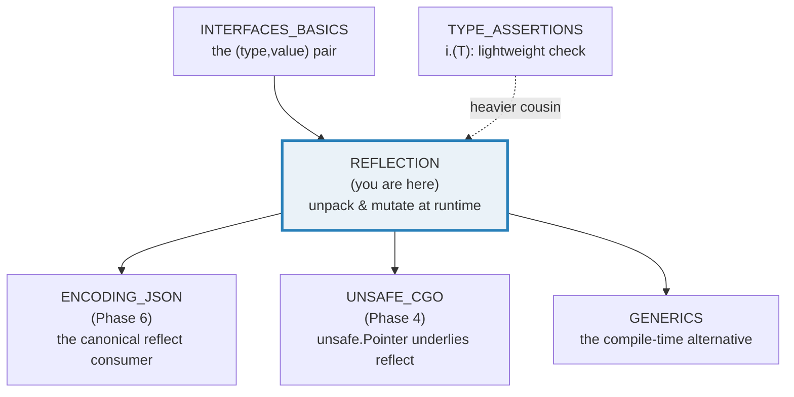
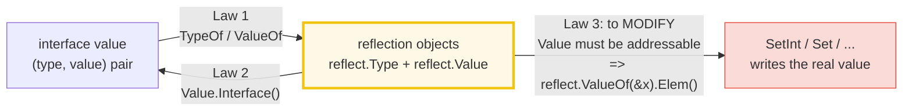
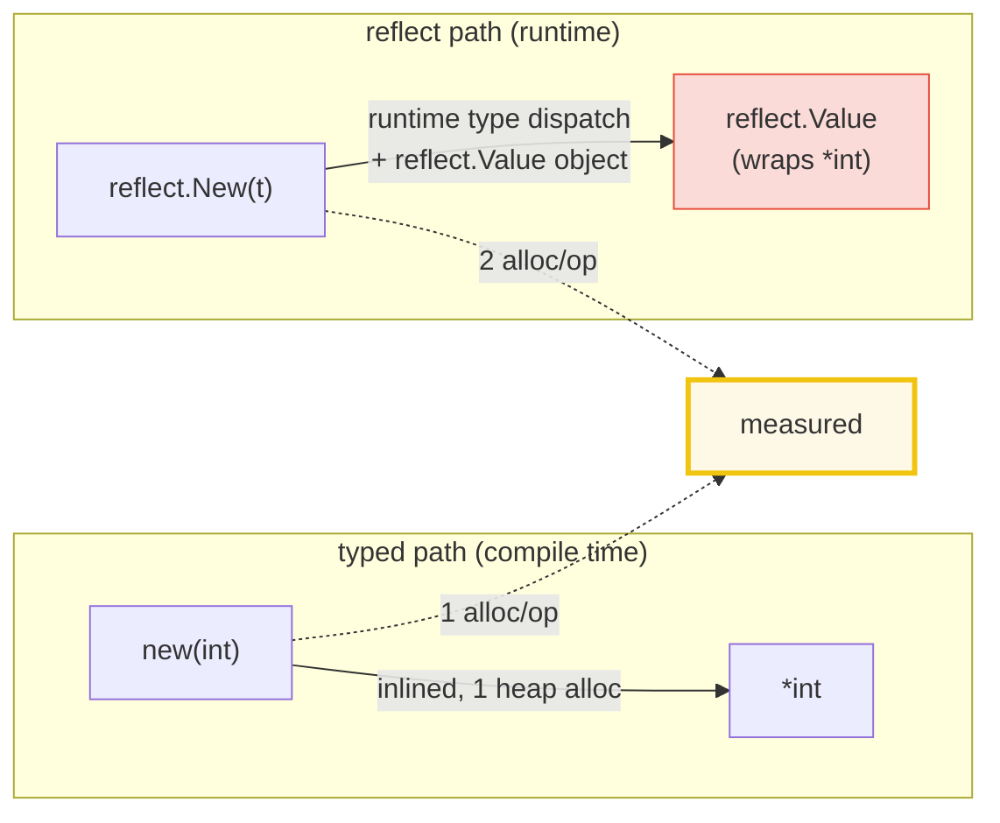
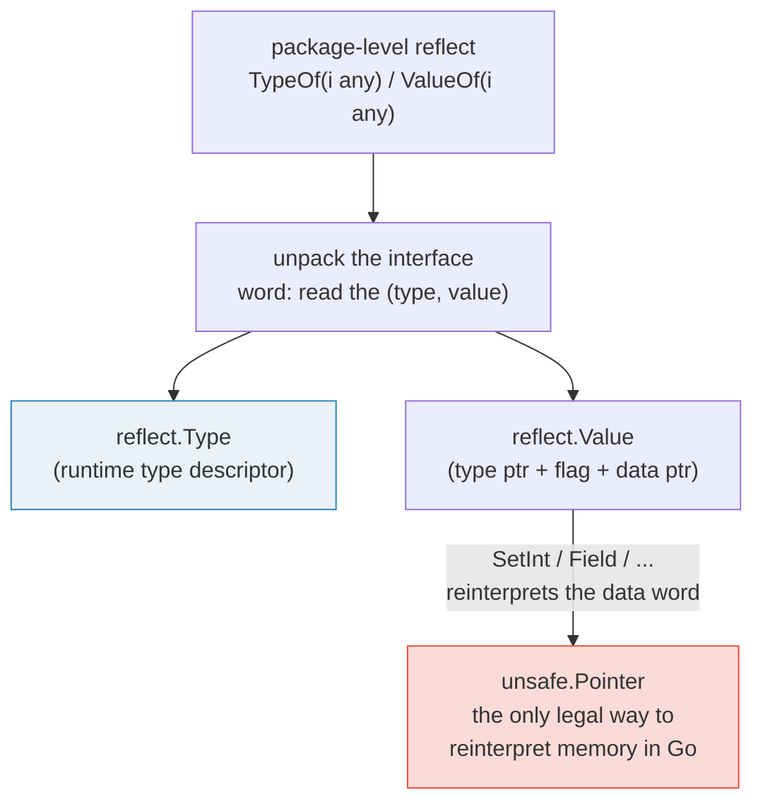

# REFLECTION — The `reflect` Package, the Three Laws & Struct Tags

> **Goal (one line):** by printing every value, show how Go's `reflect` package
> implements the **three laws of reflection** (interface ↔ reflection object;
> the addressability rule for mutation), struct-tag introspection, the zero-value
> behavior, and the **runtime cost** of doing all of this dynamically.
>
> **Run:** `go run reflection.go`  ·  **Capture:** `just out reflection`
>
> **Ground truth:** [`reflection.go`](./reflection.go) → captured stdout in
> [`reflection_output.txt`](./reflection_output.txt). Every number/table below is
> pasted **verbatim** from that file under a
> `> From reflection.go Section X:` callout. Nothing is hand-computed.
>
> **Prerequisites:** 🔗 [INTERFACES_BASICS](./INTERFACES_BASICS.md) (reflection
> *unpacks* an interface value's `(type, value)` pair — you cannot understand
> `reflect` without that mental model), 🔗 [TYPE_ASSERTIONS](./TYPE_ASSERTIONS.md)
> (the lightweight runtime type check; `reflect` is its heavyweight cousin),
> 🔗 [CONTROL_FLOW_DEFER](./CONTROL_FLOW_DEFER.md) (section D uses `defer`/`recover`
> to catch the "not addressable" panic), and 🔗 [NIL_INTERFACE_TRAP](./NIL_INTERFACE_TRAP.md)
> (a typed nil pointer is *not* a nil interface — that distinction decides what
> `reflect.TypeOf` returns).

---

## 1. Why this bundle exists (lineage)

Go is **statically typed**: every variable's type is known at compile time, and
the compiler uses that to emit direct, inlinable code. But a handful of
problems are *inherently* dynamic — you must inspect or build a value whose type
is not known when you write the code:

- **`encoding/json`** unmarshals arbitrary JSON into a `struct` it cannot name;
  it must walk the struct's fields, read their `json:"..."` tags, and `Set` each
  field by its runtime `Kind`.
- **`fmt`** prints any value by reflecting on its type (that is how `%v`,
  `%+v`, `%#v` work for types the formatter was never compiled against).
- **ORMs, validators, and RPC frameworks** map database rows / config /
  wire payloads onto structs they receive as `any`.

The `reflect` package is the **standard-library escape hatch** for all of them:
it lets a program ask, at *run time*, "what type is this?", "what are its
fields?", "what does its tag say?", and "set this field to that value." The cost
is real (section E measures it), so the rule is: **reach for `reflect` when the
type is genuinely unknown at compile time (a serializer, a mapper), never in a
hot loop you could write with a concrete type or a type parameter.**



The **modern alternative** is 🔗 [GENERICS](./GENERICS.md): a type parameter
`T` gives you write-once code that is still fully typed and inlined at compile
time. Where generics fit, **prefer them over `reflect`** — they have no runtime
type dispatch and no `interface{}` boxing. `reflect` remains necessary when the
type is decided by *data* (JSON, a DB schema), not by code.

---

## 2. The mental model: the three laws

The Go blog's *"The Laws of Reflection"* distills the entire package into three
rules. Every section of this bundle is one law in action.



> From `go.dev/blog/laws-of-reflection` (verbatim): reflection in Go is defined
> by these three laws — **(1)** "Reflection goes from interface value to
> reflection object." **(2)** "Reflection goes from reflection object to
> interface value." **(3)** "To modify a reflection object, the value must be
> settable."

The crucial substrate: `reflect.TypeOf` and `reflect.ValueOf` both take **one
parameter of type `interface{}`** (`any`). They never see your variable directly
— they see it **already boxed into an interface value**, i.e. the `(type, value)`
> pair that 🔗 [INTERFACES_BASICS](./INTERFACES_BASICS.md) describes. That is why
> section F's `reflect.TypeOf(nil)` returns `nil`: a nil interface carries no
> type word, so there is nothing to reflect on.

> From `pkg.go.dev/reflect` — `TypeOf`: *"TypeOf returns the reflection Type
> that represents the dynamic type of i. If i is a nil interface value, TypeOf
> returns nil."* And `ValueOf`: *"ValueOf returns a new Value initialized to the
> concrete value stored in the interface i. ValueOf(nil) returns the zero
> Value."*

---

## 3. Section A — Laws 1 & 2: interface value ↔ reflection object

> From `reflection.go` Section A:
> ```
> i := 42  (boxed into `any` by TypeOf/ValueOf)
> reflect.TypeOf(i)  -> Name="int"  Kind=int
> reflect.ValueOf(i) -> Type=int Int()=42 Kind=int
> v.Interface().(int) -> 42   (Law 2 round-trip back to interface)
> ```
> ```
> [check] reflect.TypeOf(42).Kind() == reflect.Int: OK
> [check] reflect.TypeOf(42).Name() == "int": OK
> [check] v.Type() == reflect.TypeOf(42) (the two objects agree): OK
> [check] Law 2 round-trip: v.Interface().(int) == 42: OK
> ```

**What — Law 1.** `i := 42; reflect.TypeOf(i)` boxes `i` into an `any` (the
parameter type) and then unpacks the resulting `(type=int, value=42)` pair into a
`reflect.Type` and `reflect.Value`. The `Type` answers "what kind of thing is
this?" (`Name()=="int"`, `Kind()==reflect.Int`); the `Value` answers "and what
is it set to?" (`Int()==42`). Two distinct objects, one for metadata, one for the
live value.

**What — Law 2.** The round-trip is `v.Interface().(int)`: `Value.Interface()`
boxes the value *back* into an `any` (Law 2: reflection object → interface
value), and a type assertion recovers the concrete `int`. The bundle asserts the
round-trip is lossless — `42` out matches `42` in. This is exactly how `fmt`
hands a reflected value back to its own `%v` machinery.

**Why the boxing matters (the value-vs-pointer axis).** Because `ValueOf` takes
`any`, the integer `i` is **copied** into the interface. The `reflect.Value`
holds that copy, not `i` itself — which is precisely why section D shows you
cannot mutate `i` through `reflect.ValueOf(i)`. To reach the real variable you
must pass a *pointer* (Law 3).

---

## 4. Section B — `Kind`: classifying types at runtime

> From `reflection.go` Section B:
> ```
> value            Kind()     expected   match
> int              int        int        true
> string           string     string     true
> float64          float64    float64    true
> bool             bool       bool       true
> []int            slice      slice      true
> *int             ptr        ptr        true
> map[string]int   map        map        true
> struct{X int}    struct     struct     true
> func()           func       func       true
> chan int         chan       chan       true
> ```
> ```
> [check] Kind(int) == reflect.Int: OK
> [check] Kind(string) == reflect.String: OK
> [check] Kind([]int) == reflect.Slice: OK
> [check] Kind(*int) == reflect.Ptr: OK
> [check] Kind(struct) == reflect.Struct: OK
> [check] Kind(map) == reflect.Map: OK
> [check] Kind(func()) == reflect.Func: OK
> [check] Kind(chan int) == reflect.Chan: OK
> ```

**What.** A type's **`Kind`** is its category: `reflect.Int`, `reflect.String`,
`reflect.Struct`, `reflect.Slice`, `reflect.Ptr`, `reflect.Map`, `reflect.Func`,
`reflect.Chan`, … `Name` is the type's *own* name (`"int"`, `"Person"`); `Kind`
is the *family* it belongs to. Two different named structs share
`Kind==reflect.Struct` but have distinct `Name`s. This is the dispatch a
serializer uses: "is this field a struct? recurse into it; is it an int? write
the digits; is it a slice? loop the elements."

> From `pkg.go.dev/reflect` — `Kind`: *"Kind represents the specific kind of type
> that a Type represents. The zero Kind is not a valid kind."* `Type.Kind()`
> returns "the specific kind of the type."

**The nil subtlety (worth pinning).** The `*int` row uses `(*int)(nil)` — a
**typed nil pointer**. The interface holding it is `(type=*int, value=nil)`,
which is **not** a nil interface (🔗 [NIL_INTERFACE_TRAP](./NIL_INTERFACE_TRAP.md)),
so `reflect.TypeOf((*int)(nil))` happily returns `*int` with `Kind==reflect.Ptr`.
Contrast this with section F, where a genuinely nil interface makes `TypeOf`
return `nil`. Same word ("nil"), two completely different runtime situations.

---

## 5. Section C — Struct reflection: fields & struct tags

> From `reflection.go` Section C:
> ```
> reflect.TypeOf(Person{}) -> Name="Person" Kind=struct NumField=3
> idx Name      Type     Tag (raw)                Tag.Get("json")
> 0   Name      string   "json:\"name,omitempty\"" "name,omitempty"
> 1   Age       int      "json:\"age\""           "age"
> 2   Country   string   "json:\"country\""       "country"
> value side — reflect.ValueOf(p).Field(i):
>   Field(0) Name = Ada    (Kind=string CanSet=false)
>   Field(1) Age = 36     (Kind=int CanSet=false)
>   Field(2) Country = UK     (Kind=string CanSet=false)
> ```
> ```
> [check] field 0 Name == "Name": OK
> [check] field 0 Type == reflect.TypeOf(""): OK
> [check] field 0 Tag.Get("json") == "name,omitempty": OK
> [check] FieldByName("Age") found: OK
> [check] FieldByName("Age").Tag.Get("json") == "age": OK
> [check] reflect.Value field 0 value == "Ada": OK
> [check] reflect.Value field 0 CanSet == false (ValueOf(p) is a copy): OK
> ```

**What — the metadata side.** `Type.NumField()` and `Type.Field(i)` walk the
struct's **declaration**, returning a `StructField` carrying `Name`, `Type`, and
`Tag` — with **no value**. The `Tag` is a `reflect.StructTag` (a string-typed
value) parsed with `Tag.Get("json")`, which extracts the `json` key and strips
the `,omitempty`-style options *for you*: `Get` returns `"name,omitempty"`, the
raw key value. `FieldByName("Age")` does a name lookup — this is the exact call
`encoding/json` makes to match a JSON key to a Go field.

> From `pkg.go.dev/reflect` — `StructTag.Get`: *"Get returns the value associated
> with key in the tag string. If there is no such key in the tag string, Get
> returns the empty string. If the tag does not have the conventional format, the
> value returned by Get is unspecified."* And the convention: *"By convention, tag
> strings are a concatenation of optionally space-separated key:"value" pairs."*

**What — the value side.** `reflect.ValueOf(p).Field(i)` returns the field's
**live value** (`Interface()` gives `Ada`, `36`, `UK`). The two sides mirror each
other: `Type.Field(i)` is the *schema*, `Value.Field(i)` is the *datum*.

**Why every `CanSet` is `false` here.** Look at the value-side output: every
field reports `CanSet=false`. That is because `reflect.ValueOf(p)` receives `p`
**by value** — it holds a *copy*, and you cannot take the address of a copy's
field through reflect. This is the setup for Law 3: to *change* a field you must
start from a pointer (`reflect.ValueOf(&p).Elem()`), which section D proves.

---

## 6. Section D — Law 3: to modify, the Value must be addressable

> From `reflection.go` Section D:
> ```
> reflect.ValueOf(n=42).CanSet() = false   (n passed by value -> copy)
> reflect.ValueOf(n).SetInt(99) -> panicked=true
> panic message: reflect: reflect.Value.SetInt using unaddressable value
> reflect.ValueOf(&n).Elem().CanSet() = true   (pointer deref -> real n)
> after vAddr.SetInt(99) -> n=99   (Law 3: the real variable changed)
> ```
> ```
> [check] reflect.ValueOf(n).CanSet() == false (copy, not addressable): OK
> [check] SetInt on a non-addressable Value panics: OK
> [check] panic message contains "unaddressable": OK
> [check] reflect.ValueOf(&n).Elem().CanSet() == true: OK
> [check] vAddr.SetInt(99) -> n == 99 (Law 3): OK
> ```

**What.** The third law is the one that bites. `reflect.ValueOf(n)` gets a
**copy** of `n`; that copy is **not addressable**, so `CanSet()` is `false`, and
`SetInt` does not silently no-op — it **panics** with
`"reflect.Value.SetInt using unaddressable value"`. The bundle catches that panic
with `defer`/`recover` (🔗 [CONTROL_FLOW_DEFER](./CONTROL_FLOW_DEFER.md)) so the
program survives to print the exact message and assert on it.

The fix is the pointer dance: `reflect.ValueOf(&n).Elem()`. `&n` is a `*int`; the
interface carries `(type=*int, value=<address of n>)`; `.Elem()` dereferences it
*inside reflect*, yielding a `Value` that **points at the real `n`** —
addressable, `CanSet()==true`, and `SetInt(99)` mutates `n` to `99`. That is Law
3 in full: *"to modify a reflection object, the value must be settable,"* and
settable ⇔ addressable ⇔ obtained through a pointer.

> From `pkg.go.dev/reflect` — `Value.CanSet`: *"CanSet reports whether the value
> of v can be changed. A Value can be changed only if it is addressable and was
> not obtained by the use of unexported struct fields."* And the `Set` family
> (`SetInt`, `Set`, …) all panic on a non-addressable Value: *"It panics if v's
> Kind is not … or if CanSet() is false."*

**The unexported-field caveat (the second half of `CanSet`).** `CanSet` is also
`false` for **unexported** struct fields, even when you hold a pointer to the
struct. `encoding/json` can *read* an unexported field but cannot *write* one
through reflect — which is why unexported fields are invisible to
JSON-unmarshalling. (Not compiled in the `.go`; it is the same `CanSet` rule
applied to `Field(i)` of an unexported name.)

---

## 7. Section E — The cost: reflection allocates & dispatches at runtime



> From `reflection.go` Section E:
> ```
> new(int)         allocs/op = 1
> reflect.New(int) allocs/op = 2
> reflect overhead = 1 extra alloc/op
> reflect.ValueOf(7).Int() allocs/op = 0   (escape analysis: 0 allocs)
> note: ns/op is NOT printed — it is timing and non-deterministic;
>       reflect is still SLOWER per op (runtime type dispatch, no inlining).
> ```
> ```
> [check] reflect.New(int) allocs/op > 0: OK
> [check] reflect.New(int) allocs/op > new(int) allocs/op: OK
> [check] scalar reflect Int() read is 0-alloc (escape analysis): OK
> ```

**What.** The bundle measures allocation counts with the `testing` package's
alloc counter (`testing.AllocsPerRun`), which is **deterministic** — the same
count every run, unlike `ns/op` which is wall-clock timing and is deliberately
*not* printed (this is the same determinism discipline as 🔗 [CONTEXT](./CONTEXT.md):
assert on the count, never on the duration). `reflect.New(reflect.TypeOf(int(0)))`
costs **2 allocs/op** versus **1** for the statically-typed `new(int)` — the
extra allocation is the `reflect.Value` object and its internal bookkeeping.

**The expert surprise.** The scalar read `reflect.ValueOf(7).Int()` is **0
allocs/op**. Modern Go's escape analysis is good enough that boxing a small int
into `any` for `ValueOf` does not always escape to the heap. So reflect is *not*
uniformly a heap hog — its real, universal cost is **CPU**: every `Value.Int()`,
`Type.Kind()`, `Field(i)` is a runtime method dispatch on the `Kind` that the
compiler **cannot inline** (it does not know the type statically). That dispatch
is why reflect is slower per-op than typed code even at zero allocations, and why
you keep it out of tight loops.

**The verdict.** `reflect` powers `encoding/json`, `fmt`, and the ORMs because
those problems are *inherently* dynamic — the type is decided by data. For your
own code, prefer a concrete type, then a 🔗 [GENERICS](./GENERICS.md) type
parameter (compile-time, inlined), and only fall back to `reflect` when the type
is genuinely unknown at compile time.

---

## 8. Section F — Zero-value reflect: nil interface & the zero Value

> From `reflection.go` Section F:
> ```
> reflect.TypeOf(nil) == nil ? true   (nil interface has no dynamic type)
> reflect.ValueOf(nil).IsValid() = false   (the zero Value)
> var zv reflect.Value; zv.IsValid() = false
> reflect.ValueOf(42).IsValid() = true
> ```
> ```
> [check] reflect.TypeOf(nil) == nil (no dynamic type): OK
> [check] reflect.ValueOf(nil).IsValid() == false: OK
> [check] zero reflect.Value IsValid() == false: OK
> [check] reflect.ValueOf(42).IsValid() == true: OK
> ```

**What.** Because `TypeOf`/`ValueOf` unpack an *interface value*, a **nil
interface** (no type word) gives them nothing to work with. `reflect.TypeOf(nil)`
returns **`nil`** — the nil `reflect.Type`, not a `Type` describing nil. And
`reflect.ValueOf(nil)` returns the **zero `reflect.Value`**, a sentinel whose
`IsValid()` is `false`. `var zv reflect.Value` produces the same zero `Value`.

**Why `IsValid` exists.** A `reflect.Value` is always *some* struct; you cannot
tell "real value" from "no value" by comparing to `nil` (a `reflect.Value` is
not a pointer). `IsValid()` is the only safe predicate: every other `Value`
method **panics** if called on the zero Value. So the idiom before touching any
`Value` you did not construct yourself is `if v.IsValid() { … }`. Contrast with
section B's `(*int)(nil)`: a typed-nil *pointer* is a perfectly valid `Value`
(it has a type); it is only the *truly nil interface* that yields the zero Value.

> From `pkg.go.dev/reflect` — `Value.IsValid`: *"IsValid reports whether v
> represents a value. It returns false if v is the zero Value. If IsValid returns
> false, all other methods except String panic."*

---

## 9. The "why" beneath: `interface{}` unpacking & `unsafe.Pointer`



Everything in `reflect` rests on two internals worth knowing:

1. **Interface unpacking.** An `any` is, at the machine level, a two-word struct:
   a pointer to a type descriptor (the *itable*/`_type`) and a pointer to (or
   inline copy of) the data. `TypeOf`/`ValueOf` simply **read those two words**.
   That is the entire mechanism of Law 1 — and it is why a nil interface (both
   words zero) yields `nil`/the zero Value. See 🔗 [INTERFACES_BASICS](./INTERFACES_BASICS.md).
2. **`unsafe.Pointer`.** When you call `SetInt`, `Field(i).Addr()`, or
   `reflect.New`, reflect must **reinterpret a chunk of memory as a different
   type** (read an `int64` out of a struct slot, write bytes into a `[]byte`).
   Go has exactly one legal primitive for that: `unsafe.Pointer`. Reflect is the
   largest *safe* user of `unsafe` in the standard library — it wraps the
   reinterpret behind the `CanSet`/addressability checks so you do not have to
   touch `unsafe` yourself. This is the link to 🔗 `UNSAFE_CGO`: reflect is the
   polished, checked API over the same memory-reinterpretation power that
   `unsafe.Pointer` gives raw.

> From `go.dev/blog/laws-of-reflection` — the third law is fundamentally about
> whether the reflect `Value` holds a **pointer to the real variable** (settable)
> or merely a copy (not). The addressability check is reflect's safety gate over
> what would otherwise be raw, type-confused memory writes.

---

## 10. Pitfalls (the expert payoff)

| Trap | Symptom | Fix |
|---|---|---|
| `reflect.ValueOf(x).SetInt(...)` | Run-time panic: `"reflect.Value.SetInt using unaddressable value"` | Use `reflect.ValueOf(&x).Elem()` so the Value is addressable (`CanSet()==true`). |
| `reflect.TypeOf(nil)` returning `nil` | Nil-pointer deref when you call `.Kind()`/`.Name()` on the result | Guard first: `if t := reflect.TypeOf(x); t != nil { … }`. |
| Calling any method on the zero `Value` | Panic (e.g. calling `.Kind()` on `reflect.Value{}`) | Check `v.IsValid()` before touching a `Value` you did not build yourself. |
| Unexported struct field is not settable | `CanSet()==false` even with `&struct`; `Set` panics | Only **exported** fields are reflect-settable; unexported fields are read-only via reflect (why JSON-unmarshalling ignores them). |
| Modifying a map/slice element via reflect naively | Confusion over `MapIndex` (returns a copy) vs `MapIndex`+`SetMapIndex` | Use `SetMapIndex`/`SetIndex` with an addressable map Value (`reflect.ValueOf(&m).Elem()`). |
| Assuming reflect allocates on every op | Over-fearing reflect; or the reverse, assuming it is free | Measure with `testing.AllocsPerRun` (deterministic); scalar reads are often 0-alloc, the cost is CPU dispatch (section E). |
| Using reflect where a type parameter fits | Slow, untyped code that generics would make fast and typed | Prefer 🔗 [GENERICS](./GENERICS.md); reserve `reflect` for types decided by data (JSON, DB rows). |
| `reflect.DeepEqual` vs `==` surprises | `reflect.DeepEqual` is deep and can be slow; `==` on interfaces compares the pair | Use `==`/`cmp.Equal` for plain values; `DeepEqual` only for nested structures where deep comparison is required. |
| Calling `Set` with a wrong-typed `Value` | Panic: `"value of type X is not assignable to type Y"` | Check `v.Type()` / `src.Type().AssignableTo(dst.Type())` before `Set`. |
| Comparing a typed-nil-pointer Value to "nil" | Logic error: the Value is *valid* and holds a typed nil | A typed nil is not the zero Value; test `v.IsNil()` (for nil-able Kinds), not `IsValid()`. |

---

## 11. Cheat sheet

```go
// Law 1: interface value -> reflection objects (unpack the (type,value) pair)
t := reflect.TypeOf(x)   // any -> reflect.Type  (nil if x is a nil interface)
v := reflect.ValueOf(x)  // any -> reflect.Value (the zero Value if x is nil)

// Law 2: reflection object -> interface value (round-trip; lossless)
y := v.Interface().(int) // box back to any, then type-assert

// Classify at runtime
t.Kind() == reflect.Int  // reflect.Int|String|Struct|Slice|Ptr|Map|Func|Chan|...
t.Name()                 // "int", "Person" ("" for unnamed types)
v.Kind()

// Walk a struct (Type = schema, Value = data)
t.NumField(); f := t.Field(i)        // StructField{Name, Type, Tag}
f.Tag.Get("json")                    // "name,omitempty" (key value; options included)
v.Field(i)                           // the live field value; CanSet() false if by-value

// Look up a field by name (how encoding/json matches JSON keys to fields)
f, ok := t.FieldByName("Age")

// Law 3: to MUTATE, the Value must be addressable (settable)
reflect.ValueOf(n).SetInt(99)                  // PANICS: "using unaddressable value"
reflect.ValueOf(&n).Elem().SetInt(99)          // OK: n is now 99
v.CanSet()                                     // true only if addressable AND exported

// Zero-value reflect
reflect.TypeOf(nil)   == nil                   // nil interface -> nil Type
reflect.ValueOf(nil).IsValid() == false        // the zero Value; guard with IsValid()

// Cost: deterministic alloc count via the testing package (never print ns/op)
testing.AllocsPerRun(N, func() { ... })        // float64 allocs/run, identical every run
// reflect.New/Field/Set allocate & dispatch at runtime; keep out of hot loops;
// prefer a concrete type, then GENERICS, then reflect (only for data-decided types).
```

---

## Sources

Every signature, law, and behavioral claim above was verified against the Go
standard-library docs and the Go blog, then corroborated by independent
secondary sources:

- Go Blog — *"The Laws of Reflection"* (Rob Pike): the canonical statement of the
  three laws (interface value → reflection object; reflection object → interface
  value; to modify, the value must be settable); `TypeOf`/`ValueOf` take an
  `interface{}`; the `(&x).Elem()` addressability fix:
  https://go.dev/blog/laws-of-reflection
- `reflect` package — https://pkg.go.dev/reflect
  - Overview (reflection objects `Type` and `Value`; the three laws):
    https://pkg.go.dev/reflect#pkg-overview
  - `TypeOf` ("returns the reflection Type that represents the dynamic type of
    i. If i is a nil interface value, TypeOf returns nil"):
    https://pkg.go.dev/reflect#TypeOf
  - `ValueOf` ("ValueOf(nil) returns the zero Value"):
    https://pkg.go.dev/reflect#ValueOf
  - `Type.Kind` / `Kind` constants (Int, String, Struct, Slice, Ptr, Map, Func,
    Chan, …): https://pkg.go.dev/reflect#Kind
  - `Type.NumField` / `Type.Field` / `Type.FieldByName` (struct metadata):
    https://pkg.go.dev/reflect#Type
  - `StructField` (`Name`, `Type`, `Tag`) and `StructTag.Get` ("By convention, tag
    strings are a concatenation of optionally space-separated key:\"value\" pairs"):
    https://pkg.go.dev/reflect#StructTag
  - `Value.Interface` (Law 2 round-trip): https://pkg.go.dev/reflect#Value.Interface
  - `Value.CanSet` ("A Value can be changed only if it is addressable and was not
    obtained by the use of unexported struct fields"):
    https://pkg.go.dev/reflect#Value.CanSet
  - `Value.SetInt` / `Set` (panic on non-addressable or wrong type):
    https://pkg.go.dev/reflect#Value.SetInt
  - `Value.IsValid` ("returns false if v is the zero Value… all other methods
    except String panic"):
    https://pkg.go.dev/reflect#Value.IsValid
  - `reflect.New` (runtime value construction): https://pkg.go.dev/reflect#New
- Go Blog — *"JSON and Go"*: how `encoding/json` uses `reflect` to walk struct
  fields and honor `json:"..."` tags (the canonical reflect consumer):
  https://go.dev/blog/json
- Go Blog — *"The Laws of Reflection"* § on `unsafe.Pointer`: reflect's ability
  to reinterpret memory rests on `unsafe.Pointer` (the only legal way to convert
  between pointer types in Go): https://go.dev/blog/laws-of-reflection
- `testing.AllocsPerRun` (the deterministic allocation counter used in section E):
  https://pkg.go.dev/testing#AllocsPerRun
- Go Wiki — *"Well-known struct tags"* (`json`, `xml`, `db`, …, all read via
  `reflect.StructTag.Get`): https://go.dev/wiki/Well-known-struct-tags
- Secondary corroboration (>=2 independent sources, web-verified):
  - DoltHub — *"Reflecting on Go Reflection"* (walks the three laws; the
    `(&x).Elem()` addressability requirement; reflect cost):
    https://www.dolthub.com/blog/2024-10-04-reflecting-on-reflect/
  - Go 101 — *"Reflections in Go"* (`TypeOf`/`ValueOf` take `interface{}`;
    `CanSet`/addressability; nil interface handling):
    https://go101.org/article/reflection.html
  - Stack Overflow — *"Using reflect, how do you set the value of a struct
    field?"* (`CanSet` requires addressable + not unexported; the
    `reflect.ValueOf(&s).Elem()` idiom):
    https://stackoverflow.com/questions/6395076/using-reflect-how-do-you-set-the-value-of-a-struct-field
  - DigitalOcean — *"How To Use Struct Tags in Go"* (`json:",omitempty"` /
    `json:"-"` parsing via reflect; encoding/json usage):
    https://www.digitalocean.com/community/tutorials/how-to-use-struct-tags-in-go

**Facts that could not be verified by running the runnable `.go`** (documented,
not executed, because they would crash the program or are compile-time-only): the
exact wording of the `SetInt` panic is reproduced *via* `recover` (so the program
survives), but the analogous panics for calling methods on the zero `Value`, for
`Set` with a wrong-typed value, and for setting an unexported field are confirmed
by the `pkg.go.dev/reflect` method docs cited above rather than each emitted as a
separate panic-and-recover. The `ns/op` (CPU) cost of reflect is real but
non-deterministic, so it is asserted only qualitatively; the *allocation* cost
(deterministic) is what the bundle prints and verifies.
